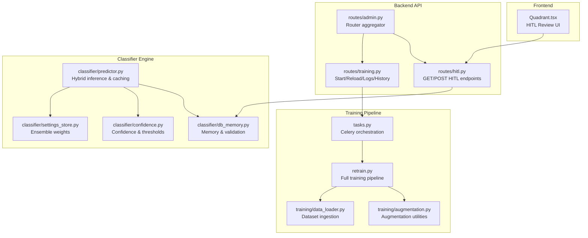
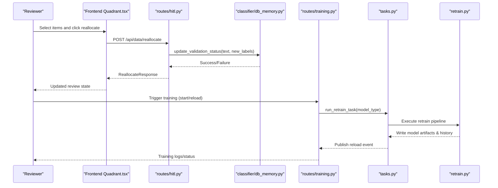
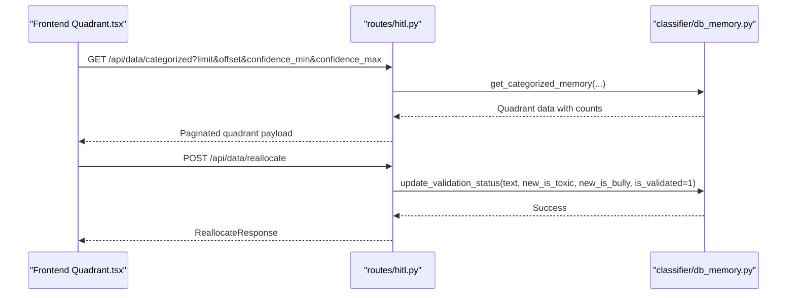
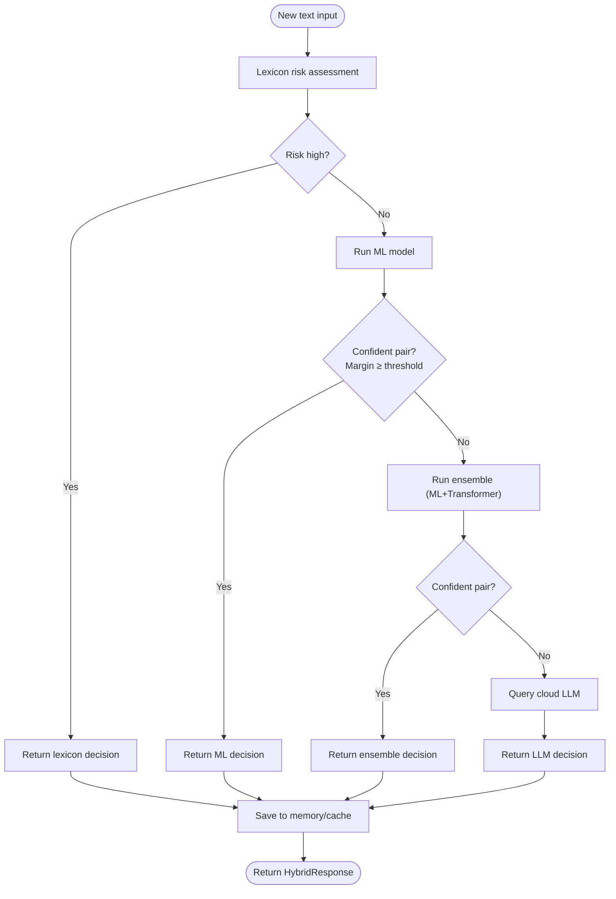
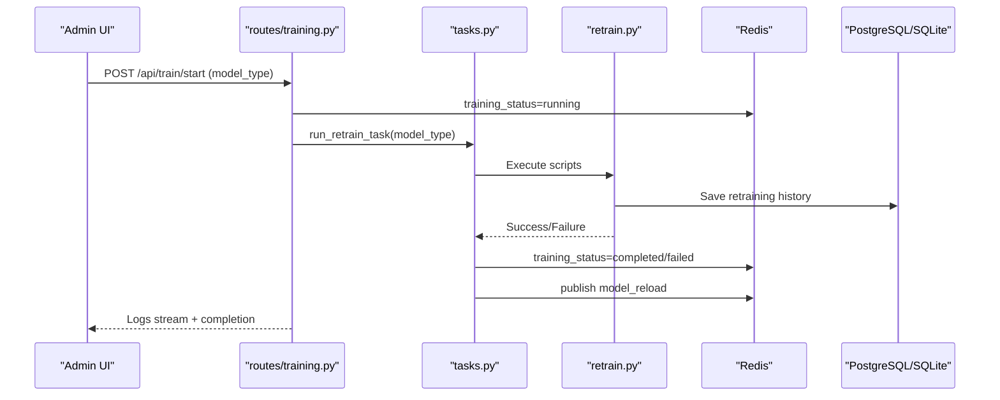
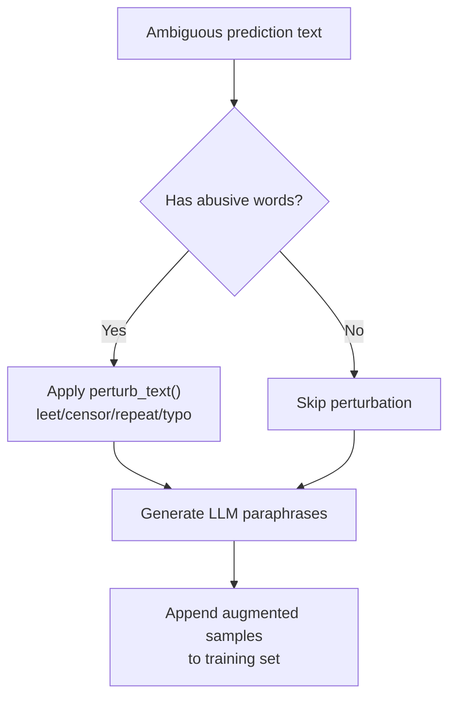
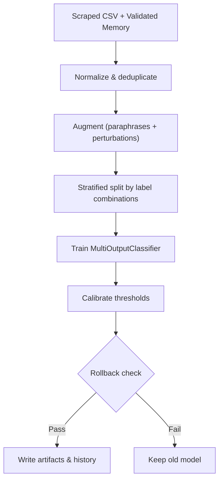
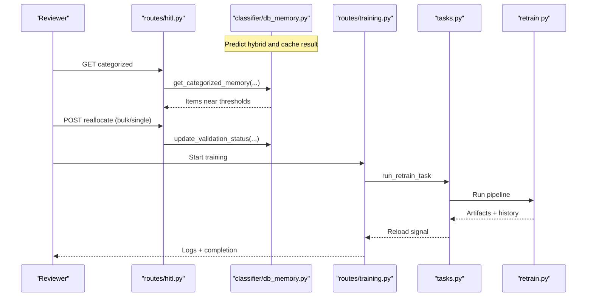
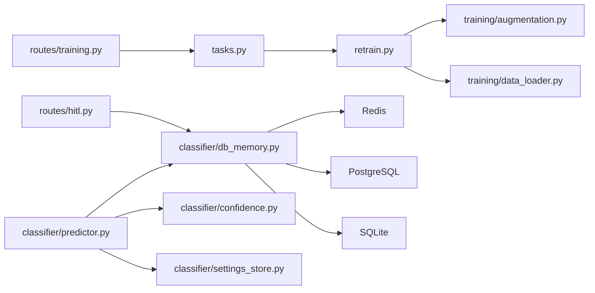
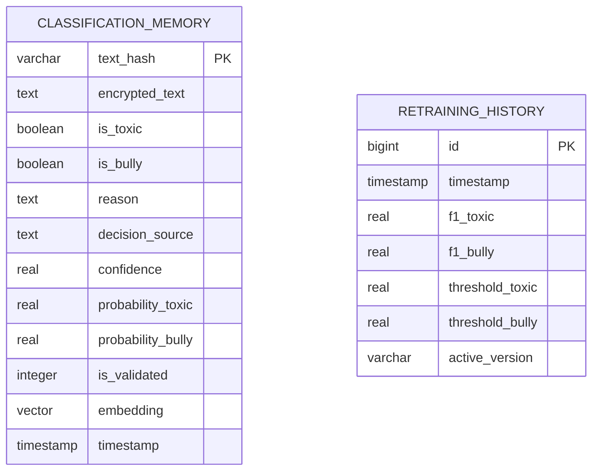

# Active Learning System

<cite>
**Referenced Files in This Document**
- [hitl.py](file://cyberbullying_api/routes/hitl.py)
- [predictor.py](file://cyberbullying_api/classifier/predictor.py)
- [db_memory.py](file://cyberbullying_api/classifier/db_memory.py)
- [training.py](file://cyberbullying_api/routes/training.py)
- [augmentation.py](file://cyberbullying_api/training/augmentation.py)
- [data_loader.py](file://cyberbullying_api/training/data_loader.py)
- [retrain.py](file://cyberbullying_api/retrain.py)
- [tasks.py](file://cyberbullying_api/tasks.py)
- [models.py](file://cyberbullying_api/models.py)
- [confidence.py](file://cyberbullying_api/classifier/confidence.py)
- [settings_store.py](file://cyberbullying_api/classifier/settings_store.py)
- [Quadrant.tsx](file://frontend/src/components/ActiveLearning/Quadrant.tsx)
</cite>

## Table of Contents
1. [Introduction](#introduction)
2. [Project Structure](#project-structure)
3. [Core Components](#core-components)
4. [Architecture Overview](#architecture-overview)
5. [Detailed Component Analysis](#detailed-component-analysis)
6. [Dependency Analysis](#dependency-analysis)
7. [Performance Considerations](#performance-considerations)
8. [Troubleshooting Guide](#troubleshooting-guide)
9. [Conclusion](#conclusion)
10. [Appendices](#appendices)

## Introduction
This document describes BullyGuard ID’s active learning system designed to enhance human-in-the-loop (HITL) validation workflows. It explains how ambiguous predictions are routed to human reviewers, how training data is managed and augmented, and how model improvements are orchestrated. The system balances automated processing with human oversight through confidence thresholds, ambiguity handling, and a structured review interface. It also documents the HITL review interface, training record tracking, quality assurance mechanisms, and the integration between classification results, admin workflows, and model updates.

## Project Structure
The active learning system spans backend APIs, classification logic, training orchestration, and a frontend HITL interface:
- Backend API routes expose HITL review and training controls
- Classification engine performs hybrid inference with confidence-aware routing
- Training pipeline ingests labeled data, augments it, and retrains models with rollback safety
- Frontend provides a quadrant-based HITL interface for reallocation

**Diagram sources**
- [hitl.py:1-84](file://cyberbullying_api/routes/hitl.py#L1-L84)
- [training.py:1-259](file://cyberbullying_api/routes/training.py#L1-L259)
- [predictor.py:1-639](file://cyberbullying_api/classifier/predictor.py#L1-L639)
- [db_memory.py:1-756](file://cyberbullying_api/classifier/db_memory.py#L1-L756)
- [confidence.py:1-221](file://cyberbullying_api/classifier/confidence.py#L1-L221)
- [settings_store.py:1-73](file://cyberbullying_api/classifier/settings_store.py#L1-L73)
- [augmentation.py:1-197](file://cyberbullying_api/training/augmentation.py#L1-L197)
- [data_loader.py:1-385](file://cyberbullying_api/training/data_loader.py#L1-L385)
- [retrain.py:1-513](file://cyberbullying_api/retrain.py#L1-L513)
- [tasks.py:1-95](file://cyberbullying_api/tasks.py#L1-L95)
- [Quadrant.tsx:1-262](file://frontend/src/components/ActiveLearning/Quadrant.tsx#L1-L262)

**Section sources**
- [hitl.py:1-84](file://cyberbullying_api/routes/hitl.py#L1-L84)
- [training.py:1-259](file://cyberbullying_api/routes/training.py#L1-L259)
- [predictor.py:1-639](file://cyberbullying_api/classifier/predictor.py#L1-L639)
- [db_memory.py:1-756](file://cyberbullying_api/classifier/db_memory.py#L1-L756)
- [confidence.py:1-221](file://cyberbullying_api/classifier/confidence.py#L1-L221)
- [settings_store.py:1-73](file://cyberbullying_api/classifier/settings_store.py#L1-L73)
- [augmentation.py:1-197](file://cyberbullying_api/training/augmentation.py#L1-L197)
- [data_loader.py:1-385](file://cyberbullying_api/training/data_loader.py#L1-L385)
- [retrain.py:1-513](file://cyberbullying_api/retrain.py#L1-L513)
- [tasks.py:1-95](file://cyberbullying_api/tasks.py#L1-L95)
- [Quadrant.tsx:1-262](file://frontend/src/components/ActiveLearning/Quadrant.tsx#L1-L262)

## Core Components
- Human-in-the-loop (HITL) endpoints for categorized data retrieval, single reallocation, and bulk reallocation
- Hybrid classification pipeline with confidence-aware routing across lexicon, ML, ensemble, and cloud LLM tiers
- Training orchestration with data ingestion, augmentation, calibration, and rollback safety
- HITL review interface with quadrant-based categorization and reallocation actions
- Training record tracking and performance history persistence

**Section sources**
- [hitl.py:14-84](file://cyberbullying_api/routes/hitl.py#L14-L84)
- [predictor.py:308-440](file://cyberbullying_api/classifier/predictor.py#L308-L440)
- [training.py:29-178](file://cyberbullying_api/routes/training.py#L29-L178)
- [Quadrant.tsx:105-262](file://frontend/src/components/ActiveLearning/Quadrant.tsx#L105-L262)
- [db_memory.py:676-755](file://cyberbullying_api/classifier/db_memory.py#L676-L755)

## Architecture Overview
The system integrates frontend HITL review with backend classification and training:
- Frontend renders ambiguous predictions in quadrants and allows reallocation actions
- Backend routes ambiguous predictions to human review and persists validated labels
- Training pipeline ingests validated data, augments it, retrains models, and publishes reload signals
- Redis tracks training status and model reload events; PostgreSQL/SQLite persist classification memory and training history

**Diagram sources**
- [hitl.py:51-84](file://cyberbullying_api/routes/hitl.py#L51-L84)
- [db_memory.py:588-674](file://cyberbullying_api/classifier/db_memory.py#L588-L674)
- [training.py:29-178](file://cyberbullying_api/routes/training.py#L29-L178)
- [tasks.py:26-82](file://cyberbullying_api/tasks.py#L26-L82)
- [retrain.py:426-490](file://cyberbullying_api/retrain.py#L426-L490)

## Detailed Component Analysis

### Human-in-the-Loop Validation Workflow
- Endpoint for retrieving categorized, ambiguous predictions grouped by toxicity/bullying quadrants
- Single and bulk reallocation endpoints update validation status and confidence
- Frontend UI supports drag-and-drop reallocation with immediate feedback

**Diagram sources**
- [hitl.py:14-45](file://cyberbullying_api/routes/hitl.py#L14-L45)
- [hitl.py:51-84](file://cyberbullying_api/routes/hitl.py#L51-L84)
- [db_memory.py:460-586](file://cyberbullying_api/classifier/db_memory.py#L460-L586)
- [db_memory.py:588-674](file://cyberbullying_api/classifier/db_memory.py#L588-L674)
- [Quadrant.tsx:105-262](file://frontend/src/components/ActiveLearning/Quadrant.tsx#L105-L262)

**Section sources**
- [hitl.py:14-84](file://cyberbullying_api/routes/hitl.py#L14-L84)
- [db_memory.py:460-674](file://cyberbullying_api/classifier/db_memory.py#L460-L674)
- [Quadrant.tsx:1-262](file://frontend/src/components/ActiveLearning/Quadrant.tsx#L1-L262)

### Hybrid Classification and Confidence Routing
- Multi-tier inference: lexicon → ML → ensemble → cloud LLM fallback
- Confidence-aware routing determines when to escalate to higher tiers
- Cached classification memory reduces latency and supports semantic cache lookups

**Diagram sources**
- [predictor.py:308-440](file://cyberbullying_api/classifier/predictor.py#L308-L440)
- [confidence.py:72-109](file://cyberbullying_api/classifier/confidence.py#L72-L109)
- [db_memory.py:17-124](file://cyberbullying_api/classifier/db_memory.py#L17-L124)

**Section sources**
- [predictor.py:308-440](file://cyberbullying_api/classifier/predictor.py#L308-L440)
- [confidence.py:1-221](file://cyberbullying_api/classifier/confidence.py#L1-L221)
- [db_memory.py:17-124](file://cyberbullying_api/classifier/db_memory.py#L17-L124)

### Training Pipeline Orchestration and Automated Retraining
- Admin endpoints start training, stream logs, and show history
- Celery task runs retraining scripts and publishes reload signals
- Retraining ingests validated data, augments, calibrates thresholds, and applies rollback safety
- Settings store manages ensemble weights persisted in Redis and local file

**Diagram sources**
- [training.py:29-178](file://cyberbullying_api/routes/training.py#L29-L178)
- [tasks.py:26-82](file://cyberbullying_api/tasks.py#L26-L82)
- [retrain.py:426-490](file://cyberbullying_api/retrain.py#L426-L490)
- [db_memory.py:676-705](file://cyberbullying_api/classifier/db_memory.py#L676-L705)
- [settings_store.py:33-73](file://cyberbullying_api/classifier/settings_store.py#L33-L73)

**Section sources**
- [training.py:1-259](file://cyberbullying_api/routes/training.py#L1-L259)
- [tasks.py:1-95](file://cyberbullying_api/tasks.py#L1-L95)
- [retrain.py:1-513](file://cyberbullying_api/retrain.py#L1-L513)
- [settings_store.py:1-73](file://cyberbullying_api/classifier/settings_store.py#L1-L73)

### Data Augmentation Techniques
- LLM-based paraphrasing augmentation using a Gemini-compatible endpoint
- Rule-based perturbations (leet speak, censor, typo, repetition) targeting abusive words
- Templates for sarcasm and slang-praise patterns to balance class distributions

**Diagram sources**
- [augmentation.py:90-144](file://cyberbullying_api/training/augmentation.py#L90-L144)
- [augmentation.py:147-197](file://cyberbullying_api/training/augmentation.py#L147-L197)
- [retrain.py:198-255](file://cyberbullying_api/retrain.py#L198-L255)

**Section sources**
- [augmentation.py:1-197](file://cyberbullying_api/training/augmentation.py#L1-L197)
- [retrain.py:198-255](file://cyberbullying_api/retrain.py#L198-L255)

### Training Data Management and Quality Assurance
- Ingestion from scraped CSV files and validated classification memory
- Deduplication and normalization of text
- Oversampling validated records and stratified train/test splits
- Automatic rollback if new model performance degrades significantly
- Persistent training history with thresholds and active version tracking

**Diagram sources**
- [data_loader.py:155-303](file://cyberbullying_api/training/data_loader.py#L155-L303)
- [retrain.py:329-380](file://cyberbullying_api/retrain.py#L329-L380)
- [retrain.py:420-425](file://cyberbullying_api/retrain.py#L420-L425)
- [db_memory.py:676-705](file://cyberbullying_api/classifier/db_memory.py#L676-L705)

**Section sources**
- [data_loader.py:1-385](file://cyberbullying_api/training/data_loader.py#L1-L385)
- [retrain.py:329-490](file://cyberbullying_api/retrain.py#L329-L490)
- [db_memory.py:676-705](file://cyberbullying_api/classifier/db_memory.py#L676-L705)

### Practical Active Learning Cycle Example
- Ambiguous prediction enters classification pipeline and is cached
- Admin retrieves categorized items and reviews ambiguous cases
- Reviewer reallocated items to correct categories
- Retraining pipeline ingests validated data, augments, retrains, and publishes reload
- New model hot-reloads and improves accuracy

**Diagram sources**
- [predictor.py:421-440](file://cyberbullying_api/classifier/predictor.py#L421-L440)
- [hitl.py:14-84](file://cyberbullying_api/routes/hitl.py#L14-L84)
- [db_memory.py:460-674](file://cyberbullying_api/classifier/db_memory.py#L460-L674)
- [training.py:29-178](file://cyberbullying_api/routes/training.py#L29-L178)
- [tasks.py:26-82](file://cyberbullying_api/tasks.py#L26-L82)
- [retrain.py:426-490](file://cyberbullying_api/retrain.py#L426-L490)

**Section sources**
- [predictor.py:421-440](file://cyberbullying_api/classifier/predictor.py#L421-L440)
- [hitl.py:14-84](file://cyberbullying_api/routes/hitl.py#L14-L84)
- [db_memory.py:460-674](file://cyberbullying_api/classifier/db_memory.py#L460-L674)
- [training.py:29-178](file://cyberbullying_api/routes/training.py#L29-L178)
- [tasks.py:26-82](file://cyberbullying_api/tasks.py#L26-L82)
- [retrain.py:426-490](file://cyberbullying_api/retrain.py#L426-L490)

## Dependency Analysis
Key dependencies and coupling:
- Routes depend on classifier modules for memory and validation
- Training depends on augmentation and data loader utilities
- Redis provides distributed status and settings synchronization
- PostgreSQL/SQLite persist classification memory and training history

**Diagram sources**
- [hitl.py:1-84](file://cyberbullying_api/routes/hitl.py#L1-L84)
- [db_memory.py:1-756](file://cyberbullying_api/classifier/db_memory.py#L1-L756)
- [training.py:1-259](file://cyberbullying_api/routes/training.py#L1-L259)
- [tasks.py:1-95](file://cyberbullying_api/tasks.py#L1-L95)
- [retrain.py:1-513](file://cyberbullying_api/retrain.py#L1-L513)
- [augmentation.py:1-197](file://cyberbullying_api/training/augmentation.py#L1-L197)
- [data_loader.py:1-385](file://cyberbullying_api/training/data_loader.py#L1-L385)
- [predictor.py:1-639](file://cyberbullying_api/classifier/predictor.py#L1-L639)
- [confidence.py:1-221](file://cyberbullying_api/classifier/confidence.py#L1-L221)
- [settings_store.py:1-73](file://cyberbullying_api/classifier/settings_store.py#L1-L73)

**Section sources**
- [hitl.py:1-84](file://cyberbullying_api/routes/hitl.py#L1-L84)
- [training.py:1-259](file://cyberbullying_api/routes/training.py#L1-L259)
- [predictor.py:1-639](file://cyberbullying_api/classifier/predictor.py#L1-L639)
- [db_memory.py:1-756](file://cyberbullying_api/classifier/db_memory.py#L1-L756)
- [augmentation.py:1-197](file://cyberbullying_api/training/augmentation.py#L1-L197)
- [data_loader.py:1-385](file://cyberbullying_api/training/data_loader.py#L1-L385)
- [retrain.py:1-513](file://cyberbullying_api/retrain.py#L1-L513)
- [tasks.py:1-95](file://cyberbullying_api/tasks.py#L1-L95)
- [confidence.py:1-221](file://cyberbullying_api/classifier/confidence.py#L1-L221)
- [settings_store.py:1-73](file://cyberbullying_api/classifier/settings_store.py#L1-L73)

## Performance Considerations
- Confidence margin and threshold calibration reduce unnecessary escalations
- Cached classification memory and semantic cache minimize repeated computation
- Asynchronous training with streaming logs enables long-running jobs without blocking
- Stratified sampling and oversampling improve robustness for imbalanced datasets
- Rollback safety prevents regressions from impacting production

[No sources needed since this section provides general guidance]

## Troubleshooting Guide
Common issues and remedies:
- Training already running: Check Redis/Celery status and avoid duplicate starts
- Reallocation failures: Verify text hashing and encryption/decryption keys
- Classification cache misses: Confirm Redis connectivity and fallback to PostgreSQL/SQLite
- Low model performance: Inspect training logs, thresholds, and recent validation data

**Section sources**
- [training.py:34-61](file://cyberbullying_api/routes/training.py#L34-L61)
- [db_memory.py:17-124](file://cyberbullying_api/classifier/db_memory.py#L17-L124)
- [retrain.py:420-425](file://cyberbullying_api/retrain.py#L420-L425)

## Conclusion
BullyGuard ID’s active learning system integrates automated classification with human-in-the-loop validation and continuous model improvement. Through confidence-aware routing, structured HITL workflows, and robust training orchestration with augmentation and rollback safety, the system maintains high accuracy while preserving human oversight. The frontend quadrant interface streamlines reviewer tasks, and persistent training history ensures traceability and accountability.

[No sources needed since this section summarizes without analyzing specific files]

## Appendices

### Database Schema for Training Records, Validation Workflows, and Performance Tracking
- classification_memory: stores text hash, encrypted text, predicted labels, reasons, decision source, confidence, probabilities, validation flag, optional embeddings
- retraining_history: captures F1 scores, thresholds, and active version metadata

**Diagram sources**
- [db_memory.py:54-79](file://cyberbullying_api/classifier/db_memory.py#L54-L79)
- [db_memory.py:676-705](file://cyberbullying_api/classifier/db_memory.py#L676-L705)

### HITL Review Interface Details
- Quadrant-based layout organizes items by toxicity/bullying outcomes
- Checkbox selection and reallocation buttons enable quick corrections
- Drag-and-drop support for moving items across quadrants
- Confidence indicators and decision source metadata aid review decisions

**Section sources**
- [Quadrant.tsx:1-262](file://frontend/src/components/ActiveLearning/Quadrant.tsx#L1-L262)

### API Definitions for HITL and Training
- GET /api/data/categorized: filters and paginates ambiguous predictions
- POST /api/data/reallocate: single reallocation update
- POST /api/data/reallocate/bulk: bulk reallocation
- POST /api/train/start: start training with model type
- POST /api/train/reload: manually reload models
- GET /api/train/logs: stream training logs
- GET /api/train/history: training history with pagination

**Section sources**
- [hitl.py:14-84](file://cyberbullying_api/routes/hitl.py#L14-L84)
- [training.py:29-259](file://cyberbullying_api/routes/training.py#L29-L259)
- [models.py:196-220](file://cyberbullying_api/models.py#L196-L220)