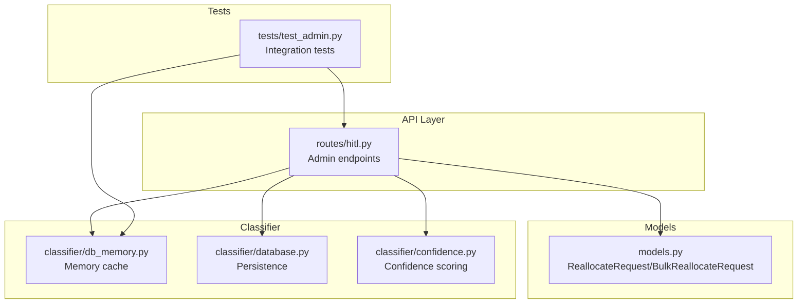
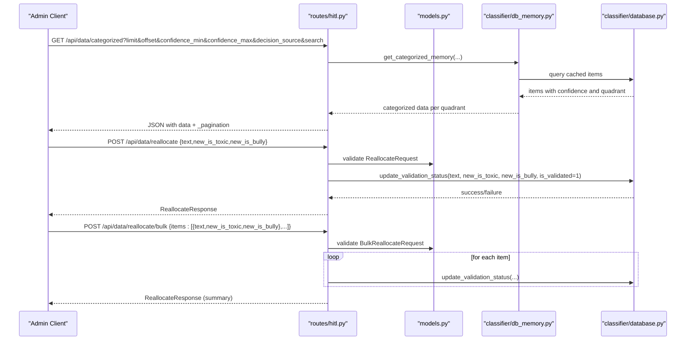
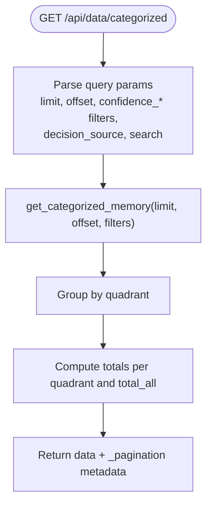
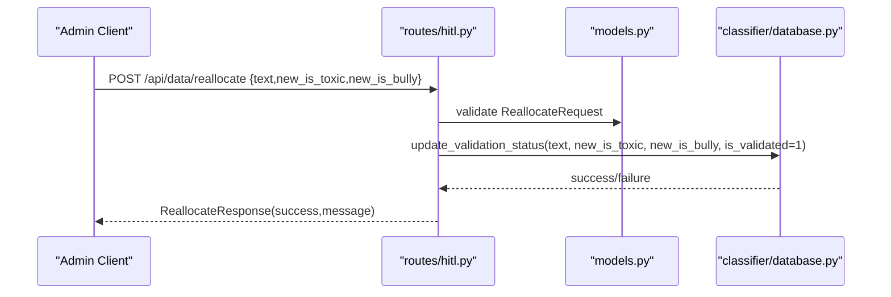
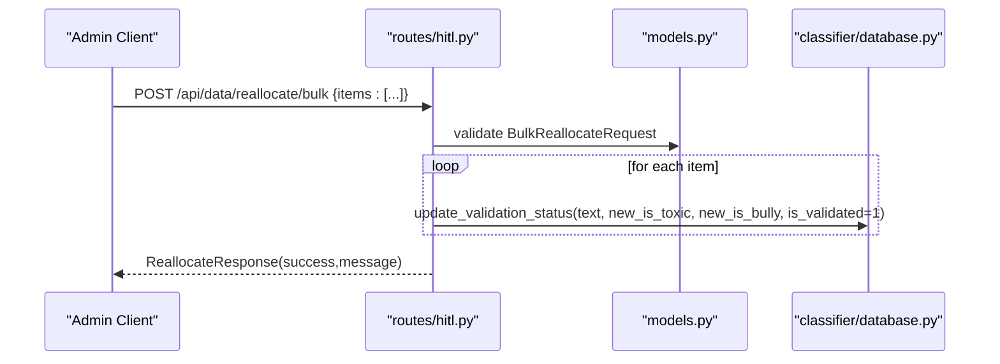
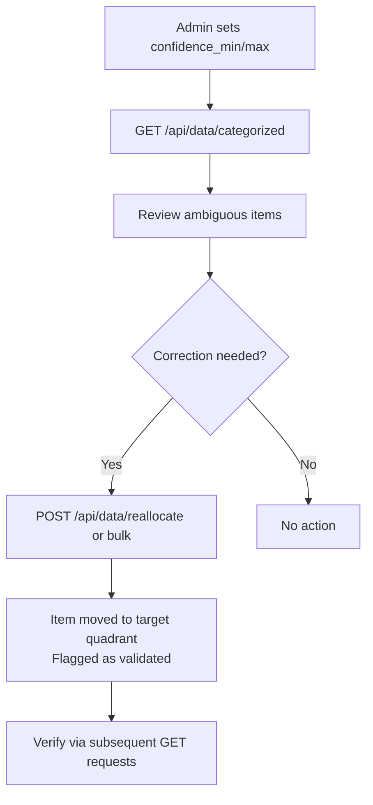
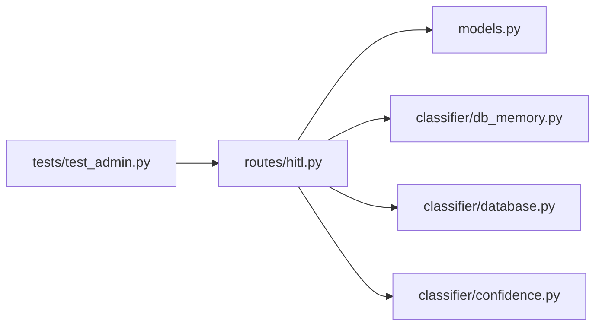

# Human-in-the-Loop Validation Workflow

<cite>
**Referenced Files in This Document**
- [hitl.py](file://cyberbullying_api/routes/hitl.py)
- [models.py](file://cyberbullying_api/models.py)
- [database.py](file://cyberbullying_api/classifier/database.py)
- [db_memory.py](file://cyberbullying_api/classifier/db_memory.py)
- [confidence.py](file://cyberbullying_api/classifier/confidence.py)
- [test_admin.py](file://cyberbullying_api/tests/test_admin.py)
- [SKILL.md](file://.agents/skills/cyberbullying-detector/SKILL.md)
</cite>

## Table of Contents
1. [Introduction](#introduction)
2. [Project Structure](#project-structure)
3. [Core Components](#core-components)
4. [Architecture Overview](#architecture-overview)
5. [Detailed Component Analysis](#detailed-component-analysis)
6. [Dependency Analysis](#dependency-analysis)
7. [Performance Considerations](#performance-considerations)
8. [Troubleshooting Guide](#troubleshooting-guide)
9. [Conclusion](#conclusion)

## Introduction
This document describes the human-in-the-loop (HITL) validation workflow for classifying cyberbullying content. It covers how ambiguous predictions are surfaced to human reviewers, how validation status is tracked, and how administrators can review and correct classifications. It documents the endpoints for retrieving categorized data with confidence filters and pagination, and for applying single or bulk category corrections. It also explains the integration between classification confidence scores and human review thresholds, and provides practical examples of the validation workflow from ambiguous prediction display to final category assignment.

## Project Structure
The HITL workflow spans several modules:
- Routes expose REST endpoints under /api for admin users
- Models define request/response schemas for validation operations
- Classifier modules handle data retrieval, caching, and persistence of validation decisions
- Tests validate endpoint behavior and data movement across categories

**Diagram sources**
- [hitl.py:1-83](file://cyberbullying_api/routes/hitl.py#L1-L83)
- [models.py](file://cyberbullying_api/models.py)
- [db_memory.py](file://cyberbullying_api/classifier/db_memory.py)
- [database.py](file://cyberbullying_api/classifier/database.py)
- [confidence.py](file://cyberbullying_api/classifier/confidence.py)
- [test_admin.py:73-118](file://cyberbullying_api/tests/test_admin.py#L73-L118)

**Section sources**
- [hitl.py:1-83](file://cyberbullying_api/routes/hitl.py#L1-L83)
- [models.py](file://cyberbullying_api/models.py)
- [db_memory.py](file://cyberbullying_api/classifier/db_memory.py)
- [database.py](file://cyberbullying_api/classifier/database.py)
- [confidence.py](file://cyberbullying_api/classifier/confidence.py)
- [test_admin.py:73-118](file://cyberbullying_api/tests/test_admin.py#L73-L118)

## Core Components
- Admin-only endpoints for HITL operations
- Request/response models for single and bulk reallocation
- Confidence-aware data retrieval with pagination and filtering
- Validation status tracking and persistence
- Audit trail via validation markers

Key responsibilities:
- Expose GET /api/data/categorized for admins to review ambiguous predictions
- Expose POST /api/data/reallocate for single corrections
- Expose POST /api/data/reallocate/bulk for batch corrections
- Persist validation decisions and update classification quadrants
- Integrate confidence thresholds to identify ambiguous predictions

**Section sources**
- [hitl.py:11-83](file://cyberbullying_api/routes/hitl.py#L11-L83)
- [models.py](file://cyberbullying_api/models.py)
- [db_memory.py](file://cyberbullying_api/classifier/db_memory.py)
- [database.py](file://cyberbullying_api/classifier/database.py)
- [confidence.py](file://cyberbullying_api/classifier/confidence.py)

## Architecture Overview
The HITL workflow integrates FastAPI routes, request models, and classifier modules. Administrators filter and paginate through categorized items, apply corrections, and observe immediate updates in the classification quadrants.

**Diagram sources**
- [hitl.py:14-83](file://cyberbullying_api/routes/hitl.py#L14-L83)
- [models.py](file://cyberbullying_api/models.py)
- [db_memory.py](file://cyberbullying_api/classifier/db_memory.py)
- [database.py](file://cyberbullying_api/classifier/database.py)

## Detailed Component Analysis

### Admin Access Control
- All HITL endpoints are protected and require the "admin" scope
- Authentication middleware enforces access control before route handlers execute

Practical implication:
- Only authenticated users with admin privileges can access categorized data and apply corrections

**Section sources**
- [hitl.py:11-11](file://cyberbullying_api/routes/hitl.py#L11-L11)

### GET /api/data/categorized
Purpose:
- Retrieve classified items organized by quadrant (e.g., toxic_bully, non_toxic_non_bully)
- Apply confidence filters and free-text search
- Paginate results with limit/offset and include pagination metadata

Parameters:
- limit: number of items per quadrant (default set in endpoint)
- offset: pagination offset
- confidence_min, confidence_max: confidence score bounds
- decision_source: filter by source of the decision
- search: substring match on text content

Response:
- JSON object with keys representing quadrants
- Pagination metadata: limit, offset, total_fetched, per_quadrant, has_more

Processing logic:
- Calls into the memory cache to fetch items meeting filters
- Computes totals per quadrant and overall count
- Returns structured data plus pagination info

**Diagram sources**
- [hitl.py:14-45](file://cyberbullying_api/routes/hitl.py#L14-L45)
- [db_memory.py](file://cyberbullying_api/classifier/db_memory.py)

**Section sources**
- [hitl.py:14-45](file://cyberbullying_api/routes/hitl.py#L14-L45)

### POST /api/data/reallocate
Purpose:
- Apply a single correction to an existing classification

Request model:
- ReallocateRequest: text, new_is_toxic, new_is_bully

Behavior:
- Validates request payload
- Updates validation status for the given text
- Marks the item as validated (is_validated=1)
- Returns a standardized response indicating success

**Diagram sources**
- [hitl.py:51-63](file://cyberbullying_api/routes/hitl.py#L51-L63)
- [models.py](file://cyberbullying_api/models.py)
- [database.py](file://cyberbullying_api/classifier/database.py)

**Section sources**
- [hitl.py:51-63](file://cyberbullying_api/routes/hitl.py#L51-L63)
- [models.py](file://cyberbullying_api/models.py)

### POST /api/data/reallocate/bulk
Purpose:
- Apply corrections to multiple texts in a single operation

Request model:
- BulkReallocateRequest: array of items, each with text, new_is_toxic, new_is_bully

Behavior:
- Validates request payload
- Iterates through items and updates validation status for each
- Aggregates partial successes and returns a summary response

**Diagram sources**
- [hitl.py:65-83](file://cyberbullying_api/routes/hitl.py#L65-L83)
- [models.py](file://cyberbullying_api/models.py)
- [database.py](file://cyberbullying_api/classifier/database.py)

**Section sources**
- [hitl.py:65-83](file://cyberbullying_api/routes/hitl.py#L65-L83)
- [models.py](file://cyberbullying_api/models.py)

### Data Models: ReallocateRequest and BulkReallocateRequest
- ReallocateRequest: defines a single correction with text and boolean flags for toxicity and bullying
- BulkReallocateRequest: defines a list of such corrections

Validation characteristics:
- Requests are validated before processing
- Empty text or invalid lists are rejected by validators

**Section sources**
- [models.py](file://cyberbullying_api/models.py)
- [test_admin.py:92-103](file://cyberbullying_api/tests/test_admin.py#L92-L103)

### Validation Status Tracking and Audit Trail
- On successful reallocation, items are marked as validated
- Tests confirm that after reallocation, items appear in the appropriate quadrant and are flagged as validated
- This establishes an audit trail of human-reviewed corrections

Evidence:
- Test verifies item moves from initial quadrant to target quadrant after reallocation
- Test asserts the validated flag is set post-correction

**Section sources**
- [test_admin.py:73-118](file://cyberbullying_api/tests/test_admin.py#L73-L118)

### Integration Between Classification Confidence Scores and Review Thresholds
- Confidence-aware retrieval allows filtering items whose predictions fall within ambiguous ranges
- Admins can narrow the dataset using confidence_min and confidence_max to focus on borderline cases
- Free-text search and decision_source filters further refine review workloads

Operational guidance:
- Set confidence_min and confidence_max to isolate predictions near decision boundaries
- Combine with decision_source and search to tailor review batches

**Section sources**
- [hitl.py:18-21](file://cyberbullying_api/routes/hitl.py#L18-L21)
- [confidence.py](file://cyberbullying_api/classifier/confidence.py)

### Practical Validation Workflow Example
Ambiguous prediction display to final category assignment:
1. Admin calls GET /api/data/categorized with confidence_min and confidence_max to surface borderline cases
2. Admin reviews items grouped by quadrant and applies corrections using POST /api/data/reallocate for single items or POST /api/data/reallocate/bulk for batches
3. After correction, the item is moved to the target quadrant and marked as validated
4. Subsequent queries reflect the corrected distribution and validated status

**Diagram sources**
- [hitl.py:14-83](file://cyberbullying_api/routes/hitl.py#L14-L83)
- [test_admin.py:73-118](file://cyberbullying_api/tests/test_admin.py#L73-L118)

**Section sources**
- [hitl.py:14-83](file://cyberbullying_api/routes/hitl.py#L14-L83)
- [test_admin.py:73-118](file://cyberbullying_api/tests/test_admin.py#L73-L118)

### Admin-Only Access Control
- All HITL endpoints are guarded by admin scope enforcement
- Authentication middleware ensures only authorized users can access validation features

**Section sources**
- [hitl.py:11-11](file://cyberbullying_api/routes/hitl.py#L11-L11)

### Data Filtering Capabilities
- Confidence range filters: confidence_min, confidence_max
- Decision source filter: decision_source
- Text search: search
- Pagination: limit, offset

These filters enable targeted review sessions and efficient workload distribution.

**Section sources**
- [hitl.py:16-21](file://cyberbullying_api/routes/hitl.py#L16-L21)

### Training and Validation Workflow Integration
- Corrected data can be used to retrain models as part of the validation-to-training pipeline
- The skill guide documents the end-to-end process from corrections to training initiation and status monitoring

**Section sources**
- [SKILL.md:85-91](file://.agents/skills/cyberbullying-detector/SKILL.md#L85-L91)

## Dependency Analysis
The HITL module depends on:
- Route layer for HTTP handling and admin scope enforcement
- Models for request validation
- Memory cache for fast retrieval of categorized items
- Database for persistence of validation decisions
- Confidence utilities for threshold-based filtering

**Diagram sources**
- [hitl.py:1-83](file://cyberbullying_api/routes/hitl.py#L1-L83)
- [models.py](file://cyberbullying_api/models.py)
- [db_memory.py](file://cyberbullying_api/classifier/db_memory.py)
- [database.py](file://cyberbullying_api/classifier/database.py)
- [confidence.py](file://cyberbullying_api/classifier/confidence.py)
- [test_admin.py:73-118](file://cyberbullying_api/tests/test_admin.py#L73-L118)

**Section sources**
- [hitl.py:1-83](file://cyberbullying_api/routes/hitl.py#L1-L83)
- [models.py](file://cyberbullying_api/models.py)
- [db_memory.py](file://cyberbullying_api/classifier/db_memory.py)
- [database.py](file://cyberbullying_api/classifier/database.py)
- [confidence.py](file://cyberbullying_api/classifier/confidence.py)
- [test_admin.py:73-118](file://cyberbullying_api/tests/test_admin.py#L73-L118)

## Performance Considerations
- Pagination: Use limit and offset to avoid large payloads; adjust limit based on UI rendering capacity
- Confidence filtering: Narrow confidence_min/max to reduce review volume and improve throughput
- Bulk operations: Prefer POST /api/data/reallocate/bulk for correcting multiple items to minimize round-trips
- Caching: Leverage memory cache for frequent reads during review sessions
- Indexing: Ensure database indices support confidence range queries and text search for optimal performance

## Troubleshooting Guide
Common issues and resolutions:
- 401/403 Unauthorized: Verify admin credentials and scope
- 422 Validation Error: Ensure request body matches ReallocateRequest or BulkReallocateRequest schema
- 500 Internal Server Error: Check backend logs for exceptions during reallocation or data retrieval
- Items not moving quadrants: Confirm validation succeeded and that filters are not excluding the items

Verification steps:
- Use GET /api/data/categorized to confirm item presence and quadrant
- Apply POST /api/data/reallocate and re-query to observe movement and validation flag
- For bulk operations, check the returned summary for partial successes

**Section sources**
- [hitl.py:46-48](file://cyberbullying_api/routes/hitl.py#L46-L48)
- [hitl.py:60-62](file://cyberbullying_api/routes/hitl.py#L60-L62)
- [hitl.py:81-83](file://cyberbullying_api/routes/hitl.py#L81-L83)
- [test_admin.py:73-118](file://cyberbullying_api/tests/test_admin.py#L73-L118)

## Conclusion
The HITL validation workflow provides a secure, confidence-aware mechanism for human review and correction of classifications. Admins can efficiently navigate ambiguous predictions, apply single or bulk corrections, and track validation outcomes. The integration with confidence thresholds and filtering enables scalable, targeted review sessions suitable for large datasets.