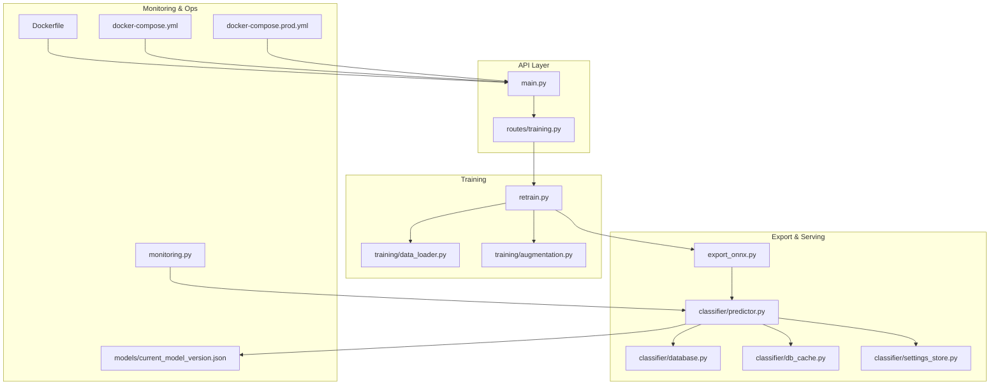
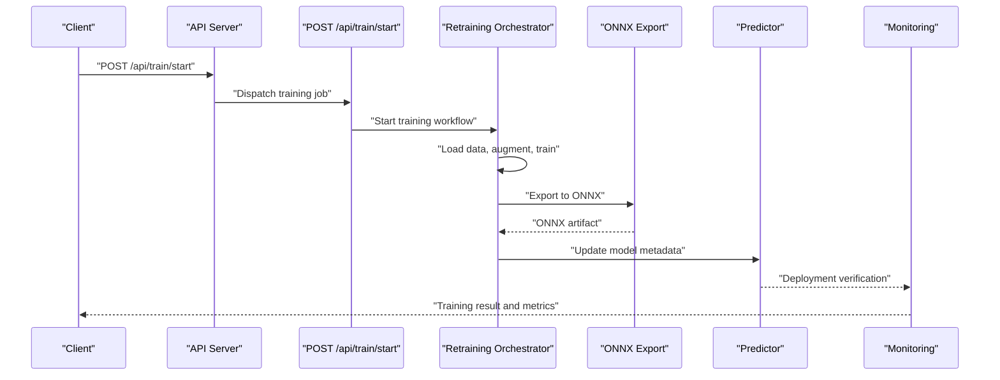
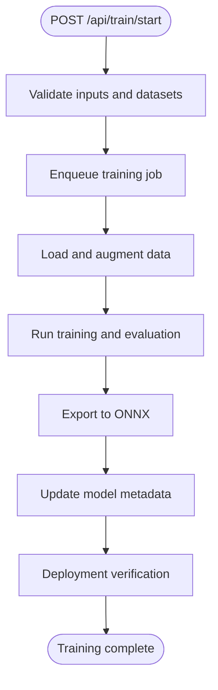
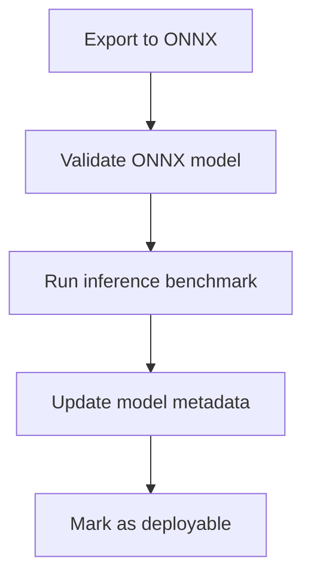
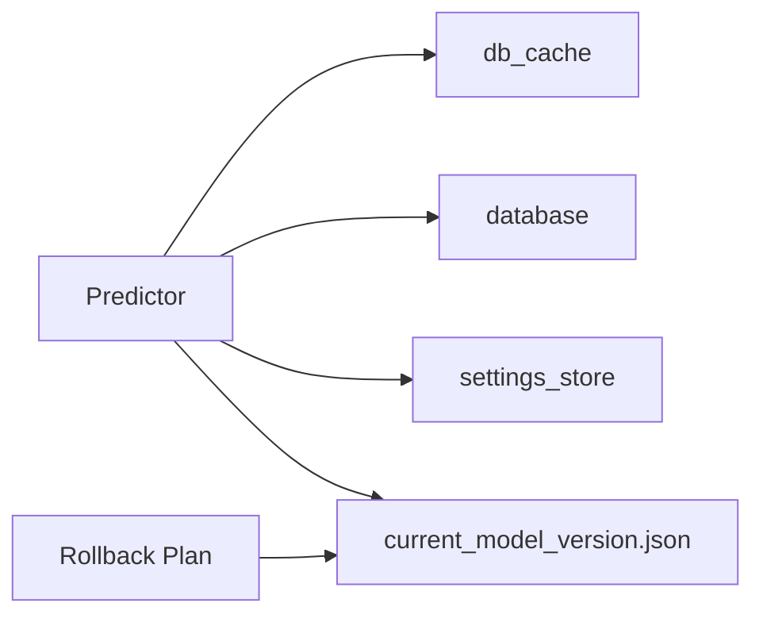
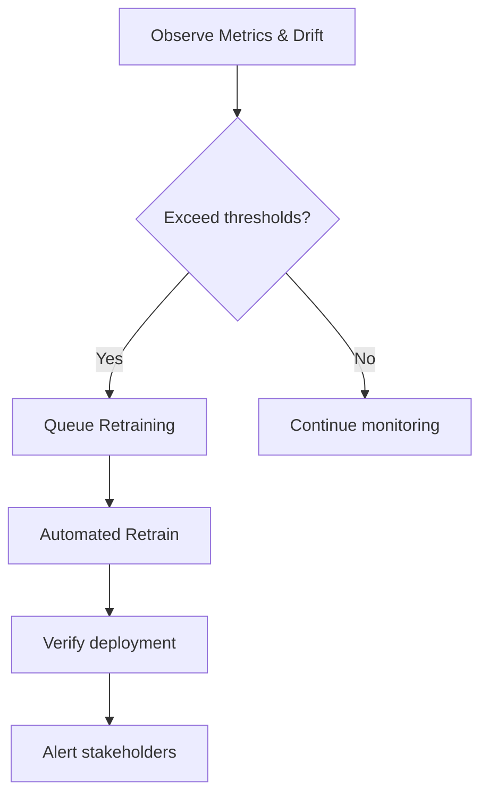
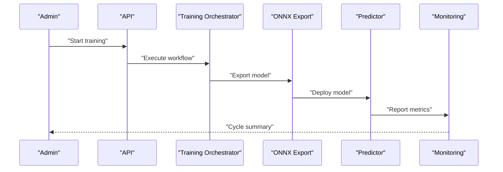
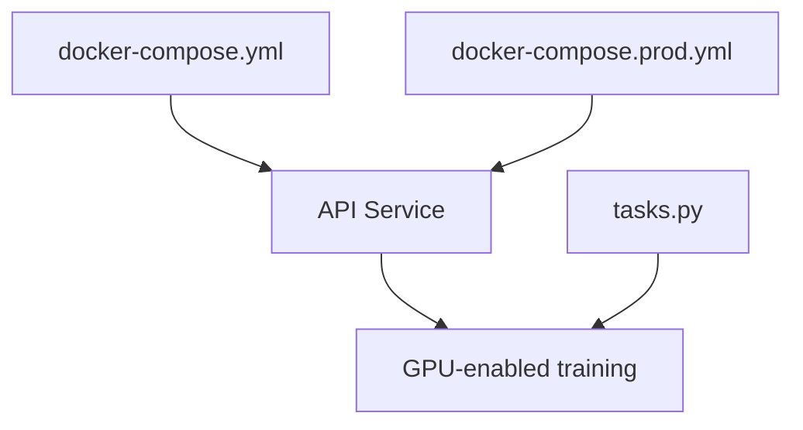
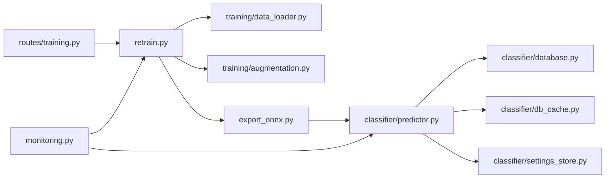

# Model Retraining and Deployment Pipeline

<cite>
**Referenced Files in This Document**
- [main.py](file://cyberbullying_api/main.py)
- [routes/training.py](file://cyberbullying_api/routes/training.py)
- [retrain.py](file://cyberbullying_api/retrain.py)
- [export_onnx.py](file://cyberbullying_api/export_onnx.py)
- [monitoring.py](file://cyberbullying_api/monitoring.py)
- [models/current_model_version.json](file://cyberbullying_api/models/current_model_version.json)
- [classifier/predictor.py](file://cyberbullying_api/classifier/predictor.py)
- [classifier/database.py](file://cyberbullying_api/classifier/database.py)
- [classifier/db_cache.py](file://cyberbullying_api/classifier/db_cache.py)
- [classifier/settings_store.py](file://cyberbullying_api/classifier/settings_store.py)
- [training/data_loader.py](file://cyberbullying_api/training/data_loader.py)
- [training/augmentation.py](file://cyberbullying_api/training/augmentation.py)
- [tasks.py](file://cyberbullying_api/tasks.py)
- [Dockerfile](file://cyberbullying_api/Dockerfile)
- [docker-compose.yml](file://docker-compose.yml)
- [docker-compose.prod.yml](file://docker-compose.prod.yml)
- [scripts/benchmark_inference.py](file://scripts/benchmark_inference.py)
- [docs/ROLLBACK_PLAN.md](file://docs/ROLLBACK_PLAN.md)
- [docs/FINAL_INTEGRATION_GUIDE.md](file://docs/FINAL_INTEGRATION_GUIDE.md)
</cite>

## Table of Contents
1. [Introduction](#introduction)
2. [Project Structure](#project-structure)
3. [Core Components](#core-components)
4. [Architecture Overview](#architecture-overview)
5. [Detailed Component Analysis](#detailed-component-analysis)
6. [Dependency Analysis](#dependency-analysis)
7. [Performance Considerations](#performance-considerations)
8. [Troubleshooting Guide](#troubleshooting-guide)
9. [Conclusion](#conclusion)
10. [Appendices](#appendices)

## Introduction
This document describes the end-to-end model retraining and deployment pipeline for the cyberbullying detection system. It covers training orchestration, job management, ONNX export and optimization, deployment verification, monitoring, rollback, and automated retraining triggers. It also documents the integration between training results and model serving, including A/B testing readiness, and the relationship between active learning feedback and retraining triggers.

## Project Structure
The pipeline spans backend services, training utilities, monitoring, and deployment configurations:
- API entrypoint and route registration
- Training orchestration and job management
- Retraining automation and ONNX export
- Monitoring and alerting
- Model metadata and serving integration
- Containerization and orchestration

**Diagram sources**
- [main.py](file://cyberbullying_api/main.py)
- [routes/training.py](file://cyberbullying_api/routes/training.py)
- [retrain.py](file://cyberbullying_api/retrain.py)
- [export_onnx.py](file://cyberbullying_api/export_onnx.py)
- [classifier/predictor.py](file://cyberbullying_api/classifier/predictor.py)
- [classifier/database.py](file://cyberbullying_api/classifier/database.py)
- [classifier/db_cache.py](file://cyberbullying_api/classifier/db_cache.py)
- [classifier/settings_store.py](file://cyberbullying_api/classifier/settings_store.py)
- [training/data_loader.py](file://cyberbullying_api/training/data_loader.py)
- [training/augmentation.py](file://cyberbullying_api/training/augmentation.py)
- [monitoring.py](file://cyberbullying_api/monitoring.py)
- [models/current_model_version.json](file://cyberbullying_api/models/current_model_version.json)
- [Dockerfile](file://cyberbullying_api/Dockerfile)
- [docker-compose.yml](file://docker-compose.yml)
- [docker-compose.prod.yml](file://docker-compose.prod.yml)

**Section sources**
- [main.py](file://cyberbullying_api/main.py)
- [routes/training.py](file://cyberbullying_api/routes/training.py)
- [retrain.py](file://cyberbullying_api/retrain.py)
- [export_onnx.py](file://cyberbullying_api/export_onnx.py)
- [classifier/predictor.py](file://cyberbullying_api/classifier/predictor.py)
- [classifier/database.py](file://cyberbullying_api/classifier/database.py)
- [classifier/db_cache.py](file://cyberbullying_api/classifier/db_cache.py)
- [classifier/settings_store.py](file://cyberbullying_api/classifier/settings_store.py)
- [training/data_loader.py](file://cyberbullying_api/training/data_loader.py)
- [training/augmentation.py](file://cyberbullying_api/training/augmentation.py)
- [monitoring.py](file://cyberbullying_api/monitoring.py)
- [models/current_model_version.json](file://cyberbullying_api/models/current_model_version.json)
- [Dockerfile](file://cyberbullying_api/Dockerfile)
- [docker-compose.yml](file://docker-compose.yml)
- [docker-compose.prod.yml](file://docker-compose.prod.yml)

## Core Components
- API entrypoint and route registration define the training orchestration surface.
- Training orchestration coordinates data loading, augmentation, model training, and export.
- Export pipeline produces optimized ONNX artifacts for serving.
- Model serving integrates with predictor, cache, and settings stores.
- Monitoring tracks performance and triggers automated retraining.
- Versioning and rollback plans ensure safe deployments.

**Section sources**
- [main.py](file://cyberbullying_api/main.py)
- [routes/training.py](file://cyberbullying_api/routes/training.py)
- [retrain.py](file://cyberbullying_api/retrain.py)
- [export_onnx.py](file://cyberbullying_api/export_onnx.py)
- [classifier/predictor.py](file://cyberbullying_api/classifier/predictor.py)
- [monitoring.py](file://cyberbullying_api/monitoring.py)
- [models/current_model_version.json](file://cyberbullying_api/models/current_model_version.json)

## Architecture Overview
The pipeline orchestrates training jobs via the API, executes training and export, updates model metadata, and verifies deployment readiness. Monitoring informs automated retraining triggers.

**Diagram sources**
- [routes/training.py](file://cyberbullying_api/routes/training.py)
- [retrain.py](file://cyberbullying_api/retrain.py)
- [export_onnx.py](file://cyberbullying_api/export_onnx.py)
- [classifier/predictor.py](file://cyberbullying_api/classifier/predictor.py)
- [monitoring.py](file://cyberbullying_api/monitoring.py)

## Detailed Component Analysis

### Training Orchestration and Job Management
- Endpoint: POST /api/train/start initiates training workflows.
- Responsibilities:
  - Validate training parameters and datasets.
  - Trigger data loading and augmentation.
  - Execute training loop and evaluation.
  - Persist model artifacts and metadata.
  - Publish training progress and outcomes.
- Job lifecycle:
  - Enqueue training job.
  - Stream progress to clients.
  - On completion, trigger export and deployment verification.

**Diagram sources**
- [routes/training.py](file://cyberbullying_api/routes/training.py)
- [retrain.py](file://cyberbullying_api/retrain.py)
- [export_onnx.py](file://cyberbullying_api/export_onnx.py)
- [models/current_model_version.json](file://cyberbullying_api/models/current_model_version.json)

**Section sources**
- [routes/training.py](file://cyberbullying_api/routes/training.py)
- [retrain.py](file://cyberbullying_api/retrain.py)
- [training/data_loader.py](file://cyberbullying_api/training/data_loader.py)
- [training/augmentation.py](file://cyberbullying_api/training/augmentation.py)

### ONNX Export and Deployment Preparation
- Export pipeline converts trained models to ONNX for inference optimization.
- Deployment preparation includes:
  - Artifact validation and benchmarking.
  - Model metadata update.
  - Serving readiness checks.
- Benchmarking script validates performance characteristics post-export.

**Diagram sources**
- [export_onnx.py](file://cyberbullying_api/export_onnx.py)
- [models/current_model_version.json](file://cyberbullying_api/models/current_model_version.json)
- [scripts/benchmark_inference.py](file://scripts/benchmark_inference.py)

**Section sources**
- [export_onnx.py](file://cyberbullying_api/export_onnx.py)
- [models/current_model_version.json](file://cyberbullying_api/models/current_model_version.json)
- [scripts/benchmark_inference.py](file://scripts/benchmark_inference.py)

### Model Serving Integration and Rollback
- Serving integrates with predictor, cache, and settings stores.
- Rollback plan ensures safe rollbacks to previous model versions.
- A/B testing readiness can be achieved by maintaining multiple model versions and routing strategies.

**Diagram sources**
- [classifier/predictor.py](file://cyberbullying_api/classifier/predictor.py)
- [classifier/db_cache.py](file://cyberbullying_api/classifier/db_cache.py)
- [classifier/database.py](file://cyberbullying_api/classifier/database.py)
- [classifier/settings_store.py](file://cyberbullying_api/classifier/settings_store.py)
- [models/current_model_version.json](file://cyberbullying_api/models/current_model_version.json)
- [docs/ROLLBACK_PLAN.md](file://docs/ROLLBACK_PLAN.md)

**Section sources**
- [classifier/predictor.py](file://cyberbullying_api/classifier/predictor.py)
- [classifier/db_cache.py](file://cyberbullying_api/classifier/db_cache.py)
- [classifier/database.py](file://cyberbullying_api/classifier/database.py)
- [classifier/settings_store.py](file://cyberbullying_api/classifier/settings_store.py)
- [models/current_model_version.json](file://cyberbullying_api/models/current_model_version.json)
- [docs/ROLLBACK_PLAN.md](file://docs/ROLLBACK_PLAN.md)

### Automated Retraining Triggers
- Triggers include:
  - Performance degradation thresholds.
  - Data drift detection signals.
  - Quality metric regressions.
- Monitoring module emits alerts and events consumed by the retraining orchestrator.
- Active learning feedback can feed drift and quality signals to trigger retraining.

**Diagram sources**
- [monitoring.py](file://cyberbullying_api/monitoring.py)
- [retrain.py](file://cyberbullying_api/retrain.py)

**Section sources**
- [monitoring.py](file://cyberbullying_api/monitoring.py)
- [retrain.py](file://cyberbullying_api/retrain.py)

### Practical Retraining Cycle Example
- Data validation: Ensure dataset integrity and label distributions.
- Training: Run training with configured hyperparameters and augmentations.
- Export: Convert to ONNX and benchmark inference.
- Deployment verification: Confirm serving readiness and performance targets.
- Monitoring: Track metrics and set up automated triggers for future cycles.

**Diagram sources**
- [routes/training.py](file://cyberbullying_api/routes/training.py)
- [retrain.py](file://cyberbullying_api/retrain.py)
- [export_onnx.py](file://cyberbullying_api/export_onnx.py)
- [classifier/predictor.py](file://cyberbullying_api/classifier/predictor.py)
- [monitoring.py](file://cyberbullying_api/monitoring.py)

**Section sources**
- [routes/training.py](file://cyberbullying_api/routes/training.py)
- [retrain.py](file://cyberbullying_api/retrain.py)
- [export_onnx.py](file://cyberbullying_api/export_onnx.py)
- [classifier/predictor.py](file://cyberbullying_api/classifier/predictor.py)
- [monitoring.py](file://cyberbullying_api/monitoring.py)

### Training Resource Management and GPU Utilization
- Containerization supports GPU-accelerated training environments.
- Compose configurations define development and production runtime environments.
- Tasks orchestration coordinates long-running training jobs.

**Diagram sources**
- [docker-compose.yml](file://docker-compose.yml)
- [docker-compose.prod.yml](file://docker-compose.prod.yml)
- [tasks.py](file://cyberbullying_api/tasks.py)
- [Dockerfile](file://cyberbullying_api/Dockerfile)

**Section sources**
- [docker-compose.yml](file://docker-compose.yml)
- [docker-compose.prod.yml](file://docker-compose.prod.yml)
- [tasks.py](file://cyberbullying_api/tasks.py)
- [Dockerfile](file://cyberbullying_api/Dockerfile)

## Dependency Analysis
The pipeline exhibits clear separation of concerns:
- Routes depend on retraining orchestrator.
- Retraining depends on data loader and augmentation.
- Export depends on trained model artifacts.
- Serving depends on predictor, cache, database, and settings.
- Monitoring depends on metrics and alerting systems.

**Diagram sources**
- [routes/training.py](file://cyberbullying_api/routes/training.py)
- [retrain.py](file://cyberbullying_api/retrain.py)
- [training/data_loader.py](file://cyberbullying_api/training/data_loader.py)
- [training/augmentation.py](file://cyberbullying_api/training/augmentation.py)
- [export_onnx.py](file://cyberbullying_api/export_onnx.py)
- [classifier/predictor.py](file://cyberbullying_api/classifier/predictor.py)
- [classifier/database.py](file://cyberbullying_api/classifier/database.py)
- [classifier/db_cache.py](file://cyberbullying_api/classifier/db_cache.py)
- [classifier/settings_store.py](file://cyberbullying_api/classifier/settings_store.py)
- [monitoring.py](file://cyberbullying_api/monitoring.py)

**Section sources**
- [routes/training.py](file://cyberbullying_api/routes/training.py)
- [retrain.py](file://cyberbullying_api/retrain.py)
- [training/data_loader.py](file://cyberbullying_api/training/data_loader.py)
- [training/augmentation.py](file://cyberbullying_api/training/augmentation.py)
- [export_onnx.py](file://cyberbullying_api/export_onnx.py)
- [classifier/predictor.py](file://cyberbullying_api/classifier/predictor.py)
- [classifier/database.py](file://cyberbullying_api/classifier/database.py)
- [classifier/db_cache.py](file://cyberbullying_api/classifier/db_cache.py)
- [classifier/settings_store.py](file://cyberbullying_api/classifier/settings_store.py)
- [monitoring.py](file://cyberbullying_api/monitoring.py)

## Performance Considerations
- Use ONNX export to optimize inference latency and footprint.
- Benchmark inference performance post-export to validate improvements.
- Monitor GPU utilization and adjust batch sizes or parallelism accordingly.
- Employ caching and efficient data loaders to reduce I/O bottlenecks during training.

[No sources needed since this section provides general guidance]

## Troubleshooting Guide
- Training failures: Inspect training logs, validate dataset integrity, and confirm augmentation parameters.
- Export errors: Verify model compatibility and ONNX export steps.
- Serving issues: Check model metadata updates and predictor configuration.
- Rollback procedures: Follow documented rollback steps to revert to a known-good model version.
- Monitoring anomalies: Review alert thresholds and metric baselines.

**Section sources**
- [retrain.py](file://cyberbullying_api/retrain.py)
- [export_onnx.py](file://cyberbullying_api/export_onnx.py)
- [classifier/predictor.py](file://cyberbullying_api/classifier/predictor.py)
- [monitoring.py](file://cyberbullying_api/monitoring.py)
- [docs/ROLLBACK_PLAN.md](file://docs/ROLLBACK_PLAN.md)

## Conclusion
The pipeline integrates training orchestration, export and optimization, deployment verification, and monitoring to enable reliable and repeatable model retraining. Automated triggers and rollback mechanisms ensure robustness, while containerized environments support scalable GPU utilization. The documented processes and diagrams provide a blueprint for extending A/B testing and incorporating active learning feedback loops.

[No sources needed since this section summarizes without analyzing specific files]

## Appendices
- Integration checklist: See FINAL_INTEGRATION_GUIDE for deployment verification steps.
- Benchmarking: Use the included benchmark script to measure inference performance after export.

**Section sources**
- [docs/FINAL_INTEGRATION_GUIDE.md](file://docs/FINAL_INTEGRATION_GUIDE.md)
- [scripts/benchmark_inference.py](file://scripts/benchmark_inference.py)