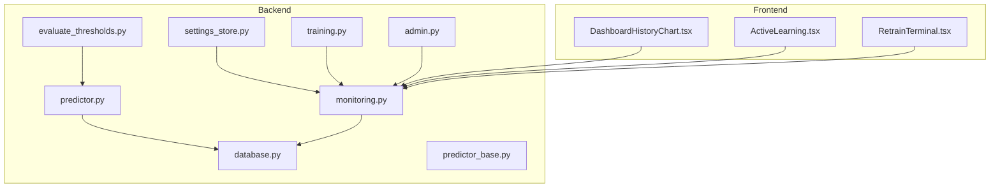
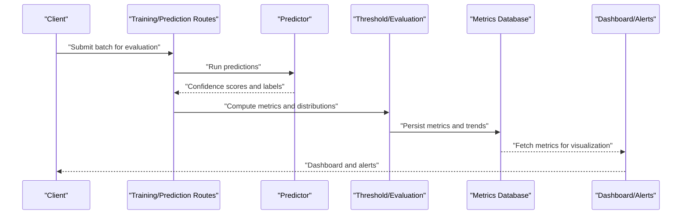
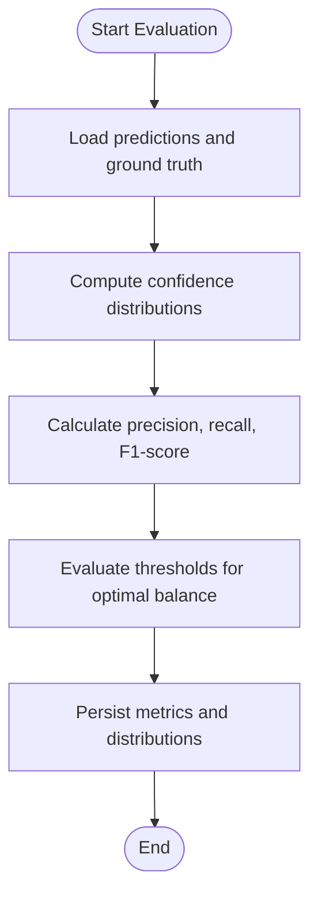
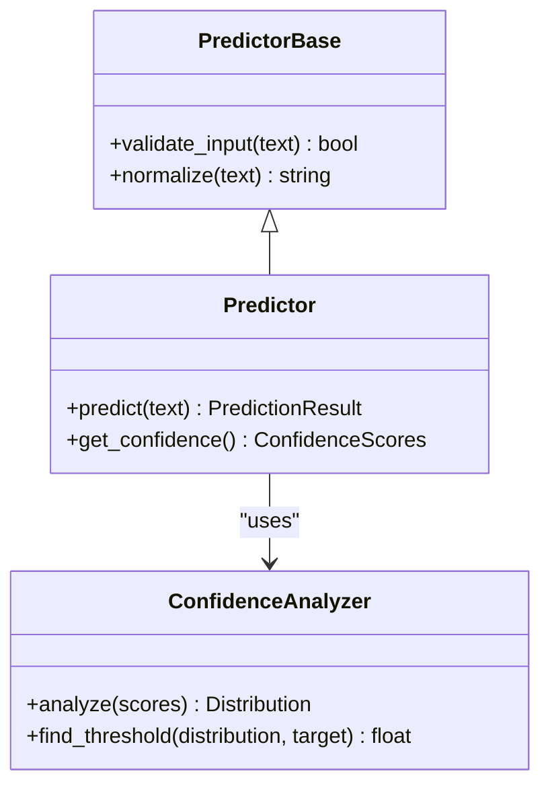
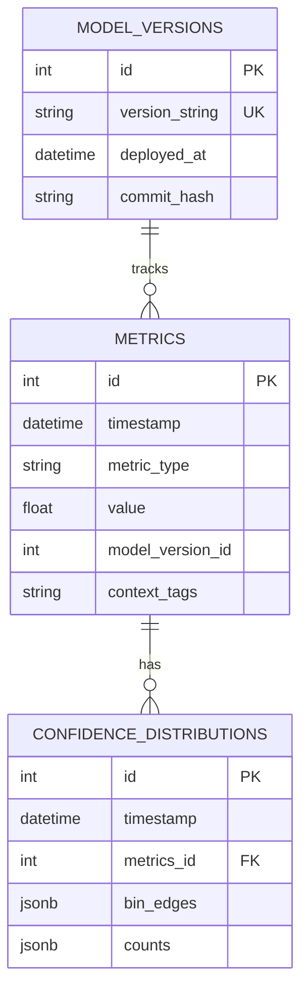
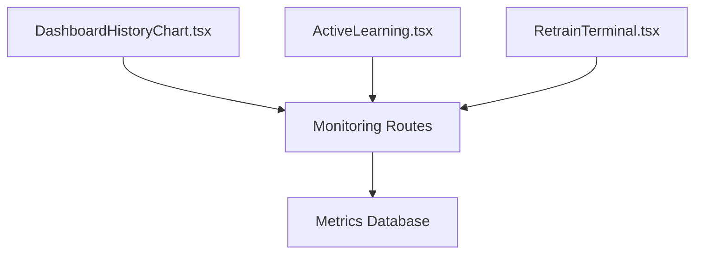
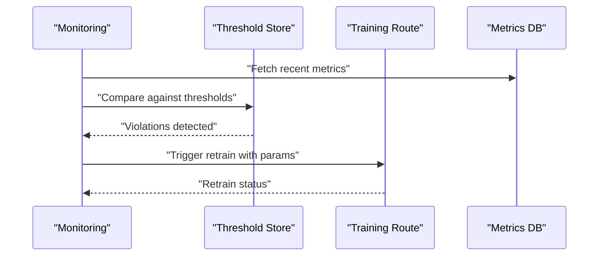
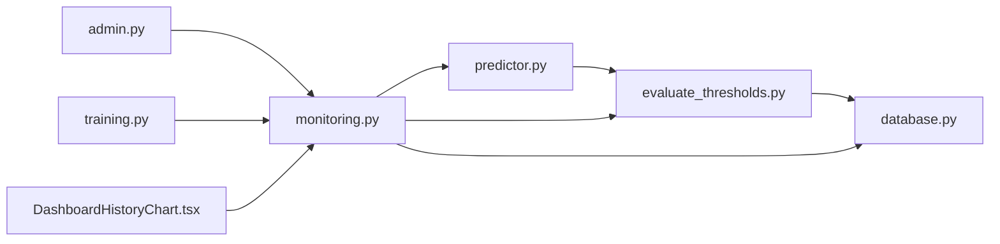

# Performance Tracking and Monitoring

<cite>
**Referenced Files in This Document**
- [monitoring.py](file://cyberbullying_api/monitoring.py)
- [evaluate_thresholds.py](file://cyberbullying_api/classifier/evaluate_thresholds.py)
- [database.py](file://cyberbullying_api/classifier/database.py)
- [admin.py](file://cyberbullying_api/routes/admin.py)
- [training.py](file://cyberbullying_api/routes/training.py)
- [predictor.py](file://cyberbullying_api/classifier/predictor.py)
- [predictor_base.py](file://cyberbullying_api/classifier/predictor_base.py)
- [settings_store.py](file://cyberbullying_api/classifier/settings_store.py)
- [confidence.py](file://cyberbullying_api/classifier/confidence.py)
- [current_model_version.json](file://cyberbullying_api/models/current_model_version.json)
- [DashboardHistoryChart.tsx](file://frontend/src/components/Home/DashboardHistoryChart.tsx)
- [ActiveLearning.tsx](file://frontend/src/components/ActiveLearning.tsx)
- [RetrainTerminal.tsx](file://frontend/src/components/ActiveLearning/RetrainTerminal.tsx)
- [ML_CONFIDENCE_GUIDE.md](file://docs/ML_CONFIDENCE_GUIDE.md)
- [MODEL_EVALUATION.md](file://docs/MODEL_EVALUATION.md)
</cite>

## Table of Contents
1. [Introduction](#introduction)
2. [Project Structure](#project-structure)
3. [Core Components](#core-components)
4. [Architecture Overview](#architecture-overview)
5. [Detailed Component Analysis](#detailed-component-analysis)
6. [Dependency Analysis](#dependency-analysis)
7. [Performance Considerations](#performance-considerations)
8. [Troubleshooting Guide](#troubleshooting-guide)
9. [Conclusion](#conclusion)
10. [Appendices](#appendices)

## Introduction
This document describes the performance tracking and monitoring systems within the active learning framework. It covers metrics collection for model performance evaluation (precision, recall, F1-score, confidence distributions), dashboard functionality for training progress and system health, database schema for storing metrics and trends, alerting mechanisms for performance degradation and anomalies, integration with retraining triggers, and the admin interface for report access and configuration.

## Project Structure
The monitoring and performance tracking spans backend Python modules, database storage, and frontend visualization components:
- Backend monitoring and evaluation: monitoring module, threshold evaluation, database connectors, prediction pipeline, and settings store
- Routes for admin and training orchestration
- Frontend dashboard components for history visualization and active learning controls
- Documentation guides for confidence thresholds and evaluation procedures

**Diagram sources**
- [monitoring.py](file://cyberbullying_api/monitoring.py)
- [evaluate_thresholds.py](file://cyberbullying_api/classifier/evaluate_thresholds.py)
- [database.py](file://cyberbullying_api/classifier/database.py)
- [predictor.py](file://cyberbullying_api/classifier/predictor.py)
- [predictor_base.py](file://cyberbullying_api/classifier/predictor_base.py)
- [settings_store.py](file://cyberbullying_api/classifier/settings_store.py)
- [training.py](file://cyberbullying_api/routes/training.py)
- [admin.py](file://cyberbullying_api/routes/admin.py)
- [DashboardHistoryChart.tsx](file://frontend/src/components/Home/DashboardHistoryChart.tsx)
- [ActiveLearning.tsx](file://frontend/src/components/ActiveLearning.tsx)
- [RetrainTerminal.tsx](file://frontend/src/components/ActiveLearning/RetrainTerminal.tsx)

**Section sources**
- [monitoring.py](file://cyberbullying_api/monitoring.py)
- [database.py](file://cyberbullying_api/classifier/database.py)
- [predictor.py](file://cyberbullying_api/classifier/predictor.py)
- [DashboardHistoryChart.tsx](file://frontend/src/components/Home/DashboardHistoryChart.tsx)

## Core Components
- Metrics collection and evaluation: precision, recall, F1-score, and confidence distribution analysis
- Threshold evaluation engine for dynamic decision-making
- Database schema for storing metrics, historical comparisons, and trends
- Monitoring dashboard for training progress and system health
- Alerting and retraining triggers integrated with statistical significance testing
- Admin interface for performance reports and monitoring configuration

**Section sources**
- [monitoring.py](file://cyberbullying_api/monitoring.py)
- [evaluate_thresholds.py](file://cyberbullying_api/classifier/evaluate_thresholds.py)
- [database.py](file://cyberbullying_api/classifier/database.py)
- [admin.py](file://cyberbullying_api/routes/admin.py)

## Architecture Overview
The monitoring system integrates prediction, evaluation, and storage layers with a dashboard and admin interface. Predictions feed into evaluation routines that compute metrics and confidence distributions. Results are persisted and visualized, while thresholds and alerts drive retraining decisions.

**Diagram sources**
- [training.py](file://cyberbullying_api/routes/training.py)
- [predictor.py](file://cyberbullying_api/classifier/predictor.py)
- [evaluate_thresholds.py](file://cyberbullying_api/classifier/evaluate_thresholds.py)
- [database.py](file://cyberbullying_api/classifier/database.py)
- [monitoring.py](file://cyberbullying_api/monitoring.py)

## Detailed Component Analysis

### Metrics Collection and Evaluation Engine
The evaluation engine computes precision, recall, and F1-score from prediction outcomes and confidence distributions. Confidence thresholds are evaluated dynamically to balance precision and recall, enabling adaptive decision-making during active learning.

**Diagram sources**
- [evaluate_thresholds.py](file://cyberbullying_api/classifier/evaluate_thresholds.py)
- [monitoring.py](file://cyberbullying_api/monitoring.py)

**Section sources**
- [evaluate_thresholds.py](file://cyberbullying_api/classifier/evaluate_thresholds.py)
- [monitoring.py](file://cyberbullying_api/monitoring.py)

### Prediction Pipeline and Confidence Analysis
The predictor generates confidence scores per prediction, which are consumed by the evaluation engine. Confidence analysis informs threshold selection and anomaly detection.

**Diagram sources**
- [predictor.py](file://cyberbullying_api/classifier/predictor.py)
- [predictor_base.py](file://cyberbullying_api/classifier/predictor_base.py)
- [confidence.py](file://cyberbullying_api/classifier/confidence.py)

**Section sources**
- [predictor.py](file://cyberbullying_api/classifier/predictor.py)
- [predictor_base.py](file://cyberbullying_api/classifier/predictor_base.py)
- [confidence.py](file://cyberbullying_api/classifier/confidence.py)

### Database Schema for Metrics and Trends
Metrics and historical comparisons are stored in a structured schema supporting trend analysis and comparisons across model versions.

**Diagram sources**
- [database.py](file://cyberbullying_api/classifier/database.py)
- [current_model_version.json](file://cyberbullying_api/models/current_model_version.json)

**Section sources**
- [database.py](file://cyberbullying_api/classifier/database.py)
- [current_model_version.json](file://cyberbullying_api/models/current_model_version.json)

### Monitoring Dashboard and Visualization
The frontend dashboard visualizes historical metrics and training progress. Components render charts and integrate with backend metrics endpoints.

**Diagram sources**
- [DashboardHistoryChart.tsx](file://frontend/src/components/Home/DashboardHistoryChart.tsx)
- [ActiveLearning.tsx](file://frontend/src/components/ActiveLearning.tsx)
- [RetrainTerminal.tsx](file://frontend/src/components/ActiveLearning/RetrainTerminal.tsx)
- [monitoring.py](file://cyberbullying_api/monitoring.py)
- [database.py](file://cyberbullying_api/classifier/database.py)

**Section sources**
- [DashboardHistoryChart.tsx](file://frontend/src/components/Home/DashboardHistoryChart.tsx)
- [monitoring.py](file://cyberbullying_api/monitoring.py)
- [database.py](file://cyberbullying_api/classifier/database.py)

### Alerting Mechanisms and Retraining Triggers
Alerts are triggered when metrics fall below configured thresholds or when confidence distributions shift significantly. Retraining is initiated via training routes when thresholds are exceeded.

**Diagram sources**
- [monitoring.py](file://cyberbullying_api/monitoring.py)
- [settings_store.py](file://cyberbullying_api/classifier/settings_store.py)
- [training.py](file://cyberbullying_api/routes/training.py)
- [database.py](file://cyberbullying_api/classifier/database.py)

**Section sources**
- [monitoring.py](file://cyberbullying_api/monitoring.py)
- [settings_store.py](file://cyberbullying_api/classifier/settings_store.py)
- [training.py](file://cyberbullying_api/routes/training.py)

### Admin Interface for Reports and Configuration
Admin routes expose endpoints for retrieving performance reports and configuring monitoring parameters such as thresholds and alert policies.

**Section sources**
- [admin.py](file://cyberbullying_api/routes/admin.py)
- [monitoring.py](file://cyberbullying_api/monitoring.py)
- [settings_store.py](file://cyberbullying_api/classifier/settings_store.py)

## Dependency Analysis
The monitoring system exhibits strong cohesion around metrics computation and persistence, with clear separation of concerns between prediction, evaluation, storage, and presentation.

**Diagram sources**
- [predictor.py](file://cyberbullying_api/classifier/predictor.py)
- [evaluate_thresholds.py](file://cyberbullying_api/classifier/evaluate_thresholds.py)
- [database.py](file://cyberbullying_api/classifier/database.py)
- [monitoring.py](file://cyberbullying_api/monitoring.py)
- [admin.py](file://cyberbullying_api/routes/admin.py)
- [training.py](file://cyberbullying_api/routes/training.py)
- [DashboardHistoryChart.tsx](file://frontend/src/components/Home/DashboardHistoryChart.tsx)

**Section sources**
- [monitoring.py](file://cyberbullying_api/monitoring.py)
- [database.py](file://cyberbullying_api/classifier/database.py)
- [predictor.py](file://cyberbullying_api/classifier/predictor.py)
- [evaluate_thresholds.py](file://cyberbullying_api/classifier/evaluate_thresholds.py)
- [admin.py](file://cyberbullying_api/routes/admin.py)
- [training.py](file://cyberbullying_api/routes/training.py)

## Performance Considerations
- Metrics computation should leverage vectorized operations and efficient aggregation to minimize latency during batch evaluations.
- Confidence distribution analysis benefits from streaming histograms and incremental updates to reduce computational overhead.
- Database writes should be batched and indexed on timestamps and model versions to optimize query performance for dashboards.
- Threshold evaluation should cache results for stable windows to avoid repeated recomputation.

## Troubleshooting Guide
Common issues and resolutions:
- Missing or stale metrics: Verify database connectivity and write permissions; confirm that monitoring routines persist records after evaluation.
- Incorrect thresholds: Review threshold store configuration and ensure values align with evaluation targets; validate that confidence distributions are representative.
- Dashboard rendering delays: Confirm endpoint response times and pagination limits; check database indexes on timestamp and model version fields.
- Retraining not triggered: Inspect alert conditions and threshold violations; validate training route parameters and model version updates.

**Section sources**
- [monitoring.py](file://cyberbullying_api/monitoring.py)
- [database.py](file://cyberbullying_api/classifier/database.py)
- [settings_store.py](file://cyberbullying_api/classifier/settings_store.py)
- [training.py](file://cyberbullying_api/routes/training.py)

## Conclusion
The monitoring system provides a robust foundation for tracking model performance, enabling informed decisions through metrics, confidence analysis, and dynamic thresholding. Its integration with the admin interface and dashboard supports continuous oversight, while alerting and retraining triggers facilitate automated maintenance and improvement.

## Appendices

### Practical Examples
- Performance reporting: Use admin endpoints to retrieve historical metrics and confidence distributions for a selected model version and date range.
- Trend visualization: Render dashboard charts using time-series data from the metrics database to compare precision, recall, and F1-score across versions.
- Automated decision-making: Configure thresholds for precision/recall; when breaches occur, trigger retraining with updated parameters and monitor improvements post-retraining.

### Statistical Significance Testing and Confidence Intervals
- Apply statistical tests to compare pre/post metrics across model versions to detect significant shifts.
- Compute confidence intervals for precision/recall to quantify uncertainty and guide threshold adjustments.

**Section sources**
- [evaluate_thresholds.py](file://cyberbullying_api/classifier/evaluate_thresholds.py)
- [ML_CONFIDENCE_GUIDE.md](file://docs/ML_CONFIDENCE_GUIDE.md)
- [MODEL_EVALUATION.md](file://docs/MODEL_EVALUATION.md)