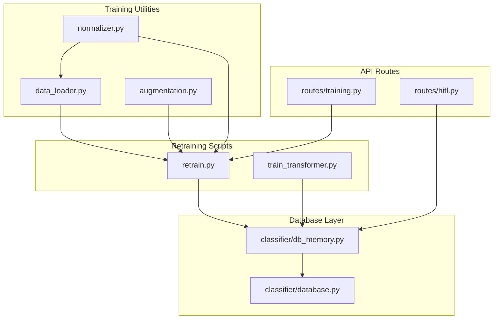
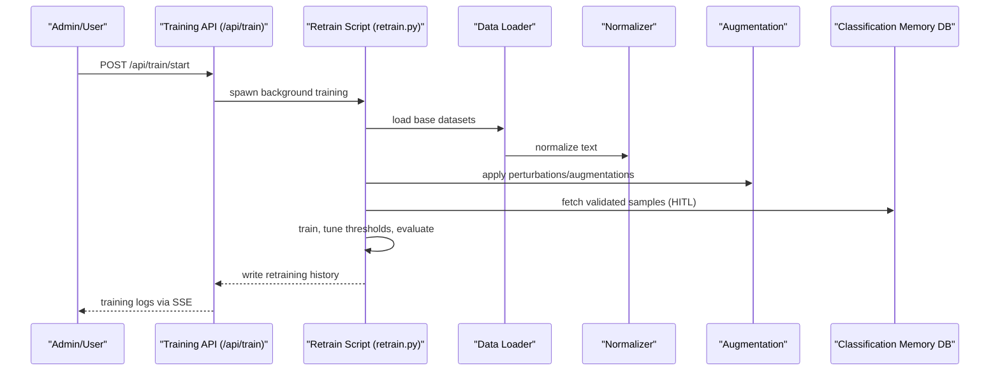
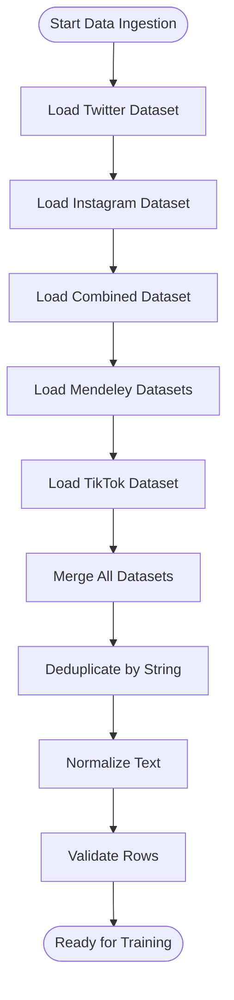
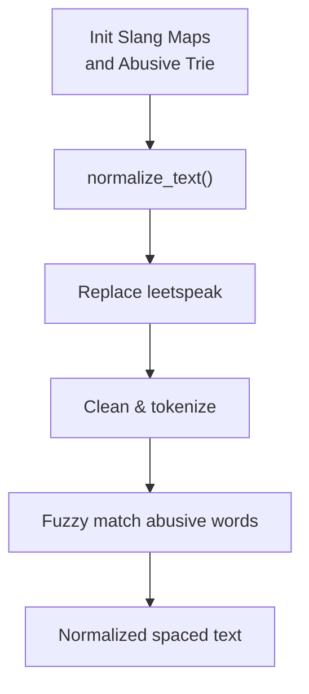
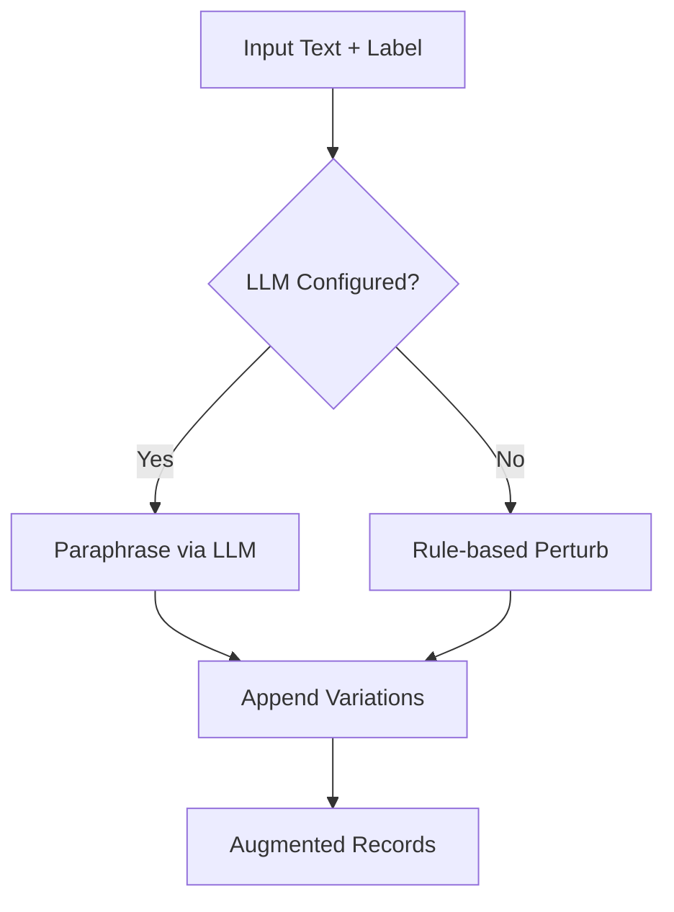
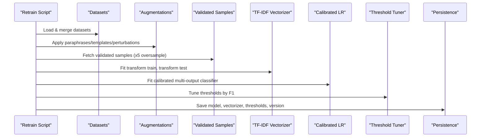
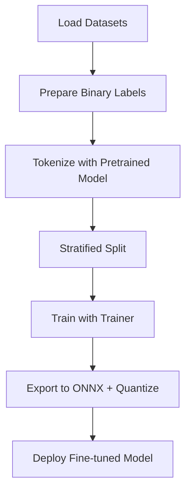
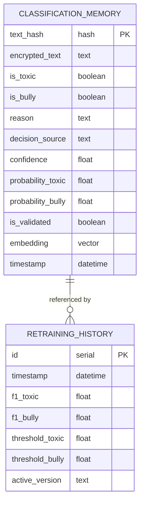
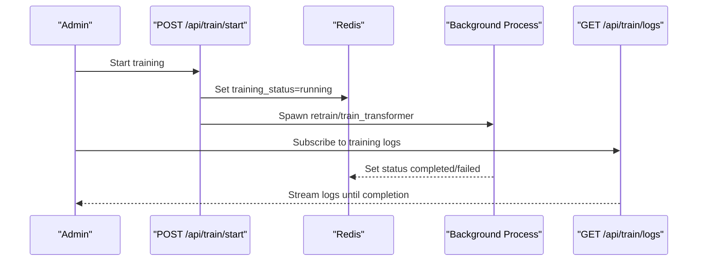
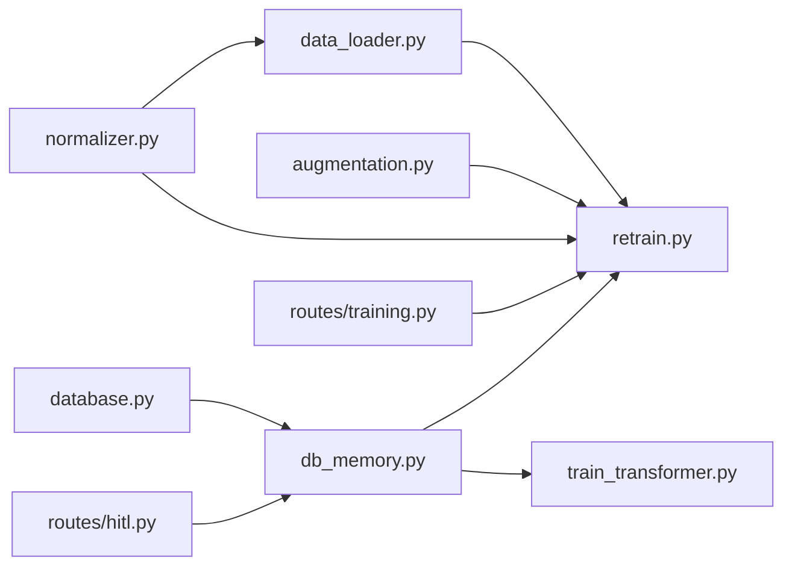

# Training Data Management and Augmentation

<cite>
**Referenced Files in This Document**
- [data_loader.py](file://cyberbullying_api/training/data_loader.py)
- [augmentation.py](file://cyberbullying_api/training/augmentation.py)
- [retrain.py](file://cyberbullying_api/retrain.py)
- [train_transformer.py](file://cyberbullying_api/train_transformer.py)
- [normalizer.py](file://cyberbullying_api/normalizer.py)
- [training.py](file://cyberbullying_api/routes/training.py)
- [db_memory.py](file://cyberbullying_api/classifier/db_memory.py)
- [database.py](file://cyberbullying_api/classifier/database.py)
- [hitl.py](file://cyberbullying_api/routes/hitl.py)
- [PRODUCTION_CHECKLIST.md](file://docs/PRODUCTION_CHECKLIST.md)
</cite>

## Table of Contents
1. [Introduction](#introduction)
2. [Project Structure](#project-structure)
3. [Core Components](#core-components)
4. [Architecture Overview](#architecture-overview)
5. [Detailed Component Analysis](#detailed-component-analysis)
6. [Dependency Analysis](#dependency-analysis)
7. [Performance Considerations](#performance-considerations)
8. [Troubleshooting Guide](#troubleshooting-guide)
9. [Conclusion](#conclusion)
10. [Appendices](#appendices)

## Introduction
This document describes the end-to-end training data management and augmentation system used to build and maintain cyberbullying detection models. It covers:
- Data loader functionality for ingesting labeled examples from multiple sources
- Text normalization and validation/format standardization
- Augmentation techniques to improve model robustness
- The data pipeline from raw annotations to training-ready datasets
- Database integration for storing training records, lineage, and provenance
- Practical workflows, augmentation strategies by cyberbullying type, and performance optimization
- Privacy considerations, ethical guidelines, and integration with the active learning feedback loop

## Project Structure
The training system spans several modules:
- Training utilities: data loaders, augmentation helpers
- Retraining scripts: scikit-learn logistic regression and transformer fine-tuning
- Normalization: slang mapping, leetspeak handling, abusive word detection
- API routes: training orchestration, HITL reallocation, logs streaming
- Database layer: classification memory, validation, and retraining history

**Diagram sources**
- [data_loader.py:1-385](file://cyberbullying_api/training/data_loader.py#L1-L385)
- [augmentation.py:1-197](file://cyberbullying_api/training/augmentation.py#L1-L197)
- [retrain.py:1-522](file://cyberbullying_api/retrain.py#L1-L522)
- [train_transformer.py:1-343](file://cyberbullying_api/train_transformer.py#L1-L343)
- [normalizer.py:1-368](file://cyberbullying_api/normalizer.py#L1-L368)
- [training.py:1-259](file://cyberbullying_api/routes/training.py#L1-L259)
- [db_memory.py:1-763](file://cyberbullying_api/classifier/db_memory.py#L1-L763)
- [database.py:1-32](file://cyberbullying_api/classifier/database.py#L1-L32)
- [hitl.py:1-83](file://cyberbullying_api/routes/hitl.py#L1-L83)

**Section sources**
- [data_loader.py:1-385](file://cyberbullying_api/training/data_loader.py#L1-L385)
- [augmentation.py:1-197](file://cyberbullying_api/training/augmentation.py#L1-L197)
- [retrain.py:1-522](file://cyberbullying_api/retrain.py#L1-L522)
- [train_transformer.py:1-343](file://cyberbullying_api/train_transformer.py#L1-L343)
- [normalizer.py:1-368](file://cyberbullying_api/normalizer.py#L1-L368)
- [training.py:1-259](file://cyberbullying_api/routes/training.py#L1-L259)
- [db_memory.py:1-763](file://cyberbullying_api/classifier/db_memory.py#L1-L763)
- [database.py:1-32](file://cyberbullying_api/classifier/database.py#L1-L32)
- [hitl.py:1-83](file://cyberbullying_api/routes/hitl.py#L1-L83)

## Core Components
- Data loaders: standardized ingestion from CSV/XLSX/Mendeley/TikTok sources with consistent column mapping and cleaning
- Normalization: slang/abbreviations mapping, leetspeak decoding, repeated-character reduction, and abusive-word trie-based fuzzy matching
- Augmentation: rule-based perturbations (leet, censor, repeat, typo) and LLM-based paraphrasing for robustness
- Retraining pipeline: combining base datasets, augmentations, perturbations, validated samples, vectorization, calibration, threshold tuning, and rollback
- Database integration: classification memory storage with encryption, validation, semantic caching, and retraining history
- API orchestration: training initiation, logs streaming, and HITL reallocation endpoints

**Section sources**
- [data_loader.py:37-385](file://cyberbullying_api/training/data_loader.py#L37-L385)
- [normalizer.py:132-234](file://cyberbullying_api/normalizer.py#L132-L234)
- [augmentation.py:90-197](file://cyberbullying_api/training/augmentation.py#L90-L197)
- [retrain.py:49-522](file://cyberbullying_api/retrain.py#L49-L522)
- [db_memory.py:24-406](file://cyberbullying_api/classifier/db_memory.py#L24-L406)
- [training.py:29-238](file://cyberbullying_api/routes/training.py#L29-L238)
- [hitl.py:51-83](file://cyberbullying_api/routes/hitl.py#L51-L83)

## Architecture Overview
The training system orchestrates data ingestion, normalization, augmentation, and model retraining, with persistent storage and human-in-the-loop validation.

**Diagram sources**
- [training.py:29-178](file://cyberbullying_api/routes/training.py#L29-L178)
- [retrain.py:74-166](file://cyberbullying_api/retrain.py#L74-L166)
- [data_loader.py:37-385](file://cyberbullying_api/training/data_loader.py#L37-L385)
- [normalizer.py:193-234](file://cyberbullying_api/normalizer.py#L193-L234)
- [augmentation.py:90-197](file://cyberbullying_api/training/augmentation.py#L90-L197)
- [db_memory.py:284-325](file://cyberbullying_api/classifier/db_memory.py#L284-L325)

## Detailed Component Analysis

### Data Loading and Validation Pipeline
- Standardized DataFrame schema: three columns: text_clean, is_toxic, is_bully
- Robust ingestion from:
  - Twitter CSV (Tweet, Abusive, HS)
  - Instagram XLSX (Komentar, Kategori)
  - Combined CSV (String, Label)
  - Mendeley multi-platform (downsample YouTube non-bullying)
  - TikTok Rhiosutoyo (comment, sentiment)
- Scraper ingestion: classified_*_data.csv with Teks and Is_Bully columns
- Database ingestion: PostgreSQL (asyncpg) with SQLite fallback; validates encrypted records and converts to labels

**Diagram sources**
- [data_loader.py:37-385](file://cyberbullying_api/training/data_loader.py#L37-L385)
- [retrain.py:86-166](file://cyberbullying_api/retrain.py#L86-L166)

**Section sources**
- [data_loader.py:37-385](file://cyberbullying_api/training/data_loader.py#L37-L385)
- [retrain.py:74-166](file://cyberbullying_api/retrain.py#L74-L166)

### Text Normalization and Lexicon Integration
- Initializes slang and abbreviation maps from CSV files
- Applies leetspeak decoding, whitespace normalization, repeated-character reduction
- Detects abusive words using a trie-based fuzzy matching engine
- Provides a lexicon preparation routine for phrase matching

**Diagram sources**
- [normalizer.py:132-179](file://cyberbullying_api/normalizer.py#L132-L179)
- [normalizer.py:193-234](file://cyberbullying_api/normalizer.py#L193-L234)
- [normalizer.py:17-60](file://cyberbullying_api/normalizer.py#L17-L60)

**Section sources**
- [normalizer.py:132-234](file://cyberbullying_api/normalizer.py#L132-L234)
- [normalizer.py:17-60](file://cyberbullying_api/normalizer.py#L17-L60)

### Augmentation Techniques
- Rule-based perturbations:
  - Leet substitutions, censoring, character repetition, typo swaps
  - Applied selectively to toxic texts with controlled probability
- LLM-based paraphrasing:
  - Gemini-compatible API calls to generate paraphrases preserving register and label semantics
- Template-based augmentation:
  - Sarcasm and slang-praise templates to balance class distributions

**Diagram sources**
- [augmentation.py:90-144](file://cyberbullying_api/training/augmentation.py#L90-L144)
- [augmentation.py:147-197](file://cyberbullying_api/training/augmentation.py#L147-L197)
- [retrain.py:125-141](file://cyberbullying_api/retrain.py#L125-L141)

**Section sources**
- [augmentation.py:90-197](file://cyberbullying_api/training/augmentation.py#L90-L197)
- [retrain.py:125-141](file://cyberbullying_api/retrain.py#L125-L141)

### Retraining Pipeline (Scikit-learn Logistic Regression)
- Data assembly: combine base datasets, deduplicate, normalize, and label
- Augmentations: paraphrases (LLM), sarcasm/praise templates, rule-based perturbations
- Active learning oversampling: validated samples from classification memory
- Train/test split: stratified by joint label combinations
- Vectorization: TF-IDF with n-grams
- Calibration: Platt scaling via CalibratedClassifierCV
- Threshold tuning: grid search over plausible thresholds
- Rollback protection: compare new vs. old model F1 scores and abort if degradation exceeds threshold
- Persistence: save model, vectorizer, thresholds, and current version metadata

**Diagram sources**
- [retrain.py:167-522](file://cyberbullying_api/retrain.py#L167-L522)

**Section sources**
- [retrain.py:167-522](file://cyberbullying_api/retrain.py#L167-L522)

### Transformer Fine-tuning Pipeline
- Loads datasets and prepares binary labels
- Tokenizes with a pre-trained Indonesian model
- Stratified train/validation split
- Trainer configuration with metrics and checkpointing
- Export to ONNX with dynamic quantization for deployment

**Diagram sources**
- [train_transformer.py:81-343](file://cyberbullying_api/train_transformer.py#L81-L343)

**Section sources**
- [train_transformer.py:81-343](file://cyberbullying_api/train_transformer.py#L81-L343)

### Database Integration and Data Provenance
- Classification memory stores encrypted text, labels, reasons, decision sources, confidence, probabilities, and validation flags
- Dual-path persistence: PostgreSQL (asyncpg) with SQLite fallback
- Semantic cache: vector embeddings enable nearest-neighbor retrieval for similar texts
- HITL endpoints: reallocate and bulk reallocate validated samples
- Retraining history: records performance metrics and thresholds for auditability

**Diagram sources**
- [db_memory.py:61-86](file://cyberbullying_api/classifier/db_memory.py#L61-L86)
- [db_memory.py:683-712](file://cyberbullying_api/classifier/db_memory.py#L683-L712)

**Section sources**
- [db_memory.py:24-406](file://cyberbullying_api/classifier/db_memory.py#L24-L406)
- [db_memory.py:683-762](file://cyberbullying_api/classifier/db_memory.py#L683-L762)
- [hitl.py:51-83](file://cyberbullying_api/routes/hitl.py#L51-L83)

### API Orchestration and Logging
- Training start: supports ML, transformer, or both models; checks Celery availability and Redis status
- Logs streaming: server-sent events for live training progress
- Training history: paginated retrieval of retraining runs

**Diagram sources**
- [training.py:29-238](file://cyberbullying_api/routes/training.py#L29-L238)

**Section sources**
- [training.py:29-238](file://cyberbullying_api/routes/training.py#L29-L238)

## Dependency Analysis
- Training utilities depend on normalization and dataset loaders
- Retraining scripts depend on augmentation and database utilities
- API routes coordinate training orchestration and HITL reallocation
- Database layer abstracts PostgreSQL/SQLite and provides encryption/decryption

**Diagram sources**
- [normalizer.py:1-368](file://cyberbullying_api/normalizer.py#L1-L368)
- [data_loader.py:1-385](file://cyberbullying_api/training/data_loader.py#L1-L385)
- [augmentation.py:1-197](file://cyberbullying_api/training/augmentation.py#L1-L197)
- [retrain.py:1-522](file://cyberbullying_api/retrain.py#L1-L522)
- [train_transformer.py:1-343](file://cyberbullying_api/train_transformer.py#L1-L343)
- [db_memory.py:1-763](file://cyberbullying_api/classifier/db_memory.py#L1-L763)
- [database.py:1-32](file://cyberbullying_api/classifier/database.py#L1-L32)
- [hitl.py:1-83](file://cyberbullying_api/routes/hitl.py#L1-L83)
- [training.py:1-259](file://cyberbullying_api/routes/training.py#L1-L259)

**Section sources**
- [retrain.py:25-39](file://cyberbullying_api/retrain.py#L25-L39)
- [train_transformer.py:36-43](file://cyberbullying_api/train_transformer.py#L36-L43)
- [db_memory.py:14-21](file://cyberbullying_api/classifier/db_memory.py#L14-L21)
- [training.py:1-14](file://cyberbullying_api/routes/training.py#L1-L14)

## Performance Considerations
- Stratified sampling ensures balanced representation across joint label combinations
- Calibrated classifiers and threshold tuning optimize F1-score per target
- Rollback mechanism prevents regressions by comparing new vs. old model performance
- ONNX export with dynamic quantization reduces inference latency and footprint
- Semantic cache accelerates retrieval of near-duplicates using embeddings

[No sources needed since this section provides general guidance]

## Troubleshooting Guide
Common issues and resolutions:
- PostgreSQL unavailable: script falls back to SQLite for ingestion and validation
- Missing LLM configuration: augmentation via paraphrasing is skipped; rule-based perturbations still apply
- Training logs not available: endpoint streams initial placeholder and waits for process completion
- Validation failures: HITL endpoints return structured messages; verify encryption keys and database connectivity

**Section sources**
- [data_loader.py:224-301](file://cyberbullying_api/training/data_loader.py#L224-L301)
- [augmentation.py:98-144](file://cyberbullying_api/training/augmentation.py#L98-L144)
- [training.py:192-238](file://cyberbullying_api/routes/training.py#L192-L238)
- [hitl.py:51-83](file://cyberbullying_api/routes/hitl.py#L51-L83)

## Conclusion
The training data management and augmentation system integrates robust data ingestion, normalization, and augmentation with secure database storage and human-in-the-loop validation. It provides reproducible retraining workflows, strong quality controls, and operational resilience through fallbacks and rollback mechanisms.

[No sources needed since this section summarizes without analyzing specific files]

## Appendices

### Practical Workflows and Strategies
- Data loading workflow:
  - Ingest scraper outputs and classification memory
  - Load base datasets and append new unique records
  - Normalize and deduplicate; optionally augment with paraphrases and templates
- Augmentation strategies by type:
  - Toxicity-focused: emphasize rule-based perturbations on toxic texts
  - Cyberbullying-focused: use sarcasm and praise templates to balance classes
- Active learning integration:
  - Use HITL endpoints to validate predictions and oversample corrected samples
  - Periodically retrain and compare F1 scores to maintain stability

**Section sources**
- [retrain.py:74-166](file://cyberbullying_api/retrain.py#L74-L166)
- [retrain.py:205-346](file://cyberbullying_api/retrain.py#L205-L346)
- [hitl.py:51-83](file://cyberbullying_api/routes/hitl.py#L51-L83)

### Data Privacy and Ethical Guidelines
- Encrypted storage: classification memory stores encrypted text with deterministic hashing for deduplication
- Minimal data retention: validated records are stored with explicit flags; logs and artifacts are versioned
- Human oversight: HITL endpoints require explicit validation; thresholds and weights can be tuned to minimize false positives
- Production checklist: emphasizes balanced label distribution, static test sets, and rollback procedures

**Section sources**
- [db_memory.py:24-131](file://cyberbullying_api/classifier/db_memory.py#L24-L131)
- [PRODUCTION_CHECKLIST.md:22-27](file://docs/PRODUCTION_CHECKLIST.md#L22-L27)