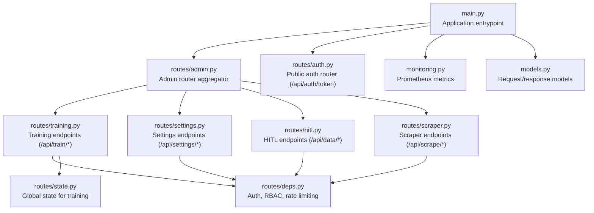
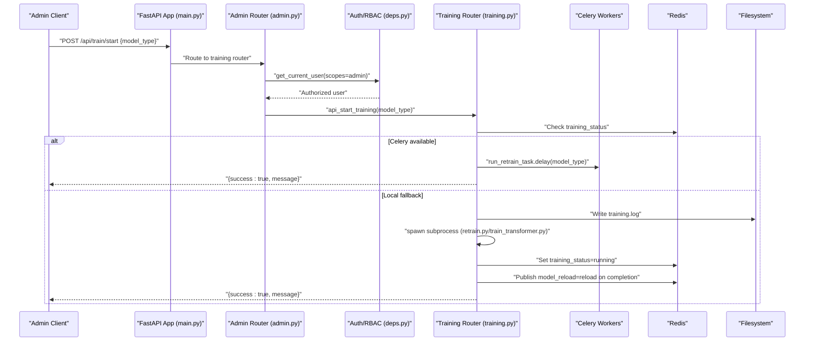
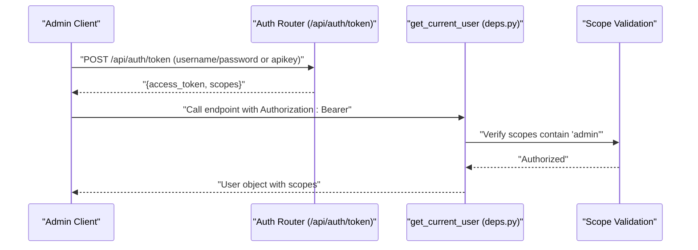
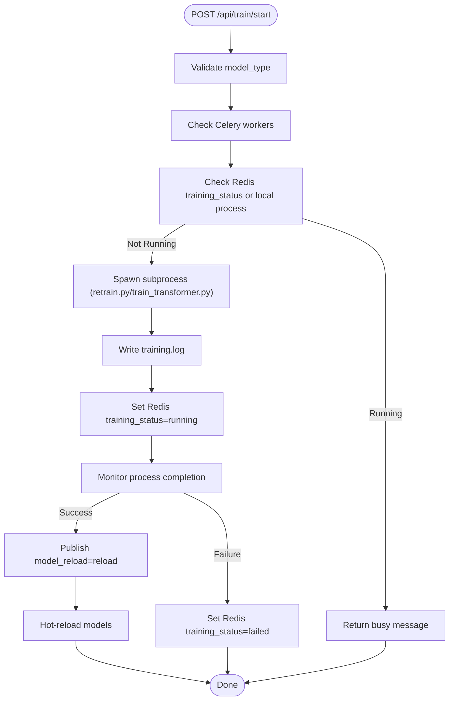
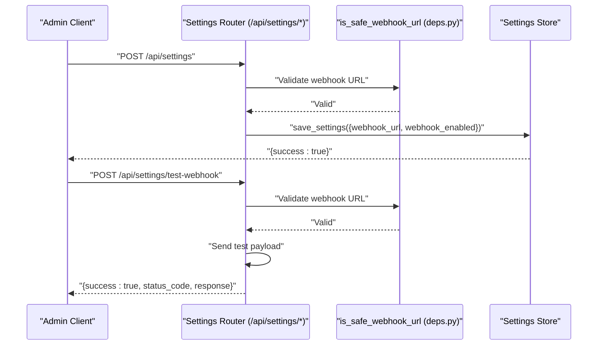
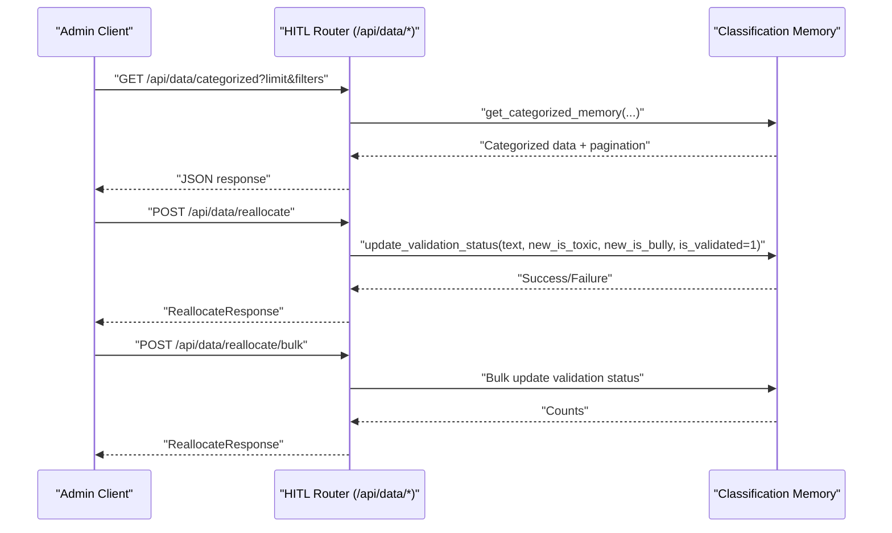
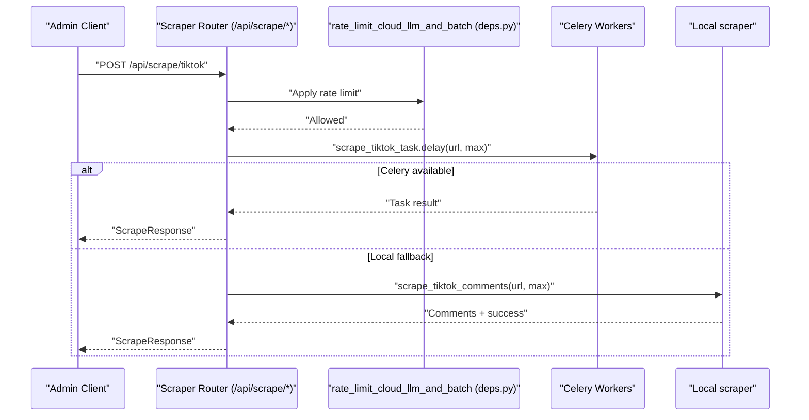
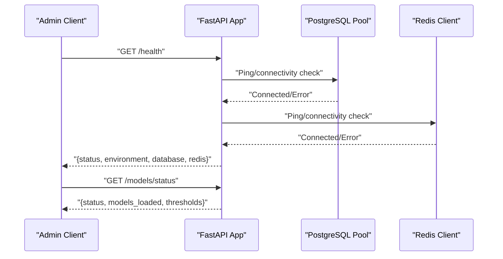
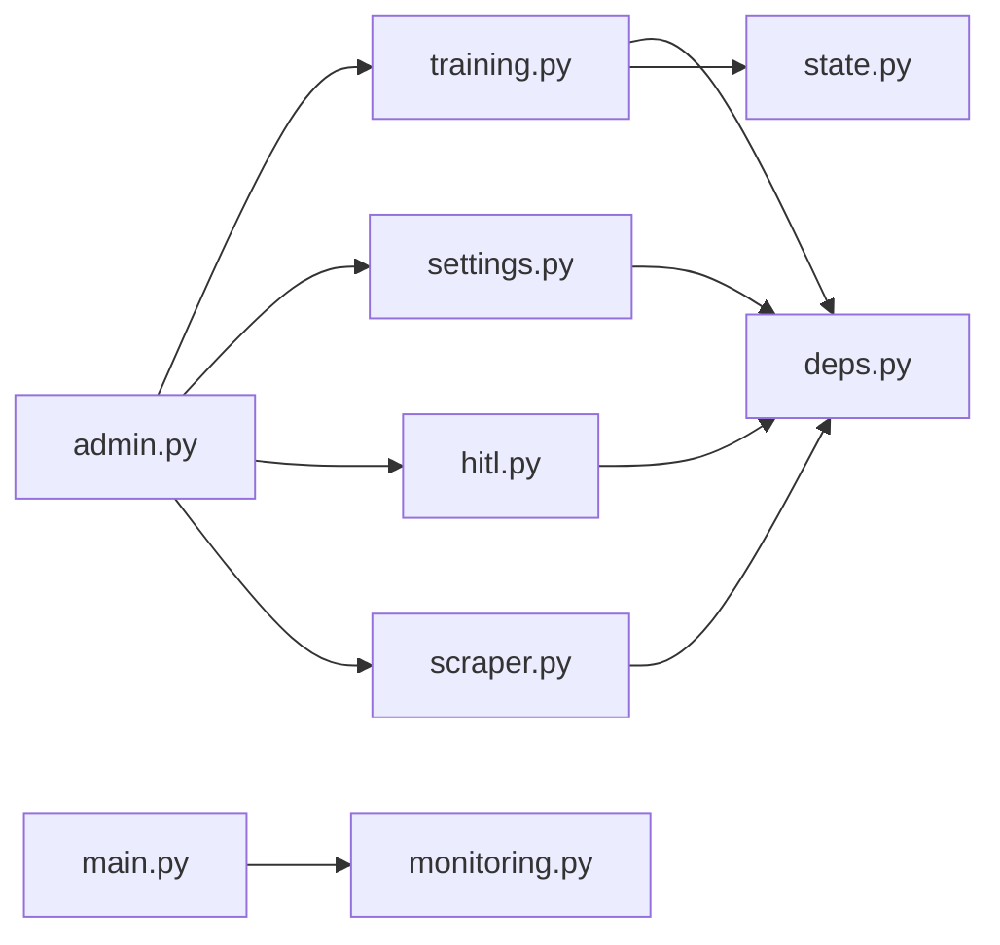

# Administrative Functions

<cite>
**Referenced Files in This Document**
- [main.py](file://cyberbullying_api/main.py)
- [admin.py](file://cyberbullying_api/routes/admin.py)
- [auth.py](file://cyberbullying_api/routes/auth.py)
- [deps.py](file://cyberbullying_api/routes/deps.py)
- [training.py](file://cyberbullying_api/routes/training.py)
- [settings.py](file://cyberbullying_api/routes/settings.py)
- [hitl.py](file://cyberbullying_api/routes/hitl.py)
- [scraper.py](file://cyberbullying_api/routes/scraper.py)
- [models.py](file://cyberbullying_api/models.py)
- [monitoring.py](file://cyberbullying_api/monitoring.py)
- [state.py](file://cyberbullying_api/routes/state.py)
- [README.md](file://cyberbullying_api/README.md)
- [SECURITY_HARDENING.md](file://docs/SECURITY_HARDENING.md)
- [test_admin.py](file://cyberbullying_api/tests/test_admin.py)
</cite>

## Table of Contents
1. [Introduction](#introduction)
2. [Project Structure](#project-structure)
3. [Core Components](#core-components)
4. [Architecture Overview](#architecture-overview)
5. [Detailed Component Analysis](#detailed-component-analysis)
6. [Dependency Analysis](#dependency-analysis)
7. [Performance Considerations](#performance-considerations)
8. [Troubleshooting Guide](#troubleshooting-guide)
9. [Conclusion](#conclusion)
10. [Appendices](#appendices)

## Introduction
This document provides comprehensive documentation for the administrative API endpoints in the BullyGuard ID system. It focuses on the admin dashboard functionality including system monitoring, model status tracking, training management, and configuration controls. It explains the /api/admin endpoints for administrative operations, system health checks, model reloading triggers, and operational metrics. It also covers admin authentication requirements, role-based access control (RBAC), and administrative workflow processes. Practical examples, monitoring dashboards, model lifecycle management, and operational maintenance procedures are included, along with security considerations for admin endpoints, audit logging, and administrative best practices.

## Project Structure
The administrative functionality is organized under the FastAPI application entrypoint and modular route aggregators. The admin router composes submodules for scraping, human-in-the-loop (HITL) data management, training, and settings. Authentication and authorization are handled centrally, with middleware enforcing security policies and rate limits.

**Diagram sources**
- [main.py:260-269](file://cyberbullying_api/main.py#L260-L269)
- [admin.py:12-25](file://cyberbullying_api/routes/admin.py#L12-L25)
- [auth.py:14-62](file://cyberbullying_api/routes/auth.py#L14-L62)
- [training.py:27-254](file://cyberbullying_api/routes/training.py#L27-L254)
- [settings.py:15-232](file://cyberbullying_api/routes/settings.py#L15-L232)
- [hitl.py:11-84](file://cyberbullying_api/routes/hitl.py#L11-L84)
- [scraper.py:22-103](file://cyberbullying_api/routes/scraper.py#L22-L103)
- [deps.py:56-299](file://cyberbullying_api/routes/deps.py#L56-L299)
- [models.py:171-224](file://cyberbullying_api/models.py#L171-L224)
- [monitoring.py:1-49](file://cyberbullying_api/monitoring.py#L1-L49)
- [state.py:1-7](file://cyberbullying_api/routes/state.py#L1-L7)

**Section sources**
- [main.py:260-269](file://cyberbullying_api/main.py#L260-L269)
- [admin.py:12-25](file://cyberbullying_api/routes/admin.py#L12-L25)

## Core Components
- Admin Router Aggregator: Composes sub-routers for training, settings, HITL, and scraping under a unified admin namespace.
- Authentication and Authorization: Public login endpoint for JWT tokens with scopes, plus API key verification for protected endpoints.
- Training Management: Start training, reload models, stream training logs, and fetch training history.
- Settings Management: Update cookies for scraping platforms, configure webhook endpoints, test webhook connectivity, and recalibrate ensemble weights.
- Human-in-the-Loop (HITL): Retrieve categorized data, reallocate single or bulk items, and apply validation.
- Scraping: Scrape comments from TikTok and tweets from X/Twitter with rate limiting and Celery fallback.
- System Health and Metrics: Health check endpoint, model status endpoint, and Prometheus metrics endpoint.
- Security and Observability: CORS, security headers, request size limits, rate limiting, structured logging, and correlation IDs.

**Section sources**
- [admin.py:12-25](file://cyberbullying_api/routes/admin.py#L12-L25)
- [auth.py:17-62](file://cyberbullying_api/routes/auth.py#L17-L62)
- [deps.py:56-299](file://cyberbullying_api/routes/deps.py#L56-L299)
- [training.py:30-254](file://cyberbullying_api/routes/training.py#L30-L254)
- [settings.py:27-232](file://cyberbullying_api/routes/settings.py#L27-L232)
- [hitl.py:14-84](file://cyberbullying_api/routes/hitl.py#L14-L84)
- [scraper.py:25-103](file://cyberbullying_api/routes/scraper.py#L25-L103)
- [main.py:285-341](file://cyberbullying_api/main.py#L285-L341)
- [monitoring.py:1-49](file://cyberbullying_api/monitoring.py#L1-L49)

## Architecture Overview
The admin endpoints are mounted under the versioned API router and protected by authentication and RBAC. Training and scraping endpoints leverage Celery workers when available, otherwise fall back to local subprocess execution. Redis is used for coordination (training status, model reload signals). Prometheus metrics are exposed for monitoring.

**Diagram sources**
- [main.py:260-269](file://cyberbullying_api/main.py#L260-L269)
- [admin.py:12-25](file://cyberbullying_api/routes/admin.py#L12-L25)
- [deps.py:237-299](file://cyberbullying_api/routes/deps.py#L237-L299)
- [training.py:30-174](file://cyberbullying_api/routes/training.py#L30-L174)

## Detailed Component Analysis

### Authentication and Role-Based Access Control
- Login endpoint: Generates JWT tokens with scopes for predict and admin.
- Token validation: Verifies JWT signature and enforces required scopes.
- API key verification: Validates X-API-Key header for protected endpoints with constant-time comparison.
- Development bypass: Allows missing API key in development when explicitly permitted.

**Diagram sources**
- [auth.py:17-62](file://cyberbullying_api/routes/auth.py#L17-L62)
- [deps.py:209-299](file://cyberbullying_api/routes/deps.py#L209-L299)

**Section sources**
- [auth.py:17-62](file://cyberbullying_api/routes/auth.py#L17-L62)
- [deps.py:56-299](file://cyberbullying_api/routes/deps.py#L56-L299)

### Training Management
- Start training: Validates model_type, checks Celery availability, prevents concurrent runs, writes training.log, spawns subprocess, updates Redis training_status, publishes model_reload, and hot-reloads models on success.
- Reload models: Manually reloads models from disk.
- Stream logs: SSE endpoint to stream training.log with completion detection.
- Training history: Retrieves historical retraining entries with pagination.

**Diagram sources**
- [training.py:30-174](file://cyberbullying_api/routes/training.py#L30-L174)
- [state.py:1-7](file://cyberbullying_api/routes/state.py#L1-L7)

**Section sources**
- [training.py:30-254](file://cyberbullying_api/routes/training.py#L30-L254)
- [state.py:1-7](file://cyberbullying_api/routes/state.py#L1-L7)

### Settings Management
- Update cookies: Writes cookies to platform-specific JSON files.
- Get settings: Retrieves current system settings.
- Save settings: Validates webhook URL and saves settings.
- Test webhook: Sends a test payload to the configured webhook URL with SSRF protections.
- Recalibrate ensemble: Computes optimal ensemble weights using validated samples.

**Diagram sources**
- [settings.py:27-101](file://cyberbullying_api/routes/settings.py#L27-L101)
- [deps.py:165-208](file://cyberbullying_api/routes/deps.py#L165-L208)

**Section sources**
- [settings.py:27-232](file://cyberbullying_api/routes/settings.py#L27-L232)
- [deps.py:165-208](file://cyberbullying_api/routes/deps.py#L165-L208)

### Human-in-the-Loop (HITL)
- Categorized data: Fetches categorized classification memory with filters and pagination metadata.
- Reallocation: Updates validation status for a single item.
- Bulk reallocation: Updates validation status for multiple items.

**Diagram sources**
- [hitl.py:14-84](file://cyberbullying_api/routes/hitl.py#L14-L84)

**Section sources**
- [hitl.py:14-84](file://cyberbullying_api/routes/hitl.py#L14-L84)

### Scraping Endpoints
- TikTok scraping: Supports Celery worker queue or local execution with rate limiting.
- X/Twitter scraping: Similar pattern with rate limiting.

**Diagram sources**
- [scraper.py:25-63](file://cyberbullying_api/routes/scraper.py#L25-L63)
- [deps.py:110-163](file://cyberbullying_api/routes/deps.py#L110-L163)

**Section sources**
- [scraper.py:25-103](file://cyberbullying_api/routes/scraper.py#L25-L103)
- [deps.py:110-163](file://cyberbullying_api/routes/deps.py#L110-L163)

### System Monitoring and Health Checks
- Health check: Reports API status, environment, and database/Redis connectivity.
- Model status: Reports model loading status and thresholds.
- Metrics endpoint: Exposes Prometheus metrics for requests, latency, predictions, cache, inference latency, and LLM failures.

**Diagram sources**
- [main.py:285-341](file://cyberbullying_api/main.py#L285-L341)

**Section sources**
- [main.py:285-341](file://cyberbullying_api/main.py#L285-L341)
- [monitoring.py:1-49](file://cyberbullying_api/monitoring.py#L1-L49)

## Dependency Analysis
- Admin router aggregation depends on sub-routers for training, settings, HITL, and scraping.
- All admin endpoints depend on get_current_user with scope "admin".
- Training endpoints coordinate with Redis for status and reload signaling.
- Scraping endpoints depend on rate limiting middleware.
- Settings endpoints depend on SSRF validation for webhook URLs.
- Prometheus metrics are registered globally and exposed via middleware.

**Diagram sources**
- [admin.py:12-25](file://cyberbullying_api/routes/admin.py#L12-L25)
- [training.py:27-254](file://cyberbullying_api/routes/training.py#L27-L254)
- [settings.py:15-232](file://cyberbullying_api/routes/settings.py#L15-L232)
- [hitl.py:11-84](file://cyberbullying_api/routes/hitl.py#L11-L84)
- [scraper.py:22-103](file://cyberbullying_api/routes/scraper.py#L22-L103)
- [deps.py:56-299](file://cyberbullying_api/routes/deps.py#L56-L299)
- [state.py:1-7](file://cyberbullying_api/routes/state.py#L1-L7)
- [monitoring.py:1-49](file://cyberbullying_api/monitoring.py#L1-L49)

**Section sources**
- [admin.py:12-25](file://cyberbullying_api/routes/admin.py#L12-L25)
- [deps.py:56-299](file://cyberbullying_api/routes/deps.py#L56-L299)

## Performance Considerations
- Non-blocking model initialization and training monitoring use threads and asyncio to prevent blocking the event loop.
- Rate limiting reduces load on expensive endpoints and protects against abuse.
- Prometheus metrics enable real-time monitoring of request counts, latency, prediction volumes, and cache behavior.
- Redis-backed coordination ensures reliable status tracking and model reload signaling.

[No sources needed since this section provides general guidance]

## Troubleshooting Guide
- Authentication failures: Verify JWT token scopes and API key presence. In development, ensure ALLOW_MISSING_API_KEY_IN_DEV is configured appropriately.
- Training stuck: Check Redis training_status and training.log. Confirm Celery workers are healthy if using distributed training.
- Scraping failures: Validate platform cookies and network connectivity. Confirm rate limits are not exceeded.
- Webhook issues: Use the test webhook endpoint to validate URL reachability and SSRF protections.
- Health check failures: Inspect database and Redis connectivity; adjust credentials and network configuration.

**Section sources**
- [deps.py:56-299](file://cyberbullying_api/routes/deps.py#L56-L299)
- [training.py:30-174](file://cyberbullying_api/routes/training.py#L30-L174)
- [settings.py:63-101](file://cyberbullying_api/routes/settings.py#L63-L101)
- [scraper.py:25-103](file://cyberbullying_api/routes/scraper.py#L25-L103)
- [main.py:285-341](file://cyberbullying_api/main.py#L285-L341)

## Conclusion
The BullyGuard ID administrative API provides a secure, observable, and extensible framework for managing model lifecycle, operational configurations, and data curation. With robust authentication and RBAC, comprehensive training and scraping capabilities, and integrated monitoring, administrators can efficiently operate and maintain the system in production environments.

[No sources needed since this section summarizes without analyzing specific files]

## Appendices

### Administrative Tasks and Workflows
- Model Lifecycle Management
  - Start training for machine learning, transformer, or both models.
  - Stream training logs via SSE.
  - Reload models manually or trigger hot-reload after successful training.
  - Review training history with pagination.
- Configuration Controls
  - Update platform cookies for TikTok/X scraping.
  - Configure webhook endpoints with SSRF protections and test connectivity.
  - Recalibrate ensemble weights using validated samples.
- Operational Maintenance
  - Monitor system health and model status.
  - Observe Prometheus metrics for request volume and latency.
  - Apply HITL corrections to improve model quality.

**Section sources**
- [training.py:30-254](file://cyberbullying_api/routes/training.py#L30-L254)
- [settings.py:27-232](file://cyberbullying_api/routes/settings.py#L27-L232)
- [hitl.py:14-84](file://cyberbullying_api/routes/hitl.py#L14-L84)
- [main.py:285-341](file://cyberbullying_api/main.py#L285-L341)
- [monitoring.py:1-49](file://cyberbullying_api/monitoring.py#L1-L49)

### Security Considerations
- API Key Verification: Constant-time comparison and environment-aware enforcement.
- JWT Secret Hardening: Production requires explicit JWT_SECRET; development uses random per-process secret.
- CORS and Security Headers: Strict defaults enforced; HSTS in production.
- Rate Limiting: Configurable with fail-open/fail-closed modes; Redis-backed.
- SSRF Protection: Webhook URLs validated against IP filters and optional allowlist.
- Audit Logging: Structured JSON logging enabled for operational visibility.

**Section sources**
- [SECURITY_HARDENING.md:1-133](file://docs/SECURITY_HARDENING.md#L1-L133)
- [deps.py:56-208](file://cyberbullying_api/routes/deps.py#L56-L208)
- [main.py:156-258](file://cyberbullying_api/main.py#L156-L258)

### Example Endpoints and Payloads
- Authentication
  - POST /api/auth/token with username/password or apikey to receive JWT with scopes.
- Training
  - POST /api/train/start with model_type ("ml", "transformer", "both").
  - GET /api/train/logs for SSE training log stream.
  - GET /api/train/history with limit, offset, order.
  - POST /api/train/reload to manually reload models.
- Settings
  - POST /api/settings/cookies with platform and cookies array.
  - GET /api/settings to retrieve current settings.
  - POST /api/settings with webhook_url and webhook_enabled.
  - POST /api/settings/test-webhook with webhook_url.
  - POST /api/settings/recalibrate to compute optimal ensemble weights.
- HITL
  - GET /api/data/categorized with filters and pagination.
  - POST /api/data/reallocate with text and new classifications.
  - POST /api/data/reallocate/bulk with items array.
- Scraping
  - POST /api/scrape/tiktok with url and max_comments.
  - POST /api/scrape/x with url and max_tweets.
- System
  - GET /health for health status.
  - GET /models/status for model status.
  - GET /metrics for Prometheus metrics.

**Section sources**
- [auth.py:17-62](file://cyberbullying_api/routes/auth.py#L17-L62)
- [training.py:30-254](file://cyberbullying_api/routes/training.py#L30-L254)
- [settings.py:27-232](file://cyberbullying_api/routes/settings.py#L27-L232)
- [hitl.py:14-84](file://cyberbullying_api/routes/hitl.py#L14-L84)
- [scraper.py:25-103](file://cyberbullying_api/routes/scraper.py#L25-L103)
- [main.py:285-341](file://cyberbullying_api/main.py#L285-L341)
- [monitoring.py:1-49](file://cyberbullying_api/monitoring.py#L1-L49)