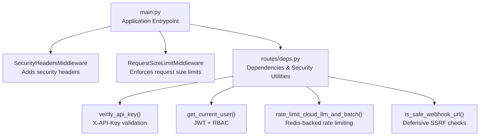
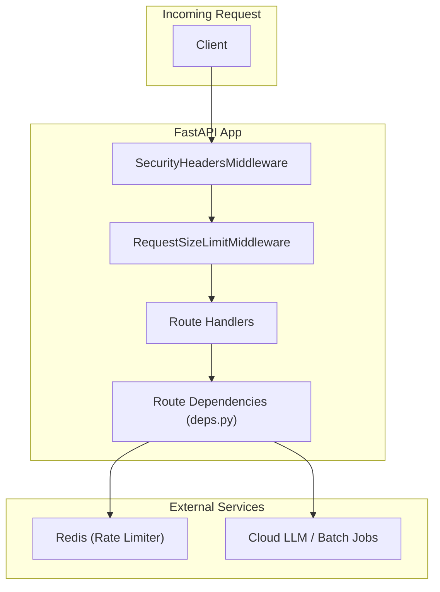
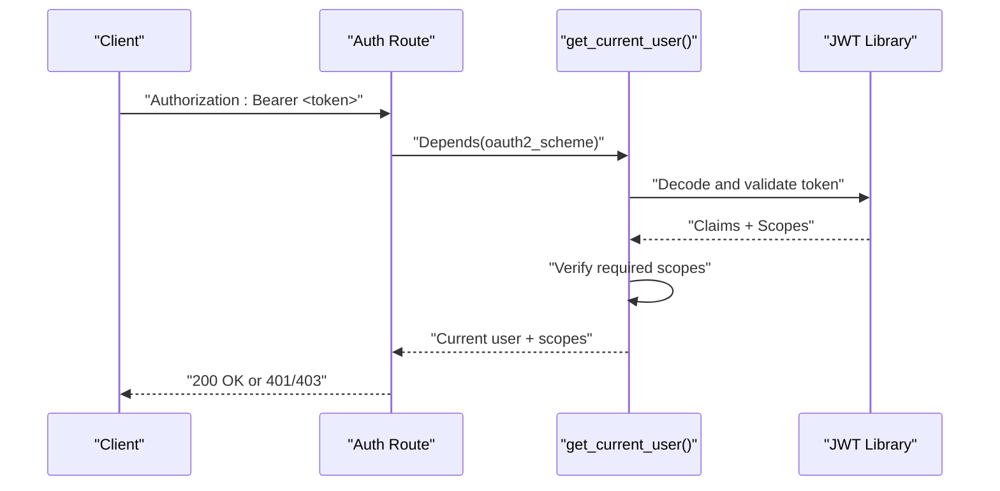
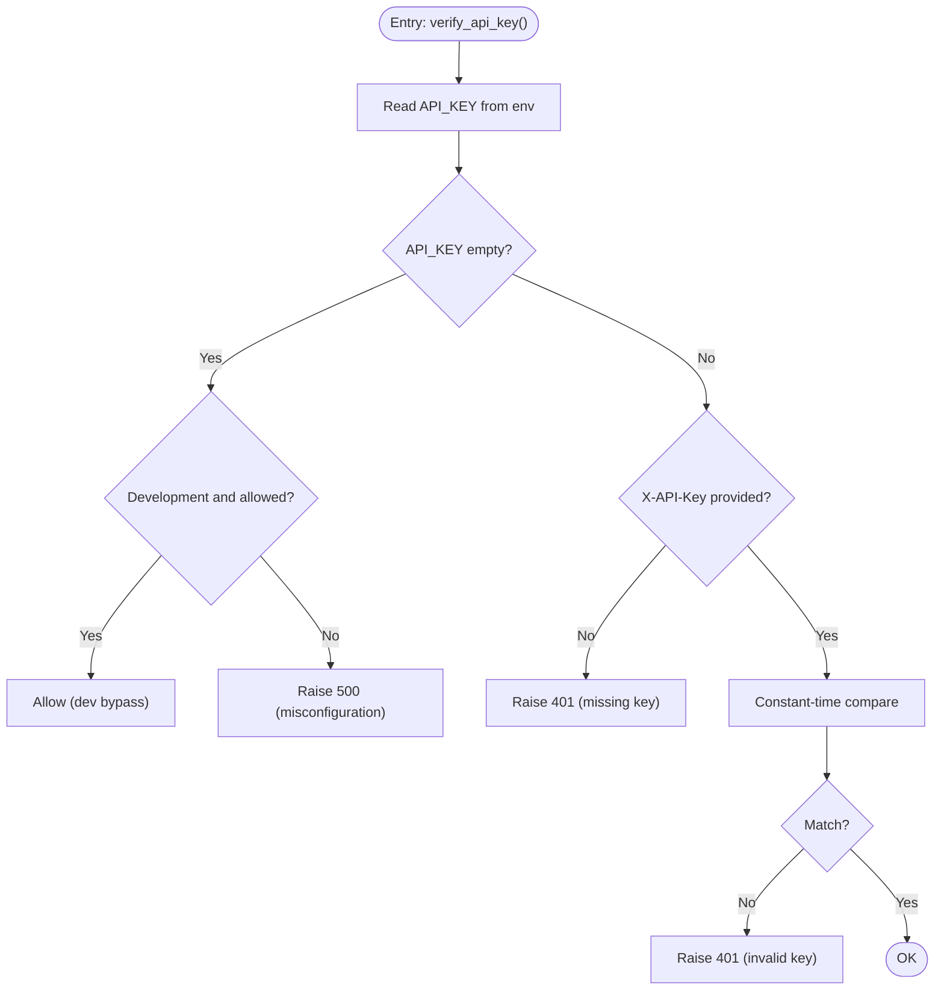
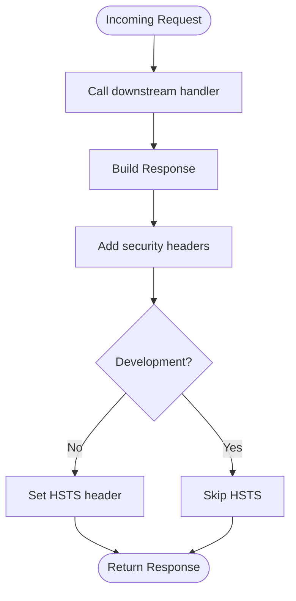
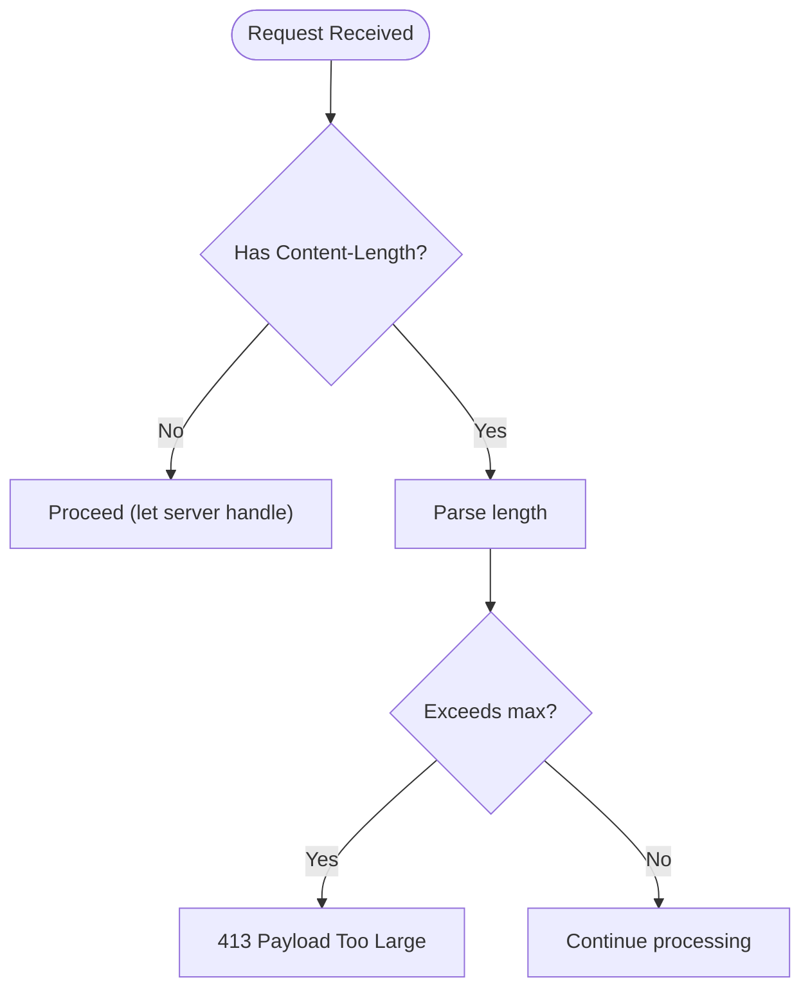
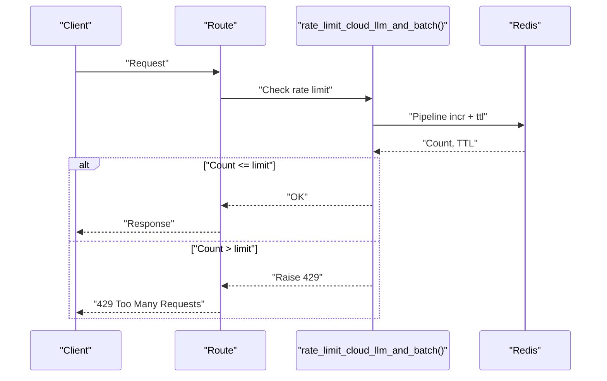
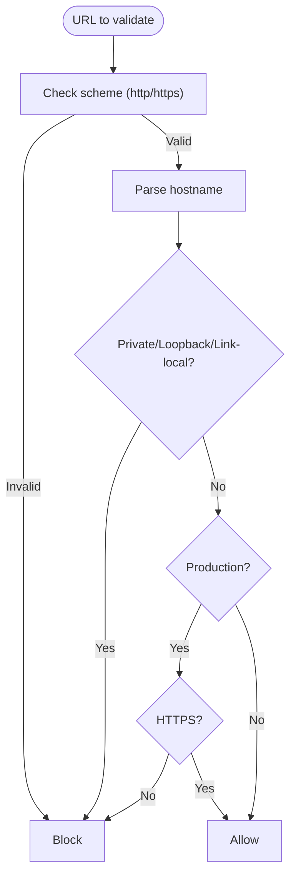
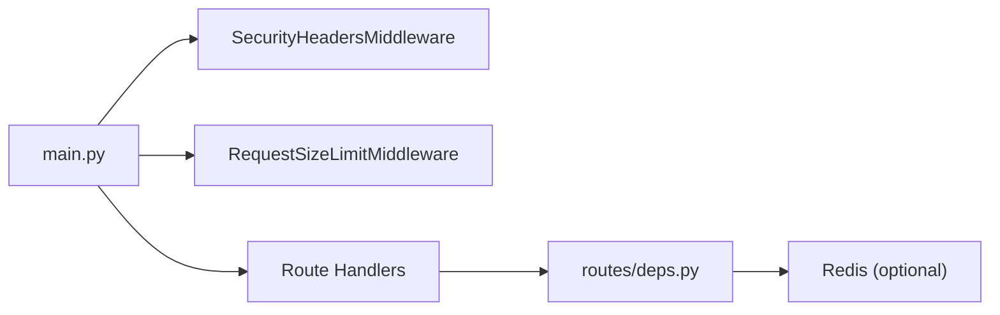

# Authentication and Security

<cite>
**Referenced Files in This Document**
- [main.py](file://cyberbullying_api/main.py)
- [deps.py](file://cyberbullying_api/routes/deps.py)
- [auth.py](file://cyberbullying_api/routes/auth.py)
- [SECURITY_HARDENING.md](file://docs/SECURITY_HARDENING.md)
- [test_security.py](file://cyberbullying_api/tests/test_security.py)
</cite>

## Table of Contents
1. [Introduction](#introduction)
2. [Project Structure](#project-structure)
3. [Core Components](#core-components)
4. [Architecture Overview](#architecture-overview)
5. [Detailed Component Analysis](#detailed-component-analysis)
6. [Dependency Analysis](#dependency-analysis)
7. [Performance Considerations](#performance-considerations)
8. [Troubleshooting Guide](#troubleshooting-guide)
9. [Conclusion](#conclusion)
10. [Appendices](#appendices)

## Introduction
This document explains the authentication and security model for the BullyGuard ID API. It covers JWT-based authentication, legacy X-API-Key support with constant-time verification, rate limiting, security middleware (headers, request size limits), environment-specific behavior, and production hardening guidance. Practical examples and best practices are included to help API consumers integrate securely.

## Project Structure
Security-related logic is implemented across the FastAPI application entrypoint and route dependencies:
- Application-wide middleware for security headers and request size limits
- Route-level dependencies for API key validation and JWT-based access control
- Tests validating rate limiting behavior and safe webhook URL checks

**Diagram sources**
- [main.py](file://cyberbullying_api/main.py)
- [deps.py](file://cyberbullying_api/routes/deps.py)

**Section sources**
- [main.py](file://cyberbullying_api/main.py)
- [deps.py](file://cyberbullying_api/routes/deps.py)

## Core Components
- JWT-based authentication with HS256 and scope-based RBAC
- Legacy X-API-Key header support with constant-time HMAC comparison
- Security headers middleware for standard protections
- Request size limit middleware to prevent oversized payloads
- Redis-backed rate limiting with configurable policy and fail-open/fail-closed behavior
- Defensive webhook URL validation to mitigate SSRF risks

**Section sources**
- [deps.py](file://cyberbullying_api/routes/deps.py)
- [main.py](file://cyberbullying_api/main.py)
- [SECURITY_HARDENING.md](file://docs/SECURITY_HARDENING.md)

## Architecture Overview
The security stack is layered:
- Middleware applies global protections to all responses and enforces request size limits
- Route dependencies enforce authentication and authorization policies
- Environment variables control behavior differences between development and production

**Diagram sources**
- [main.py](file://cyberbullying_api/main.py)
- [deps.py](file://cyberbullying_api/routes/deps.py)

## Detailed Component Analysis

### JWT-Based Authentication and RBAC
- Token source: Authorization Bearer header
- Algorithm: HS256
- Scope validation: Route handlers declare required scopes; mismatch yields 403
- Development bypass: When enabled and both JWT and API key are absent, a dev admin principal is returned for convenience
- Failure modes: Invalid/expired tokens yield 401 with WWW-Authenticate headers

**Diagram sources**
- [deps.py](file://cyberbullying_api/routes/deps.py)

**Section sources**
- [deps.py](file://cyberbullying_api/routes/deps.py)

### Legacy X-API-Key Authentication (Constant-Time)
- Header: X-API-Key
- Validation: Constant-time comparison using HMAC digest comparison
- Environment rules:
  - Development: Optionally bypass when a flag allows missing API key
  - Production/Staging: API key must be present and valid; otherwise 401 or server misconfiguration errors
- Backward compatibility: If no JWT but an API key is provided, a scoped principal is granted

**Diagram sources**
- [deps.py](file://cyberbullying_api/routes/deps.py)

**Section sources**
- [deps.py](file://cyberbullying_api/routes/deps.py)
- [SECURITY_HARDENING.md](file://docs/SECURITY_HARDENING.md)

### Security Headers Middleware
- Applied to all responses
- Standard headers include content-type options, frame options, XSS protection, referrer policy, permissions policy, cache-control
- HSTS enforced in non-development environments

**Diagram sources**
- [main.py](file://cyberbullying_api/main.py)

**Section sources**
- [main.py](file://cyberbullying_api/main.py)
- [SECURITY_HARDENING.md](file://docs/SECURITY_HARDENING.md)

### Request Size Limit Middleware
- Enforces a maximum request body size (default 10 MB)
- Returns 413 Payload Too Large when exceeded
- Validates against Content-Length header before processing body

**Diagram sources**
- [main.py](file://cyberbullying_api/main.py)

**Section sources**
- [main.py](file://cyberbullying_api/main.py)
- [SECURITY_HARDENING.md](file://docs/SECURITY_HARDENING.md)

### Rate Limiting (Redis-backed)
- Applies to expensive endpoints (e.g., hybrid prediction)
- Default policy: N requests per window per client IP and path
- Redis pipeline increments counters and sets expiry on first use
- Failure behavior:
  - Development: fail-open by default when Redis is unavailable
  - Production: fail-closed unless explicitly configured to fail-open

**Diagram sources**
- [deps.py](file://cyberbullying_api/routes/deps.py)

**Section sources**
- [deps.py](file://cyberbullying_api/routes/deps.py)
- [test_security.py](file://cyberbullying_api/tests/test_security.py)
- [SECURITY_HARDENING.md](file://docs/SECURITY_HARDENING.md)

### Webhook URL Safety (SSRF Mitigation)
- Validates scheme and hostname to avoid SSRF into internal/private networks
- Production defaults to HTTPS-only unless explicitly allowed
- Optional allowlist via environment variable for controlled integrations

**Diagram sources**
- [deps.py](file://cyberbullying_api/routes/deps.py)

**Section sources**
- [deps.py](file://cyberbullying_api/routes/deps.py)

## Dependency Analysis
- Route handlers depend on route dependencies for authentication and rate limiting
- Security middleware is registered globally and runs before route handlers
- Redis is an optional external dependency for rate limiting; tests simulate failures and validate behavior

**Diagram sources**
- [main.py](file://cyberbullying_api/main.py)
- [deps.py](file://cyberbullying_api/routes/deps.py)

**Section sources**
- [main.py](file://cyberbullying_api/main.py)
- [deps.py](file://cyberbullying_api/routes/deps.py)

## Performance Considerations
- Constant-time comparisons eliminate timing-side-channel risks
- Redis pipeline minimizes round-trips for counter updates
- Request size limits protect memory and CPU resources from oversized payloads
- HSTS reduces TLS negotiation overhead after initial connection

## Troubleshooting Guide
Common issues and resolutions:
- 401 Unauthorized (API key)
  - Ensure the X-API-Key header matches the configured value
  - Confirm environment is not in dev bypass mode unintentionally
- 401 Unauthorized (JWT)
  - Verify the Authorization header uses Bearer token format
  - Confirm token is unexpired and signed with the correct algorithm
- 403 Forbidden (RBAC)
  - Confirm the token includes the required scopes for the endpoint
- 429 Too Many Requests
  - Reduce request frequency or adjust rate limit configuration
  - Check Redis availability; in production, a failure blocks requests by design
- 413 Payload Too Large
  - Reduce request body size or increase limits cautiously
- 500 Internal Server Error (API key misconfiguration)
  - Set API_KEY in production; development may allow bypass via configuration

**Section sources**
- [deps.py](file://cyberbullying_api/routes/deps.py)
- [test_security.py](file://cyberbullying_api/tests/test_security.py)

## Conclusion
The BullyGuard ID API employs a layered security model combining modern JWT-based authentication, legacy API key support with constant-time verification, robust middleware protections, and configurable rate limiting. Production deployments should enforce strict environment variables, disable dev bypasses, and harden network and runtime configurations to mitigate common threats.

## Appendices

### Practical Examples and Best Practices
- Authentication flow
  - Use Bearer tokens for JWT-based access; include Authorization header
  - For legacy integrations, supply X-API-Key header
  - Combine both headers only when required by your integration needs
- Proper header usage
  - Authorization: Bearer <your-jwt-token>
  - X-API-Key: <your-api-key>
- Security best practices
  - Rotate secrets regularly and store them in secure environment stores
  - Disable dev bypass flags in production
  - Monitor rate limiting violations and adjust thresholds as needed
  - Prefer HTTPS-only webhooks and maintain allowlists for outbound destinations

**Section sources**
- [deps.py](file://cyberbullying_api/routes/deps.py)
- [SECURITY_HARDENING.md](file://docs/SECURITY_HARDENING.md)