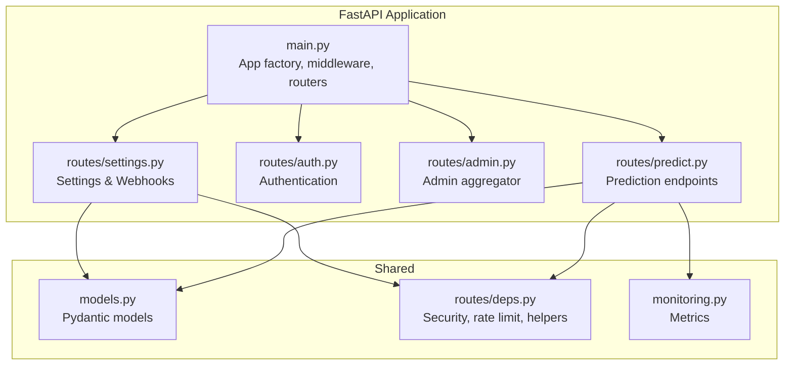
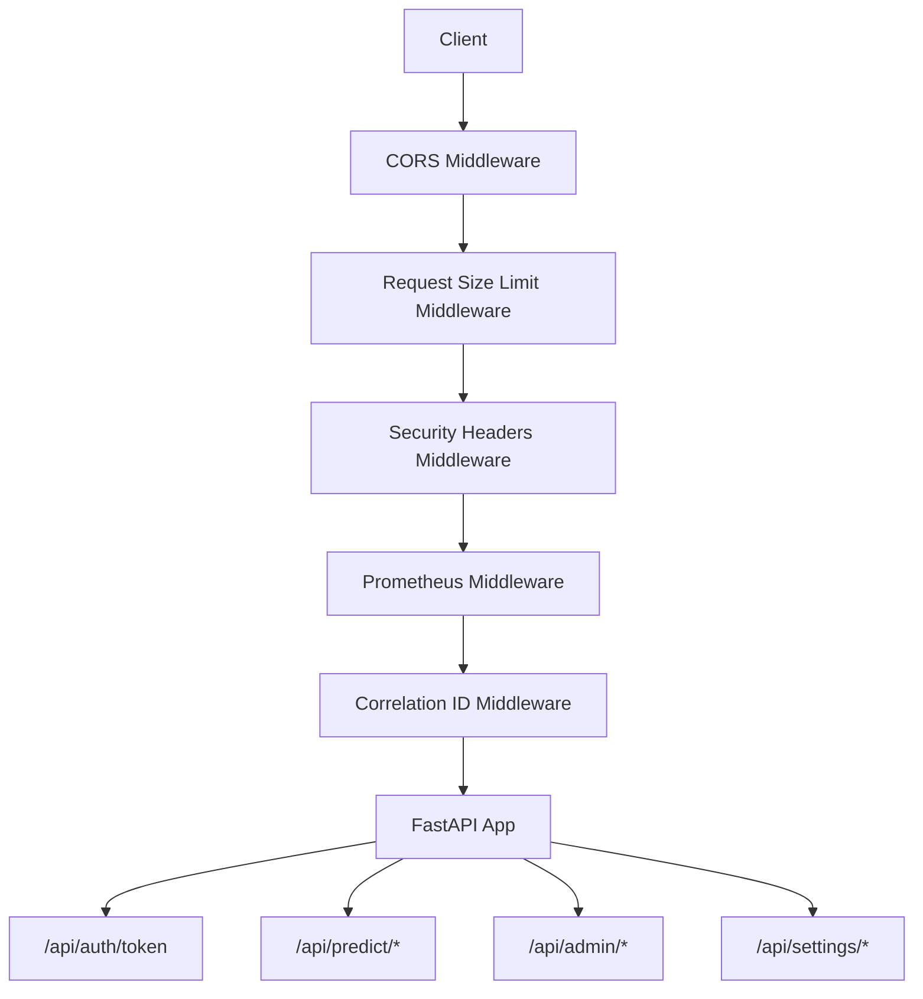
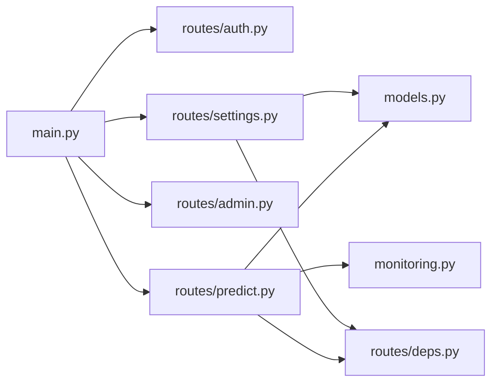

# Backend API Documentation

<cite>
**Referenced Files in This Document**
- [main.py](file://cyberbullying_api/main.py)
- [auth.py](file://cyberbullying_api/routes/auth.py)
- [predict.py](file://cyberbullying_api/routes/predict.py)
- [admin.py](file://cyberbullying_api/routes/admin.py)
- [settings.py](file://cyberbullying_api/routes/settings.py)
- [deps.py](file://cyberbullying_api/routes/deps.py)
- [models.py](file://cyberbullying_api/models.py)
- [monitoring.py](file://cyberbullying_api/monitoring.py)
- [README.md](file://cyberbullying_api/README.md)
</cite>

## Table of Contents
1. [Introduction](#introduction)
2. [Project Structure](#project-structure)
3. [Core Components](#core-components)
4. [Architecture Overview](#architecture-overview)
5. [Detailed Component Analysis](#detailed-component-analysis)
6. [Dependency Analysis](#dependency-analysis)
7. [Performance Considerations](#performance-considerations)
8. [Troubleshooting Guide](#troubleshooting-guide)
9. [Conclusion](#conclusion)
10. [Appendices](#appendices)

## Introduction
This document describes the BullyGuard ID backend API built with FastAPI. It covers authentication, prediction endpoints (including hybrid inference and streaming), administrative functions, settings management, training controls, and social media scraping. It also documents security measures, rate limiting, request size limits, and operational guidance.

## Project Structure
The API is organized around route modules under cyberbullying_api/routes/, with shared models and monitoring utilities. The main application wires routers, middleware, and CORS policies.

**Diagram sources**
- [main.py](file://cyberbullying_api/main.py)
- [predict.py](file://cyberbullying_api/routes/predict.py)
- [auth.py](file://cyberbullying_api/routes/auth.py)
- [admin.py](file://cyberbullying_api/routes/admin.py)
- [settings.py](file://cyberbullying_api/routes/settings.py)
- [models.py](file://cyberbullying_api/models.py)
- [deps.py](file://cyberbullying_api/routes/deps.py)
- [monitoring.py](file://cyberbullying_api/monitoring.py)

**Section sources**
- [main.py](file://cyberbullying_api/main.py)
- [README.md](file://cyberbullying_api/README.md)

## Core Components
- Authentication: JWT token issuance via OAuth2 form flow supporting admin credentials, API key, and guest modes.
- Prediction: Tiered inference endpoints (lexicon, ML, transformers, ensemble, hybrid, batch, streaming).
- Admin: Aggregator routing to scraper, HITL, training, and settings.
- Settings: Cookie management, webhook configuration, testing, and ensemble recalibration.
- Monitoring: Metrics exposure and prediction counters.
- Security middleware: Request size limits, CORS, security headers, correlation IDs, Prometheus metrics.

**Section sources**
- [auth.py](file://cyberbullying_api/routes/auth.py)
- [predict.py](file://cyberbullying_api/routes/predict.py)
- [admin.py](file://cyberbullying_api/routes/admin.py)
- [settings.py](file://cyberbullying_api/routes/settings.py)
- [monitoring.py](file://cyberbullying_api/monitoring.py)
- [main.py](file://cyberbullying_api/main.py)

## Architecture Overview
High-level API flow and middleware stack:

**Diagram sources**
- [main.py](file://cyberbullying_api/main.py)
- [auth.py](file://cyberbullying_api/routes/auth.py)
- [predict.py](file://cyberbullying_api/routes/predict.py)
- [admin.py](file://cyberbullying_api/routes/admin.py)
- [settings.py](file://cyberbullying_api/routes/settings.py)

## Detailed Component Analysis

### Authentication: /api/auth/token
- Method: POST
- URL: /api/auth/token
- Purpose: Issue JWT bearer tokens for programmatic access.
- Authentication: OAuth2PasswordRequestForm with support for:
  - Admin credentials (username/password)
  - API key mode (username=apikey, password=API_KEY)
  - Guest mode (username=guest, password=guest)
- Scopes: predict, admin (based on identity).
- Response:
  - access_token: JWT string
  - token_type: bearer
  - expires_in: seconds
  - scopes: granted scopes
- Errors:
  - 401 Unauthorized: invalid credentials/API key/guest mismatch
- Typical usage:
  - Use the returned bearer token in Authorization header for protected endpoints.
- Security considerations:
  - Production requires API_KEY environment variable.
  - Use HTTPS and short-lived tokens.

**Section sources**
- [auth.py](file://cyberbullying_api/routes/auth.py)
- [main.py](file://cyberbullying_api/main.py)

### Prediction Endpoints: /api/predict/*
- Base path: /api/predict
- Scope requirement: predict
- Endpoints:
  - POST /lexicon
    - Body: TextRequest
    - Response: LexiconResponse
    - Notes: Uses lexicon-based model.
  - POST /ml
    - Body: TextRequest
    - Response: MLResponse
    - Errors: 503 if ML model not loaded.
  - POST /transformers
    - Body: TextRequest
    - Response: TransformerResponse
    - Errors: 500 on internal transformer failure, 503 if model not loaded.
  - POST /ensemble
    - Body: TextRequest
    - Response: EnsembleResponse
    - Errors: 503 if ML model not loaded.
  - POST /hybrid
    - Body: TextRequest
    - Response: HybridResponse
    - Rate limiting: enforced via rate_limit_cloud_llm_and_batch dependency.
    - Side effects: optional webhook delivery for toxic/bullying detections; metrics recorded.
  - POST /batch
    - Body: BatchTextRequest
    - Response: BatchResponse
    - Constraints: texts must be non-empty and <= 500 chars; concurrency limited via semaphore.
    - Rate limiting: enforced via rate_limit_cloud_llm_and_batch dependency.
  - POST /hybrid/stream
    - Body: TextRequest
    - Response: Server-Sent Events stream
    - Notes: Streams intermediate chunks and final result; metrics recorded.

- Request/response schemas:
  - TextRequest: text (string), use_fuzzy (boolean)
  - BatchTextRequest: texts (array of strings)
  - Responses: per-tier responses plus HybridResponse with execution_time and word_importances.
- Error handling:
  - 422 Unprocessable Entity: batch item validation failures.
  - 500 Internal Server Error: transformer runtime errors.
  - 503 Service Unavailable: model not loaded.
- Streaming:
  - SSE events include chunk and done fields; final_data includes full prediction result.

**Section sources**
- [predict.py](file://cyberbullying_api/routes/predict.py)
- [models.py](file://cyberbullying_api/models.py)
- [deps.py](file://cyberbullying_api/routes/deps.py)
- [monitoring.py](file://cyberbullying_api/monitoring.py)

### Administrative Functions: /api/admin/*
- Base path: /api/admin
- Scope requirement: admin
- Composition:
  - routes.admin aggregates scrapers, HITL, training, and settings.
- Endpoints are exposed under /api/admin/* via included routers.

**Section sources**
- [admin.py](file://cyberbullying_api/routes/admin.py)
- [main.py](file://cyberbullying_api/main.py)

### Settings Management: /api/settings/*
- Base path: /api
- Scope requirement: admin
- Endpoints:
  - GET /settings
    - Returns current settings dictionary.
  - POST /settings
    - Body: SettingsUpdate (webhook_url, webhook_enabled)
    - Validates webhook URL via SSRF guard; saves settings.
  - POST /settings/test-webhook
    - Body: TestWebhookRequest (webhook_url)
    - Sends a test payload to the webhook URL and returns status.
  - POST /settings/cookies
    - Body: UpdateCookiesRequest (platform, cookies)
    - Writes cookies to cookies_tiktok.json or cookies_x.json depending on platform.
  - POST /settings/recalibrate
    - Recalibrates ensemble weights using validated samples from PostgreSQL or SQLite cache.
    - Returns success flag, calibrated status, and computed weights.

- Security considerations:
  - SSRF protection for webhook URLs.
  - File writes restricted to cookie files.

**Section sources**
- [settings.py](file://cyberbullying_api/routes/settings.py)
- [models.py](file://cyberbullying_api/models.py)

### Training Control: /api/train/*
- Base path: /api/train
- Scope requirement: admin
- Details:
  - Training endpoints are included under the admin aggregator and are scoped to admin.
  - Specific endpoints are defined in routes.training and mounted under /api/train.

**Section sources**
- [admin.py](file://cyberbullying_api/routes/admin.py)
- [main.py](file://cyberbullying_api/main.py)

### Social Media Scraping: /api/scraper/*
- Base path: /api/scraper
- Scope requirement: admin
- Details:
  - Scraping endpoints are included under the admin aggregator and are scoped to admin.
  - Specific endpoints are defined in routes.scraper and mounted under /api/scraper.

**Section sources**
- [admin.py](file://cyberbullying_api/routes/admin.py)
- [main.py](file://cyberbullying_api/main.py)

### API Versioning and Backward Compatibility
- Versioned router: /api/v1 with prefix /api/v1
  - Includes /api/v1/predict and /api/v1/admin
- Backward compatibility:
  - Legacy /api/predict and /api/admin are still included at top-level for older clients.

**Section sources**
- [main.py](file://cyberbullying_api/main.py)

### Webhook Configurations
- Configuration:
  - Enable/disable webhook via /api/settings with webhook_enabled and webhook_url.
  - SSRF protection ensures only safe URLs are accepted.
- Delivery:
  - Hybrid predictions trigger background webhook notifications when is_toxic or is_bully is true.
- Testing:
  - Use /api/settings/test-webhook to validate webhook connectivity.

**Section sources**
- [predict.py](file://cyberbullying_api/routes/predict.py)
- [settings.py](file://cyberbullying_api/routes/settings.py)

### Rate Limiting Mechanisms
- Applied to:
  - Hybrid and batch endpoints to protect cloud LLM usage and throughput.
- Implementation:
  - rate_limit_cloud_llm_and_batch dependency enforces limits.
- Guidance:
  - Batch requests are internally throttled to a concurrency cap.

**Section sources**
- [predict.py](file://cyberbullying_api/routes/predict.py)
- [deps.py](file://cyberbullying_api/routes/deps.py)

### Security Considerations
- Authentication:
  - API_KEY required in production; otherwise startup validation fails.
  - JWT tokens issued for programmatic access.
- CORS:
  - ALLOWED_ORIGINS must be explicit in production; wildcard not permitted.
- Request size limits:
  - Requests exceeding 10 MB (default) are rejected with 413.
- Security headers:
  - Standard headers applied to responses (e.g., X-Content-Type-Options, X-Frame-Options, Strict-Transport-Security in production).
- SSRF protection:
  - Webhook URLs validated before outbound calls.
- Environment checks:
  - Early validation of runtime configuration during startup.

**Section sources**
- [main.py](file://cyberbullying_api/main.py)
- [settings.py](file://cyberbullying_api/routes/settings.py)
- [predict.py](file://cyberbullying_api/routes/predict.py)

### Monitoring and Metrics
- Exposed endpoint:
  - GET /metrics for Prometheus scraping.
- Recorded metrics:
  - REQUESTS_TOTAL and REQUESTS_LATENCY for HTTP traffic.
  - PREDICTIONS_TOTAL for prediction outcomes (by decision_source and category).

**Section sources**
- [main.py](file://cyberbullying_api/main.py)
- [monitoring.py](file://cyberbullying_api/monitoring.py)

### Health and Model Status
- GET /health
  - Reports service health, environment, and connectivity to database and Redis.
  - Returns 503 if dependencies are unavailable.
- GET /models/status
  - Reports model loading status and thresholds.

**Section sources**
- [main.py](file://cyberbullying_api/main.py)

## Dependency Analysis
Key dependencies and relationships:

**Diagram sources**
- [main.py](file://cyberbullying_api/main.py)
- [auth.py](file://cyberbullying_api/routes/auth.py)
- [predict.py](file://cyberbullying_api/routes/predict.py)
- [admin.py](file://cyberbullying_api/routes/admin.py)
- [settings.py](file://cyberbullying_api/routes/settings.py)
- [models.py](file://cyberbullying_api/models.py)
- [deps.py](file://cyberbullying_api/routes/deps.py)
- [monitoring.py](file://cyberbullying_api/monitoring.py)

**Section sources**
- [main.py](file://cyberbullying_api/main.py)

## Performance Considerations
- Use batch endpoints for throughput and reduced overhead.
- Prefer hybrid predictions for balanced accuracy and latency.
- Leverage streaming for long-running predictions to receive progressive updates.
- Monitor /metrics for latency and error rates; adjust client-side retry/backoff accordingly.
- Respect rate limits to avoid throttling.

[No sources needed since this section provides general guidance]

## Troubleshooting Guide
- 401 Unauthorized on protected endpoints:
  - Ensure Authorization: Bearer <token> is present and valid.
  - Verify JWT secret and algorithm configuration.
- 403 Forbidden:
  - Confirm the token’s scopes include the required scope (predict or admin).
- 413 Payload Too Large:
  - Reduce request body size below the configured limit (default 10 MB).
- 503 Service Unavailable:
  - Check /health and /models/status; models may not be loaded.
- Webhook failures:
  - Use /api/settings/test-webhook to validate endpoint.
  - Ensure webhook_url passes SSRF validation.
- CORS errors:
  - Verify ALLOWED_ORIGINS includes your origin; wildcard not allowed in production.

**Section sources**
- [auth.py](file://cyberbullying_api/routes/auth.py)
- [main.py](file://cyberbullying_api/main.py)
- [settings.py](file://cyberbullying_api/routes/settings.py)
- [predict.py](file://cyberbullying_api/routes/predict.py)

## Conclusion
The BullyGuard ID API provides a secure, monitored, and scalable inference platform for Indonesian cyberbullying detection. Administrators can manage settings, webhooks, cookies, and training, while clients authenticate and consume prediction endpoints with robust safeguards.

[No sources needed since this section summarizes without analyzing specific files]

## Appendices

### Endpoint Reference Summary
- Authentication
  - POST /api/auth/token
- Prediction
  - POST /api/predict/lexicon
  - POST /api/predict/ml
  - POST /api/predict/transformers
  - POST /api/predict/ensemble
  - POST /api/predict/hybrid
  - POST /api/predict/batch
  - POST /api/predict/hybrid/stream
- Admin Aggregator
  - GET /api/admin/* (scrapers, training, HITL, settings)
- Settings
  - GET /api/settings
  - POST /api/settings
  - POST /api/settings/test-webhook
  - POST /api/settings/cookies
  - POST /api/settings/recalibrate
- Versioned
  - /api/v1/predict, /api/v1/admin
- Operational
  - GET /health
  - GET /models/status
  - GET /metrics

**Section sources**
- [main.py](file://cyberbullying_api/main.py)
- [auth.py](file://cyberbullying_api/routes/auth.py)
- [predict.py](file://cyberbullying_api/routes/predict.py)
- [admin.py](file://cyberbullying_api/routes/admin.py)
- [settings.py](file://cyberbullying_api/routes/settings.py)