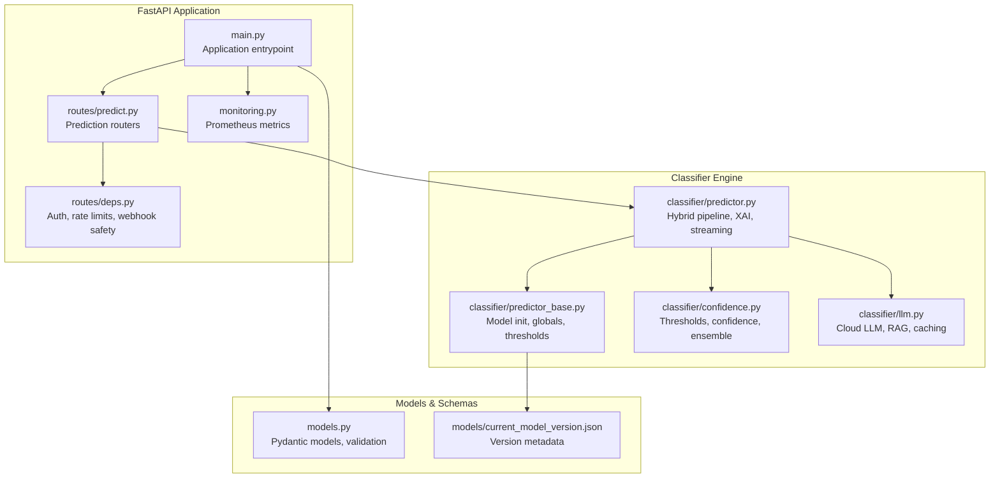
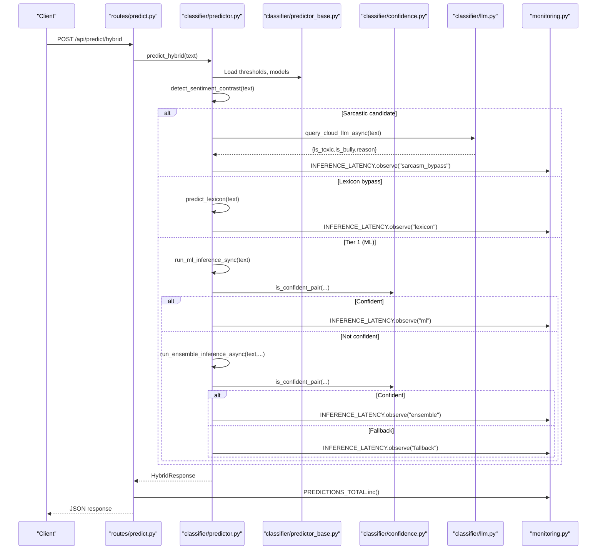
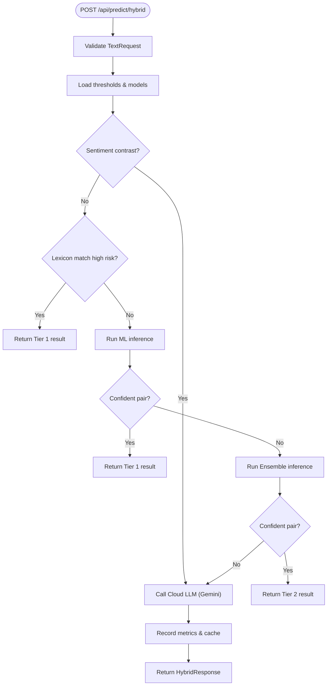
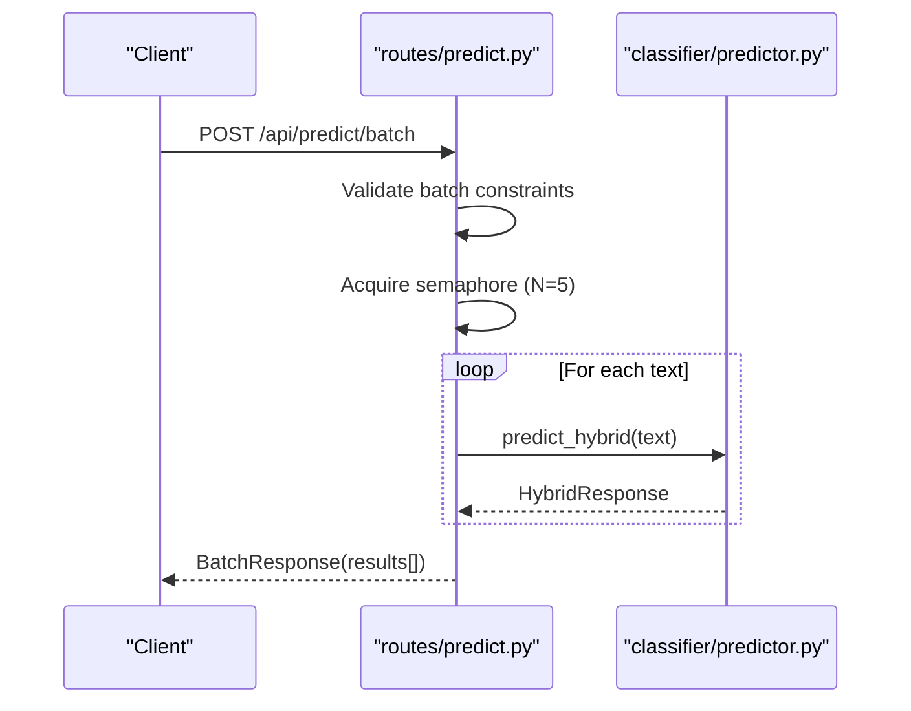
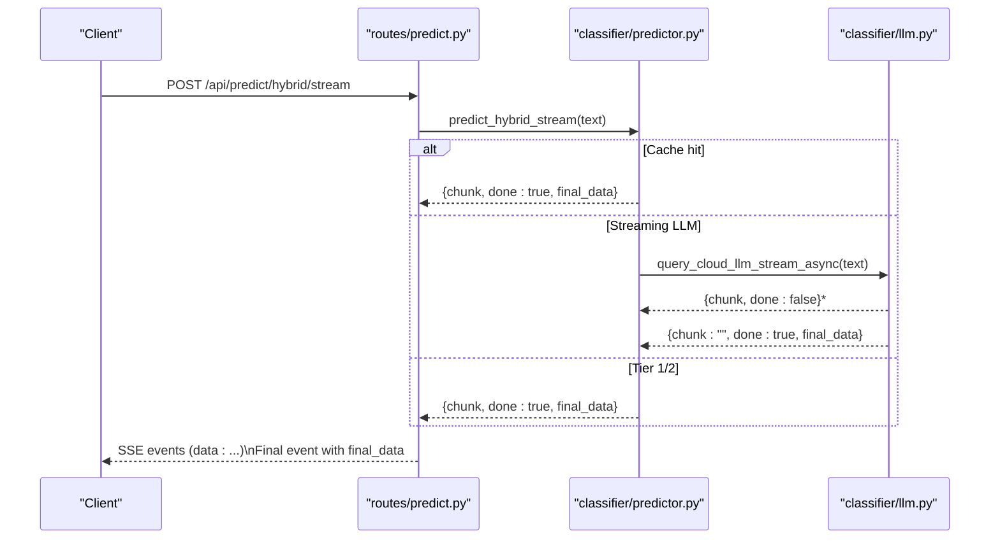
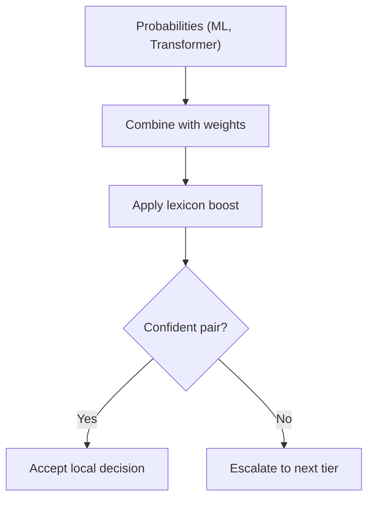
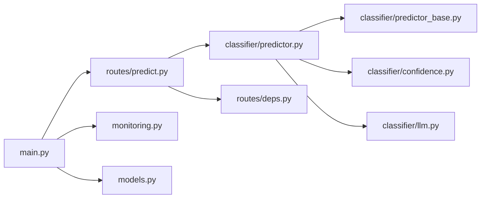

# Prediction Endpoints

<cite>
**Referenced Files in This Document**
- [main.py](file://cyberbullying_api/main.py)
- [routes/predict.py](file://cyberbullying_api/routes/predict.py)
- [routes/deps.py](file://cyberbullying_api/routes/deps.py)
- [classifier/predictor.py](file://cyberbullying_api/classifier/predictor.py)
- [classifier/predictor_base.py](file://cyberbullying_api/classifier/predictor_base.py)
- [classifier/confidence.py](file://cyberbullying_api/classifier/confidence.py)
- [classifier/llm.py](file://cyberbullying_api/classifier/llm.py)
- [models.py](file://cyberbullying_api/models.py)
- [monitoring.py](file://cyberbullying_api/monitoring.py)
- [tests/test_predictions.py](file://cyberbullying_api/tests/test_predictions.py)
</cite>

## Table of Contents
1. [Introduction](#introduction)
2. [Project Structure](#project-structure)
3. [Core Components](#core-components)
4. [Architecture Overview](#architecture-overview)
5. [Detailed Component Analysis](#detailed-component-analysis)
6. [Dependency Analysis](#dependency-analysis)
7. [Performance Considerations](#performance-considerations)
8. [Troubleshooting Guide](#troubleshooting-guide)
9. [Conclusion](#conclusion)
10. [Appendices](#appendices)

## Introduction
This document provides comprehensive API documentation for the prediction endpoints in the BullyGuard ID system. It covers the hybrid prediction pipeline across three tiers:
- Tier 1: Lexicon-based detection and classical machine learning (TF-IDF + Logistic Regression)
- Tier 2: Deep learning with ONNX quantized XLM-RoBERTa
- Tier 3: Cloud LLM (Gemini) with Retrieval-Augmented Generation (RAG) and explainable reasoning

Endpoints documented include:
- Single text classification: /api/predict/hybrid
- Batch classification: /api/predict/batch
- Streaming classification: /api/predict/hybrid/stream
- Individual tier endpoints: /api/predict/lexicon, /api/predict/ml, /api/predict/transformers, /api/predict/ensemble

The documentation details request/response schemas, input validation, confidence scoring, explainable AI (XAI) word importance analysis, batch processing, real-time inference optimization, threshold-based decision making, model versioning, performance characteristics, latency optimization, and error handling strategies.

## Project Structure
The prediction endpoints are implemented under the FastAPI application with modular classification logic and robust middleware for security, rate limiting, and observability.

**Diagram sources**
- [main.py:158-271](file://cyberbullying_api/main.py#L158-L271)
- [routes/predict.py:16-166](file://cyberbullying_api/routes/predict.py#L16-L166)
- [routes/deps.py:58-301](file://cyberbullying_api/routes/deps.py#L58-L301)
- [classifier/predictor.py:1-639](file://cyberbullying_api/classifier/predictor.py#L1-L639)
- [classifier/predictor_base.py:89-249](file://cyberbullying_api/classifier/predictor_base.py#L89-L249)
- [classifier/confidence.py:1-221](file://cyberbullying_api/classifier/confidence.py#L1-L221)
- [classifier/llm.py:1-370](file://cyberbullying_api/classifier/llm.py#L1-L370)
- [models.py:65-223](file://cyberbullying_api/models.py#L65-L223)
- [models/current_model_version.json:1-10](file://cyberbullying_api/models/current_model_version.json#L1-L10)

**Section sources**
- [main.py:158-271](file://cyberbullying_api/main.py#L158-L271)
- [routes/predict.py:16-166](file://cyberbullying_api/routes/predict.py#L16-L166)

## Core Components
- FastAPI application with versioned routes and security middleware
- Prediction routers exposing endpoints for individual tiers and hybrid inference
- Classifier engine orchestrating the hybrid pipeline with confidence-aware routing
- Confidence utilities for threshold management and ensemble combination
- Cloud LLM integration with RAG retrieval and caching
- Pydantic models defining request/response schemas and validation rules
- Prometheus metrics for request volume, latency, and inference breakdowns

Key responsibilities:
- Authentication and authorization via API key or JWT scopes
- Rate limiting for expensive endpoints
- SSRF-safe webhook delivery
- Real-time streaming with Server-Sent Events (SSE)
- Semantic caching and model reload via Redis Pub/Sub

**Section sources**
- [main.py:158-343](file://cyberbullying_api/main.py#L158-L343)
- [routes/deps.py:58-301](file://cyberbullying_api/routes/deps.py#L58-L301)
- [routes/predict.py:16-166](file://cyberbullying_api/routes/predict.py#L16-L166)
- [classifier/predictor.py:308-440](file://cyberbullying_api/classifier/predictor.py#L308-L440)
- [classifier/confidence.py:54-221](file://cyberbullying_api/classifier/confidence.py#L54-L221)
- [classifier/llm.py:110-370](file://cyberbullying_api/classifier/llm.py#L110-L370)
- [models.py:65-223](file://cyberbullying_api/models.py#L65-L223)
- [monitoring.py:1-49](file://cyberbullying_api/monitoring.py#L1-L49)

## Architecture Overview
The hybrid prediction pipeline follows a tiered decision-making strategy with confidence-aware routing and fallbacks.

**Diagram sources**
- [routes/predict.py:57-93](file://cyberbullying_api/routes/predict.py#L57-L93)
- [classifier/predictor.py:308-440](file://cyberbullying_api/classifier/predictor.py#L308-L440)
- [classifier/confidence.py:72-109](file://cyberbullying_api/classifier/confidence.py#L72-L109)
- [classifier/llm.py:110-230](file://cyberbullying_api/classifier/llm.py#L110-L230)
- [monitoring.py:28-32](file://cyberbullying_api/monitoring.py#L28-L32)

## Detailed Component Analysis

### Endpoint: /api/predict/hybrid
- Purpose: Single-text hybrid classification with confidence-aware routing and explainable AI.
- Authentication: Requires scope "predict".
- Rate limiting: Enforced via dependency for expensive endpoints.
- Request schema: TextRequest
- Response schema: HybridResponse
- Behavior:
  - Detects sentiment contrast to bypass to Tier 3 (Cloud LLM) when sarcasm is suspected.
  - Applies lexicon bypass for high-risk phrases.
  - Runs Tier 1 (ML) inference and checks confidence; if confident, returns immediately.
  - Otherwise runs Tier 2 (Ensemble) inference and checks confidence; if confident, returns.
  - Otherwise falls back to Tier 3 (Cloud LLM) with RAG examples.
  - Records execution time and emits Prometheus metrics.
  - Optionally sends webhook notifications for toxic/bullying detections.

**Diagram sources**
- [routes/predict.py:57-93](file://cyberbullying_api/routes/predict.py#L57-L93)
- [classifier/predictor.py:308-440](file://cyberbullying_api/classifier/predictor.py#L308-L440)
- [classifier/confidence.py:72-109](file://cyberbullying_api/classifier/confidence.py#L72-L109)
- [classifier/llm.py:110-230](file://cyberbullying_api/classifier/llm.py#L110-L230)
- [monitoring.py:15-19](file://cyberbullying_api/monitoring.py#L15-L19)

**Section sources**
- [routes/predict.py:57-93](file://cyberbullying_api/routes/predict.py#L57-L93)
- [classifier/predictor.py:308-440](file://cyberbullying_api/classifier/predictor.py#L308-L440)
- [models.py:65-131](file://cyberbullying_api/models.py#L65-L131)

### Endpoint: /api/predict/batch
- Purpose: Batch classification of up to 50 texts with concurrency control.
- Validation:
  - Each text length must be between 1 and 500 characters.
  - Total batch size must be between 1 and 50.
- Behavior:
  - Validates inputs.
  - Limits concurrent processing to 5 using a semaphore.
  - Executes hybrid inference for each text concurrently.
  - Aggregates results into BatchResponse with BatchItemResponse entries.

**Diagram sources**
- [routes/predict.py:95-123](file://cyberbullying_api/routes/predict.py#L95-L123)
- [models.py:132-157](file://cyberbullying_api/models.py#L132-L157)

**Section sources**
- [routes/predict.py:95-123](file://cyberbullying_api/routes/predict.py#L95-L123)
- [models.py:132-157](file://cyberbullying_api/models.py#L132-L157)

### Endpoint: /api/predict/hybrid/stream
- Purpose: Real-time streaming of classification progress using Server-Sent Events (SSE).
- Behavior:
  - Streams intermediate chunks until final result arrives.
  - Uses the same hybrid logic as the non-streaming endpoint.
  - Emits final_data with the complete HybridResponse upon completion.

**Diagram sources**
- [routes/predict.py:126-164](file://cyberbullying_api/routes/predict.py#L126-L164)
- [classifier/predictor.py:442-639](file://cyberbullying_api/classifier/predictor.py#L442-L639)
- [classifier/llm.py:232-370](file://cyberbullying_api/classifier/llm.py#L232-L370)

**Section sources**
- [routes/predict.py:126-164](file://cyberbullying_api/routes/predict.py#L126-L164)
- [classifier/predictor.py:442-639](file://cyberbullying_api/classifier/predictor.py#L442-L639)

### Individual Tier Endpoints
- /api/predict/lexicon: Lexicon-based detection with risk label and severity matches.
- /api/predict/ml: Classical ML (TF-IDF + Logistic Regression) with word importance.
- /api/predict/transformers: ONNX or PyTorch XLM-RoBERTa inference.
- /api/predict/ensemble: Weighted ensemble of ML and Transformer with lexicon boosting.

Validation and behavior:
- All endpoints require authenticated access (API key or JWT with "predict" scope).
- Transformers endpoint validates model availability and handles errors gracefully.
- Lexicon endpoint supports fuzzy matching toggle for performance vs. recall trade-off.

**Section sources**
- [routes/predict.py:18-42](file://cyberbullying_api/routes/predict.py#L18-L42)
- [classifier/predictor.py:148-246](file://cyberbullying_api/classifier/predictor.py#L148-L246)
- [classifier/predictor.py:251-278](file://cyberbullying_api/classifier/predictor.py#L251-L278)
- [classifier/predictor.py:103-144](file://cyberbullying_api/classifier/predictor.py#L103-L144)

### Request/Response Schemas
- TextRequest: text (1–500 chars), use_fuzzy (default false)
- LexiconResponse: normalized forms, risk label, matches, execution_time
- MLResponse, TransformerResponse, EnsembleResponse: is_toxic, is_bully, probabilities, category, word_importances, execution_time
- HybridResponse: adds decision_source, reason, word_importances, execution_time
- BatchTextRequest: texts (1–50), model_name (optional)
- BatchResponse: results (BatchItemResponse)

Validation highlights:
- Single endpoints enforce min/max lengths.
- Batch endpoint enforces batch size and per-text length constraints.
- URL validation helpers for scraping endpoints prevent SSRF.

**Section sources**
- [models.py:65-157](file://cyberbullying_api/models.py#L65-L157)

### Confidence Scoring and Threshold-Based Decision Making
- Thresholds are loaded from models/thresholds.json with defaults.
- ConfidenceDecision determines whether both toxic and bully probabilities are far enough from thresholds to avoid escalation.
- Ensemble combination uses normalized weights and minimum transformer signal threshold.
- Lexicon evidence is conservatively boosted without forcing extreme probabilities.
- LLM decisions are converted to pseudo-probabilities to avoid misleading certainty.

**Diagram sources**
- [classifier/confidence.py:122-151](file://cyberbullying_api/classifier/confidence.py#L122-L151)
- [classifier/confidence.py:179-201](file://cyberbullying_api/classifier/confidence.py#L179-L201)
- [classifier/predictor.py:261-267](file://cyberbullying_api/classifier/predictor.py#L261-L267)

**Section sources**
- [classifier/confidence.py:54-221](file://cyberbullying_api/classifier/confidence.py#L54-L221)
- [classifier/predictor_base.py:64-84](file://cyberbullying_api/classifier/predictor_base.py#L64-L84)

### Explainable AI (XAI) Word Importance Analysis
- WordImportance computed from linear model coefficients and TF-IDF weights.
- Provides per-word contributions to toxic and bully predictions.
- Returned in MLResponse, TransformerResponse, EnsembleResponse, and HybridResponse.

**Section sources**
- [classifier/predictor.py:53-99](file://cyberbullying_api/classifier/predictor.py#L53-L99)
- [models.py:85-89](file://cyberbullying_api/models.py#L85-L89)

### Model Versioning
- current_model_version.json tracks active version, model files, F1 scores, thresholds, and update timestamp.
- Model initialization loads LR and vectorizer jobs and prepares lexicon and RAG pools.

**Section sources**
- [models/current_model_version.json:1-10](file://cyberbullying_api/models/current_model_version.json#L1-L10)
- [classifier/predictor_base.py:89-249](file://cyberbullying_api/classifier/predictor_base.py#L89-L249)

### Real-Time Inference Optimization
- Async I/O and thread pooling for CPU-heavy tasks (ML, Transformers).
- ONNX runtime with CUDA/TensorRT providers when available; fallback to PyTorch.
- Semaphore-based concurrency control for batch processing.
- Streaming SSE for progressive feedback.
- Semantic caching and vector embeddings for classification memory.

**Section sources**
- [routes/predict.py:103-108](file://cyberbullying_api/routes/predict.py#L103-L108)
- [classifier/predictor.py:103-144](file://cyberbullying_api/classifier/predictor.py#L103-L144)
- [classifier/predictor.py:442-639](file://cyberbullying_api/classifier/predictor.py#L442-L639)
- [classifier/predictor_base.py:206-232](file://cyberbullying_api/classifier/predictor_base.py#L206-L232)

### Security and Rate Limiting
- API key verification and JWT scope enforcement.
- Rate limiting for Cloud LLM and batch endpoints with configurable limits and fail-open/fail-close behavior.
- SSRF-safe webhook URL validation with allowlist support.
- CORS, security headers, and request size limits.

**Section sources**
- [routes/deps.py:58-301](file://cyberbullying_api/routes/deps.py#L58-L301)
- [main.py:187-251](file://cyberbullying_api/main.py#L187-L251)

## Dependency Analysis
The prediction pipeline exhibits clear separation of concerns:
- Routes depend on classifier logic and security dependencies.
- Classifier depends on base initialization, confidence utilities, and LLM integration.
- Monitoring is decoupled and injected via Prometheus metrics.
- Models define schemas and validation rules.

**Diagram sources**
- [routes/predict.py:1-166](file://cyberbullying_api/routes/predict.py#L1-L166)
- [classifier/predictor.py:1-639](file://cyberbullying_api/classifier/predictor.py#L1-L639)
- [classifier/predictor_base.py:1-249](file://cyberbullying_api/classifier/predictor_base.py#L1-L249)
- [classifier/confidence.py:1-221](file://cyberbullying_api/classifier/confidence.py#L1-L221)
- [classifier/llm.py:1-370](file://cyberbullying_api/classifier/llm.py#L1-L370)
- [main.py:158-271](file://cyberbullying_api/main.py#L158-L271)
- [monitoring.py:1-49](file://cyberbullying_api/monitoring.py#L1-L49)
- [models.py:1-223](file://cyberbullying_api/models.py#L1-L223)

**Section sources**
- [routes/predict.py:1-166](file://cyberbullying_api/routes/predict.py#L1-L166)
- [classifier/predictor.py:1-639](file://cyberbullying_api/classifier/predictor.py#L1-L639)

## Performance Considerations
- Latency breakdown by tier is tracked via Prometheus histograms.
- ONNX quantized models improve throughput; CUDA/TensorRT providers accelerate inference when available.
- Async I/O and thread pooling prevent blocking the event loop.
- Streaming SSE reduces perceived latency by delivering incremental updates.
- Concurrency limits prevent resource exhaustion during batch processing.
- Semantic caching reduces repeated computations for similar texts.

[No sources needed since this section provides general guidance]

## Troubleshooting Guide
Common issues and resolutions:
- Model not loaded: Tier 1 endpoints return service unavailable when ML/transformer models are missing.
- Cloud LLM failures: When GEMINI_API_KEY is unset or API calls fail, fallback occurs with conservative decisions.
- Rate limit exceeded: Requests to Cloud LLM and batch endpoints are rate-limited; adjust environment variables or retry.
- Webhook SSRF attempts: URLs are validated; ensure HTTPS and allowlisted domains.
- Streaming errors: SSE endpoints log and return error messages; verify network connectivity and API key.

**Section sources**
- [routes/predict.py:24-36](file://cyberbullying_api/routes/predict.py#L24-L36)
- [classifier/llm.py:120-230](file://cyberbullying_api/classifier/llm.py#L120-L230)
- [routes/deps.py:112-164](file://cyberbullying_api/routes/deps.py#L112-L164)
- [routes/predict.py:44-56](file://cyberbullying_api/routes/predict.py#L44-L56)

## Conclusion
The BullyGuard ID prediction endpoints provide a robust, explainable, and scalable hybrid classification system. The tiered architecture balances speed and accuracy, with confidence-aware routing and fallbacks to a powerful Cloud LLM. The API offers both synchronous and streaming modes, comprehensive validation, and strong operational controls including rate limiting, security headers, and observability.

[No sources needed since this section summarizes without analyzing specific files]

## Appendices

### Practical Examples

- Single text classification request
  - Endpoint: POST /api/predict/hybrid
  - Request body: {"text": "Your text here", "use_fuzzy": false}
  - Response includes is_toxic, is_bully, probability_toxic, probability_bully, category, decision_source, reason, word_importances, execution_time

- Batch classification request
  - Endpoint: POST /api/predict/batch
  - Request body: {"texts": ["text1", "text2", "..."], "model_name": "llama3.2:3b"}
  - Response: results array with per-item fields

- Streaming classification request
  - Endpoint: POST /api/predict/hybrid/stream
  - Response: SSE stream with incremental chunks and a final event containing final_data

- Response interpretation
  - decision_source indicates which tier produced the result
  - reason provides human-readable explanation
  - word_importances lists words driving toxicity/bullying predictions
  - category encodes nuanced outcomes (e.g., sarcasm, slang, normal)

**Section sources**
- [routes/predict.py:57-164](file://cyberbullying_api/routes/predict.py#L57-L164)
- [models.py:65-157](file://cyberbullying_api/models.py#L65-L157)
- [tests/test_predictions.py:3-224](file://cyberbullying_api/tests/test_predictions.py#L3-L224)