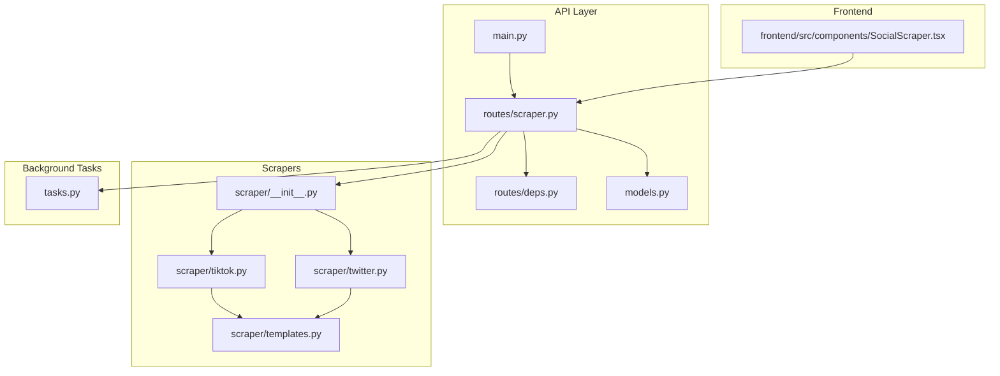
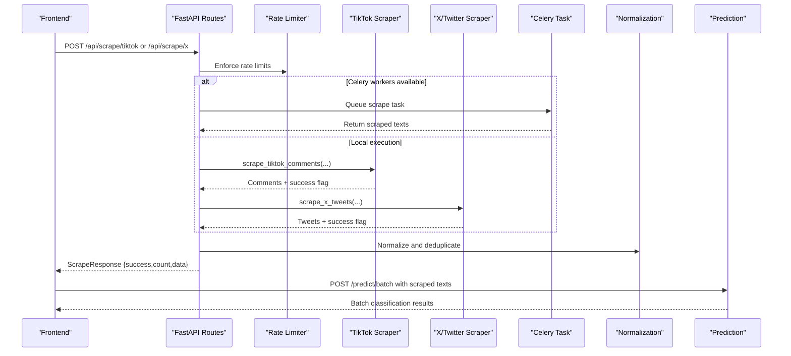
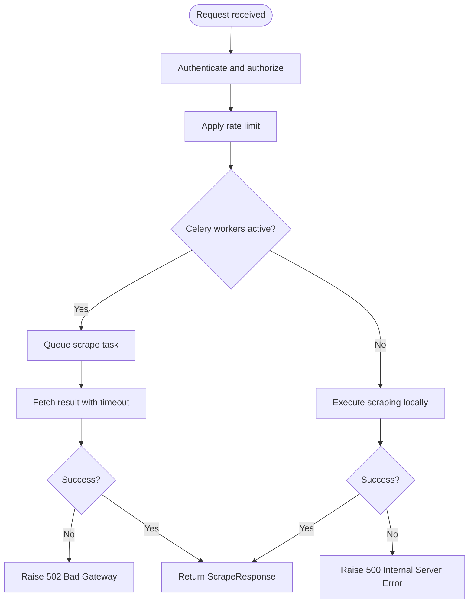
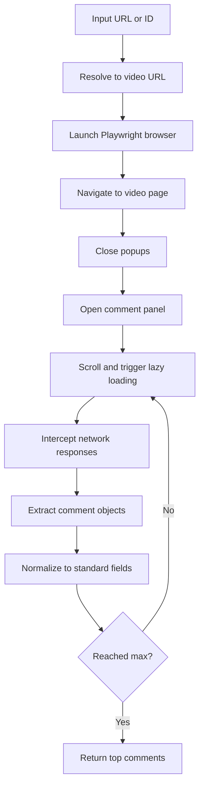
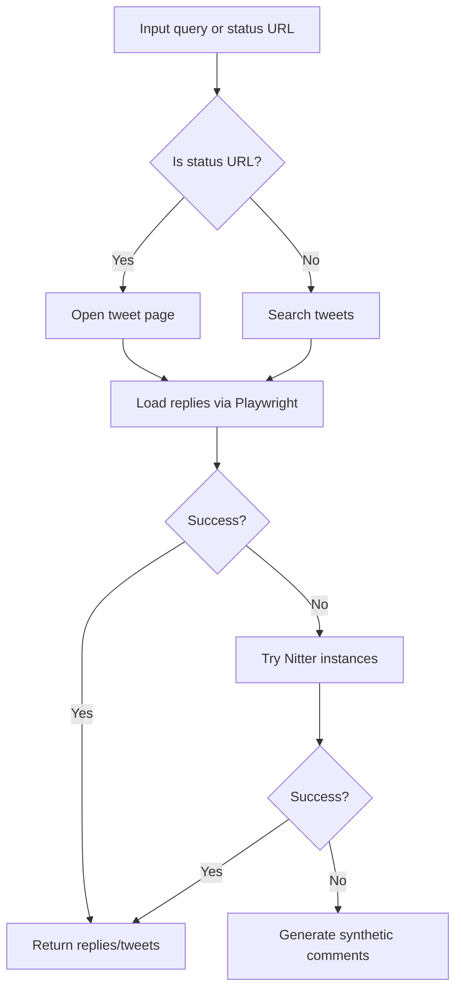
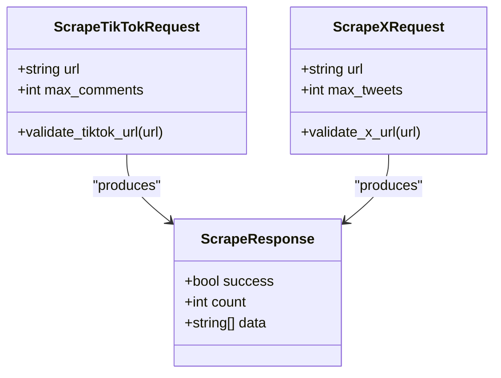
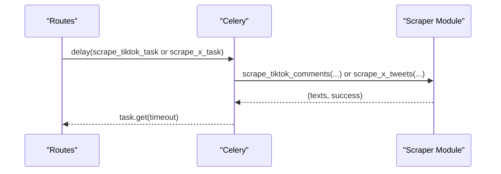
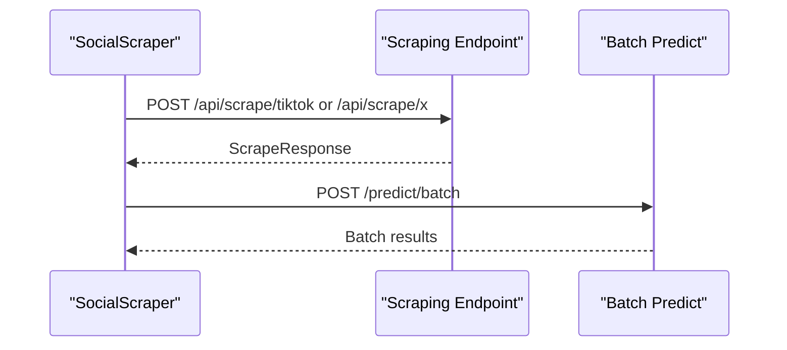
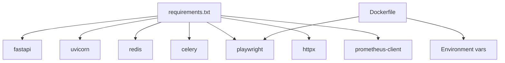

# Social Media Integration

<cite>
**Referenced Files in This Document**
- [main.py](file://cyberbullying_api/main.py)
- [routes/scraper.py](file://cyberbullying_api/routes/scraper.py)
- [routes/deps.py](file://cyberbullying_api/routes/deps.py)
- [models.py](file://cyberbullying_api/models.py)
- [scraper/__init__.py](file://cyberbullying_api/scraper/__init__.py)
- [scraper/tiktok.py](file://cyberbullying_api/scraper/tiktok.py)
- [scraper/twitter.py](file://cyberbullying_api/scraper/twitter.py)
- [scraper/templates.py](file://cyberbullying_api/scraper/templates.py)
- [tasks.py](file://cyberbullying_api/tasks.py)
- [Dockerfile](file://cyberbullying_api/Dockerfile)
- [requirements.txt](file://cyberbullying_api/requirements.txt)
- [frontend/src/components/SocialScraper.tsx](file://frontend/src/components/SocialScraper.tsx)
</cite>

## Table of Contents
1. [Introduction](#introduction)
2. [Project Structure](#project-structure)
3. [Core Components](#core-components)
4. [Architecture Overview](#architecture-overview)
5. [Detailed Component Analysis](#detailed-component-analysis)
6. [Dependency Analysis](#dependency-analysis)
7. [Performance Considerations](#performance-considerations)
8. [Troubleshooting Guide](#troubleshooting-guide)
9. [Conclusion](#conclusion)
10. [Appendices](#appendices)

## Introduction
This document explains the social media integration API endpoints in the BullyGuard ID system, focusing on scraping capabilities for TikTok and X/Twitter. It covers:
- Endpoint design and request/response contracts
- Platform-specific scraping mechanisms (Playwright-based, cookies, Nitter fallback)
- Content normalization and data processing workflows
- Authentication, rate limiting, and operational safeguards
- Integration with the prediction system and frontend
- Practical configuration, ethical and legal considerations, and troubleshooting

## Project Structure
The social media scraping feature spans the API layer, route handlers, scraping modules, and supporting infrastructure:
- API entrypoint and middleware orchestration
- Route handlers for scraping endpoints
- Platform-specific scrapers with normalization and fallbacks
- Celery task orchestration for asynchronous scraping
- Frontend integration for end-to-end scraping and classification

**Diagram sources**
- [main.py:156-270](file://cyberbullying_api/main.py#L156-L270)
- [routes/scraper.py:22-103](file://cyberbullying_api/routes/scraper.py#L22-L103)
- [routes/deps.py:110-163](file://cyberbullying_api/routes/deps.py#L110-L163)
- [models.py:171-195](file://cyberbullying_api/models.py#L171-L195)
- [scraper/__init__.py:1-5](file://cyberbullying_api/scraper/__init__.py#L1-L5)
- [scraper/tiktok.py:277-454](file://cyberbullying_api/scraper/tiktok.py#L277-L454)
- [scraper/twitter.py:27-227](file://cyberbullying_api/scraper/twitter.py#L27-L227)
- [scraper/templates.py:65-96](file://cyberbullying_api/scraper/templates.py#L65-L96)
- [tasks.py:85-96](file://cyberbullying_api/tasks.py#L85-L96)
- [frontend/src/components/SocialScraper.tsx:58-156](file://frontend/src/components/SocialScraper.tsx#L58-L156)

**Section sources**
- [main.py:156-270](file://cyberbullying_api/main.py#L156-L270)
- [routes/scraper.py:22-103](file://cyberbullying_api/routes/scraper.py#L22-L103)
- [routes/deps.py:110-163](file://cyberbullying_api/routes/deps.py#L110-L163)
- [models.py:171-195](file://cyberbullying_api/models.py#L171-L195)
- [scraper/__init__.py:1-5](file://cyberbullying_api/scraper/__init__.py#L1-L5)
- [scraper/tiktok.py:277-454](file://cyberbullying_api/scraper/tiktok.py#L277-L454)
- [scraper/twitter.py:27-227](file://cyberbullying_api/scraper/twitter.py#L27-L227)
- [scraper/templates.py:65-96](file://cyberbullying_api/scraper/templates.py#L65-L96)
- [tasks.py:85-96](file://cyberbullying_api/tasks.py#L85-L96)
- [frontend/src/components/SocialScraper.tsx:58-156](file://frontend/src/components/SocialScraper.tsx#L58-L156)

## Core Components
- API endpoints:
  - POST /api/scrape/tiktok: Extracts comments from a TikTok video URL or keyword.
  - POST /api/scrape/x: Extracts tweets or replies from X/Twitter URLs.
- Request/response models:
  - ScrapeTikTokRequest and ScrapeXRequest define validated inputs and SSRF-safe URL constraints.
  - ScrapeResponse standardizes scraping outcomes.
- Scrapers:
  - TikTok scraper uses Playwright interception and normalization; falls back to generated templates.
  - X/Twitter scraper supports Playwright with session cookies and Nitter instances; falls back to generated templates.
- Background tasks:
  - Celery tasks delegate scraping to avoid blocking the API.
- Frontend integration:
  - SocialScraper component orchestrates scraping and batch prediction.

**Section sources**
- [routes/scraper.py:25-103](file://cyberbullying_api/routes/scraper.py#L25-L103)
- [models.py:171-195](file://cyberbullying_api/models.py#L171-L195)
- [scraper/tiktok.py:427-454](file://cyberbullying_api/scraper/tiktok.py#L427-L454)
- [scraper/twitter.py:134-227](file://cyberbullying_api/scraper/twitter.py#L134-L227)
- [tasks.py:85-96](file://cyberbullying_api/tasks.py#L85-L96)
- [frontend/src/components/SocialScraper.tsx:58-156](file://frontend/src/components/SocialScraper.tsx#L58-L156)

## Architecture Overview
The scraping pipeline integrates API validation, rate limiting, optional Celery offloading, platform-specific scraping, normalization, and optional fallback generation.

**Diagram sources**
- [routes/scraper.py:25-103](file://cyberbullying_api/routes/scraper.py#L25-L103)
- [routes/deps.py:110-163](file://cyberbullying_api/routes/deps.py#L110-L163)
- [scraper/tiktok.py:427-454](file://cyberbullying_api/scraper/tiktok.py#L427-L454)
- [scraper/twitter.py:134-227](file://cyberbullying_api/scraper/twitter.py#L134-L227)
- [tasks.py:85-96](file://cyberbullying_api/tasks.py#L85-L96)
- [frontend/src/components/SocialScraper.tsx:99-108](file://frontend/src/components/SocialScraper.tsx#L99-L108)

## Detailed Component Analysis

### API Endpoints: /api/scrape/tiktok and /api/scrape/x
- Authentication and scope:
  - Endpoints are scoped under admin and protected by JWT/OAuth and/or API key checks.
- Rate limiting:
  - Shared cloud LLM and batch rate limiter applies per-IP and per-path windows.
- Execution modes:
  - If Celery workers are detected, scraping is queued and results fetched synchronously.
  - Otherwise, scraping runs locally in a separate thread with a dedicated event loop.
- Responses:
  - Standardized ScrapeResponse indicating success, count, and extracted texts.

**Diagram sources**
- [routes/scraper.py:25-103](file://cyberbullying_api/routes/scraper.py#L25-L103)
- [routes/deps.py:110-163](file://cyberbullying_api/routes/deps.py#L110-L163)

**Section sources**
- [routes/scraper.py:25-103](file://cyberbullying_api/routes/scraper.py#L25-L103)
- [routes/deps.py:56-90](file://cyberbullying_api/routes/deps.py#L56-L90)

### TikTok Scraper: Playwright interception and normalization
- URL handling:
  - Accepts full video URLs or numeric video IDs; otherwise performs a search.
- Browser automation:
  - Uses Playwright Chromium persistent context with anti-bot evasion.
  - Intercepts network responses to capture comment payloads.
- Comment discovery:
  - Recursively detects comment-like structures in JSON responses.
  - Normalizes fields (comment text, usernames, likes, replies, timestamps).
- Interaction logic:
  - Auto-open comment panel and smart scrolling to trigger lazy loading.
- Fallback:
  - Generates synthetic comments when scraping fails.

**Diagram sources**
- [scraper/tiktok.py:277-425](file://cyberbullying_api/scraper/tiktok.py#L277-L425)

**Section sources**
- [scraper/tiktok.py:20-109](file://cyberbullying_api/scraper/tiktok.py#L20-L109)
- [scraper/tiktok.py:277-454](file://cyberbullying_api/scraper/tiktok.py#L277-L454)

### X/Twitter Scraper: Cookies, Nitter fallback, and replies
- URL detection:
  - Detects tweet replies via status URLs; otherwise treats as search queries.
- Playwright with cookies:
  - Requires a cookies file for authenticated scraping.
  - Searches live tweets or opens specific tweet pages to extract replies.
- Public instances:
  - Falls back to Nitter public instances to scrape tweets/replies without cookies.
- Fallback:
  - Generates synthetic comments when scraping fails.

**Diagram sources**
- [scraper/twitter.py:134-227](file://cyberbullying_api/scraper/twitter.py#L134-L227)

**Section sources**
- [scraper/twitter.py:27-227](file://cyberbullying_api/scraper/twitter.py#L27-L227)

### Data Models and Validation
- ScrapeTikTokRequest and ScrapeXRequest:
  - Enforce URL constraints via SSRF-safe validator for TikTok and X/Twitter domains.
  - Enforce bounds for max items (1–100).
- ScrapeResponse:
  - Standardized shape for scraping results.

**Diagram sources**
- [models.py:171-195](file://cyberbullying_api/models.py#L171-L195)

**Section sources**
- [models.py:171-195](file://cyberbullying_api/models.py#L171-L195)

### Celery Offloading
- Tasks:
  - scrape_tiktok_task and scrape_x_task encapsulate scraping logic for asynchronous execution.
- Behavior:
  - Returns structured results with success flags and collected texts.

**Diagram sources**
- [tasks.py:85-96](file://cyberbullying_api/tasks.py#L85-L96)
- [routes/scraper.py:39-50](file://cyberbullying_api/routes/scraper.py#L39-L50)

**Section sources**
- [tasks.py:85-96](file://cyberbullying_api/tasks.py#L85-L96)
- [routes/scraper.py:39-50](file://cyberbullying_api/routes/scraper.py#L39-L50)

### Frontend Integration
- SocialScraper component:
  - Detects platform from URL, posts to appropriate scraping endpoint, and triggers batch prediction.
  - Provides analytics and manual labeling hooks for human-in-the-loop validation.

**Diagram sources**
- [frontend/src/components/SocialScraper.tsx:58-156](file://frontend/src/components/SocialScraper.tsx#L58-L156)

**Section sources**
- [frontend/src/components/SocialScraper.tsx:58-156](file://frontend/src/components/SocialScraper.tsx#L58-L156)

## Dependency Analysis
- Runtime dependencies include FastAPI, Uvicorn, Redis, Celery, Playwright, httpx, and Prometheus client.
- Dockerfile configures optional Playwright installation and sets environment variables for browser caching and non-root execution.
- Scrapers rely on Playwright availability and optional cookies/session files.

**Diagram sources**
- [requirements.txt:1-25](file://cyberbullying_api/requirements.txt#L1-L25)
- [Dockerfile:30-47](file://cyberbullying_api/Dockerfile#L30-L47)

**Section sources**
- [requirements.txt:1-25](file://cyberbullying_api/requirements.txt#L1-L25)
- [Dockerfile:30-47](file://cyberbullying_api/Dockerfile#L30-L47)

## Performance Considerations
- Asynchronous execution:
  - Scraping runs in a separate thread with a fresh event loop to prevent blocking the API.
- Rate limiting:
  - Configurable per-IP and per-path limits; can fail closed in production.
- Browser overhead:
  - Playwright requires resources; consider scaling Celery workers and headless mode.
- Network interception:
  - Efficiently captures comment payloads; minimize unnecessary retries.

[No sources needed since this section provides general guidance]

## Troubleshooting Guide
- Authentication failures:
  - Ensure API key or valid JWT with admin scope is provided.
- Rate limit exceeded:
  - Reduce request frequency or adjust environment variables for limits.
- Scraping errors:
  - Verify Playwright installation and browser path; confirm cookies file exists for X/Twitter.
  - Check Celery connectivity and worker availability.
- SSRF validation:
  - Requests must target allowed domains; adjust validators if integrating custom domains.

**Section sources**
- [routes/deps.py:56-90](file://cyberbullying_api/routes/deps.py#L56-L90)
- [routes/deps.py:110-163](file://cyberbullying_api/routes/deps.py#L110-L163)
- [models.py:9-64](file://cyberbullying_api/models.py#L9-L64)
- [routes/scraper.py:39-50](file://cyberbullying_api/routes/scraper.py#L39-L50)

## Conclusion
The BullyGuard ID social media integration provides robust, validated, and scalable scraping for TikTok and X/Twitter. It combines secure API design, rate limiting, optional Celery offloading, platform-specific scraping strategies, and synthetic fallbacks to ensure resilient operation. The standardized response model and frontend integration enable seamless downstream classification and actionable insights.

[No sources needed since this section summarizes without analyzing specific files]

## Appendices

### Practical Examples and Configuration
- Example request payloads:
  - TikTok: { "url": "<video-url-or-id>", "max_comments": 20 }
  - X/Twitter: { "url": "<video-url-or-search-query>", "max_tweets": 20 }
- Environment variables:
  - API_KEY, JWT_SECRET, RATE_LIMIT_REQUESTS_PER_MINUTE, RATE_LIMIT_WINDOW_SECONDS, PROXY_SERVER, TIKTOK_HEADLESS, ALLOWED_ORIGINS, REDIS_URL
- Deployment:
  - Use Docker with optional Playwright installation and non-root user.

**Section sources**
- [models.py:171-195](file://cyberbullying_api/models.py#L171-L195)
- [routes/deps.py:31-54](file://cyberbullying_api/routes/deps.py#L31-L54)
- [Dockerfile:30-47](file://cyberbullying_api/Dockerfile#L30-L47)

### Ethical and Legal Guidelines
- Respect platform terms of service and rate limits.
- Apply strict SSRF validation and avoid scraping unauthorized content.
- Prefer authenticated scraping with proper credentials and privacy-compliant storage.
- Monitor and log scraping activities for auditability.

[No sources needed since this section provides general guidance]