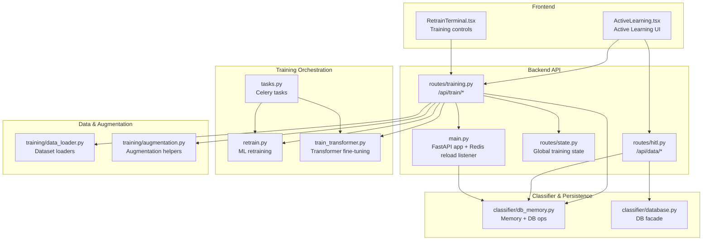
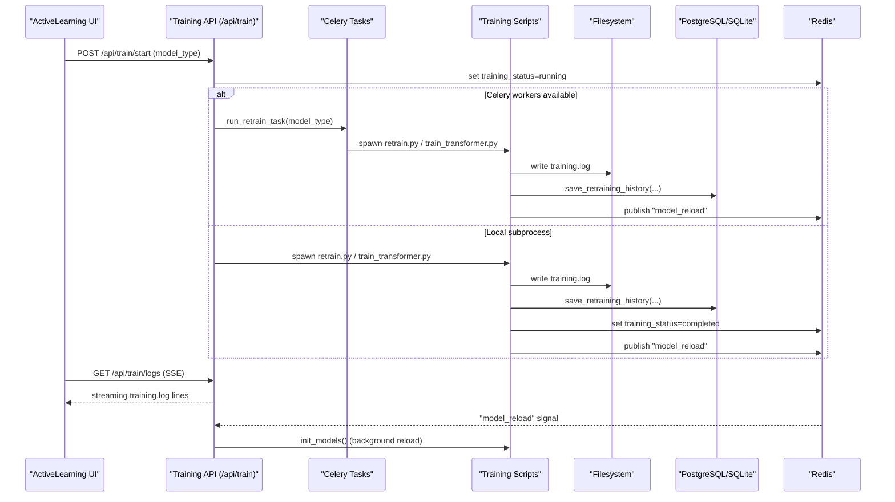
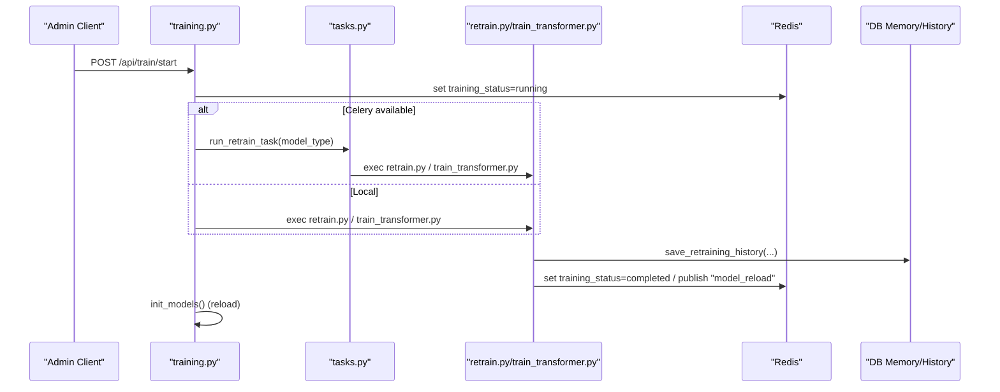
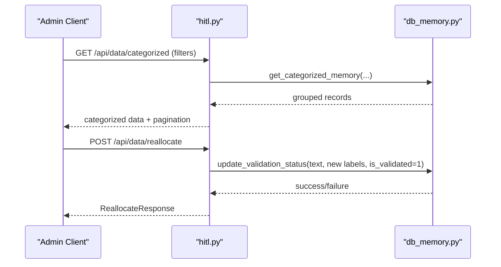
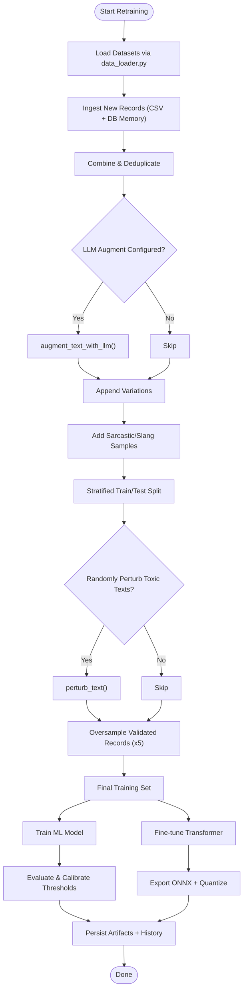
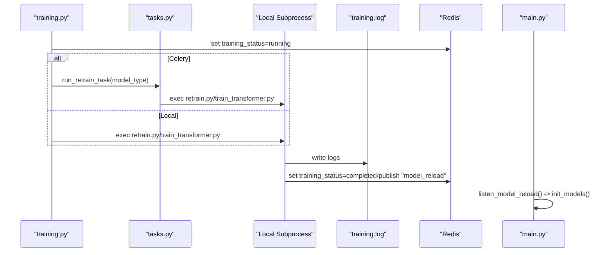
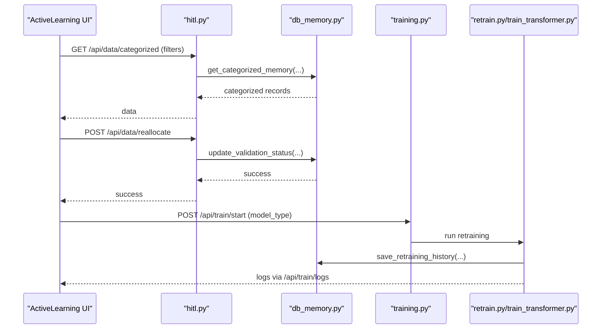
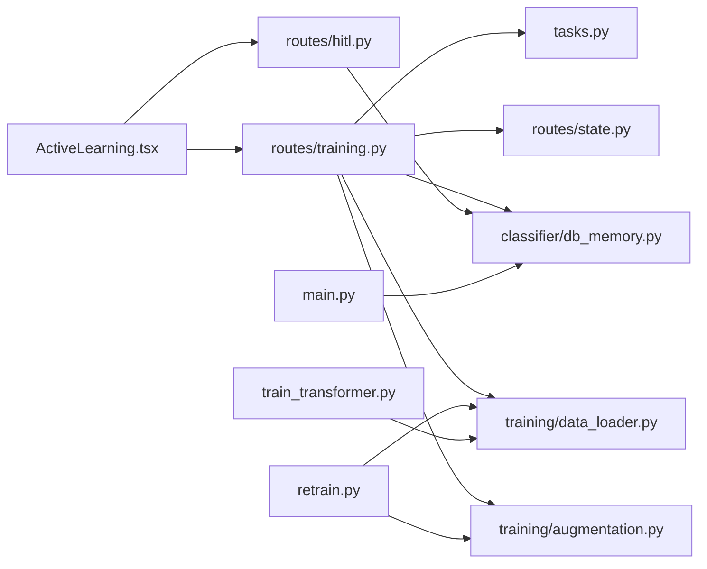

# Training and Active Learning

<cite>
**Referenced Files in This Document**
- [training.py](file://cyberbullying_api/routes/training.py)
- [hitl.py](file://cyberbullying_api/routes/hitl.py)
- [augmentation.py](file://cyberbullying_api/training/augmentation.py)
- [data_loader.py](file://cyberbullying_api/training/data_loader.py)
- [retrain.py](file://cyberbullying_api/retrain.py)
- [train_transformer.py](file://cyberbullying_api/train_transformer.py)
- [tasks.py](file://cyberbullying_api/tasks.py)
- [state.py](file://cyberbullying_api/routes/state.py)
- [database.py](file://cyberbullying_api/classifier/database.py)
- [db_memory.py](file://cyberbullying_api/classifier/db_memory.py)
- [models.py](file://cyberbullying_api/models.py)
- [main.py](file://cyberbullying_api/main.py)
- [RetrainTerminal.tsx](file://frontend/src/components/ActiveLearning/RetrainTerminal.tsx)
- [ActiveLearning.tsx](file://frontend/src/components/ActiveLearning.tsx)
</cite>

## Table of Contents
1. [Introduction](#introduction)
2. [Project Structure](#project-structure)
3. [Core Components](#core-components)
4. [Architecture Overview](#architecture-overview)
5. [Detailed Component Analysis](#detailed-component-analysis)
6. [Dependency Analysis](#dependency-analysis)
7. [Performance Considerations](#performance-considerations)
8. [Troubleshooting Guide](#troubleshooting-guide)
9. [Conclusion](#conclusion)
10. [Appendices](#appendices)

## Introduction
This document explains the training and active learning capabilities of the BullyGuard ID system. It covers:
- The /api/train endpoints for initiating model retraining, coordinating background jobs, and streaming training logs.
- Human-in-the-loop (HITL) validation endpoints for categorizing and correcting predictions.
- The active learning cycle: data collection, human validation, model improvement, and quality assurance.
- Training data augmentation techniques, data loader functionality, and training job management.
- Practical examples of training initiation, validation workflows, model retraining, and integration with the active learning UI.
- Performance optimization, data quality validation, and training pipeline monitoring.

## Project Structure
The training and active learning system spans backend API routes, training scripts, data utilities, and a frontend Active Learning interface:
- Backend API routes expose training and HITL endpoints under /api.
- Training scripts orchestrate data ingestion, augmentation, model training, and persistence.
- Data utilities provide dataset loaders and augmentation helpers.
- Frontend components enable administrators to validate predictions and trigger retraining.

**Diagram sources**
- [training.py:27-254](file://cyberbullying_api/routes/training.py#L27-L254)
- [hitl.py:11-84](file://cyberbullying_api/routes/hitl.py#L11-L84)
- [state.py:1-7](file://cyberbullying_api/routes/state.py#L1-L7)
- [retrain.py:1-519](file://cyberbullying_api/retrain.py#L1-L519)
- [train_transformer.py:1-343](file://cyberbullying_api/train_transformer.py#L1-L343)
- [tasks.py:1-96](file://cyberbullying_api/tasks.py#L1-L96)
- [data_loader.py:1-384](file://cyberbullying_api/training/data_loader.py#L1-L384)
- [augmentation.py:1-194](file://cyberbullying_api/training/augmentation.py#L1-L194)
- [db_memory.py:1-763](file://cyberbullying_api/classifier/db_memory.py#L1-L763)
- [database.py:1-72](file://cyberbullying_api/classifier/database.py#L1-L72)
- [main.py:82-120](file://cyberbullying_api/main.py#L82-L120)
- [ActiveLearning.tsx:1-632](file://frontend/src/components/ActiveLearning.tsx#L1-L632)
- [RetrainTerminal.tsx:1-103](file://frontend/src/components/ActiveLearning/RetrainTerminal.tsx#L1-L103)

**Section sources**
- [training.py:27-254](file://cyberbullying_api/routes/training.py#L27-L254)
- [hitl.py:11-84](file://cyberbullying_api/routes/hitl.py#L11-L84)
- [retrain.py:1-519](file://cyberbullying_api/retrain.py#L1-L519)
- [train_transformer.py:1-343](file://cyberbullying_api/train_transformer.py#L1-L343)
- [tasks.py:1-96](file://cyberbullying_api/tasks.py#L1-L96)
- [data_loader.py:1-384](file://cyberbullying_api/training/data_loader.py#L1-L384)
- [augmentation.py:1-194](file://cyberbullying_api/training/augmentation.py#L1-L194)
- [db_memory.py:1-763](file://cyberbullying_api/classifier/db_memory.py#L1-L763)
- [database.py:1-72](file://cyberbullying_api/classifier/database.py#L1-L72)
- [main.py:82-120](file://cyberbullying_api/main.py#L82-L120)
- [ActiveLearning.tsx:1-632](file://frontend/src/components/ActiveLearning.tsx#L1-L632)
- [RetrainTerminal.tsx:1-103](file://frontend/src/components/ActiveLearning/RetrainTerminal.tsx#L1-L103)

## Core Components
- Training API (/api/train/*)
  - POST /api/train/start: Starts ML or Transformer training (or both). Supports Celery-backed background execution with Redis status tracking and fallback to local subprocess.
  - GET /api/train/logs: Streams training logs via Server-Sent Events.
  - GET /api/train/history: Retrieves historical retraining metrics and thresholds.
  - POST /api/train/reload: Manually reloads models in-process.
- Human-in-the-loop API (/api/data/*)
  - GET /api/data/categorized: Retrieves recent classification memory entries grouped by quadrant and optionally filtered by confidence, decision source, and free text.
  - POST /api/data/reallocate: Updates validation status for a single text.
  - POST /api/data/reallocate/bulk: Updates validation status for multiple texts.
- Training Scripts
  - retrain.py: Loads datasets, ingests validated data, augments text, trains ML model, evaluates, persists artifacts, and writes retraining history.
  - train_transformer.py: Fine-tunes a Transformer model, exports ONNX with quantization, and saves artifacts.
  - tasks.py: Celery tasks to run retraining scripts with Redis status updates and timeouts.
- Data Utilities
  - data_loader.py: Loads multiple datasets and ingests new records from scraped CSVs and classification memory DB.
  - augmentation.py: Provides LLM-based paraphrasing and rule-based perturbations for text augmentation.
- Classifier & Persistence
  - db_memory.py: Saves/loads classification memory, manages validation updates, and exposes categorized/unvalidated queries.
  - database.py: Facade exposing DB operations for memory and history.
- Frontend Active Learning
  - ActiveLearning.tsx: Renders quadrants, filters, selection actions, and bulk operations; triggers training and streams logs.
  - RetrainTerminal.tsx: Triggers training and displays live logs.

**Section sources**
- [training.py:30-174](file://cyberbullying_api/routes/training.py#L30-L174)
- [training.py:176-184](file://cyberbullying_api/routes/training.py#L176-L184)
- [training.py:187-233](file://cyberbullying_api/routes/training.py#L187-L233)
- [training.py:236-253](file://cyberbullying_api/routes/training.py#L236-L253)
- [hitl.py:14-48](file://cyberbullying_api/routes/hitl.py#L14-L48)
- [hitl.py:51-62](file://cyberbullying_api/routes/hitl.py#L51-L62)
- [hitl.py:65-83](file://cyberbullying_api/routes/hitl.py#L65-L83)
- [retrain.py:1-519](file://cyberbullying_api/retrain.py#L1-L519)
- [train_transformer.py:1-343](file://cyberbullying_api/train_transformer.py#L1-L343)
- [tasks.py:27-83](file://cyberbullying_api/tasks.py#L27-L83)
- [data_loader.py:36-382](file://cyberbullying_api/training/data_loader.py#L36-L382)
- [augmentation.py:88-194](file://cyberbullying_api/training/augmentation.py#L88-L194)
- [db_memory.py:467-593](file://cyberbullying_api/classifier/db_memory.py#L467-L593)
- [db_memory.py:595-681](file://cyberbullying_api/classifier/db_memory.py#L595-L681)
- [db_memory.py:683-762](file://cyberbullying_api/classifier/db_memory.py#L683-L762)
- [database.py:50-71](file://cyberbullying_api/classifier/database.py#L50-L71)
- [ActiveLearning.tsx:52-104](file://frontend/src/components/ActiveLearning.tsx#L52-L104)
- [ActiveLearning.tsx:301-385](file://frontend/src/components/ActiveLearning.tsx#L301-L385)
- [RetrainTerminal.tsx:11-64](file://frontend/src/components/ActiveLearning/RetrainTerminal.tsx#L11-L64)

## Architecture Overview
The training and active learning architecture integrates frontend, backend API, training orchestrators, and persistence layers. Redis coordinates training status and model reload signals; PostgreSQL/SQLite persist classification memory and retraining history.

**Diagram sources**
- [training.py:30-174](file://cyberbullying_api/routes/training.py#L30-L174)
- [tasks.py:27-83](file://cyberbullying_api/tasks.py#L27-L83)
- [retrain.py:478-519](file://cyberbullying_api/retrain.py#L478-L519)
- [train_transformer.py:236-241](file://cyberbullying_api/train_transformer.py#L236-L241)
- [main.py:82-120](file://cyberbullying_api/main.py#L82-L120)
- [db_memory.py:683-712](file://cyberbullying_api/classifier/db_memory.py#L683-L712)

## Detailed Component Analysis

### Training API Endpoints
- Endpoint: POST /api/train/start
  - Validates model_type and checks for running training (Redis/Celery or local process).
  - If Celery is available, schedules run_retrain_task; otherwise runs scripts locally with background subprocess.
  - Writes/updates training_status in Redis and streams logs to cache/training.log.
  - On completion, sets status to completed and publishes "model_reload" to Redis; reloads models.
- Endpoint: GET /api/train/logs
  - Streams training.log in real-time via SSE; detects completion by Redis status or process exit.
- Endpoint: GET /api/train/history
  - Returns paginated retraining history with metrics and thresholds.
- Endpoint: POST /api/train/reload
  - Forces in-process model reload.

**Diagram sources**
- [training.py:30-174](file://cyberbullying_api/routes/training.py#L30-L174)
- [tasks.py:27-83](file://cyberbullying_api/tasks.py#L27-L83)
- [retrain.py:478-519](file://cyberbullying_api/retrain.py#L478-L519)
- [train_transformer.py:236-241](file://cyberbullying_api/train_transformer.py#L236-L241)
- [db_memory.py:683-712](file://cyberbullying_api/classifier/db_memory.py#L683-L712)

**Section sources**
- [training.py:30-174](file://cyberbullying_api/routes/training.py#L30-L174)
- [training.py:176-184](file://cyberbullying_api/routes/training.py#L176-L184)
- [training.py:187-233](file://cyberbullying_api/routes/training.py#L187-L233)
- [training.py:236-253](file://cyberbullying_api/routes/training.py#L236-L253)

### Human-in-the-Loop Validation Endpoints
- Endpoint: GET /api/data/categorized
  - Retrieves classification memory grouped by quadrant and supports filtering by confidence bounds, decision source substring, and free-text search.
  - Returns pagination metadata and per-quadrant counts.
- Endpoint: POST /api/data/reallocate
  - Updates validation status for a single text; marks as validated and stores corrected labels.
- Endpoint: POST /api/data/reallocate/bulk
  - Applies batch validation updates; returns partial success when some items fail.

**Diagram sources**
- [hitl.py:14-48](file://cyberbullying_api/routes/hitl.py#L14-L48)
- [hitl.py:51-62](file://cyberbullying_api/routes/hitl.py#L51-L62)
- [hitl.py:65-83](file://cyberbullying_api/routes/hitl.py#L65-L83)
- [db_memory.py:467-593](file://cyberbullying_api/classifier/db_memory.py#L467-L593)
- [db_memory.py:595-681](file://cyberbullying_api/classifier/db_memory.py#L595-L681)

**Section sources**
- [hitl.py:14-48](file://cyberbullying_api/routes/hitl.py#L14-L48)
- [hitl.py:51-62](file://cyberbullying_api/routes/hitl.py#L51-L62)
- [hitl.py:65-83](file://cyberbullying_api/routes/hitl.py#L65-L83)
- [db_memory.py:467-593](file://cyberbullying_api/classifier/db_memory.py#L467-L593)
- [db_memory.py:595-681](file://cyberbullying_api/classifier/db_memory.py#L595-L681)

### Training Data Augmentation and Data Loader
- Data loaders
  - load_twitter_dataset, load_instagram_dataset, load_combined_dataset, load_mendeley_dataset, load_tiktok_rhiosutoyo_dataset: Normalize and label datasets consistently.
  - ingest_scraped_csv: Reads newly classified scraper outputs and extracts labeled samples.
  - ingest_database_memory: Pulls validated records from PostgreSQL (fallback to SQLite) for active learning oversampling.
- Augmentation
  - augment_text_with_llm: Generates paraphrases via a Gemini-compatible API when configured.
  - perturb_text: Applies rule-based perturbations to abusive words to diversify training data.
  - sarcasm_raw and slang_praise_raw: Templates for augmenting specific patterns.

**Diagram sources**
- [data_loader.py:36-382](file://cyberbullying_api/training/data_loader.py#L36-L382)
- [augmentation.py:88-194](file://cyberbullying_api/training/augmentation.py#L88-L194)
- [retrain.py:74-342](file://cyberbullying_api/retrain.py#L74-L342)
- [train_transformer.py:81-151](file://cyberbullying_api/train_transformer.py#L81-L151)

**Section sources**
- [data_loader.py:36-382](file://cyberbullying_api/training/data_loader.py#L36-L382)
- [augmentation.py:88-194](file://cyberbullying_api/training/augmentation.py#L88-L194)
- [retrain.py:74-342](file://cyberbullying_api/retrain.py#L74-L342)
- [train_transformer.py:81-151](file://cyberbullying_api/train_transformer.py#L81-L151)

### Training Job Management and Monitoring
- Celery-backed execution
  - run_retrain_task executes retrain.py and/or train_transformer.py, writing logs and updating Redis status; publishes "model_reload" on success.
  - Includes timeouts and error handling to mark failures.
- Local subprocess fallback
  - training.py spawns scripts with unbuffered output, writes logs, and updates Redis on completion.
- Real-time monitoring
  - /api/train/logs streams training.log in real-time; frontend polls until completion.
- Model reload
  - Redis "model_reload" channel triggers model hot-reload via main.py’s listener.

**Diagram sources**
- [tasks.py:27-83](file://cyberbullying_api/tasks.py#L27-L83)
- [training.py:106-169](file://cyberbullying_api/routes/training.py#L106-L169)
- [main.py:82-120](file://cyberbullying_api/main.py#L82-L120)

**Section sources**
- [tasks.py:27-83](file://cyberbullying_api/tasks.py#L27-L83)
- [training.py:106-169](file://cyberbullying_api/routes/training.py#L106-L169)
- [main.py:82-120](file://cyberbullying_api/main.py#L82-L120)

### Active Learning Workflow Integration
- Frontend Active Learning
  - ActiveLearning.tsx fetches categorized data, applies filters, supports single/mass reallocation, and triggers training.
  - RetrainTerminal.tsx controls model type and displays training logs.
- Backend HITL
  - db_memory.py provides categorized and unvalidated data; update_validation_status persists corrections.
- Training pipeline
  - retrain.py reads validated records (active learning oversampling), augments data, retrains, and persists artifacts; emits reload signal.

**Diagram sources**
- [ActiveLearning.tsx:52-104](file://frontend/src/components/ActiveLearning.tsx#L52-L104)
- [ActiveLearning.tsx:138-209](file://frontend/src/components/ActiveLearning.tsx#L138-L209)
- [ActiveLearning.tsx:301-385](file://frontend/src/components/ActiveLearning.tsx#L301-L385)
- [hitl.py:14-48](file://cyberbullying_api/routes/hitl.py#L14-L48)
- [hitl.py:51-62](file://cyberbullying_api/routes/hitl.py#L51-L62)
- [db_memory.py:467-593](file://cyberbullying_api/classifier/db_memory.py#L467-L593)
- [db_memory.py:595-681](file://cyberbullying_api/classifier/db_memory.py#L595-L681)
- [training.py:30-174](file://cyberbullying_api/routes/training.py#L30-L174)
- [retrain.py:478-519](file://cyberbullying_api/retrain.py#L478-L519)

**Section sources**
- [ActiveLearning.tsx:52-104](file://frontend/src/components/ActiveLearning.tsx#L52-L104)
- [ActiveLearning.tsx:138-209](file://frontend/src/components/ActiveLearning.tsx#L138-L209)
- [ActiveLearning.tsx:301-385](file://frontend/src/components/ActiveLearning.tsx#L301-L385)
- [hitl.py:14-48](file://cyberbullying_api/routes/hitl.py#L14-L48)
- [hitl.py:51-62](file://cyberbullying_api/routes/hitl.py#L51-L62)
- [db_memory.py:467-593](file://cyberbullying_api/classifier/db_memory.py#L467-L593)
- [db_memory.py:595-681](file://cyberbullying_api/classifier/db_memory.py#L595-L681)
- [training.py:30-174](file://cyberbullying_api/routes/training.py#L30-L174)
- [retrain.py:478-519](file://cyberbullying_api/retrain.py#L478-L519)

## Dependency Analysis
- Training API depends on:
  - Celery tasks for background execution.
  - Redis for status tracking and model reload signaling.
  - Local subprocess for fallback execution.
  - Classifier database/memory for persisted training history and validation updates.
- Training scripts depend on:
  - Data loaders and augmentation utilities.
  - Vectorizers and classifiers for ML training.
  - Transformers library for fine-tuning and ONNX export.
- Frontend depends on:
  - Training API for triggering retraining and streaming logs.
  - HITL API for retrieving and validating predictions.

**Diagram sources**
- [training.py:27-254](file://cyberbullying_api/routes/training.py#L27-L254)
- [tasks.py:1-96](file://cyberbullying_api/tasks.py#L1-L96)
- [state.py:1-7](file://cyberbullying_api/routes/state.py#L1-L7)
- [db_memory.py:1-763](file://cyberbullying_api/classifier/db_memory.py#L1-L763)
- [data_loader.py:1-384](file://cyberbullying_api/training/data_loader.py#L1-L384)
- [augmentation.py:1-194](file://cyberbullying_api/training/augmentation.py#L1-L194)
- [retrain.py:1-519](file://cyberbullying_api/retrain.py#L1-L519)
- [train_transformer.py:1-343](file://cyberbullying_api/train_transformer.py#L1-L343)
- [hitl.py:11-84](file://cyberbullying_api/routes/hitl.py#L11-L84)
- [main.py:82-120](file://cyberbullying_api/main.py#L82-L120)
- [ActiveLearning.tsx:1-632](file://frontend/src/components/ActiveLearning.tsx#L1-L632)

**Section sources**
- [training.py:27-254](file://cyberbullying_api/routes/training.py#L27-L254)
- [tasks.py:1-96](file://cyberbullying_api/tasks.py#L1-L96)
- [state.py:1-7](file://cyberbullying_api/routes/state.py#L1-L7)
- [db_memory.py:1-763](file://cyberbullying_api/classifier/db_memory.py#L1-L763)
- [data_loader.py:1-384](file://cyberbullying_api/training/data_loader.py#L1-L384)
- [augmentation.py:1-194](file://cyberbullying_api/training/augmentation.py#L1-L194)
- [retrain.py:1-519](file://cyberbullying_api/retrain.py#L1-L519)
- [train_transformer.py:1-343](file://cyberbullying_api/train_transformer.py#L1-L343)
- [hitl.py:11-84](file://cyberbullying_api/routes/hitl.py#L11-L84)
- [main.py:82-120](file://cyberbullying_api/main.py#L82-L120)
- [ActiveLearning.tsx:1-632](file://frontend/src/components/ActiveLearning.tsx#L1-L632)

## Performance Considerations
- Asynchronous processing
  - Use Celery for background training to avoid blocking the API and to support timeouts and retries.
- Logging and I/O
  - Stream training logs to a single file and serve via SSE to minimize latency and overhead.
- Data loading
  - Prefer async PostgreSQL access where available; fall back to SQLite for local environments.
- Model evaluation
  - Use stratified splits and calibration to maintain balanced performance across labels.
- Transformer training
  - Enable ONNX export and quantization to reduce inference latency in production.
- Frontend UX
  - Debounce filters and use optimistic updates for validation actions to improve responsiveness.

[No sources needed since this section provides general guidance]

## Troubleshooting Guide
- Training does not start
  - Verify Celery workers availability; if none, training falls back to local subprocess. Check Redis connectivity and training_status.
- Training stuck or not updating status
  - Inspect Redis training_status and ensure "model_reload" is published on completion.
- Logs not streaming
  - Confirm cache/training.log exists and is writable; check SSE connection and network.
- Validation not reflected
  - Ensure update_validation_status succeeds and that classification_memory reflects is_validated=1.
- Model reload not triggered
  - Confirm Redis subscription to "model_reload" and that init_models() is invoked on receiving the signal.

**Section sources**
- [training.py:30-174](file://cyberbullying_api/routes/training.py#L30-L174)
- [tasks.py:27-83](file://cyberbullying_api/tasks.py#L27-L83)
- [db_memory.py:595-681](file://cyberbullying_api/classifier/db_memory.py#L595-L681)
- [main.py:82-120](file://cyberbullying_api/main.py#L82-L120)

## Conclusion
The BullyGuard ID system provides a robust training and active learning framework:
- Administrators can trigger ML and/or Transformer retraining, monitor progress, and validate predictions.
- The active learning loop integrates human corrections into the training pipeline, improving model quality iteratively.
- Redis and Celery coordinate asynchronous execution, while filesystem and database persist artifacts and history.
- The frontend offers intuitive controls for validation and training orchestration.

[No sources needed since this section summarizes without analyzing specific files]

## Appendices

### API Reference Summary
- Training
  - POST /api/train/start: model_type in ["ml","transformer","both"]
  - GET /api/train/logs: Server-Sent Events stream
  - GET /api/train/history: Paginated retraining history
  - POST /api/train/reload: Manual model reload
- Human-in-the-Loop
  - GET /api/data/categorized: Filters by confidence, decision_source, search
  - POST /api/data/reallocate: Single validation update
  - POST /api/data/reallocate/bulk: Bulk validation update

**Section sources**
- [training.py:30-174](file://cyberbullying_api/routes/training.py#L30-L174)
- [training.py:176-184](file://cyberbullying_api/routes/training.py#L176-L184)
- [training.py:187-233](file://cyberbullying_api/routes/training.py#L187-L233)
- [training.py:236-253](file://cyberbullying_api/routes/training.py#L236-L253)
- [hitl.py:14-48](file://cyberbullying_api/routes/hitl.py#L14-L48)
- [hitl.py:51-62](file://cyberbullying_api/routes/hitl.py#L51-L62)
- [hitl.py:65-83](file://cyberbullying_api/routes/hitl.py#L65-L83)