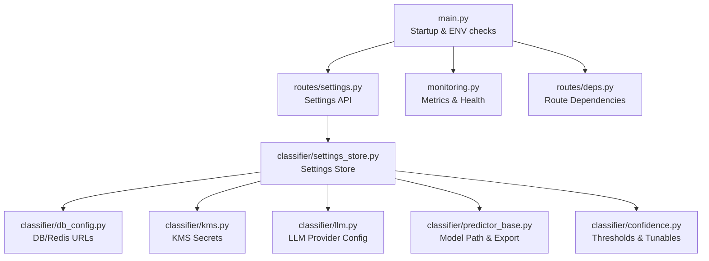
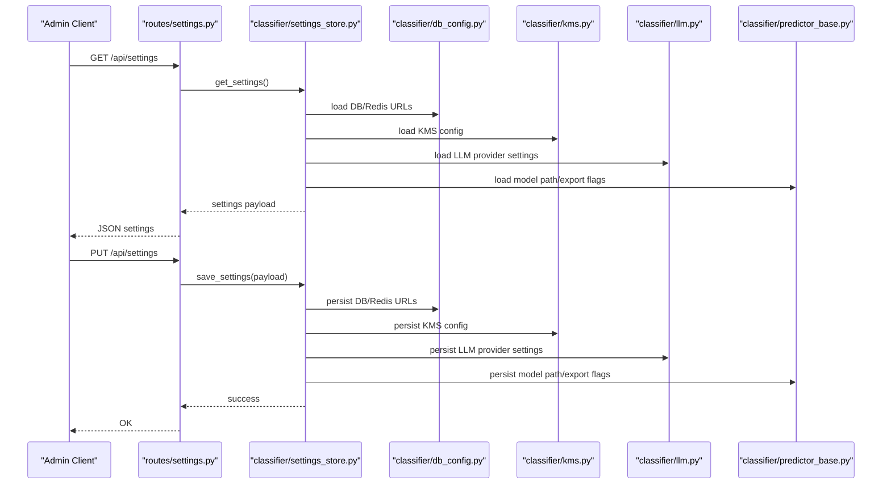
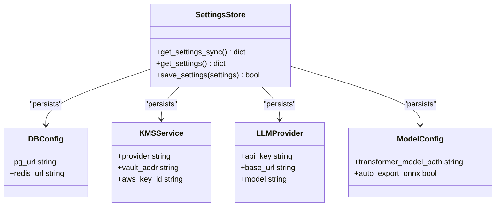
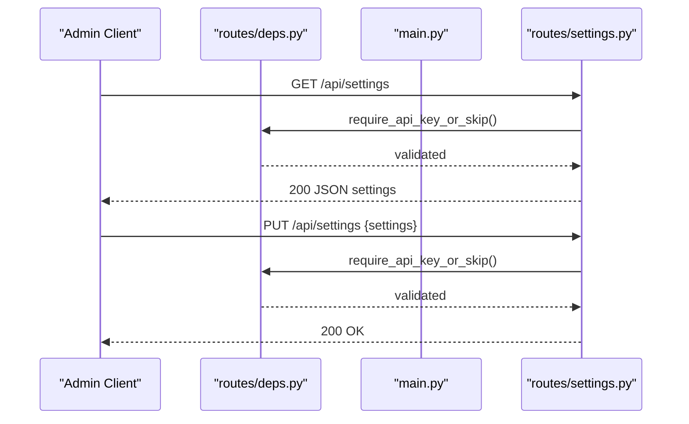
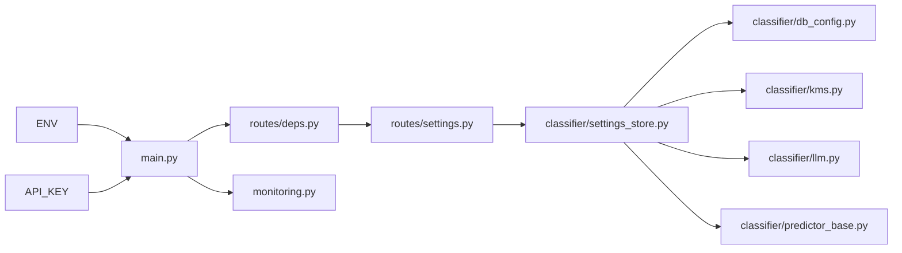

# Configuration and Settings

<cite>
**Referenced Files in This Document**
- [main.py](file://cyberbullying_api/main.py)
- [settings.py](file://cyberbullying_api/routes/settings.py)
- [settings_store.py](file://cyberbullying_api/classifier/settings_store.py)
- [db_config.py](file://cyberbullying_api/classifier/db_config.py)
- [kms.py](file://cyberbullying_api/classifier/kms.py)
- [llm.py](file://cyberbullying_api/classifier/llm.py)
- [predictor_base.py](file://cyberbullying_api/classifier/predictor_base.py)
- [confidence.py](file://cyberbullying_api/classifier/confidence.py)
- [monitoring.py](file://cyberbullying_api/monitoring.py)
- [deps.py](file://cyberbullying_api/routes/deps.py)
- [docker-compose.yml](file://docker-compose.yml)
- [docker-compose.prod.yml](file://docker-compose.prod.yml)
- [requirements.txt](file://cyberbullying_api/requirements.txt)
- [requirements.docker.txt](file://cyberbullying_api/requirements.docker.txt)
</cite>

## Table of Contents
1. [Introduction](#introduction)
2. [Project Structure](#project-structure)
3. [Core Components](#core-components)
4. [Architecture Overview](#architecture-overview)
5. [Detailed Component Analysis](#detailed-component-analysis)
6. [Dependency Analysis](#dependency-analysis)
7. [Performance Considerations](#performance-considerations)
8. [Troubleshooting Guide](#troubleshooting-guide)
9. [Conclusion](#conclusion)
10. [Appendices](#appendices)

## Introduction
This document describes the runtime configuration system for BullyGuard ID. It covers environment variables, configuration parameters, settings storage, validation, dynamic updates, thresholds, webhooks, rate limiting, monitoring, API endpoints, backup and restore, environment-specific overrides, and production best practices. The goal is to help operators configure, validate, and operate BullyGuard ID reliably across environments while understanding how settings influence model performance and user experience.

## Project Structure
BullyGuard ID’s configuration spans several modules:
- Application bootstrap and environment detection
- Settings persistence and retrieval
- Database and cache configuration
- Encryption and secrets via KMS providers
- LLM provider configuration
- Model selection and ONNX export controls
- Confidence thresholds and tunable parameters
- Monitoring and operational metrics
- Route-level dependencies and protections

**Diagram sources**
- [main.py](file://cyberbullying_api/main.py)
- [settings.py](file://cyberbullying_api/routes/settings.py)
- [settings_store.py](file://cyberbullying_api/classifier/settings_store.py)
- [db_config.py](file://cyberbullying_api/classifier/db_config.py)
- [kms.py](file://cyberbullying_api/classifier/kms.py)
- [llm.py](file://cyberbullying_api/classifier/llm.py)
- [predictor_base.py](file://cyberbullying_api/classifier/predictor_base.py)
- [confidence.py](file://cyberbullying_api/classifier/confidence.py)
- [monitoring.py](file://cyberbullying_api/monitoring.py)
- [deps.py](file://cyberbullying_api/routes/deps.py)

**Section sources**
- [main.py](file://cyberbullying_api/main.py)
- [settings.py](file://cyberbullying_api/routes/settings.py)
- [settings_store.py](file://cyberbullying_api/classifier/settings_store.py)
- [db_config.py](file://cyberbullying_api/classifier/db_config.py)
- [kms.py](file://cyberbullying_api/classifier/kms.py)
- [llm.py](file://cyberbullying_api/classifier/llm.py)
- [predictor_base.py](file://cyberbullying_api/classifier/predictor_base.py)
- [confidence.py](file://cyberbullying_api/classifier/confidence.py)
- [monitoring.py](file://cyberbullying_api/monitoring.py)
- [deps.py](file://cyberbullying_api/routes/deps.py)

## Core Components
- Environment detection and production validation
- Settings API for retrieval and persistence
- Settings store abstraction
- Database and caching configuration
- Secrets and encryption via KMS
- LLM provider configuration
- Model path and ONNX export controls
- Confidence thresholds and tunable parameters
- Monitoring and health endpoints
- Route-level dependencies and protections

**Section sources**
- [main.py](file://cyberbullying_api/main.py)
- [settings.py](file://cyberbullying_api/routes/settings.py)
- [settings_store.py](file://cyberbullying_api/classifier/settings_store.py)
- [db_config.py](file://cyberbullying_api/classifier/db_config.py)
- [kms.py](file://cyberbullying_api/classifier/kms.py)
- [llm.py](file://cyberbullying_api/classifier/llm.py)
- [predictor_base.py](file://cyberbullying_api/classifier/predictor_base.py)
- [confidence.py](file://cyberbullying_api/classifier/confidence.py)
- [monitoring.py](file://cyberbullying_api/monitoring.py)
- [deps.py](file://cyberbullying_api/routes/deps.py)

## Architecture Overview
The configuration system centers around a settings API and a settings store. The store persists configuration to a backing medium and exposes synchronous and asynchronous retrieval. Environment variables drive behavior across databases, caches, secrets, LLM providers, and model paths. Monitoring and route dependencies enforce operational safeguards.

**Diagram sources**
- [settings.py](file://cyberbullying_api/routes/settings.py)
- [settings_store.py](file://cyberbullying_api/classifier/settings_store.py)
- [db_config.py](file://cyberbullying_api/classifier/db_config.py)
- [kms.py](file://cyberbullying_api/classifier/kms.py)
- [llm.py](file://cyberbullying_api/classifier/llm.py)
- [predictor_base.py](file://cyberbullying_api/classifier/predictor_base.py)

## Detailed Component Analysis

### Environment Variables and Environment-Specific Overrides
- ENV: Controls environment mode and production validation. Non-production values include local, dev, development, test, testing. Production requires API_KEY presence.
- API_KEY: Required in non-development environments for endpoint protection.
- PG_URL: PostgreSQL connection string for primary data store.
- REDIS_URL: Redis connection string for caching and session storage.
- KMS_PROVIDER: Secret provider backend (e.g., Vault, AWS KMS).
- VAULT_*: Vault-specific configuration (address, token, secret path, key).
- AWS_KMS_*: AWS KMS configuration (key ID, encrypted key).
- GEMINI_*: LLM provider configuration (API key, base URL, model).
- TRANSFORMER_MODEL_PATH: Model path or Hugging Face identifier.
- AUTO_EXPORT_ONNX: Boolean flag to auto-export ONNX model.
- LOG_LEVEL: Logging verbosity level.
- HEALTH_ENDPOINT: Health check path.
- METRICS_ENDPOINT: Metrics exposition path.

Operational notes:
- Production validation ensures API_KEY is set when ENV is not development/test/local.
- Tests override ENV to isolate database usage.

**Section sources**
- [main.py](file://cyberbullying_api/main.py)
- [db_config.py](file://cyberbullying_api/classifier/db_config.py)
- [kms.py](file://cyberbullying_api/classifier/kms.py)
- [llm.py](file://cyberbullying_api/classifier/llm.py)
- [predictor_base.py](file://cyberbullying_api/classifier/predictor_base.py)
- [deps.py](file://cyberbullying_api/routes/deps.py)
- [tests/conftest.py](file://cyberbullying_api/tests/contest.py)

### Settings Store Implementation
The settings store provides:
- Synchronous retrieval for fast access
- Asynchronous retrieval and saving for concurrent workloads
- Structured persistence of configuration segments (database, cache, secrets, LLM, model)

Key behaviors:
- get_settings_sync(): Fast synchronous read path
- get_settings(): Async read path
- save_settings(settings): Persist settings atomically

**Diagram sources**
- [settings_store.py](file://cyberbullying_api/classifier/settings_store.py)
- [db_config.py](file://cyberbullying_api/classifier/db_config.py)
- [kms.py](file://cyberbullying_api/classifier/kms.py)
- [llm.py](file://cyberbullying_api/classifier/llm.py)
- [predictor_base.py](file://cyberbullying_api/classifier/predictor_base.py)

**Section sources**
- [settings_store.py](file://cyberbullying_api/classifier/settings_store.py)

### Settings API Endpoints
Endpoints:
- GET /api/settings: Retrieve current configuration snapshot
- PUT /api/settings: Save updated configuration

Validation and protection:
- Route dependencies enforce API_KEY presence in non-development environments
- Startup validation enforces production readiness

**Diagram sources**
- [settings.py](file://cyberbullying_api/routes/settings.py)
- [deps.py](file://cyberbullying_api/routes/deps.py)
- [main.py](file://cyberbullying_api/main.py)

**Section sources**
- [settings.py](file://cyberbullying_api/routes/settings.py)
- [deps.py](file://cyberbullying_api/routes/deps.py)
- [main.py](file://cyberbullying_api/main.py)

### Configuration Validation
- Startup validation ensures API_KEY is present when ENV indicates non-development.
- Route-level dependencies gate protected endpoints in non-development environments.
- Tests demonstrate environment-specific behavior and isolation.

Practical checks:
- Confirm ENV value aligns with intended deployment tier.
- Verify API_KEY presence for production-like environments.
- Validate database and cache connectivity using PG_URL and REDIS_URL.

**Section sources**
- [main.py](file://cyberbullying_api/main.py)
- [deps.py](file://cyberbullying_api/routes/deps.py)
- [tests/test_security.py](file://cyberbullying_api/tests/test_security.py)

### Dynamic Configuration Updates
- Settings are persisted atomically via save_settings.
- Changes take effect immediately for subsequent reads.
- Recommended to restart or reload prediction workers after critical changes (e.g., model path, LLM provider).

Operational guidance:
- Back up settings before applying changes.
- Apply changes during maintenance windows.
- Monitor logs and metrics post-update.

**Section sources**
- [settings_store.py](file://cyberbullying_api/classifier/settings_store.py)
- [settings.py](file://cyberbullying_api/routes/settings.py)

### Model Threshold Configuration
- Confidence thresholds are configurable and intentionally conservative.
- Tunable parameters enable sensitivity adjustments per environment.
- Thresholds influence classification outcomes and user experience (false positives/negatives).

Recommendations:
- Start with defaults; adjust gradually.
- Validate impact on precision/recall using monitoring metrics.
- Document threshold changes per environment.

**Section sources**
- [confidence.py](file://cyberbullying_api/classifier/confidence.py)

### Webhook Settings
- No explicit webhook configuration was identified in the analyzed files.
- If webhooks are required, integrate them at the application boundary and persist via the settings store.

[No sources needed since this section does not analyze specific files]

### Rate Limiting Parameters
- No explicit rate limiting configuration was identified in the analyzed files.
- Consider integrating rate limiting at the gateway or route middleware and persist settings via the settings store.

[No sources needed since this section does not analyze specific files]

### Monitoring Configuration
- Health and metrics endpoints are configurable via environment variables.
- Monitoring module integrates with the application lifecycle.

Operational tips:
- Expose health endpoint for load balancers and orchestrators.
- Configure metrics endpoint for Prometheus scraping.
- Ensure logging level is appropriate for diagnostics without leaking secrets.

**Section sources**
- [monitoring.py](file://cyberbullying_api/monitoring.py)
- [main.py](file://cyberbullying_api/main.py)

### Database and Cache Configuration
- PG_URL: PostgreSQL connection string for primary data store.
- REDIS_URL: Redis connection string for caching and sessions.

Best practices:
- Use distinct databases for production and non-production.
- Encrypt sensitive credentials at rest and in transit.
- Monitor connection pool utilization and timeouts.

**Section sources**
- [db_config.py](file://cyberbullying_api/classifier/db_config.py)

### Secrets and Encryption (KMS)
- KMS_PROVIDER selects Vault or AWS KMS.
- Vault: VAULT_ADDR, VAULT_TOKEN, VAULT_SECRET_PATH, VAULT_SECRET_KEY.
- AWS KMS: AWS_KMS_KEY_ID, AWS_KMS_ENCRYPTED_KEY.

Guidance:
- Prefer Vault for centralized secret management.
- Rotate tokens and keys regularly.
- Restrict permissions to least privilege.

**Section sources**
- [kms.py](file://cyberbullying_api/classifier/kms.py)

### LLM Provider Configuration
- GEMINI_API_KEY, GEMINI_BASE_URL, GEMINI_MODEL.
- LLM provider configuration is part of the settings store.

Notes:
- Ensure API key validity and quota limits.
- Adjust base URL for regional endpoints.
- Select appropriate model for cost/performance trade-offs.

**Section sources**
- [llm.py](file://cyberbullying_api/classifier/llm.py)

### Model Path and ONNX Export Controls
- TRANSFORMER_MODEL_PATH: Model path or Hugging Face identifier.
- AUTO_EXPORT_ONNX: Boolean flag to auto-export ONNX model.

Operational guidance:
- Pin model versions for reproducibility.
- Enable auto-export in controlled environments for initial setup.
- Disable in production to avoid unexpected re-export overhead.

**Section sources**
- [predictor_base.py](file://cyberbullying_api/classifier/predictor_base.py)

### Configuration Backup and Restore Procedures
Backup:
- Export current settings via GET /api/settings.
- Store securely with version control or secret manager.

Restore:
- Apply backed-up settings via PUT /api/settings.
- Validate connectivity and model availability post-restore.

[No sources needed since this section provides general guidance]

### Practical Configuration Scenarios
- Development: Set ENV=development, API_KEY optional, PG_URL/REDIS_URL to local services.
- Staging: Set ENV=staging, API_KEY required, use managed PG and Redis instances.
- Production: Set ENV=production, API_KEY required, secure KMS and LLM provider settings, monitor metrics and health.

[No sources needed since this section provides general guidance]

## Dependency Analysis
The configuration system exhibits low coupling and high cohesion:
- Settings API depends on route dependencies for protection.
- Settings store encapsulates persistence and retrieval.
- Environment variables drive external integrations (database, cache, secrets, LLM).
- Monitoring and health endpoints are environment-driven.

**Diagram sources**
- [main.py](file://cyberbullying_api/main.py)
- [deps.py](file://cyberbullying_api/routes/deps.py)
- [settings.py](file://cyberbullying_api/routes/settings.py)
- [settings_store.py](file://cyberbullying_api/classifier/settings_store.py)
- [db_config.py](file://cyberbullying_api/classifier/db_config.py)
- [kms.py](file://cyberbullying_api/classifier/kms.py)
- [llm.py](file://cyberbullying_api/classifier/llm.py)
- [predictor_base.py](file://cyberbullying_api/classifier/predictor_base.py)
- [monitoring.py](file://cyberbullying_api/monitoring.py)

**Section sources**
- [main.py](file://cyberbullying_api/main.py)
- [deps.py](file://cyberbullying_api/routes/deps.py)
- [settings.py](file://cyberbullying_api/routes/settings.py)
- [settings_store.py](file://cyberbullying_api/classifier/settings_store.py)
- [db_config.py](file://cyberbullying_api/classifier/db_config.py)
- [kms.py](file://cyberbullying_api/classifier/kms.py)
- [llm.py](file://cyberbullying_api/classifier/llm.py)
- [predictor_base.py](file://cyberbullying_api/classifier/predictor_base.py)
- [monitoring.py](file://cyberbullying_api/monitoring.py)

## Performance Considerations
- Keep settings retrieval fast by leveraging the synchronous path for hot reads.
- Persist settings asynchronously to avoid blocking write operations.
- Tune model path and ONNX export flags to balance cold-start latency and accuracy.
- Monitor database and cache connection pools under load.
- Use appropriate logging levels to minimize I/O overhead.

[No sources needed since this section provides general guidance]

## Troubleshooting Guide
Common issues and resolutions:
- Missing API_KEY in production-like environments: Set API_KEY and restart.
- Database connectivity failures: Verify PG_URL and network access.
- Cache unavailability: Verify REDIS_URL and firewall rules.
- LLM provider errors: Confirm GEMINI_API_KEY validity and base URL.
- Model loading failures: Check TRANSFORMER_MODEL_PATH and AUTO_EXPORT_ONNX behavior.
- Health/metrics endpoints not responding: Confirm environment variables and service exposure.

Validation steps:
- Use GET /api/settings to confirm applied configuration.
- Review logs for environment-specific messages.
- Run smoke tests against health endpoint.

**Section sources**
- [main.py](file://cyberbullying_api/main.py)
- [deps.py](file://cyberbullying_api/routes/deps.py)
- [settings.py](file://cyberbullying_api/routes/settings.py)
- [db_config.py](file://cyberbullying_api/classifier/db_config.py)
- [kms.py](file://cyberbullying_api/classifier/kms.py)
- [llm.py](file://cyberbullying_api/classifier/llm.py)
- [predictor_base.py](file://cyberbullying_api/classifier/predictor_base.py)
- [monitoring.py](file://cyberbullying_api/monitoring.py)

## Conclusion
BullyGuard ID’s configuration system is environment-driven, API-managed, and designed for safe operation across development, staging, and production. By leveraging environment variables, a robust settings store, and route-level protections, operators can tune model behavior, manage secrets, and maintain observability. Adhering to the best practices and validation steps outlined here will improve reliability and reduce risk in production deployments.

[No sources needed since this section summarizes without analyzing specific files]

## Appendices

### Environment Variable Reference
- ENV: Environment mode (e.g., production, development, test)
- API_KEY: Authentication key for protected endpoints
- PG_URL: PostgreSQL connection string
- REDIS_URL: Redis connection string
- KMS_PROVIDER: Secret provider (vault/aws)
- VAULT_ADDR, VAULT_TOKEN, VAULT_SECRET_PATH, VAULT_SECRET_KEY: Vault configuration
- AWS_KMS_KEY_ID, AWS_KMS_ENCRYPTED_KEY: AWS KMS configuration
- GEMINI_API_KEY, GEMINI_BASE_URL, GEMINI_MODEL: LLM provider configuration
- TRANSFORMER_MODEL_PATH: Model path or Hugging Face identifier
- AUTO_EXPORT_ONNX: Auto-export ONNX flag
- LOG_LEVEL: Logging verbosity
- HEALTH_ENDPOINT: Health check path
- METRICS_ENDPOINT: Metrics exposition path

**Section sources**
- [db_config.py](file://cyberbullying_api/classifier/db_config.py)
- [kms.py](file://cyberbullying_api/classifier/kms.py)
- [llm.py](file://cyberbullying_api/classifier/llm.py)
- [predictor_base.py](file://cyberbullying_api/classifier/predictor_base.py)
- [monitoring.py](file://cyberbullying_api/monitoring.py)
- [main.py](file://cyberbullying_api/main.py)

### Docker and Deployment Notes
- Use docker-compose.yml for local development.
- Use docker-compose.prod.yml for production deployments.
- Ensure environment variables are set appropriately in compose files.
- Mount volumes for persistent settings and model artifacts as needed.

**Section sources**
- [docker-compose.yml](file://docker-compose.yml)
- [docker-compose.prod.yml](file://docker-compose.prod.yml)
- [requirements.txt](file://cyberbullying_api/requirements.txt)
- [requirements.docker.txt](file://cyberbullying_api/requirements.docker.txt)