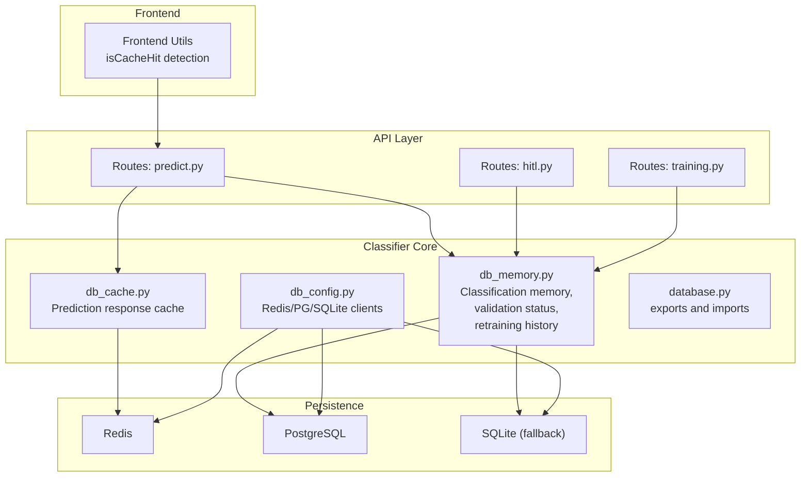
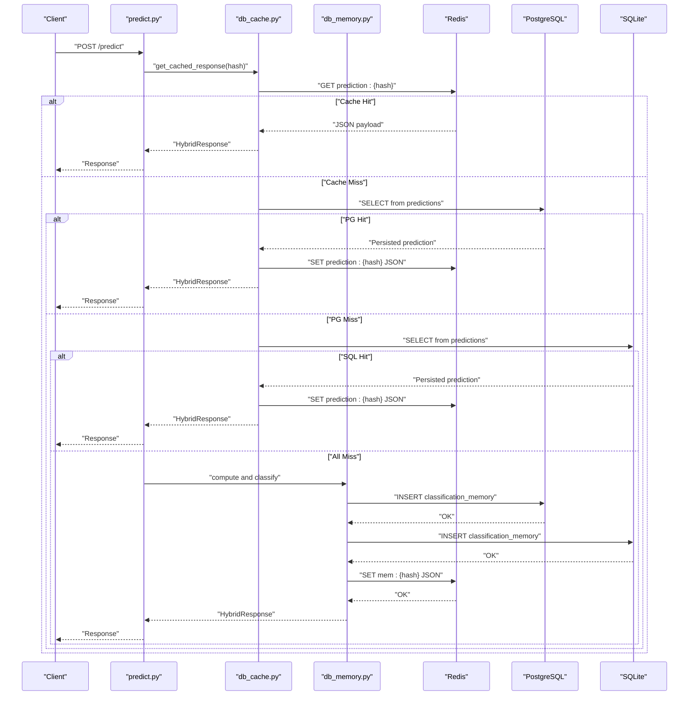
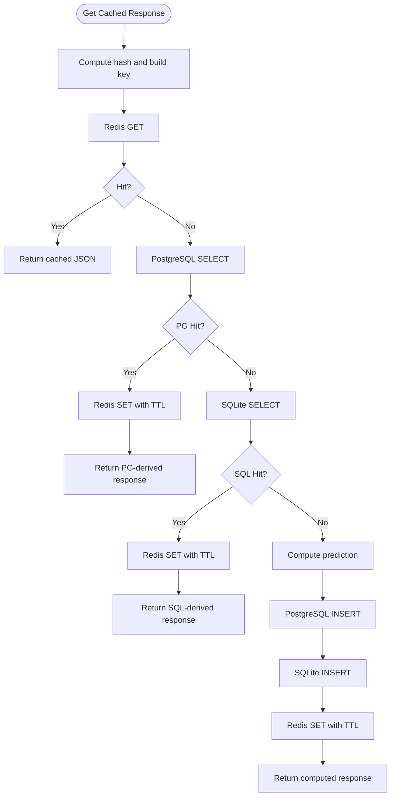
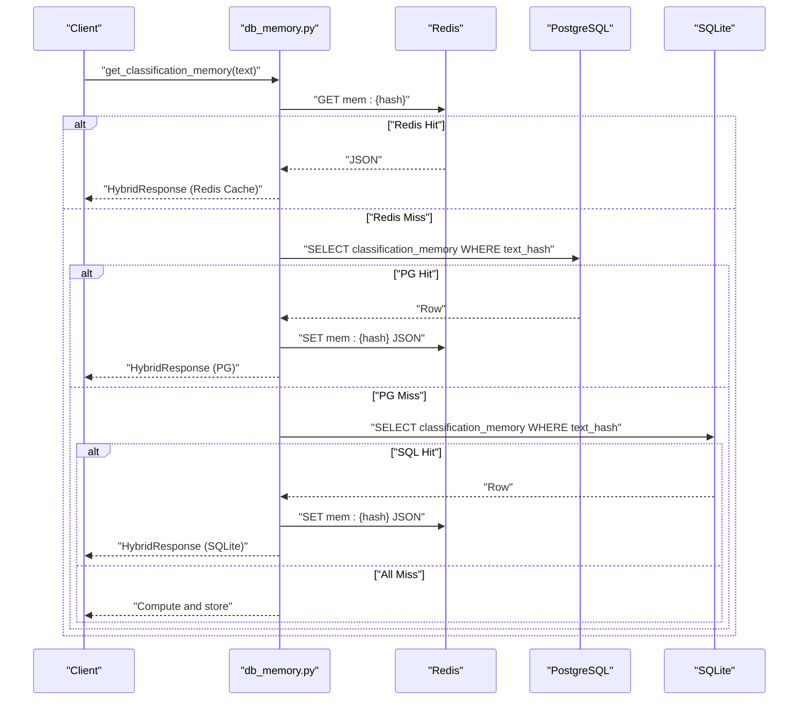
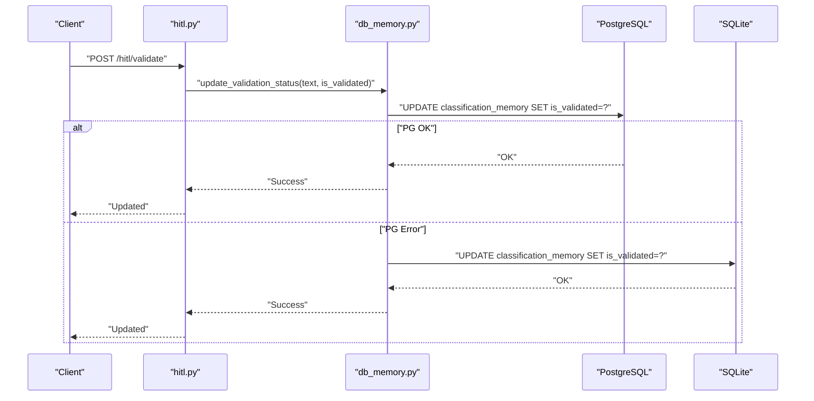
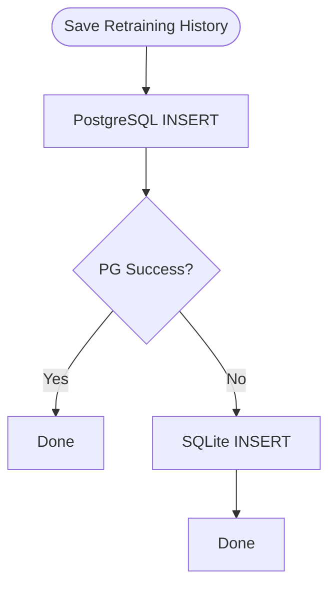
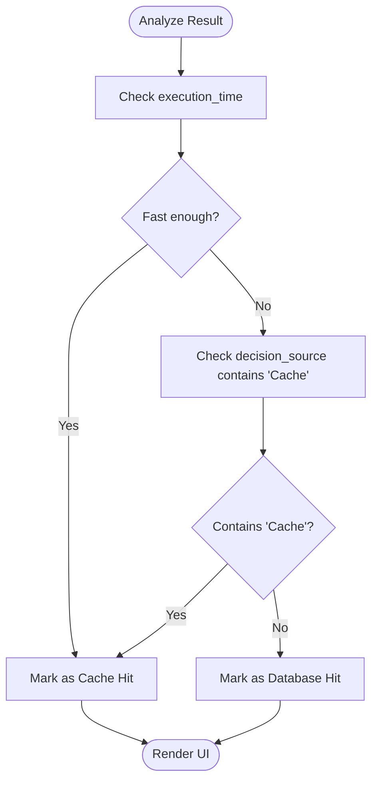
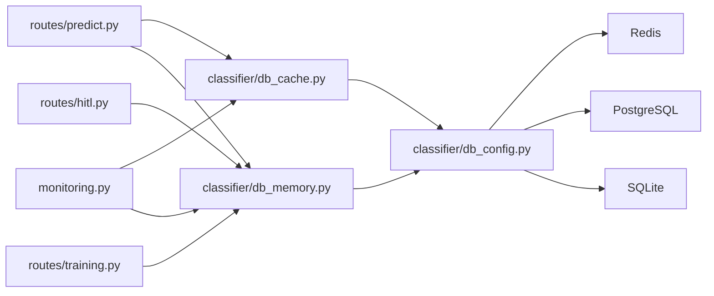

# Caching Strategies and Performance

<cite>
**Referenced Files in This Document**
- [db_cache.py](file://cyberbullying_api/classifier/db_cache.py)
- [db_memory.py](file://cyberbullying_api/classifier/db_memory.py)
- [db_config.py](file://cyberbullying_api/classifier/db_config.py)
- [database.py](file://cyberbullying_api/classifier/database.py)
- [monitoring.py](file://cyberbullying_api/monitoring.py)
- [predict.py](file://cyberbullying_api/routes/predict.py)
- [hitl.py](file://cyberbullying_api/routes/hitl.py)
- [training.py](file://cyberbullying_api/routes/training.py)
- [utils.test.ts](file://frontend/src/components/Detector/utils.test.ts)
- [ComparisonResultCard.tsx](file://frontend/src/components/Detector/ComparisonResultCard.tsx)
</cite>

## Table of Contents
1. [Introduction](#introduction)
2. [Project Structure](#project-structure)
3. [Core Components](#core-components)
4. [Architecture Overview](#architecture-overview)
5. [Detailed Component Analysis](#detailed-component-analysis)
6. [Dependency Analysis](#dependency-analysis)
7. [Performance Considerations](#performance-considerations)
8. [Troubleshooting Guide](#troubleshooting-guide)
9. [Conclusion](#conclusion)
10. [Appendices](#appendices)

## Introduction
This document explains the caching strategies and performance optimization techniques implemented in BullyGuard ID. It focuses on the Redis caching layer for prediction responses, classification memory, and unvalidated items, along with in-memory storage patterns for active learning data, validation status tracking, and retraining history. It also documents cache invalidation policies, TTL management, cache warming strategies, cache-to-persistent storage synchronization (write-through/write-back), conflict resolution, and practical operational guidance for configuration, monitoring, and troubleshooting.

## Project Structure
The caching and persistence stack spans Python backend modules and frontend utilities:
- Redis-backed caches for prediction responses and classification memory
- PostgreSQL and SQLite as primary persistent stores
- Monitoring metrics for cache hits and misses
- Frontend utilities to detect cache hits and present results

**Diagram sources**
- [db_cache.py](file://cyberbullying_api/classifier/db_cache.py)
- [db_memory.py](file://cyberbullying_api/classifier/db_memory.py)
- [db_config.py](file://cyberbullying_api/classifier/db_config.py)
- [database.py](file://cyberbullying_api/classifier/database.py)
- [predict.py](file://cyberbullying_api/routes/predict.py)
- [hitl.py](file://cyberbullying_api/routes/hitl.py)
- [training.py](file://cyberbullying_api/routes/training.py)

**Section sources**
- [db_cache.py](file://cyberbullying_api/classifier/db_cache.py)
- [db_memory.py](file://cyberbullying_api/classifier/db_memory.py)
- [db_config.py](file://cyberbullying_api/classifier/db_config.py)
- [database.py](file://cyberbullying_api/classifier/database.py)

## Core Components
- Redis cache for prediction responses and classification memory with hot-path reads and warm-up strategies
- Multi-tier read-through cache: Redis → PostgreSQL → SQLite fallback
- Validation status updates and HITL workflows synchronized to persistent stores
- Retraining history stored persistently with ordered retrieval
- Metrics for cache hits/misses and latency-sensitive decisions

Key responsibilities:
- Prediction response caching: reduce inference latency and load via Redis keys per request hash
- Classification memory: store past decisions with validation flags and probabilities
- Unvalidated items: managed via HITL routes and persisted to memory tables
- Monitoring: Prometheus-style counters for cache lookups and hits

**Section sources**
- [db_cache.py](file://cyberbullying_api/classifier/db_cache.py)
- [db_memory.py](file://cyberbullying_api/classifier/db_memory.py)
- [db_config.py](file://cyberbullying_api/classifier/db_config.py)
- [monitoring.py](file://cyberbullying_api/monitoring.py)

## Architecture Overview
The system implements a hybrid cache-first strategy:
- Hot-path reads check Redis first; on miss, query PostgreSQL, then SQLite fallback
- On Redis miss, write-through to Redis after successful persistent write
- Validation and retraining history are written to PostgreSQL with SQLite fallback
- Frontend utilities detect cache hits for user-facing feedback

**Diagram sources**
- [predict.py](file://cyberbullying_api/routes/predict.py)
- [db_cache.py](file://cyberbullying_api/classifier/db_cache.py)
- [db_memory.py](file://cyberbullying_api/classifier/db_memory.py)
- [db_config.py](file://cyberbullying_api/classifier/db_config.py)

## Detailed Component Analysis

### Redis Prediction Response Cache
- Keys: prediction responses keyed by normalized input hash
- Write-through pattern: on miss, compute, persist, then set Redis
- TTL: configured via Redis client settings (see configuration)
- Cache warming: pre-compute and seed popular inputs during off-peak hours or model updates

**Diagram sources**
- [db_cache.py](file://cyberbullying_api/classifier/db_cache.py)
- [db_memory.py](file://cyberbullying_api/classifier/db_memory.py)
- [db_config.py](file://cyberbullying_api/classifier/db_config.py)

**Section sources**
- [db_cache.py](file://cyberbullying_api/classifier/db_cache.py)
- [db_config.py](file://cyberbullying_api/classifier/db_config.py)

### Classification Memory Cache (Redis + Persistent Store)
- Keys: mem:{sha256(text)}
- Read-through: Redis → PostgreSQL → SQLite fallback
- Write-through: on miss, compute, persist to PG/SQLite, then set Redis
- Decision source enrichment: append cache/DB indicators for transparency
- Validation status: tracked per record; updates propagate to persistent stores

**Diagram sources**
- [db_memory.py](file://cyberbullying_api/classifier/db_memory.py)
- [db_config.py](file://cyberbullying_api/classifier/db_config.py)

**Section sources**
- [db_memory.py](file://cyberbullying_api/classifier/db_memory.py)
- [db_config.py](file://cyberbullying_api/classifier/db_config.py)

### Validation Status Tracking and HITL
- Validation updates flow to PostgreSQL with SQLite fallback
- HITL route orchestrates manual validation workflows
- Validation flag influences downstream filtering and retraining datasets

**Diagram sources**
- [hitl.py](file://cyberbullying_api/routes/hitl.py)
- [db_memory.py](file://cyberbullying_api/classifier/db_memory.py)
- [db_config.py](file://cyberbullying_api/classifier/db_config.py)

**Section sources**
- [hitl.py](file://cyberbullying_api/routes/hitl.py)
- [db_memory.py](file://cyberbullying_api/classifier/db_memory.py)

### Retraining History Persistence
- Writes to PostgreSQL with SQLite fallback
- Ordered retrieval supports dashboard and audit trails
- Used by training pipeline to track model performance and thresholds

**Diagram sources**
- [db_memory.py](file://cyberbullying_api/classifier/db_memory.py)
- [db_config.py](file://cyberbullying_api/classifier/db_config.py)

**Section sources**
- [db_memory.py](file://cyberbullying_api/classifier/db_memory.py)

### Frontend Cache Hit Detection
- Utilities detect cache hits based on execution time thresholds and decision source markers
- UI surfaces cache-hit indicators for transparency

**Diagram sources**
- [utils.test.ts](file://frontend/src/components/Detector/utils.test.ts)
- [ComparisonResultCard.tsx](file://frontend/src/components/Detector/ComparisonResultCard.tsx)

**Section sources**
- [utils.test.ts](file://frontend/src/components/Detector/utils.test.ts)
- [ComparisonResultCard.tsx](file://frontend/src/components/Detector/ComparisonResultCard.tsx)

## Dependency Analysis
- Route handlers depend on cache and memory modules for prediction and classification
- Cache modules depend on Redis and database clients initialized in configuration
- Memory module depends on PostgreSQL and SQLite for persistence
- Monitoring exposes metrics consumed by infrastructure dashboards

**Diagram sources**
- [predict.py](file://cyberbullying_api/routes/predict.py)
- [hitl.py](file://cyberbullying_api/routes/hitl.py)
- [training.py](file://cyberbullying_api/routes/training.py)
- [db_cache.py](file://cyberbullying_api/classifier/db_cache.py)
- [db_memory.py](file://cyberbullying_api/classifier/db_memory.py)
- [db_config.py](file://cyberbullying_api/classifier/db_config.py)
- [monitoring.py](file://cyberbullying_api/monitoring.py)

**Section sources**
- [database.py](file://cyberbullying_api/classifier/database.py)
- [db_config.py](file://cyberbullying_api/classifier/db_config.py)

## Performance Considerations
- Latency-sensitive reads: prioritize Redis for prediction responses and classification memory
- Write-through ensures consistency: Redis + persistent stores
- Cache warming reduces cold-start latency for high-volume inputs
- Monitoring counters enable cache hit ratio calculations and alerting thresholds
- Asynchronous I/O minimizes blocking on database operations

[No sources needed since this section provides general guidance]

## Troubleshooting Guide
Common issues and resolutions:
- Redis connectivity errors: verify connection URL and credentials; fallback to local SQLite continues
- PostgreSQL failures: confirm pool availability and migrations; ensure indexes exist
- SQLite contention: write locks protect concurrent writes; avoid long-running transactions
- Cache miss storms: investigate upstream model latency or missing cache warming
- Validation inconsistencies: confirm both PG and SQLite updates succeeded; inspect logs for partial failures

Operational checks:
- Confirm cache keys exist and TTL is applied
- Review cache hit/miss counters to identify degradation
- Validate decision source labels reflect cache vs. database origins
- Audit HITL validation flows for correctness

**Section sources**
- [db_memory.py](file://cyberbullying_api/classifier/db_memory.py)
- [db_config.py](file://cyberbullying_api/classifier/db_config.py)
- [monitoring.py](file://cyberbullying_api/monitoring.py)

## Conclusion
BullyGuard ID employs a robust, layered caching strategy combining Redis hot-path reads with PostgreSQL and SQLite as durable backends. The system prioritizes low-latency inference while maintaining strong consistency through write-through patterns and fallbacks. Monitoring enables continuous performance oversight, and frontend utilities provide user-visible feedback on cache behavior. Proper configuration, warming, and operational hygiene deliver optimal balance among memory usage, performance, and data consistency.

[No sources needed since this section summarizes without analyzing specific files]

## Appendices

### Practical Configuration Examples
- Redis client initialization and URL configuration
- PostgreSQL pool sizing and connection limits
- SQLite cache directory and file locations
- Environment-specific overrides for development/testing

**Section sources**
- [db_config.py](file://cyberbullying_api/classifier/db_config.py)

### Monitoring Cache Performance
- Cache lookup totals and hit counters
- Latency distributions for prediction requests
- Alert thresholds for sustained low hit ratios

**Section sources**
- [monitoring.py](file://cyberbullying_api/monitoring.py)
- [db_cache.py](file://cyberbullying_api/classifier/db_cache.py)
- [db_memory.py](file://cyberbullying_api/classifier/db_memory.py)

### Cache Invalidation and TTL Management
- TTL policy aligned with model refresh cadence
- Manual invalidation triggers for retrained versions
- Graceful degradation when TTL expires

**Section sources**
- [db_cache.py](file://cyberbullying_api/classifier/db_cache.py)
- [db_memory.py](file://cyberbullying_api/classifier/db_memory.py)

### Cache Warming Strategies
- Pre-compute and seed popular inputs during off-hours
- Warm by batch ingestion from recent production traffic
- Validate warming effectiveness via cache hit ratios

**Section sources**
- [db_cache.py](file://cyberbullying_api/classifier/db_cache.py)
- [db_memory.py](file://cyberbullying_api/classifier/db_memory.py)

### Cache-to-Persistent Synchronization
- Write-through: Redis + PG/SQLite on cache miss
- Conflict resolution: last-write-wins with transactional updates
- Consistency boundaries: per-input hash; cross-record consistency handled by separate workflows

**Section sources**
- [db_cache.py](file://cyberbullying_api/classifier/db_cache.py)
- [db_memory.py](file://cyberbullying_api/classifier/db_memory.py)
- [db_config.py](file://cyberbullying_api/classifier/db_config.py)