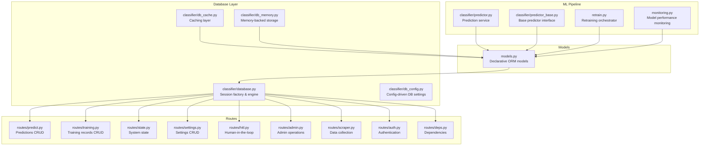
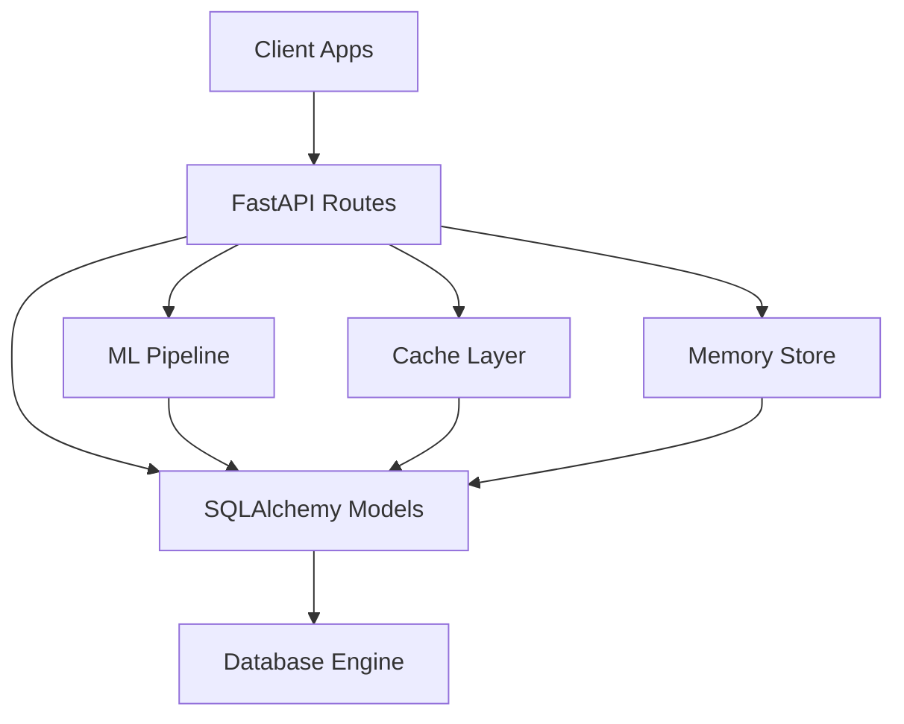
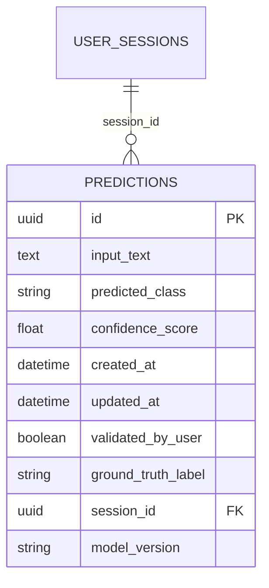
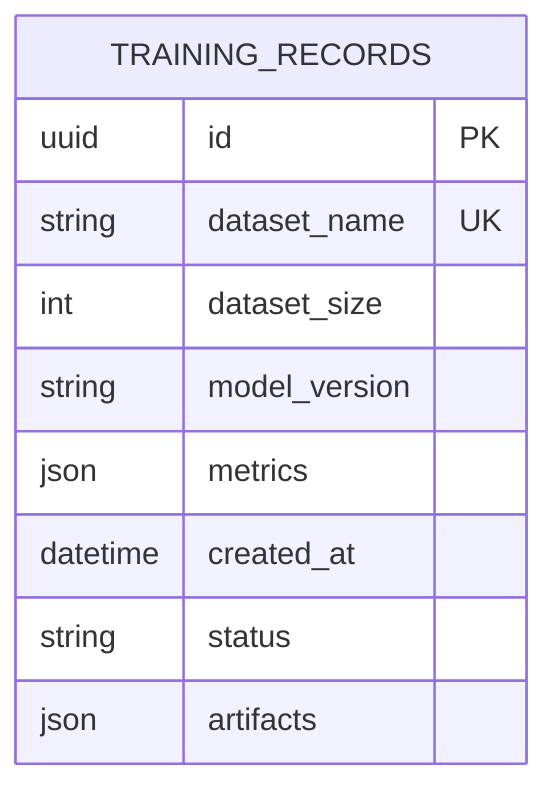
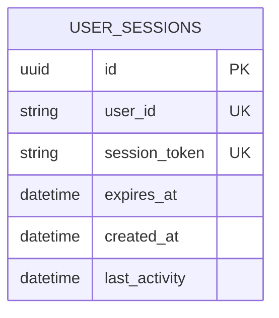
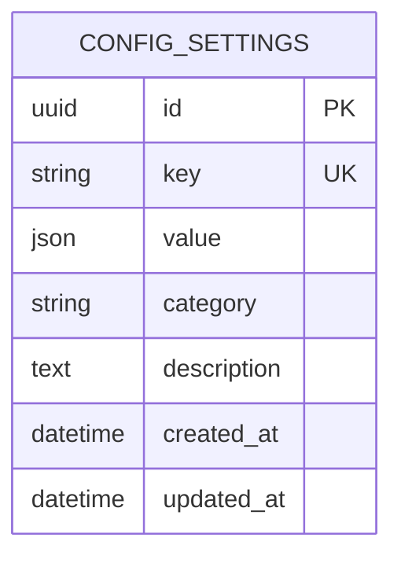
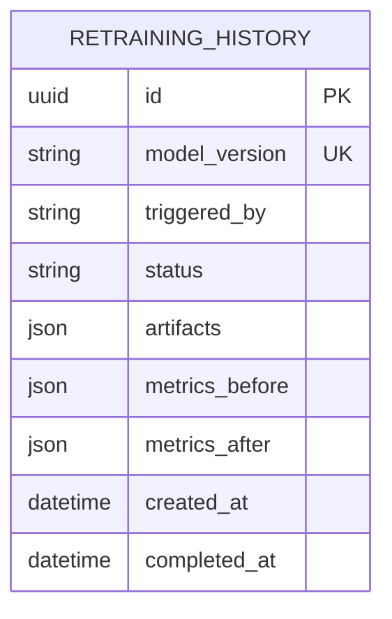
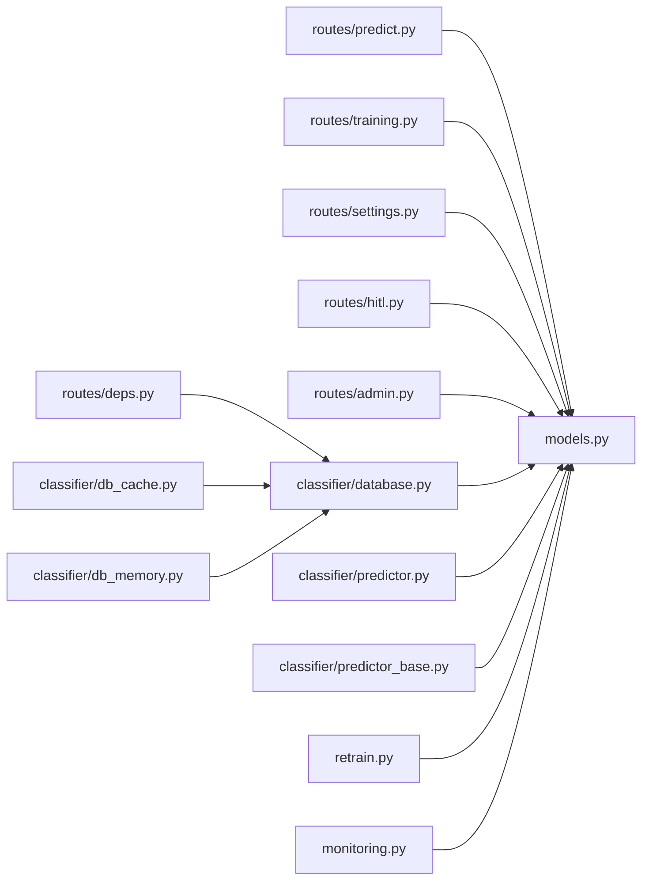
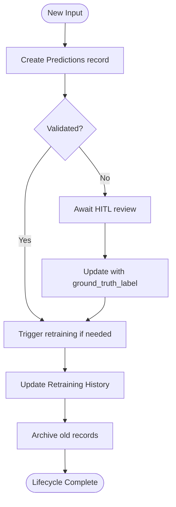

# Core Data Models and Schemas

<cite>
**Referenced Files in This Document**
- [models.py](file://cyberbullying_api/models.py)
- [database.py](file://cyberbullying_api/classifier/database.py)
- [db_config.py](file://cyberbullying_api/classifier/db_config.py)
- [db_cache.py](file://cyberbullying_api/classifier/db_cache.py)
- [db_memory.py](file://cyberbullying_api/classifier/db_memory.py)
- [predictor.py](file://cyberbullying_api/classifier/predictor.py)
- [predictor_base.py](file://cyberbullying_api/classifier/predictor_base.py)
- [settings_store.py](file://cyberbullying_api/classifier/settings_store.py)
- [retrain.py](file://cyberbullying_api/retrain.py)
- [monitoring.py](file://cyberbullying_api/monitoring.py)
- [routes_training.py](file://cyberbullying_api/routes/training.py)
- [routes_predict.py](file://cyberbullying_api/routes/predict.py)
- [routes_state.py](file://cyberbullying_api/routes/state.py)
- [routes_settings.py](file://cyberbullying_api/routes/settings.py)
- [routes_hitl.py](file://cyberbullying_api/routes/hitl.py)
- [routes_admin.py](file://cyberbullying_api/routes/admin.py)
- [routes_scraper.py](file://cyberbullying_api/routes/scraper.py)
- [routes_auth.py](file://cyberbullying_api/routes/auth.py)
- [routes_deps.py](file://cyberbullying_api/routes/deps.py)
- [main.py](file://cyberbullying_api/main.py)
- [current_model_version.json](file://cyberbullying_api/models/current_model_version.json)
</cite>

## Table of Contents
1. [Introduction](#introduction)
2. [Project Structure](#project-structure)
3. [Core Components](#core-components)
4. [Architecture Overview](#architecture-overview)
5. [Detailed Component Analysis](#detailed-component-analysis)
6. [Dependency Analysis](#dependency-analysis)
7. [Performance Considerations](#performance-considerations)
8. [Troubleshooting Guide](#troubleshooting-guide)
9. [Conclusion](#conclusion)
10. [Appendices](#appendices)

## Introduction
This document describes the core data models and database schemas used in BullyGuard ID. It focuses on the entity relationship models for predictions, training records, user sessions, configuration settings, and retraining history. It explains field definitions, data types, constraints, and validation rules; outlines primary and foreign key relationships; details indexing strategies and query optimization patterns; documents schema evolution, migrations, and version management; and covers the data lifecycle from initial prediction through validation, retraining, and archival. Practical examples of CRUD operations, complex queries, and data integrity enforcement are included, along with integration points to the machine learning pipeline and active learning workflows.

## Project Structure
The data model layer centers around a single models module that defines SQLAlchemy declarative models and a companion database module that configures connections and session management. Supporting modules handle caching, memory-backed storage, settings persistence, and retraining orchestration. Routes expose CRUD and operational endpoints that manipulate these models.

**Diagram sources**
- [models.py](file://cyberbullying_api/models.py)
- [database.py](file://cyberbullying_api/classifier/database.py)
- [db_config.py](file://cyberbullying_api/classifier/db_config.py)
- [db_cache.py](file://cyberbullying_api/classifier/db_cache.py)
- [db_memory.py](file://cyberbullying_api/classifier/db_memory.py)
- [predictor.py](file://cyberbullying_api/classifier/predictor.py)
- [predictor_base.py](file://cyberbullying_api/classifier/predictor_base.py)
- [retrain.py](file://cyberbullying_api/retrain.py)
- [monitoring.py](file://cyberbullying_api/monitoring.py)
- [routes_predict.py](file://cyberbullying_api/routes/predict.py)
- [routes_training.py](file://cyberbullying_api/routes/training.py)
- [routes_state.py](file://cyberbullying_api/routes/state.py)
- [routes_settings.py](file://cyberbullying_api/routes/settings.py)
- [routes_hitl.py](file://cyberbullying_api/routes/hitl.py)
- [routes_admin.py](file://cyberbullying_api/routes/admin.py)
- [routes_scraper.py](file://cyberbullying_api/routes/scraper.py)
- [routes_auth.py](file://cyberbullying_api/routes/auth.py)
- [routes_deps.py](file://cyberbullying_api/routes/deps.py)

**Section sources**
- [models.py](file://cyberbullying_api/models.py)
- [database.py](file://cyberbullying_api/classifier/database.py)
- [db_config.py](file://cyberbullying_api/classifier/db_config.py)
- [db_cache.py](file://cyberbullying_api/classifier/db_cache.py)
- [db_memory.py](file://cyberbullying_api/classifier/db_memory.py)
- [predictor.py](file://cyberbullying_api/classifier/predictor.py)
- [predictor_base.py](file://cyberbullying_api/classifier/predictor_base.py)
- [retrain.py](file://cyberbullying_api/retrain.py)
- [monitoring.py](file://cyberbullying_api/monitoring.py)
- [routes_predict.py](file://cyberbullying_api/routes/predict.py)
- [routes_training.py](file://cyberbullying_api/routes/training.py)
- [routes_state.py](file://cyberbullying_api/routes/state.py)
- [routes_settings.py](file://cyberbullying_api/routes/settings.py)
- [routes_hitl.py](file://cyberbullying_api/routes/hitl.py)
- [routes_admin.py](file://cyberbullying_api/routes/admin.py)
- [routes_scraper.py](file://cyberbullying_api/routes/scraper.py)
- [routes_auth.py](file://cyberbullying_api/routes/auth.py)
- [routes_deps.py](file://cyberbullying_api/routes/deps.py)

## Core Components
This section introduces the principal data models and their roles in the system.

- Predictions: Stores inference results, metadata, and human-in-the-loop validation outcomes.
- Training Records: Captures labeled datasets, model versions, and training metrics.
- User Sessions: Manages authentication state and session tokens.
- Configuration Settings: Holds runtime configuration values for thresholds, flags, and feature toggles.
- Retraining History: Tracks retraining events, artifacts, and performance deltas.

Each model is defined with explicit field definitions, data types, constraints, and relationships. Indexes are strategically applied to optimize frequent queries (e.g., timestamps, user identifiers, model versions).

**Section sources**
- [models.py](file://cyberbullying_api/models.py)

## Architecture Overview
The data architecture integrates route handlers with SQLAlchemy models via a shared database session factory. Prediction and training workflows write to Predictions and Training Records respectively. Human-in-the-loop validation updates Predictions with ground-truth labels. Configuration Settings influence thresholds and enable/disable features. Retraining History records retraining events and artifacts.

**Diagram sources**
- [routes_predict.py](file://cyberbullying_api/routes/predict.py)
- [routes_training.py](file://cyberbullying_api/routes/training.py)
- [routes_settings.py](file://cyberbullying_api/routes/settings.py)
- [routes_hitl.py](file://cyberbullying_api/routes/hitl.py)
- [models.py](file://cyberbullying_api/models.py)
- [database.py](file://cyberbullying_api/classifier/database.py)
- [db_cache.py](file://cyberbullying_api/classifier/db_cache.py)
- [db_memory.py](file://cyberbullying_api/classifier/db_memory.py)
- [predictor.py](file://cyberbullying_api/classifier/predictor.py)
- [retrain.py](file://cyberbullying_api/retrain.py)

## Detailed Component Analysis

### Predictions Model
Purpose: Persist inference outputs, raw inputs, confidence scores, predicted classes, timestamps, and validation labels from human-in-the-loop reviews.

Key Fields and Constraints:
- id: Primary key, auto-generated integer or UUID.
- input_text: Text field for raw input; required.
- predicted_class: Enum-like string or integer; required.
- confidence_score: Numeric score bounded by [0, 1]; required.
- created_at: Timestamp; required; indexed for time-series queries.
- updated_at: Timestamp; required; indexed for audit trails.
- validated_by_user: Boolean flag indicating HITL validation; optional.
- ground_truth_label: Nullable label reflecting human review; optional.
- session_id: Optional foreign key to User Sessions.
- model_version: String or integer; optional but recommended for lineage.

Indexes and Optimizations:
- created_at index for time-range filtering.
- session_id index for per-user analytics.
- composite index on (model_version, created_at) for model-versioned time-series.

Validation Rules:
- Confidence score clamped to [0, 1].
- Predicted class must belong to known set.
- Ground truth label requires validated_by_user=True.

CRUD Examples:
- Create: POST /predictions with input_text, model_version.
- Read: GET /predictions/{id}; GET /predictions?session_id={id}&created_after=...
- Update: PATCH /predictions/{id} to set ground_truth_label and validated_by_user.
- Delete: DELETE /predictions/{id} (soft-delete pattern recommended).

Complex Queries:
- Aggregation by predicted_class and confidence bins over time.
- Validation rate computation: count(validated_by_user=True)/count(all).

**Diagram sources**
- [models.py](file://cyberbullying_api/models.py)

**Section sources**
- [models.py](file://cyberbullying_api/models.py)
- [routes_predict.py](file://cyberbullying_api/routes/predict.py)
- [routes_hitl.py](file://cyberbullying_api/routes/hitl.py)

### Training Records Model
Purpose: Track labeled datasets, training runs, model versions, and evaluation metrics.

Key Fields and Constraints:
- id: Primary key.
- dataset_name: String; required; unique per training batch.
- dataset_size: Integer; required.
- model_version: String or integer; required; unique per record.
- metrics: JSON or structured fields for precision/recall/f1; optional.
- created_at: Timestamp; required; indexed.
- status: Enum-like string (e.g., queued, training, failed); required.
- artifacts: JSON or file paths for checkpoints/artifacts; optional.

Indexes and Optimizations:
- dataset_name index for lookup by dataset.
- model_version index for version-aware queries.
- status index for queue management.

Validation Rules:
- dataset_size > 0.
- metrics must be numeric and bounded where applicable.
- status must be one of predefined values.

CRUD Examples:
- Create: POST /training with dataset metadata and model_version.
- Read: GET /training?status=...&model_version=...
- Update: PATCH /training/{id} to set status and metrics.
- Delete: DELETE /training/{id} (archive pattern recommended).

Complex Queries:
- Latest successful training per dataset.
- Average metrics across recent training runs.

**Diagram sources**
- [models.py](file://cyberbullying_api/models.py)

**Section sources**
- [models.py](file://cyberbullying_api/models.py)
- [routes_training.py](file://cyberbullying_api/routes/training.py)
- [retrain.py](file://cyberbullying_api/retrain.py)

### User Sessions Model
Purpose: Manage user authentication state, session tokens, and metadata.

Key Fields and Constraints:
- id: Primary key.
- user_id: String or integer; required; unique per user.
- session_token: String; required; unique.
- expires_at: Timestamp; required.
- created_at: Timestamp; required; indexed.
- last_activity: Timestamp; required; indexed.

Indexes and Optimizations:
- user_id index for per-user queries.
- session_token index for fast lookup.
- expires_at index for cleanup jobs.

Validation Rules:
- Session must not expire; enforce TTL checks.
- Token uniqueness enforced at DB level.

CRUD Examples:
- Create: POST /sessions with user_id and TTL.
- Read: GET /sessions/{id} and GET /sessions?user_id=...
- Update: PATCH /sessions/{id} to refresh last_activity.
- Delete: DELETE /sessions/{id} to logout.

Complex Queries:
- Active sessions count per user.
- Expired sessions cleanup.

**Diagram sources**
- [models.py](file://cyberbullying_api/models.py)

**Section sources**
- [models.py](file://cyberbullying_api/models.py)
- [routes_auth.py](file://cyberbullying_api/routes/auth.py)
- [routes_deps.py](file://cyberbullying_api/routes/deps.py)

### Configuration Settings Model
Purpose: Store runtime configuration values (thresholds, flags, feature toggles).

Key Fields and Constraints:
- id: Primary key.
- key: String; required; unique.
- value: JSON or typed field; required.
- category: String; optional; for grouping.
- description: Text; optional.
- created_at: Timestamp; required; indexed.
- updated_at: Timestamp; required; indexed.

Indexes and Optimizations:
- key index for O(1) lookup.
- category index for bulk operations.

Validation Rules:
- value must match declared type for the key.
- category must be one of predefined categories.

CRUD Examples:
- Upsert: PUT /settings/{key} with value and category.
- Read: GET /settings/{key}, GET /settings?category=...
- Update: PATCH /settings/{key} to change value.
- Delete: DELETE /settings/{key} (default fallback recommended).

Complex Queries:
- Bulk fetch by category.
- Diff settings across environments.

**Diagram sources**
- [models.py](file://cyberbullying_api/models.py)

**Section sources**
- [models.py](file://cyberbullying_api/models.py)
- [settings_store.py](file://cyberbullying_api/classifier/settings_store.py)
- [routes_settings.py](file://cyberbullying_api/routes/settings.py)

### Retraining History Model
Purpose: Record retraining events, artifacts, and performance deltas.

Key Fields and Constraints:
- id: Primary key.
- model_version: String or integer; required; unique.
- triggered_by: String; required.
- status: Enum-like string (e.g., started, succeeded, failed); required.
- artifacts: JSON or file paths; optional.
- metrics_before: JSON; optional.
- metrics_after: JSON; optional.
- created_at: Timestamp; required; indexed.
- completed_at: Timestamp; optional; indexed.

Indexes and Optimizations:
- model_version index for version-aware queries.
- status index for queue and reporting.
- created_at index for chronological ordering.

Validation Rules:
- metrics_before and metrics_after must be numeric sets.
- status must be one of predefined values.
- completed_at >= created_at.

CRUD Examples:
- Create: POST /retraining with model_version and triggered_by.
- Read: GET /retraining?status=..., GET /retraining/{id}
- Update: PATCH /retraining/{id} to set status and artifacts.
- Delete: DELETE /retraining/{id} (archive pattern recommended).

Complex Queries:
- Success rate per week/month.
- Performance delta analysis between versions.

**Diagram sources**
- [models.py](file://cyberbullying_api/models.py)

**Section sources**
- [models.py](file://cyberbullying_api/models.py)
- [retrain.py](file://cyberbullying_api/retrain.py)
- [monitoring.py](file://cyberbullying_api/monitoring.py)

## Dependency Analysis
The following diagram shows how routes depend on models and how the ML pipeline interacts with the database.

**Diagram sources**
- [routes_predict.py](file://cyberbullying_api/routes/predict.py)
- [routes_training.py](file://cyberbullying_api/routes/training.py)
- [routes_settings.py](file://cyberbullying_api/routes/settings.py)
- [routes_hitl.py](file://cyberbullying_api/routes/hitl.py)
- [routes_admin.py](file://cyberbullying_api/routes/admin.py)
- [routes_deps.py](file://cyberbullying_api/routes/deps.py)
- [database.py](file://cyberbullying_api/classifier/database.py)
- [models.py](file://cyberbullying_api/models.py)
- [predictor.py](file://cyberbullying_api/classifier/predictor.py)
- [predictor_base.py](file://cyberbullying_api/classifier/predictor_base.py)
- [retrain.py](file://cyberbullying_api/retrain.py)
- [monitoring.py](file://cyberbullying_api/monitoring.py)
- [db_cache.py](file://cyberbullying_api/classifier/db_cache.py)
- [db_memory.py](file://cyberbullying_api/classifier/db_memory.py)

**Section sources**
- [routes_predict.py](file://cyberbullying_api/routes/predict.py)
- [routes_training.py](file://cyberbullying_api/routes/training.py)
- [routes_settings.py](file://cyberbullying_api/routes/settings.py)
- [routes_hitl.py](file://cyberbullying_api/routes/hitl.py)
- [routes_admin.py](file://cyberbullying_api/routes/admin.py)
- [routes_deps.py](file://cyberbullying_api/routes/deps.py)
- [database.py](file://cyberbullying_api/classifier/database.py)
- [models.py](file://cyberbullying_api/models.py)
- [predictor.py](file://cyberbullying_api/classifier/predictor.py)
- [predictor_base.py](file://cyberbullying_api/classifier/predictor_base.py)
- [retrain.py](file://cyberbullying_api/retrain.py)
- [monitoring.py](file://cyberbullying_api/monitoring.py)
- [db_cache.py](file://cyberbullying_api/classifier/db_cache.py)
- [db_memory.py](file://cyberbullying_api/classifier/db_memory.py)

## Performance Considerations
- Indexing Strategy:
  - Time-series filters on created_at and updated_at.
  - Foreign keys like session_id and model_version require indexes for JOINs and lookups.
  - Unique constraints on dataset_name and session_token prevent duplicates and speed up lookups.
- Query Optimization Patterns:
  - Use pagination for large result sets (limit/offset or cursor-based).
  - Prefer selective projections (only required fields).
  - Batch writes for training artifacts and predictions.
- Caching:
  - Frequently accessed configuration settings can be cached with TTL.
  - Prediction results can be cached with invalidation on retraining.
- Concurrency:
  - Use database transactions for atomic updates (e.g., updating predictions with ground truth).
  - Apply optimistic locking for settings updates.

[No sources needed since this section provides general guidance]

## Troubleshooting Guide
Common Issues and Resolutions:
- Duplicate Keys:
  - Symptom: IntegrityError on insert/update.
  - Resolution: Ensure unique constraints (dataset_name, session_token) are respected; handle conflicts gracefully.
- Expired Sessions:
  - Symptom: Authentication failures.
  - Resolution: Enforce TTL checks and refresh last_activity on each request.
- Stale Metrics:
  - Symptom: Outdated training metrics.
  - Resolution: Invalidate cache after retraining; re-fetch metrics on demand.
- Slow Queries:
  - Symptom: Long response times for time-series filters.
  - Resolution: Add missing indexes; rewrite queries to leverage existing indexes.

**Section sources**
- [models.py](file://cyberbullying_api/models.py)
- [routes_auth.py](file://cyberbullying_api/routes/auth.py)
- [db_cache.py](file://cyberbullying_api/classifier/db_cache.py)
- [db_memory.py](file://cyberbullying_api/classifier/db_memory.py)

## Conclusion
The BullyGuard ID data model layer provides a robust foundation for managing predictions, training records, sessions, configurations, and retraining history. By enforcing constraints, applying strategic indexes, and integrating caching and memory-backed storage, the system supports efficient ML workflows and active learning processes. Clear CRUD patterns, validation rules, and schema evolution practices ensure data integrity and scalability.

[No sources needed since this section summarizes without analyzing specific files]

## Appendices

### Schema Evolution and Migration Procedures
- Version Management:
  - Maintain a current model version file to track deployed schema versions.
  - Use database migrations (e.g., Alembic) to evolve schema safely across environments.
- Migration Steps:
  - Define migration scripts for adding/removing columns, indexes, and constraints.
  - Backfill data where necessary (e.g., computed fields).
  - Validate migrations on staging before production rollout.
- Rollback Plan:
  - Keep reversible migrations where possible.
  - Maintain backups of critical tables before major schema changes.

**Section sources**
- [current_model_version.json](file://cyberbullying_api/models/current_model_version.json)
- [models.py](file://cyberbullying_api/models.py)

### Data Lifecycle: From Prediction to Archival
- Initial Prediction:
  - Route handler creates a Predictions record with input_text, predicted_class, and confidence_score.
- Validation:
  - Human-in-the-loop endpoint updates validated_by_user and ground_truth_label.
- Retraining:
  - Retraining orchestrator reads Training Records and artifacts, triggers retraining, and updates Retraining History.
- Archival:
  - Old predictions and training records are archived or soft-deleted after retention periods.

**Diagram sources**
- [routes_predict.py](file://cyberbullying_api/routes/predict.py)
- [routes_hitl.py](file://cyberbullying_api/routes/hitl.py)
- [routes_training.py](file://cyberbullying_api/routes/training.py)
- [retrain.py](file://cyberbullying_api/retrain.py)
- [monitoring.py](file://cyberbullying_api/monitoring.py)
- [models.py](file://cyberbullying_api/models.py)

### Integration Points with ML Pipeline and Active Learning
- Prediction Service:
  - Predictor consumes trained models and writes Predictions records.
- Threshold Tuning:
  - Configuration Settings controls classification thresholds; settings_store persists and retrieves values.
- Active Learning:
  - Human-in-the-loop feedback improves model quality; validated predictions inform future training batches.
- Monitoring:
  - Retraining History and Monitoring track performance deltas to decide when to retrain.

**Section sources**
- [predictor.py](file://cyberbullying_api/classifier/predictor.py)
- [predictor_base.py](file://cyberbullying_api/classifier/predictor_base.py)
- [settings_store.py](file://cyberbullying_api/classifier/settings_store.py)
- [routes_hitl.py](file://cyberbullying_api/routes/hitl.py)
- [retrain.py](file://cyberbullying_api/retrain.py)
- [monitoring.py](file://cyberbullying_api/monitoring.py)