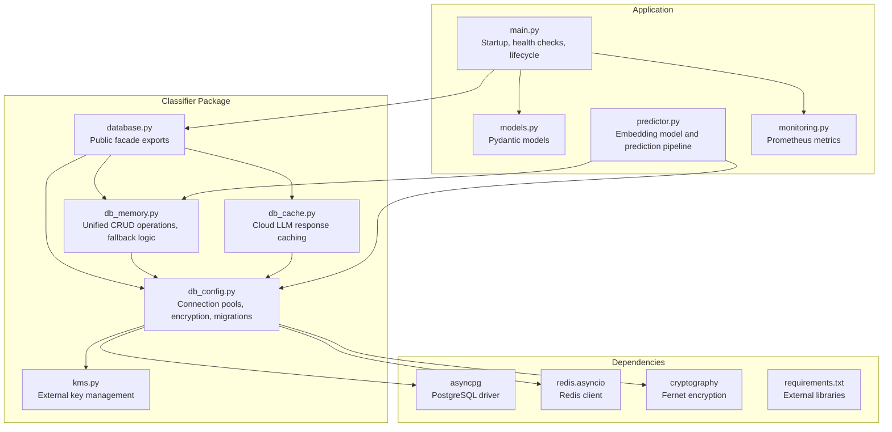
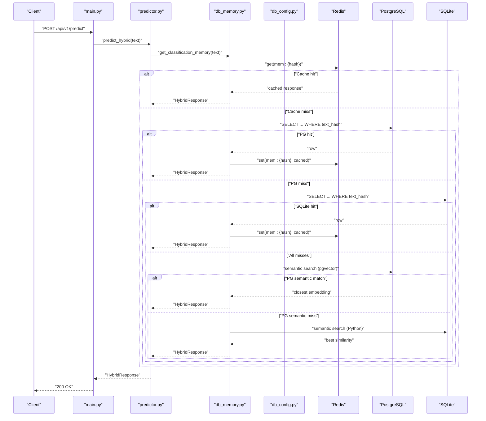
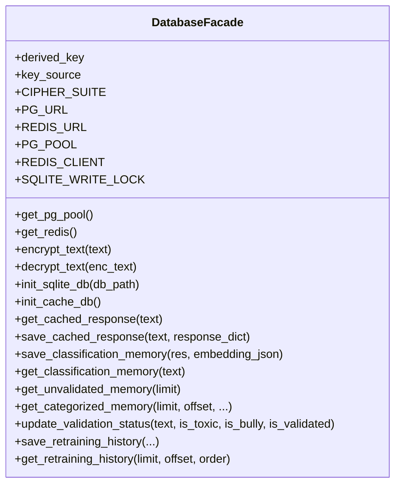
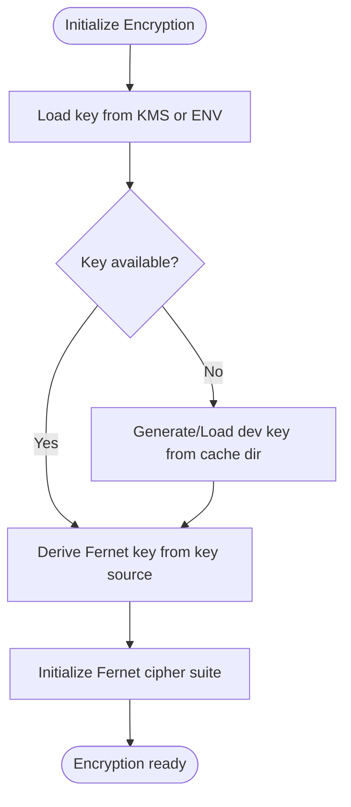
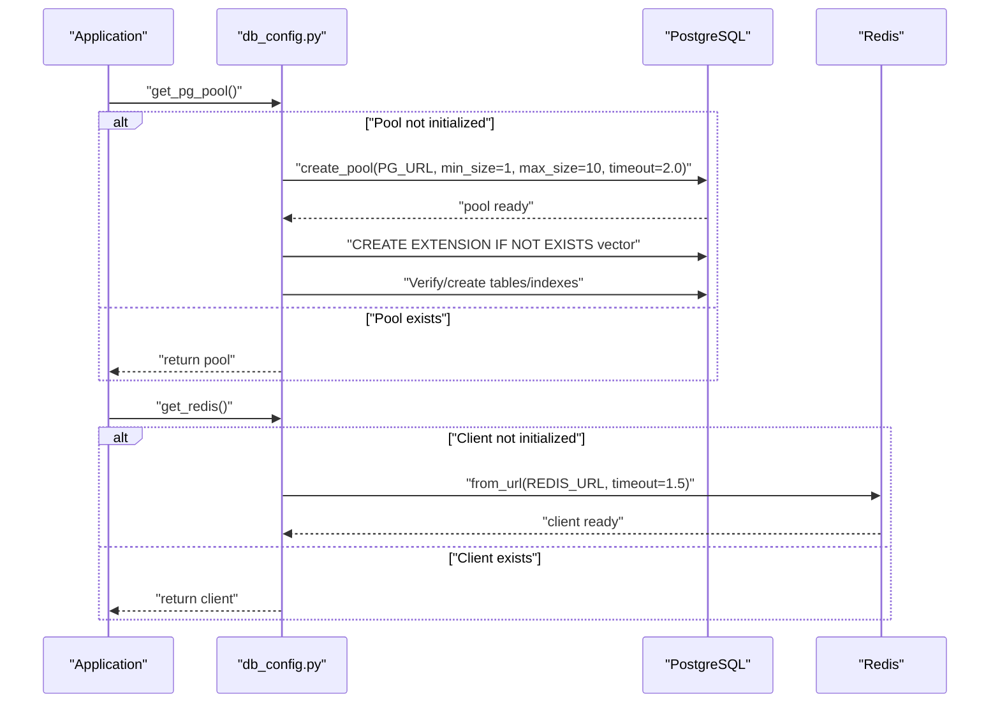
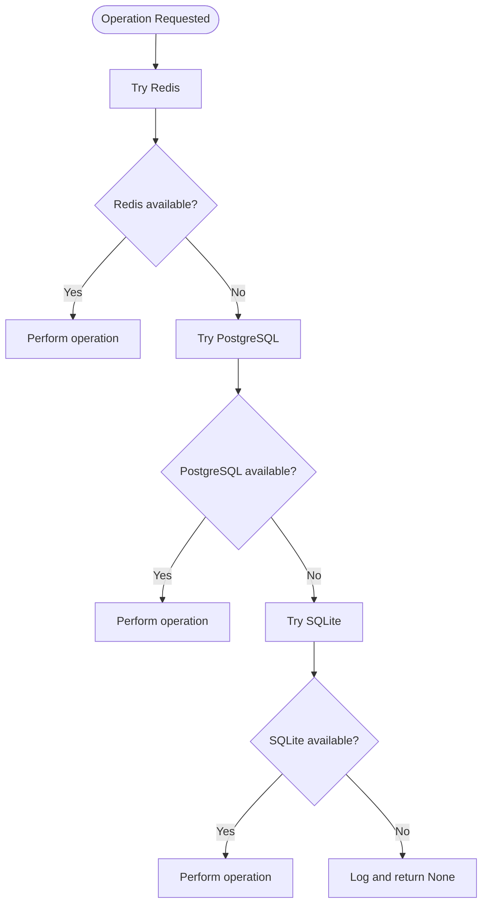
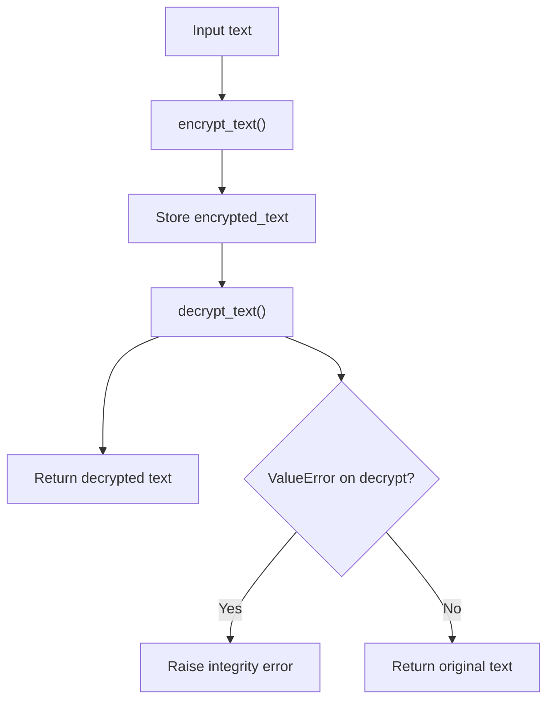
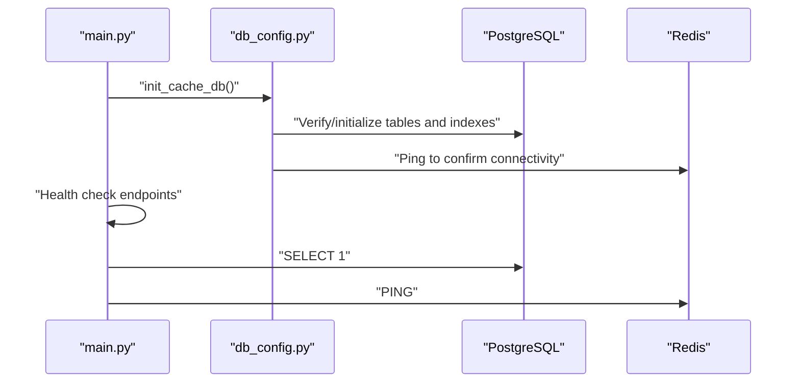
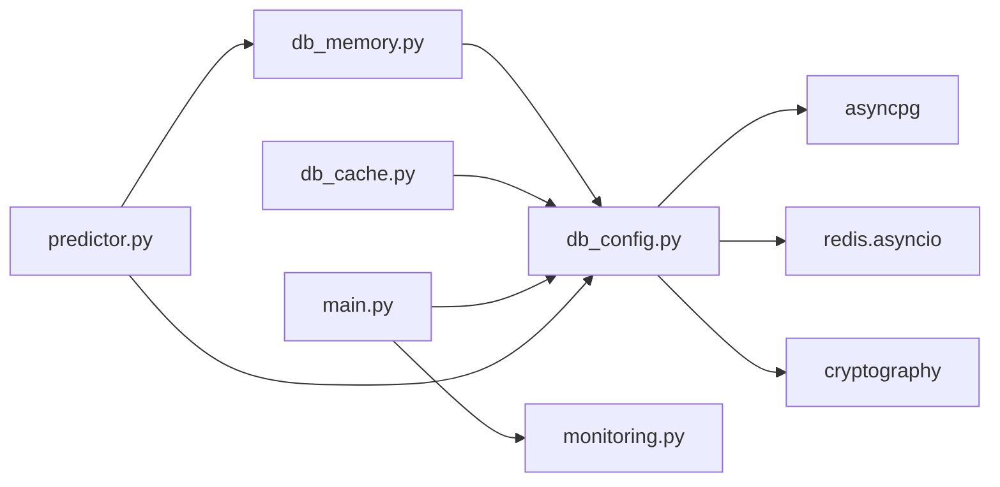

# Database Abstraction Layer

<cite>
**Referenced Files in This Document**
- [database.py](file://cyberbullying_api/classifier/database.py)
- [db_config.py](file://cyberbullying_api/classifier/db_config.py)
- [db_memory.py](file://cyberbullying_api/classifier/db_memory.py)
- [db_cache.py](file://cyberbullying_api/classifier/db_cache.py)
- [kms.py](file://cyberbullying_api/classifier/kms.py)
- [main.py](file://cyberbullying_api/main.py)
- [models.py](file://cyberbullying_api/models.py)
- [predictor.py](file://cyberbullying_api/classifier/predictor.py)
- [monitoring.py](file://cyberbullying_api/monitoring.py)
- [requirements.txt](file://cyberbullying_api/requirements.txt)
</cite>

## Table of Contents
1. [Introduction](#introduction)
2. [Project Structure](#project-structure)
3. [Core Components](#core-components)
4. [Architecture Overview](#architecture-overview)
5. [Detailed Component Analysis](#detailed-component-analysis)
6. [Dependency Analysis](#dependency-analysis)
7. [Performance Considerations](#performance-considerations)
8. [Troubleshooting Guide](#troubleshooting-guide)
9. [Security Considerations](#security-considerations)
10. [Conclusion](#conclusion)

## Introduction
This document describes the database abstraction layer that powers the Indonesian cyberbullying detection API. It provides a unified interface for seamless switching between multiple storage backends:
- PostgreSQL with pgvector for advanced analytics and semantic search
- Redis for high-performance caching and real-time operations
- SQLite as a robust fallback for environments without external databases
- In-memory storage for temporary operations and testing

The abstraction ensures consistent behavior across backends, handles encryption/decryption of sensitive data, manages connection pools, and implements graceful fallbacks when primary systems fail. It also includes configuration management, error handling patterns, and performance tuning strategies.

## Project Structure
The database abstraction resides primarily under the classifier package with supporting modules for encryption, caching, and monitoring.

**Diagram sources**
- [database.py:1-14](file://cyberbullying_api/classifier/database.py#L1-L14)
- [db_config.py:1-357](file://cyberbullying_api/classifier/db_config.py#L1-L357)
- [db_memory.py:1-756](file://cyberbullying_api/classifier/db_memory.py#L1-L756)
- [db_cache.py:1-30](file://cyberbullying_api/classifier/db_cache.py#L1-L30)
- [kms.py:1-75](file://cyberbullying_api/classifier/kms.py#L1-L75)
- [main.py:1-343](file://cyberbullying_api/main.py#L1-L343)
- [models.py:1-223](file://cyberbullying_api/models.py#L1-L223)
- [predictor.py:1-639](file://cyberbullying_api/classifier/predictor.py#L1-L639)
- [monitoring.py:1-48](file://cyberbullying_api/monitoring.py#L1-L48)
- [requirements.txt:1-25](file://cyberbullying_api/requirements.txt#L1-L25)

**Section sources**
- [database.py:1-14](file://cyberbullying_api/classifier/database.py#L1-L14)
- [db_config.py:1-357](file://cyberbullying_api/classifier/db_config.py#L1-L357)
- [db_memory.py:1-756](file://cyberbullying_api/classifier/db_memory.py#L1-L756)
- [db_cache.py:1-30](file://cyberbullying_api/classifier/db_cache.py#L1-L30)
- [kms.py:1-75](file://cyberbullying_api/classifier/kms.py#L1-L75)
- [main.py:1-343](file://cyberbullying_api/main.py#L1-L343)
- [models.py:1-223](file://cyberbullying_api/models.py#L1-L223)
- [predictor.py:1-639](file://cyberbullying_api/classifier/predictor.py#L1-L639)
- [monitoring.py:1-48](file://cyberbullying_api/monitoring.py#L1-L48)
- [requirements.txt:1-25](file://cyberbullying_api/requirements.txt#L1-L25)

## Core Components
- Unified facade: A single import point that exposes all database functionality for backward compatibility.
- Configuration and encryption: Centralized setup for connection URLs, encryption keys, and cipher suites.
- Connection pools: Lazy-initialized pools for PostgreSQL and Redis with failure backoff.
- Storage backends: PostgreSQL with pgvector, Redis cache, and SQLite fallback with automatic migration.
- Fallback logic: Multi-tier reads/writes with Redis-first, PostgreSQL-second, SQLite-third, and semantic search last.
- Encryption: Transparent encryption/decryption of sensitive fields using Fernet with key derivation from KMS or environment.

**Section sources**
- [database.py:1-14](file://cyberbullying_api/classifier/database.py#L1-L14)
- [db_config.py:25-78](file://cyberbullying_api/classifier/db_config.py#L25-L78)
- [db_config.py:118-242](file://cyberbullying_api/classifier/db_config.py#L118-L242)
- [db_memory.py:17-400](file://cyberbullying_api/classifier/db_memory.py#L17-L400)
- [db_config.py:244-357](file://cyberbullying_api/classifier/db_config.py#L244-L357)

## Architecture Overview
The abstraction layer follows a layered design:
- Application layer (main.py) orchestrates startup, health checks, and lifecycle.
- Classifier layer (predictor.py) integrates with the database abstraction for memory and embeddings.
- Database abstraction (database.py) exposes a unified interface.
- Backend implementations (db_config.py) manage connections and migrations.
- Encryption layer (kms.py) provides key sourcing from external KMS or environment.
- Caching layer (db_cache.py) provides Redis-backed cloud LLM response caching.

**Diagram sources**
- [main.py:287-321](file://cyberbullying_api/main.py#L287-L321)
- [predictor.py:421-440](file://cyberbullying_api/classifier/predictor.py#L421-L440)
- [db_memory.py:125-399](file://cyberbullying_api/classifier/db_memory.py#L125-L399)
- [db_config.py:222-242](file://cyberbullying_api/classifier/db_config.py#L222-L242)
- [db_config.py:118-218](file://cyberbullying_api/classifier/db_config.py#L118-L218)

## Detailed Component Analysis

### Database Facade
The facade consolidates imports from configuration, memory operations, and cache utilities, exposing a single interface for consumers.

**Diagram sources**
- [database.py:1-14](file://cyberbullying_api/classifier/database.py#L1-L14)

**Section sources**
- [database.py:1-14](file://cyberbullying_api/classifier/database.py#L1-L14)

### Configuration and Encryption
- Environment-driven configuration: URLs for PostgreSQL and Redis are read from environment variables with sensible defaults.
- Key management: Encryption key sourced from external KMS providers (AWS KMS, HashiCorp Vault) or environment variables. A development fallback generates a per-installation key stored locally.
- Cipher suite: Fernet-based symmetric encryption with SHA-256-derived key material.
- Migration logic: Automatic schema upgrades for classification memory and retraining history across PostgreSQL and SQLite.

**Diagram sources**
- [db_config.py:25-78](file://cyberbullying_api/classifier/db_config.py#L25-L78)
- [kms.py:7-75](file://cyberbullying_api/classifier/kms.py#L7-L75)

**Section sources**
- [db_config.py:25-78](file://cyberbullying_api/classifier/db_config.py#L25-L78)
- [db_config.py:118-218](file://cyberbullying_api/classifier/db_config.py#L118-L218)
- [db_config.py:222-242](file://cyberbullying_api/classifier/db_config.py#L222-L242)
- [db_config.py:244-357](file://cyberbullying_api/classifier/db_config.py#L244-L357)
- [kms.py:7-75](file://cyberbullying_api/classifier/kms.py#L7-L75)

### Connection Pooling Strategies
- PostgreSQL: Lazy initialization with asyncpg pool, extension creation for pgvector, and automatic table/index verification/migration.
- Redis: Lazy initialization with ping test and failure backoff to prevent repeated connection attempts.
- SQLite: Initialization with schema migration and fallback for environments without external databases.

**Diagram sources**
- [db_config.py:118-218](file://cyberbullying_api/classifier/db_config.py#L118-L218)
- [db_config.py:222-242](file://cyberbullying_api/classifier/db_config.py#L222-L242)

**Section sources**
- [db_config.py:118-218](file://cyberbullying_api/classifier/db_config.py#L118-L218)
- [db_config.py:222-242](file://cyberbullying_api/classifier/db_config.py#L222-L242)
- [db_config.py:244-357](file://cyberbullying_api/classifier/db_config.py#L244-L357)

### Fallback Mechanisms and Backend Selection
- Write path: Redis (fast), PostgreSQL (primary), SQLite (fallback).
- Read path: Redis (fast), PostgreSQL (primary), SQLite (fallback), semantic search (pgvector or Python).
- Failure backoff: On connection errors, the system schedules retry windows to avoid thrashing.
- Locking: EventLoopSafeLock ensures thread-safe writes to SQLite across async contexts.

**Diagram sources**
- [db_memory.py:17-124](file://cyberbullying_api/classifier/db_memory.py#L17-L124)
- [db_memory.py:125-399](file://cyberbullying_api/classifier/db_memory.py#L125-L399)
- [db_config.py:83-114](file://cyberbullying_api/classifier/db_config.py#L83-L114)

**Section sources**
- [db_memory.py:17-124](file://cyberbullying_api/classifier/db_memory.py#L17-L124)
- [db_memory.py:125-399](file://cyberbullying_api/classifier/db_memory.py#L125-L399)
- [db_config.py:83-114](file://cyberbullying_api/classifier/db_config.py#L83-L114)

### Encryption/Decryption Mechanisms
- Transparent encryption: Sensitive fields (e.g., text content) are encrypted before persistence and decrypted on read.
- Integrity checks: Decryption failures for Fernet ciphertexts raise integrity errors; otherwise, fallback to plaintext for backward compatibility.
- Key derivation: SHA-256 over the key source produces a 32-byte Fernet key.

**Diagram sources**
- [db_config.py:58-78](file://cyberbullying_api/classifier/db_config.py#L58-L78)

**Section sources**
- [db_config.py:58-78](file://cyberbullying_api/classifier/db_config.py#L58-L78)

### Initialization Procedures
- Startup: Application validates runtime configuration, loads models, and subscribes to Redis model reload events.
- Health checks: Verify connectivity to PostgreSQL and Redis.
- Database initialization: Create tables, extensions, and indexes; migrate schema if needed.

**Diagram sources**
- [main.py:287-321](file://cyberbullying_api/main.py#L287-L321)
- [db_config.py:346-357](file://cyberbullying_api/classifier/db_config.py#L346-L357)

**Section sources**
- [main.py:287-321](file://cyberbullying_api/main.py#L287-L321)
- [db_config.py:346-357](file://cyberbullying_api/classifier/db_config.py#L346-L357)

### Practical Examples
- Backend selection logic: The abstraction prioritizes Redis for speed, falls back to PostgreSQL, and uses SQLite when external databases are unavailable.
- Connection management: Use lazy initialization functions to obtain pools/clients; they handle retries and backoff automatically.
- Performance tuning: Adjust pool sizes and timeouts in PostgreSQL configuration; tune Redis TTLs for cache lifetimes; ensure pgvector indexes are created for semantic search.

**Section sources**
- [db_memory.py:17-124](file://cyberbullying_api/classifier/db_memory.py#L17-L124)
- [db_memory.py:125-399](file://cyberbullying_api/classifier/db_memory.py#L125-L399)
- [db_config.py:118-218](file://cyberbullying_api/classifier/db_config.py#L118-L218)
- [db_config.py:222-242](file://cyberbullying_api/classifier/db_config.py#L222-L242)

## Dependency Analysis
The abstraction layer depends on external libraries for database drivers, encryption, and monitoring.

**Diagram sources**
- [requirements.txt:1-25](file://cyberbullying_api/requirements.txt#L1-L25)
- [db_config.py:1-23](file://cyberbullying_api/classifier/db_config.py#L1-L23)
- [db_memory.py:1-16](file://cyberbullying_api/classifier/db_memory.py#L1-L16)
- [db_cache.py:1-9](file://cyberbullying_api/classifier/db_cache.py#L1-L9)
- [main.py:1-46](file://cyberbullying_api/main.py#L1-L46)
- [monitoring.py:1-48](file://cyberbullying_api/monitoring.py#L1-L48)
- [predictor.py:1-36](file://cyberbullying_api/classifier/predictor.py#L1-L36)

**Section sources**
- [requirements.txt:1-25](file://cyberbullying_api/requirements.txt#L1-L25)
- [db_config.py:1-23](file://cyberbullying_api/classifier/db_config.py#L1-L23)
- [db_memory.py:1-16](file://cyberbullying_api/classifier/db_memory.py#L1-L16)
- [db_cache.py:1-9](file://cyberbullying_api/classifier/db_cache.py#L1-L9)
- [main.py:1-46](file://cyberbullying_api/main.py#L1-L46)
- [monitoring.py:1-48](file://cyberbullying_api/monitoring.py#L1-L48)
- [predictor.py:1-36](file://cyberbullying_api/classifier/predictor.py#L1-L36)

## Performance Considerations
- Connection pooling: PostgreSQL pool size tuned to 1–10; Redis socket timeouts set to 1.5s to prevent blocking.
- Caching: Redis cache entries for classification memory and cloud LLM responses with TTLs to balance freshness and performance.
- Indexing: HNSW index on pgvector embeddings for efficient semantic similarity search.
- Embeddings: Optional embedding storage for semantic caching; validation ensures finite numeric vectors.
- Metrics: Prometheus counters/histograms track cache hits/misses, request latencies, and inference durations.

[No sources needed since this section provides general guidance]

## Troubleshooting Guide
- Startup failures: Production requires API_KEY; development/test may use a generated key. Validate environment variables and KMS configuration.
- Connection errors: PostgreSQL/Redis initialization failures trigger backoff timers; check network connectivity and credentials.
- Integrity errors: Decryption failures indicate wrong key; ensure consistent key derivation across deployments.
- Schema mismatches: Automatic migrations handle old schemas; verify logs for migration steps.
- Health checks: Use /health endpoint to verify database and Redis connectivity.

**Section sources**
- [db_config.py:31-51](file://cyberbullying_api/classifier/db_config.py#L31-L51)
- [db_config.py:215-218](file://cyberbullying_api/classifier/db_config.py#L215-L218)
- [db_config.py:240-242](file://cyberbullying_api/classifier/db_config.py#L240-L242)
- [db_config.py:73-77](file://cyberbullying_api/classifier/db_config.py#L73-L77)
- [main.py:287-321](file://cyberbullying_api/main.py#L287-L321)

## Security Considerations
- Data at rest: Sensitive fields are encrypted using Fernet with SHA-256-derived keys. Key sourcing supports external KMS providers (AWS KMS, HashiCorp Vault) and environment variables.
- Data in transit: Use secure Redis and PostgreSQL URLs (e.g., redis://, postgresql://) to enable TLS where applicable.
- Key derivation: Keys are derived from KMS or environment variables; development fallback stores a per-installation key in cache.
- Cipher suite: Fernet provides authenticated encryption; integrity errors are raised for decryption failures.
- Environment validation: Production startup enforces API_KEY presence and restricts CORS origins.

**Section sources**
- [db_config.py:25-78](file://cyberbullying_api/classifier/db_config.py#L25-L78)
- [kms.py:7-75](file://cyberbullying_api/classifier/kms.py#L7-L75)
- [main.py:60-78](file://cyberbullying_api/main.py#L60-L78)

## Conclusion
The database abstraction layer provides a robust, secure, and performant foundation for the cyberbullying detection API. By unifying multiple backends behind a single interface, it enables seamless deployment across diverse environments while maintaining strong encryption, resilient fallbacks, and comprehensive observability. Proper configuration of environment variables, KMS providers, and connection pools ensures reliable operation in production.