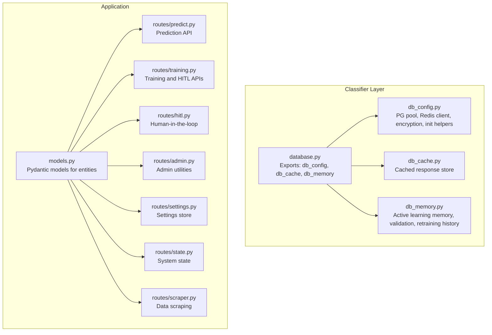
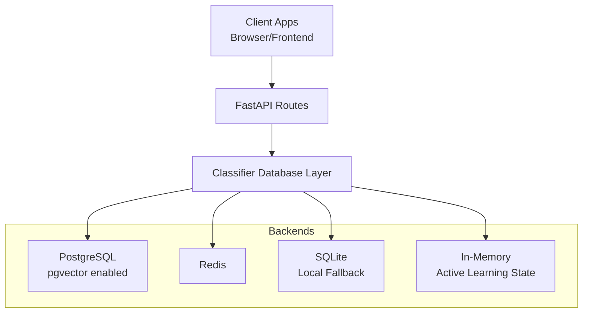
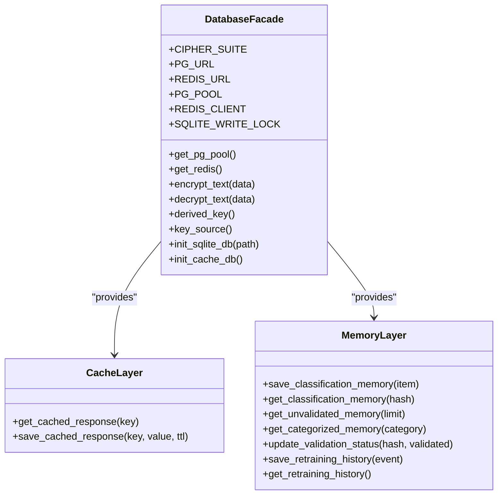
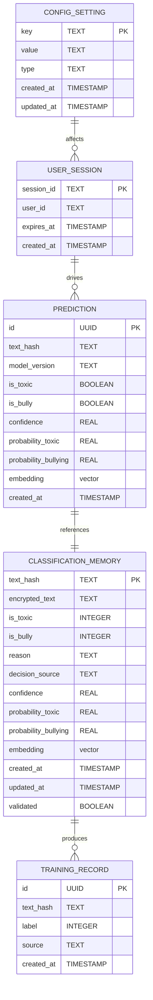
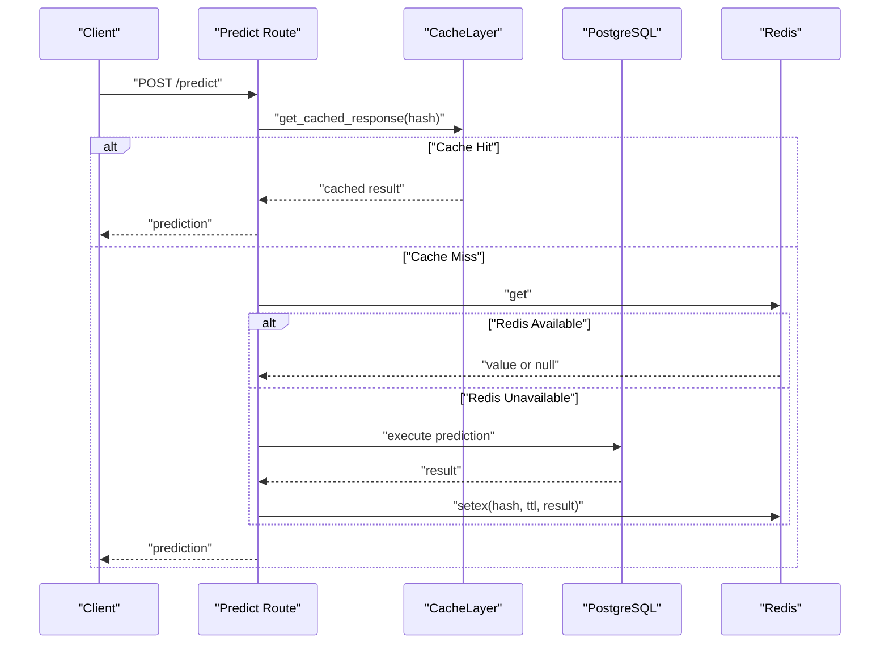
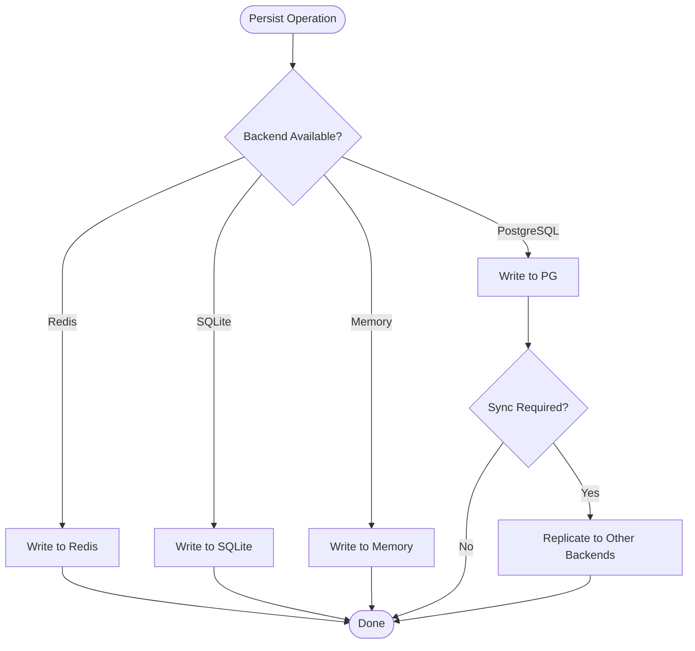
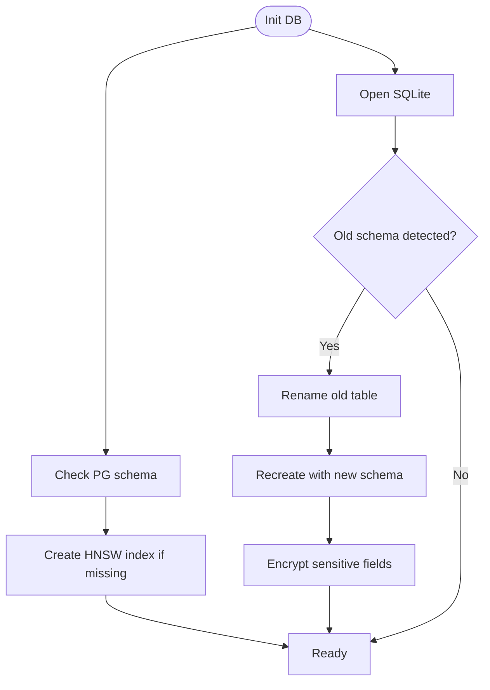
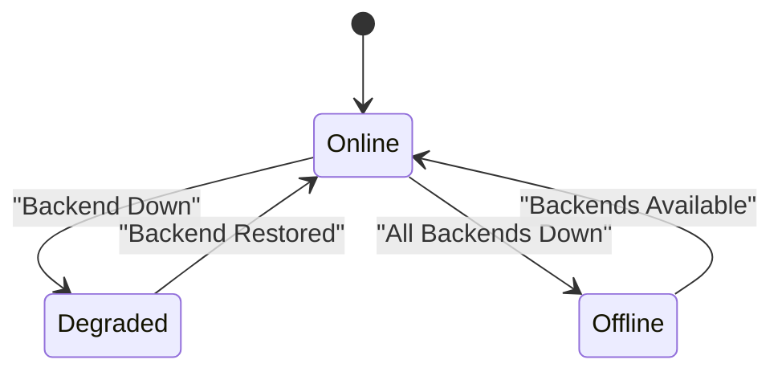
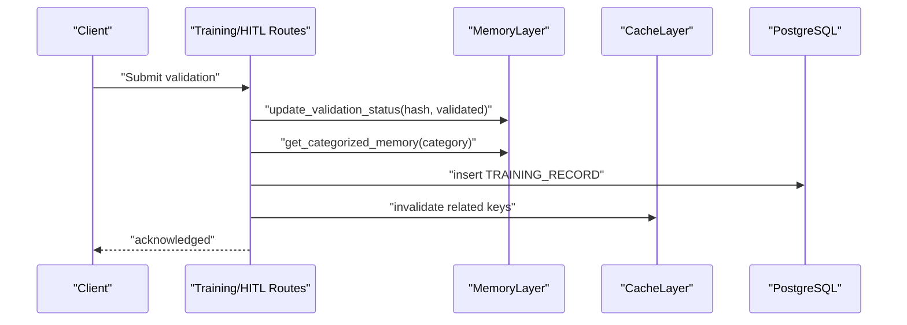
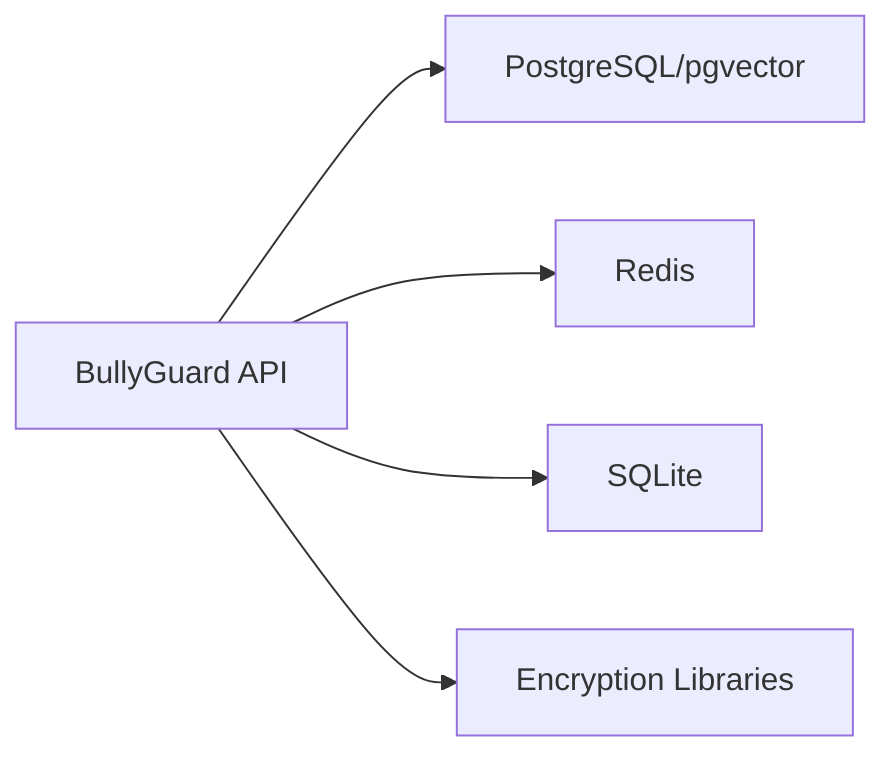

# Database Design

<cite>
**Referenced Files in This Document**
- [database.py](file://cyberbullying_api/classifier/database.py)
- [db_config.py](file://cyberbullying_api/classifier/db_config.py)
- [db_cache.py](file://cyberbullying_api/classifier/db_cache.py)
- [db_memory.py](file://cyberbullying_api/classifier/db_memory.py)
- [models.py](file://cyberbullying_api/models.py)
- [predict.py](file://cyberbullying_api/routes/predict.py)
- [training.py](file://cyberbullying_api/routes/training.py)
- [hitl.py](file://cyberbullying_api/routes/hitl.py)
- [admin.py](file://cyberbullying_api/routes/admin.py)
- [settings.py](file://cyberbullying_api/routes/settings.py)
- [state.py](file://cyberbullying_api/routes/state.py)
- [scraper.py](file://cyberbullying_api/routes/scraper.py)
- [main.py](file://cyberbullying_api/main.py)
- [docker-compose.yml](file://docker-compose.yml)
- [docker-compose.prod.yml](file://docker-compose.prod.yml)
- [requirements.txt](file://cyberbullying_api/requirements.txt)
- [requirements.docker.txt](file://cyberbullying_api/requirements.docker.txt)
- [README.md](file://cyberbullying_api/README.md)
</cite>

## Table of Contents
1. [Introduction](#introduction)
2. [Project Structure](#project-structure)
3. [Core Components](#core-components)
4. [Architecture Overview](#architecture-overview)
5. [Detailed Component Analysis](#detailed-component-analysis)
6. [Dependency Analysis](#dependency-analysis)
7. [Performance Considerations](#performance-considerations)
8. [Troubleshooting Guide](#troubleshooting-guide)
9. [Conclusion](#conclusion)
10. [Appendices](#appendices)

## Introduction
This document describes the database design and multi-backend storage architecture for BullyGuard ID. The system supports:
- PostgreSQL with pgvector for embeddings and advanced similarity search
- Redis for caching and session-like in-memory keys
- SQLite as a local fallback for offline operation
- In-memory storage for transient active learning and validation state

It covers entity models, caching strategies, persistence patterns, schema evolution, migrations, backup/recovery, synchronization, and integration with the machine learning pipeline and active learning workflows.

## Project Structure
The database layer is primarily implemented under the classifier module and integrated via FastAPI routes and models.

**Diagram sources**
- [database.py:1-13](file://cyberbullying_api/classifier/database.py#L1-L13)
- [db_config.py:205-271](file://cyberbullying_api/classifier/db_config.py#L205-L271)
- [db_cache.py](file://cyberbullying_api/classifier/db_cache.py)
- [db_memory.py](file://cyberbullying_api/classifier/db_memory.py)
- [models.py](file://cyberbullying_api/models.py)
- [predict.py](file://cyberbullying_api/routes/predict.py)
- [training.py](file://cyberbullying_api/routes/training.py)
- [hitl.py](file://cyberbullying_api/routes/hitl.py)
- [admin.py](file://cyberbullying_api/routes/admin.py)
- [settings.py](file://cyberbullying_api/routes/settings.py)
- [state.py](file://cyberbullying_api/routes/state.py)
- [scraper.py](file://cyberbullying_api/routes/scraper.py)

**Section sources**
- [database.py:1-13](file://cyberbullying_api/classifier/database.py#L1-L13)
- [db_config.py:205-271](file://cyberbullying_api/classifier/db_config.py#L205-L271)

## Core Components
- Database configuration and clients:
  - PostgreSQL connection pool with pgvector support and HNSW index creation
  - Redis client with soft failure and retry window
  - Encryption/decryption utilities for sensitive data
- Caching layer:
  - Cached prediction responses keyed by input hash
- Memory layer:
  - Classification memory for active learning and validation
  - Retraining history tracking
- Entity models:
  - Pydantic models representing persisted entities and API payloads

Key responsibilities:
- Provide unified access to all backends via centralized exports
- Manage initialization, migrations, and fallback behavior
- Support ML inference caching and active learning workflows

**Section sources**
- [database.py:1-13](file://cyberbullying_api/classifier/database.py#L1-L13)
- [db_config.py:205-271](file://cyberbullying_api/classifier/db_config.py#L205-L271)
- [db_cache.py](file://cyberbullying_api/classifier/db_cache.py)
- [db_memory.py](file://cyberbullying_api/classifier/db_memory.py)
- [models.py](file://cyberbullying_api/models.py)

## Architecture Overview
The system uses a layered approach:
- Application routes consume Pydantic models and call into the classifier layer
- The classifier layer abstracts backend selection and fallback
- PostgreSQL stores structured data and embeddings; Redis caches hot responses; SQLite persists offline; in-memory structures handle transient state

**Diagram sources**
- [predict.py](file://cyberbullying_api/routes/predict.py)
- [training.py](file://cyberbullying_api/routes/training.py)
- [db_config.py:205-271](file://cyberbullying_api/classifier/db_config.py#L205-L271)
- [db_cache.py](file://cyberbullying_api/classifier/db_cache.py)
- [db_memory.py](file://cyberbullying_api/classifier/db_memory.py)

## Detailed Component Analysis

### Database Abstraction Layer
The abstraction layer centralizes backend access and exposes a single interface for consumers.

**Diagram sources**
- [database.py:1-13](file://cyberbullying_api/classifier/database.py#L1-L13)
- [db_config.py:205-271](file://cyberbullying_api/classifier/db_config.py#L205-L271)
- [db_cache.py](file://cyberbullying_api/classifier/db_cache.py)
- [db_memory.py](file://cyberbullying_api/classifier/db_memory.py)

**Section sources**
- [database.py:1-13](file://cyberbullying_api/classifier/database.py#L1-L13)
- [db_config.py:205-271](file://cyberbullying_api/classifier/db_config.py#L205-L271)

### Entity Relationship Models
Core entities are represented by Pydantic models and persisted via the classifier layer.

Notes:
- Embedding fields are stored as vectors for pgvector similarity search
- Validation status enables active learning workflows
- Training records capture human-labeled data for retraining

**Diagram sources**
- [models.py](file://cyberbullying_api/models.py)
- [db_memory.py](file://cyberbullying_api/classifier/db_memory.py)

**Section sources**
- [models.py](file://cyberbullying_api/models.py)
- [db_memory.py](file://cyberbullying_api/classifier/db_memory.py)

### Caching Strategies
- Prediction responses are cached by input hash with TTL
- Redis is used for fast reads; failures trigger soft fallback
- Cache invalidation occurs during retraining events

**Diagram sources**
- [db_cache.py](file://cyberbullying_api/classifier/db_cache.py)
- [db_config.py:222-242](file://cyberbullying_api/classifier/db_config.py#L222-L242)
- [predict.py](file://cyberbullying_api/routes/predict.py)

**Section sources**
- [db_cache.py](file://cyberbullying_api/classifier/db_cache.py)
- [db_config.py:222-242](file://cyberbullying_api/classifier/db_config.py#L222-L242)

### Data Persistence Patterns
- PostgreSQL: primary durable store with pgvector-enabled tables
- Redis: ephemeral cache and quick key-value operations
- SQLite: local fallback for offline scenarios; auto-migrates schema
- In-memory: transient active learning and validation queues

**Diagram sources**
- [db_config.py:205-271](file://cyberbullying_api/classifier/db_config.py#L205-L271)
- [db_memory.py](file://cyberbullying_api/classifier/db_memory.py)

**Section sources**
- [db_config.py:205-271](file://cyberbullying_api/classifier/db_config.py#L205-L271)
- [db_memory.py](file://cyberbullying_api/classifier/db_memory.py)

### Schema Evolution and Migrations
- PostgreSQL: automatic verification and HNSW index creation for embeddings
- SQLite: detects old schema and migrates to encrypted schema with new columns
- Encryption applied to sensitive fields to protect data-at-rest

**Diagram sources**
- [db_config.py:205-271](file://cyberbullying_api/classifier/db_config.py#L205-L271)
- [db_config.py:244-271](file://cyberbullying_api/classifier/db_config.py#L244-L271)

**Section sources**
- [db_config.py:205-271](file://cyberbullying_api/classifier/db_config.py#L205-L271)
- [db_config.py:244-271](file://cyberbullying_api/classifier/db_config.py#L244-L271)

### Backup and Recovery
- PostgreSQL: rely on managed backups and replication; ensure pgvector extensions are included
- Redis: persist to disk via RDB/AOF; monitor persistence settings
- SQLite: file-based backup; maintain versioned snapshots
- In-memory: not persistent; rebuild from durable stores after restart

[No sources needed since this section provides general guidance]

### Offline Operation and Fallback Mechanisms
- Redis unavailability triggers soft failure with retry window
- SQLite provides local persistence when remote backends are down
- In-memory state is ephemeral but can be reconstructed from durable stores

**Diagram sources**
- [db_config.py:222-242](file://cyberbullying_api/classifier/db_config.py#L222-L242)
- [db_config.py:244-271](file://cyberbullying_api/classifier/db_config.py#L244-L271)

**Section sources**
- [db_config.py:222-242](file://cyberbullying_api/classifier/db_config.py#L222-L242)
- [db_config.py:244-271](file://cyberbullying_api/classifier/db_config.py#L244-L271)

### Integration with Machine Learning Pipeline and Active Learning
- Predictions are cached and can drive training data collection
- Validation status and categorization enable human-in-the-loop workflows
- Retraining history tracks model updates and feedback loops

**Diagram sources**
- [hitl.py](file://cyberbullying_api/routes/hitl.py)
- [training.py](file://cyberbullying_api/routes/training.py)
- [db_memory.py](file://cyberbullying_api/classifier/db_memory.py)
- [db_cache.py](file://cyberbullying_api/classifier/db_cache.py)

**Section sources**
- [hitl.py](file://cyberbullying_api/routes/hitl.py)
- [training.py](file://cyberbullying_api/routes/training.py)
- [db_memory.py](file://cyberbullying_api/classifier/db_memory.py)
- [db_cache.py](file://cyberbullying_api/classifier/db_cache.py)

## Dependency Analysis
External dependencies impacting database behavior:
- PostgreSQL/pgvector for vector similarity
- Redis for caching
- SQLite for local fallback
- Encryption libraries for secure storage

**Diagram sources**
- [requirements.txt](file://cyberbullying_api/requirements.txt)
- [requirements.docker.txt](file://cyberbullying_api/requirements.docker.txt)

**Section sources**
- [requirements.txt](file://cyberbullying_api/requirements.txt)
- [requirements.docker.txt](file://cyberbullying_api/requirements.docker.txt)

## Performance Considerations
- Use connection pooling for PostgreSQL to reduce overhead
- Enable Redis persistence and tune eviction policies
- Apply HNSW indexes on vector columns for efficient similarity search
- Cache hot prediction results with appropriate TTL
- Batch writes for training records and memory updates
- Monitor backend health and apply exponential backoff on failures

[No sources needed since this section provides general guidance]

## Troubleshooting Guide
Common issues and resolutions:
- PostgreSQL initialization failures: check credentials and extension availability; verify HNSW index creation logs
- Redis connectivity errors: confirm network reachability and ping response; observe retry windows
- SQLite migration errors: ensure write permissions and sufficient disk space; verify encryption keys
- Cache misses: validate hashing logic and TTL settings; confirm backend availability

**Section sources**
- [db_config.py:205-271](file://cyberbullying_api/classifier/db_config.py#L205-L271)
- [db_config.py:222-242](file://cyberbullying_api/classifier/db_config.py#L222-L242)
- [db_config.py:244-271](file://cyberbullying_api/classifier/db_config.py#L244-L271)

## Conclusion
BullyGuard ID’s database design leverages a robust multi-backend strategy with PostgreSQL/pgvector for analytics and embeddings, Redis for caching, SQLite for offline resilience, and in-memory structures for active learning. The abstraction layer ensures seamless fallback and consistent data access while supporting the ML pipeline and human-in-the-loop workflows.

## Appendices
- Environment and deployment references:
  - Docker Compose configurations define service dependencies and volumes
  - Application README outlines setup and runtime expectations

**Section sources**
- [docker-compose.yml](file://docker-compose.yml)
- [docker-compose.prod.yml](file://docker-compose.prod.yml)
- [README.md](file://cyberbullying_api/README.md)