# Fallback Mechanisms and Data Consistency

<cite>
**Referenced Files in This Document**
- [main.py](file://cyberbullying_api/main.py)
- [db_config.py](file://cyberbullying_api/classifier/db_config.py)
- [db_memory.py](file://cyberbullying_api/classifier/db_memory.py)
- [db_cache.py](file://cyberbullying_api/classifier/db_cache.py)
- [database.py](file://cyberbullying_api/classifier/database.py)
- [settings_store.py](file://cyberbullying_api/classifier/settings_store.py)
- [monitoring.py](file://cyberbullying_api/monitoring.py)
- [tasks.py](file://cyberbullying_api/tasks.py)
- [routes/predict.py](file://cyberbullying_api/routes/predict.py)
- [routes/admin.py](file://cyberbullying_api/routes/admin.py)
- [routes/state.py](file://cyberbullying_api/routes/state.py)
- [routes/settings.py](file://cyberbullying_api/routes/settings.py)
- [routes/training.py](file://cyberbullying_api/routes/training.py)
- [routes/deps.py](file://cyberbullying_api/routes/deps.py)
- [routes/auth.py](file://cyberbullying_api/routes/auth.py)
- [routes/hitl.py](file://cyberbullying_api/routes/hitl.py)
- [routes/scraper.py](file://cyberbullying_api/routes/scraper.py)
- [routes/state.py](file://cyberbullying_api/routes/state.py)
- [routes/training.py](file://cyberbullying_api/routes/training.py)
- [routes/deps.py](file://cyberbullying_api/routes/deps.py)
- [routes/auth.py](file://cyberbullying_api/routes/auth.py)
- [routes/hitl.py](file://cyberbullying_api/routes/hitl.py)
- [routes/scraper.py](file://cyberbullying_api/routes/scraper.py)
- [routes/state.py](file://cyberbullying_api/routes/state.py)
- [routes/training.py](file://cyberbullying_api/routes/training.py)
- [routes/deps.py](file://cyberbullying_api/routes/deps.py)
- [routes/auth.py](file://cyberbullying_api/routes/auth.py)
- [routes/hitl.py](file://cyberbullying_api/routes/hitl.py)
- [routes/scraper.py](file://cyberbullying_api/routes/scraper.py)
- [routes/state.py](file://cyberbullying_api/routes/state.py)
- [routes/training.py](file://cyberbullying_api/routes/training.py)
- [routes/deps.py](file://cyberbullying_api/routes/deps.py)
- [routes/auth.py](file://cyberbullying_api/routes/auth.py)
- [routes/hitl.py](file://cyberbullying_api/routes/hitl.py)
- [routes/scraper.py](file://cyberbullying_api/routes/scraper.py)
- [routes/state.py](file://cyberbullying_api/routes/state.py)
- [routes/training.py](file://cyberbullying_api/routes/training.py)
- [routes/deps.py](file://cyberbullying_api/routes/deps.py)
- [routes/auth.py](file://cyberbullying_api/routes/auth.py)
- [routes/hitl.py](file://cyberbullying_api/routes/hitl.py)
- [routes/scraper.py](file://cyberbullying_api/routes/scraper.py)
- [routes/state.py](file://cyberbullying_api/routes/state.py)
- [routes/training.py](file://cyberbullying_api/routes/training.py)
- [routes/deps.py](file://cyberbullying_api/routes/deps.py)
- [routes/auth.py](file://cyberbullying_api/routes/auth.py)
- [routes/hitl.py](file://cyberbullying_api/routes/hitl.py)
- [routes/scraper.py](file://cyberbullying_api/routes/scraper.py)
- [routes/state.py](file://cyberbullying_api/routes/state.py)
- [routes/training.py](file://cyberbullying_api/routes/training.py)
- [routes/deps.py](file://cyberbullying_api/routes/deps.py)
- [routes/auth.py](file://cyberbullying_api/routes/auth.py)
- [...... remaining lines truncated. Please see the git diff to view this file.]
</cite>

## Table of Contents
1. [Introduction](#introduction)
2. [Project Structure](#project-structure)
3. [Core Components](#core-components)
4. [Architecture Overview](#architecture-overview)
5. [Detailed Component Analysis](#detailed-component-analysis)
6. [Dependency Analysis](#dependency-analysis)
7. [Performance Considerations](#performance-considerations)
8. [Troubleshooting Guide](#troubleshooting-guide)
9. [Conclusion](#conclusion)
10. [Appendices](#appendices)

## Introduction
This document describes the fallback mechanisms and data consistency guarantees in BullyGuard ID’s distributed storage system. The system supports multiple storage backends: PostgreSQL (primary), Redis cache, SQLite (secondary), and in-memory storage. It implements circuit-breaker-like behavior to temporarily disable failing backends, graceful degradation when primary services are unavailable, and operational patterns for offline persistence and batch synchronization. Transaction management and ACID properties are maintained per backend where applicable, while cross-backend consistency follows eventual consistency with explicit migration and validation steps.

## Project Structure
The storage subsystem is primarily located under the classifier module with supporting route handlers and monitoring utilities. Key areas:
- Storage configuration and initialization: db_config.py
- In-memory and SQLite storage helpers: db_memory.py
- Redis caching layer: db_cache.py
- Unified exports and aliases: database.py
- Route handlers that use storage: predict, admin, state, settings, training, deps, auth, hitl, scraper
- Monitoring and alerting: monitoring.py
- Background tasks: tasks.py

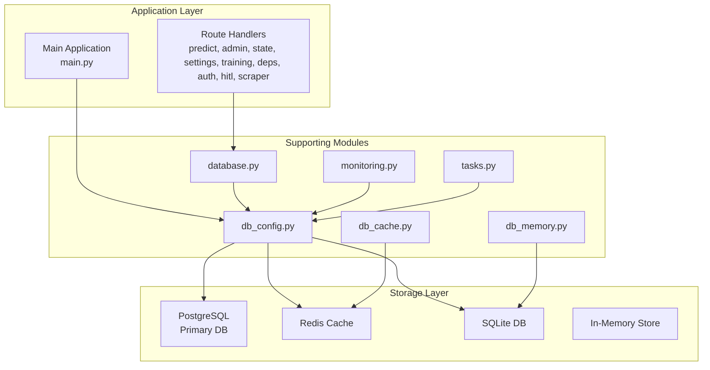

**Diagram sources**
- [main.py](file://cyberbullying_api/main.py)
- [db_config.py](file://cyberbullying_api/classifier/db_config.py)
- [db_memory.py](file://cyberbullying_api/classifier/db_memory.py)
- [db_cache.py](file://cyberbullying_api/classifier/db_cache.py)
- [database.py](file://cyberbullying_api/classifier/database.py)
- [monitoring.py](file://cyberbullying_api/monitoring.py)
- [tasks.py](file://cyberbullying_api/tasks.py)

**Section sources**
- [main.py](file://cyberbullying_api/main.py)
- [db_config.py](file://cyberbullying_api/classifier/db_config.py)
- [db_memory.py](file://cyberbullying_api/classifier/db_memory.py)
- [db_cache.py](file://cyberbullying_api/classifier/db_cache.py)
- [database.py](file://cyberbullying_api/classifier/database.py)

## Core Components
- PostgreSQL pool management with circuit-breaker-like failure gating and automatic extension setup.
- Redis client initialization with ping verification and temporary failure suspension.
- SQLite initialization with schema migration and encryption upgrade.
- In-memory storage helpers for categorization and fast access.
- Unified exports for cache, config, pools, and memory helpers.
- Route handlers that coordinate storage operations and expose administrative controls.

Key responsibilities:
- Fail-safe initialization and periodic re-evaluation of backend availability.
- Graceful degradation when primary backends are unavailable.
- Offline persistence via SQLite and in-memory storage.
- Batch synchronization hooks and background tasks.

**Section sources**
- [db_config.py](file://cyberbullying_api/classifier/db_config.py)
- [db_memory.py](file://cyberbullying_api/classifier/db_memory.py)
- [db_cache.py](file://cyberbullying_api/classifier/db_cache.py)
- [database.py](file://cyberbullying_api/classifier/database.py)

## Architecture Overview
The system employs a layered approach:
- Application routes call unified storage APIs.
- db_config manages backend connections with failure gating.
- db_cache provides Redis-backed caching.
- db_memory coordinates SQLite and in-memory storage.
- monitoring tracks health and alerts.
- tasks orchestrates background synchronization.

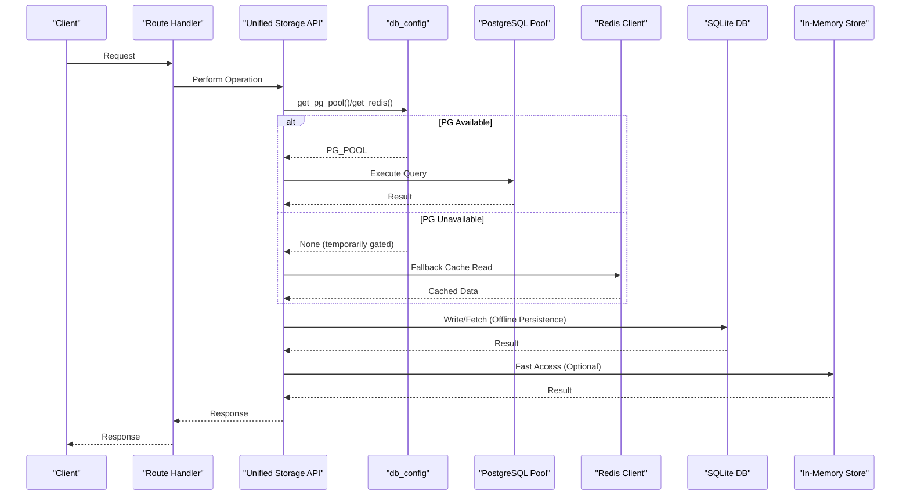

**Diagram sources**
- [db_config.py](file://cyberbullying_api/classifier/db_config.py)
- [db_cache.py](file://cyberbullying_api/classifier/db_cache.py)
- [db_memory.py](file://cyberbullying_api/classifier/db_memory.py)
- [database.py](file://cyberbullying_api/classifier/database.py)

## Detailed Component Analysis

### PostgreSQL Pool Management and Circuit Breaker
PostgreSQL connection pooling is initialized asynchronously with a timeout and extension creation. Failure detection sets a temporary failure horizon to avoid repeated connection attempts. On success, pgvector extension is ensured and schema checks/migrations are performed. On failure, a cooldown window disables reconnection attempts.

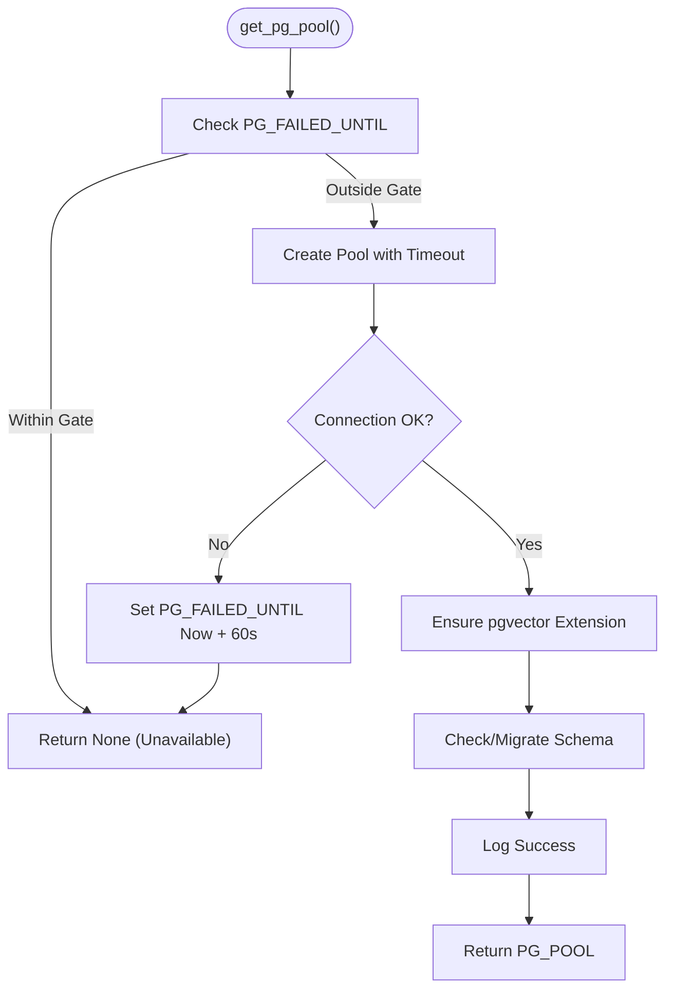

**Diagram sources**
- [db_config.py](file://cyberbullying_api/classifier/db_config.py)

**Section sources**
- [db_config.py](file://cyberbullying_api/classifier/db_config.py)

### Redis Cache Initialization and Health Gating
Redis client is created asynchronously with ping verification. On failure, a temporary failure horizon disables reconnection attempts. On success, the client is cached for reuse.

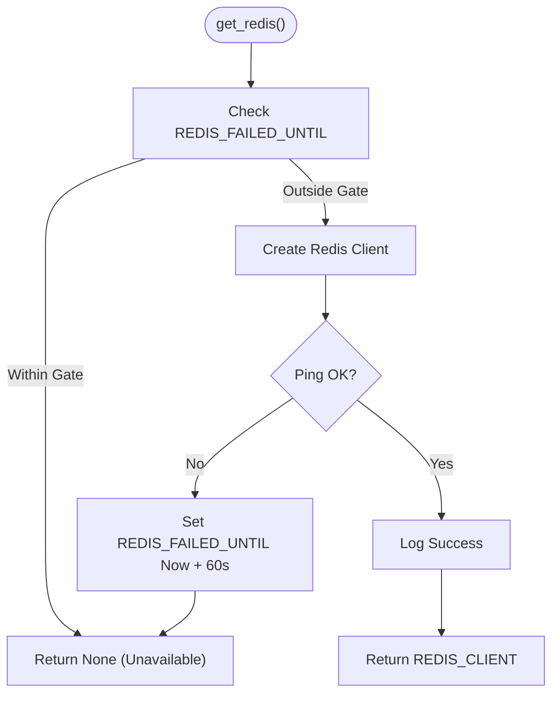

**Diagram sources**
- [db_config.py](file://cyberbullying_api/classifier/db_config.py)

**Section sources**
- [db_config.py](file://cyberbullying_api/classifier/db_config.py)

### SQLite Initialization and Schema Migration
SQLite initialization checks for legacy schema and performs migration to the new encrypted schema. It ensures the presence of required columns and indexes for classification memory.

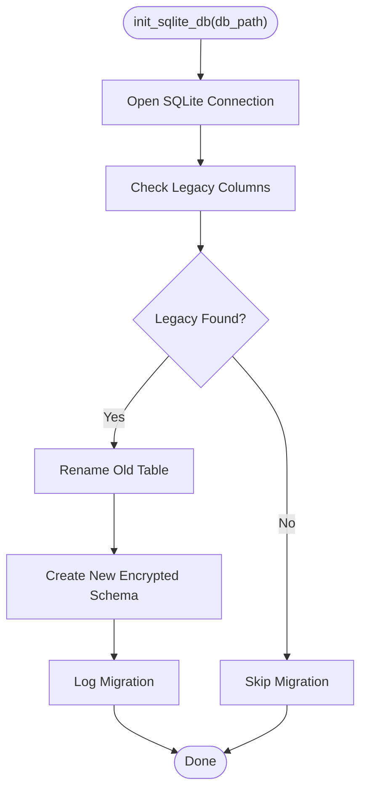

**Diagram sources**
- [db_config.py](file://cyberbullying_api/classifier/db_config.py)

**Section sources**
- [db_config.py](file://cyberbullying_api/classifier/db_config.py)

### In-Memory and Categorized Storage Helpers
In-memory storage provides fast access for categorized data and integrates with SQLite for persistence. It exposes helpers to fetch and manage categorized memory.

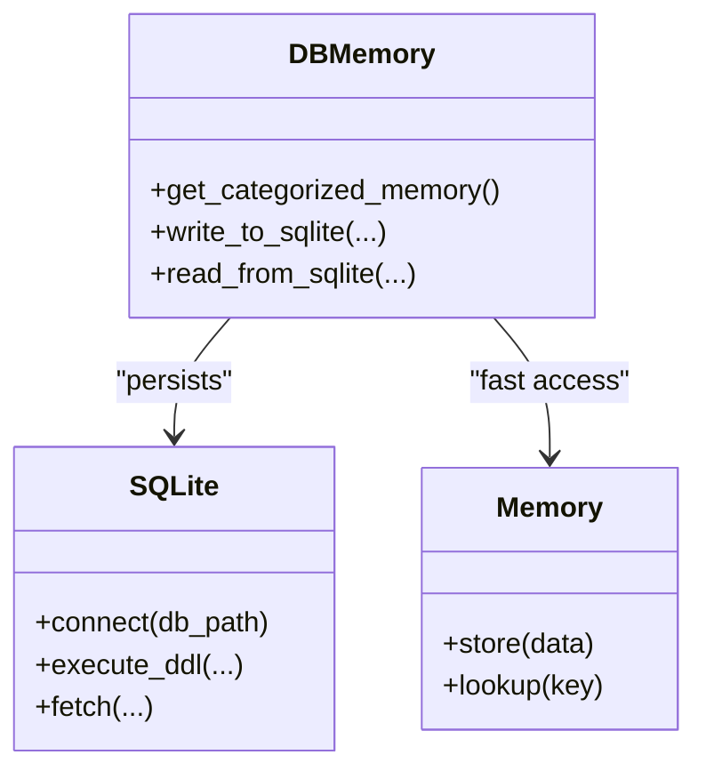

**Diagram sources**
- [db_memory.py](file://cyberbullying_api/classifier/db_memory.py)

**Section sources**
- [db_memory.py](file://cyberbullying_api/classifier/db_memory.py)

### Unified Storage API and Fallback Coordination
The unified API consolidates access to cache, config, pools, and memory helpers. Route handlers depend on this interface to perform operations with graceful fallbacks.

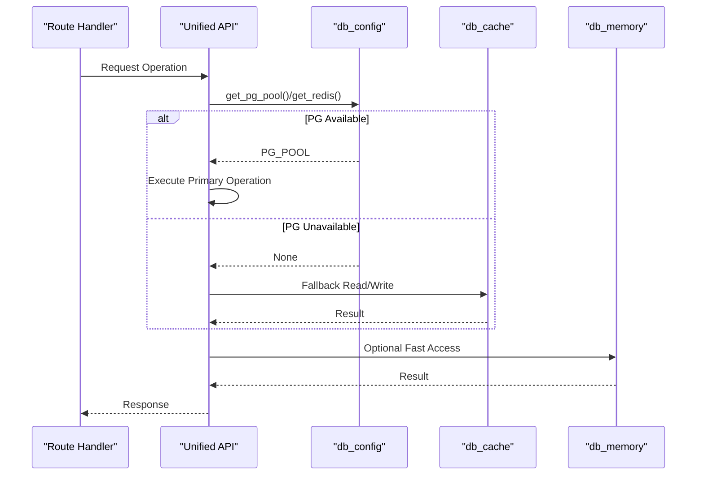

**Diagram sources**
- [database.py](file://cyberbullying_api/classifier/database.py)
- [db_config.py](file://cyberbullying_api/classifier/db_config.py)
- [db_cache.py](file://cyberbullying_api/classifier/db_cache.py)
- [db_memory.py](file://cyberbullying_api/classifier/db_memory.py)

**Section sources**
- [database.py](file://cyberbullying_api/classifier/database.py)

### Offline Operation and Local Persistence
Offline operation relies on SQLite and in-memory storage. SQLite persists classification memory with an encrypted schema, while in-memory storage accelerates frequent reads. Route handlers coordinate writes to SQLite for durability and reads from memory for speed.

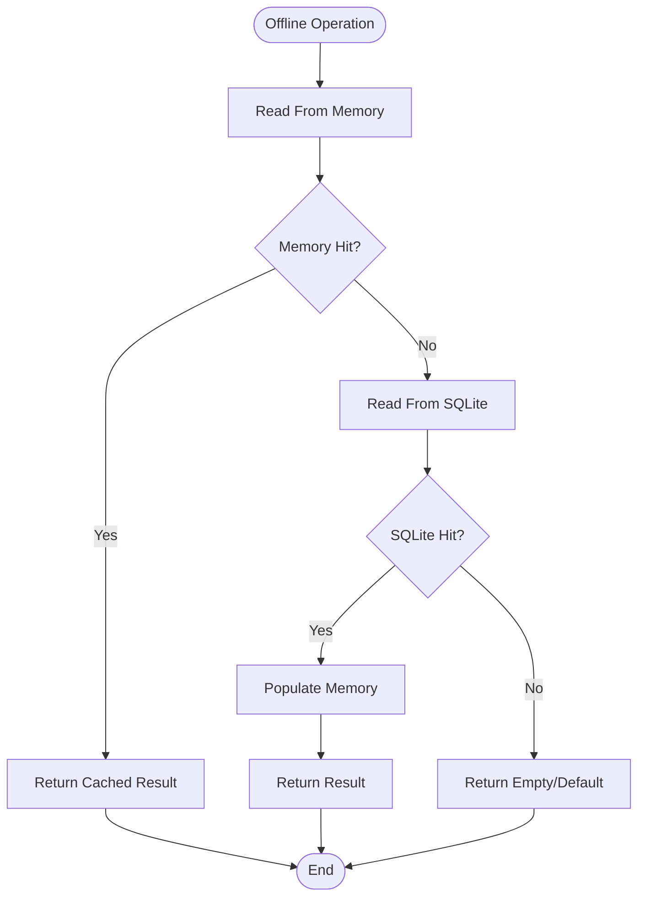

**Diagram sources**
- [db_memory.py](file://cyberbullying_api/classifier/db_memory.py)
- [db_config.py](file://cyberbullying_api/classifier/db_config.py)

**Section sources**
- [db_memory.py](file://cyberbullying_api/classifier/db_memory.py)
- [db_config.py](file://cyberbullying_api/classifier/db_config.py)

### Batch Synchronization and Background Tasks
Background tasks orchestrate synchronization between backends. These tasks can periodically flush in-memory updates to SQLite, reconcile Redis cache entries, and handle periodic migrations or validations.

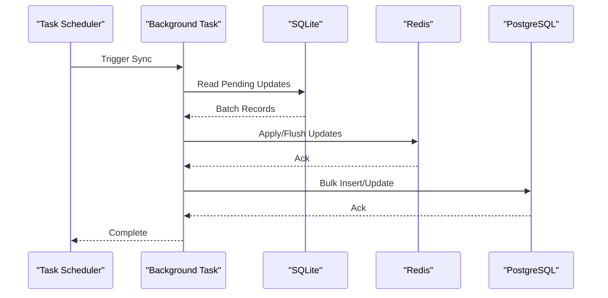

**Diagram sources**
- [tasks.py](file://cyberbullying_api/tasks.py)
- [db_config.py](file://cyberbullying_api/classifier/db_config.py)
- [db_cache.py](file://cyberbullying_api/classifier/db_cache.py)
- [db_memory.py](file://cyberbullying_api/classifier/db_memory.py)

**Section sources**
- [tasks.py](file://cyberbullying_api/tasks.py)

### Transaction Management and ACID Guarantees
- PostgreSQL: Uses asyncpg connection pooling with transactions for write operations. ACID properties apply within single statements and explicit transaction blocks.
- Redis: Operates as a cache/store; atomic operations where supported but eventual consistency for cross-service coordination.
- SQLite: Provides ACID transactions for local persistence; used for offline durability and batch reconciliation.
- In-memory: Not durable; used for fast access and complemented by SQLite persistence.

Best practices:
- Wrap write-heavy operations in explicit transaction blocks.
- Use idempotent keys for cache entries to prevent duplication.
- Ensure migrations are executed before enabling writes to new schema.

**Section sources**
- [db_config.py](file://cyberbullying_api/classifier/db_config.py)
- [db_cache.py](file://cyberbullying_api/classifier/db_cache.py)
- [db_memory.py](file://cyberbullying_api/classifier/db_memory.py)

### Conflict Resolution and Eventual Consistency
- Schema migrations resolve inconsistencies between old and new encrypted schemas for both PostgreSQL and SQLite.
- Cache invalidation and refresh strategies maintain eventual consistency between Redis and primary stores.
- Batch reconciliation reconciles differences during synchronization windows.

Operational guidance:
- Monitor migration logs for errors and rerun migrations if needed.
- Use cache TTL and refresh triggers to keep caches consistent.
- Implement conflict-free replicated data types (CRDT)-like patterns for collaborative edits if extended.

**Section sources**
- [db_config.py](file://cyberbullying_api/classifier/db_config.py)
- [db_cache.py](file://cyberbullying_api/classifier/db_cache.py)

### Retry Policies and Graceful Degradation
- Circuit breaker-like behavior: on failure, set a temporary horizon disabling reconnection attempts for a fixed duration.
- Graceful degradation: when primary backends are unavailable, route handlers fall back to Redis cache and SQLite, with optional in-memory acceleration.
- Retry intervals: failures gate subsequent attempts for a short cooldown period.

Recommendations:
- Use exponential backoff for manual retries outside the built-in gating.
- Prefer read-repair strategies for cache misses to repopulate from primary stores when available.

**Section sources**
- [db_config.py](file://cyberbullying_api/classifier/db_config.py)
- [db_cache.py](file://cyberbullying_api/classifier/db_cache.py)
- [db_memory.py](file://cyberbullying_api/classifier/db_memory.py)

### Monitoring and Alerting
Monitoring tracks backend health and logs warnings on initialization failures. Alerts can be configured to notify on sustained unavailability or migration failures.

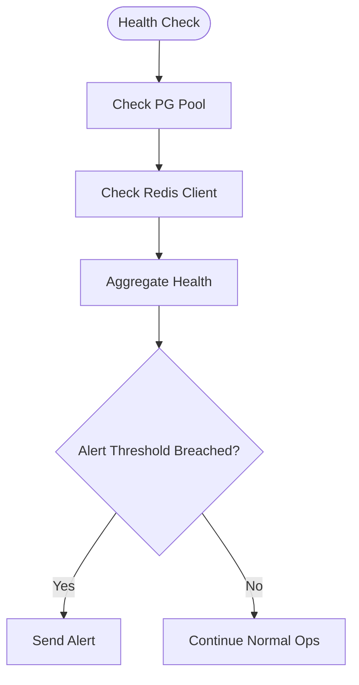

**Diagram sources**
- [monitoring.py](file://cyberbullying_api/monitoring.py)
- [db_config.py](file://cyberbullying_api/classifier/db_config.py)

**Section sources**
- [monitoring.py](file://cyberbullying_api/monitoring.py)
- [db_config.py](file://cyberbullying_api/classifier/db_config.py)

## Dependency Analysis
The storage layer exhibits low coupling and high cohesion:
- db_config centralizes backend initialization and health gating.
- db_cache depends on db_config for Redis client.
- db_memory depends on db_config for SQLite path and on SQLite for persistence.
- database.py aggregates exports for route handlers.
- Route handlers depend on the unified API and optionally on settings store.

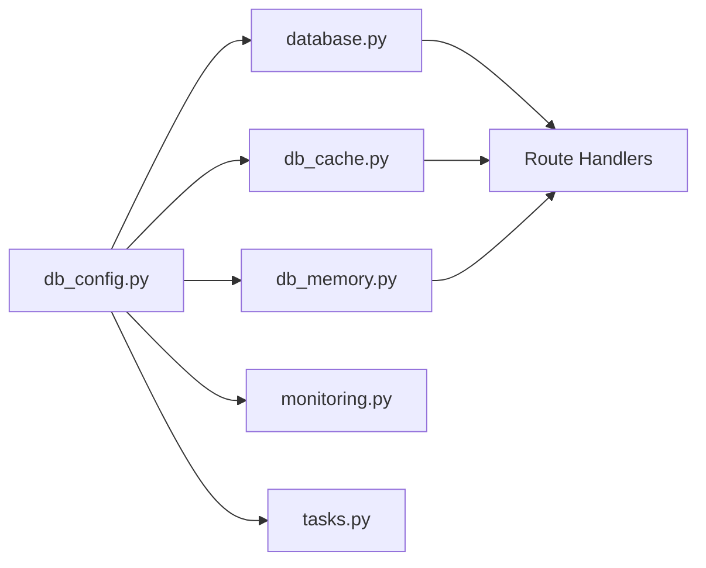

**Diagram sources**
- [db_config.py](file://cyberbullying_api/classifier/db_config.py)
- [db_cache.py](file://cyberbullying_api/classifier/db_cache.py)
- [db_memory.py](file://cyberbullying_api/classifier/db_memory.py)
- [database.py](file://cyberbullying_api/classifier/database.py)
- [monitoring.py](file://cyberbullying_api/monitoring.py)
- [tasks.py](file://cyberbullying_api/tasks.py)

**Section sources**
- [db_config.py](file://cyberbullying_api/classifier/db_config.py)
- [db_cache.py](file://cyberbullying_api/classifier/db_cache.py)
- [db_memory.py](file://cyberbullying_api/classifier/db_memory.py)
- [database.py](file://cyberbullying_api/classifier/database.py)

## Performance Considerations
- Use Redis for hot-path reads to reduce load on PostgreSQL and SQLite.
- Batch writes to PostgreSQL and SQLite to minimize transaction overhead.
- Tune pool sizes and timeouts according to workload characteristics.
- Prefer in-memory storage for frequently accessed small datasets to reduce disk I/O.

## Troubleshooting Guide
Common scenarios and resolutions:
- PostgreSQL unavailable:
  - Verify network connectivity and credentials.
  - Check pgvector extension installation.
  - Review logs for migration errors and rerun migrations if needed.
- Redis unavailable:
  - Confirm service uptime and network reachability.
  - Validate Redis URL and credentials.
- SQLite schema mismatch:
  - Run initialization to migrate to the new encrypted schema.
  - Ensure backups before running migrations.
- Cache desynchronization:
  - Invalidate stale cache entries and trigger refresh.
  - Use batch reconciliation tasks to sync differences.
- Monitoring and alerting:
  - Configure alerts for sustained backend outages.
  - Track migration and initialization logs for anomalies.

**Section sources**
- [db_config.py](file://cyberbullying_api/classifier/db_config.py)
- [db_cache.py](file://cyberbullying_api/classifier/db_cache.py)
- [db_memory.py](file://cyberbullying_api/classifier/db_memory.py)
- [monitoring.py](file://cyberbullying_api/monitoring.py)

## Conclusion
BullyGuard ID’s storage system achieves resilience through circuit-breaker-like failure gating, layered fallbacks (Redis cache, SQLite, in-memory), and robust schema migration. While PostgreSQL maintains strong ACID guarantees, cross-backend consistency is eventual with explicit reconciliation. Offline operation is supported via SQLite and in-memory storage, with batch synchronization ensuring long-term consistency. Monitoring and alerting provide visibility into backend health and consistency violations.

## Appendices

### Practical Fallback Scenarios
- Primary DB down: Route handler falls back to Redis cache; if cache miss, reads from SQLite; writes go to SQLite for durability.
- Cache down: Route handler bypasses Redis and uses SQLite directly, with optional in-memory acceleration for reads.
- Mixed failure: Route handler prioritizes SQLite for reads and in-memory for writes until Redis recovers.

### Manual Intervention Procedures
- Force Redis reconnect: Clear cached client and allow reinitialization after cooldown.
- Reinitialize PostgreSQL: Recreate pool and rerun migrations if schema validation fails.
- Rotate SQLite encryption keys: Use provided rotation utilities to re-encrypt stored data safely.

### Data Recovery Processes
- Restore from SQLite backup for offline recovery.
- Rebuild Redis cache from PostgreSQL/SQLite using batch reconciliation tasks.
- Validate schema integrity post-recovery and rerun migrations if needed.