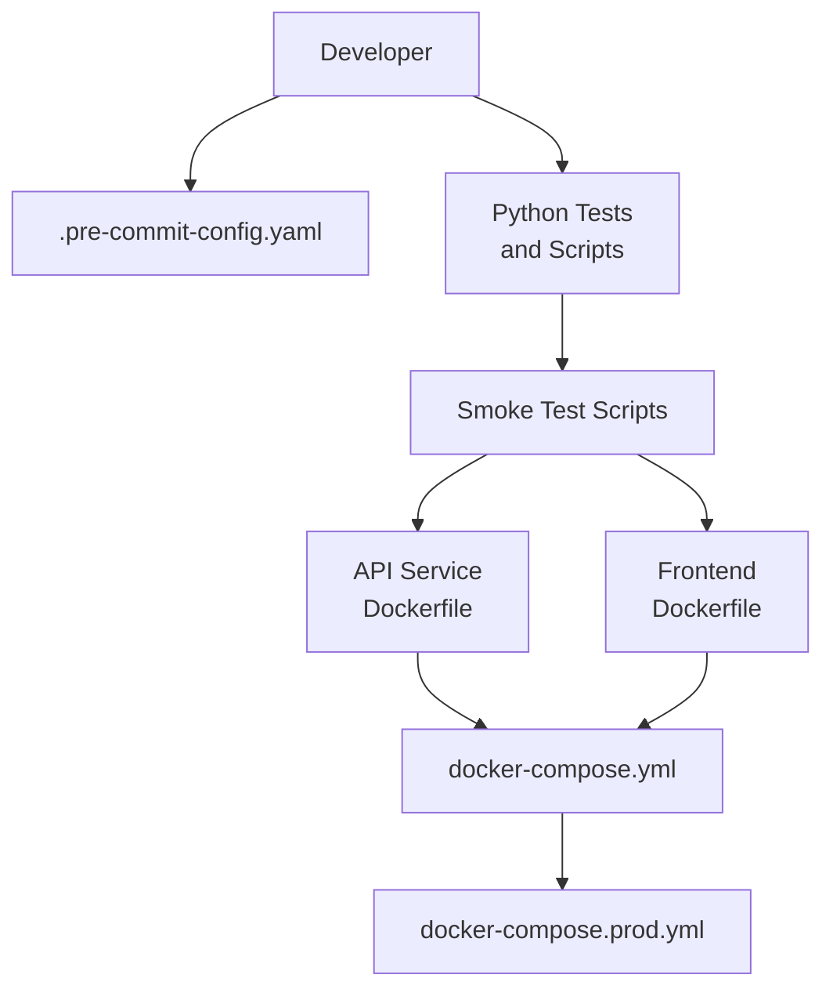
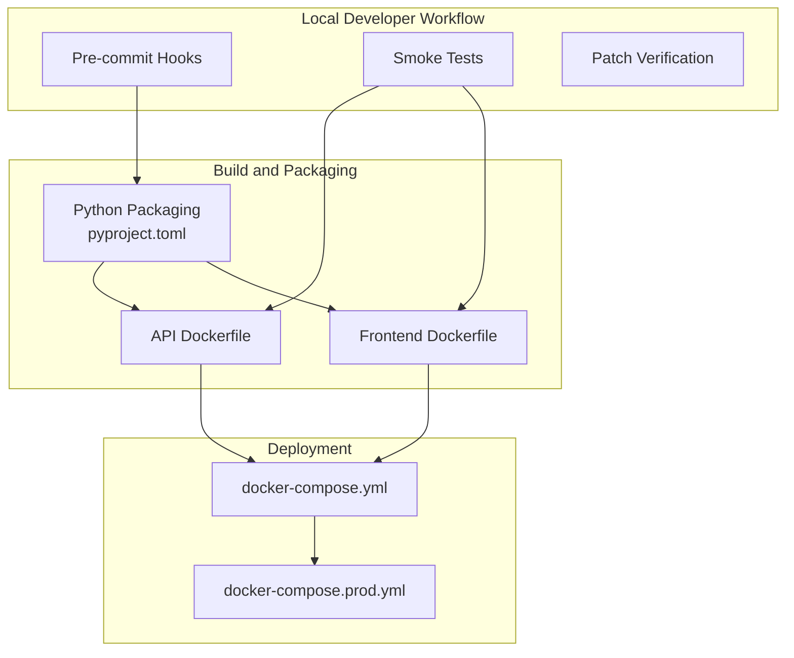
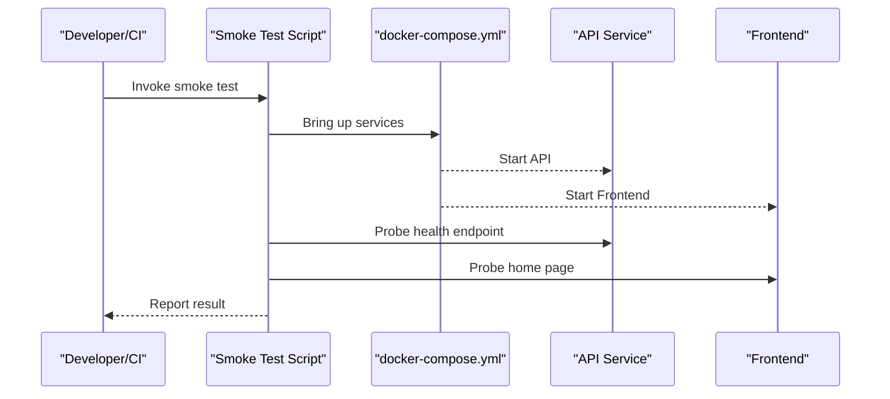
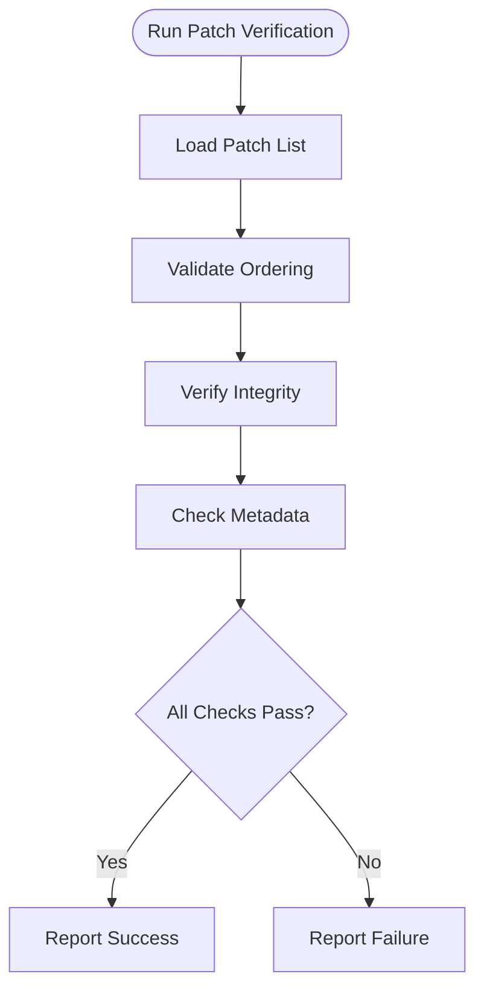
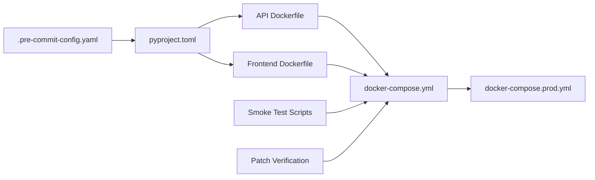

# CI/CD and Automation

<cite>
**Referenced Files in This Document**
- [.pre-commit-config.yaml](file://.pre-commit-config.yaml)
- [pyproject.toml](file://pyproject.toml)
- [scripts/smoke_test_api.sh](file://scripts/smoke_test_api.sh)
- [scripts/smoke_test_api.ps1](file://scripts/smoke_test_api.ps1)
- [scripts/verify_patch_files.sh](file://scripts/verify_patch_files.sh)
- [docker-compose.yml](file://docker-compose.yml)
- [docker-compose.prod.yml](file://docker-compose.prod.yml)
- [cyberbullying_api/Dockerfile](file://cyberbullying_api/Dockerfile)
- [frontend/Dockerfile](file://frontend/Dockerfile)
- [docs/APPLY_PATCH_ORDER.md](file://docs/APPLY_PATCH_ORDER.md)
- [docs/FINAL_TESTING_CHECKLIST.md](file://docs/FINAL_TESTING_CHECKLIST.md)
- [docs/RELEASE_NOTES_TEMPLATE.md](file://docs/RELEASE_NOTES_TEMPLATE.md)
- [docs/ROLLBACK_PLAN.md](file://docs/ROLLBACK_PLAN.md)
- [docs/PRODUCTION_CHECKLIST.md](file://docs/PRODUCTION_CHECKLIST.md)
- [docs/SECURITY_HARDENING.md](file://docs/SECURITY_HARDENING.md)
- [CONTRIBUTING.md](file://CONTRIBUTING.md)
- [SECURITY.md](file://SECURITY.md)
</cite>

## Table of Contents
1. [Introduction](#introduction)
2. [Project Structure](#project-structure)
3. [Core Components](#core-components)
4. [Architecture Overview](#architecture-overview)
5. [Detailed Component Analysis](#detailed-component-analysis)
6. [Dependency Analysis](#dependency-analysis)
7. [Performance Considerations](#performance-considerations)
8. [Troubleshooting Guide](#troubleshooting-guide)
9. [Conclusion](#conclusion)
10. [Appendices](#appendices)

## Introduction
This document describes the CI/CD and automation practices for BullyGuard ID’s development workflow. It consolidates existing automation artifacts present in the repository and provides actionable guidance for establishing robust continuous integration, automated testing, security scanning, dependency maintenance, and deployment processes. Where explicit GitHub Actions workflows are not present, this document outlines recommended configurations and best practices aligned with the repository’s existing scripts and Dockerized services.

## Project Structure
The repository includes:
- Pre-commit configuration for local quality gates
- Python packaging and linting configuration
- Smoke testing scripts for API health checks
- Patch verification script for change validation
- Docker Compose configurations for local and production environments
- Dockerfiles for backend and frontend services
- Operational and security documentation supporting release and rollback procedures

**Section sources**
- [.pre-commit-config.yaml](file://.pre-commit-config.yaml)
- [pyproject.toml](file://pyproject.toml)
- [scripts/smoke_test_api.sh](file://scripts/smoke_test_api.sh)
- [scripts/smoke_test_api.ps1](file://scripts/smoke_test_api.ps1)
- [scripts/verify_patch_files.sh](file://scripts/verify_patch_files.sh)
- [docker-compose.yml](file://docker-compose.yml)
- [docker-compose.prod.yml](file://docker-compose.prod.yml)
- [cyberbullying_api/Dockerfile](file://cyberbullying_api/Dockerfile)
- [frontend/Dockerfile](file://frontend/Dockerfile)

## Core Components
- Pre-commit hooks: Enforce code quality and security checks locally before commits.
- Python packaging and linting: Centralized configuration for formatting and static analysis.
- Smoke testing: Cross-platform scripts to validate API availability and basic functionality.
- Patch verification: Script to validate applied patches and related metadata.
- Containerization: Dockerfiles and Docker Compose configurations for local and production deployments.
- Release and rollback documentation: Operational playbooks for releases and incident response.

**Section sources**
- [.pre-commit-config.yaml](file://.pre-commit-config.yaml)
- [pyproject.toml](file://pyproject.toml)
- [scripts/smoke_test_api.sh](file://scripts/smoke_test_api.sh)
- [scripts/smoke_test_api.ps1](file://scripts/smoke_test_api.ps1)
- [scripts/verify_patch_files.sh](file://scripts/verify_patch_files.sh)
- [docker-compose.yml](file://docker-compose.yml)
- [docker-compose.prod.yml](file://docker-compose.prod.yml)
- [cyberbullying_api/Dockerfile](file://cyberbullying_api/Dockerfile)
- [frontend/Dockerfile](file://frontend/Dockerfile)
- [docs/RELEASE_NOTES_TEMPLATE.md](file://docs/RELEASE_NOTES_TEMPLATE.md)
- [docs/ROLLBACK_PLAN.md](file://docs/ROLLBACK_PLAN.md)
- [docs/PRODUCTION_CHECKLIST.md](file://docs/PRODUCTION_CHECKLIST.md)
- [docs/SECURITY_HARDENING.md](file://docs/SECURITY_HARDENING.md)

## Architecture Overview
The CI/CD architecture integrates local developer workflows with optional remote orchestration. Developers run pre-commit hooks and smoke tests locally. Packaging and containerization artifacts support reproducible builds and deployments across environments.

**Diagram sources**
- [.pre-commit-config.yaml](file://.pre-commit-config.yaml)
- [pyproject.toml](file://pyproject.toml)
- [scripts/smoke_test_api.sh](file://scripts/smoke_test_api.sh)
- [scripts/smoke_test_api.ps1](file://scripts/smoke_test_api.ps1)
- [scripts/verify_patch_files.sh](file://scripts/verify_patch_files.sh)
- [docker-compose.yml](file://docker-compose.yml)
- [docker-compose.prod.yml](file://docker-compose.prod.yml)
- [cyberbullying_api/Dockerfile](file://cyberbullying_api/Dockerfile)
- [frontend/Dockerfile](file://frontend/Dockerfile)

## Detailed Component Analysis

### Pre-commit Hooks
Purpose:
- Enforce formatting and linting standards prior to committing.
- Reduce downstream CI load by catching issues early.

Key behaviors:
- Run configured hooks on staged files.
- Integrate with Python formatting and linting tools.

Operational notes:
- Install hooks locally to align with repository expectations.
- Hooks are not tied to a specific CI provider; they can be executed in any CI environment.

**Section sources**
- [.pre-commit-config.yaml](file://.pre-commit-config.yaml)

### Python Packaging and Linting
Purpose:
- Define project metadata, dependencies, and linting/formatter rules.
- Centralize configuration for maintainability.

Key behaviors:
- Formatting and linting rules are centralized.
- Dependencies and tooling versions are declared here.

Recommendations:
- Keep dependency versions pinned in lockfiles for reproducibility.
- Align CI with these rules to avoid drift.

**Section sources**
- [pyproject.toml](file://pyproject.toml)

### Smoke Testing Automation
Purpose:
- Validate service availability and basic functionality after local or CI builds.
- Provide cross-platform coverage with shell and PowerShell scripts.

Scripts:
- Shell script for Unix-like systems.
- PowerShell script for Windows.

Typical flow:
- Start services via Docker Compose.
- Poll endpoints until healthy.
- Report pass/fail status.

**Diagram sources**
- [scripts/smoke_test_api.sh](file://scripts/smoke_test_api.sh)
- [scripts/smoke_test_api.ps1](file://scripts/smoke_test_api.ps1)
- [docker-compose.yml](file://docker-compose.yml)

**Section sources**
- [scripts/smoke_test_api.sh](file://scripts/smoke_test_api.sh)
- [scripts/smoke_test_api.ps1](file://scripts/smoke_test_api.ps1)
- [docker-compose.yml](file://docker-compose.yml)

### Patch Verification Script
Purpose:
- Verify applied patches and related metadata to prevent regressions.
- Support controlled change management.

Typical flow:
- Validate patch files and checksums.
- Confirm ordering and prerequisites per documented procedure.

**Diagram sources**
- [scripts/verify_patch_files.sh](file://scripts/verify_patch_files.sh)
- [docs/APPLY_PATCH_ORDER.md](file://docs/APPLY_PATCH_ORDER.md)

**Section sources**
- [scripts/verify_patch_files.sh](file://scripts/verify_patch_files.sh)
- [docs/APPLY_PATCH_ORDER.md](file://docs/APPLY_PATCH_ORDER.md)

### Containerization and Deployment
Purpose:
- Provide reproducible builds and consistent runtime environments.
- Enable local development and production deployments.

Artifacts:
- Backend Dockerfile for the API service.
- Frontend Dockerfile for the web client.
- Local compose for development.
- Production compose for deployment.

Guidelines:
- Tag images consistently for traceability.
- Use separate compose files for dev and prod to isolate configuration.
- Store secrets via environment variables or secret managers.

**Section sources**
- [cyberbullying_api/Dockerfile](file://cyberbullying_api/Dockerfile)
- [frontend/Dockerfile](file://frontend/Dockerfile)
- [docker-compose.yml](file://docker-compose.yml)
- [docker-compose.prod.yml](file://docker-compose.prod.yml)

### Security Hardening and Vulnerability Management
Purpose:
- Maintain secure configurations and assess risks.
- Provide guidance for hardening and responsible disclosure.

Recommendations:
- Integrate automated dependency scanning in CI.
- Apply least privilege and network segmentation.
- Monitor and remediate vulnerabilities promptly.

**Section sources**
- [docs/SECURITY_HARDENING.md](file://docs/SECURITY_HARDENING.md)
- [SECURITY.md](file://SECURITY.md)

### Release Management and Rollback Procedures
Purpose:
- Standardize release notes, approvals, and rollback actions.
- Ensure predictable and safe deployments.

Artifacts:
- Release notes template for documenting changes.
- Rollback plan for emergency restoration.
- Production checklist for operational readiness.

**Section sources**
- [docs/RELEASE_NOTES_TEMPLATE.md](file://docs/RELEASE_NOTES_TEMPLATE.md)
- [docs/ROLLBACK_PLAN.md](file://docs/ROLLBACK_PLAN.md)
- [docs/PRODUCTION_CHECKLIST.md](file://docs/PRODUCTION_CHECKLIST.md)

## Dependency Analysis
This section maps how automation components relate to each other and to the broader system.

**Diagram sources**
- [.pre-commit-config.yaml](file://.pre-commit-config.yaml)
- [pyproject.toml](file://pyproject.toml)
- [scripts/smoke_test_api.sh](file://scripts/smoke_test_api.sh)
- [scripts/smoke_test_api.ps1](file://scripts/smoke_test_api.ps1)
- [scripts/verify_patch_files.sh](file://scripts/verify_patch_files.sh)
- [docker-compose.yml](file://docker-compose.yml)
- [docker-compose.prod.yml](file://docker-compose.prod.yml)
- [cyberbullying_api/Dockerfile](file://cyberbullying_api/Dockerfile)
- [frontend/Dockerfile](file://frontend/Dockerfile)

**Section sources**
- [.pre-commit-config.yaml](file://.pre-commit-config.yaml)
- [pyproject.toml](file://pyproject.toml)
- [scripts/smoke_test_api.sh](file://scripts/smoke_test_api.sh)
- [scripts/smoke_test_api.ps1](file://scripts/smoke_test_api.ps1)
- [scripts/verify_patch_files.sh](file://scripts/verify_patch_files.sh)
- [docker-compose.yml](file://docker-compose.yml)
- [docker-compose.prod.yml](file://docker-compose.prod.yml)
- [cyberbullying_api/Dockerfile](file://cyberbullying_api/Dockerfile)
- [frontend/Dockerfile](file://frontend/Dockerfile)

## Performance Considerations
- Minimize CI runtime by caching dependencies and build artifacts.
- Parallelize independent jobs (linting, unit tests, integration checks).
- Reuse containers and volumes in local runs to reduce cold-start overhead.
- Optimize Docker layers and multi-stage builds to decrease image sizes.
- Limit pre-commit hook scope to staged files to keep local feedback fast.

## Troubleshooting Guide
Common issues and resolutions:
- Pre-commit failures:
  - Ensure hooks are installed and up to date.
  - Align local tool versions with repository configuration.
- Smoke test failures:
  - Verify Docker Compose services start successfully.
  - Check port conflicts and network connectivity.
  - Confirm environment variables and secrets are set.
- Patch verification failures:
  - Review ordering and metadata compliance.
  - Recompute checksums and confirm patch applicability.
- Build failures:
  - Inspect Dockerfile steps and base images.
  - Validate dependency resolution and cache invalidation.
- Security scanning alerts:
  - Prioritize and triage findings by severity.
  - Apply patches or workarounds per policy.

**Section sources**
- [.pre-commit-config.yaml](file://.pre-commit-config.yaml)
- [scripts/smoke_test_api.sh](file://scripts/smoke_test_api.sh)
- [scripts/smoke_test_api.ps1](file://scripts/smoke_test_api.ps1)
- [scripts/verify_patch_files.sh](file://scripts/verify_patch_files.sh)
- [docker-compose.yml](file://docker-compose.yml)
- [docs/SECURITY_HARDENING.md](file://docs/SECURITY_HARDENING.md)

## Conclusion
BullyGuard ID’s repository provides strong automation building blocks: pre-commit hooks, Python packaging configuration, smoke testing scripts, patch verification, and containerization. By integrating these with CI/CD pipelines—optionally using GitHub Actions or another orchestrator—the team can achieve reliable, repeatable, and secure software delivery. The included operational documents further support disciplined release and rollback practices.

## Appendices

### Appendix A: Recommended CI/CD Pipeline Stages
- Trigger: Pull requests and main branch pushes
- Jobs:
  - Lint and format check
  - Unit tests
  - Integration tests
  - Security scan (dependencies and secrets)
  - Build images
  - Smoke tests against built images
  - Artifact publishing and tagging

### Appendix B: Build Matrix Guidance
- OS matrix: Linux, macOS, Windows runners
- Python versions: Align with project’s supported versions
- Parallelize independent stages to reduce total runtime

### Appendix C: Artifact and Secret Management
- Store container images in a registry with immutable tags.
- Manage secrets via CI provider’s secret store.
- Sign and attest images for supply chain integrity.

### Appendix D: Regression Testing Strategy
- Maintain a suite of smoke tests covering critical paths.
- Add targeted regression tests for high-risk areas.
- Gate merges on passing smoke and regression suites.

### Appendix E: Release and Approval Workflows
- Draft release notes using the provided template.
- Require approvals before tagging and deploying to production.
- Automate changelog generation from commit history.

**Section sources**
- [docs/RELEASE_NOTES_TEMPLATE.md](file://docs/RELEASE_NOTES_TEMPLATE.md)
- [docs/PRODUCTION_CHECKLIST.md](file://docs/PRODUCTION_CHECKLIST.md)
- [docs/ROLLBACK_PLAN.md](file://docs/ROLLBACK_PLAN.md)
- [CONTRIBUTING.md](file://CONTRIBUTING.md)