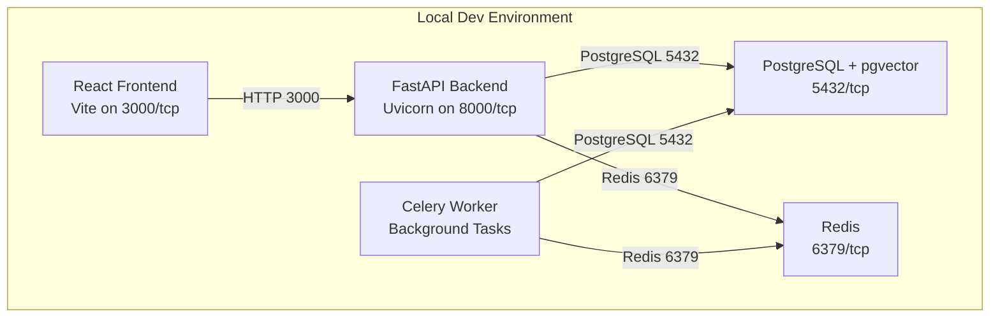
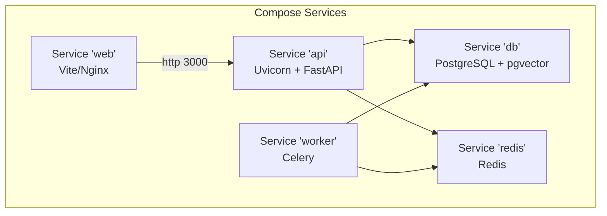
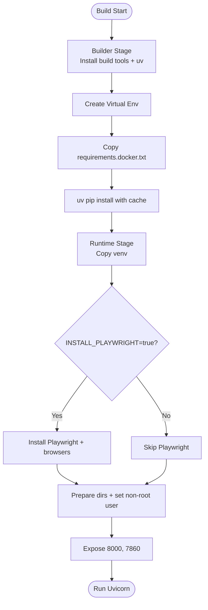
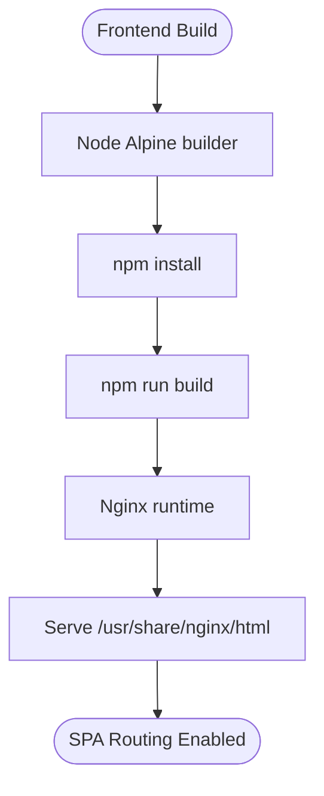
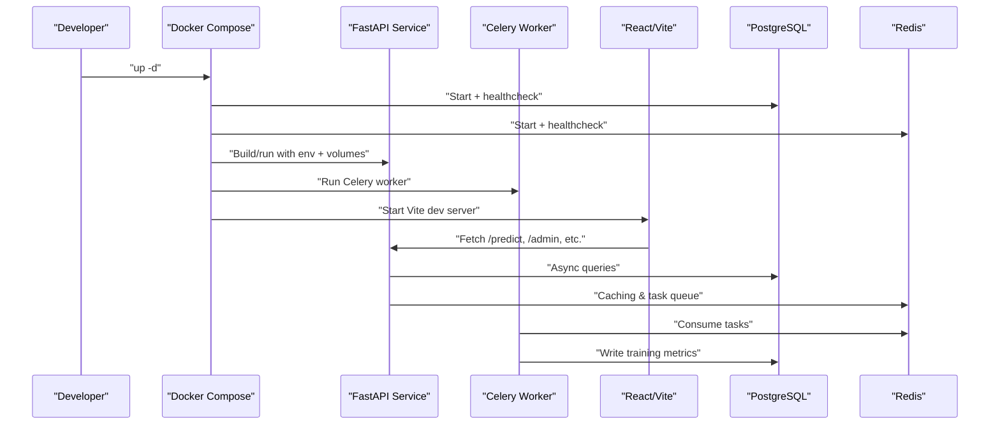
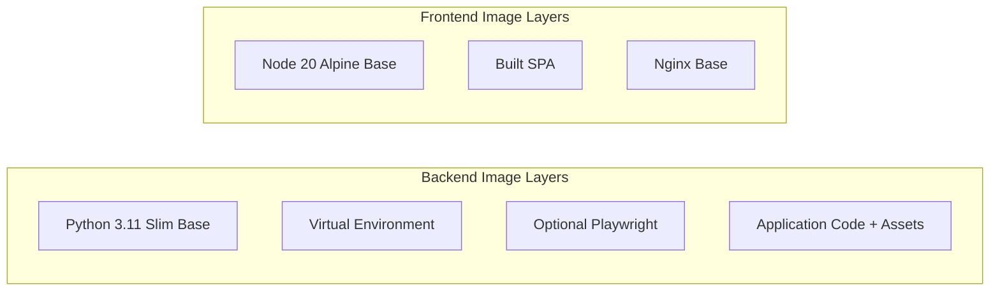

# Containerization and Docker Configuration

<cite>
**Referenced Files in This Document**
- [docker-compose.yml](file://docker-compose.yml)
- [docker-compose.prod.yml](file://docker-compose.prod.yml)
- [cyberbullying_api/Dockerfile](file://cyberbullying_api/Dockerfile)
- [frontend/Dockerfile](file://frontend/Dockerfile)
- [cyberbullying_api/requirements.docker.txt](file://cyberbullying_api/requirements.docker.txt)
- [cyberbullying_api/requirements.txt](file://cyberbullying_api/requirements.txt)
</cite>

## Table of Contents
1. [Introduction](#introduction)
2. [Project Structure](#project-structure)
3. [Core Components](#core-components)
4. [Architecture Overview](#architecture-overview)
5. [Detailed Component Analysis](#detailed-component-analysis)
6. [Dependency Analysis](#dependency-analysis)
7. [Performance Considerations](#performance-considerations)
8. [Troubleshooting Guide](#troubleshooting-guide)
9. [Conclusion](#conclusion)
10. [Appendices](#appendices)

## Introduction
This document explains BullyGuard ID’s Docker containerization strategy. It covers the multi-stage Docker build process for both the Python FastAPI backend and the React frontend, including base image selection, dependency management, and optimization techniques. It also documents the docker-compose configuration for local development, including service orchestration, volume mounting, and network setup, along with best practices for security, performance tuning, and inter-service communication.

## Project Structure
BullyGuard ID uses a multi-service Docker Compose setup:
- PostgreSQL with pgvector for vector storage
- Redis for caching and task queues
- FastAPI backend service with Uvicorn ASGI server
- Celery worker service for background tasks
- React frontend served via Vite in development or Nginx in production-ready builds

**Diagram sources**
- [docker-compose.yml:34-117](file://docker-compose.yml#L34-L117)

**Section sources**
- [docker-compose.yml:1-124](file://docker-compose.yml#L1-L124)

## Core Components
- Backend (FastAPI): Multi-stage Python slim image with a dedicated builder stage using uv for fast dependency installation and a final runtime stage with a non-root user and optional Playwright browsers.
- Frontend (React): Multi-stage Node Alpine build followed by Nginx serving the SPA.
- Supporting Services: PostgreSQL with pgvector and Redis, both configured with health checks and persistent volumes.

Key Dockerfile highlights:
- Builder stage installs build tools and uses uv to create a virtual environment and cache dependencies.
- Runtime stage copies the virtual environment, installs optional Playwright browsers when requested, sets up directories, adds a non-root user, and exposes ports.
- Frontend Dockerfile builds the SPA with Node and serves it via Nginx with SPA routing support.

**Section sources**
- [cyberbullying_api/Dockerfile:1-77](file://cyberbullying_api/Dockerfile#L1-L77)
- [frontend/Dockerfile:1-24](file://frontend/Dockerfile#L1-L24)

## Architecture Overview
The system runs as orchestrated services with shared volumes for hot-reloadable code and persistent data. The Compose configuration defines:
- Health checks for database and Redis
- Environment-driven configuration for API keys, rate limiting, CORS, and proxy trust
- Port mappings for API (8000) and Web (3000)
- Volume mounts for source code, model artifacts, cookies, browser profiles, and caches

**Diagram sources**
- [docker-compose.yml:34-117](file://docker-compose.yml#L34-L117)

**Section sources**
- [docker-compose.yml:34-117](file://docker-compose.yml#L34-L117)

## Detailed Component Analysis

### Backend Multi-Stage Dockerfile
The backend Dockerfile implements a two-stage build:
- Builder stage: Installs build essentials, sets up uv, creates a virtual environment, and installs runtime dependencies using uv with a cache mount for faster rebuilds.
- Runtime stage: Copies the virtual environment, optionally installs Playwright browsers, prepares directories, switches to a non-root user, and exposes ports.

**Diagram sources**
- [cyberbullying_api/Dockerfile:1-77](file://cyberbullying_api/Dockerfile#L1-L77)

**Section sources**
- [cyberbullying_api/Dockerfile:1-77](file://cyberbullying_api/Dockerfile#L1-L77)

### Frontend Multi-Stage Dockerfile
The frontend Dockerfile:
- Uses Node Alpine to build the React SPA
- Copies package manifests, installs dependencies, builds the app, and serves it via Nginx
- Includes a default Nginx config enabling SPA routing

**Diagram sources**
- [frontend/Dockerfile:1-24](file://frontend/Dockerfile#L1-L24)

**Section sources**
- [frontend/Dockerfile:1-24](file://frontend/Dockerfile#L1-L24)

### docker-compose Orchestration
Local development orchestration includes:
- Database and Redis with health checks and persistent volumes
- API service with hot-reloadable volumes for code and model artifacts
- Worker service sharing the same image and volumes as the API
- Web service running Vite for live reload during development
- Environment variables for database URLs, API keys, rate limiting, and CORS origins

Production overrides adjust worker count, enforce stricter defaults, and mount model volumes read-only.

**Diagram sources**
- [docker-compose.yml:34-117](file://docker-compose.yml#L34-L117)

**Section sources**
- [docker-compose.yml:1-124](file://docker-compose.yml#L1-L124)
- [docker-compose.prod.yml:1-29](file://docker-compose.prod.yml#L1-L29)

### Dependency Management
- Runtime dependencies for the backend are pinned in a dedicated requirements file for containerized builds.
- The primary requirements file includes additional libraries for training, exporting, and local development.
- The Dockerfile uses a separate requirements file tailored for containers to minimize image size and avoid installing unnecessary packages.

**Section sources**
- [cyberbullying_api/requirements.docker.txt:1-18](file://cyberbullying_api/requirements.docker.txt#L1-L18)
- [cyberbullying_api/requirements.txt:1-25](file://cyberbullying_api/requirements.txt#L1-L25)
- [cyberbullying_api/Dockerfile:21-23](file://cyberbullying_api/Dockerfile#L21-L23)

## Dependency Analysis
- Backend image layers:
  - Builder stage: build tools, uv, virtual environment, cached dependencies
  - Runtime stage: Python slim base, virtual environment, optional Playwright, prepared directories, non-root user
- Frontend image layers:
  - Builder stage: Node Alpine, installed dependencies, built SPA
  - Runtime stage: Nginx Alpine, SPA assets, SPA routing configuration

**Diagram sources**
- [cyberbullying_api/Dockerfile:27-77](file://cyberbullying_api/Dockerfile#L27-L77)
- [frontend/Dockerfile:1-24](file://frontend/Dockerfile#L1-L24)

**Section sources**
- [cyberbullying_api/Dockerfile:1-77](file://cyberbullying_api/Dockerfile#L1-L77)
- [frontend/Dockerfile:1-24](file://frontend/Dockerfile#L1-L24)

## Performance Considerations
- Image build performance:
  - Use uv for fast dependency installation and cache mounts to accelerate repeated builds.
  - Separate runtime requirements for containers to reduce image size.
- Runtime performance:
  - Use production workers setting to scale the API server.
  - Mount model directories as read-only in production to prevent accidental writes.
  - Enable rate limiting and fail-closed mode in production for resilience.
- Networking:
  - Use internal service names for inter-service communication (e.g., db, redis, api).
  - Expose only necessary ports; keep UI port optional in production.

[No sources needed since this section provides general guidance]

## Troubleshooting Guide
Common issues and resolutions:
- Database readiness:
  - The database service includes a health check using pg_isready. Ensure credentials match those passed via environment variables.
- Redis connectivity:
  - Confirm the Redis password is set consistently across environment variables and health checks.
- API startup:
  - Verify port mapping for the API service and that the Uvicorn command matches the exposed port.
- Frontend not loading:
  - Ensure the Vite dev server is running and the web service port is mapped correctly.
- Model artifacts not found:
  - Confirm the model directory is mounted and readable by the backend user.

**Section sources**
- [docker-compose.yml:12-16](file://docker-compose.yml#L12-L16)
- [docker-compose.yml:28-32](file://docker-compose.yml#L28-L32)
- [docker-compose.yml:43-44](file://docker-compose.yml#L43-L44)
- [docker-compose.yml:108-109](file://docker-compose.yml#L108-L109)

## Conclusion
BullyGuard ID’s containerization strategy leverages multi-stage builds, optimized dependency management, and a robust Compose setup for local development and production-like deployments. The backend Dockerfile emphasizes speed and security with uv, a non-root user, and optional Playwright support. The frontend Dockerfile provides a lightweight Nginx-based runtime for SPA delivery. The Compose configuration orchestrates services with health checks, environment-driven settings, and persistent volumes for data and models.

[No sources needed since this section summarizes without analyzing specific files]

## Appendices

### Practical Commands
- Build and start services:
  - docker compose up -d
- Build with Playwright support:
  - docker compose --build-arg INSTALL_PLAYWRIGHT=true build
- Run in production profile:
  - docker compose -f docker-compose.yml -f docker-compose.prod.yml up -d --build
- Stop and remove:
  - docker compose down

[No sources needed since this section provides general guidance]

### Security Best Practices
- Non-root user:
  - The backend Dockerfile creates and runs as a non-root user to reduce privilege exposure.
- Read-only model mounts:
  - Production Compose overrides mount model directories as read-only.
- Environment-driven secrets:
  - Sensitive configuration is injected via environment variables and not baked into images.
- Health checks:
  - Database and Redis health checks ensure dependent services are ready before startup.

**Section sources**
- [cyberbullying_api/Dockerfile:69-71](file://cyberbullying_api/Dockerfile#L69-L71)
- [docker-compose.prod.yml:14-16](file://docker-compose.prod.yml#L14-L16)
- [docker-compose.yml:46-61](file://docker-compose.yml#L46-L61)

### Networking and Inter-Service Communication
- Internal DNS:
  - Services communicate using service names as hostnames (e.g., db, redis, api).
- Port mapping:
  - API: 8000/tcp (mapped internally to 8000)
  - Web: 3000/tcp (mapped internally to 3000)
- CORS and proxy headers:
  - Origins and proxy header trust are configurable via environment variables.

**Section sources**
- [docker-compose.yml:43-44](file://docker-compose.yml#L43-L44)
- [docker-compose.yml:108-109](file://docker-compose.yml#L108-L109)
- [docker-compose.yml:56-61](file://docker-compose.yml#L56-L61)