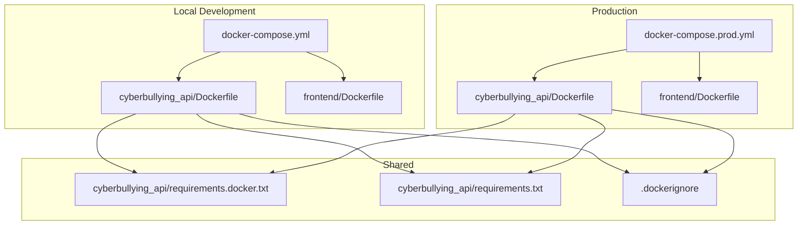
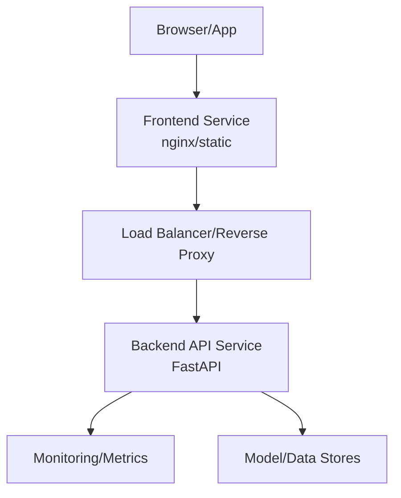
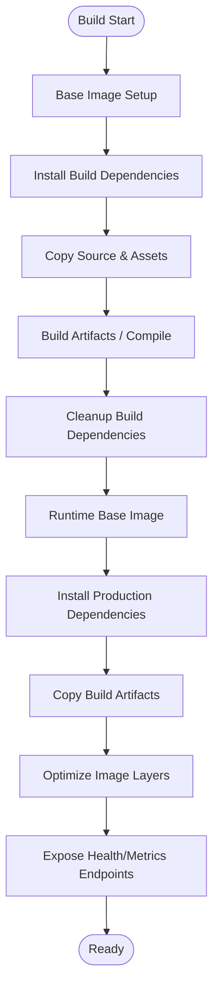
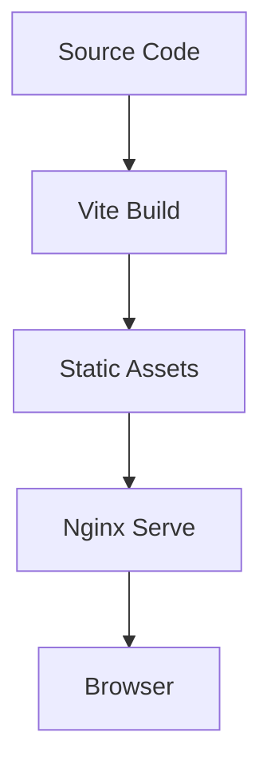
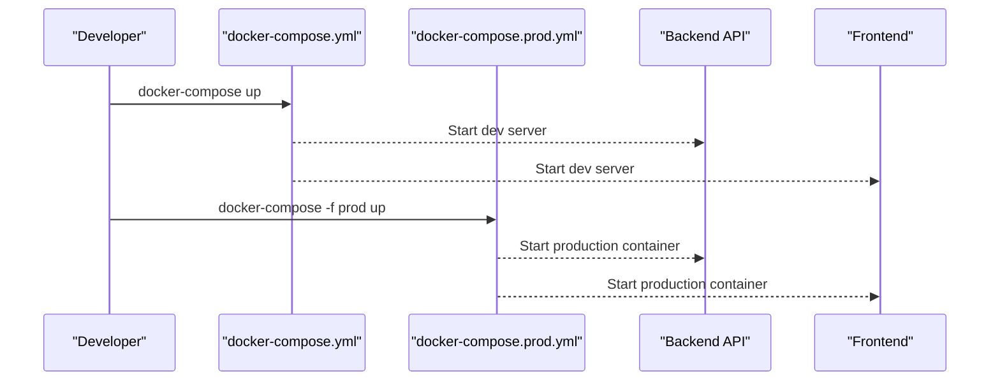
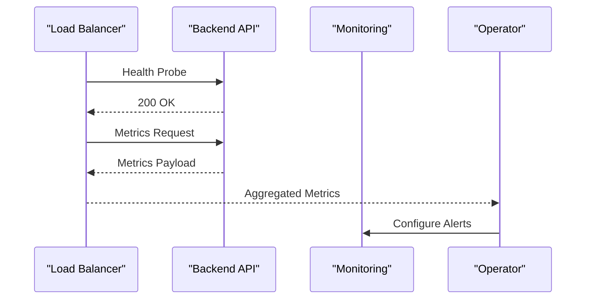
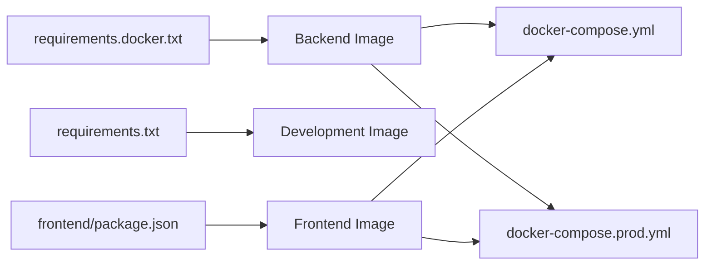

# Deployment and Operations

<cite>
**Referenced Files in This Document**
- [Dockerfile](file://cyberbullying_api/Dockerfile)
- [Dockerfile](file://frontend/Dockerfile)
- [docker-compose.yml](file://docker-compose.yml)
- [docker-compose.prod.yml](file://docker-compose.prod.yml)
- [.dockerignore](file://.dockerignore)
- [requirements.docker.txt](file://cyberbullying_api/requirements.docker.txt)
- [requirements.txt](file://cyberbullying_api/requirements.txt)
- [monitoring.py](file://cyberbullying_api/monitoring.py)
- [main.py](file://cyberbullying_api/main.py)
- [README.md](file://cyberbullying_api/README.md)
- [README.md](file://frontend/README.md)
- [run_local.sh](file://run_local.sh)
- [run_local.bat](file://run_local.bat)
- [smoke_test_api.sh](file://scripts/smoke_test_api.sh)
- [smoke_test_api.ps1](file://scripts/smoke_test_api.ps1)
- [benchmark_inference.py](file://scripts/benchmark_inference.py)
- [PRODUCTION_CHECKLIST.md](file://docs/PRODUCTION_CHECKLIST.md)
- [ROLLBACK_PLAN.md](file://docs/ROLLBACK_PLAN.md)
- [SECURITY_HARDENING.md](file://docs/SECURITY_HARDENING.md)
</cite>

## Table of Contents
1. [Introduction](#introduction)
2. [Project Structure](#project-structure)
3. [Core Components](#core-components)
4. [Architecture Overview](#architecture-overview)
5. [Detailed Component Analysis](#detailed-component-analysis)
6. [Dependency Analysis](#dependency-analysis)
7. [Performance Considerations](#performance-considerations)
8. [Troubleshooting Guide](#troubleshooting-guide)
9. [Conclusion](#conclusion)
10. [Appendices](#appendices)

## Introduction
This document provides comprehensive deployment and operations guidance for BullyGuard ID’s containerized system. It covers containerization strategies, multi-stage builds, image optimization, development and production deployment configurations, scaling and load balancing, monitoring and observability, health checks, performance benchmarking, CI/CD and automation, rollback and disaster recovery, and operational procedures. The content is grounded in the repository’s Dockerfiles, compose files, requirements, monitoring utilities, and operational playbooks.

## Project Structure
BullyGuard ID comprises two primary services:
- Backend API service (FastAPI) under cyberbullying_api
- Frontend service (Vite/React) under frontend

Containerization artifacts and orchestration:
- Dockerfiles for backend and frontend
- docker-compose.yml for local development
- docker-compose.prod.yml for production deployment
- .dockerignore for build optimization
- requirements files for Python dependencies

**Diagram sources**
- [docker-compose.yml](file://docker-compose.yml)
- [docker-compose.prod.yml](file://docker-compose.prod.yml)
- [Dockerfile](file://cyberbullying_api/Dockerfile)
- [Dockerfile](file://frontend/Dockerfile)
- [requirements.docker.txt](file://cyberbullying_api/requirements.docker.txt)
- [requirements.txt](file://cyberbullying_api/requirements.txt)
- [.dockerignore](file://.dockerignore)

**Section sources**
- [docker-compose.yml](file://docker-compose.yml)
- [docker-compose.prod.yml](file://docker-compose.prod.yml)
- [Dockerfile](file://cyberbullying_api/Dockerfile)
- [Dockerfile](file://frontend/Dockerfile)
- [requirements.docker.txt](file://cyberbullying_api/requirements.docker.txt)
- [requirements.txt](file://cyberbullying_api/requirements.txt)
- [.dockerignore](file://.dockerignore)

## Core Components
- Backend API service
  - Containerized via a dedicated Dockerfile
  - Uses requirements.docker.txt for production-ready dependencies
  - Exposes health and metrics endpoints via monitoring utilities
- Frontend service
  - Containerized via a dedicated Dockerfile
  - Built for static delivery in production
- Orchestration
  - Local development orchestrated by docker-compose.yml
  - Production orchestrated by docker-compose.prod.yml
- Monitoring and health
  - Health checks and metrics exposed by the backend
  - Smoke tests and inference benchmarks for validation

**Section sources**
- [Dockerfile](file://cyberbullying_api/Dockerfile)
- [Dockerfile](file://frontend/Dockerfile)
- [requirements.docker.txt](file://cyberbullying_api/requirements.docker.txt)
- [monitoring.py](file://cyberbullying_api/monitoring.py)
- [docker-compose.yml](file://docker-compose.yml)
- [docker-compose.prod.yml](file://docker-compose.prod.yml)

## Architecture Overview
The deployment architecture supports local development and production environments. The backend exposes API endpoints and integrates monitoring. The frontend serves the UI and communicates with the backend. Compose files define services, networks, volumes, and environment-specific overrides.

[No sources needed since this diagram shows conceptual workflow, not actual code structure]

## Detailed Component Analysis

### Backend API Containerization
- Multi-stage build strategy
  - Stage 1: Build-time dependencies and artifact generation
  - Stage 2: Runtime image with minimal base and installed requirements.docker.txt
- Image optimization
  - .dockerignore excludes unnecessary files
  - requirements.docker.txt pins production dependencies
  - Final stage uses a lean runtime base image
- Health and metrics
  - Health check endpoint integrated into FastAPI app
  - Metrics exposed via monitoring module

**Diagram sources**
- [Dockerfile](file://cyberbullying_api/Dockerfile)
- [requirements.docker.txt](file://cyberbullying_api/requirements.docker.txt)
- [monitoring.py](file://cyberbullying_api/monitoring.py)

**Section sources**
- [Dockerfile](file://cyberbullying_api/Dockerfile)
- [requirements.docker.txt](file://cyberbullying_api/requirements.docker.txt)
- [requirements.txt](file://cyberbullying_api/requirements.txt)
- [.dockerignore](file://.dockerignore)
- [monitoring.py](file://cyberbullying_api/monitoring.py)

### Frontend Containerization
- Static site delivery
  - Nginx-based serving of built assets
  - Minimal footprint for production
- Build process
  - Vite build configured via vite.config.ts and package.json
  - Environment variables injected during build or runtime

**Diagram sources**
- [Dockerfile](file://frontend/Dockerfile)
- [package.json](file://frontend/package.json)
- [vite.config.ts](file://frontend/vite.config.ts)

**Section sources**
- [Dockerfile](file://frontend/Dockerfile)
- [README.md](file://frontend/README.md)

### Orchestration: Development vs Production
- Local development
  - docker-compose.yml defines services, ports, and shared volumes for hot reload
- Production
  - docker-compose.prod.yml defines production-grade services, secrets, and network policies

**Diagram sources**
- [docker-compose.yml](file://docker-compose.yml)
- [docker-compose.prod.yml](file://docker-compose.prod.yml)

**Section sources**
- [docker-compose.yml](file://docker-compose.yml)
- [docker-compose.prod.yml](file://docker-compose.prod.yml)

### Monitoring and Observability
- Backend monitoring
  - Health checks and metrics endpoints integrated into the FastAPI app
  - Monitoring module exports metrics for Prometheus scraping
- Frontend monitoring
  - Static delivery simplifies metrics collection at CDN/proxy level
- Smoke testing
  - Scripts validate API availability and basic functionality post-deployment

**Diagram sources**
- [monitoring.py](file://cyberbullying_api/monitoring.py)
- [main.py](file://cyberbullying_api/main.py)

**Section sources**
- [monitoring.py](file://cyberbullying_api/monitoring.py)
- [main.py](file://cyberbullying_api/main.py)
- [smoke_test_api.sh](file://scripts/smoke_test_api.sh)
- [smoke_test_api.ps1](file://scripts/smoke_test_api.ps1)

### Scaling and Load Balancing
- Stateless backend design enables horizontal scaling
- Reverse proxy/load balancer distributes traffic across backend replicas
- Health probes ensure failed instances are removed from rotation
- Frontend served statically to reduce backend load

[No sources needed since this section provides general guidance]

### Capacity Planning and Resource Allocation
- CPU/memory requests/limits should be set per service in compose files
- Model inference latency and throughput inform replica sizing
- Benchmark scripts guide capacity estimation

**Section sources**
- [benchmark_inference.py](file://scripts/benchmark_inference.py)

### Rollback Procedures and Disaster Recovery
- Immutable deployments with tagged images enable quick rollbacks
- Blue/green or rolling updates minimize downtime
- Playbook outlines steps for rollback and DR scenarios

**Section sources**
- [ROLLBACK_PLAN.md](file://docs/ROLLBACK_PLAN.md)

### Security Hardening
- Minimize attack surface by using minimal base images
- Pin dependency versions and rebuild images regularly
- Secrets management and least-privilege access

**Section sources**
- [SECURITY_HARDENING.md](file://docs/SECURITY_HARDENING.md)

## Dependency Analysis
- Backend dependencies
  - requirements.docker.txt for production runtime
  - requirements.txt for development/testing
- Frontend dependencies
  - Managed via package.json and vite.config.ts
- Build-time vs runtime separation
  - Dockerfile separates build and runtime stages
- Orchestration dependencies
  - Compose files define inter-service dependencies and networking

**Diagram sources**
- [requirements.docker.txt](file://cyberbullying_api/requirements.docker.txt)
- [requirements.txt](file://cyberbullying_api/requirements.txt)
- [Dockerfile](file://cyberbullying_api/Dockerfile)
- [Dockerfile](file://frontend/Dockerfile)
- [docker-compose.yml](file://docker-compose.yml)
- [docker-compose.prod.yml](file://docker-compose.prod.yml)

**Section sources**
- [requirements.docker.txt](file://cyberbullying_api/requirements.docker.txt)
- [requirements.txt](file://cyberbullying_api/requirements.txt)
- [Dockerfile](file://cyberbullying_api/Dockerfile)
- [Dockerfile](file://frontend/Dockerfile)
- [docker-compose.yml](file://docker-compose.yml)
- [docker-compose.prod.yml](file://docker-compose.prod.yml)

## Performance Considerations
- Image optimization
  - Multi-stage builds, .dockerignore exclusions, and minimal runtime base
- Inference performance
  - Benchmark script measures throughput/latency
- Health and metrics
  - Enable Prometheus-style metrics for autoscaling signals

**Section sources**
- [Dockerfile](file://cyberbullying_api/Dockerfile)
- [benchmark_inference.py](file://scripts/benchmark_inference.py)
- [monitoring.py](file://cyberbullying_api/monitoring.py)

## Troubleshooting Guide
- Health probe failures
  - Verify health endpoint configuration and readiness conditions
- Slow response times
  - Review model inference logs and metrics; scale replicas
- Build failures
  - Confirm Dockerfile stages, dependency files, and .dockerignore entries
- Smoke tests
  - Use provided scripts to validate deployment health

**Section sources**
- [monitoring.py](file://cyberbullying_api/monitoring.py)
- [smoke_test_api.sh](file://scripts/smoke_test_api.sh)
- [smoke_test_api.ps1](file://scripts/smoke_test_api.ps1)

## Conclusion
BullyGuard ID’s deployment model leverages containerization, multi-stage builds, and orchestration to support reliable development and production operations. By applying health checks, monitoring, benchmarking, and documented rollback/disaster recovery procedures, teams can operate the system with confidence. Scaling and resource planning should align with observed performance characteristics and traffic projections.

## Appendices

### Practical Deployment Examples
- Local development
  - Use docker-compose.yml to start services locally
- Production rollout
  - Use docker-compose.prod.yml with environment-specific overrides
- Health verification
  - Run smoke tests after deployment

**Section sources**
- [docker-compose.yml](file://docker-compose.yml)
- [docker-compose.prod.yml](file://docker-compose.prod.yml)
- [smoke_test_api.sh](file://scripts/smoke_test_api.sh)
- [smoke_test_api.ps1](file://scripts/smoke_test_api.ps1)

### Operational Procedures
- Pre-deployment checklist
  - Validate images, secrets, and environment variables
- Post-deployment verification
  - Confirm health, metrics, and smoke tests pass
- Maintenance
  - Regular dependency updates and image rebuilds

**Section sources**
- [PRODUCTION_CHECKLIST.md](file://docs/PRODUCTION_CHECKLIST.md)
- [README.md](file://cyberbullying_api/README.md)
- [README.md](file://frontend/README.md)