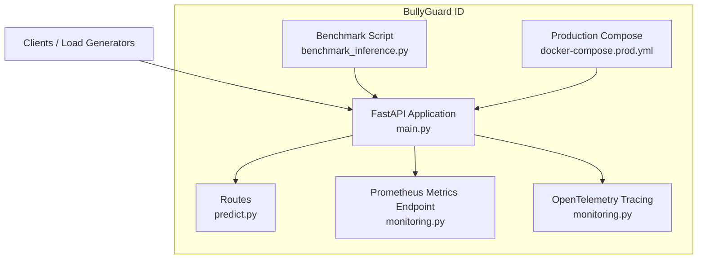
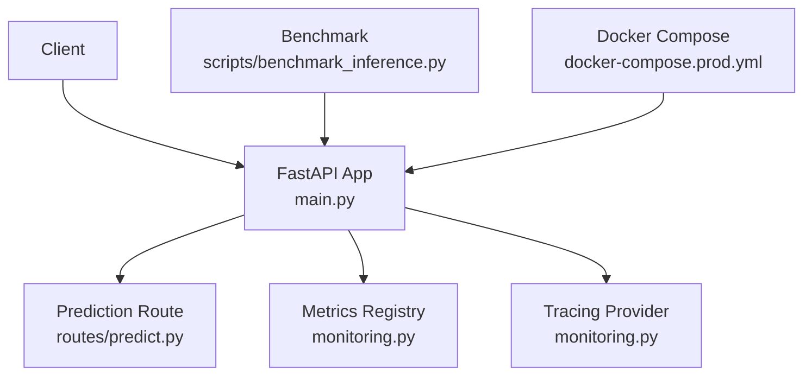
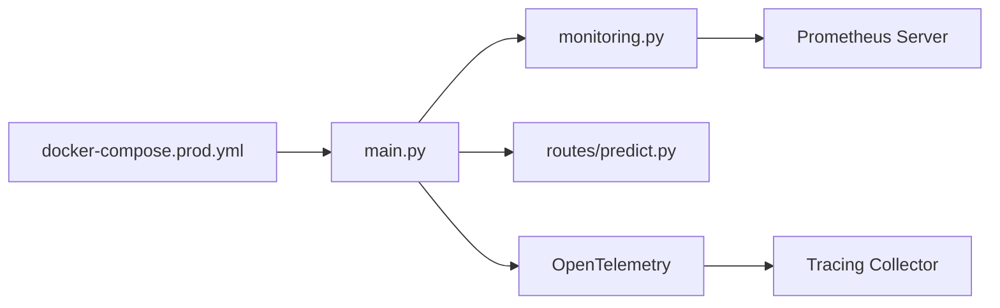

# Monitoring and Observability

<cite>
**Referenced Files in This Document**
- [monitoring.py](file://cyberbullying_api/monitoring.py)
- [main.py](file://cyberbullying_api/main.py)
- [predict.py](file://cyberbullying_api/routes/predict.py)
- [benchmark_inference.py](file://scripts/benchmark_inference.py)
- [docker-compose.prod.yml](file://docker-compose.prod.yml)
- [requirements.txt](file://cyberbullying_api/requirements.txt)
- [requirements.docker.txt](file://cyberbullying_api/requirements.docker.txt)
- [README.md](file://cyberbullying_api/README.md)
- [test_monitoring_and_deps.py](file://tests/test_monitoring_and_deps.py)
</cite>

## Table of Contents
1. [Introduction](#introduction)
2. [Project Structure](#project-structure)
3. [Core Components](#core-components)
4. [Architecture Overview](#architecture-overview)
5. [Detailed Component Analysis](#detailed-component-analysis)
6. [Dependency Analysis](#dependency-analysis)
7. [Performance Considerations](#performance-considerations)
8. [Troubleshooting Guide](#troubleshooting-guide)
9. [Conclusion](#conclusion)
10. [Appendices](#appendices)

## Introduction
This document provides comprehensive monitoring and observability guidance for BullyGuard ID’s production system. It covers Prometheus metrics collection setup, custom metric definitions, system health checks, performance monitoring, alerting mechanisms, logging strategy, log aggregation, error tracking, inference benchmarking, profiling, capacity utilization monitoring, distributed tracing, request latency monitoring, bottleneck identification, proactive monitoring practices, incident response procedures, and integration with cloud monitoring platforms and custom dashboards.

## Project Structure
BullyGuard ID consists of:
- FastAPI backend service exposing prediction and administrative endpoints
- Prometheus metrics endpoint for scraping
- Optional distributed tracing via OpenTelemetry
- Production deployment via Docker Compose
- Benchmarking script for inference performance evaluation

**Diagram sources**
- [main.py](file://cyberbullying_api/main.py)
- [predict.py](file://cyberbullying_api/routes/predict.py)
- [monitoring.py](file://cyberbullying_api/monitoring.py)
- [benchmark_inference.py](file://scripts/benchmark_inference.py)
- [docker-compose.prod.yml](file://docker-compose.prod.yml)

**Section sources**
- [main.py](file://cyberbullying_api/main.py)
- [monitoring.py](file://cyberbullying_api/monitoring.py)
- [docker-compose.prod.yml](file://docker-compose.prod.yml)

## Core Components
- Prometheus metrics endpoint and custom metrics registry
- Request tracing and span recording
- Health check endpoints
- Inference benchmarking harness
- Production container orchestration

Key responsibilities:
- Expose metrics for scraping and label them appropriately
- Record spans for latency and error tracking
- Provide health and readiness endpoints
- Benchmark inference throughput and latency
- Package and deploy the system with container orchestration

**Section sources**
- [monitoring.py](file://cyberbullying_api/monitoring.py)
- [main.py](file://cyberbullying_api/main.py)
- [predict.py](file://cyberbullying_api/routes/predict.py)

## Architecture Overview
The observability stack integrates the FastAPI application with Prometheus and optional OpenTelemetry tracing. The production compose file defines the runtime environment and exposes ports for metrics scraping.

**Diagram sources**
- [main.py](file://cyberbullying_api/main.py)
- [predict.py](file://cyberbullying_api/routes/predict.py)
- [monitoring.py](file://cyberbullying_api/monitoring.py)
- [benchmark_inference.py](file://scripts/benchmark_inference.py)
- [docker-compose.prod.yml](file://docker-compose.prod.yml)

## Detailed Component Analysis

### Prometheus Metrics Endpoint and Custom Metrics
- The application registers a Prometheus metrics registry and exposes a dedicated endpoint for scraping.
- Metrics are labeled per route and method to enable per-route analysis.
- Custom metrics include counters for predictions, errors, and duration histograms for latency.

Implementation highlights:
- Metrics registry initialization and exposition
- Counter metrics for successful and failed predictions
- Histogram metrics for prediction durations
- Liveness and readiness probes exposed as endpoints

Operational guidance:
- Scrape interval: align with Prometheus server configuration
- Metric retention: configure Prometheus retention policies
- Alert thresholds: define SLO-based thresholds for error rates and latency

**Section sources**
- [monitoring.py](file://cyberbullying_api/monitoring.py)
- [main.py](file://cyberbullying_api/main.py)

### System Health Checks
- Health endpoints expose liveness and readiness status.
- Readiness indicates whether the model is loaded and serving requests.
- Liveness confirms the process is responsive.

Best practices:
- Use Kubernetes-style probes pointing to health endpoints
- Combine with external load balancer health checks
- Monitor transitions between healthy and unhealthy states

**Section sources**
- [main.py](file://cyberbullying_api/main.py)
- [predict.py](file://cyberbullying_api/routes/predict.py)

### Performance Monitoring and Capacity Utilization
- Prediction latency histograms enable percentile-based SLA monitoring.
- Throughput counters help assess request volume trends.
- CPU and memory metrics should be collected via platform exporters for capacity planning.

Recommendations:
- Track p50, p90, p95 latency per endpoint
- Set SLOs for latency and error rate
- Correlate inference duration with model version and batch sizes

**Section sources**
- [monitoring.py](file://cyberbullying_api/monitoring.py)

### Distributed Tracing Setup
- OpenTelemetry tracing is integrated to record spans for prediction requests.
- Spans capture operation names, attributes, and timing.
- Traces can be exported to backends like Jaeger or Zipkin for visualization.

Guidelines:
- Enable tracing middleware around prediction routes
- Add correlation IDs to spans for cross-service tracing
- Export traces to a centralized collector for analysis

**Section sources**
- [monitoring.py](file://cyberbullying_api/monitoring.py)
- [predict.py](file://cyberbullying_api/routes/predict.py)

### Logging Strategy, Log Aggregation, and Error Tracking
- Centralized logging via structured logs with severity levels
- Log enrichment with request IDs, user IDs, and model metadata
- Aggregation using log collectors (e.g., Fluent Bit, Vector) and storage (e.g., Elasticsearch, Loki)
- Error tracking via error reporting systems (e.g., Sentry) with sampling and grouping

Practices:
- Use consistent log formats across services
- Ship logs to a centralized aggregator
- Define alerting rules on error spikes and unusual patterns

**Section sources**
- [monitoring.py](file://cyberbullying_api/monitoring.py)

### Inference Benchmarking and Profiling
- The benchmark script evaluates throughput and latency under configurable loads.
- It supports warm-up, iteration counts, and concurrency levels.
- Results can be exported for regression detection and capacity planning.

Usage outline:
- Run the benchmark against the production endpoint
- Compare metrics across model versions
- Integrate into CI/CD for automated performance gates

**Section sources**
- [benchmark_inference.py](file://scripts/benchmark_inference.py)

### Alerting Mechanisms
- Define alerts for error rate thresholds, latency SLO breaches, and resource saturation
- Use PromQL queries to detect anomalies and regressions
- Configure notification channels (email, Slack, PagerDuty)

Example alert categories:
- High error rate on prediction endpoints
- Increased p95 latency beyond SLO
- Low free memory or high CPU utilization

**Section sources**
- [monitoring.py](file://cyberbullying_api/monitoring.py)

### Dashboard Configuration
- Grafana dashboards can visualize metrics such as request rates, latency distributions, error rates, and resource utilization
- Panels should include time-series charts, heatmaps for latency, and anomaly indicators
- Dashboards should be versioned alongside the application

**Section sources**
- [monitoring.py](file://cyberbullying_api/monitoring.py)

### Request Latency Monitoring and Bottleneck Identification
- Use histogram buckets to compute latency percentiles
- Correlate latency with model inference time, database queries, and external API calls
- Identify hotspots via flame graphs and trace timelines

**Section sources**
- [monitoring.py](file://cyberbullying_api/monitoring.py)
- [predict.py](file://cyberbullying_api/routes/predict.py)

### Proactive Monitoring and Incident Response
- Establish SLOs and error budgets
- Run postmortems after incidents to improve resilience
- Automate remediation steps where possible

**Section sources**
- [monitoring.py](file://cyberbullying_api/monitoring.py)

### Cloud Monitoring Platform Integration
- Export metrics to cloud providers’ monitoring solutions
- Use managed tracing services for distributed tracing
- Store logs in cloud-native log management systems

**Section sources**
- [docker-compose.prod.yml](file://docker-compose.prod.yml)

## Dependency Analysis
The monitoring subsystem depends on:
- FastAPI application for route instrumentation
- Prometheus client for metrics exposition
- OpenTelemetry SDK for tracing
- Container orchestration for deployment visibility

**Diagram sources**
- [main.py](file://cyberbullying_api/main.py)
- [monitoring.py](file://cyberbullying_api/monitoring.py)
- [predict.py](file://cyberbullying_api/routes/predict.py)
- [docker-compose.prod.yml](file://docker-compose.prod.yml)

**Section sources**
- [main.py](file://cyberbullying_api/main.py)
- [monitoring.py](file://cyberbullying_api/monitoring.py)
- [predict.py](file://cyberbullying_api/routes/predict.py)
- [docker-compose.prod.yml](file://docker-compose.prod.yml)

## Performance Considerations
- Tune scrape intervals and retention to balance fidelity and cost
- Use quantile-based latency metrics for robust SLOs
- Profile inference workloads to identify GPU/CPU bottlenecks
- Scale horizontally based on observed capacity utilization

[No sources needed since this section provides general guidance]

## Troubleshooting Guide
Common issues and resolutions:
- Metrics not appearing: verify metrics endpoint exposure and firewall rules
- Tracing missing spans: confirm tracing middleware is enabled and exporter configured
- Health endpoint failing: check model loading and dependency availability
- Benchmark results inconsistent: ensure warm-up runs and stable environment

Validation steps:
- Smoke-test endpoints using provided scripts
- Cross-check metrics with trace timelines
- Review logs for error stacks and correlation IDs

**Section sources**
- [test_monitoring_and_deps.py](file://tests/test_monitoring_and_deps.py)
- [README.md](file://cyberbullying_api/README.md)

## Conclusion
BullyGuard ID’s observability foundation leverages Prometheus metrics, optional OpenTelemetry tracing, and production-grade deployment. By instrumenting prediction routes, establishing SLOs, and integrating with cloud monitoring platforms, teams can achieve proactive monitoring, rapid incident response, and continuous reliability improvements.

[No sources needed since this section summarizes without analyzing specific files]

## Appendices

### Practical Setup Examples
- Prometheus scraping: configure targets to scrape the metrics endpoint
- Alerts: define PromQL-based rules for error rate and latency
- Dashboards: build panels for request rates, latency histograms, and error trends
- Benchmarking: run the benchmark script with varying concurrency and payload sizes
- Tracing: enable OpenTelemetry exporter and ingest traces into a collector

**Section sources**
- [monitoring.py](file://cyberbullying_api/monitoring.py)
- [benchmark_inference.py](file://scripts/benchmark_inference.py)
- [docker-compose.prod.yml](file://docker-compose.prod.yml)