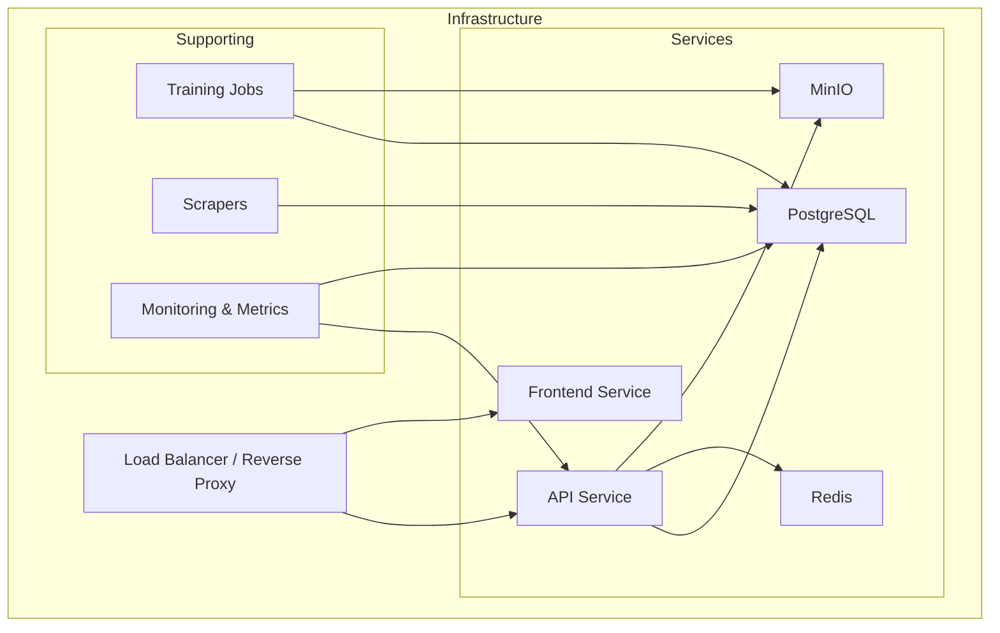
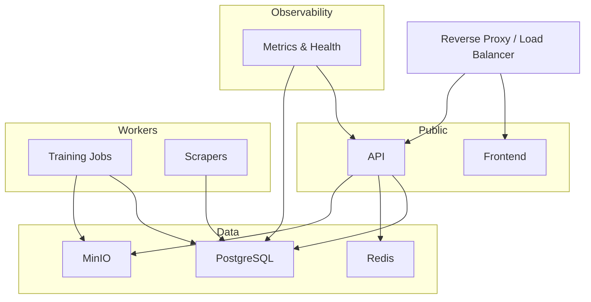
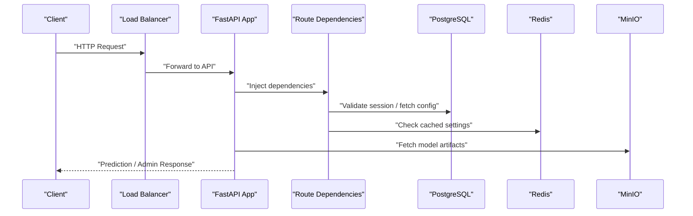
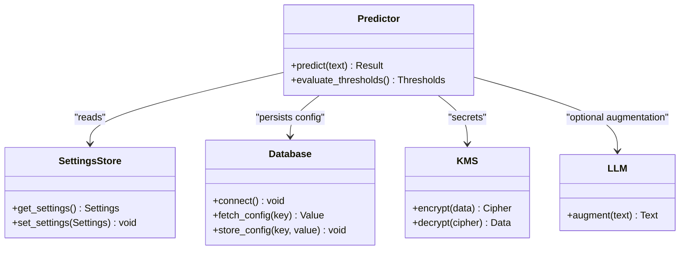
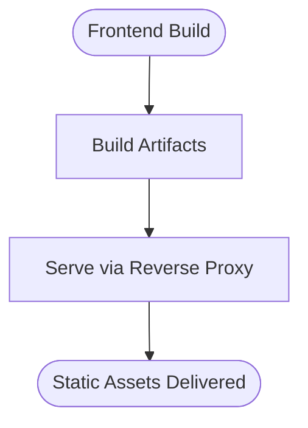
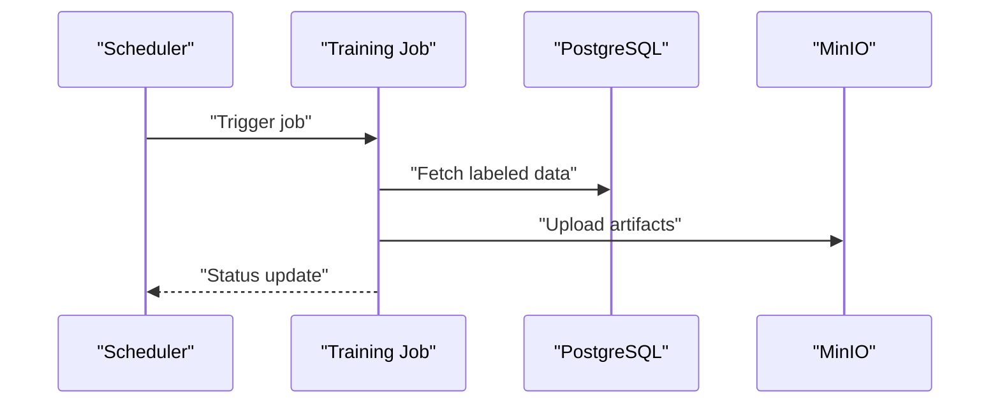
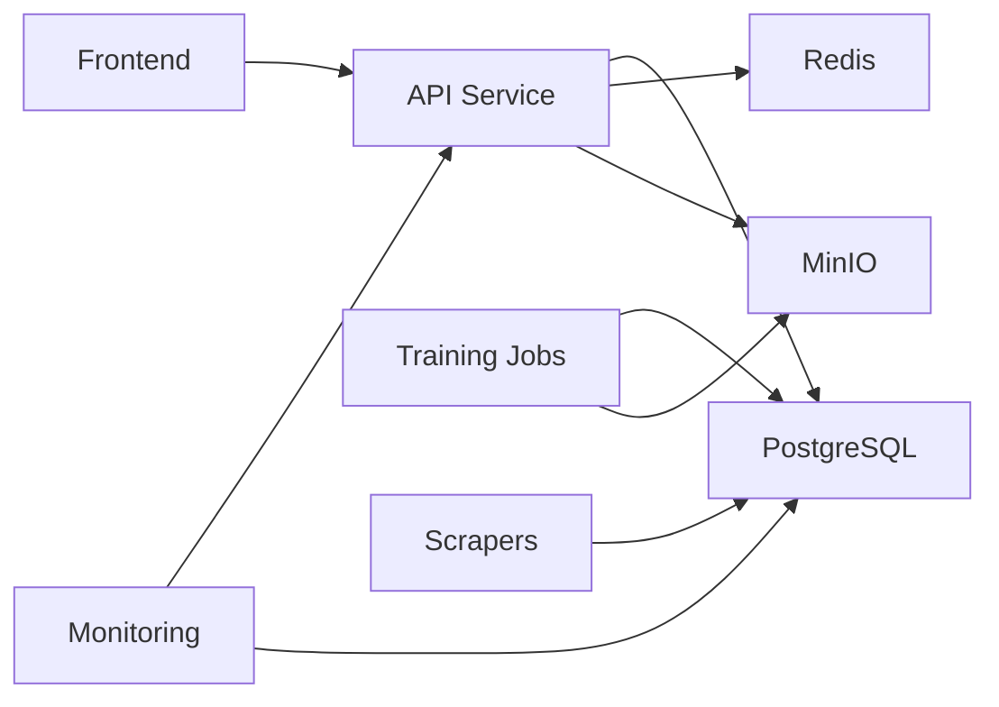

# Production Deployment and Scaling

<cite>
**Referenced Files in This Document**
- [docker-compose.prod.yml](file://docker-compose.prod.yml)
- [docker-compose.yml](file://docker-compose.yml)
- [Dockerfile](file://cyberbullying_api/Dockerfile)
- [Dockerfile](file://frontend/Dockerfile)
- [main.py](file://cyberbullying_api/main.py)
- [monitoring.py](file://cyberbullying_api/monitoring.py)
- [routes/admin.py](file://cyberbullying_api/routes/admin.py)
- [routes/auth.py](file://cyberbullying_api/routes/auth.py)
- [routes/predict.py](file://cyberbullying_api/routes/predict.py)
- [routes/settings.py](file://cyberbullying_api/routes/settings.py)
- [routes/state.py](file://cyberbullying_api/routes/state.py)
- [routes/training.py](file://cyberbullying_api/routes/training.py)
- [routes/deps.py](file://cyberbullying_api/routes/deps.py)
- [classifier/database.py](file://cyberbullying_api/classifier/database.py)
- [classifier/db_config.py](file://cyberbullying_api/classifier/db_config.py)
- [classifier/kms.py](file://cyberbullying_api/classifier/kms.py)
- [classifier/settings_store.py](file://cyberbullying_api/classifier/settings_store.py)
- [classifier/predictor.py](file://cyberbullying_api/classifier/predictor.py)
- [classifier/llm.py](file://cyberbullying_api/classifier/llm.py)
- [tasks.py](file://cyberbullying_api/tasks.py)
- [requirements.docker.txt](file://cyberbullying_api/requirements.docker.txt)
- [scripts/smoke_test_api.sh](file://scripts/smoke_test_api.sh)
- [scripts/benchmark_inference.py](file://scripts/benchmark_inference.py)
- [docs/PRODUCTION_CHECKLIST.md](file://docs/PRODUCTION_CHECKLIST.md)
- [docs/ROLLBACK_PLAN.md](file://docs/ROLLBACK_PLAN.md)
</cite>

## Table of Contents
1. [Introduction](#introduction)
2. [Project Structure](#project-structure)
3. [Core Components](#core-components)
4. [Architecture Overview](#architecture-overview)
5. [Detailed Component Analysis](#detailed-component-analysis)
6. [Dependency Analysis](#dependency-analysis)
7. [Performance Considerations](#performance-considerations)
8. [Troubleshooting Guide](#troubleshooting-guide)
9. [Conclusion](#conclusion)
10. [Appendices](#appendices)

## Introduction
This document provides production-grade deployment and scaling guidance for BullyGuard ID’s infrastructure. It covers the production Docker Compose configuration, environment variables, service scaling strategies, load balancing and reverse proxy setup, traffic distribution patterns, deployment automation, health checks, readiness probes, SSL/TLS certificate configuration, domain routing, horizontal scaling and auto-scaling policies, resource allocation, secrets management, configuration drift prevention, capacity planning, performance benchmarks, infrastructure cost optimization, rollback procedures, blue-green deployments, and zero-downtime techniques.

## Project Structure
BullyGuard ID comprises:
- Backend API service (FastAPI) with classification and prediction capabilities
- Frontend web application (React/Vite)
- Supporting services for training, scraping, and monitoring
- Production Docker Compose stack for container orchestration
- Scripts for smoke testing and inference benchmarking
- Operational documentation for production checklist and rollback plans

[No sources needed since this diagram shows conceptual workflow, not actual code structure]

**Section sources**
- [docker-compose.prod.yml](file://docker-compose.prod.yml)
- [docker-compose.yml](file://docker-compose.yml)

## Core Components
- API Service: FastAPI application exposing prediction, admin, authentication, settings, state, and training endpoints. Includes monitoring hooks and dependency injection via route dependencies.
- Classifier Engine: Prediction pipeline with database caching, memory-backed cache, LLM integration, and KMS-based encryption/decryption.
- Frontend Service: Static React application served behind the reverse proxy.
- Supporting Services: Training jobs, social media scrapers, and monitoring/metrics collection.
- Orchestration: Docker Compose defines multi-service topology with persistent volumes, networks, and environment-specific overrides.

Key runtime characteristics:
- Predictions rely on ONNX model exports and configurable thresholds.
- Secrets are managed via KMS and environment variables.
- Health and readiness are exposed via monitoring endpoints.

**Section sources**
- [main.py](file://cyberbullying_api/main.py)
- [monitoring.py](file://cyberbullying_api/monitoring.py)
- [routes/predict.py](file://cyberbullying_api/routes/predict.py)
- [routes/admin.py](file://cyberbullying_api/routes/admin.py)
- [routes/auth.py](file://cyberbullying_api/routes/auth.py)
- [routes/settings.py](file://cyberbullying_api/routes/settings.py)
- [routes/state.py](file://cyberbullying_api/routes/state.py)
- [routes/training.py](file://cyberbullying_api/routes/training.py)
- [routes/deps.py](file://cyberbullying_api/routes/deps.py)
- [classifier/database.py](file://cyberbullying_api/classifier/database.py)
- [classifier/db_config.py](file://cyberbullying_api/classifier/db_config.py)
- [classifier/kms.py](file://cyberbullying_api/classifier/kms.py)
- [classifier/settings_store.py](file://cyberbullying_api/classifier/settings_store.py)
- [classifier/predictor.py](file://cyberbullying_api/classifier/predictor.py)
- [classifier/llm.py](file://cyberbullying_api/classifier/llm.py)
- [tasks.py](file://cyberbullying_api/tasks.py)

## Architecture Overview
The production architecture centers around a reverse proxy/load balancer distributing traffic to API and Frontend services. The API service interacts with PostgreSQL, Redis, and MinIO for persistence, caching, and artifacts respectively. Training and scraping are offloaded to dedicated workers/jobs. Monitoring exposes metrics and health endpoints.

[No sources needed since this diagram shows conceptual workflow, not actual code structure]

## Detailed Component Analysis

### API Service
The API service is a FastAPI application with modular route handlers and dependency injection. It exposes:
- Prediction endpoint for real-time classification
- Admin endpoints for operational controls
- Authentication endpoints for secure access
- Settings and state endpoints for configuration management
- Training endpoints for model updates

**Diagram sources**
- [main.py](file://cyberbullying_api/main.py)
- [routes/deps.py](file://cyberbullying_api/routes/deps.py)
- [routes/predict.py](file://cyberbullying_api/routes/predict.py)
- [routes/admin.py](file://cyberbullying_api/routes/admin.py)
- [classifier/database.py](file://cyberbullying_api/classifier/database.py)
- [classifier/settings_store.py](file://cyberbullying_api/classifier/settings_store.py)

**Section sources**
- [main.py](file://cyberbullying_api/main.py)
- [routes/deps.py](file://cyberbullying_api/routes/deps.py)
- [routes/predict.py](file://cyberbullying_api/routes/predict.py)
- [routes/admin.py](file://cyberbullying_api/routes/admin.py)
- [routes/auth.py](file://cyberbullying_api/routes/auth.py)
- [routes/settings.py](file://cyberbullying_api/routes/settings.py)
- [routes/state.py](file://cyberbullying_api/routes/state.py)
- [routes/training.py](file://cyberbullying_api/routes/training.py)

### Classifier Engine
The classifier integrates database-backed configuration, memory and disk caches, LLM-based augmentation, and KMS for secret management. It supports dynamic threshold tuning and model versioning.

**Diagram sources**
- [classifier/predictor.py](file://cyberbullying_api/classifier/predictor.py)
- [classifier/settings_store.py](file://cyberbullying_api/classifier/settings_store.py)
- [classifier/database.py](file://cyberbullying_api/classifier/database.py)
- [classifier/kms.py](file://cyberbullying_api/classifier/kms.py)
- [classifier/llm.py](file://cyberbullying_api/classifier/llm.py)

**Section sources**
- [classifier/predictor.py](file://cyberbullying_api/classifier/predictor.py)
- [classifier/settings_store.py](file://cyberbullying_api/classifier/settings_store.py)
- [classifier/database.py](file://cyberbullying_api/classifier/database.py)
- [classifier/db_config.py](file://cyberbullying_api/classifier/db_config.py)
- [classifier/kms.py](file://cyberbullying_api/classifier/kms.py)
- [classifier/llm.py](file://cyberbullying_api/classifier/llm.py)

### Frontend Service
The frontend is a static React application built with Vite. It communicates with the backend API for predictions and administrative actions. It is served behind the reverse proxy.

**Diagram sources**
- [Dockerfile](file://frontend/Dockerfile)

**Section sources**
- [Dockerfile](file://frontend/Dockerfile)

### Supporting Services
- Training Jobs: Offload model retraining to background tasks with scheduled execution.
- Scrapers: Periodic ingestion of social media content for training datasets.
- Monitoring: Expose health and metrics endpoints for observability.

**Diagram sources**
- [tasks.py](file://cyberbullying_api/tasks.py)
- [routes/training.py](file://cyberbullying_api/routes/training.py)

**Section sources**
- [tasks.py](file://cyberbullying_api/tasks.py)
- [routes/training.py](file://cyberbullying_api/routes/training.py)

## Dependency Analysis
The production stack orchestrates multiple services with explicit dependencies among containers, volumes, and networks. The compose files define service-level configurations, environment overrides, and external integrations.

**Diagram sources**
- [docker-compose.prod.yml](file://docker-compose.prod.yml)
- [docker-compose.yml](file://docker-compose.yml)

**Section sources**
- [docker-compose.prod.yml](file://docker-compose.prod.yml)
- [docker-compose.yml](file://docker-compose.yml)

## Performance Considerations
- Model Inference Benchmarking: Use the provided script to measure throughput and latency under various loads.
- Caching Strategy: Leverage Redis for prediction results and settings caching to reduce database queries.
- Database Optimization: Ensure proper indexing on frequently queried columns and connection pooling.
- Container Resource Limits: Set CPU/memory limits per service to prevent noisy-neighbor effects.
- CDN and Edge Caching: Place a CDN in front of the frontend to minimize origin load.

[No sources needed since this section provides general guidance]

## Troubleshooting Guide
- Health Checks: Implement readiness and liveness probes pointing to monitoring endpoints.
- Smoke Testing: Run the provided smoke test script against the deployed API to validate endpoints.
- Logs and Metrics: Centralize logs and expose Prometheus-compatible metrics for alerting.
- Secrets Rotation: Use KMS-backed rotation routines and ensure environment variable updates propagate.

**Section sources**
- [monitoring.py](file://cyberbullying_api/monitoring.py)
- [scripts/smoke_test_api.sh](file://scripts/smoke_test_api.sh)

## Conclusion
This guide outlines a production-ready deployment strategy for BullyGuard ID, covering orchestration, scaling, security, and operations. By leveraging Docker Compose, reverse proxies, robust health checks, and automated testing, teams can achieve reliable, scalable, and maintainable deployments.

[No sources needed since this section summarizes without analyzing specific files]

## Appendices

### A. Production Docker Compose Configuration
- Define services for API, Frontend, PostgreSQL, Redis, and MinIO.
- Use environment overrides for production secrets and URLs.
- Configure health checks, restart policies, and resource limits.
- Mount persistent volumes for databases and MinIO.

**Section sources**
- [docker-compose.prod.yml](file://docker-compose.prod.yml)
- [docker-compose.yml](file://docker-compose.yml)

### B. Environment Variables
- Database: Host, port, credentials, and pool settings.
- Cache: Redis host/port/password.
- Storage: MinIO endpoint, credentials, bucket names.
- Security: TLS certificates path, CORS origins, JWT secrets.
- Classifier: Model path, thresholds, KMS keys.

**Section sources**
- [classifier/db_config.py](file://cyberbullying_api/classifier/db_config.py)
- [classifier/kms.py](file://cyberbullying_api/classifier/kms.py)
- [routes/deps.py](file://cyberbullying_api/routes/deps.py)

### C. Service Scaling Strategies
- Horizontal Scaling: Scale API replicas behind a load balancer; keep stateless design.
- Stateless Workers: Scale training and scraping jobs independently.
- Auto-Scaling Policies: CPU utilization thresholds, queue depth for workers, response latency targets.

**Section sources**
- [docker-compose.prod.yml](file://docker-compose.prod.yml)
- [tasks.py](file://cyberbullying_api/tasks.py)

### D. Load Balancing and Reverse Proxy Setup
- Use NGINX or Traefik as a reverse proxy.
- Route frontend to static serving and API to backend service.
- Enable sticky sessions only if required; otherwise distribute across API replicas.

**Section sources**
- [docker-compose.prod.yml](file://docker-compose.prod.yml)

### E. Traffic Distribution Patterns
- Round-robin or least-connections for API requests.
- Health-based routing to avoid unhealthy instances.
- Circuit breakers for downstream failures.

[No sources needed since this section provides general guidance]

### F. Deployment Automation Scripts
- CI/CD pipeline stages: build images, push to registry, deploy with rolling updates.
- Pre-deploy smoke tests and post-deploy verification.
- Rollback on failure using blue-green or canary strategies.

**Section sources**
- [scripts/smoke_test_api.sh](file://scripts/smoke_test_api.sh)
- [docs/PRODUCTION_CHECKLIST.md](file://docs/PRODUCTION_CHECKLIST.md)
- [docs/ROLLBACK_PLAN.md](file://docs/ROLLBACK_PLAN.md)

### G. Health Check Endpoints and Readiness Probes
- Health endpoint: Verify connectivity to DB, cache, and storage.
- Readiness endpoint: Confirm model availability and configuration integrity.

**Section sources**
- [monitoring.py](file://cyberbullying_api/monitoring.py)
- [routes/state.py](file://cyberbullying_api/routes/state.py)

### H. SSL/TLS Certificate Configuration
- Terminate TLS at the reverse proxy with ACME or uploaded certificates.
- Enforce HTTPS redirects and HSTS headers.
- Rotate certificates with minimal downtime.

**Section sources**
- [docker-compose.prod.yml](file://docker-compose.prod.yml)

### I. Domain Routing
- Map domains to services: example.com -> Frontend, api.example.com -> API.
- Configure wildcard DNS and wildcard certificates for subdomains.

**Section sources**
- [docker-compose.prod.yml](file://docker-compose.prod.yml)

### J. Capacity Planning Guidelines
- Forecast traffic growth and allocate CPU/memory accordingly.
- Monitor p95/p99 latencies and scale out before saturation.
- Right-size database connections and cache capacity.

[No sources needed since this section provides general guidance]

### K. Performance Benchmarks
- Use the inference benchmark script to establish baseline metrics.
- Compare before/after after applying optimizations (caching, model quantization).

**Section sources**
- [scripts/benchmark_inference.py](file://scripts/benchmark_inference.py)

### L. Infrastructure Cost Optimization
- Use reserved or committed use discounts for compute/storage.
- Right-size containers and enable autoscaling to reduce idle costs.
- Archive old model artifacts to cheaper storage tiers.

[No sources needed since this section provides general guidance]

### M. Deployment Rollback Procedures
- Maintain image tags and manifests for quick rollback.
- Use blue-green deployments to switch traffic atomically.
- Preserve database migrations and schema compatibility.

**Section sources**
- [docs/ROLLBACK_PLAN.md](file://docs/ROLLBACK_PLAN.md)

### N. Blue-Green Deployment Strategy
- Maintain two identical environments; switch traffic after validation.
- Use feature flags or canary releases for gradual rollout.

**Section sources**
- [docs/PRODUCTION_CHECKLIST.md](file://docs/PRODUCTION_CHECKLIST.md)

### O. Zero-Downtime Deployment Techniques
- Rolling updates with readiness probes.
- Graceful shutdown handling and connection draining.
- Database migration safety and fallback mechanisms.

**Section sources**
- [docker-compose.prod.yml](file://docker-compose.prod.yml)
- [routes/admin.py](file://cyberbullying_api/routes/admin.py)

### P. Secrets Management
- Store secrets in KMS and inject via environment variables.
- Rotate regularly and limit access to least-privilege principals.
- Avoid committing secrets to source control.

**Section sources**
- [classifier/kms.py](file://cyberbullying_api/classifier/kms.py)
- [routes/auth.py](file://cyberbullying_api/routes/auth.py)

### Q. Configuration Drift Prevention
- Version-manage compose files and environment overrides.
- Use configuration validation and diff checks in CI.
- Document all environment variables and their defaults.

**Section sources**
- [docker-compose.prod.yml](file://docker-compose.prod.yml)
- [classifier/settings_store.py](file://cyberbullying_api/classifier/settings_store.py)

### R. Container Images and Requirements
- Build optimized images for API and Frontend using Dockerfiles.
- Pin Python dependencies and install only production packages.

**Section sources**
- [Dockerfile](file://cyberbullying_api/Dockerfile)
- [Dockerfile](file://frontend/Dockerfile)
- [requirements.docker.txt](file://cyberbullying_api/requirements.docker.txt)