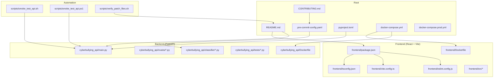
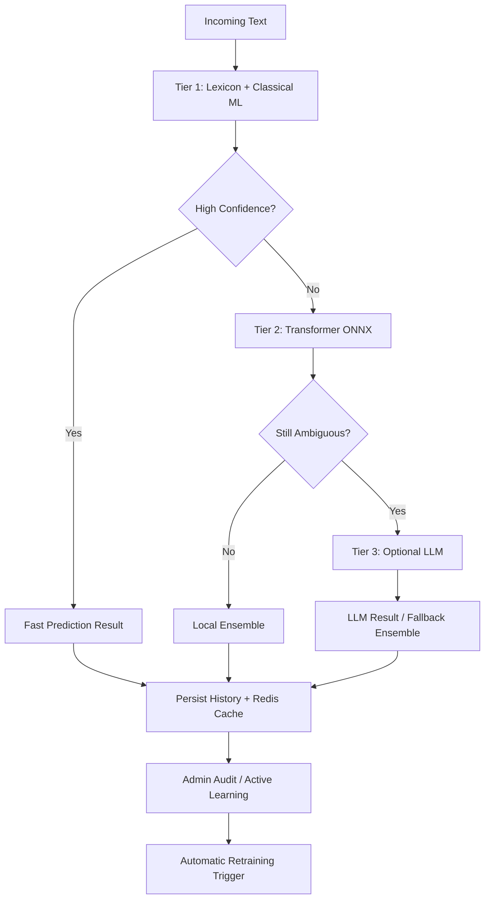
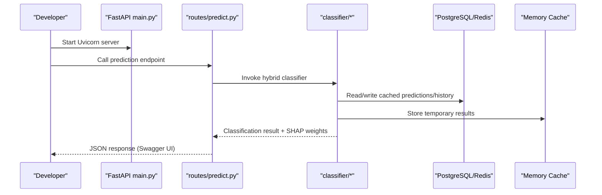
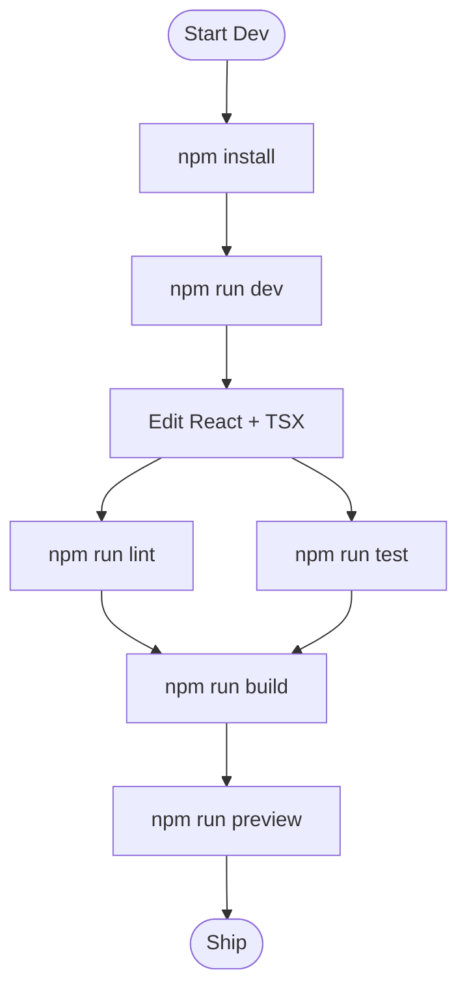
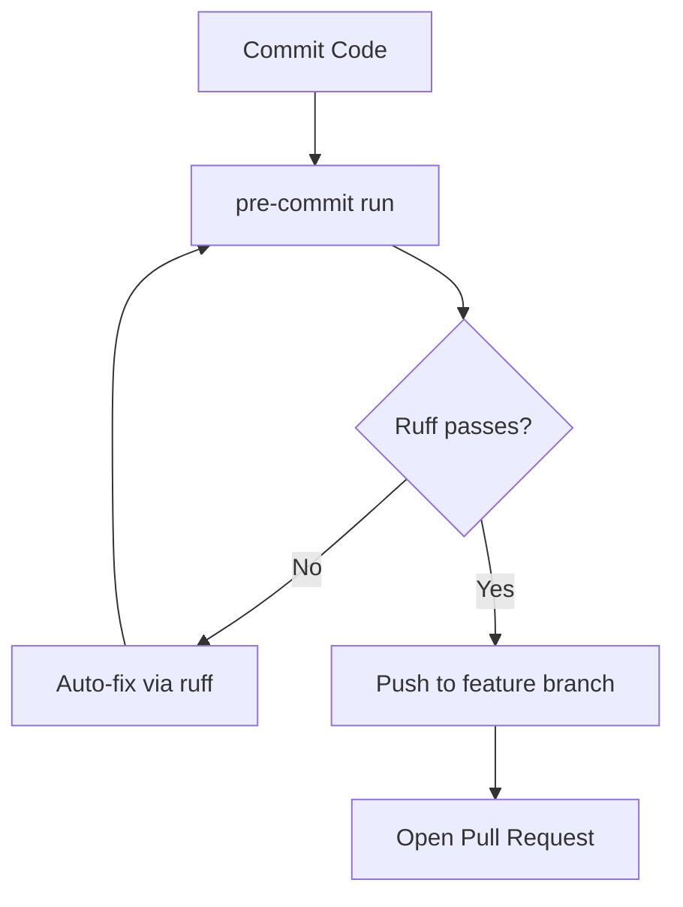
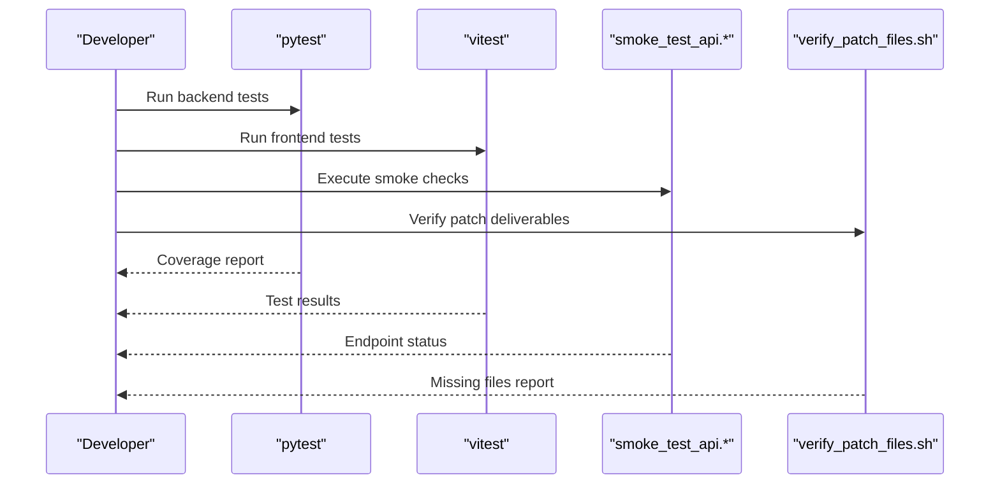
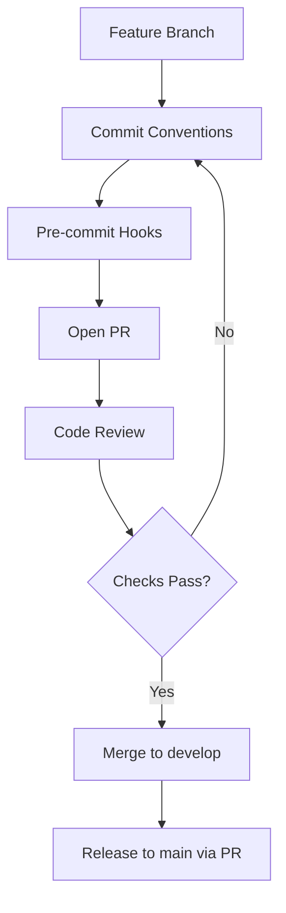
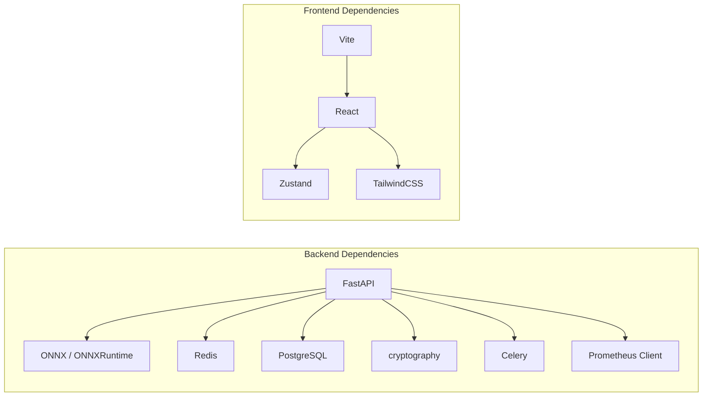

# Development Guide

<cite>
**Referenced Files in This Document**
- [README.md](file://README.md)
- [CONTRIBUTING.md](file://CONTRIBUTING.md)
- [docs/LOCAL_SETUP.md](file://docs/LOCAL_SETUP.md)
- [.pre-commit-config.yaml](file://.pre-commit-config.yaml)
- [pyproject.toml](file://pyproject.toml)
- [.github/PULL_REQUEST_TEMPLATE.md](file://.github/PULL_REQUEST_TEMPLATE.md)
- [scripts/smoke_test_api.sh](file://scripts/smoke_test_api.sh)
- [scripts/smoke_test_api.ps1](file://scripts/smoke_test_api.ps1)
- [scripts/verify_patch_files.sh](file://scripts/verify_patch_files.sh)
- [frontend/package.json](file://frontend/package.json)
- [frontend/eslint.config.js](file://frontend/eslint.config.js)
- [frontend/vite.config.ts](file://frontend/vite.config.ts)
- [frontend/tsconfig.json](file://frontend/tsconfig.json)
- [cyberbullying_api/main.py](file://cyberbullying_api/main.py)
- [cyberbullying_api/routes/predict.py](file://cyberbullying_api/routes/predict.py)
- [cyberbullying_api/routes/admin.py](file://cyberbullying_api/routes/admin.py)
- [cyberbullying_api/classifier/confidence.py](file://cyberbullying_api/classifier/confidence.py)
- [cyberbullying_api/classifier/evaluate_thresholds.py](file://cyberbullying_api/classifier/evaluate_thresholds.py)
- [cyberbullying_api/tests/test_predictions.py](file://cyberbullying_api/tests/test_predictions.py)
- [tests/test_confidence.py](file://tests/test_confidence.py)
- [docker-compose.yml](file://docker-compose.yml)
- [docker-compose.prod.yml](file://docker-compose.prod.yml)
- [cyberbullying_api/Dockerfile](file://cyberbullying_api/Dockerfile)
- [frontend/Dockerfile](file://frontend/Dockerfile)
- [run_local.sh](file://run_local.sh)
- [run_local.bat](file://run_local.bat)
</cite>

## Table of Contents
1. [Introduction](#introduction)
2. [Project Structure](#project-structure)
3. [Core Components](#core-components)
4. [Architecture Overview](#architecture-overview)
5. [Detailed Component Analysis](#detailed-component-analysis)
6. [Dependency Analysis](#dependency-analysis)
7. [Performance Considerations](#performance-considerations)
8. [Troubleshooting Guide](#troubleshooting-guide)
9. [Conclusion](#conclusion)
10. [Appendices](#appendices)

## Introduction
This development guide documents the end-to-end contribution and development workflow for BullyGuard ID. It covers environment setup, coding standards, testing strategy, pre-commit hooks, CI/CD expectations, debugging and profiling, performance optimization, common development tasks, code review, and release procedures. The guide references concrete files in the repository to ensure accuracy and reproducibility.

## Project Structure
The repository is organized into a hybrid backend/frontend system with supporting documentation, datasets, research artifacts, and automation scripts:
- Backend API built with FastAPI under cyberbullying_api/
- Frontend dashboard built with React + Vite under frontend/
- Shared documentation under docs/
- Datasets under dataset/
- Research notebooks under research/
- Automation scripts under scripts/
- Root-level configuration files for linting, packaging, and CI/CD

**Diagram sources**
- [README.md:73-103](file://README.md#L73-L103)
- [docker-compose.yml](file://docker-compose.yml)
- [docker-compose.prod.yml](file://docker-compose.prod.yml)
- [pyproject.toml:1-70](file://pyproject.toml#L1-L70)
- [.pre-commit-config.yaml:1-16](file://.pre-commit-config.yaml#L1-L16)
- [scripts/smoke_test_api.sh:1-48](file://scripts/smoke_test_api.sh#L1-L48)
- [scripts/smoke_test_api.ps1:1-53](file://scripts/smoke_test_api.ps1#L1-L53)
- [scripts/verify_patch_files.sh:1-58](file://scripts/verify_patch_files.sh#L1-L58)
- [frontend/package.json:1-41](file://frontend/package.json#L1-L41)
- [frontend/eslint.config.js:1-28](file://frontend/eslint.config.js#L1-L28)
- [frontend/vite.config.ts:1-17](file://frontend/vite.config.ts#L1-L17)
- [frontend/tsconfig.json:1-8](file://frontend/tsconfig.json#L1-L8)

**Section sources**
- [README.md:73-103](file://README.md#L73-L103)
- [docker-compose.yml](file://docker-compose.yml)
- [docker-compose.prod.yml](file://docker-compose.prod.yml)
- [pyproject.toml:1-70](file://pyproject.toml#L1-L70)
- [.pre-commit-config.yaml:1-16](file://.pre-commit-config.yaml#L1-L16)

## Core Components
- Backend API (FastAPI): Entry point main.py, routing under routes/, ML/XAI pipeline under classifier/, scraping under scraper/, training under training/, and tests under tests/.
- Frontend Dashboard (React + Vite): Components under frontend/src/components/, state management with Zustand, and build/lint/test scripts in frontend/package.json.
- Configuration and Tooling: pyproject.toml defines dependencies and pytest configuration; .pre-commit-config.yaml enforces Python formatting and hygiene; frontend ESLint config governs TypeScript linting.
- Automation: smoke tests for API health and protection; patch verification for staged deliverables.

Key implementation references:
- Backend entrypoint and routing: [cyberbullying_api/main.py](file://cyberbullying_api/main.py)
- Prediction routes: [cyberbullying_api/routes/predict.py](file://cyberbullying_api/routes/predict.py)
- Admin routes: [cyberbullying_api/routes/admin.py](file://cyberbullying_api/routes/admin.py)
- Confidence calibration and thresholds: [cyberbullying_api/classifier/confidence.py](file://cyberbullying_api/classifier/confidence.py), [cyberbullying_api/classifier/evaluate_thresholds.py](file://cyberbullying_api/classifier/evaluate_thresholds.py)
- Backend tests: [cyberbullying_api/tests/test_predictions.py](file://cyberbullying_api/tests/test_predictions.py)
- Root-level confidence tests: [tests/test_confidence.py](file://tests/test_confidence.py)
- Frontend package scripts: [frontend/package.json](file://frontend/package.json)
- Frontend ESLint config: [frontend/eslint.config.js](file://frontend/eslint.config.js)
- Frontend Vite config: [frontend/vite.config.ts](file://frontend/vite.config.ts)
- Frontend TS configs: [frontend/tsconfig.json](file://frontend/tsconfig.json)

**Section sources**
- [cyberbullying_api/main.py](file://cyberbullying_api/main.py)
- [cyberbullying_api/routes/predict.py](file://cyberbullying_api/routes/predict.py)
- [cyberbullying_api/routes/admin.py](file://cyberbullying_api/routes/admin.py)
- [cyberbullying_api/classifier/confidence.py](file://cyberbullying_api/classifier/confidence.py)
- [cyberbullying_api/classifier/evaluate_thresholds.py](file://cyberbullying_api/classifier/evaluate_thresholds.py)
- [cyberbullying_api/tests/test_predictions.py](file://cyberbullying_api/tests/test_predictions.py)
- [tests/test_confidence.py](file://tests/test_confidence.py)
- [frontend/package.json](file://frontend/package.json)
- [frontend/eslint.config.js](file://frontend/eslint.config.js)
- [frontend/vite.config.ts](file://frontend/vite.config.ts)
- [frontend/tsconfig.json](file://frontend/tsconfig.json)

## Architecture Overview
BullyGuard ID employs a hybrid multi-tier classification pipeline:
- Tier 1: Fast lexicon and statistical model for quick initial classification.
- Tier 2: Transformer ONNX for semantic depth.
- Tier 3: Optional external LLM (e.g., Gemini) for nuanced sarcasm detection.
- Caching and queue: PostgreSQL (with pgvector) and Redis for similarity, history, rate limiting, and training queues.
- Admin and HITL: Human-in-the-loop auditing and dynamic retraining triggers.
- Explainable AI: SHAP-based word importance visualization.

**Diagram sources**
- [README.md:54-69](file://README.md#L54-L69)

**Section sources**
- [README.md:50-69](file://README.md#L50-L69)

## Detailed Component Analysis

### Backend Development Workflow
- Environment setup: Python 3.11+, virtual environment, dependencies from requirements.txt, environment variables from .env.
- Running the API: Uvicorn reload server on port 8000; Swagger UI at /docs.
- Routes and endpoints: Predictions, admin, settings, training, HITL, and scraping endpoints under routes/.
- Classifier modules: confidence calibration, thresholds evaluation, database/memory caching, KMS encryption, and predictor logic under classifier/.

**Diagram sources**
- [cyberbullying_api/main.py](file://cyberbullying_api/main.py)
- [cyberbullying_api/routes/predict.py](file://cyberbullying_api/routes/predict.py)
- [cyberbullying_api/classifier/confidence.py](file://cyberbullying_api/classifier/confidence.py)

**Section sources**
- [README.md:117-177](file://README.md#L117-L177)
- [docs/LOCAL_SETUP.md:96-136](file://docs/LOCAL_SETUP.md#L96-L136)
- [CONTRIBUTING.md:42-56](file://CONTRIBUTING.md#L42-L56)
- [cyberbullying_api/main.py](file://cyberbullying_api/main.py)
- [cyberbullying_api/routes/predict.py](file://cyberbullying_api/routes/predict.py)
- [cyberbullying_api/classifier/confidence.py](file://cyberbullying_api/classifier/confidence.py)

### Frontend Development Workflow
- Environment setup: Node.js 20.x, install dependencies, run dev server on port 5173.
- Components: Modular UI under frontend/src/components/, shared stores under frontend/src/store/.
- Tooling: ESLint + TypeScript configuration, Vite test environment configured for jsdom.

**Diagram sources**
- [frontend/package.json:6-12](file://frontend/package.json#L6-L12)
- [frontend/eslint.config.js:1-28](file://frontend/eslint.config.js#L1-L28)
- [frontend/vite.config.ts:11-16](file://frontend/vite.config.ts#L11-L16)

**Section sources**
- [README.md:179-186](file://README.md#L179-L186)
- [docs/LOCAL_SETUP.md:139-149](file://docs/LOCAL_SETUP.md#L139-L149)
- [frontend/package.json](file://frontend/package.json)
- [frontend/eslint.config.js](file://frontend/eslint.config.js)
- [frontend/vite.config.ts](file://frontend/vite.config.ts)

### Coding Standards and Formatting
- Python: enforced by ruff (format and lint); pre-commit hooks apply fixes automatically.
- Frontend: ESLint + TypeScript recommended rules; formatting via Prettier is implied by toolchain.
- Commit conventions: Conventional Commits for changelog generation and history readability.

**Diagram sources**
- [.pre-commit-config.yaml:1-16](file://.pre-commit-config.yaml#L1-L16)
- [pyproject.toml:57-63](file://pyproject.toml#L57-L63)
- [CONTRIBUTING.md:21-39](file://CONTRIBUTING.md#L21-L39)

**Section sources**
- [.pre-commit-config.yaml:1-16](file://.pre-commit-config.yaml#L1-L16)
- [pyproject.toml:57-63](file://pyproject.toml#L57-L63)
- [CONTRIBUTING.md:105-115](file://CONTRIBUTING.md#L105-L115)

### Testing Strategy
- Backend unit tests: pytest with coverage thresholds; tests under cyberbullying_api/tests/ and root tests/.
- Frontend unit tests: Vitest with jsdom environment.
- Smoke tests: scripts to verify health, API key enforcement, and prediction endpoints across multiple paths.
- Patch verification: scripts to ensure all required deliverables are present during staging.

**Diagram sources**
- [pyproject.toml:65-70](file://pyproject.toml#L65-L70)
- [frontend/package.json:9-11](file://frontend/package.json#L9-L11)
- [scripts/smoke_test_api.sh:1-48](file://scripts/smoke_test_api.sh#L1-L48)
- [scripts/smoke_test_api.ps1:1-53](file://scripts/smoke_test_api.ps1#L1-L53)
- [scripts/verify_patch_files.sh:1-58](file://scripts/verify_patch_files.sh#L1-L58)

**Section sources**
- [CONTRIBUTING.md:86-102](file://CONTRIBUTING.md#L86-L102)
- [README.md:347-374](file://README.md#L347-L374)
- [pyproject.toml:65-70](file://pyproject.toml#L65-L70)
- [frontend/package.json](file://frontend/package.json)
- [scripts/smoke_test_api.sh](file://scripts/smoke_test_api.sh)
- [scripts/smoke_test_api.ps1](file://scripts/smoke_test_api.ps1)
- [scripts/verify_patch_files.sh](file://scripts/verify_patch_files.sh)

### Contribution Guidelines and Code Review
- Branching model: GitFlow-style with develop, feature/*, bugfix/*, hotfix/*, and main for production.
- Commit messages: Conventional Commits with type, scope, and description.
- Pull requests: Use the PR template checklist covering tests, style, documentation, and secrets safety.
- Security: No hardcoded secrets; secrets scanning via pre-commit hooks.

**Diagram sources**
- [CONTRIBUTING.md:9-18](file://CONTRIBUTING.md#L9-L18)
- [CONTRIBUTING.md:21-39](file://CONTRIBUTING.md#L21-L39)
- [.pre-commit-config.yaml:1-16](file://.pre-commit-config.yaml#L1-L16)
- [.github/PULL_REQUEST_TEMPLATE.md:1-27](file://.github/PULL_REQUEST_TEMPLATE.md#L1-L27)

**Section sources**
- [CONTRIBUTING.md:9-18](file://CONTRIBUTING.md#L9-L18)
- [CONTRIBUTING.md:21-39](file://CONTRIBUTING.md#L21-L39)
- [.github/PULL_REQUEST_TEMPLATE.md:1-27](file://.github/PULL_REQUEST_TEMPLATE.md#L1-L27)

### Debugging Procedures and Profiling
- Backend: Use Uvicorn reload server for iterative development; inspect structured logs and correlation IDs; enable async endpoints for prediction routes.
- Frontend: Use Vite dev server with React Fast Refresh; run tests with Vitest for isolated component logic.
- Profiling: Use Python profiling tools (cProfile, yep) and Py-Spy for production sampling; instrument Prometheus metrics where applicable.
- Containerized debugging: Use docker compose logs to monitor backend and cache services; adjust timeouts and circuit breaker behavior for fallback modes.

**Section sources**
- [README.md:152-177](file://README.md#L152-L177)
- [docs/LOCAL_SETUP.md:129-136](file://docs/LOCAL_SETUP.md#L129-L136)
- [frontend/vite.config.ts:11-16](file://frontend/vite.config.ts#L11-L16)

### Performance Optimization Workflows
- Model inference: Prefer ONNX runtime for transformer tier; tune confidence thresholds via evaluate_thresholds.
- Caching: Leverage Redis for similarity and rate limiting; fallback to SQLite + memory cache when external services are unavailable.
- Containerization: Share cache layers between API and worker images; optimize image builds and reduce image sizes.
- Monitoring: Integrate Prometheus metrics and structured logging for latency and throughput insights.

**Section sources**
- [README.md:42-46](file://README.md#L42-L46)
- [cyberbullying_api/classifier/evaluate_thresholds.py](file://cyberbullying_api/classifier/evaluate_thresholds.py)

### Practical Examples of Common Tasks
- Run backend tests: pytest with coverage configuration.
- Run frontend tests: Vitest in the frontend directory.
- Smoke test API: Execute smoke test scripts with BASE_URL and API_KEY environment variables.
- Verify patch deliverables: Run the patch verification script to ensure all required files are present.
- Quick local launch: Use run_local.sh or run_local.bat to start backend and frontend concurrently.

**Section sources**
- [pyproject.toml:65-70](file://pyproject.toml#L65-L70)
- [frontend/package.json:9-11](file://frontend/package.json#L9-L11)
- [scripts/smoke_test_api.sh:1-48](file://scripts/smoke_test_api.sh#L1-L48)
- [scripts/smoke_test_api.ps1:1-53](file://scripts/smoke_test_api.ps1#L1-L53)
- [scripts/verify_patch_files.sh:1-58](file://scripts/verify_patch_files.sh#L1-L58)
- [run_local.sh](file://run_local.sh)
- [run_local.bat](file://run_local.bat)

### Release Procedures
- Threshold calibration: Evaluate and calibrate thresholds using evaluate_thresholds prior to release.
- Model evaluation: Record metrics and decisions using the documented evaluation template.
- Production hardening: Follow the production checklist including reverse proxy, TLS, fail-closed rate limiting, and security headers.
- Rollback plan: Maintain rollback procedures aligned with patch order and deliverables.

**Section sources**
- [README.md:377-384](file://README.md#L377-L384)
- [README.md:387-392](file://README.md#L387-L392)
- [README.md:403-409](file://README.md#L403-L409)
- [scripts/verify_patch_files.sh:38-51](file://scripts/verify_patch_files.sh#L38-L51)

## Dependency Analysis
The backend depends on FastAPI, ONNX runtime, Redis, PostgreSQL, cryptography, Celery, and Prometheus client. The frontend depends on React, TailwindCSS, Zustand, and Vite tooling. Both layers integrate with Docker Compose for orchestration.

**Diagram sources**
- [pyproject.toml:21-46](file://pyproject.toml#L21-L46)
- [frontend/package.json:13-39](file://frontend/package.json#L13-L39)

**Section sources**
- [pyproject.toml:21-46](file://pyproject.toml#L21-L46)
- [frontend/package.json](file://frontend/package.json)

## Performance Considerations
- Prefer ONNX runtime for transformer inference; keep model artifacts optimized.
- Use Redis for caching and queueing; configure appropriate TTL and eviction policies.
- Monitor latency and throughput with Prometheus metrics; instrument prediction endpoints.
- Optimize Docker images and reuse cache layers to reduce build times and memory footprint.

[No sources needed since this section provides general guidance]

## Troubleshooting Guide
Common issues and resolutions:
- Backend cannot connect to PostgreSQL: verify container status and logs; confirm connection URLs and credentials.
- Redis authentication errors: align REDIS_PASSWORD in .env with docker-compose configuration.
- Unauthorized requests: ensure X-API-Key header is included for protected endpoints.
- CORS failures: whitelist frontend origins in ALLOWED_ORIGINS.

**Section sources**
- [docs/LOCAL_SETUP.md:171-191](file://docs/LOCAL_SETUP.md#L171-L191)
- [README.md:189-276](file://README.md#L189-L276)

## Conclusion
This guide consolidates BullyGuard ID’s development workflow from environment setup to testing, code quality, CI/CD expectations, debugging, and releases. By following the branching model, commit conventions, pre-commit hooks, and testing strategies outlined here, contributors can efficiently collaborate while maintaining high-quality, secure, and explainable AI classification capabilities.

[No sources needed since this section summarizes without analyzing specific files]

## Appendices

### Appendix A: Environment Variables Reference
- API_KEY: Backend API key for authentication.
- ENV: Environment mode (development).
- ALLOW_MISSING_API_KEY_IN_DEV: Permit missing API key in development.
- PG_URL: PostgreSQL connection string.
- REDIS_URL: Redis connection string.
- GEMINI_API_KEY/GEMINI_BASE_URL/GEMINI_MODEL: Optional LLM credentials and base URL.

**Section sources**
- [README.md:132-146](file://README.md#L132-L146)
- [docs/LOCAL_SETUP.md:37-51](file://docs/LOCAL_SETUP.md#L37-L51)

### Appendix B: Quick Commands Reference
- Backend tests: pytest with coverage configuration.
- Frontend tests: vitest run.
- Smoke tests: scripts/smoke_test_api.sh or scripts/smoke_test_api.ps1.
- Patch verification: scripts/verify_patch_files.sh.
- Local launch: run_local.sh (Linux/macOS) or run_local.bat (Windows).

**Section sources**
- [pyproject.toml:65-70](file://pyproject.toml#L65-L70)
- [frontend/package.json:9-11](file://frontend/package.json#L9-L11)
- [scripts/smoke_test_api.sh:1-48](file://scripts/smoke_test_api.sh#L1-L48)
- [scripts/smoke_test_api.ps1:1-53](file://scripts/smoke_test_api.ps1#L1-L53)
- [scripts/verify_patch_files.sh:1-58](file://scripts/verify_patch_files.sh#L1-L58)
- [run_local.sh](file://run_local.sh)
- [run_local.bat](file://run_local.bat)