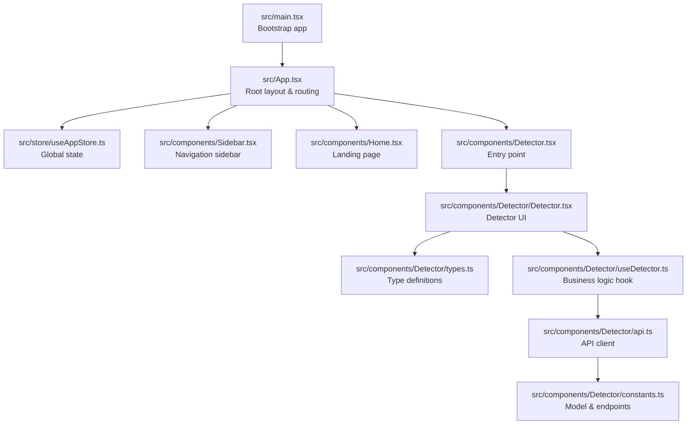
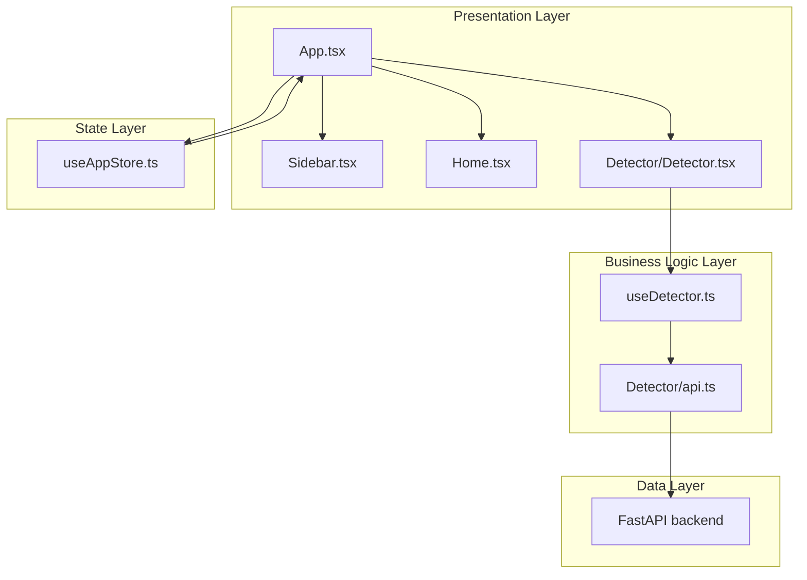
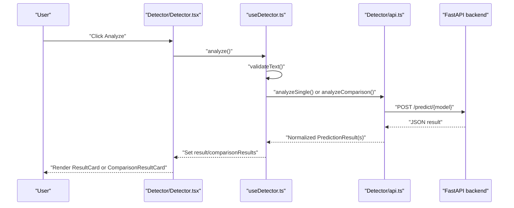
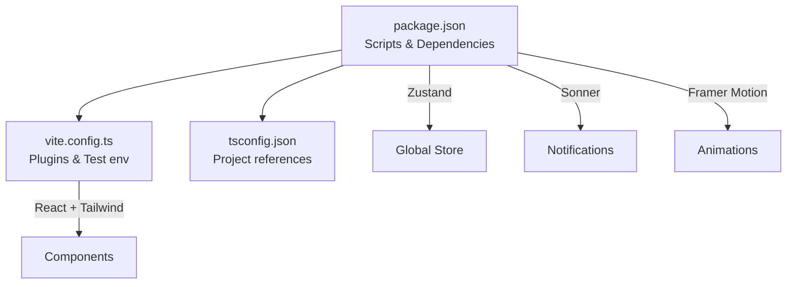

# Component Architecture and Design

<cite>
**Referenced Files in This Document**
- [App.tsx](file://frontend/src/App.tsx)
- [main.tsx](file://frontend/src/main.tsx)
- [useAppStore.ts](file://frontend/src/store/useAppStore.ts)
- [Sidebar.tsx](file://frontend/src/components/Sidebar.tsx)
- [Home.tsx](file://frontend/src/components/Home.tsx)
- [Navbar.tsx](file://frontend/src/components/Navbar.tsx)
- [Detector.tsx](file://frontend/src/components/Detector.tsx)
- [Detector/Detector.tsx](file://frontend/src/components/Detector/Detector.tsx)
- [Detector/types.ts](file://frontend/src/components/Detector/types.ts)
- [Detector/useDetector.ts](file://frontend/src/components/Detector/useDetector.ts)
- [Detector/api.ts](file://frontend/src/components/Detector/api.ts)
- [Detector/constants.ts](file://frontend/src/components/Detector/constants.ts)
- [vite.config.ts](file://frontend/vite.config.ts)
- [package.json](file://frontend/package.json)
- [tsconfig.json](file://frontend/tsconfig.json)
</cite>

## Table of Contents
1. [Introduction](#introduction)
2. [Project Structure](#project-structure)
3. [Core Components](#core-components)
4. [Architecture Overview](#architecture-overview)
5. [Detailed Component Analysis](#detailed-component-analysis)
6. [Dependency Analysis](#dependency-analysis)
7. [Performance Considerations](#performance-considerations)
8. [Troubleshooting Guide](#troubleshooting-guide)
9. [Conclusion](#conclusion)
10. [Appendices](#appendices)

## Introduction
This document describes the component architecture and design patterns of BullyGuard ID’s React TypeScript frontend. It explains the application structure, routing system, layout components, global state management, and shared utilities. It also covers component composition patterns, prop interfaces, event handling, build configuration with Vite and TypeScript, module resolution, lifecycle management, error handling, performance strategies, and practical examples for creating components, testing, and integration.

## Project Structure
The frontend is organized around a clear separation of concerns:
- Application bootstrap and root rendering live under src with main.tsx and App.tsx.
- Global state is centralized via a Zustand store in src/store.
- Feature components are grouped under src/components, with nested subfolders for complex features (e.g., Detector).
- Build and tooling are configured in vite.config.ts, package.json, and tsconfig.json.

**Diagram sources**
- [main.tsx:1-11](file://frontend/src/main.tsx#L1-L11)
- [App.tsx:14-167](file://frontend/src/App.tsx#L14-L167)
- [useAppStore.ts:48-160](file://frontend/src/store/useAppStore.ts#L48-L160)
- [Sidebar.tsx:17-253](file://frontend/src/components/Sidebar.tsx#L17-L253)
- [Home.tsx:46-494](file://frontend/src/components/Home.tsx#L46-L494)
- [Detector.tsx:1-3](file://frontend/src/components/Detector.tsx#L1-L3)
- [Detector/Detector.tsx:9-56](file://frontend/src/components/Detector/Detector.tsx#L9-L56)
- [Detector/types.ts:1-55](file://frontend/src/components/Detector/types.ts#L1-L55)
- [Detector/useDetector.ts:37-116](file://frontend/src/components/Detector/useDetector.ts#L37-L116)
- [Detector/api.ts:104-226](file://frontend/src/components/Detector/api.ts#L104-L226)
- [Detector/constants.ts:1-21](file://frontend/src/components/Detector/constants.ts#L1-L21)

**Section sources**
- [main.tsx:1-11](file://frontend/src/main.tsx#L1-L11)
- [App.tsx:14-167](file://frontend/src/App.tsx#L14-L167)
- [vite.config.ts:1-17](file://frontend/vite.config.ts#L1-L17)
- [package.json:1-41](file://frontend/package.json#L1-L41)
- [tsconfig.json:1-8](file://frontend/tsconfig.json#L1-L8)

## Core Components
- App: Orchestrates layout, theme application, sidebar visibility, content area, and footer. It manages dynamic polling for backend connectivity and renders the active tab content.
- Sidebar: Provides navigation and actions, supports desktop and mobile layouts, persists collapse state, and reflects API status.
- Home: Landing page with animated sections, metrics dashboard, and interactive charts. Fetches historical training metrics from the backend.
- Detector: Single-text detection feature with model selection, fuzzy matching, comparison mode, and XAI insights via a drawer.
- useAppStore: Centralized Zustand store managing active tab, theme, API configuration, connection status, model status, and actions like connection checks and CSV export.

Key design patterns:
- Composition over inheritance: Child components receive props and callbacks from parents.
- Hooks for cross-cutting concerns: useDetector encapsulates state and API logic.
- Centralized state: Zustand avoids prop drilling and simplifies sharing configuration and status.

**Section sources**
- [App.tsx:14-167](file://frontend/src/App.tsx#L14-L167)
- [Sidebar.tsx:17-253](file://frontend/src/components/Sidebar.tsx#L17-L253)
- [Home.tsx:46-494](file://frontend/src/components/Home.tsx#L46-L494)
- [Detector.tsx:1-3](file://frontend/src/components/Detector.tsx#L1-L3)
- [Detector/Detector.tsx:9-56](file://frontend/src/components/Detector/Detector.tsx#L9-L56)
- [Detector/useDetector.ts:37-116](file://frontend/src/components/Detector/useDetector.ts#L37-L116)
- [useAppStore.ts:48-160](file://frontend/src/store/useAppStore.ts#L48-L160)

## Architecture Overview
The frontend follows a layered architecture:
- Presentation layer: App, Sidebar, Home, Detector, and subcomponents.
- Business logic layer: useDetector and Detector API client.
- Data layer: Backend endpoints exposed by the FastAPI service.
- State layer: Zustand store for global state and persistence.

**Diagram sources**
- [App.tsx:14-167](file://frontend/src/App.tsx#L14-L167)
- [Sidebar.tsx:17-253](file://frontend/src/components/Sidebar.tsx#L17-L253)
- [Home.tsx:46-494](file://frontend/src/components/Home.tsx#L46-L494)
- [Detector/Detector.tsx:9-56](file://frontend/src/components/Detector/Detector.tsx#L9-L56)
- [Detector/useDetector.ts:37-116](file://frontend/src/components/Detector/useDetector.ts#L37-L116)
- [Detector/api.ts:104-226](file://frontend/src/components/Detector/api.ts#L104-L226)
- [useAppStore.ts:48-160](file://frontend/src/store/useAppStore.ts#L48-L160)

## Detailed Component Analysis

### App Component
Responsibilities:
- Applies theme to the document element.
- Manages dynamic polling to check backend connectivity with adaptive delays.
- Renders the main layout with optional sidebar and content area.
- Conditionally renders footer on the landing page.
- Uses motion primitives for animations and lazy loading.

Lifecycle and effects:
- Effect to sync apiStatus to a ref for polling delay calculation.
- Effect to apply theme class to documentElement.
- Effect to periodically call checkConnection with exponential backoff-like behavior based on status.

Routing and navigation:
- Uses activeTab to conditionally render content areas.
- Passes configuration props (apiUrl, apiKey) and actions to child components.

**Section sources**
- [App.tsx:14-167](file://frontend/src/App.tsx#L14-L167)
- [useAppStore.ts:84-137](file://frontend/src/store/useAppStore.ts#L84-L137)

### Sidebar Component
Responsibilities:
- Provides navigation items mapped to tabs.
- Supports collapsible desktop layout and mobile drawer.
- Persists collapse state in localStorage.
- Displays API status indicator and theme toggle.

UI behavior:
- Uses framer-motion for smooth transitions and layout animations.
- Mobile drawer slides in with backdrop overlay.

**Section sources**
- [Sidebar.tsx:17-253](file://frontend/src/components/Sidebar.tsx#L17-L253)

### Home Component
Responsibilities:
- Landing page with animated hero, feature showcase, and metrics dashboard.
- Fetches historical training metrics from the backend.
- Integrates interactive charts and word cloud visuals.

Data fetching:
- Retrieves training history with optional API key header.
- Handles loading states and errors gracefully.

**Section sources**
- [Home.tsx:46-494](file://frontend/src/components/Home.tsx#L46-L494)

### Detector Feature
Overview:
- Entry point re-exports the main Detector component and exposes its types.
- The main Detector component composes InputPanel, ResultCard/ComparisonResultCard, and XaiDrawer.
- useDetector encapsulates validation, state, and async analysis flows.
- api.ts centralizes endpoint selection, request building, normalization, and offline fallbacks.

**Diagram sources**
- [Detector/Detector.tsx:9-56](file://frontend/src/components/Detector/Detector.tsx#L9-L56)
- [Detector/useDetector.ts:52-100](file://frontend/src/components/Detector/useDetector.ts#L52-L100)
- [Detector/api.ts:104-165](file://frontend/src/components/Detector/api.ts#L104-L165)

#### Detector Types and Interfaces
- ModelId union defines supported models.
- DetectorProps carries API configuration.
- PredictionResult and ComparisonResult unify backend responses.
- DetectorState tracks UI state for the detector.

**Section sources**
- [Detector/types.ts:1-55](file://frontend/src/components/Detector/types.ts#L1-L55)

#### useDetector Hook
- Validates input length and emptiness.
- Supports single and comparison modes.
- Resets output before new analysis.
- Provides offline fallback with simulated results.

**Section sources**
- [Detector/useDetector.ts:37-116](file://frontend/src/components/Detector/useDetector.ts#L37-L116)

#### Detector API Client
- Builds headers with optional API key.
- Selects endpoint based on model.
- Normalizes diverse backend shapes into a unified result.
- Implements offline fallback and comparison across endpoints.

**Section sources**
- [Detector/api.ts:45-130](file://frontend/src/components/Detector/api.ts#L45-L130)
- [Detector/api.ts:132-226](file://frontend/src/components/Detector/api.ts#L132-L226)

#### Constants and Options
- Defines model options and comparison endpoints.
- Enforces text length limits.

**Section sources**
- [Detector/constants.ts:1-21](file://frontend/src/components/Detector/constants.ts#L1-L21)

### Global State Management (Zustand)
Responsibilities:
- Stores activeTab, theme, API configuration, and statuses.
- Provides actions: checkConnection, handleExportCSV.
- Persists theme and API credentials to localStorage.
- Manages model status fetched from backend.

Patterns:
- Slice-based state with actions.
- Encapsulated side effects and optimistic updates.

**Section sources**
- [useAppStore.ts:48-160](file://frontend/src/store/useAppStore.ts#L48-L160)

### Routing and Layout
- App uses activeTab to render the appropriate content area.
- Sidebar and Navbar both update activeTab.
- Home is treated as a special route with distinct layout and footer.

**Section sources**
- [App.tsx:89-139](file://frontend/src/App.tsx#L89-L139)
- [Navbar.tsx:13-162](file://frontend/src/components/Navbar.tsx#L13-L162)

## Dependency Analysis
External libraries and tooling:
- React and ReactDOM for UI rendering.
- Framer Motion for animations and reduced motion support.
- TailwindCSS and @tailwindcss/vite for styling.
- Sonner for notifications.
- ZUSTAND for global state.
- Vite for dev server and build.
- TypeScript for type safety.

Build and test configuration:
- Vite config enables React plugin and Tailwind integration, plus Vitest environment.
- package.json scripts define dev, build, lint, test, and preview commands.
- tsconfig.json uses project references for app and node configurations.

**Diagram sources**
- [package.json:1-41](file://frontend/package.json#L1-L41)
- [vite.config.ts:1-17](file://frontend/vite.config.ts#L1-L17)
- [tsconfig.json:1-8](file://frontend/tsconfig.json#L1-L8)

**Section sources**
- [package.json:1-41](file://frontend/package.json#L1-L41)
- [vite.config.ts:1-17](file://frontend/vite.config.ts#L1-L17)
- [tsconfig.json:1-8](file://frontend/tsconfig.json#L1-L8)

## Performance Considerations
- Animation optimization: Reduced motion detection and lazy animation features reduce unnecessary work.
- Conditional rendering: AnimatePresence ensures smooth transitions and unmounts unused content.
- Polling strategy: Adaptive delays based on apiStatus prevent excessive network calls.
- Local storage caching: Sidebar collapse state and theme persistence avoid re-computation.
- Offline fallback: Detector provides immediate feedback when backend is unavailable.
- Bundle size: Vite and React plugin enable efficient builds; keep imports scoped to minimize bundle bloat.

[No sources needed since this section provides general guidance]

## Troubleshooting Guide
Common issues and resolutions:
- API connectivity failures:
  - App triggers checkConnection on interval; offline status sets modelStatus to null and shows error toast.
  - Detector falls back to sandbox simulation and displays a success toast after a short delay.
- Text validation errors:
  - useDetector validates empty or too-long text and shows error toasts.
- Export CSV:
  - handleExportCSV generates a UTF-8 CSV with a BOM and downloads a file with a timestamped name.

**Section sources**
- [useAppStore.ts:84-137](file://frontend/src/store/useAppStore.ts#L84-L137)
- [Detector/useDetector.ts:23-35](file://frontend/src/components/Detector/useDetector.ts#L23-L35)
- [Detector/useDetector.ts:87-96](file://frontend/src/components/Detector/useDetector.ts#L87-L96)
- [useAppStore.ts:139-159](file://frontend/src/store/useAppStore.ts#L139-L159)

## Conclusion
BullyGuard ID’s frontend employs a clean, modular architecture with clear separation between presentation, business logic, and state. React hooks and Zustand simplify state management and cross-cutting concerns. The Detector feature demonstrates robust patterns for validation, API orchestration, normalization, and offline resilience. Tooling via Vite, TypeScript, and Tailwind delivers a maintainable and performant developer experience.

[No sources needed since this section summarizes without analyzing specific files]

## Appendices

### Component Composition Patterns
- Props-first design: Components receive configuration and callbacks via typed props.
- Composition via children: App composes Sidebar and content areas based on activeTab.
- Hook extraction: useDetector isolates stateful logic and side effects.

**Section sources**
- [App.tsx:89-139](file://frontend/src/App.tsx#L89-L139)
- [Detector/Detector.tsx:9-56](file://frontend/src/components/Detector/Detector.tsx#L9-L56)
- [Detector/useDetector.ts:37-116](file://frontend/src/components/Detector/useDetector.ts#L37-L116)

### Event Handling Mechanisms
- Controlled inputs: Detector’s InputPanel receives setters for text, model, and fuzzy toggles.
- Action dispatchers: Components call setters and actions from the store or hooks.
- Click handlers: Sidebar and Navbar update activeTab and manage mobile drawers.

**Section sources**
- [Detector/Detector.tsx:22-32](file://frontend/src/components/Detector/Detector.tsx#L22-L32)
- [Sidebar.tsx:88-94](file://frontend/src/components/Sidebar.tsx#L88-L94)
- [Navbar.tsx:46-63](file://frontend/src/components/Navbar.tsx#L46-L63)

### Testing Approaches
- Unit tests for hooks and utilities:
  - useDetector: validate input, simulate analyzeSingle and analyzeComparison, assert state transitions.
  - Detector/api: mock fetch responses, assert normalization and offline fallback.
- Snapshot and integration tests:
  - Render App with different activeTab states and assert layout differences.
  - Verify Sidebar collapse state persistence across reloads.

**Section sources**
- [Detector/useDetector.ts:37-116](file://frontend/src/components/Detector/useDetector.ts#L37-L116)
- [Detector/api.ts:104-226](file://frontend/src/components/Detector/api.ts#L104-L226)
- [vite.config.ts:11-16](file://frontend/vite.config.ts#L11-L16)

### Integration Patterns
- API configuration propagation:
  - App passes apiUrl and apiKey down to Detector and other features.
  - Detector/api builds headers dynamically from apiKey.
- Offline resilience:
  - Detector falls back to sandbox simulation when backend is unreachable.
  - Sidebar reflects apiStatus with pulsing indicators.

**Section sources**
- [App.tsx:101-137](file://frontend/src/App.tsx#L101-L137)
- [Detector/api.ts:167-208](file://frontend/src/components/Detector/api.ts#L167-L208)
- [Sidebar.tsx:157-183](file://frontend/src/components/Sidebar.tsx#L157-L183)