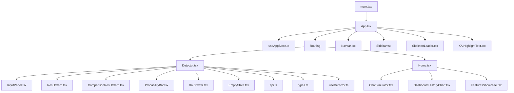
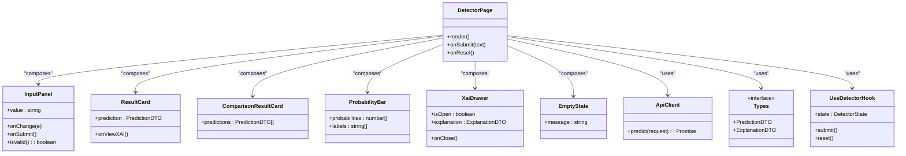
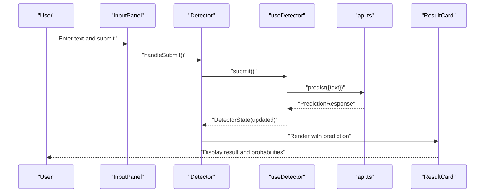
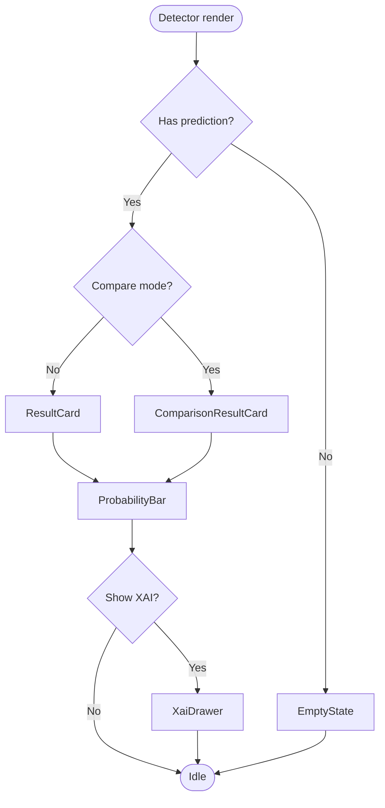
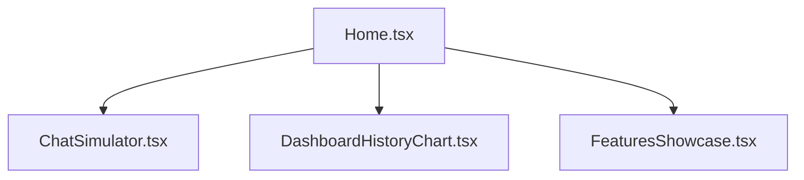
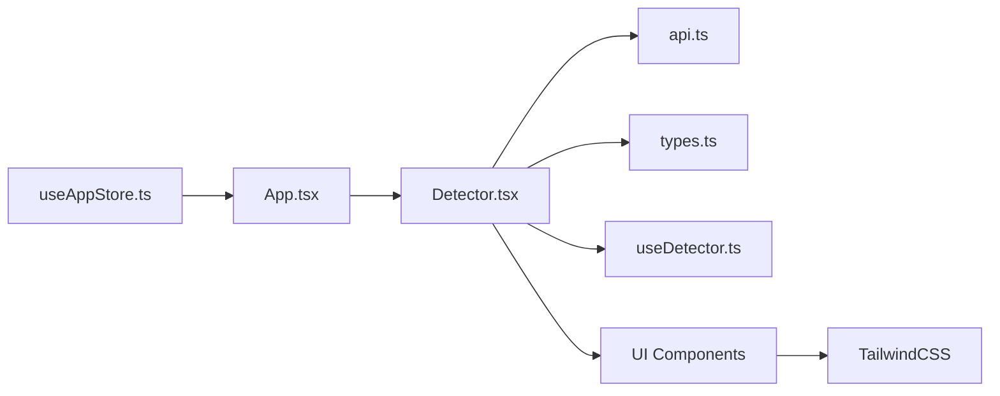

# Frontend Application

<cite>
**Referenced Files in This Document**
- [App.tsx](file://frontend/src/App.tsx)
- [main.tsx](file://frontend/src/main.tsx)
- [useAppStore.ts](file://frontend/src/store/useAppStore.ts)
- [Detector.tsx](file://frontend/src/components/Detector.tsx)
- [InputPanel.tsx](file://frontend/src/components/Detector/InputPanel.tsx)
- [ResultCard.tsx](file://frontend/src/components/Detector/ResultCard.tsx)
- [ComparisonResultCard.tsx](file://frontend/src/components/Detector/ComparisonResultCard.tsx)
- [ProbabilityBar.tsx](file://frontend/src/components/Detector/ProbabilityBar.tsx)
- [XaiDrawer.tsx](file://frontend/src/components/Detector/XaiDrawer.tsx)
- [EmptyState.tsx](file://frontend/src/components/Detector/EmptyState.tsx)
- [api.ts](file://frontend/src/components/Detector/api.ts)
- [types.ts](file://frontend/src/components/Detector/types.ts)
- [useDetector.ts](file://frontend/src/components/Detector/useDetector.ts)
- [Home.tsx](file://frontend/src/components/Home.tsx)
- [ChatSimulator.tsx](file://frontend/src/components/Home/ChatSimulator.tsx)
- [DashboardHistoryChart.tsx](file://frontend/src/components/Home/DashboardHistoryChart.tsx)
- [FeaturesShowcase.tsx](file://frontend/src/components/Home/FeaturesShowcase.tsx)
- [ActiveLearning.tsx](file://frontend/src/components/ActiveLearning.tsx)
- [BatchAnalysis.tsx](file://frontend/src/components/BatchAnalysis.tsx)
- [Navbar.tsx](file://frontend/src/components/Navbar.tsx)
- [Sidebar.tsx](file://frontend/src/components/Sidebar.tsx)
- [SkeletonLoader.tsx](file://frontend/src/components/SkeletonLoader.tsx)
- [SocialScraper.tsx](file://frontend/src/components/SocialScraper.tsx)
- [XAIHighlightText.tsx](file://frontend/src/components/XAIHighlightText.tsx)
- [package.json](file://frontend/package.json)
- [vite.config.ts](file://frontend/vite.config.ts)
- [index.html](file://frontend/index.html)
</cite>

## Table of Contents
1. [Introduction](#introduction)
2. [Project Structure](#project-structure)
3. [Core Components](#core-components)
4. [Architecture Overview](#architecture-overview)
5. [Detailed Component Analysis](#detailed-component-analysis)
6. [Dependency Analysis](#dependency-analysis)
7. [Performance Considerations](#performance-considerations)
8. [Troubleshooting Guide](#troubleshooting-guide)
9. [Conclusion](#conclusion)

## Introduction
This document describes the frontend application for BullyGuard ID’s React TypeScript dashboard. It focuses on the Detector interface, Admin dashboard, Home page, and utility components. It explains state management via Zustand, API integration patterns, real-time data handling, and the user interface components including the text input panel, result visualization cards, probability bars, and XAI explanation displays. Practical usage patterns, TailwindCSS styling, responsive design, backend integration, error handling, loading states, and user feedback mechanisms are covered.

## Project Structure
The frontend is organized by feature and domain:
- Root entry points: App.tsx, main.tsx
- Store: Zustand-based global state
- Feature modules:
  - Detector: prediction UI, result cards, XAI drawer, input panel, probability bar
  - Home: dashboard overview, chat simulator, history chart, features showcase
  - Admin and auxiliary pages: ActiveLearning, BatchAnalysis, SocialScraper
- Shared components: Navbar, Sidebar, SkeletonLoader, XAIHighlightText
- Utilities: API client, types, detector hooks, constants

```mermaid
graph TB
subgraph "Entry"
MAIN["main.tsx"]
APP["App.tsx"]
end
subgraph "Store"
ZUSTAND["useAppStore.ts"]
end
subgraph "Detector"
DET_PAGE["Detector.tsx"]
INPUT["InputPanel.tsx"]
RESULT["ResultCard.tsx"]
COMPARE["ComparisonResultCard.tsx"]
PROB["ProbabilityBar.tsx"]
XAI["XaiDrawer.tsx"]
EMPTY["EmptyState.tsx"]
API["api.ts"]
TYPES["types.ts"]
USEDET["useDetector.ts"]
end
subgraph "Home"
HOME["Home.tsx"]
CHAT["ChatSimulator.tsx"]
CHART["DashboardHistoryChart.tsx"]
FEAT["FeaturesShowcase.tsx"]
end
subgraph "Admin & Others"
ACTIVE["ActiveLearning.tsx"]
BATCH["BatchAnalysis.tsx"]
SOCIAL["SocialScraper.tsx"]
end
subgraph "Shared"
NAV["Navbar.tsx"]
SIDE["Sidebar.tsx"]
SKELETON["SkeletonLoader.tsx"]
XAIHL["XAIHighlightText.tsx"]
end
MAIN --> APP
APP --> ZUSTAND
APP --> DET_PAGE
APP --> HOME
APP --> ACTIVE
APP --> BATCH
APP --> SOCIAL
DET_PAGE --> INPUT
DET_PAGE --> RESULT
DET_PAGE --> COMPARE
DET_PAGE --> PROB
DET_PAGE --> XAI
DET_PAGE --> EMPTY
DET_PAGE --> API
DET_PAGE --> TYPES
DET_PAGE --> USEDET
HOME --> CHAT
HOME --> CHART
HOME --> FEAT
APP --> NAV
APP --> SIDE
APP --> SKELETON
APP --> XAIHL
```

**Diagram sources**
- [main.tsx](file://frontend/src/main.tsx)
- [App.tsx](file://frontend/src/App.tsx)
- [useAppStore.ts](file://frontend/src/store/useAppStore.ts)
- [Detector.tsx](file://frontend/src/components/Detector.tsx)
- [InputPanel.tsx](file://frontend/src/components/Detector/InputPanel.tsx)
- [ResultCard.tsx](file://frontend/src/components/Detector/ResultCard.tsx)
- [ComparisonResultCard.tsx](file://frontend/src/components/Detector/ComparisonResultCard.tsx)
- [ProbabilityBar.tsx](file://frontend/src/components/Detector/ProbabilityBar.tsx)
- [XaiDrawer.tsx](file://frontend/src/components/Detector/XaiDrawer.tsx)
- [EmptyState.tsx](file://frontend/src/components/Detector/EmptyState.tsx)
- [api.ts](file://frontend/src/components/Detector/api.ts)
- [types.ts](file://frontend/src/components/Detector/types.ts)
- [useDetector.ts](file://frontend/src/components/Detector/useDetector.ts)
- [Home.tsx](file://frontend/src/components/Home.tsx)
- [ChatSimulator.tsx](file://frontend/src/components/Home/ChatSimulator.tsx)
- [DashboardHistoryChart.tsx](file://frontend/src/components/Home/DashboardHistoryChart.tsx)
- [FeaturesShowcase.tsx](file://frontend/src/components/Home/FeaturesShowcase.tsx)
- [ActiveLearning.tsx](file://frontend/src/components/ActiveLearning.tsx)
- [BatchAnalysis.tsx](file://frontend/src/components/BatchAnalysis.tsx)
- [SocialScraper.tsx](file://frontend/src/components/SocialScraper.tsx)
- [Navbar.tsx](file://frontend/src/components/Navbar.tsx)
- [Sidebar.tsx](file://frontend/src/components/Sidebar.tsx)
- [SkeletonLoader.tsx](file://frontend/src/components/SkeletonLoader.tsx)
- [XAIHighlightText.tsx](file://frontend/src/components/XAIHighlightText.tsx)

**Section sources**
- [main.tsx](file://frontend/src/main.tsx)
- [App.tsx](file://frontend/src/App.tsx)
- [useAppStore.ts](file://frontend/src/store/useAppStore.ts)

## Core Components
- Detector module: Central prediction UI with input panel, result cards, comparison card, probability visualization, XAI drawer, and empty state.
- Home module: Overview page with interactive chat simulator, historical dashboard chart, and feature showcase.
- Admin and auxiliary modules: Active learning, batch analysis, and social scraping integrations.
- Shared components: Navigation, sidebar, skeleton loader, and XAI highlight text.
- State management: Zustand store for global state and detector-specific hooks for prediction lifecycle.

Key implementation patterns:
- Composition: Detector page composes InputPanel, ResultCard(s), ProbabilityBar, XaiDrawer, and EmptyState.
- Hooks: useDetector encapsulates prediction lifecycle and state transitions.
- API client: Centralized fetch wrapper with typed requests/responses.
- Types: Strongly typed DTOs for predictions, explanations, and UI state.

**Section sources**
- [Detector.tsx](file://frontend/src/components/Detector.tsx)
- [InputPanel.tsx](file://frontend/src/components/Detector/InputPanel.tsx)
- [ResultCard.tsx](file://frontend/src/components/Detector/ResultCard.tsx)
- [ComparisonResultCard.tsx](file://frontend/src/components/Detector/ComparisonResultCard.tsx)
- [ProbabilityBar.tsx](file://frontend/src/components/Detector/ProbabilityBar.tsx)
- [XaiDrawer.tsx](file://frontend/src/components/Detector/XaiDrawer.tsx)
- [EmptyState.tsx](file://frontend/src/components/Detector/EmptyState.tsx)
- [api.ts](file://frontend/src/components/Detector/api.ts)
- [types.ts](file://frontend/src/components/Detector/types.ts)
- [useDetector.ts](file://frontend/src/components/Detector/useDetector.ts)
- [Home.tsx](file://frontend/src/components/Home.tsx)
- [ChatSimulator.tsx](file://frontend/src/components/Home/ChatSimulator.tsx)
- [DashboardHistoryChart.tsx](file://frontend/src/components/Home/DashboardHistoryChart.tsx)
- [FeaturesShowcase.tsx](file://frontend/src/components/Home/FeaturesShowcase.tsx)
- [ActiveLearning.tsx](file://frontend/src/components/ActiveLearning.tsx)
- [BatchAnalysis.tsx](file://frontend/src/components/BatchAnalysis.tsx)
- [SocialScraper.tsx](file://frontend/src/components/SocialScraper.tsx)
- [Navbar.tsx](file://frontend/src/components/Navbar.tsx)
- [Sidebar.tsx](file://frontend/src/components/Sidebar.tsx)
- [SkeletonLoader.tsx](file://frontend/src/components/SkeletonLoader.tsx)
- [XAIHighlightText.tsx](file://frontend/src/components/XAIHighlightText.tsx)

## Architecture Overview
High-level flow:
- Entry: main.tsx renders App.tsx.
- App.tsx orchestrates routing and global store initialization.
- Detector page handles user input, triggers prediction, and renders results with XAI explanations.
- Home page provides overview and analytics visuals.
- Shared components provide navigation and layout.
- Zustand store manages global UI and session state.

**Diagram sources**
- [main.tsx](file://frontend/src/main.tsx)
- [App.tsx](file://frontend/src/App.tsx)
- [useAppStore.ts](file://frontend/src/store/useAppStore.ts)
- [Detector.tsx](file://frontend/src/components/Detector.tsx)
- [InputPanel.tsx](file://frontend/src/components/Detector/InputPanel.tsx)
- [ResultCard.tsx](file://frontend/src/components/Detector/ResultCard.tsx)
- [ComparisonResultCard.tsx](file://frontend/src/components/Detector/ComparisonResultCard.tsx)
- [ProbabilityBar.tsx](file://frontend/src/components/Detector/ProbabilityBar.tsx)
- [XaiDrawer.tsx](file://frontend/src/components/Detector/XaiDrawer.tsx)
- [EmptyState.tsx](file://frontend/src/components/Detector/EmptyState.tsx)
- [api.ts](file://frontend/src/components/Detector/api.ts)
- [types.ts](file://frontend/src/components/Detector/types.ts)
- [useDetector.ts](file://frontend/src/components/Detector/useDetector.ts)
- [Home.tsx](file://frontend/src/components/Home.tsx)
- [ChatSimulator.tsx](file://frontend/src/components/Home/ChatSimulator.tsx)
- [DashboardHistoryChart.tsx](file://frontend/src/components/Home/DashboardHistoryChart.tsx)
- [FeaturesShowcase.tsx](file://frontend/src/components/Home/FeaturesShowcase.tsx)
- [Navbar.tsx](file://frontend/src/components/Navbar.tsx)
- [Sidebar.tsx](file://frontend/src/components/Sidebar.tsx)
- [SkeletonLoader.tsx](file://frontend/src/components/SkeletonLoader.tsx)
- [XAIHighlightText.tsx](file://frontend/src/components/XAIHighlightText.tsx)

## Detailed Component Analysis

### Detector Module
The Detector module provides the core prediction experience:
- Detector.tsx: Orchestrates the prediction flow, composes child components, and manages loading/error states.
- InputPanel.tsx: Text input area with validation and submit handler.
- ResultCard.tsx: Displays primary prediction outcome and confidence metrics.
- ComparisonResultCard.tsx: Optional comparative view for multiple predictions.
- ProbabilityBar.tsx: Visual probability distribution rendering.
- XaiDrawer.tsx: Drawer-based explanation panel for XAI insights.
- EmptyState.tsx: Placeholder UI when no prediction exists.
- api.ts: Typed API client for prediction endpoints.
- types.ts: Strongly typed request/response interfaces.
- useDetector.ts: Hook encapsulating prediction lifecycle and state transitions.

**Diagram sources**
- [Detector.tsx](file://frontend/src/components/Detector.tsx)
- [InputPanel.tsx](file://frontend/src/components/Detector/InputPanel.tsx)
- [ResultCard.tsx](file://frontend/src/components/Detector/ResultCard.tsx)
- [ComparisonResultCard.tsx](file://frontend/src/components/Detector/ComparisonResultCard.tsx)
- [ProbabilityBar.tsx](file://frontend/src/components/Detector/ProbabilityBar.tsx)
- [XaiDrawer.tsx](file://frontend/src/components/Detector/XaiDrawer.tsx)
- [EmptyState.tsx](file://frontend/src/components/Detector/EmptyState.tsx)
- [api.ts](file://frontend/src/components/Detector/api.ts)
- [types.ts](file://frontend/src/components/Detector/types.ts)
- [useDetector.ts](file://frontend/src/components/Detector/useDetector.ts)

#### Prediction Lifecycle Sequence

**Diagram sources**
- [InputPanel.tsx](file://frontend/src/components/Detector/InputPanel.tsx)
- [Detector.tsx](file://frontend/src/components/Detector.tsx)
- [useDetector.ts](file://frontend/src/components/Detector/useDetector.ts)
- [api.ts](file://frontend/src/components/Detector/api.ts)
- [ResultCard.tsx](file://frontend/src/components/Detector/ResultCard.tsx)

#### Conditional Rendering Flow

**Diagram sources**
- [Detector.tsx](file://frontend/src/components/Detector.tsx)
- [EmptyState.tsx](file://frontend/src/components/Detector/EmptyState.tsx)
- [ComparisonResultCard.tsx](file://frontend/src/components/Detector/ComparisonResultCard.tsx)
- [ResultCard.tsx](file://frontend/src/components/Detector/ResultCard.tsx)
- [ProbabilityBar.tsx](file://frontend/src/components/Detector/ProbabilityBar.tsx)
- [XaiDrawer.tsx](file://frontend/src/components/Detector/XaiDrawer.tsx)

**Section sources**
- [Detector.tsx](file://frontend/src/components/Detector.tsx)
- [InputPanel.tsx](file://frontend/src/components/Detector/InputPanel.tsx)
- [ResultCard.tsx](file://frontend/src/components/Detector/ResultCard.tsx)
- [ComparisonResultCard.tsx](file://frontend/src/components/Detector/ComparisonResultCard.tsx)
- [ProbabilityBar.tsx](file://frontend/src/components/Detector/ProbabilityBar.tsx)
- [XaiDrawer.tsx](file://frontend/src/components/Detector/XaiDrawer.tsx)
- [EmptyState.tsx](file://frontend/src/components/Detector/EmptyState.tsx)
- [api.ts](file://frontend/src/components/Detector/api.ts)
- [types.ts](file://frontend/src/components/Detector/types.ts)
- [useDetector.ts](file://frontend/src/components/Detector/useDetector.ts)

### Home Page
The Home page provides an overview and interactive elements:
- Home.tsx: Main landing page composing features, chat simulator, and charts.
- ChatSimulator.tsx: Interactive demo of the detector with sample prompts.
- DashboardHistoryChart.tsx: Historical prediction trend visualization.
- FeaturesShowcase.tsx: Highlights platform capabilities.

**Diagram sources**
- [Home.tsx](file://frontend/src/components/Home.tsx)
- [ChatSimulator.tsx](file://frontend/src/components/Home/ChatSimulator.tsx)
- [DashboardHistoryChart.tsx](file://frontend/src/components/Home/DashboardHistoryChart.tsx)
- [FeaturesShowcase.tsx](file://frontend/src/components/Home/FeaturesShowcase.tsx)

**Section sources**
- [Home.tsx](file://frontend/src/components/Home.tsx)
- [ChatSimulator.tsx](file://frontend/src/components/Home/ChatSimulator.tsx)
- [DashboardHistoryChart.tsx](file://frontend/src/components/Home/DashboardHistoryChart.tsx)
- [FeaturesShowcase.tsx](file://frontend/src/components/Home/FeaturesShowcase.tsx)

### Admin and Auxiliary Modules
- ActiveLearning.tsx: Active learning workflow components.
- BatchAnalysis.tsx: Batch prediction submission and results.
- SocialScraper.tsx: Social media scraping integration UI.

These modules integrate with backend admin endpoints and share common UI patterns with the rest of the app.

**Section sources**
- [ActiveLearning.tsx](file://frontend/src/components/ActiveLearning.tsx)
- [BatchAnalysis.tsx](file://frontend/src/components/BatchAnalysis.tsx)
- [SocialScraper.tsx](file://frontend/src/components/SocialScraper.tsx)

### Shared Components
- Navbar.tsx and Sidebar.tsx: Layout scaffolding for navigation.
- SkeletonLoader.tsx: Loading placeholders for async content.
- XAIHighlightText.tsx: Highlighting utility for explanation spans.

**Section sources**
- [Navbar.tsx](file://frontend/src/components/Navbar.tsx)
- [Sidebar.tsx](file://frontend/src/components/Sidebar.tsx)
- [SkeletonLoader.tsx](file://frontend/src/components/SkeletonLoader.tsx)
- [XAIHighlightText.tsx](file://frontend/src/components/XAIHighlightText.tsx)

## Dependency Analysis
- Global state: Zustand store for cross-component state sharing.
- Local state: Detector hook encapsulates prediction state transitions.
- API client: Centralized, typed HTTP client for model predictions.
- Routing: App.tsx orchestrates navigation between pages.
- Styling: TailwindCSS classes applied across components for responsive design.

**Diagram sources**
- [useAppStore.ts](file://frontend/src/store/useAppStore.ts)
- [App.tsx](file://frontend/src/App.tsx)
- [Detector.tsx](file://frontend/src/components/Detector.tsx)
- [api.ts](file://frontend/src/components/Detector/api.ts)
- [types.ts](file://frontend/src/components/Detector/types.ts)
- [useDetector.ts](file://frontend/src/components/Detector/useDetector.ts)

**Section sources**
- [useAppStore.ts](file://frontend/src/store/useAppStore.ts)
- [App.tsx](file://frontend/src/App.tsx)
- [Detector.tsx](file://frontend/src/components/Detector.tsx)
- [api.ts](file://frontend/src/components/Detector/api.ts)
- [types.ts](file://frontend/src/components/Detector/types.ts)
- [useDetector.ts](file://frontend/src/components/Detector/useDetector.ts)

## Performance Considerations
- Minimize re-renders: Keep prediction state local to the Detector page and avoid unnecessary props drilling.
- Debounce input: Optionally debounce text input to reduce API calls during rapid typing.
- Virtualization: For long lists of predictions or explanations, consider virtualized lists.
- Lazy loading: Defer heavy components until needed.
- Tailwind utilities: Prefer utility classes for minimal CSS overhead.

## Troubleshooting Guide
Common issues and resolutions:
- No prediction returned: Verify input validation and handle empty/invalid input gracefully.
- API errors: Implement retry logic and user-friendly error messages.
- Loading states: Ensure SkeletonLoader is shown while fetching predictions.
- XAI drawer not opening: Confirm state synchronization and event handlers.
- Responsive layout: Use Tailwind breakpoints to maintain usability on small screens.

**Section sources**
- [InputPanel.tsx](file://frontend/src/components/Detector/InputPanel.tsx)
- [Detector.tsx](file://frontend/src/components/Detector.tsx)
- [api.ts](file://frontend/src/components/Detector/api.ts)
- [SkeletonLoader.tsx](file://frontend/src/components/SkeletonLoader.tsx)
- [XaiDrawer.tsx](file://frontend/src/components/Detector/XaiDrawer.tsx)

## Conclusion
The BullyGuard ID React TypeScript dashboard is structured around a cohesive Detector module, complemented by a Home overview, admin workflows, and shared UI components. Zustand enables efficient state management, while a typed API client ensures robust integration with backend prediction services. The UI emphasizes clarity with result cards, probability bars, and XAI explanations, supported by responsive design and loading states for excellent user feedback.