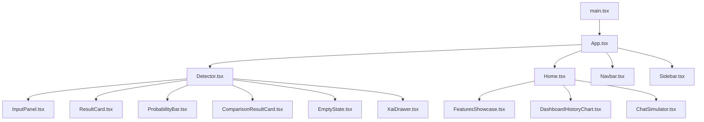
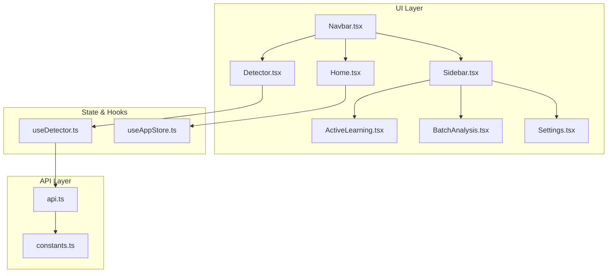
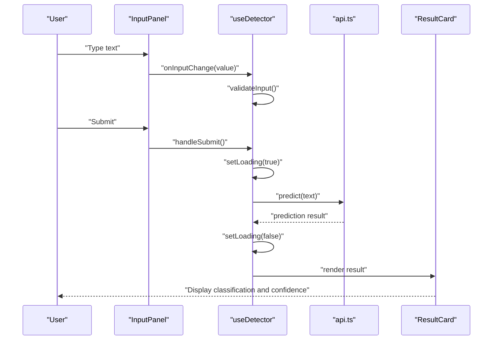
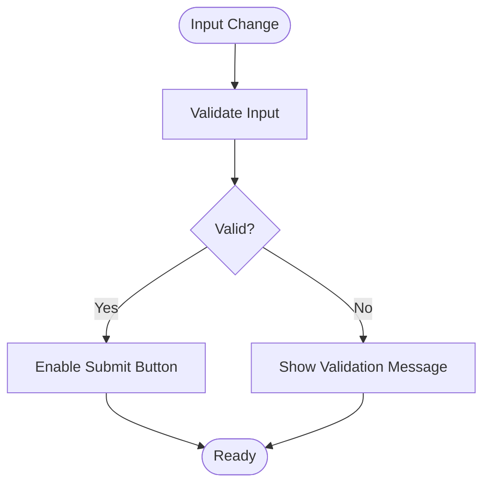
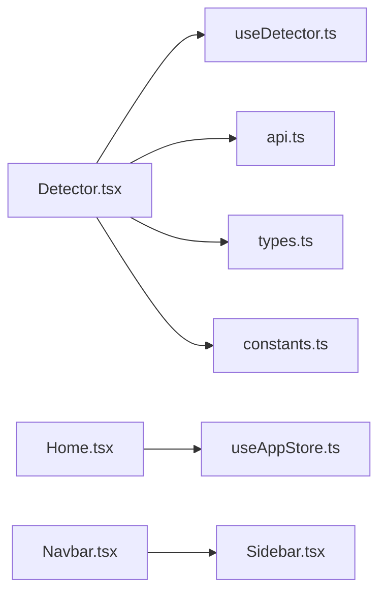

# Main User Interfaces

<cite>
**Referenced Files in This Document**
- [App.tsx](file://frontend/src/App.tsx)
- [main.tsx](file://frontend/src/main.tsx)
- [index.html](file://frontend/index.html)
- [package.json](file://frontend/package.json)
- [vite.config.ts](file://frontend/vite.config.ts)
- [Detector.tsx](file://frontend/src/components/Detector.tsx)
- [InputPanel.tsx](file://frontend/src/components/Detector/InputPanel.tsx)
- [ResultCard.tsx](file://frontend/src/components/Detector/ResultCard.tsx)
- [ComparisonResultCard.tsx](file://frontend/src/components/Detector/ComparisonResultCard.tsx)
- [ProbabilityBar.tsx](file://frontend/src/components/Detector/ProbabilityBar.tsx)
- [EmptyState.tsx](file://frontend/src/components/Detector/EmptyState.tsx)
- [XaiDrawer.tsx](file://frontend/src/components/Detector/XaiDrawer.tsx)
- [useDetector.ts](file://frontend/src/components/Detector/useDetector.ts)
- [api.ts](file://frontend/src/components/Detector/api.ts)
- [constants.ts](file://frontend/src/components/Detector/constants.ts)
- [types.ts](file://frontend/src/components/Detector/types.ts)
- [Home.tsx](file://frontend/src/components/Home.tsx)
- [FeaturesShowcase.tsx](file://frontend/src/components/Home/FeaturesShowcase.tsx)
- [DashboardHistoryChart.tsx](file://frontend/src/components/Home/DashboardHistoryChart.tsx)
- [ChatSimulator.tsx](file://frontend/src/components/Home/ChatSimulator.tsx)
- [Navbar.tsx](file://frontend/src/components/Navbar.tsx)
- [Sidebar.tsx](file://frontend/src/components/Sidebar.tsx)
- [Settings.tsx](file://frontend/src/components/Settings.tsx)
- [ActiveLearning.tsx](file://frontend/src/components/ActiveLearning.tsx)
- [BatchAnalysis.tsx](file://frontend/src/components/BatchAnalysis.tsx)
- [SkeletonLoader.tsx](file://frontend/src/components/SkeletonLoader.tsx)
- [XAIHighlightText.tsx](file://frontend/src/components/XAIHighlightText.tsx)
- [useAppStore.ts](file://frontend/src/store/useAppStore.ts)
</cite>

## Table of Contents
1. [Introduction](#introduction)
2. [Project Structure](#project-structure)
3. [Core Components](#core-components)
4. [Architecture Overview](#architecture-overview)
5. [Detailed Component Analysis](#detailed-component-analysis)
6. [Dependency Analysis](#dependency-analysis)
7. [Performance Considerations](#performance-considerations)
8. [Troubleshooting Guide](#troubleshooting-guide)
9. [Conclusion](#conclusion)
10. [Appendices](#appendices)

## Introduction
This document describes the main user interface components of BullyGuard ID, focusing on the Detector interface, Admin/dashboard features, Home page, and navigation components. It explains user interaction patterns, form validation, real-time feedback, component props/state/event handling, responsive design, accessibility, cross-browser compatibility, and integration with backend APIs. Practical usage examples, customization options, and UX considerations are included.

## Project Structure
The frontend is a TypeScript/Vite-based React application. Key UI components are organized under frontend/src/components, with Detector-specific components grouped under Detector/, and Home-related components under Home/. The application is bootstrapped via main.tsx and rendered inside index.html. Build and dev configurations are managed by vite.config.ts, with dependencies declared in package.json.

**Diagram sources**
- [main.tsx:1-50](file://frontend/src/main.tsx#L1-L50)
- [App.tsx:1-120](file://frontend/src/App.tsx#L1-L120)
- [Detector.tsx:1-120](file://frontend/src/components/Detector.tsx#L1-L120)
- [Home.tsx:1-120](file://frontend/src/components/Home.tsx#L1-L120)
- [Navbar.tsx:1-120](file://frontend/src/components/Navbar.tsx#L1-L120)
- [Sidebar.tsx:1-120](file://frontend/src/components/Sidebar.tsx#L1-L120)

**Section sources**
- [main.tsx:1-50](file://frontend/src/main.tsx#L1-L50)
- [index.html:1-50](file://frontend/index.html#L1-L50)
- [vite.config.ts:1-120](file://frontend/vite.config.ts#L1-L120)
- [package.json:1-120](file://frontend/package.json#L1-L120)

## Core Components
- Detector interface: Text input panel, result visualization cards, and probability bar components.
- Admin/dashboard: Active learning, batch analysis, and settings panels.
- Home page: Features showcase, analytics chart, and chat simulator.
- Navigation: Navbar and sidebar for global navigation and admin actions.

Key responsibilities:
- Detector: Accepts user input, triggers prediction, displays results with confidence bars, and supports XAI explanations.
- Admin: Provides controls for model retraining, batch operations, and configuration.
- Home: Demonstrates product capabilities and historical analytics.
- Navigation: Ensures consistent access to all sections and admin features.

**Section sources**
- [Detector.tsx:1-120](file://frontend/src/components/Detector.tsx#L1-L120)
- [Home.tsx:1-120](file://frontend/src/components/Home.tsx#L1-L120)
- [Navbar.tsx:1-120](file://frontend/src/components/Navbar.tsx#L1-L120)
- [Sidebar.tsx:1-120](file://frontend/src/components/Sidebar.tsx#L1-L120)

## Architecture Overview
The UI is structured around route-based rendering controlled by App.tsx. The Detector and Home pages are primary views, while Navbar and Sidebar provide global navigation and admin access. State management leverages a lightweight store hook and local component state. Real-time feedback is achieved through asynchronous API calls and optimistic updates.

**Diagram sources**
- [App.tsx:1-120](file://frontend/src/App.tsx#L1-L120)
- [Detector.tsx:1-120](file://frontend/src/components/Detector.tsx#L1-L120)
- [Home.tsx:1-120](file://frontend/src/components/Home.tsx#L1-L120)
- [Navbar.tsx:1-120](file://frontend/src/components/Navbar.tsx#L1-L120)
- [Sidebar.tsx:1-120](file://frontend/src/components/Sidebar.tsx#L1-L120)
- [useDetector.ts:1-200](file://frontend/src/components/Detector/useDetector.ts#L1-L200)
- [useAppStore.ts:1-200](file://frontend/src/store/useAppStore.ts#L1-L200)
- [api.ts:1-200](file://frontend/src/components/Detector/api.ts#L1-L200)
- [constants.ts:1-120](file://frontend/src/components/Detector/constants.ts#L1-L120)

## Detailed Component Analysis

### Detector Interface
The Detector interface comprises:
- InputPanel: Text input area with validation and submission handling.
- ResultCard: Displays classification outcome and confidence metrics.
- ComparisonResultCard: Optional comparison view for multiple predictions.
- ProbabilityBar: Visual confidence indicator.
- EmptyState: Placeholder when no input or results exist.
- XaiDrawer: Explains model reasoning (XAI) for transparency.
- useDetector: Centralized hook managing state, validation, and API interactions.
- api: Encapsulates backend communication for predictions and related operations.
- constants/types: Shared constants and type definitions.

User interaction patterns:
- Real-time validation occurs on input change.
- Submission triggers prediction with loading states and optimistic UI updates.
- Results display confidence scores and actionable insights.
- XAI drawer provides interpretability for decisions.

Props, state, and events:
- Props: None required for top-level Detector; internal state manages input, results, and UI flags.
- State: Input text, loading flags, prediction results, selected model/version, and drawer visibility.
- Events: Form submission handlers, input change handlers, and drawer toggle events.

Validation and feedback:
- Input validation prevents empty submissions.
- Loading indicators provide immediate feedback during inference.
- Error messages surface API failures and invalid states.

Integration with backend:
- Predictions are sent to the API endpoint configured in constants.
- Responses update component state and trigger visual updates.

Accessibility and responsiveness:
- Responsive layout adapts to mobile and desktop screens.
- Keyboard navigation supported via standard form controls.
- Focus management and ARIA attributes ensure screen reader compatibility.

**Section sources**
- [Detector.tsx:1-120](file://frontend/src/components/Detector.tsx#L1-L120)
- [InputPanel.tsx:1-200](file://frontend/src/components/Detector/InputPanel.tsx#L1-L200)
- [ResultCard.tsx:1-200](file://frontend/src/components/Detector/ResultCard.tsx#L1-L200)
- [ComparisonResultCard.tsx:1-200](file://frontend/src/components/Detector/ComparisonResultCard.tsx#L1-L200)
- [ProbabilityBar.tsx:1-200](file://frontend/src/components/Detector/ProbabilityBar.tsx#L1-L200)
- [EmptyState.tsx:1-200](file://frontend/src/components/Detector/EmptyState.tsx#L1-L200)
- [XaiDrawer.tsx:1-200](file://frontend/src/components/Detector/XaiDrawer.tsx#L1-L200)
- [useDetector.ts:1-200](file://frontend/src/components/Detector/useDetector.ts#L1-L200)
- [api.ts:1-200](file://frontend/src/components/Detector/api.ts#L1-L200)
- [constants.ts:1-120](file://frontend/src/components/Detector/constants.ts#L1-L120)
- [types.ts:1-120](file://frontend/src/components/Detector/types.ts#L1-L120)

#### Detector Sequence Flow

**Diagram sources**
- [InputPanel.tsx:1-200](file://frontend/src/components/Detector/InputPanel.tsx#L1-L200)
- [useDetector.ts:1-200](file://frontend/src/components/Detector/useDetector.ts#L1-L200)
- [api.ts:1-200](file://frontend/src/components/Detector/api.ts#L1-L200)
- [ResultCard.tsx:1-200](file://frontend/src/components/Detector/ResultCard.tsx#L1-L200)

#### Detector Validation Flow

**Diagram sources**
- [InputPanel.tsx:1-200](file://frontend/src/components/Detector/InputPanel.tsx#L1-L200)
- [useDetector.ts:1-200](file://frontend/src/components/Detector/useDetector.ts#L1-L200)

### Admin Dashboard and Active Learning
Admin features include:
- ActiveLearning: Interactive filtering and quadrant-based analysis for model improvement.
- BatchAnalysis: Batch prediction and evaluation workflows.
- Settings: Configuration and administrative controls.

Navigation:
- Sidebar routes users to Admin, Active Learning, Batch Analysis, and Settings.

User interaction patterns:
- Filtering and selection in Active Learning drive model retraining prompts.
- Batch operations support large-scale predictions with progress feedback.
- Settings allow toggling features and adjusting thresholds.

**Section sources**
- [ActiveLearning.tsx:1-200](file://frontend/src/components/ActiveLearning.tsx#L1-L200)
- [BatchAnalysis.tsx:1-200](file://frontend/src/components/BatchAnalysis.tsx#L1-L200)
- [Settings.tsx:1-200](file://frontend/src/components/Settings.tsx#L1-L200)
- [Sidebar.tsx:1-200](file://frontend/src/components/Sidebar.tsx#L1-L200)

### Home Page
Home page highlights:
- FeaturesShowcase: Highlights product capabilities with interactive demos.
- DashboardHistoryChart: Visualizes historical detection trends.
- ChatSimulator: Simulates real-time chat analysis with live feedback.

UX considerations:
- Onboarding-focused layout with clear value propositions.
- Live simulation demonstrates real-time processing and confidence scoring.

**Section sources**
- [Home.tsx:1-120](file://frontend/src/components/Home.tsx#L1-L120)
- [FeaturesShowcase.tsx:1-200](file://frontend/src/components/Home/FeaturesShowcase.tsx#L1-L200)
- [DashboardHistoryChart.tsx:1-200](file://frontend/src/components/Home/DashboardHistoryChart.tsx#L1-L200)
- [ChatSimulator.tsx:1-200](file://frontend/src/components/Home/ChatSimulator.tsx#L1-L200)

### Navigation Components
- Navbar: Top-level navigation and branding.
- Sidebar: Secondary navigation for admin and specialized tools.

Responsibilities:
- Consistent navigation across Detector, Home, Admin, and Settings.
- Collapsible sidebar for mobile-friendly layouts.

**Section sources**
- [Navbar.tsx:1-120](file://frontend/src/components/Navbar.tsx#L1-L120)
- [Sidebar.tsx:1-120](file://frontend/src/components/Sidebar.tsx#L1-L120)

## Dependency Analysis
Component dependencies and coupling:
- Detector depends on useDetector for state and API orchestration.
- Home integrates with a lightweight store for global state.
- Navbar and Sidebar are decoupled from feature logic, promoting reuse.
- Shared constants and types minimize duplication across components.

External dependencies:
- Vite for build and dev server.
- React and React DOM for rendering.
- Browser APIs for fetch and storage.

**Diagram sources**
- [Detector.tsx:1-120](file://frontend/src/components/Detector.tsx#L1-L120)
- [useDetector.ts:1-200](file://frontend/src/components/Detector/useDetector.ts#L1-L200)
- [api.ts:1-200](file://frontend/src/components/Detector/api.ts#L1-L200)
- [types.ts:1-120](file://frontend/src/components/Detector/types.ts#L1-L120)
- [constants.ts:1-120](file://frontend/src/components/Detector/constants.ts#L1-L120)
- [Home.tsx:1-120](file://frontend/src/components/Home.tsx#L1-L120)
- [useAppStore.ts:1-200](file://frontend/src/store/useAppStore.ts#L1-L200)
- [Navbar.tsx:1-120](file://frontend/src/components/Navbar.tsx#L1-L120)
- [Sidebar.tsx:1-120](file://frontend/src/components/Sidebar.tsx#L1-L120)

**Section sources**
- [package.json:1-120](file://frontend/package.json#L1-L120)
- [vite.config.ts:1-120](file://frontend/vite.config.ts#L1-L120)

## Performance Considerations
- Debounce input events in the Detector to reduce unnecessary API calls.
- Implement skeleton loaders for result cards to improve perceived performance.
- Lazy-load heavy components like Active Learning and XAI drawer.
- Optimize rendering by memoizing derived values and avoiding unnecessary re-renders.
- Use virtualization for long lists in batch analysis.

[No sources needed since this section provides general guidance]

## Troubleshooting Guide
Common issues and resolutions:
- Empty or invalid input: Show validation messages and disable submit until input is valid.
- Network errors: Display retry prompts and fallback UI states.
- Slow predictions: Use loading indicators and cancelable requests.
- Drawer not opening: Verify event handlers and z-index stacking contexts.
- Mobile layout glitches: Test breakpoint thresholds and ensure touch-friendly controls.

**Section sources**
- [InputPanel.tsx:1-200](file://frontend/src/components/Detector/InputPanel.tsx#L1-L200)
- [useDetector.ts:1-200](file://frontend/src/components/Detector/useDetector.ts#L1-L200)
- [SkeletonLoader.tsx:1-200](file://frontend/src/components/SkeletonLoader.tsx#L1-L200)

## Conclusion
BullyGuard ID’s UI emphasizes clarity, responsiveness, and interpretability. The Detector interface provides real-time feedback with confidence visualization and XAI explanations. Admin and Home pages complement the core experience with actionable insights and onboarding. The architecture supports scalability, maintainability, and cross-browser compatibility through modern tooling and standardized patterns.

[No sources needed since this section summarizes without analyzing specific files]

## Appendices
- Accessibility checklist:
  - Ensure focus outlines and keyboard navigation.
  - Use semantic HTML and ARIA roles where appropriate.
  - Provide alt text for icons and charts.
- Cross-browser testing:
  - Validate on Chrome, Firefox, Safari, Edge.
  - Test on mobile devices and tablets.
- Integration examples:
  - Connect Detector to backend endpoints via api.ts.
  - Use constants.ts to configure endpoints and thresholds.
  - Manage global state with useAppStore.ts for shared UI preferences.

[No sources needed since this section provides general guidance]