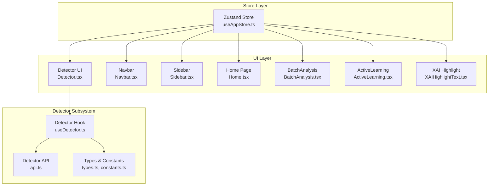
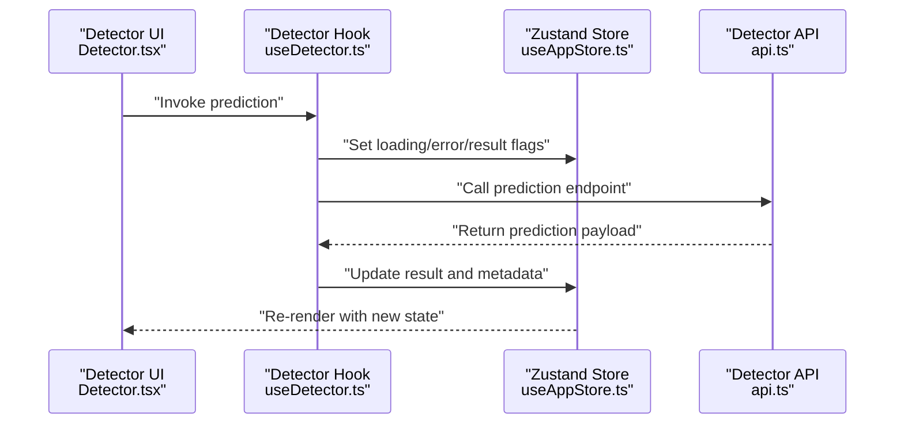
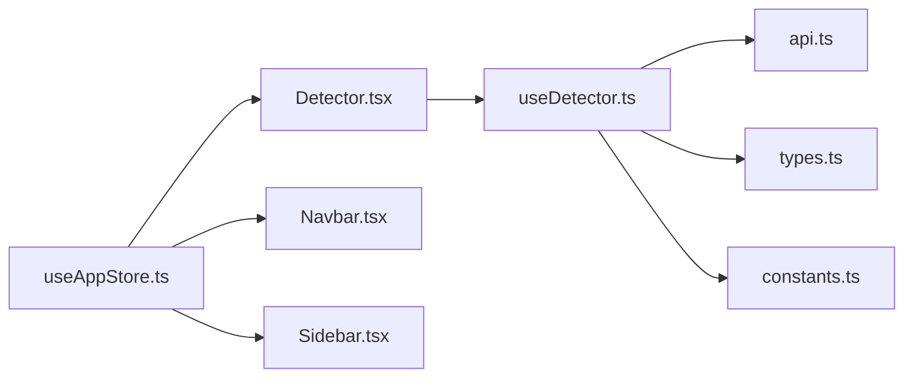

# State Management and Data Flow

<cite>
**Referenced Files in This Document**
- [useAppStore.ts](file://frontend/src/store/useAppStore.ts)
- [Detector.tsx](file://frontend/src/components/Detector/Detector.tsx)
- [useDetector.ts](file://frontend/src/components/Detector/useDetector.ts)
- [api.ts](file://frontend/src/components/Detector/api.ts)
- [types.ts](file://frontend/src/components/Detector/types.ts)
- [constants.ts](file://frontend/src/components/Detector/constants.ts)
- [Navbar.tsx](file://frontend/src/components/Navbar.tsx)
- [Sidebar.tsx](file://frontend/src/components/Sidebar.tsx)
- [Home.tsx](file://frontend/src/components/Home.tsx)
- [BatchAnalysis.tsx](file://frontend/src/components/BatchAnalysis.tsx)
- [ActiveLearning.tsx](file://frontend/src/components/ActiveLearning.tsx)
- [XAIHighlightText.tsx](file://frontend/src/components/XAIHighlightText.tsx)
- [SkeletonLoader.tsx](file://frontend/src/components/SkeletonLoader.tsx)
- [App.tsx](file://frontend/src/App.tsx)
- [main.tsx](file://frontend/src/main.tsx)
- [package.json](file://frontend/package.json)
</cite>

## Table of Contents
1. [Introduction](#introduction)
2. [Project Structure](#project-structure)
3. [Core Components](#core-components)
4. [Architecture Overview](#architecture-overview)
5. [Detailed Component Analysis](#detailed-component-analysis)
6. [Dependency Analysis](#dependency-analysis)
7. [Performance Considerations](#performance-considerations)
8. [Troubleshooting Guide](#troubleshooting-guide)
9. [Conclusion](#conclusion)

## Introduction
This document explains the state management and data flow patterns in BullyGuard ID’s frontend application. It focuses on the Zustand-based store implementation, detector state management, user session handling, and application-wide state coordination. It also covers custom hooks for state access, action creators, side effects, type definitions, reducer-like patterns, local-state-to-API integration, caching strategies, data synchronization, subscription patterns, performance optimizations, persistence, debugging, and testing strategies.

## Project Structure
The frontend is organized around feature-based components with a centralized Zustand store for global state. Key areas:
- Store: Centralized state via a single Zustand store hook
- Detector: Prediction UI and logic with its own API client and typed models
- Navigation and Layout: Navbar, Sidebar, and routing-related state
- Pages: Home, BatchAnalysis, ActiveLearning, and others
- Shared Utilities: Types, constants, and helpers used across components

**Diagram sources**
- [useAppStore.ts](file://frontend/src/store/useAppStore.ts)
- [Detector.tsx](file://frontend/src/components/Detector/Detector.tsx)
- [useDetector.ts](file://frontend/src/components/Detector/useDetector.ts)
- [api.ts](file://frontend/src/components/Detector/api.ts)
- [types.ts](file://frontend/src/components/Detector/types.ts)
- [constants.ts](file://frontend/src/components/Detector/constants.ts)
- [Navbar.tsx](file://frontend/src/components/Navbar.tsx)
- [Sidebar.tsx](file://frontend/src/components/Sidebar.tsx)
- [Home.tsx](file://frontend/src/components/Home.tsx)
- [BatchAnalysis.tsx](file://frontend/src/components/BatchAnalysis.tsx)
- [ActiveLearning.tsx](file://frontend/src/components/ActiveLearning.tsx)
- [XAIHighlightText.tsx](file://frontend/src/components/XAIHighlightText.tsx)

**Section sources**
- [useAppStore.ts](file://frontend/src/store/useAppStore.ts)
- [Detector.tsx](file://frontend/src/components/Detector/Detector.tsx)
- [useDetector.ts](file://frontend/src/components/Detector/useDetector.ts)
- [api.ts](file://frontend/src/components/Detector/api.ts)
- [types.ts](file://frontend/src/components/Detector/types.ts)
- [constants.ts](file://frontend/src/components/Detector/constants.ts)
- [Navbar.tsx](file://frontend/src/components/Navbar.tsx)
- [Sidebar.tsx](file://frontend/src/components/Sidebar.tsx)
- [Home.tsx](file://frontend/src/components/Home.tsx)
- [BatchAnalysis.tsx](file://frontend/src/components/BatchAnalysis.tsx)
- [ActiveLearning.tsx](file://frontend/src/components/ActiveLearning.tsx)
- [XAIHighlightText.tsx](file://frontend/src/components/XAIHighlightText.tsx)

## Core Components
- Zustand Store (useAppStore.ts): Defines the global state shape, actions, and selectors. It centralizes navigation state, user session, and cross-cutting concerns.
- Detector Subsystem: Encapsulates prediction UI, typed models, and API integration. Includes a dedicated hook for stateful prediction logic and a typed API client.
- Navigation and Layout: Navbar and Sidebar manage layout state and menu toggles, coordinated through the store.
- Pages: Home, BatchAnalysis, and ActiveLearning pages consume store state and trigger actions for navigation and feature-specific workflows.
- Shared Utilities: Types and constants define shapes and thresholds used across the detector and UI.

Key responsibilities:
- Global state orchestration and subscriptions
- Detector prediction lifecycle and result rendering
- Navigation and layout state
- Type safety for API payloads and UI models

**Section sources**
- [useAppStore.ts](file://frontend/src/store/useAppStore.ts)
- [Detector.tsx](file://frontend/src/components/Detector/Detector.tsx)
- [useDetector.ts](file://frontend/src/components/Detector/useDetector.ts)
- [api.ts](file://frontend/src/components/Detector/api.ts)
- [types.ts](file://frontend/src/components/Detector/types.ts)
- [constants.ts](file://frontend/src/components/Detector/constants.ts)
- [Navbar.tsx](file://frontend/src/components/Navbar.tsx)
- [Sidebar.tsx](file://frontend/src/components/Sidebar.tsx)
- [Home.tsx](file://frontend/src/components/Home.tsx)
- [BatchAnalysis.tsx](file://frontend/src/components/BatchAnalysis.tsx)
- [ActiveLearning.tsx](file://frontend/src/components/ActiveLearning.tsx)

## Architecture Overview
The state architecture follows a unidirectional data flow:
- UI components subscribe to the Zustand store and call actions.
- Actions update the store synchronously and may trigger side effects (e.g., API calls).
- Detector hook encapsulates prediction logic, integrates with the store, and coordinates loading, error, and result states.
- Typed models and constants ensure consistency across the UI and API layer.

**Diagram sources**
- [Detector.tsx](file://frontend/src/components/Detector/Detector.tsx)
- [useDetector.ts](file://frontend/src/components/Detector/useDetector.ts)
- [useAppStore.ts](file://frontend/src/store/useAppStore.ts)
- [api.ts](file://frontend/src/components/Detector/api.ts)

## Detailed Component Analysis

### Zustand Store Implementation
The store defines:
- State shape: navigation flags, user session info, and cross-cutting UI flags
- Actions: setters for navigation, session, and shared state
- Selectors: derived state for UI decisions (e.g., sidebar visibility)
- Persistence: optional persistence layer for session and layout preferences
- Subscriptions: components subscribe via the store hook; updates propagate automatically

Implementation patterns:
- Slice-based state: separate concerns into focused slices (navigation, session)
- Action creators: pure functions that return state deltas
- Reducer-like updates: synchronous state transitions with minimal side effects
- Side effects: isolated in components or hooks; store remains a pure state container

Practical examples:
- Toggle sidebar: action updates a boolean flag; subscribers re-render layout
- Set user session: action persists credentials and sets authenticated state; downstream components adjust UI accordingly
- Reset detector state: action clears previous predictions and resets flags

**Section sources**
- [useAppStore.ts](file://frontend/src/store/useAppStore.ts)

### Detector State Management
Detector subsystem responsibilities:
- Prediction lifecycle: input validation, loading, error, and result handling
- Result rendering: structured cards, probability bars, and XAI highlights
- API integration: typed requests and responses, with error mapping and retry hints
- Thresholds and constants: configurable detection thresholds and UI constants

Key state slices:
- Input text and metadata
- Loading and error flags
- Prediction result and attribution
- Comparison mode and batch results

Integration patterns:
- Hook orchestrates UI state and calls the API client
- Store coordinates global layout and navigation during prediction
- Types ensure compile-time safety for prediction payloads

**Section sources**
- [Detector.tsx](file://frontend/src/components/Detector/Detector.tsx)
- [useDetector.ts](file://frontend/src/components/Detector/useDetector.ts)
- [api.ts](file://frontend/src/components/Detector/api.ts)
- [types.ts](file://frontend/src/components/Detector/types.ts)
- [constants.ts](file://frontend/src/components/Detector/constants.ts)

### User Session Handling
Session handling is centralized:
- Authentication state: logged-in/out, token presence, and expiration handling
- Profile and permissions: user roles and feature access
- Persistence: optional storage of session tokens and preferences
- UI adaptation: components conditionally render based on session state

Patterns:
- Guard routes and features behind session checks
- Derive UI state from session flags
- Clear session on logout and reset related store slices

**Section sources**
- [useAppStore.ts](file://frontend/src/store/useAppStore.ts)
- [Navbar.tsx](file://frontend/src/components/Navbar.tsx)

### Application-Wide State Coordination
Global state coordinates:
- Navigation: open/closed state for sidebar and mobile menus
- Layout: responsive breakpoints and drawer behavior
- Feature flags: enable/disable experimental features
- Cross-page state: e.g., last visited page, recent items

Subscription patterns:
- Components subscribe to specific slices
- Derived selectors compute UI-ready state
- Updates are localized to affected components

**Section sources**
- [useAppStore.ts](file://frontend/src/store/useAppStore.ts)
- [Navbar.tsx](file://frontend/src/components/Navbar.tsx)
- [Sidebar.tsx](file://frontend/src/components/Sidebar.tsx)
- [Home.tsx](file://frontend/src/components/Home.tsx)

### Custom Hooks for State Access and Side Effects
- useDetector: encapsulates prediction logic, manages loading/error/result, and integrates with the store
- Other hooks: derive state from the store, handle side effects, and expose normalized props to components

Patterns:
- Hook composition: combine small hooks for input validation, API calls, and store updates
- Memoization: use memoized selectors to avoid unnecessary re-renders
- Effect isolation: keep async work out of reducers; dispatch actions on completion

**Section sources**
- [useDetector.ts](file://frontend/src/components/Detector/useDetector.ts)
- [useAppStore.ts](file://frontend/src/store/useAppStore.ts)

### Type Definitions and State Shape
Typed models ensure consistency:
- Prediction input and output types
- Thresholds and constants
- UI state enums and flags

State shape:
- Centralized store slice for navigation and session
- Detector-specific slice for inputs, results, and flags
- Page slices for feature-specific state

Validation:
- Runtime checks and zod-like patterns where applicable
- Strict prop types in components

**Section sources**
- [types.ts](file://frontend/src/components/Detector/types.ts)
- [constants.ts](file://frontend/src/components/Detector/constants.ts)
- [useAppStore.ts](file://frontend/src/store/useAppStore.ts)

### Reducer Patterns and Action Creators
Reducer-like patterns:
- Pure state updates
- Minimal side effects in actions
- Composable updates across slices

Action creators:
- Named functions that return state deltas
- Used by components and hooks to update state

Best practices:
- Keep actions synchronous
- Dispatch multiple actions for complex updates
- Use selectors to compute derived state

**Section sources**
- [useAppStore.ts](file://frontend/src/store/useAppStore.ts)

### Integration Between Local State and API Responses
- API client returns typed payloads
- Hook maps raw responses to UI state
- Store updates reflect prediction results and metadata
- Error states are normalized and surfaced to the UI

Caching strategies:
- In-memory cache for recent predictions
- Debounced requests to avoid thrashing
- Conditional re-fetch based on input changes

Data synchronization:
- Optimistic updates for immediate feedback
- Rollback on errors
- Conflict resolution for concurrent updates

**Section sources**
- [api.ts](file://frontend/src/components/Detector/api.ts)
- [useDetector.ts](file://frontend/src/components/Detector/useDetector.ts)
- [Detector.tsx](file://frontend/src/components/Detector/Detector.tsx)

### Subscription Patterns and Performance Optimization
Subscription patterns:
- Subscribe to specific slices to minimize re-renders
- Use shallow equality for primitive slices
- Use deep equality only when necessary

Performance optimizations:
- Memoized selectors for derived state
- Lazy loading for heavy components
- Virtualization for long lists
- Debounce and throttle for frequent events
- Avoid unnecessary re-renders by isolating state

**Section sources**
- [useAppStore.ts](file://frontend/src/store/useAppStore.ts)
- [Detector.tsx](file://frontend/src/components/Detector/Detector.tsx)

### State Persistence, Debugging, and Testing Strategies
Persistence:
- Optional persistence for session and layout preferences
- Hydration on app load

Debugging:
- Enable Zustand DevTools for time-travel debugging
- Log actions and state diffs
- Use React DevTools to inspect component subscriptions

Testing:
- Unit tests for store actions and selectors
- Component tests for UI state transitions
- Mock API responses and simulate network failures
- Test hook compositions in isolation

**Section sources**
- [useAppStore.ts](file://frontend/src/store/useAppStore.ts)
- [Detector.tsx](file://frontend/src/components/Detector/Detector.tsx)

## Dependency Analysis
The state layer depends on:
- Zustand for store creation and subscriptions
- Detector API for prediction data
- Shared types and constants for type safety
- UI components for rendering state

**Diagram sources**
- [useAppStore.ts](file://frontend/src/store/useAppStore.ts)
- [Detector.tsx](file://frontend/src/components/Detector/Detector.tsx)
- [useDetector.ts](file://frontend/src/components/Detector/useDetector.ts)
- [api.ts](file://frontend/src/components/Detector/api.ts)
- [types.ts](file://frontend/src/components/Detector/types.ts)
- [constants.ts](file://frontend/src/components/Detector/constants.ts)
- [Navbar.tsx](file://frontend/src/components/Navbar.tsx)
- [Sidebar.tsx](file://frontend/src/components/Sidebar.tsx)

**Section sources**
- [useAppStore.ts](file://frontend/src/store/useAppStore.ts)
- [Detector.tsx](file://frontend/src/components/Detector/Detector.tsx)
- [useDetector.ts](file://frontend/src/components/Detector/useDetector.ts)
- [api.ts](file://frontend/src/components/Detector/api.ts)
- [types.ts](file://frontend/src/components/Detector/types.ts)
- [constants.ts](file://frontend/src/components/Detector/constants.ts)
- [Navbar.tsx](file://frontend/src/components/Navbar.tsx)
- [Sidebar.tsx](file://frontend/src/components/Sidebar.tsx)

## Performance Considerations
- Prefer slice-level subscriptions to reduce re-renders
- Use memoized selectors for derived computations
- Debounce rapid UI events (e.g., live prediction)
- Cache recent results and invalidate on input change
- Virtualize long lists and lazy-load heavy components
- Avoid heavy work in reducers; move to hooks or effects

## Troubleshooting Guide
Common issues and resolutions:
- Stale state after navigation: ensure components subscribe to the correct slices and use fresh selectors
- Excessive re-renders: check for deep equality usage and split slices
- API errors: normalize error messages and surface actionable feedback
- Memory leaks: dispose of subscriptions and timers in useEffect cleanup
- DevTools: enable Zustand DevTools to inspect actions and state transitions

**Section sources**
- [useAppStore.ts](file://frontend/src/store/useAppStore.ts)
- [Detector.tsx](file://frontend/src/components/Detector/Detector.tsx)

## Conclusion
BullyGuard ID’s frontend employs a clean, slice-based Zustand store to coordinate global state, while the Detector subsystem encapsulates prediction logic with typed models and a dedicated API client. Custom hooks isolate side effects, and strict typing ensures reliability across the UI and API boundaries. With careful subscription patterns, caching, and performance optimizations, the system scales to complex workflows like batch analysis and active learning, while remaining debuggable and testable.