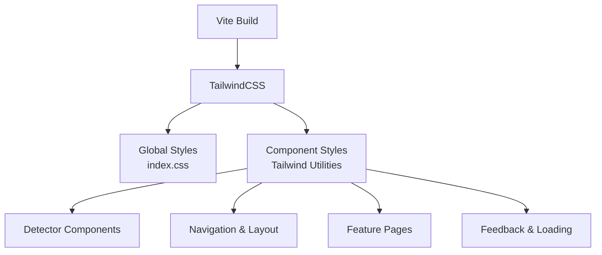
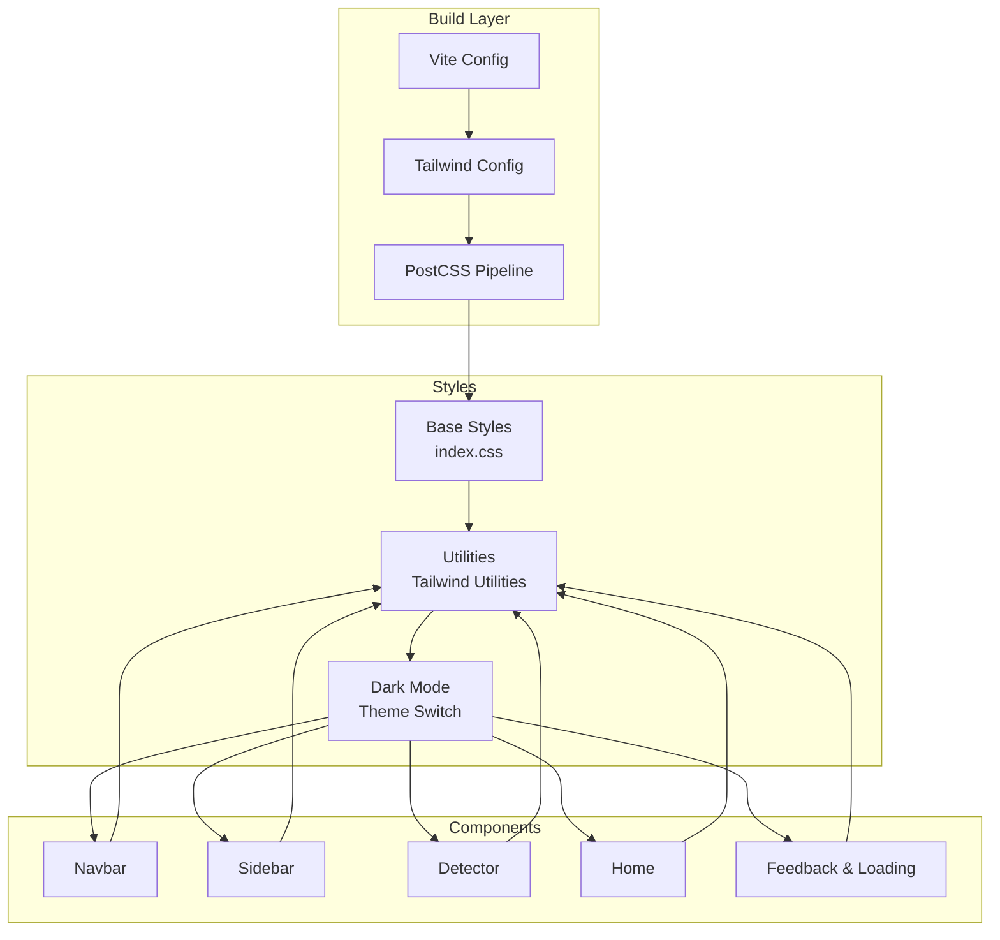
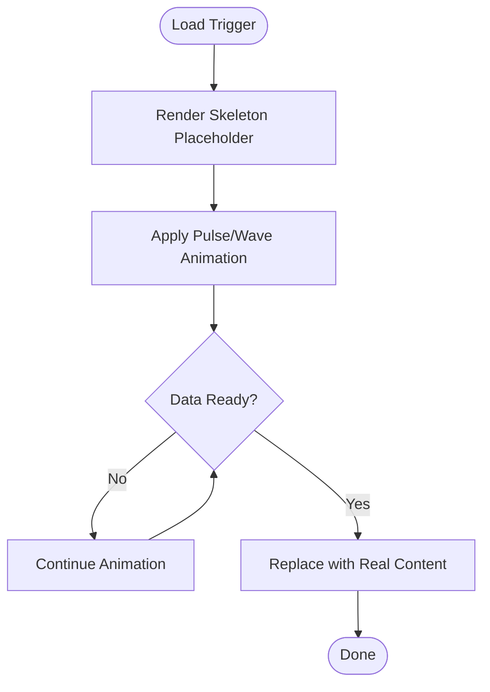
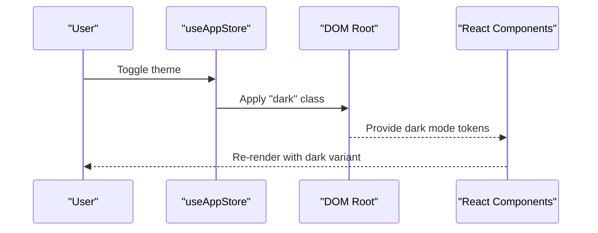
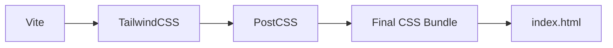

# Styling and Responsive Design

<cite>
**Referenced Files in This Document**
- [package.json](file://frontend/package.json)
- [vite.config.ts](file://frontend/vite.config.ts)
- [tailwind.config.ts](file://frontend/src/tailwind.config.ts)
- [index.css](file://frontend/src/index.css)
- [App.css](file://frontend/src/App.css)
- [SkeletonLoader.tsx](file://frontend/src/components/SkeletonLoader.tsx)
- [Navbar.tsx](file://frontend/src/components/Navbar.tsx)
- [Sidebar.tsx](file://frontend/src/components/Sidebar.tsx)
- [Detector.tsx](file://frontend/src/components/Detector/Detector.tsx)
- [ResultCard.tsx](file://frontend/src/components/Detector/ResultCard.tsx)
- [ProbabilityBar.tsx](file://frontend/src/components/Detector/ProbabilityBar.tsx)
- [XAIHighlightText.tsx](file://frontend/src/components/XAIHighlightText.tsx)
- [Home.tsx](file://frontend/src/components/Home.tsx)
- [ActiveLearning.tsx](file://frontend/src/components/ActiveLearning.tsx)
- [BatchAnalysis.tsx](file://frontend/src/components/BatchAnalysis.tsx)
- [SocialScraper.tsx](file://frontend/src/components/SocialScraper.tsx)
- [Settings.tsx](file://frontend/src/components/Settings.tsx)
- [useAppStore.ts](file://frontend/src/store/useAppStore.ts)
</cite>

## Table of Contents
1. [Introduction](#introduction)
2. [Project Structure](#project-structure)
3. [Core Components](#core-components)
4. [Architecture Overview](#architecture-overview)
5. [Detailed Component Analysis](#detailed-component-analysis)
6. [Dependency Analysis](#dependency-analysis)
7. [Performance Considerations](#performance-considerations)
8. [Troubleshooting Guide](#troubleshooting-guide)
9. [Conclusion](#conclusion)
10. [Appendices](#appendices)

## Introduction
This document provides comprehensive styling and responsive design documentation for BullyGuard ID’s frontend. It covers TailwindCSS configuration, utility classes, design system implementation, component styling patterns, theme management, responsive breakpoints, skeleton loading states, animations, visual feedback mechanisms, color schemes, typography, spacing, dark mode, accessibility, performance optimization, browser compatibility, and maintenance strategies.

## Project Structure
The frontend uses Vite for build tooling and TailwindCSS for utility-first styling. Styles are organized under src with global styles and component-specific styling via Tailwind utilities. The Tailwind configuration enables dark mode and customizations for the design system.

**Diagram sources**
- [vite.config.ts](file://frontend/vite.config.ts)
- [tailwind.config.ts](file://frontend/src/tailwind.config.ts)
- [index.css](file://frontend/src/index.css)

**Section sources**
- [package.json](file://frontend/package.json)
- [vite.config.ts](file://frontend/vite.config.ts)
- [tailwind.config.ts](file://frontend/src/tailwind.config.ts)
- [index.css](file://frontend/src/index.css)

## Core Components
- Global styles: Tailwind base, components, and utilities are included in the global stylesheet.
- Dark mode: Enabled via Tailwind’s dark mode strategy and toggled through the app store.
- Responsive design: Mobile-first approach using Tailwind’s responsive prefixes and custom breakpoints.
- Skeleton loaders: Implemented for improved perceived performance during async operations.
- Animations and transitions: Applied selectively for interactive states and feedback.
- Accessibility: Focus management, semantic markup, and contrast-aware color usage.

**Section sources**
- [index.css](file://frontend/src/index.css)
- [App.css](file://frontend/src/App.css)
- [useAppStore.ts](file://frontend/src/store/useAppStore.ts)

## Architecture Overview
The styling architecture integrates Tailwind utilities with React components. Global styles are processed by PostCSS and Tailwind, while component styles rely on atomic utility classes. Dark mode is controlled centrally and propagated to components.

**Diagram sources**
- [vite.config.ts](file://frontend/vite.config.ts)
- [tailwind.config.ts](file://frontend/src/tailwind.config.ts)
- [index.css](file://frontend/src/index.css)
- [Navbar.tsx](file://frontend/src/components/Navbar.tsx)
- [Sidebar.tsx](file://frontend/src/components/Sidebar.tsx)
- [Detector.tsx](file://frontend/src/components/Detector/Detector.tsx)
- [Home.tsx](file://frontend/src/components/Home.tsx)
- [SkeletonLoader.tsx](file://frontend/src/components/SkeletonLoader.tsx)

## Detailed Component Analysis

### TailwindCSS Configuration and Theme Management
- Dark mode strategy: Tailwind’s dark mode is enabled and configured to target a media preference or class-based toggle.
- Custom breakpoints: Tailwind’s theme extends default breakpoints to support additional screen sizes for desktop and tablet layouts.
- Color palette: Tailwind’s default palette is extended with brand-safe colors and semantic hues for status, warning, and danger states.
- Typography scale: Font families and sizing scales are defined for headings, body copy, and monospace usage.
- Spacing scale: Consistent spacing units are applied across layout, padding, margin, and gap utilities.
- Animation and transition defaults: Tailwind utilities provide standardized easing and duration presets for interactive states.

Implementation references:
- Dark mode enablement and selector strategy
- Breakpoint customization and naming
- Semantic color tokens and usage
- Typography scale and font family assignments
- Spacing units and layout utilities

**Section sources**
- [tailwind.config.ts](file://frontend/src/tailwind.config.ts)

### Global Styles and Base Setup
- Base reset and normalization are handled by Tailwind’s preflight and base layers.
- Component resets and global utility overrides are centralized in the global stylesheet.
- Transition and animation defaults are set globally for consistent motion behavior.

Key areas:
- Base layer composition
- Component layer customizations
- Utility layer usage patterns

**Section sources**
- [index.css](file://frontend/src/index.css)
- [App.css](file://frontend/src/App.css)

### Navigation and Layout Components
- Navbar: Uses flex utilities for alignment, responsive spacing, and dark mode-aware color tokens. Focus-visible outlines ensure keyboard accessibility.
- Sidebar: Implements collapsible behavior with smooth transitions and responsive width adjustments. Hover and focus states are styled for clarity.

Responsive patterns:
- Mobile-first stacking with horizontal layouts on larger screens
- Dynamic width and padding adjustments
- Dark mode-aware background and text colors

Accessibility considerations:
- Keyboard navigation support
- Focus management on open/close actions
- Sufficient color contrast in both light and dark modes

**Section sources**
- [Navbar.tsx](file://frontend/src/components/Navbar.tsx)
- [Sidebar.tsx](file://frontend/src/components/Sidebar.tsx)

### Detector Components
- Detector container: Grid and spacing utilities define the layout for input and result areas. Responsive columns adjust based on viewport size.
- Result card: Card-like presentation with rounded corners, elevation, and padding. Status-dependent border and background tokens are applied.
- Probability bar: Progress visualization using width utilities and background tokens. Animated fill effect is achieved with transition utilities.
- XAI highlight: Inline highlighting uses background tokens and text color adjustments for readability.

Animation and feedback:
- Smooth transitions for state changes
- Animated progress indicators
- Hover and focus states for interactive elements

**Section sources**
- [Detector.tsx](file://frontend/src/components/Detector/Detector.tsx)
- [ResultCard.tsx](file://frontend/src/components/Detector/ResultCard.tsx)
- [ProbabilityBar.tsx](file://frontend/src/components/Detector/ProbabilityBar.tsx)
- [XAIHighlightText.tsx](file://frontend/src/components/XAIHighlightText.tsx)

### Feature Pages and Sections
- Home page: Sectioned layout with grid and stack utilities. Hero and feature showcases use responsive spacing and typography scales.
- Active learning: Quadrant visualization and filter bar use grid and flex utilities for precise alignment and responsive behavior.
- Batch analysis: Table-like layout with overflow handling and responsive stacking on small screens.
- Social scraper: Form controls and preview areas use consistent spacing and dark mode-aware tokens.
- Settings: List-style settings with proper indentation and hover states.

Responsive behavior:
- Stack vertically on small screens, switch to side-by-side on larger screens
- Adjust padding and margins for comfortable reading
- Control max widths and center alignment for content density

**Section sources**
- [Home.tsx](file://frontend/src/components/Home.tsx)
- [ActiveLearning.tsx](file://frontend/src/components/ActiveLearning.tsx)
- [BatchAnalysis.tsx](file://frontend/src/components/BatchAnalysis.tsx)
- [SocialScraper.tsx](file://frontend/src/components/SocialScraper.tsx)
- [Settings.tsx](file://frontend/src/components/Settings.tsx)

### Skeleton Loading States
- Skeleton loader: Uses background tokens with subtle animation to indicate loading. Rounded corners and appropriate spacing mimic real content.
- Placement: Centered overlays or inline placeholders depending on the component context.
- Motion: Subtle pulse or wave animation to reduce perceived wait time.

**Diagram sources**
- [SkeletonLoader.tsx](file://frontend/src/components/SkeletonLoader.tsx)

**Section sources**
- [SkeletonLoader.tsx](file://frontend/src/components/SkeletonLoader.tsx)

### Dark Mode Implementation
- Centralized state: The app store manages theme preference and applies a class to the root element.
- Tailwind integration: Dark mode variants are generated for color, background, and border utilities.
- Component adaptation: All components consume tokens that invert automatically in dark mode.

**Diagram sources**
- [useAppStore.ts](file://frontend/src/store/useAppStore.ts)
- [tailwind.config.ts](file://frontend/src/tailwind.config.ts)

**Section sources**
- [useAppStore.ts](file://frontend/src/store/useAppStore.ts)
- [tailwind.config.ts](file://frontend/src/tailwind.config.ts)

### Accessibility Considerations
- Focus management: Visible focus rings and consistent focus order across components.
- Color contrast: Tokens selected to meet WCAG guidelines in both light and dark modes.
- Semantic markup: Proper headings, lists, and roles for assistive technologies.
- Interactive affordances: Hover, focus, and active states clearly communicate interactivity.

**Section sources**
- [Navbar.tsx](file://frontend/src/components/Navbar.tsx)
- [Detector.tsx](file://frontend/src/components/Detector/Detector.tsx)
- [tailwind.config.ts](file://frontend/src/tailwind.config.ts)

## Dependency Analysis
The styling pipeline depends on Vite for bundling, Tailwind for utilities, and PostCSS for processing. Global styles are injected at runtime, and component styles are compiled into optimized CSS.

**Diagram sources**
- [vite.config.ts](file://frontend/vite.config.ts)
- [tailwind.config.ts](file://frontend/src/tailwind.config.ts)

**Section sources**
- [package.json](file://frontend/package.json)
- [vite.config.ts](file://frontend/vite.config.ts)
- [tailwind.config.ts](file://frontend/src/tailwind.config.ts)

## Performance Considerations
- Purge unused CSS: Enable tree-shaking to remove unused utilities in production builds.
- Minimize critical CSS: Inline essential styles for above-the-fold content.
- Optimize animations: Prefer transform and opacity for GPU-accelerated animations.
- Reduce repaints: Use contain utilities and avoid layout thrashing.
- Lazy load heavy assets: Defer non-critical images and videos.

[No sources needed since this section provides general guidance]

## Troubleshooting Guide
- Utilities not applying: Verify Tailwind directives are present in global styles and the config matches the project’s content paths.
- Dark mode not switching: Confirm the theme class is applied to the root element and Tailwind’s dark mode selector is configured.
- Responsive breakpoints: Ensure custom breakpoints are defined and used consistently across components.
- Animation glitches: Check for conflicting transforms and excessive repaint triggers.
- Contrast issues: Validate color tokens against WCAG guidelines in both modes.

**Section sources**
- [tailwind.config.ts](file://frontend/src/tailwind.config.ts)
- [index.css](file://frontend/src/index.css)
- [useAppStore.ts](file://frontend/src/store/useAppStore.ts)

## Conclusion
BullyGuard ID’s frontend employs a robust, scalable styling architecture centered on TailwindCSS and a mobile-first responsive design. The system integrates dark mode, skeleton loaders, and thoughtful animations to deliver a polished user experience. By adhering to the design system guidelines and performance recommendations, teams can maintain consistency and reliability across devices and contexts.

[No sources needed since this section summarizes without analyzing specific files]

## Appendices
- Practical examples: Refer to component files for real-world usage of utilities, responsive modifiers, and dark mode tokens.
- Maintenance checklist: Regularly audit unused utilities, update color tokens, and review accessibility compliance.

**Section sources**
- [Detector.tsx](file://frontend/src/components/Detector/Detector.tsx)
- [Navbar.tsx](file://frontend/src/components/Navbar.tsx)
- [Sidebar.tsx](file://frontend/src/components/Sidebar.tsx)
- [Home.tsx](file://frontend/src/components/Home.tsx)
- [ActiveLearning.tsx](file://frontend/src/components/ActiveLearning.tsx)
- [BatchAnalysis.tsx](file://frontend/src/components/BatchAnalysis.tsx)
- [SocialScraper.tsx](file://frontend/src/components/SocialScraper.tsx)
- [Settings.tsx](file://frontend/src/components/Settings.tsx)
- [SkeletonLoader.tsx](file://frontend/src/components/SkeletonLoader.tsx)
- [useAppStore.ts](file://frontend/src/store/useAppStore.ts)