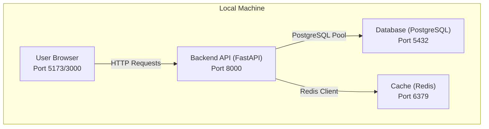
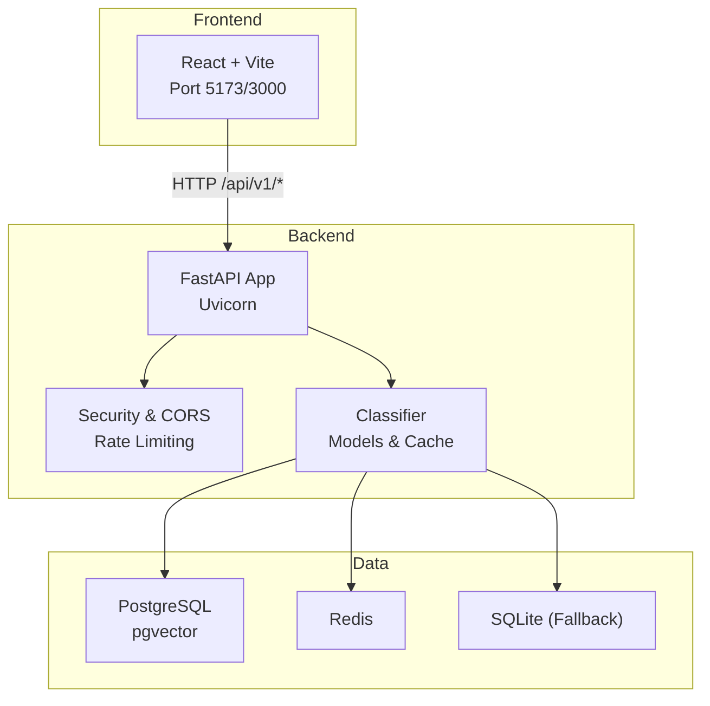
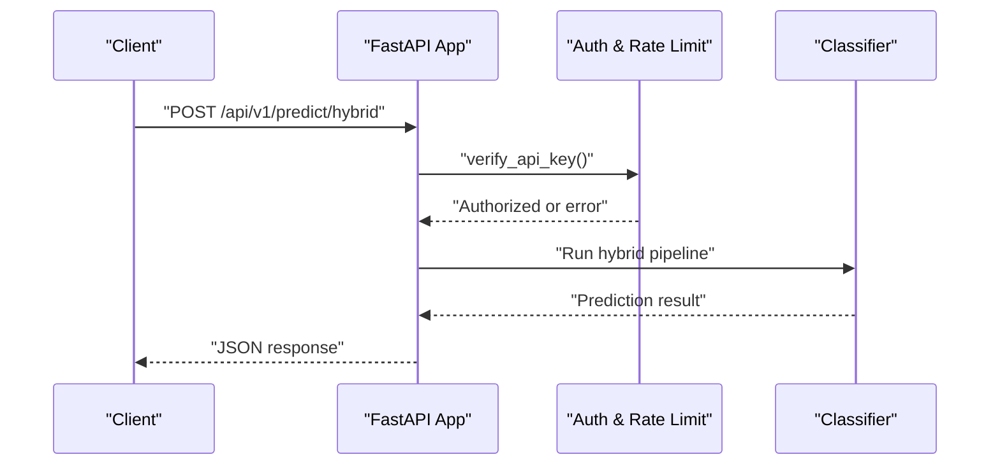
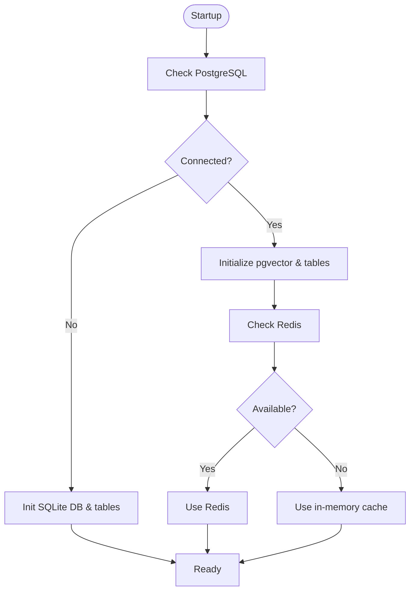
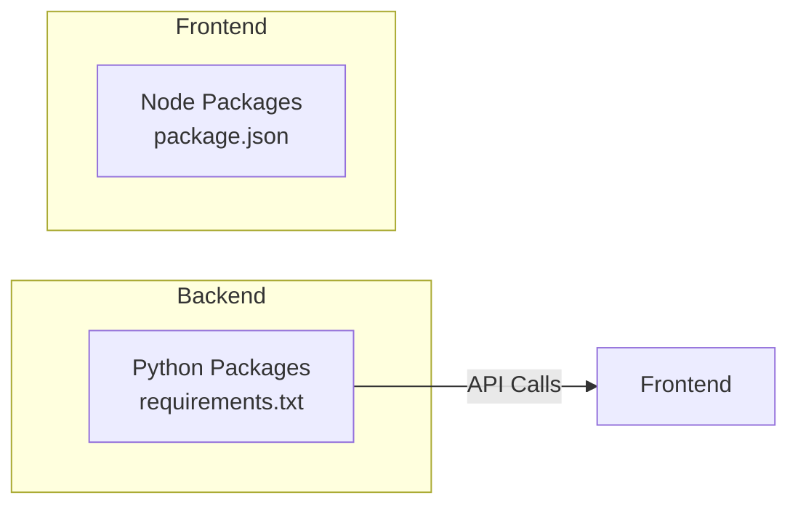

# Getting Started

<cite>
**Referenced Files in This Document**
- [README.md](file://README.md)
- [docker-compose.yml](file://docker-compose.yml)
- [docker-compose.prod.yml](file://docker-compose.prod.yml)
- [run_local.sh](file://run_local.sh)
- [run_local.bat](file://run_local.bat)
- [cyberbullying_api/main.py](file://cyberbullying_api/main.py)
- [cyberbullying_api/classifier/db_config.py](file://cyberbullying_api/classifier/db_config.py)
- [cyberbullying_api/routes/deps.py](file://cyberbullying_api/routes/deps.py)
- [cyberbullying_api/requirements.txt](file://cyberbullying_api/requirements.txt)
- [frontend/README.md](file://frontend/README.md)
- [frontend/package.json](file://frontend/package.json)
- [frontend/vite.config.ts](file://frontend/vite.config.ts)
- [scripts/smoke_test_api.sh](file://scripts/smoke_test_api.sh)
- [scripts/smoke_test_api.ps1](file://scripts/smoke_test_api.ps1)
</cite>

## Table of Contents
1. [Introduction](#introduction)
2. [Project Structure](#project-structure)
3. [Prerequisites](#prerequisites)
4. [Environment Configuration](#environment-configuration)
5. [Installation Options](#installation-options)
6. [Running Services](#running-services)
7. [Verification](#verification)
8. [Architecture Overview](#architecture-overview)
9. [Detailed Component Analysis](#detailed-component-analysis)
10. [Dependency Analysis](#dependency-analysis)
11. [Performance Considerations](#performance-considerations)
12. [Troubleshooting Guide](#troubleshooting-guide)
13. [Conclusion](#conclusion)

## Introduction
This guide helps you set up BullyGuard ID for local development and initial deployment. It covers both Docker-based and manual setups, environment configuration, running the backend API with FastAPI, the frontend dashboard with React/Vite, and optional database services. It also documents the zero-config fallback mode for offline development and provides verification steps and troubleshooting tips for beginners.

## Project Structure
BullyGuard ID consists of:
- Backend API (FastAPI) under cyberbullying_api/
- Frontend dashboard (React + Vite) under frontend/
- Docker orchestration via docker-compose.yml
- Optional production overrides via docker-compose.prod.yml
- Helper scripts for local runs and smoke tests

**Diagram sources**
- [docker-compose.yml:1-124](file://docker-compose.yml#L1-L124)
- [cyberbullying_api/main.py:287-321](file://cyberbullying_api/main.py#L287-L321)

**Section sources**
- [README.md:73-103](file://README.md#L73-L103)
- [docker-compose.yml:1-124](file://docker-compose.yml#L1-L124)

## Prerequisites
Ensure your machine meets the minimum requirements:
- Python 3.11+ (backend)
- Node.js 20+ (frontend)
- Docker and Docker Compose (containerized setup)
- Gemini API credentials (optional, for LLM Tier 3)

Notes:
- The project supports a zero-config fallback mode when databases are unavailable, automatically switching to SQLite and in-memory cache.

**Section sources**
- [README.md:107-114](file://README.md#L107-L114)
- [README.md:290-296](file://README.md#L290-L296)

## Environment Configuration
Create and configure your environment file:
1. Copy the example environment template to .env in the repository root.
2. Open .env and set:
   - ENV=development
   - API_KEY=a strong random value
   - ALLOW_MISSING_API_KEY_IN_DEV=true (for development convenience)
   - PG_URL and REDIS_URL (only if using external services)
   - GEMINI_API_KEY and related LLM settings (optional)

Key behaviors:
- In development, API key enforcement can be relaxed via ALLOW_MISSING_API_KEY_IN_DEV.
- If PostgreSQL and Redis are unreachable, the system falls back to SQLite and in-memory cache transparently.

**Section sources**
- [README.md:125-147](file://README.md#L125-L147)
- [README.md:148-150](file://README.md#L148-L150)
- [cyberbullying_api/classifier/db_config.py:340-357](file://cyberbullying_api/classifier/db_config.py#L340-L357)
- [cyberbullying_api/routes/deps.py:58-91](file://cyberbullying_api/routes/deps.py#L58-L91)

## Installation Options
Choose one of the following approaches:

### Option A: Docker-based Development (Recommended)
- Start database and cache containers:
  - docker compose up -d db redis
- Bring up the API, worker, and web UI:
  - docker compose up -d api worker web
- Access:
  - Backend API: http://localhost:8000
  - Swagger docs: http://localhost:8000/docs
  - Web UI: http://localhost:3000

Optional production overrides:
- docker compose -f docker-compose.yml -f docker-compose.prod.yml up -d --build

**Section sources**
- [README.md:298-314](file://README.md#L298-L314)
- [docker-compose.yml:1-124](file://docker-compose.yml#L1-L124)
- [docker-compose.prod.yml:1-29](file://docker-compose.prod.yml#L1-L29)

### Option B: Manual Setup (No Docker)
- Prepare backend:
  - cd cyberbullying_api
  - python -m venv .venv
  - Activate virtual environment (see README)
  - pip install --upgrade pip
  - pip install -r requirements.txt
  - uvicorn main:app --reload --host 0.0.0.0 --port 8000
- Prepare frontend:
  - cd frontend
  - npm install
  - npm run dev
- Access:
  - Backend API: http://localhost:8000
  - Swagger docs: http://localhost:8000/docs
  - Web UI: http://localhost:5173

Zero-config fallback:
- If PostgreSQL/Redis are not reachable, the backend automatically uses SQLite and in-memory cache.

**Section sources**
- [README.md:158-187](file://README.md#L158-L187)
- [README.md:190-287](file://README.md#L190-L287)
- [run_local.sh:1-52](file://run_local.sh#L1-L52)
- [run_local.bat:1-31](file://run_local.bat#L1-L31)
- [cyberbullying_api/requirements.txt:1-25](file://cyberbullying_api/requirements.txt#L1-L25)

## Running Services
- Backend (FastAPI): The main entrypoint initializes models, applies security middleware, and exposes prediction and admin endpoints. Health checks verify database and cache connectivity.
- Worker: Celery worker processes background tasks (e.g., retraining triggers).
- Frontend (React/Vite): Runs the dashboard UI locally.

Ports:
- API: 8000
- Web UI: 3000 (Docker) or 5173 (manual)
- Database: 5432
- Cache: 6379

**Section sources**
- [cyberbullying_api/main.py:158-285](file://cyberbullying_api/main.py#L158-L285)
- [docker-compose.yml:34-117](file://docker-compose.yml#L34-L117)

## Verification
After starting services, verify the setup:

- Health check:
  - curl http://localhost:8000/health
  - Expect status healthy with database and redis connectivity indicators.
- Swagger docs:
  - Visit http://localhost:8000/docs to explore endpoints.
- Basic prediction:
  - curl -X POST "http://localhost:8000/predict/hybrid" \
    -H "Content-Type: application/json" \
    -H "X-API-Key: YOUR_API_KEY" \
    -d '{"text": "your test comment"}'

- Smoke tests:
  - Run the provided scripts to validate endpoints after Docker startup.

**Section sources**
- [README.md:317-344](file://README.md#L317-L344)
- [scripts/smoke_test_api.sh](file://scripts/smoke_test_api.sh)
- [scripts/smoke_test_api.ps1](file://scripts/smoke_test_api.ps1)

## Architecture Overview
High-level runtime architecture for local development:

**Diagram sources**
- [docker-compose.yml:1-124](file://docker-compose.yml#L1-L124)
- [cyberbullying_api/main.py:158-285](file://cyberbullying_api/main.py#L158-L285)
- [cyberbullying_api/classifier/db_config.py:118-242](file://cyberbullying_api/classifier/db_config.py#L118-L242)

## Detailed Component Analysis

### Backend API (FastAPI)
Key behaviors:
- Environment-aware configuration and startup validation
- Security middleware (headers, request size limits, CORS)
- Prometheus metrics endpoint
- Health check endpoint
- API versioning (/api/v1/)

**Diagram sources**
- [cyberbullying_api/main.py:261-271](file://cyberbullying_api/main.py#L261-L271)
- [cyberbullying_api/routes/deps.py:58-91](file://cyberbullying_api/routes/deps.py#L58-L91)

**Section sources**
- [cyberbullying_api/main.py:158-285](file://cyberbullying_api/main.py#L158-L285)
- [cyberbullying_api/routes/deps.py:58-91](file://cyberbullying_api/routes/deps.py#L58-L91)

### Database and Cache Fallback
Behavior:
- If PostgreSQL/Redis are unavailable, the system initializes SQLite and in-memory cache automatically.
- Migration logic ensures schema compatibility for both PostgreSQL and SQLite.

**Diagram sources**
- [cyberbullying_api/classifier/db_config.py:118-242](file://cyberbullying_api/classifier/db_config.py#L118-L242)
- [cyberbullying_api/classifier/db_config.py:340-357](file://cyberbullying_api/classifier/db_config.py#L340-L357)

**Section sources**
- [README.md:148-150](file://README.md#L148-L150)
- [README.md:290-296](file://README.md#L290-L296)
- [cyberbullying_api/classifier/db_config.py:118-242](file://cyberbullying_api/classifier/db_config.py#L118-L242)

### Frontend Dashboard (React/Vite)
- Built with React 19, Vite 8, TypeScript, TailwindCSS, Zustand
- Development server runs on port 5173 (manual) or 3000 (Docker)
- Connects to backend via VITE_API_BASE_URL

**Section sources**
- [frontend/README.md:1-95](file://frontend/README.md#L1-L95)
- [frontend/package.json:1-41](file://frontend/package.json#L1-L41)
- [frontend/vite.config.ts:1-17](file://frontend/vite.config.ts#L1-L17)
- [docker-compose.yml:102-117](file://docker-compose.yml#L102-L117)

## Dependency Analysis
Runtime dependencies:
- Backend: FastAPI, Uvicorn, scikit-learn, transformers, torch, ONNX, Redis, asyncpg, Celery, cryptography, sentence-transformers, Prometheus client, etc.
- Frontend: React, React DOM, TailwindCSS, Zustand, Vite, Vitest, ESLint, TypeScript

**Diagram sources**
- [cyberbullying_api/requirements.txt:1-25](file://cyberbullying_api/requirements.txt#L1-L25)
- [frontend/package.json:1-41](file://frontend/package.json#L1-L41)

**Section sources**
- [cyberbullying_api/requirements.txt:1-25](file://cyberbullying_api/requirements.txt#L1-L25)
- [frontend/package.json:1-41](file://frontend/package.json#L1-L41)

## Performance Considerations
- Use Docker Compose for optimized builds and shared cache layers between API and worker images.
- Enable production overrides for workers and strict rate limiting in production.
- Monitor request counts and latency via the /metrics endpoint.

**Section sources**
- [README.md:42-46](file://README.md#L42-L46)
- [docker-compose.prod.yml:1-29](file://docker-compose.prod.yml#L1-L29)
- [cyberbullying_api/main.py:273-276](file://cyberbullying_api/main.py#L273-L276)

## Troubleshooting Guide
Common issues and resolutions:
- API key errors in development:
  - Ensure API_KEY is set in .env and ALLOW_MISSING_API_KEY_IN_DEV=true for development.
- Rate limiting failures:
  - In development, missing Redis causes fail-open behavior; in production, set RATE_LIMIT_FAIL_OPEN=false to fail closed.
- Database connectivity:
  - If PostgreSQL/Redis are down, the system falls back to SQLite and in-memory cache automatically.
- Port conflicts:
  - Adjust API_PORT and WEB_PORT in docker-compose.yml or use different local ports.
- CORS issues:
  - Set ALLOWED_ORIGINS explicitly for production; defaults include localhost and 127.0.0.1 variants.
- Health check failures:
  - Verify database and Redis are reachable; check container logs with docker compose logs -f api.

**Section sources**
- [cyberbullying_api/routes/deps.py:58-91](file://cyberbullying_api/routes/deps.py#L58-L91)
- [cyberbullying_api/routes/deps.py:112-165](file://cyberbullying_api/routes/deps.py#L112-L165)
- [cyberbullying_api/main.py:287-321](file://cyberbullying_api/main.py#L287-L321)
- [README.md:148-150](file://README.md#L148-L150)
- [docker-compose.yml:18-32](file://docker-compose.yml#L18-L32)

## Conclusion
You now have multiple pathways to run BullyGuard ID locally: Docker-based or manual. Both support the zero-config fallback for offline development. Use the verification steps to confirm your setup, and consult the troubleshooting section for common issues. For production, apply the production overrides and harden security settings as documented.