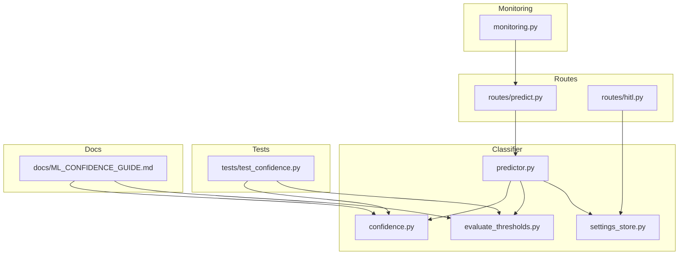
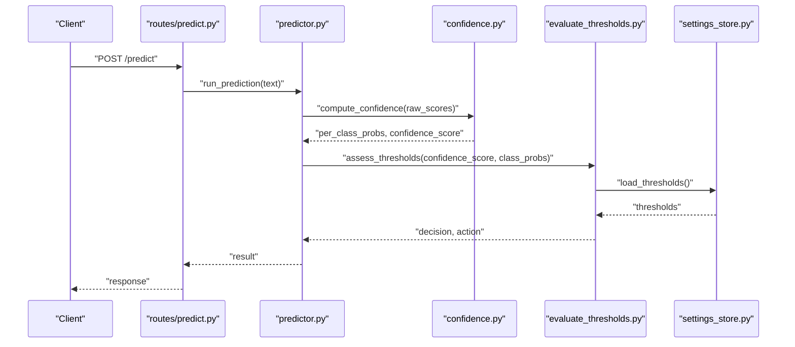
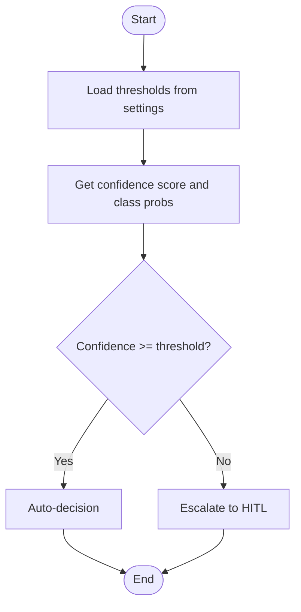
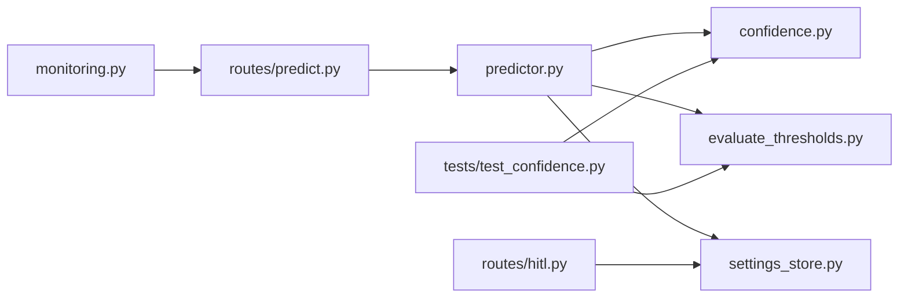

# Confidence Scoring and Threshold Management

<cite>
**Referenced Files in This Document**
- [confidence.py](file://cyberbullying_api/classifier/confidence.py)
- [evaluate_thresholds.py](file://cyberbullying_api/classifier/evaluate_thresholds.py)
- [predictor.py](file://cyberbullying_api/classifier/predictor.py)
- [settings_store.py](file://cyberbullying_api/classifier/settings_store.py)
- [predict.py](file://cyberbullying_api/routes/predict.py)
- [hitl.py](file://cyberbullying_api/routes/hitl.py)
- [monitoring.py](file://cyberbullying_api/monitoring.py)
- [test_confidence.py](file://tests/test_confidence.py)
- [ML_CONFIDENCE_GUIDE.md](file://docs/ML_CONFIDENCE_GUIDE.md)
</cite>

## Table of Contents
1. [Introduction](#introduction)
2. [Project Structure](#project-structure)
3. [Core Components](#core-components)
4. [Architecture Overview](#architecture-overview)
5. [Detailed Component Analysis](#detailed-component-analysis)
6. [Dependency Analysis](#dependency-analysis)
7. [Performance Considerations](#performance-considerations)
8. [Troubleshooting Guide](#troubleshooting-guide)
9. [Conclusion](#conclusion)
10. [Appendices](#appendices)

## Introduction
This document explains the confidence scoring and threshold management system used by the cyberbullying detection pipeline. It covers multi-tier confidence calculation, probability aggregation, uncertainty quantification, threshold configuration and dynamic adjustment, calibration procedures, reliability assessment, and operational workflows such as confidence-based routing and human-in-the-loop escalation. The goal is to enable practitioners to interpret confidence scores, tune thresholds effectively, monitor performance continuously, and optimize decision boundaries for production deployments.

## Project Structure
The confidence and threshold management logic spans several modules:
- Classifier-level modules implement confidence computation, threshold evaluation, and prediction orchestration.
- Routes expose endpoints for predictions and human-in-the-loop workflows.
- Monitoring tracks performance metrics and supports continuous evaluation.
- Tests validate confidence behaviors and edge cases.
- Documentation provides guidelines for calibration and threshold tuning.

**Diagram sources**
- [confidence.py](file://cyberbullying_api/classifier/confidence.py)
- [evaluate_thresholds.py](file://cyberbullying_api/classifier/evaluate_thresholds.py)
- [predictor.py](file://cyberbullying_api/classifier/predictor.py)
- [settings_store.py](file://cyberbullying_api/classifier/settings_store.py)
- [predict.py](file://cyberbullying_api/routes/predict.py)
- [hitl.py](file://cyberbullying_api/routes/hitl.py)
- [monitoring.py](file://cyberbullying_api/monitoring.py)
- [test_confidence.py](file://tests/test_confidence.py)
- [ML_CONFIDENCE_GUIDE.md](file://docs/ML_CONFIDENCE_GUIDE.md)

**Section sources**
- [confidence.py](file://cyberbullying_api/classifier/confidence.py)
- [evaluate_thresholds.py](file://cyberbullying_api/classifier/evaluate_thresholds.py)
- [predictor.py](file://cyberbullying_api/classifier/predictor.py)
- [settings_store.py](file://cyberbullying_api/classifier/settings_store.py)
- [predict.py](file://cyberbullying_api/routes/predict.py)
- [hitl.py](file://cyberbullying_api/routes/hitl.py)
- [monitoring.py](file://cyberbullying_api/monitoring.py)
- [test_confidence.py](file://tests/test_confidence.py)
- [ML_CONFIDENCE_GUIDE.md](file://docs/ML_CONFIDENCE_GUIDE.md)

## Core Components
- Confidence calculator: Computes per-class probabilities and derives a confidence score reflecting prediction certainty.
- Threshold evaluator: Assesses whether a prediction meets configured acceptance thresholds and determines routing actions.
- Prediction orchestrator: Integrates confidence scoring, threshold checks, and routing decisions into a unified prediction flow.
- Settings store: Centralizes threshold configurations and runtime parameters.
- Human-in-the-loop route: Escalates low-confidence or uncertain predictions for manual review.
- Monitoring: Tracks performance metrics and drift indicators to support continuous evaluation.

Key responsibilities:
- Multi-tier confidence calculation: Aggregates raw model outputs into a single confidence metric.
- Uncertainty quantification: Identifies ambiguous or unreliable predictions.
- Dynamic threshold adjustment: Adapts thresholds based on confidence distributions and operational goals.
- Decision boundary optimization: Balances precision/recall and cost-sensitive outcomes.
- Calibration and reliability: Validates confidence reliability via reliability diagrams and metrics.

**Section sources**
- [confidence.py](file://cyberbullying_api/classifier/confidence.py)
- [evaluate_thresholds.py](file://cyberbullying_api/classifier/evaluate_thresholds.py)
- [predictor.py](file://cyberbullying_api/classifier/predictor.py)
- [settings_store.py](file://cyberbullying_api/classifier/settings_store.py)
- [hitl.py](file://cyberbullying_api/routes/hitl.py)
- [monitoring.py](file://cyberbullying_api/monitoring.py)

## Architecture Overview
The confidence and threshold management architecture integrates model inference, confidence computation, threshold evaluation, and routing decisions. Predictions are routed either to automated decisions or to human review based on confidence levels and configured policies.

**Diagram sources**
- [predict.py](file://cyberbullying_api/routes/predict.py)
- [predictor.py](file://cyberbullying_api/classifier/predictor.py)
- [confidence.py](file://cyberbullying_api/classifier/confidence.py)
- [evaluate_thresholds.py](file://cyberbullying_api/classifier/evaluate_thresholds.py)
- [settings_store.py](file://cyberbullying_api/classifier/settings_store.py)

## Detailed Component Analysis

### Confidence Calculator
Responsibilities:
- Convert raw model outputs into calibrated per-class probabilities.
- Compute a scalar confidence score representing prediction certainty.
- Quantify uncertainty for downstream routing and escalation decisions.

Implementation highlights:
- Probability aggregation strategies: Normalization and smoothing to produce well-calibrated probabilities.
- Multi-tier confidence derivation: Combines class-wise probabilities and decision margins to derive a single confidence measure.
- Uncertainty quantification: Uses entropy-like measures or margin-based metrics to flag ambiguous cases.

Operational impact:
- Enables dynamic thresholding and routing decisions.
- Supports reliability diagnostics and calibration workflows.

**Section sources**
- [confidence.py](file://cyberbullying_api/classifier/confidence.py)

### Threshold Evaluator
Responsibilities:
- Evaluate confidence against configured thresholds.
- Determine routing actions: auto-decision vs. human-in-the-loop escalation.
- Support dynamic adjustments based on confidence distributions and operational targets.

Implementation highlights:
- Static thresholds: Predefined cutoffs per class or global thresholds.
- Dynamic thresholds: Adjust thresholds based on recent confidence distributions to meet target precision/recall.
- Cost-sensitive thresholds: Incorporate misclassification costs to optimize decision boundaries.

Decision logic:

**Diagram sources**
- [evaluate_thresholds.py](file://cyberbullying_api/classifier/evaluate_thresholds.py)
- [settings_store.py](file://cyberbullying_api/classifier/settings_store.py)

**Section sources**
- [evaluate_thresholds.py](file://cyberbullying_api/classifier/evaluate_thresholds.py)
- [settings_store.py](file://cyberbullying_api/classifier/settings_store.py)

### Prediction Orchestrator
Responsibilities:
- Integrate confidence computation and threshold evaluation into a cohesive prediction pipeline.
- Route results to appropriate downstream systems or escalation workflows.
- Maintain audit trails and metadata for monitoring and debugging.

Key behaviors:
- Unified prediction endpoint that encapsulates confidence scoring and routing.
- Consistent error handling and fallback strategies for edge cases.

**Section sources**
- [predictor.py](file://cyberbullying_api/classifier/predictor.py)
- [predict.py](file://cyberbullying_api/routes/predict.py)

### Human-in-the-Loop (HITL) Escalation
Responsibilities:
- Identify low-confidence or uncertain predictions for manual review.
- Provide context and confidence metrics to reviewers.
- Capture reviewer decisions to inform future threshold tuning and model updates.

Integration points:
- Escalation trigger based on confidence thresholds and uncertainty metrics.
- Reviewer interface and feedback loop for continuous improvement.

**Section sources**
- [hitl.py](file://cyberbullying_api/routes/hitl.py)
- [settings_store.py](file://cyberbullying_api/classifier/settings_store.py)

### Monitoring and Reliability
Responsibilities:
- Track prediction volumes, confidence distributions, and decision outcomes.
- Generate reliability diagrams and performance metrics for calibration validation.
- Detect concept drift and degradation to trigger alerts and retraining.

Metrics focus:
- Calibration plots: Reliability diagrams comparing predicted vs. observed accuracy.
- Performance metrics: Precision, recall, F1-score, ROC-AUC, and confusion matrices segmented by confidence bins.
- Operational metrics: Escalation rates, reviewer throughput, and turnaround times.

**Section sources**
- [monitoring.py](file://cyberbullying_api/monitoring.py)
- [ML_CONFIDENCE_GUIDE.md](file://docs/ML_CONFIDENCE_GUIDE.md)

## Dependency Analysis
The confidence and threshold system exhibits clear module separation with well-defined interfaces:

**Diagram sources**
- [predictor.py](file://cyberbullying_api/classifier/predictor.py)
- [confidence.py](file://cyberbullying_api/classifier/confidence.py)
- [evaluate_thresholds.py](file://cyberbullying_api/classifier/evaluate_thresholds.py)
- [settings_store.py](file://cyberbullying_api/classifier/settings_store.py)
- [predict.py](file://cyberbullying_api/routes/predict.py)
- [hitl.py](file://cyberbullying_api/routes/hitl.py)
- [monitoring.py](file://cyberbullying_api/monitoring.py)
- [test_confidence.py](file://tests/test_confidence.py)

**Section sources**
- [predictor.py](file://cyberbullying_api/classifier/predictor.py)
- [confidence.py](file://cyberbullying_api/classifier/confidence.py)
- [evaluate_thresholds.py](file://cyberbullying_api/classifier/evaluate_thresholds.py)
- [settings_store.py](file://cyberbullying_api/classifier/settings_store.py)
- [predict.py](file://cyberbullying_api/routes/predict.py)
- [hitl.py](file://cyberbullying_api/routes/hitl.py)
- [monitoring.py](file://cyberbullying_api/monitoring.py)
- [test_confidence.py](file://tests/test_confidence.py)

## Performance Considerations
- Confidence computation efficiency: Minimize redundant computations and leverage vectorized operations for batch scoring.
- Threshold evaluation overhead: Cache thresholds and precompute decision boundaries to reduce latency.
- Monitoring scalability: Aggregate metrics server-side and stream logs asynchronously to avoid blocking prediction requests.
- Calibration frequency: Periodic recalibration improves long-term reliability; schedule calibration windows during off-peak hours.

[No sources needed since this section provides general guidance]

## Troubleshooting Guide
Common issues and resolutions:
- Low confidence predictions overwhelming HITL: Tighten thresholds or improve calibration to increase discrimination.
- Overly conservative thresholds causing missed detections: Relax thresholds cautiously and validate with reliability diagrams.
- Drift in confidence distributions: Trigger monitoring alerts and re-evaluate thresholds against recent performance windows.
- Inconsistent probability aggregation: Verify normalization and smoothing steps; confirm class imbalance handling.

Validation and testing:
- Unit tests for confidence calculations and threshold evaluations ensure correctness under edge cases.
- Integration tests validate end-to-end prediction flows and routing decisions.

**Section sources**
- [test_confidence.py](file://tests/test_confidence.py)
- [monitoring.py](file://cyberbullying_api/monitoring.py)

## Conclusion
The confidence scoring and threshold management system provides a robust framework for reliable, interpretable, and operationally sound predictions. By combining calibrated confidence metrics, dynamic thresholding, and human-in-the-loop escalation, the system balances automation with oversight. Continuous monitoring and calibration ensure sustained performance, while documented workflows support iterative improvements through threshold tuning and A/B testing.

[No sources needed since this section summarizes without analyzing specific files]

## Appendices

### Confidence Score Interpretation and Decision-Making Workflows
- Interpretation: Higher confidence indicates greater certainty; lower confidence signals ambiguity requiring escalation or further review.
- Decision-making: Use confidence bins to segment predictions and apply class-specific or global thresholds aligned with operational goals.
- Escalation triggers: Define explicit rules for low-confidence or high-uncertainty cases to route to HITL.

**Section sources**
- [ML_CONFIDENCE_GUIDE.md](file://docs/ML_CONFIDENCE_GUIDE.md)
- [evaluate_thresholds.py](file://cyberbullying_api/classifier/evaluate_thresholds.py)
- [settings_store.py](file://cyberbullying_api/classifier/settings_store.py)

### Threshold Tuning and A/B Testing Methodologies
- Tuning workflows: Iteratively adjust thresholds to meet target precision/recall or cost-sensitive objectives; validate using reliability diagrams and holdout datasets.
- A/B testing: Randomly assign thresholds to prediction streams and compare performance metrics; ensure statistical significance before deployment.
- Continuous monitoring: Track confidence distributions and decision outcomes to detect shifts and inform adaptive threshold updates.

**Section sources**
- [ML_CONFIDENCE_GUIDE.md](file://docs/ML_CONFIDENCE_GUIDE.md)
- [monitoring.py](file://cyberbullying_api/monitoring.py)