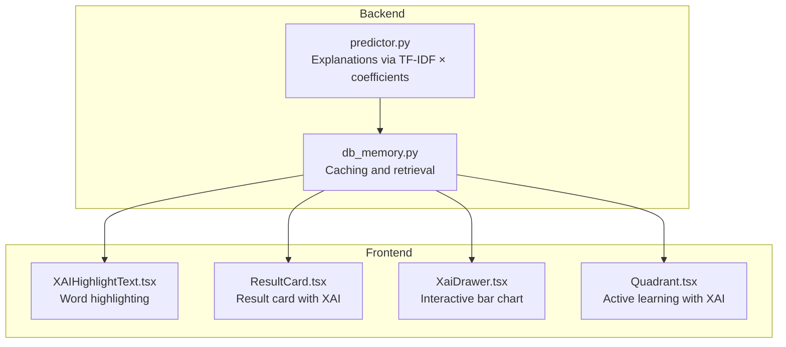
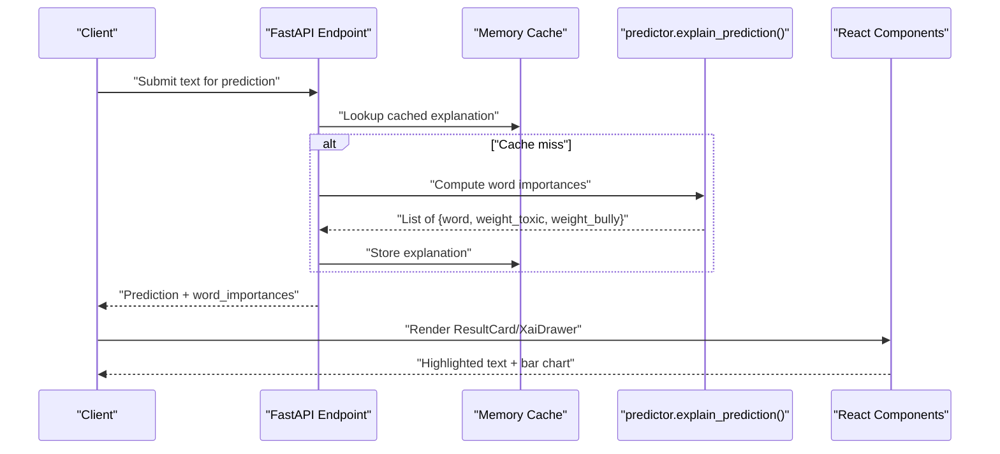
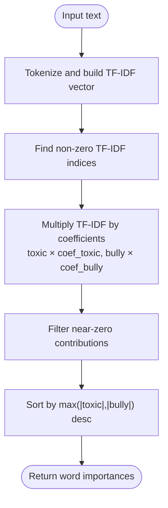
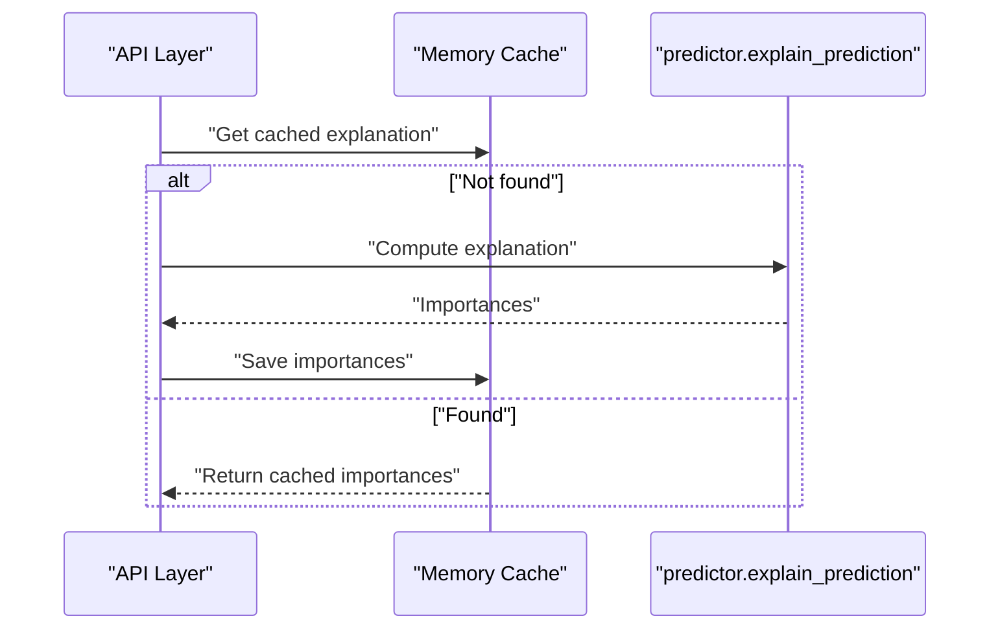
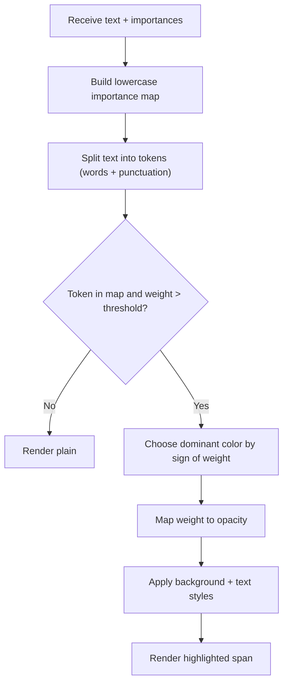
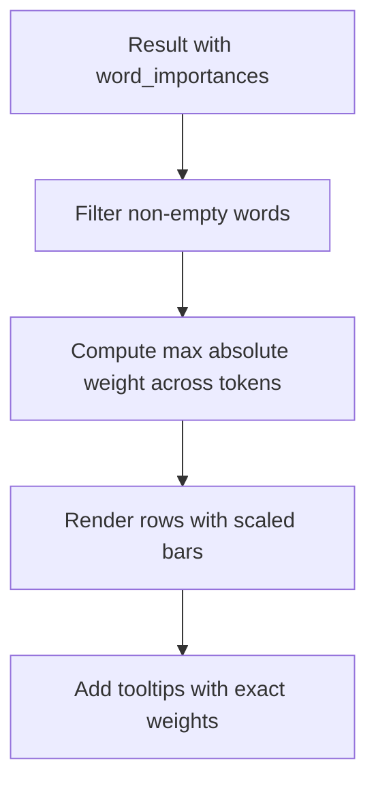
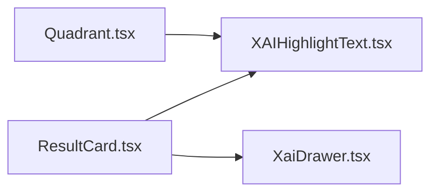
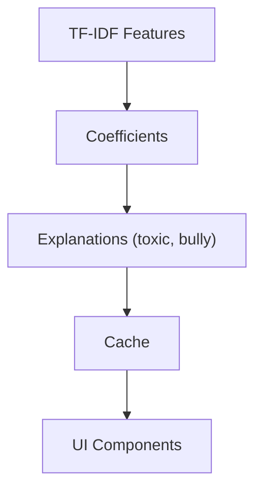

# Explainable AI and XAI Implementation

<cite>
**Referenced Files in This Document**
- [predictor.py](file://cyberbullying_api/classifier/predictor.py)
- [db_memory.py](file://cyberbullying_api/classifier/db_memory.py)
- [XAIHighlightText.tsx](file://frontend/src/components/XAIHighlightText.tsx)
- [XaiDrawer.tsx](file://frontend/src/components/Detector/XaiDrawer.tsx)
- [ResultCard.tsx](file://frontend/src/components/Detector/ResultCard.tsx)
- [Quadrant.tsx](file://frontend/src/components/ActiveLearning/Quadrant.tsx)
- [XAIHighlightText.test.tsx](file://frontend/src/components/XAIHighlightText.test.tsx)
- [README.md](file://README.md)
</cite>

## Table of Contents
1. [Introduction](#introduction)
2. [Project Structure](#project-structure)
3. [Core Components](#core-components)
4. [Architecture Overview](#architecture-overview)
5. [Detailed Component Analysis](#detailed-component-analysis)
6. [Dependency Analysis](#dependency-analysis)
7. [Performance Considerations](#performance-considerations)
8. [Troubleshooting Guide](#troubleshooting-guide)
9. [Conclusion](#conclusion)
10. [Appendices](#appendices)

## Introduction
This document explains the Explainable AI (XAI) implementation and word importance visualization system used to interpret toxicity and cyberbullying predictions. It covers:
- SHAP-based attribution methods and feature importance calculation
- Explanation generation and integration between backend and frontend
- Word highlighting mechanisms, importance score mapping, and interactive explanation interfaces
- Backend SHAP explainer configuration, background dataset requirements, and explanation stability measures
- Privacy-preserving explanation techniques, caching strategies, and performance optimizations for real-time XAI
- Examples of explanation interpretation, UI components, and integration patterns with the detection workflow

## Project Structure
The XAI pipeline spans two primary areas:
- Backend (Python/FastAPI): Prediction and explanation generation via linear model coefficients and TF-IDF feature contributions
- Frontend (React): Visualization of word importances as highlighted text and bar charts

**Diagram sources**
- [predictor.py](file://cyberbullying_api/classifier/predictor.py)
- [db_memory.py](file://cyberbullying_api/classifier/db_memory.py)
- [XAIHighlightText.tsx](file://frontend/src/components/XAIHighlightText.tsx)
- [ResultCard.tsx](file://frontend/src/components/Detector/ResultCard.tsx)
- [XaiDrawer.tsx](file://frontend/src/components/Detector/XaiDrawer.tsx)
- [Quadrant.tsx](file://frontend/src/components/ActiveLearning/Quadrant.tsx)

**Section sources**
- [README.md](file://README.md)

## Core Components
- Backend explanation generator: Computes per-token SHAP-style contributions by multiplying TF-IDF feature values with learned coefficients for toxicity and bullying.
- Frontend highlight renderer: Highlights words whose absolute contribution exceeds a small threshold and maps magnitude to opacity for visual prominence.
- Interactive explanation drawer: Presents a horizontal bar chart of top contributing tokens with separate bars for toxicity and bullying weights.
- Caching layer: Stores computed explanations to reduce repeated computation and improve latency.

Key backend implementation references:
- Explanation function and coefficient multiplication: [predictor.py](file://cyberbullying_api/classifier/predictor.py)
- Invocation from memory cache layer: [db_memory.py](file://cyberbullying_api/classifier/db_memory.py)

Key frontend implementation references:
- Highlighting and opacity mapping: [XAIHighlightText.tsx](file://frontend/src/components/XAIHighlightText.tsx)
- Bar chart visualization and thresholds: [XaiDrawer.tsx](file://frontend/src/components/Detector/XaiDrawer.tsx)
- Integration in result cards and active learning: [ResultCard.tsx](file://frontend/src/components/Detector/ResultCard.tsx), [Quadrant.tsx](file://frontend/src/components/ActiveLearning/Quadrant.tsx)

**Section sources**
- [predictor.py](file://cyberbullying_api/classifier/predictor.py)
- [db_memory.py](file://cyberbullying_api/classifier/db_memory.py)
- [XAIHighlightText.tsx](file://frontend/src/components/XAIHighlightText.tsx)
- [XaiDrawer.tsx](file://frontend/src/components/Detector/XaiDrawer.tsx)
- [ResultCard.tsx](file://frontend/src/components/Detector/ResultCard.tsx)
- [Quadrant.tsx](file://frontend/src/components/ActiveLearning/Quadrant.tsx)

## Architecture Overview
The XAI architecture integrates prediction and explanation generation with a responsive UI. The backend computes per-token contributions and caches them, while the frontend renders both textual highlights and interactive charts.

**Diagram sources**
- [db_memory.py](file://cyberbullying_api/classifier/db_memory.py)
- [predictor.py](file://cyberbullying_api/classifier/predictor.py)
- [ResultCard.tsx](file://frontend/src/components/Detector/ResultCard.tsx)
- [XaiDrawer.tsx](file://frontend/src/components/Detector/XaiDrawer.tsx)

## Detailed Component Analysis

### Backend: Explanation Generation (predictor.py)
- Purpose: Compute per-word SHAP-style contributions using TF-IDF feature values and learned coefficients for toxicity and bullying.
- Inputs: Cleaned text tokenized into features; TF-IDF matrix; model coefficients for toxicity and bullying.
- Processing:
  - Extract non-zero indices from TF-IDF vector.
  - Multiply TF-IDF value by corresponding coefficient for each target to obtain weighted contribution.
  - Filter out near-zero contributions and sort by absolute contribution magnitude.
- Outputs: List of word importance entries with toxicity and bullying weights.
- Stability and thresholds:
  - Uses small epsilon-like thresholds to avoid reporting negligible contributions.
  - Sorts by maximum absolute weight to surface most influential tokens.

**Diagram sources**
- [predictor.py](file://cyberbullying_api/classifier/predictor.py)

**Section sources**
- [predictor.py](file://cyberbullying_api/classifier/predictor.py)

### Backend: Caching and Retrieval (db_memory.py)
- Purpose: Persist and reuse explanations to minimize recomputation and latency.
- Mechanism: On successful prediction, store the computed word importances alongside the prediction result.
- Integration: The prediction pipeline invokes the explanation function and writes results into the cache layer.

**Diagram sources**
- [db_memory.py](file://cyberbullying_api/classifier/db_memory.py)
- [predictor.py](file://cyberbullying_api/classifier/predictor.py)

**Section sources**
- [db_memory.py](file://cyberbullying_api/classifier/db_memory.py)

### Frontend: Word Highlighting (XAIHighlightText.tsx)
- Purpose: Visually emphasize tokens with significant contributions.
- Tokenization: Splits input text by word boundaries and punctuation while preserving separators for accurate rendering.
- Matching: Builds a lowercase map of provided importances for O(1) lookup.
- Highlighting rules:
  - Only tokens present in importances and exceeding a small threshold are highlighted.
  - Dominant contributor determines color: red for toxicity, purple for bullying.
  - Opacity mapped to absolute weight magnitude for visual prominence.
- Accessibility: Tooltip titles included in SVG bars for interactive tooltips.

**Diagram sources**
- [XAIHighlightText.tsx](file://frontend/src/components/XAIHighlightText.tsx)

**Section sources**
- [XAIHighlightText.tsx](file://frontend/src/components/XAIHighlightText.tsx)

### Frontend: Interactive Bar Chart (XaiDrawer.tsx)
- Purpose: Render a compact, sortable bar chart of top contributing tokens.
- Data filtering: Excludes empty words and sorts by maximum absolute weight.
- Visualization:
  - Left column: token label.
  - Two colored bars per row: toxicity and bullying weights scaled to the global maximum.
  - Positive/negative direction indicated by bar orientation; numeric labels show exact weights.
- UX: Includes a drawer overlay and explanatory note about SHAP-style weights.

**Diagram sources**
- [XaiDrawer.tsx](file://frontend/src/components/Detector/XaiDrawer.tsx)

**Section sources**
- [XaiDrawer.tsx](file://frontend/src/components/Detector/XaiDrawer.tsx)

### Frontend: Integration in UI (ResultCard.tsx, Quadrant.tsx)
- ResultCard.tsx: Displays a summary of highlighted words and a button to open the detailed XAI drawer.
- Quadrant.tsx: Integrates XAI highlighting inside draggable items for active learning workflows.

**Diagram sources**
- [ResultCard.tsx](file://frontend/src/components/Detector/ResultCard.tsx)
- [Quadrant.tsx](file://frontend/src/components/ActiveLearning/Quadrant.tsx)
- [XAIHighlightText.tsx](file://frontend/src/components/XAIHighlightText.tsx)
- [XaiDrawer.tsx](file://frontend/src/components/Detector/XaiDrawer.tsx)

**Section sources**
- [ResultCard.tsx](file://frontend/src/components/Detector/ResultCard.tsx)
- [Quadrant.tsx](file://frontend/src/components/ActiveLearning/Quadrant.tsx)

### Test Coverage (XAIHighlightText.test.tsx)
- Validates rendering behavior for missing or empty importances.
- Confirms color and styling for toxicity vs. bullying dominance.
- Ensures low-weight tokens are not highlighted.
- Verifies tooltip presence with contribution details.

**Section sources**
- [XAIHighlightText.test.tsx](file://frontend/src/components/XAIHighlightText.test.tsx)

## Dependency Analysis
- Backend depends on:
  - TF-IDF vector representation and model coefficients for toxicity and bullying.
  - Caching layer to store and retrieve explanations.
- Frontend depends on:
  - Consistent data schema for word importances.
  - Stable tokenization behavior to match backend features.

**Diagram sources**
- [predictor.py](file://cyberbullying_api/classifier/predictor.py)
- [db_memory.py](file://cyberbullying_api/classifier/db_memory.py)
- [XAIHighlightText.tsx](file://frontend/src/components/XAIHighlightText.tsx)
- [XaiDrawer.tsx](file://frontend/src/components/Detector/XaiDrawer.tsx)

**Section sources**
- [predictor.py](file://cyberbullying_api/classifier/predictor.py)
- [db_memory.py](file://cyberbullying_api/classifier/db_memory.py)
- [XAIHighlightText.tsx](file://frontend/src/components/XAIHighlightText.tsx)
- [XaiDrawer.tsx](file://frontend/src/components/Detector/XaiDrawer.tsx)

## Performance Considerations
- Computation cost:
  - Explanation computation scales with the number of non-zero TF-IDF features; keep preprocessing efficient.
- Caching:
  - Reuse previously computed explanations to avoid redundant computation.
- Rendering:
  - Frontend thresholds prevent unnecessary DOM updates for low-importance tokens.
  - SVG bar charts are lightweight and scale well with moderate token counts.
- Real-time optimization:
  - Limit top-k tokens shown in the bar chart to reduce layout work.
  - Debounce or batch UI updates when rapidly switching results.

## Troubleshooting Guide
- No highlighted words appear:
  - Verify that importances are populated and exceed the frontend threshold.
  - Confirm tokenization alignment between backend features and frontend tokens.
- Incorrect colors or opacities:
  - Ensure dominance is determined by the larger absolute weight and that opacity mapping is applied consistently.
- Drawer shows “no important weights”:
  - Check backend filtering thresholds and confirm that non-zero contributions exist for the input.
- Caching inconsistencies:
  - Ensure the cache stores and retrieves explanations keyed by the input text or hash.

**Section sources**
- [XAIHighlightText.tsx](file://frontend/src/components/XAIHighlightText.tsx)
- [XaiDrawer.tsx](file://frontend/src/components/Detector/XaiDrawer.tsx)
- [predictor.py](file://cyberbullying_api/classifier/predictor.py)
- [db_memory.py](file://cyberbullying_api/classifier/db_memory.py)

## Conclusion
The XAI system combines linear model coefficients with TF-IDF feature contributions to produce SHAP-style per-token explanations. The backend efficiently computes and caches importances, while the frontend renders them as intuitive highlights and bar charts. Together, they support transparent, interactive interpretation of toxicity and cyberbullying predictions, enabling users to understand model decisions and integrate explanations into broader detection workflows.

## Appendices

### Example Interpretation Scenarios
- Toxicity-dominant term: A single word contributes strongly to toxicity, resulting in red highlighting with higher opacity.
- Bullying-dominant term: A word contributes more to bullying, highlighted in purple.
- Balanced contribution: Words with similar toxicity and bullying weights are rendered with appropriate dominance coloring and moderate opacity.

### Privacy and Security Notes
- Explanations are local to the client-server boundary; no sensitive raw features are transmitted beyond the model’s internal representation.
- Consider hashing or anonymizing identifiers when persisting explanations for audit trails.

### Integration Patterns
- Detection result card: Embed XAI highlights and a “View detailed XAI” action.
- Active learning: Display XAI highlights in draggable items to guide labeling and review.
- Batch analysis: Paginate and limit top-k tokens per result to maintain responsiveness.