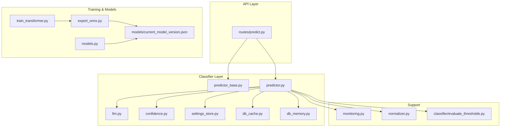
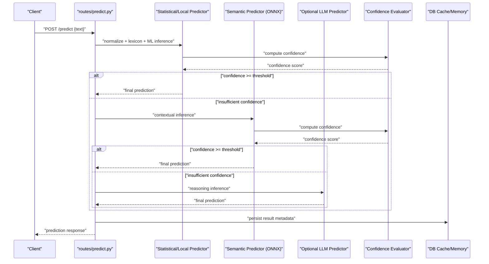
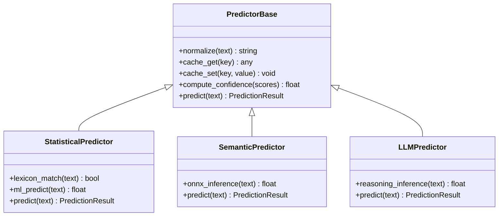
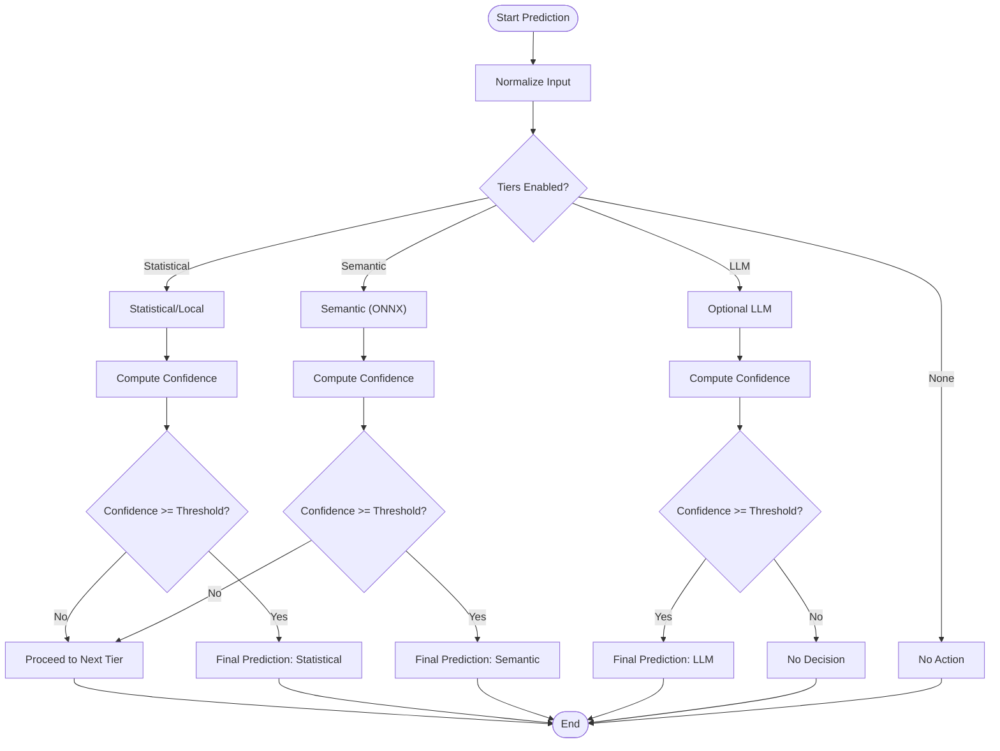
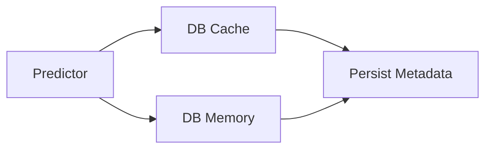
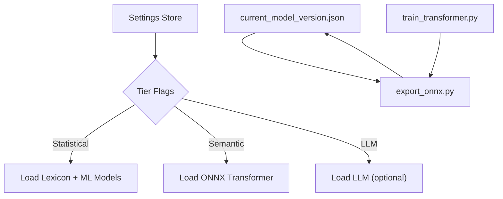
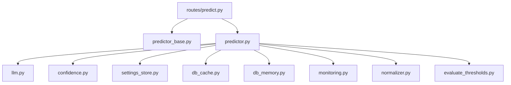

# Hybrid Pipeline Architecture

<cite>
**Referenced Files in This Document**
- [predictor_base.py](file://cyberbullying_api/classifier/predictor_base.py)
- [predictor.py](file://cyberbullying_api/classifier/predictor.py)
- [llm.py](file://cyberbullying_api/classifier/llm.py)
- [confidence.py](file://cyberbullying_api/classifier/confidence.py)
- [settings_store.py](file://cyberbullying_api/classifier/settings_store.py)
- [db_cache.py](file://cyberbullying_api/classifier/db_cache.py)
- [db_memory.py](file://cyberbullying_api/classifier/db_memory.py)
- [models.py](file://cyberbullying_api/models.py)
- [predict.py](file://cyberbullying_api/routes/predict.py)
- [monitoring.py](file://cyberbullying_api/monitoring.py)
- [normalizer.py](file://cyberbullying_api/normalizer.py)
- [export_onnx.py](file://cyberbullying_api/export_onnx.py)
- [train_transformer.py](file://cyberbullying_api/train_transformer.py)
- [evaluate_thresholds.py](file://cyberbullying_api/classifier/evaluate_thresholds.py)
- [current_model_version.json](file://cyberbullying_api/models/current_model_version.json)
</cite>

## Table of Contents
1. [Introduction](#introduction)
2. [Project Structure](#project-structure)
3. [Core Components](#core-components)
4. [Architecture Overview](#architecture-overview)
5. [Detailed Component Analysis](#detailed-component-analysis)
6. [Dependency Analysis](#dependency-analysis)
7. [Performance Considerations](#performance-considerations)
8. [Troubleshooting Guide](#troubleshooting-guide)
9. [Conclusion](#conclusion)

## Introduction
This document describes the hybrid multi-tier classification pipeline designed for cyberbullying detection. The system is structured in three distinct tiers:
- Statistical/Local Tier: Uses lexicon-based matching and lightweight machine learning models for fast, interpretable decisions.
- Semantic Tier: Employs Transformer-based ONNX models for contextual understanding and nuanced classification.
- Optional LLM Tier: Provides advanced reasoning capabilities when enabled via configuration.

The pipeline implements a predictor factory pattern, robust ensemble strategies, and tier prioritization logic with graceful fallbacks. It also includes performance optimizations, resource allocation controls, and latency-aware runtime decision-making.

## Project Structure
The hybrid pipeline resides primarily under the cyberbullying_api/classifier module, with supporting infrastructure in routes, models, training, and monitoring. Key areas:
- Classifier: Predictor base classes, concrete predictors, LLM integration, confidence evaluation, and persistence helpers.
- Routes: Prediction endpoint orchestrating the pipeline and returning results.
- Training: Model development and transformer training utilities.
- Monitoring: Observability hooks for latency, throughput, and error tracking.
- Models: Versioning and ONNX export utilities.

**Diagram sources**
- [predictor_base.py](file://cyberbullying_api/classifier/predictor_base.py)
- [predictor.py](file://cyberbullying_api/classifier/predictor.py)
- [llm.py](file://cyberbullying_api/classifier/llm.py)
- [confidence.py](file://cyberbullying_api/classifier/confidence.py)
- [settings_store.py](file://cyberbullying_api/classifier/settings_store.py)
- [db_cache.py](file://cyberbullying_api/classifier/db_cache.py)
- [db_memory.py](file://cyberbullying_api/classifier/db_memory.py)
- [predict.py](file://cyberbullying_api/routes/predict.py)
- [monitoring.py](file://cyberbullying_api/monitoring.py)
- [normalizer.py](file://cyberbullying_api/normalizer.py)
- [export_onnx.py](file://cyberbullying_api/export_onnx.py)
- [train_transformer.py](file://cyberbullying_api/train_transformer.py)
- [evaluate_thresholds.py](file://cyberbullying_api/classifier/evaluate_thresholds.py)
- [current_model_version.json](file://cyberbullying_api/models/current_model_version.json)
- [models.py](file://cyberbullying_api/models.py)

**Section sources**
- [predictor_base.py](file://cyberbullying_api/classifier/predictor_base.py)
- [predictor.py](file://cyberbullying_api/classifier/predictor.py)
- [llm.py](file://cyberbullying_api/classifier/llm.py)
- [predict.py](file://cyberbullying_api/routes/predict.py)

## Core Components
This section outlines the foundational building blocks of the hybrid pipeline.

- Predictor Base Classes and Factory Pattern
  - Defines the abstraction for predictors and encapsulates shared behaviors such as normalization, caching, and confidence computation.
  - Implements a factory method to instantiate specific predictor variants based on configuration flags and model availability.

- Ensemble Prediction Strategies
  - Aggregates predictions from multiple tiers with weighted voting or threshold-based fusion.
  - Supports early exit when confidence thresholds are met to reduce latency.

- Tier Prioritization and Fallback Logic
  - Executes tiers in order: Statistical/Local → Semantic → Optional LLM.
  - Falls back to the next tier if the current tier fails or confidence is insufficient.

- Configuration and Resource Allocation
  - Centralized settings store enables toggling tiers, setting thresholds, and controlling resource usage.
  - Model versioning ensures compatibility and rollback capability.

**Section sources**
- [predictor_base.py](file://cyberbullying_api/classifier/predictor_base.py)
- [predictor.py](file://cyberbullying_api/classifier/predictor.py)
- [settings_store.py](file://cyberbullying_api/classifier/settings_store.py)
- [current_model_version.json](file://cyberbullying_api/models/current_model_version.json)

## Architecture Overview
The hybrid pipeline follows a layered design with explicit data flow and control flow between tiers. The prediction route coordinates the entire process, invoking predictors and aggregating results.

**Diagram sources**
- [predict.py](file://cyberbullying_api/routes/predict.py)
- [predictor.py](file://cyberbullying_api/classifier/predictor.py)
- [llm.py](file://cyberbullying_api/classifier/llm.py)
- [confidence.py](file://cyberbullying_api/classifier/confidence.py)
- [db_cache.py](file://cyberbullying_api/classifier/db_cache.py)
- [db_memory.py](file://cyberbullying_api/classifier/db_memory.py)

## Detailed Component Analysis

### Predictor Base Classes and Inheritance Hierarchy
The predictor hierarchy establishes a clear contract for implementing local, semantic, and LLM predictors while sharing common utilities for normalization, caching, and confidence scoring.

Key responsibilities:
- Normalization: Preprocesses input text consistently across tiers.
- Caching: Reuses prior results to minimize redundant computations.
- Confidence Evaluation: Computes confidence scores to drive ensemble decisions.
- Predict: Executes tier-specific logic and returns unified results.

**Diagram sources**
- [predictor_base.py](file://cyberbullying_api/classifier/predictor_base.py)
- [predictor.py](file://cyberbullying_api/classifier/predictor.py)
- [llm.py](file://cyberbullying_api/classifier/llm.py)
- [confidence.py](file://cyberbullying_api/classifier/confidence.py)
- [db_cache.py](file://cyberbullying_api/classifier/db_cache.py)
- [db_memory.py](file://cyberbullying_api/classifier/db_memory.py)

**Section sources**
- [predictor_base.py](file://cyberbullying_api/classifier/predictor_base.py)
- [predictor.py](file://cyberbullying_api/classifier/predictor.py)
- [llm.py](file://cyberbullying_api/classifier/llm.py)

### Ensemble Prediction Strategies and Threshold Management
The ensemble combines outputs from multiple tiers using configurable thresholds and prioritization rules. Early exit reduces latency when sufficient confidence is achieved.

**Diagram sources**
- [predictor.py](file://cyberbullying_api/classifier/predictor.py)
- [confidence.py](file://cyberbullying_api/classifier/confidence.py)
- [settings_store.py](file://cyberbullying_api/classifier/settings_store.py)

**Section sources**
- [predictor.py](file://cyberbullying_api/classifier/predictor.py)
- [confidence.py](file://cyberbullying_api/classifier/confidence.py)
- [settings_store.py](file://cyberbullying_api/classifier/settings_store.py)

### Data Persistence and Caching Layers
The pipeline persists prediction metadata and leverages both cache and memory stores to optimize repeated queries and reduce load.

**Diagram sources**
- [db_cache.py](file://cyberbullying_api/classifier/db_cache.py)
- [db_memory.py](file://cyberbullying_api/classifier/db_memory.py)

**Section sources**
- [db_cache.py](file://cyberbullying_api/classifier/db_cache.py)
- [db_memory.py](file://cyberbullying_api/classifier/db_memory.py)

### Model Selection Criteria and Versioning
Model selection is driven by configuration flags and model versioning. ONNX exports and transformer training support continuous model updates.

**Diagram sources**
- [settings_store.py](file://cyberbullying_api/classifier/settings_store.py)
- [current_model_version.json](file://cyberbullying_api/models/current_model_version.json)
- [export_onnx.py](file://cyberbullying_api/export_onnx.py)
- [train_transformer.py](file://cyberbullying_api/train_transformer.py)

**Section sources**
- [settings_store.py](file://cyberbullying_api/classifier/settings_store.py)
- [current_model_version.json](file://cyberbullying_api/models/current_model_version.json)
- [export_onnx.py](file://cyberbullying_api/export_onnx.py)
- [train_transformer.py](file://cyberbullying_api/train_transformer.py)

## Dependency Analysis
The hybrid pipeline exhibits low coupling between tiers, with clear separation of concerns. The routes module depends on predictor implementations, while predictors rely on shared utilities for normalization, caching, and confidence evaluation.

**Diagram sources**
- [predict.py](file://cyberbullying_api/routes/predict.py)
- [predictor_base.py](file://cyberbullying_api/classifier/predictor_base.py)
- [predictor.py](file://cyberbullying_api/classifier/predictor.py)
- [llm.py](file://cyberbullying_api/classifier/llm.py)
- [confidence.py](file://cyberbullying_api/classifier/confidence.py)
- [settings_store.py](file://cyberbullying_api/classifier/settings_store.py)
- [db_cache.py](file://cyberbullying_api/classifier/db_cache.py)
- [db_memory.py](file://cyberbullying_api/classifier/db_memory.py)
- [monitoring.py](file://cyberbullying_api/monitoring.py)
- [normalizer.py](file://cyberbullying_api/normalizer.py)
- [evaluate_thresholds.py](file://cyberbullying_api/classifier/evaluate_thresholds.py)

**Section sources**
- [predict.py](file://cyberbullying_api/routes/predict.py)
- [predictor_base.py](file://cyberbullying_api/classifier/predictor_base.py)
- [predictor.py](file://cyberbullying_api/classifier/predictor.py)

## Performance Considerations
- Latency Optimization
  - Early exit on confidence thresholds to avoid unnecessary tier invocations.
  - Caching reused results to minimize redundant computations.
  - Lightweight statistical tier as the fastest initial filter.

- Resource Allocation
  - Enable/disable tiers based on deployment constraints.
  - Control batch sizes and concurrency limits at the API level.
  - Use model quantization and ONNX acceleration for the semantic tier.

- Monitoring and Metrics
  - Track per-tier latency, throughput, and error rates.
  - Observe confidence distributions to tune thresholds dynamically.

[No sources needed since this section provides general guidance]

## Troubleshooting Guide
Common issues and resolutions:
- Insufficient Confidence Across Tiers
  - Adjust thresholds in the settings store and re-evaluate thresholds using the evaluation utilities.
  - Verify normalization and caching configurations.

- Model Loading Failures
  - Confirm model version alignment and ONNX export completeness.
  - Validate transformer training artifacts and export steps.

- Performance Degradation
  - Review monitoring metrics and enable tier-specific optimizations.
  - Consider reducing concurrent requests or scaling out the service.

**Section sources**
- [settings_store.py](file://cyberbullying_api/classifier/settings_store.py)
- [evaluate_thresholds.py](file://cyberbullying_api/classifier/evaluate_thresholds.py)
- [monitoring.py](file://cyberbullying_api/monitoring.py)
- [export_onnx.py](file://cyberbullying_api/export_onnx.py)
- [train_transformer.py](file://cyberbullying_api/train_transformer.py)

## Conclusion
The hybrid multi-tier classification pipeline balances speed, accuracy, and reasoning capacity through a modular design. By leveraging a predictor factory pattern, ensemble strategies, and tier prioritization with fallbacks, the system delivers robust performance across diverse workloads. Configuration-driven controls and observability ensure efficient operation and continuous improvement.