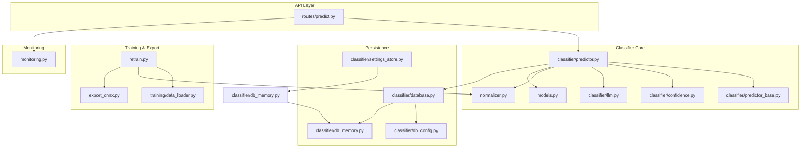
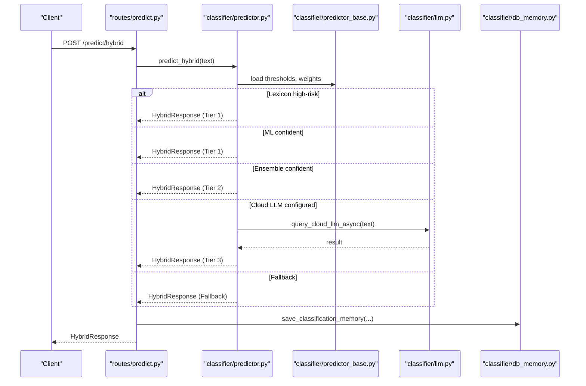
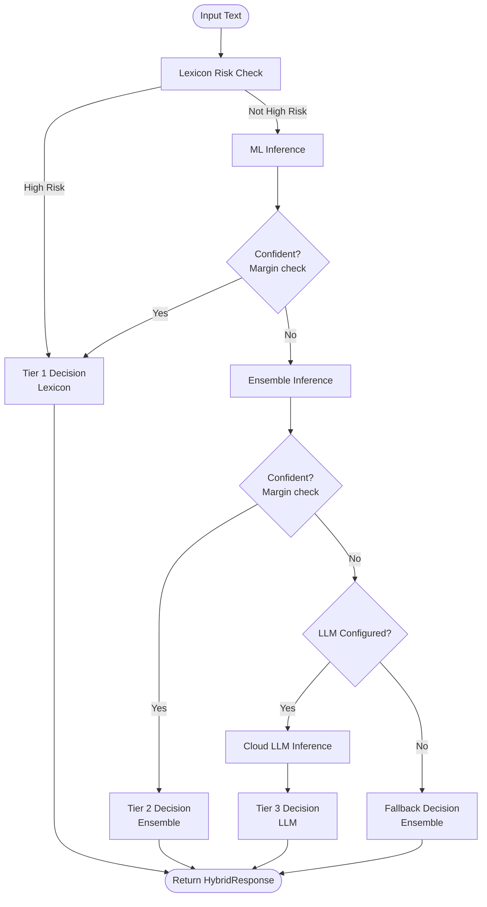
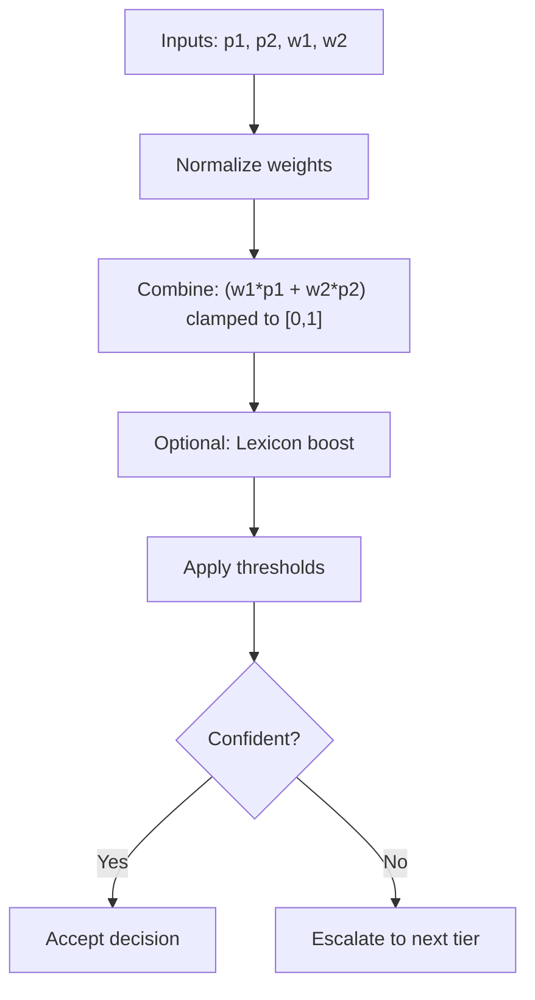
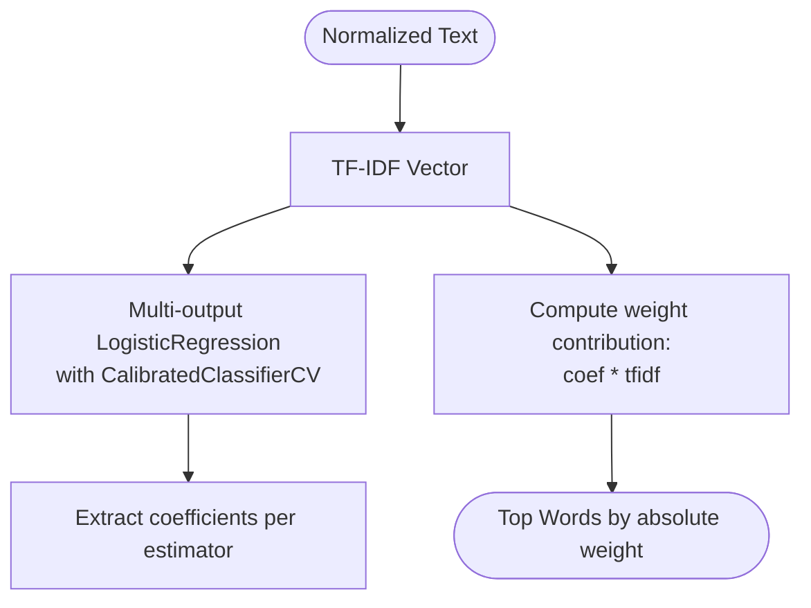
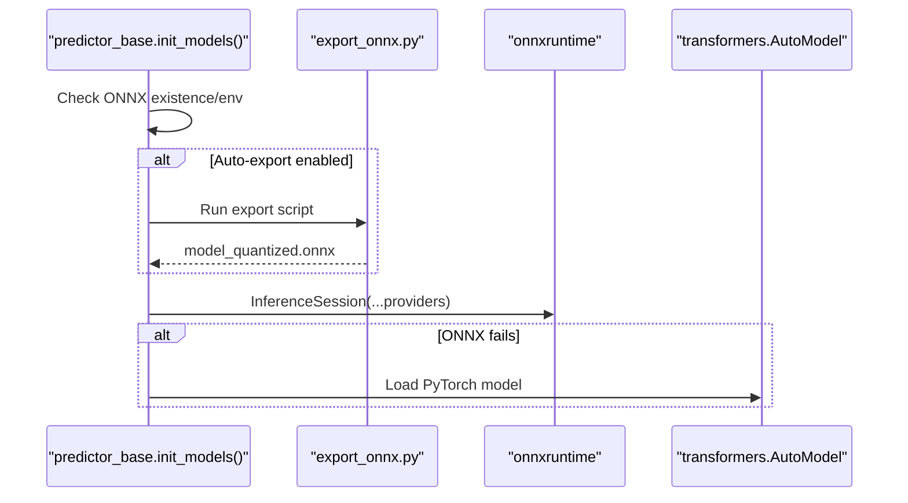
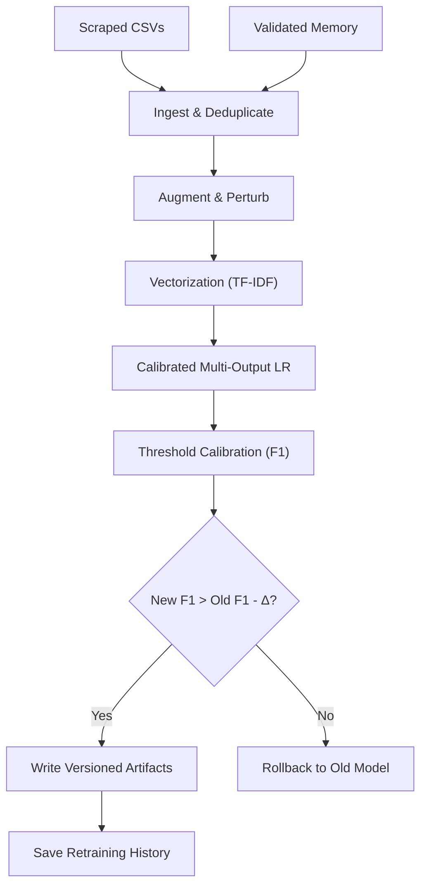
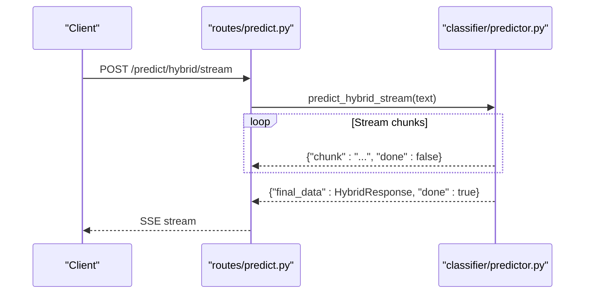
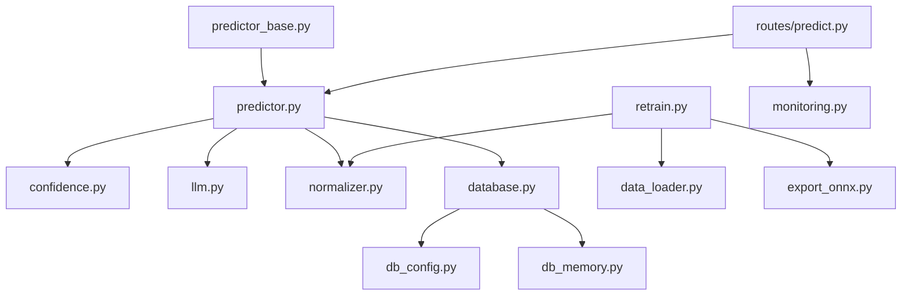
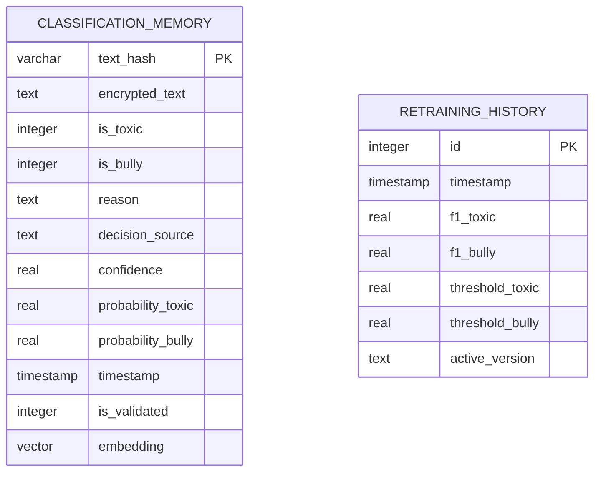

# Machine Learning System

<cite>
**Referenced Files in This Document**
- [predictor_base.py](file://cyberbullying_api/classifier/predictor_base.py)
- [predictor.py](file://cyberbullying_api/classifier/predictor.py)
- [confidence.py](file://cyberbullying_api/classifier/confidence.py)
- [llm.py](file://cyberbullying_api/classifier/llm.py)
- [database.py](file://cyberbullying_api/classifier/database.py)
- [db_config.py](file://cyberbullying_api/classifier/db_config.py)
- [db_memory.py](file://cyberbullying_api/classifier/db_memory.py)
- [settings_store.py](file://cyberbullying_api/classifier/settings_store.py)
- [models.py](file://cyberbullying_api/models.py)
- [export_onnx.py](file://cyberbullying_api/export_onnx.py)
- [normalizer.py](file://cyberbullying_api/normalizer.py)
- [retrain.py](file://cyberbullying_api/retrain.py)
- [data_loader.py](file://cyberbullying_api/training/data_loader.py)
- [monitoring.py](file://cyberbullying_api/monitoring.py)
- [predict.py](file://cyberbullying_api/routes/predict.py)
</cite>

## Table of Contents
1. [Introduction](#introduction)
2. [Project Structure](#project-structure)
3. [Core Components](#core-components)
4. [Architecture Overview](#architecture-overview)
5. [Detailed Component Analysis](#detailed-component-analysis)
6. [Dependency Analysis](#dependency-analysis)
7. [Performance Considerations](#performance-considerations)
8. [Troubleshooting Guide](#troubleshooting-guide)
9. [Conclusion](#conclusion)
10. [Appendices](#appendices)

## Introduction
This document describes BullyGuard ID’s hybrid multi-tier classification pipeline for detecting cyberbullying and hate speech in Indonesian social media text. The system integrates:
- Statistical/local tier (lexicon matching + calibrated ML)
- Semantic tier (Transformer ONNX)
- Optional LLM tier (cloud Gemini) for nuanced cases and sarcasm bypass

It documents predictor base classes, confidence scoring, database integration for model artifacts, ONNX export, explainable AI (SHAP-based word importance), threshold-based decision making, ensemble strategies, model versioning, performance evaluation, calibration, active learning, training data management, and retraining workflows. It also covers deployment, monitoring, and maintenance.

## Project Structure
The system is organized around a FastAPI service with modular classifier components, training utilities, and persistence layers.



**Diagram sources**
- [predict.py:1-166](file://cyberbullying_api/routes/predict.py#L1-L166)
- [predictor_base.py:1-249](file://cyberbullying_api/classifier/predictor_base.py#L1-L249)
- [predictor.py:1-639](file://cyberbullying_api/classifier/predictor.py#L1-L639)
- [confidence.py:1-221](file://cyberbullying_api/classifier/confidence.py#L1-L221)
- [llm.py:1-370](file://cyberbullying_api/classifier/llm.py#L1-L370)
- [normalizer.py:1-368](file://cyberbullying_api/normalizer.py#L1-L368)
- [models.py:1-223](file://cyberbullying_api/models.py#L1-L223)
- [database.py:1-14](file://cyberbullying_api/classifier/database.py#L1-L14)
- [db_config.py:1-357](file://cyberbullying_api/classifier/db_config.py#L1-L357)
- [db_memory.py:1-756](file://cyberbullying_api/classifier/db_memory.py#L1-L756)
- [settings_store.py:1-73](file://cyberbullying_api/classifier/settings_store.py#L1-L73)
- [retrain.py:1-513](file://cyberbullying_api/retrain.py#L1-L513)
- [data_loader.py:1-385](file://cyberbullying_api/training/data_loader.py#L1-L385)
- [export_onnx.py:1-93](file://cyberbullying_api/export_onnx.py#L1-L93)
- [monitoring.py:1-49](file://cyberbullying_api/monitoring.py#L1-L49)

**Section sources**
- [predict.py:1-166](file://cyberbullying_api/routes/predict.py#L1-L166)
- [predictor_base.py:1-249](file://cyberbullying_api/classifier/predictor_base.py#L1-L249)
- [predictor.py:1-639](file://cyberbullying_api/classifier/predictor.py#L1-L639)
- [db_config.py:1-357](file://cyberbullying_api/classifier/db_config.py#L1-L357)

## Core Components
- Predictor Base: Initializes global models (lexicon, ML, Transformer ONNX/PyTorch, embeddings), loads thresholds, and manages concurrency.
- Predictors: Implements lexicon, ML, Transformer, ensemble, and hybrid (multi-tier) inference with streaming support.
- Confidence Utilities: Provides threshold-aware confidence checks, weighted ensemble combination, and lexicon boosting.
- LLM Integration: Cloud LLM (Gemini) with RAG retrieval, caching, and streaming responses.
- Persistence: PostgreSQL (pgvector), Redis, and SQLite caches for classification memory and settings.
- Training & Retraining: Data ingestion, augmentation, calibration, threshold optimization, rollback, and versioning.
- Monitoring: Prometheus metrics for requests, predictions, latency, cache, and LLM failures.

**Section sources**
- [predictor_base.py:45-249](file://cyberbullying_api/classifier/predictor_base.py#L45-L249)
- [predictor.py:1-639](file://cyberbullying_api/classifier/predictor.py#L1-L639)
- [confidence.py:1-221](file://cyberbullying_api/classifier/confidence.py#L1-L221)
- [llm.py:1-370](file://cyberbullying_api/classifier/llm.py#L1-L370)
- [db_memory.py:1-756](file://cyberbullying_api/classifier/db_memory.py#L1-L756)
- [retrain.py:1-513](file://cyberbullying_api/retrain.py#L1-L513)

## Architecture Overview
The hybrid pipeline routes inputs through a series of confidence-aware stages:
- Tier 1: Lexicon-based detection with risk scoring and immediate decision for high-risk cases.
- Tier 2: Ensemble of classical ML and Transformer outputs with calibrated weights.
- Tier 3: Optional cloud LLM for complex or sarcastic cases.



**Diagram sources**
- [predict.py:57-93](file://cyberbullying_api/routes/predict.py#L57-L93)
- [predictor.py:308-418](file://cyberbullying_api/classifier/predictor.py#L308-L418)
- [predictor_base.py:64-167](file://cyberbullying_api/classifier/predictor_base.py#L64-L167)
- [llm.py:110-230](file://cyberbullying_api/classifier/llm.py#L110-L230)
- [db_memory.py:17-124](file://cyberbullying_api/classifier/db_memory.py#L17-L124)

## Detailed Component Analysis

### Three-Tier Hybrid Pipeline
- Tier 1 (Lexicon): Risk scoring and immediate classification for high-risk phrases; bypasses deeper tiers when appropriate.
- Tier 2 (Ensemble): Combines classical ML and Transformer outputs with calibrated weights and lexicon evidence.
- Tier 3 (LLM): Optional cloud LLM with dynamic few-shot examples and streaming.



**Diagram sources**
- [predictor.py:308-418](file://cyberbullying_api/classifier/predictor.py#L308-L418)
- [confidence.py:72-109](file://cyberbullying_api/classifier/confidence.py#L72-L109)

**Section sources**
- [predictor.py:146-418](file://cyberbullying_api/classifier/predictor.py#L146-L418)
- [confidence.py:72-109](file://cyberbullying_api/classifier/confidence.py#L72-L109)

### Confidence Scoring and Threshold-Based Decisions
- Margin-based confidence: Both labels must be sufficiently distant from thresholds to avoid escalation.
- Weighted ensemble: Normalized weights combine ML and Transformer outputs; minimum signal threshold prevents masking by zero outputs.
- Lexicon boosting: Conservative probability boost based on risk label; caps prevent extreme scores.
- LLM pseudo-probability: Converts binary LLM decisions to non-extreme probabilities.



**Diagram sources**
- [confidence.py:122-150](file://cyberbullying_api/classifier/confidence.py#L122-L150)
- [confidence.py:179-200](file://cyberbullying_api/classifier/confidence.py#L179-L200)

**Section sources**
- [confidence.py:21-221](file://cyberbullying_api/classifier/confidence.py#L21-L221)

### Explainable AI: SHAP-Based Word Importance
- Classical ML: Uses estimator coefficients and TF-IDF weights to compute word-level contributions for toxicity and bullying.
- Transformer/LLM: Word importance not computed; focus remains on classical model interpretability.



**Diagram sources**
- [predictor.py:53-98](file://cyberbullying_api/classifier/predictor.py#L53-L98)

**Section sources**
- [predictor.py:53-98](file://cyberbullying_api/classifier/predictor.py#L53-L98)

### Database Integration for Model Artifacts and Memory
- PostgreSQL with pgvector for embeddings and structured storage; Redis for fast cache; SQLite as fallback.
- Classification memory stores encrypted text, predictions, reasons, decision source, confidence, probabilities, validation flag, and embeddings.
- Settings stored in Redis with local file fallback; supports runtime reload via pub/sub.

```mermaid
graph LR
A["classification_memory (PG)"] <- --> B["Redis Cache"]
A <- --> C["SQLite Fallback"]
D["settings.json"] <- --> E["Redis settings"]
F["retraining_history (PG)"] <- --> C
```

**Diagram sources**
- [db_config.py:118-218](file://cyberbullying_api/classifier/db_config.py#L118-L218)
- [db_memory.py:17-124](file://cyberbullying_api/classifier/db_memory.py#L17-L124)
- [settings_store.py:33-72](file://cyberbullying_api/classifier/settings_store.py#L33-L72)

**Section sources**
- [db_config.py:1-357](file://cyberbullying_api/classifier/db_config.py#L1-L357)
- [db_memory.py:1-756](file://cyberbullying_api/classifier/db_memory.py#L1-L756)
- [settings_store.py:1-73](file://cyberbullying_api/classifier/settings_store.py#L1-L73)

### ONNX Model Export and Inference Optimization
- Export script converts PyTorch model to ONNX, applies dynamic quantization, and handles platform-specific shape inference issues.
- Runtime loads ONNX with provider selection (TensorRT/CUDA/CPU) and falls back to PyTorch if unavailable.
- Auto-export controlled by environment variable; cleans legacy model before export.



**Diagram sources**
- [predictor_base.py:181-232](file://cyberbullying_api/classifier/predictor_base.py#L181-L232)
- [export_onnx.py:36-92](file://cyberbullying_api/export_onnx.py#L36-L92)

**Section sources**
- [export_onnx.py:1-93](file://cyberbullying_api/export_onnx.py#L1-L93)
- [predictor_base.py:181-232](file://cyberbullying_api/classifier/predictor_base.py#L181-L232)

### Training Data Management and Retraining Workflows
- Data ingestion from scraped CSVs and validated classification memory (PostgreSQL/SQLite).
- Augmentation strategies: sarcasm and praise examples, perturbation for toxic texts, and active learning oversampling of validated samples.
- Calibration and threshold optimization via cross-validated Platt scaling and F1-maximization.
- Rollback protection: compares new model F1 against old model; if degradation exceeds threshold, keeps old model.
- Versioning: timestamps model and vectorizer files, updates current version metadata, and logs retraining history.



**Diagram sources**
- [retrain.py:67-490](file://cyberbullying_api/retrain.py#L67-L490)
- [data_loader.py:155-303](file://cyberbullying_api/training/data_loader.py#L155-L303)

**Section sources**
- [retrain.py:1-513](file://cyberbullying_api/retrain.py#L1-L513)
- [data_loader.py:1-385](file://cyberbullying_api/training/data_loader.py#L1-L385)

### API Endpoints and Streaming
- Endpoints expose lexicon, ML, Transformer, ensemble, hybrid, batch, and streaming hybrid predictions.
- Streaming endpoint emits chunks and final result; metrics recorded for predictions and latency.
- Rate limiting and SSRF-safe webhook delivery for hybrid notifications.



**Diagram sources**
- [predict.py:126-164](file://cyberbullying_api/routes/predict.py#L126-L164)
- [predictor.py:442-639](file://cyberbullying_api/classifier/predictor.py#L442-L639)

**Section sources**
- [predict.py:1-166](file://cyberbullying_api/routes/predict.py#L1-L166)
- [predictor.py:442-639](file://cyberbullying_api/classifier/predictor.py#L442-L639)

## Dependency Analysis
Key dependencies and coupling:
- predictor_base initializes global models and thresholds; predictor depends on it for state.
- confidence utilities are lightweight and dependency-free for easy testing and reuse.
- llm module depends on database for cache and RAG retrieval; uses embeddings when available.
- db_config orchestrates PostgreSQL (with pgvector), Redis, and SQLite initialization and migrations.
- routes/predict depends on classifier modules and exposes standardized response models.



**Diagram sources**
- [predictor_base.py:30-36](file://cyberbullying_api/classifier/predictor_base.py#L30-L36)
- [predictor.py:15-36](file://cyberbullying_api/classifier/predictor.py#L15-L36)
- [confidence.py:14-18](file://cyberbullying_api/classifier/confidence.py#L14-L18)
- [llm.py:11-13](file://cyberbullying_api/classifier/llm.py#L11-L13)
- [database.py:1-14](file://cyberbullying_api/classifier/database.py#L1-L14)
- [db_config.py:118-218](file://cyberbullying_api/classifier/db_config.py#L118-L218)
- [db_memory.py:17-124](file://cyberbullying_api/classifier/db_memory.py#L17-L124)
- [retrain.py:26-32](file://cyberbullying_api/retrain.py#L26-L32)
- [data_loader.py:15-31](file://cyberbullying_api/training/data_loader.py#L15-L31)
- [export_onnx.py:14-20](file://cyberbullying_api/export_onnx.py#L14-L20)
- [predict.py:1-16](file://cyberbullying_api/routes/predict.py#L1-L16)
- [monitoring.py:1-49](file://cyberbullying_api/monitoring.py#L1-L49)

**Section sources**
- [predictor_base.py:1-249](file://cyberbullying_api/classifier/predictor_base.py#L1-L249)
- [predictor.py:1-639](file://cyberbullying_api/classifier/predictor.py#L1-L639)
- [db_config.py:1-357](file://cyberbullying_api/classifier/db_config.py#L1-L357)

## Performance Considerations
- Model loading and initialization are guarded by a lock and performed once; ONNX provider selection improves inference speed.
- Streaming endpoints reduce perceived latency by emitting partial results.
- Caching layers (Redis, PostgreSQL, SQLite) minimize repeated computation and improve throughput.
- Embeddings enable semantic cache matching for near-duplicates, reducing redundant LLM calls.
- Metrics capture latency by tier and prediction volume by decision source, enabling targeted tuning.

[No sources needed since this section provides general guidance]

## Troubleshooting Guide
Common issues and remedies:
- Missing or failing ONNX: Auto-export runs when enabled; otherwise falls back to PyTorch. Check environment variables and logs.
- LLM unconfigured or failing: If API key is missing, hybrid escalates to fallback; monitor Gemini failure counter.
- Database connectivity: PostgreSQL initialization includes retries and migrations; Redis ping and timeouts are handled gracefully.
- Cache misses: Classification memory lookup tries Redis, PostgreSQL, and SQLite; semantic cache uses embeddings when available.
- Model not loaded: API endpoints return 503 when models are unavailable; initialize via predictor_base.

**Section sources**
- [predictor_base.py:181-232](file://cyberbullying_api/classifier/predictor_base.py#L181-L232)
- [llm.py:120-230](file://cyberbullying_api/classifier/llm.py#L120-L230)
- [db_config.py:118-242](file://cyberbullying_api/classifier/db_config.py#L118-L242)
- [db_memory.py:125-399](file://cyberbullying_api/classifier/db_memory.py#L125-L399)
- [predict.py:24-36](file://cyberbullying_api/routes/predict.py#L24-L36)

## Conclusion
BullyGuard ID’s hybrid pipeline balances speed, accuracy, and interpretability. The three-tier design ensures robustness: lexicon for quick decisions, ensemble for most cases, and optional LLM for nuanced scenarios. Strong persistence, monitoring, and retraining tooling support continuous improvement and operational reliability.

[No sources needed since this section summarizes without analyzing specific files]

## Appendices

### Model Versioning and Metadata
- Current active version tracked in a JSON file with timestamps, F1 scores, and thresholds.
- Versioned artifacts saved alongside defaults for seamless roll-forward/roll-back.

**Section sources**
- [retrain.py:426-490](file://cyberbullying_api/retrain.py#L426-L490)

### Monitoring and Metrics
- Prometheus counters and histograms track requests, predictions, cache hits/misses, inference latency, and LLM failures.

**Section sources**
- [monitoring.py:1-49](file://cyberbullying_api/monitoring.py#L1-L49)

### Data Models Overview


**Diagram sources**
- [db_config.py:177-206](file://cyberbullying_api/classifier/db_config.py#L177-L206)
- [db_memory.py:676-705](file://cyberbullying_api/classifier/db_memory.py#L676-L705)