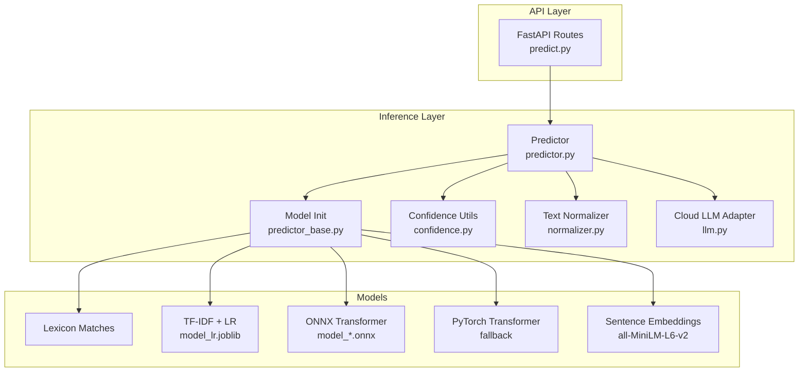
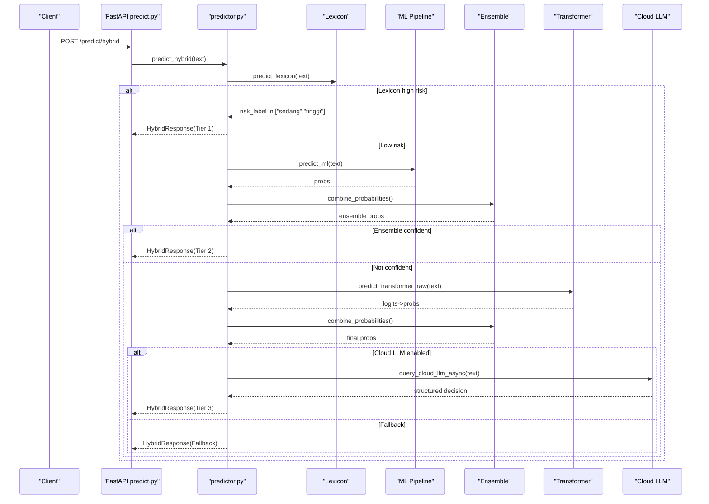
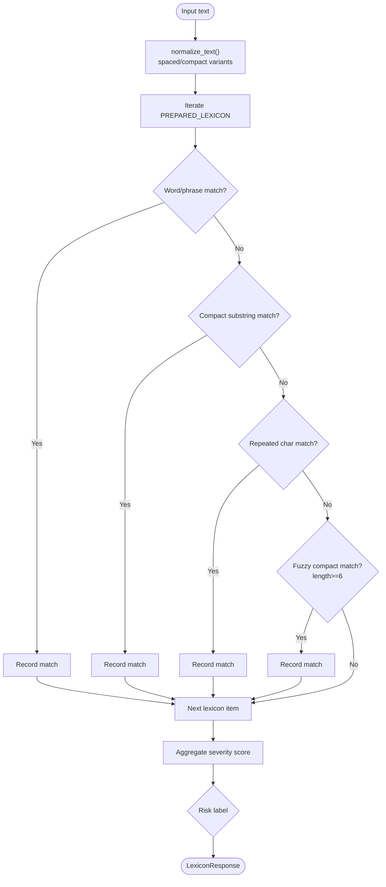
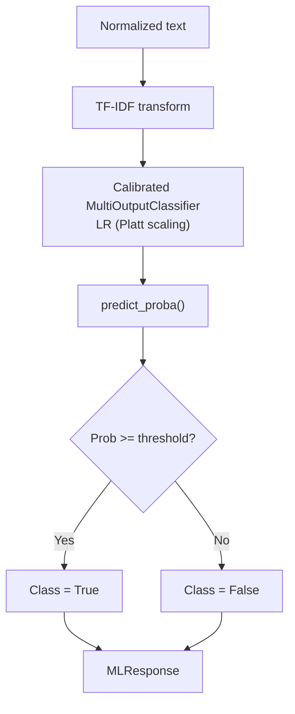
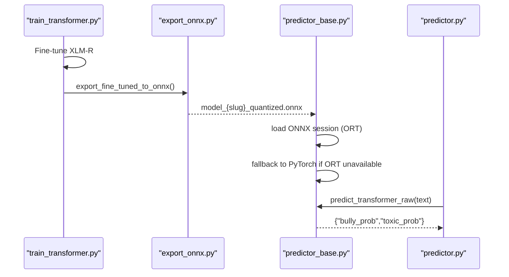
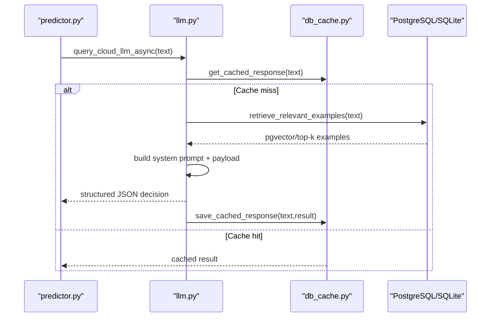
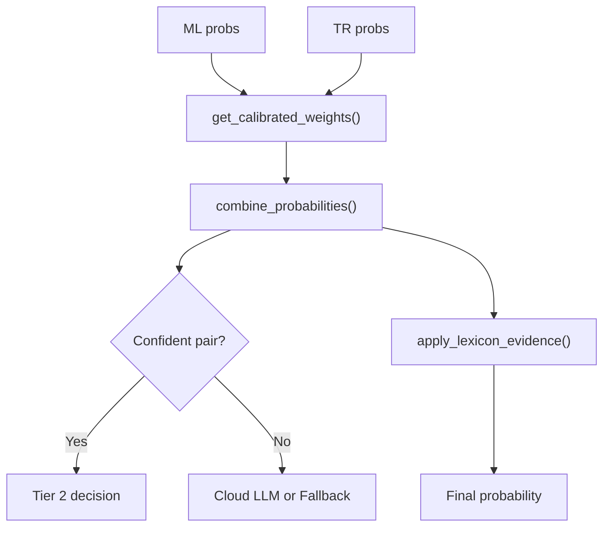
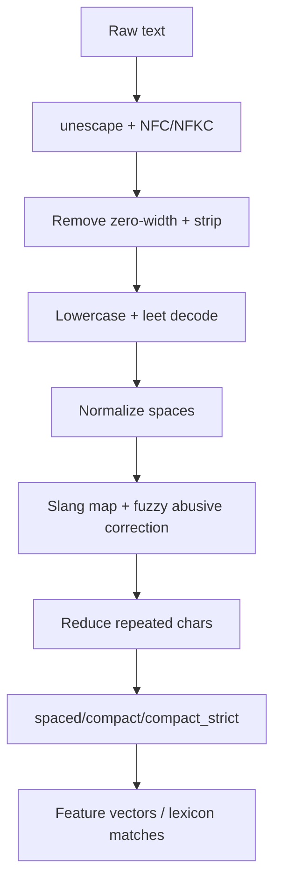
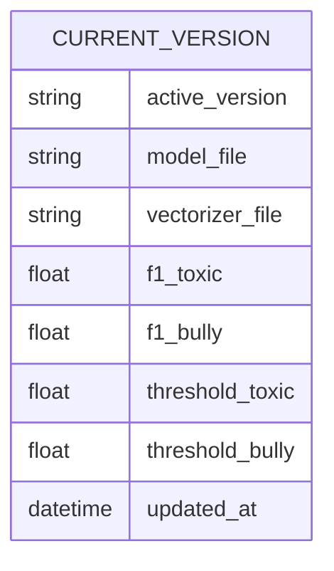
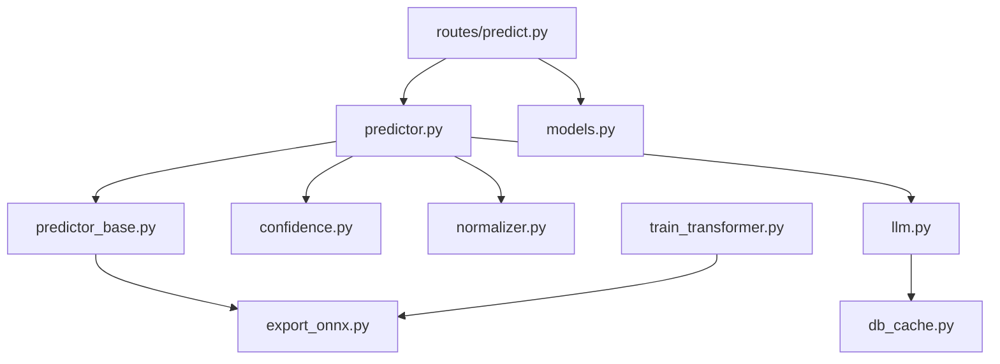

# Model Implementations and Architectures

<cite>
**Referenced Files in This Document**
- [predictor.py](file://cyberbullying_api/classifier/predictor.py)
- [predictor_base.py](file://cyberbullying_api/classifier/predictor_base.py)
- [llm.py](file://cyberbullying_api/classifier/llm.py)
- [confidence.py](file://cyberbullying_api/classifier/confidence.py)
- [normalizer.py](file://cyberbullying_api/normalizer.py)
- [models.py](file://cyberbullying_api/models.py)
- [export_onnx.py](file://cyberbullying_api/export_onnx.py)
- [train_transformer.py](file://cyberbullying_api/train_transformer.py)
- [retrain.py](file://cyberbullying_api/retrain.py)
- [predict.py](file://cyberbullying_api/routes/predict.py)
- [monitoring.py](file://cyberbullying_api/monitoring.py)
- [db_cache.py](file://cyberbullying_api/classifier/db_cache.py)
- [settings_store.py](file://cyberbullying_api/classifier/settings_store.py)
- [current_model_version.json](file://cyberbullying_api/models/current_model_version.json)
</cite>

## Table of Contents
1. [Introduction](#introduction)
2. [Project Structure](#project-structure)
3. [Core Components](#core-components)
4. [Architecture Overview](#architecture-overview)
5. [Detailed Component Analysis](#detailed-component-analysis)
6. [Dependency Analysis](#dependency-analysis)
7. [Performance Considerations](#performance-considerations)
8. [Troubleshooting Guide](#troubleshooting-guide)
9. [Conclusion](#conclusion)
10. [Appendices](#appendices)

## Introduction
This document explains the machine learning model implementations and architectures powering the cyberbullying detection system. It covers:
- Statistical/local model using lexicon-based matching and traditional ML algorithms
- Transformer-based semantic model with attention mechanisms and ONNX export
- Optional LLM integration for nuanced classification and context-aware reasoning
- Feature engineering and preprocessing pipelines
- Model optimization and inference acceleration
- Model versioning, artifact management, and deployment configurations
- Performance characteristics, computational requirements, and memory usage patterns
- Implementation details for custom model integration and adapter patterns

## Project Structure
The model stack is organized around three primary tiers:
- Tier 1: Lexicon-based matching for fast, deterministic detection of explicit terms
- Tier 2: Traditional ML (TF-IDF + Logistic Regression) for probabilistic classification
- Tier 3: Transformer-based semantic model (XLM-R) with ONNX runtime and optional PyTorch fallback
- Optional Tier 4: Cloud LLM (Gemini) for complex cases and sarcasm detection

**Diagram sources**
- [predict.py:16-166](file://cyberbullying_api/routes/predict.py#L16-L166)
- [predictor.py:1-639](file://cyberbullying_api/classifier/predictor.py#L1-L639)
- [predictor_base.py:1-249](file://cyberbullying_api/classifier/predictor_base.py#L1-L249)
- [confidence.py:1-221](file://cyberbullying_api/classifier/confidence.py#L1-L221)
- [normalizer.py:1-368](file://cyberbullying_api/normalizer.py#L1-L368)
- [llm.py:1-370](file://cyberbullying_api/classifier/llm.py#L1-L370)

**Section sources**
- [predict.py:16-166](file://cyberbullying_api/routes/predict.py#L16-L166)
- [predictor.py:1-639](file://cyberbullying_api/classifier/predictor.py#L1-L639)
- [predictor_base.py:1-249](file://cyberbullying_api/classifier/predictor_base.py#L1-L249)

## Core Components
- Lexicon-based matcher: Detects explicit and contextual matches using curated Indonesian lexicons, fuzzy matching, and normalization
- Traditional ML pipeline: TF-IDF vectorization followed by calibrated multi-output logistic regression
- Transformer semantic model: XLM-R fine-tuned for multilingual hate speech and cyberbullying detection, exported to ONNX with dynamic quantization
- Cloud LLM adapter: Gemini-based reasoning with dynamic few-shot retrieval and caching
- Confidence and ensemble utilities: Combine model outputs with calibrated weights and thresholds
- Preprocessing and normalization: Robust text cleaning, slang mapping, leetspeak decoding, and fuzzy spell correction

**Section sources**
- [predictor.py:146-227](file://cyberbullying_api/classifier/predictor.py#L146-L227)
- [predictor_base.py:133-141](file://cyberbullying_api/classifier/predictor_base.py#L133-L141)
- [train_transformer.py:176-186](file://cyberbullying_api/train_transformer.py#L176-L186)
- [llm.py:110-230](file://cyberbullying_api/classifier/llm.py#L110-L230)
- [confidence.py:122-151](file://cyberbullying_api/classifier/confidence.py#L122-L151)
- [normalizer.py:132-234](file://cyberbullying_api/normalizer.py#L132-L234)

## Architecture Overview
The hybrid inference engine routes inputs through a tiered decision process:
- Tier 1: Lexicon matcher with risk scoring
- Tier 2: Traditional ML with calibrated thresholds
- Tier 3: Transformer ensemble with ONNX runtime and PyTorch fallback
- Tier 4: Cloud LLM for sarcasm and complex cases

**Diagram sources**
- [predict.py:57-93](file://cyberbullying_api/routes/predict.py#L57-L93)
- [predictor.py:308-439](file://cyberbullying_api/classifier/predictor.py#L308-L439)
- [llm.py:110-230](file://cyberbullying_api/classifier/llm.py#L110-L230)
- [confidence.py:122-151](file://cyberbullying_api/classifier/confidence.py#L122-L151)

## Detailed Component Analysis

### Lexicon-Based Matcher
- Purpose: Fast, deterministic detection of explicit and contextual abusive phrases
- Inputs: Raw text → normalized forms (spaced, compact, compact_strict)
- Matching strategies:
  - Exact word/phrase match
  - Compact substring match
  - Compact repeated-char match
  - Fuzzy compact match (threshold-based similarity)
- Risk scoring: Aggregates severity scores and labels low/medium/high risk
- Outputs: Matched phrases, risk label, and execution time

**Diagram sources**
- [predictor.py:146-199](file://cyberbullying_api/classifier/predictor.py#L146-L199)
- [normalizer.py:193-234](file://cyberbullying_api/normalizer.py#L193-L234)

**Section sources**
- [predictor.py:146-199](file://cyberbullying_api/classifier/predictor.py#L146-L199)
- [normalizer.py:236-311](file://cyberbullying_api/normalizer.py#L236-L311)

### Traditional ML Pipeline (TF-IDF + Logistic Regression)
- Data preparation: Normalized spaced text
- Vectorization: TF-IDF with n-grams and feature limits
- Model: Multi-output calibrated logistic regression (platt scaling)
- Calibration: Cross-validated probability calibration for reliable scores
- Thresholds: Environment-driven and retrained thresholds stored in artifacts

**Diagram sources**
- [retrain.py:347-359](file://cyberbullying_api/retrain.py#L347-L359)
- [retrain.py:361-380](file://cyberbullying_api/retrain.py#L361-L380)
- [models.py:90-98](file://cyberbullying_api/models.py#L90-L98)

**Section sources**
- [retrain.py:347-380](file://cyberbullying_api/retrain.py#L347-L380)
- [models.py:90-98](file://cyberbullying_api/models.py#L90-L98)
- [current_model_version.json:1-10](file://cyberbullying_api/models/current_model_version.json#L1-L10)

### Transformer Semantic Model (XLM-R) with ONNX Export
- Fine-tuning: Multi-label classification with XLM-R, evaluated with macro F1
- Export: ONNX export with dynamic quantization (INT8), robust shape inference
- Runtime: ONNXRuntime with provider selection (TensorRT/CUDA/CPU), PyTorch fallback
- Inference: Tokenizer + model forward, logits transformed via sigmoid

**Diagram sources**
- [train_transformer.py:243-338](file://cyberbullying_api/train_transformer.py#L243-L338)
- [export_onnx.py:36-92](file://cyberbullying_api/export_onnx.py#L36-L92)
- [predictor_base.py:169-232](file://cyberbullying_api/classifier/predictor_base.py#L169-L232)
- [predictor.py:103-143](file://cyberbullying_api/classifier/predictor.py#L103-L143)

**Section sources**
- [train_transformer.py:176-186](file://cyberbullying_api/train_transformer.py#L176-L186)
- [export_onnx.py:36-92](file://cyberbullying_api/export_onnx.py#L36-L92)
- [predictor_base.py:169-232](file://cyberbullying_api/classifier/predictor_base.py#L169-L232)

### Cloud LLM Integration (Gemini)
- Purpose: Handle sarcasm, nuanced language, and complex cases
- Few-Shot Retrieval: Dynamic examples from pgvector embeddings and TF-IDF memory
- Structured Output: JSON schema with reasoning, is_toxic, is_bully, reason
- Streaming: Server-Sent Events support for progressive responses
- Caching: Redis cache keyed by text hash

**Diagram sources**
- [llm.py:28-109](file://cyberbullying_api/classifier/llm.py#L28-L109)
- [llm.py:110-230](file://cyberbullying_api/classifier/llm.py#L110-L230)
- [db_cache.py:10-30](file://cyberbullying_api/classifier/db_cache.py#L10-L30)

**Section sources**
- [llm.py:28-109](file://cyberbullying_api/classifier/llm.py#L28-L109)
- [llm.py:110-230](file://cyberbullying_api/classifier/llm.py#L110-L230)
- [db_cache.py:10-30](file://cyberbullying_api/classifier/db_cache.py#L10-L30)

### Confidence and Ensemble Utilities
- Confidence margins: Distance from thresholds determines routing confidence
- Ensemble combination: Weighted fusion of ML and Transformer probabilities
- Lexicon boosting: Conservative probability boost based on risk label
- LLM pseudo-probability: Non-extreme conversion to avoid misleading downstream decisions

**Diagram sources**
- [confidence.py:72-110](file://cyberbullying_api/classifier/confidence.py#L72-L110)
- [confidence.py:122-151](file://cyberbullying_api/classifier/confidence.py#L122-L151)
- [confidence.py:179-201](file://cyberbullying_api/classifier/confidence.py#L179-L201)
- [predictor.py:249-278](file://cyberbullying_api/classifier/predictor.py#L249-L278)

**Section sources**
- [confidence.py:72-110](file://cyberbullying_api/classifier/confidence.py#L72-L110)
- [confidence.py:122-151](file://cyberbullying_api/classifier/confidence.py#L122-L151)
- [confidence.py:179-201](file://cyberbullying_api/classifier/confidence.py#L179-L201)
- [predictor.py:249-278](file://cyberbullying_api/classifier/predictor.py#L249-L278)

### Preprocessing and Feature Engineering
- Normalization pipeline: HTML unescape, NFKC normalization, zero-width character removal, lowercasing, leetspeak decoding, spacing, repeated character reduction
- Slang mapping: Alay and abbreviation dictionaries
- Lexicon preparation: Normalized phrases with counts and compact forms
- Fuzzy matching: Efficient sliding-window similarity with thresholds

**Diagram sources**
- [normalizer.py:193-234](file://cyberbullying_api/normalizer.py#L193-L234)
- [normalizer.py:132-179](file://cyberbullying_api/normalizer.py#L132-L179)
- [normalizer.py:236-247](file://cyberbullying_api/normalizer.py#L236-L247)

**Section sources**
- [normalizer.py:193-234](file://cyberbullying_api/normalizer.py#L193-L234)
- [normalizer.py:132-179](file://cyberbullying_api/normalizer.py#L132-L179)
- [normalizer.py:236-247](file://cyberbullying_api/normalizer.py#L236-L247)

### Model Artifacts and Versioning
- Active model metadata: Version, model and vectorizer filenames, F1 scores, thresholds, and timestamp
- Retraining saves versioned artifacts and updates active version atomically
- Thresholds and ensemble weights persisted and configurable via settings

**Diagram sources**
- [current_model_version.json:1-10](file://cyberbullying_api/models/current_model_version.json#L1-L10)

**Section sources**
- [current_model_version.json:1-10](file://cyberbullying_api/models/current_model_version.json#L1-L10)
- [retrain.py:426-470](file://cyberbullying_api/retrain.py#L426-L470)
- [settings_store.py:10-19](file://cyberbullying_api/classifier/settings_store.py#L10-L19)

## Dependency Analysis
Key dependencies and coupling:
- predictor.py depends on predictor_base.py for model globals and initialization
- LLM adapter depends on Redis cache and database pools for retrieval and persistence
- ONNX export depends on transformers and onnxruntime quantization
- Routes depend on predictor APIs and enforce rate limits and SSRF checks

**Diagram sources**
- [predictor.py:1-639](file://cyberbullying_api/classifier/predictor.py#L1-L639)
- [predictor_base.py:1-249](file://cyberbullying_api/classifier/predictor_base.py#L1-L249)
- [llm.py:1-370](file://cyberbullying_api/classifier/llm.py#L1-L370)
- [export_onnx.py:1-92](file://cyberbullying_api/export_onnx.py#L1-L92)
- [train_transformer.py:1-343](file://cyberbullying_api/train_transformer.py#L1-L343)
- [predict.py:1-166](file://cyberbullying_api/routes/predict.py#L1-L166)
- [models.py:1-223](file://cyberbullying_api/models.py#L1-L223)
- [db_cache.py:1-30](file://cyberbullying_api/classifier/db_cache.py#L1-L30)

**Section sources**
- [predictor.py:1-639](file://cyberbullying_api/classifier/predictor.py#L1-L639)
- [predictor_base.py:1-249](file://cyberbullying_api/classifier/predictor_base.py#L1-L249)
- [llm.py:1-370](file://cyberbullying_api/classifier/llm.py#L1-L370)
- [export_onnx.py:1-92](file://cyberbullying_api/export_onnx.py#L1-L92)
- [train_transformer.py:1-343](file://cyberbullying_api/train_transformer.py#L1-L343)
- [predict.py:1-166](file://cyberbullying_api/routes/predict.py#L1-L166)
- [models.py:1-223](file://cyberbullying_api/models.py#L1-L223)
- [db_cache.py:1-30](file://cyberbullying_api/classifier/db_cache.py#L1-L30)

## Performance Considerations
- Latency and throughput:
  - Lexicon matcher is O(L) over prepared lexicon entries
  - TF-IDF vectorization and LR inference are fast on CPU
  - Transformer inference accelerates with ONNXRuntime and GPU providers
  - Streaming responses reduce perceived latency for LLM tier
- Memory usage:
  - ONNX models are quantized to reduce footprint
  - Sentence embeddings are optional and offloaded to dedicated models
- Metrics:
  - Prometheus counters and histograms track requests, predictions, cache hits, and inference latency by tier

[No sources needed since this section provides general guidance]

## Troubleshooting Guide
Common issues and resolutions:
- Model not loaded:
  - Verify model files exist and paths are correct
  - Check environment variables for model paths and auto-export flags
- ONNX runtime errors:
  - Ensure compatible providers are available; fallback to PyTorch is automatic
- LLM connectivity:
  - Confirm API key and base URL are configured; check timeouts and caching behavior
- Streaming failures:
  - Validate SSE formatting and network stability
- Performance regressions:
  - Compare active version metadata and thresholds; rollback if necessary

**Section sources**
- [predictor_base.py:181-204](file://cyberbullying_api/classifier/predictor_base.py#L181-L204)
- [llm.py:120-230](file://cyberbullying_api/classifier/llm.py#L120-L230)
- [monitoring.py:28-48](file://cyberbullying_api/monitoring.py#L28-L48)
- [current_model_version.json:1-10](file://cyberbullying_api/models/current_model_version.json#L1-L10)

## Conclusion
The system combines fast lexicon detection, robust traditional ML, and scalable transformer inference with optional cloud LLM reasoning. It emphasizes reliability through calibration, confidence-aware routing, and comprehensive observability. Artifact versioning and automated export streamline deployment and upgrades.

[No sources needed since this section summarizes without analyzing specific files]

## Appendices

### Input/Output Specifications
- TextRequest: text, use_fuzzy flag
- LexiconResponse: matched phrases, risk label, score, execution time
- MLResponse: toxicity/bullying probabilities, category, word importances
- TransformerResponse: logits-to-probabilities via sigmoid
- EnsembleResponse: fused probabilities with lexicon evidence
- HybridResponse: final decision with decision source and reason
- BatchResponse: list of BatchItemResponse

**Section sources**
- [models.py:65-131](file://cyberbullying_api/models.py#L65-L131)
- [models.py:159-167](file://cyberbullying_api/models.py#L159-L167)

### ONNX Export Procedures
- Export script: loads PyTorch model, exports to ONNX, applies dynamic quantization, cleans up raw ONNX
- Auto-export: triggered when ONNX file is missing and AUTO_EXPORT_ONNX is enabled
- Slug-based naming: supports multiple model paths for seamless switching

**Section sources**
- [export_onnx.py:36-92](file://cyberbullying_api/export_onnx.py#L36-L92)
- [predictor_base.py:181-204](file://cyberbullying_api/classifier/predictor_base.py#L181-L204)
- [train_transformer.py:309-336](file://cyberbullying_api/train_transformer.py#L309-L336)

### Model Training and Retraining
- Retraining pipeline: data ingestion, augmentation, perturbation, oversampling, calibration, threshold calibration, rollback protection, versioned artifact saving
- Fine-tuning pipeline: multi-label training, evaluation metrics, ONNX export with quantization

**Section sources**
- [retrain.py:160-380](file://cyberbullying_api/retrain.py#L160-L380)
- [train_transformer.py:188-233](file://cyberbullying_api/train_transformer.py#L188-L233)

### Deployment Configurations
- Environment variables:
  - TRANSFORMER_MODEL_PATH: model identifier or path
  - AUTO_EXPORT_ONNX: enable auto-export
  - CONFIDENCE_MARGIN, MIN_TRANSFORMER_SIGNAL, LLM_POSITIVE_PROBABILITY, LLM_NEGATIVE_PROBABILITY, LEXICON_BOOST_*: tuning knobs
  - GEMINI_API_KEY, GEMINI_BASE_URL, GEMINI_MODEL: LLM configuration
- Settings persistence: Redis-backed settings with local fallback and pub/sub reload

**Section sources**
- [predictor_base.py:169-204](file://cyberbullying_api/classifier/predictor_base.py#L169-L204)
- [confidence.py:24-164](file://cyberbullying_api/classifier/confidence.py#L24-L164)
- [settings_store.py:33-72](file://cyberbullying_api/classifier/settings_store.py#L33-L72)

### Adapter Pattern for Custom Models
- Extend initialization in predictor_base.py to load custom model sessions
- Wrap inference in predictor.py with similar signature patterns
- Integrate confidence and ensemble utilities for consistent behavior
- Export artifacts using standardized naming and metadata

**Section sources**
- [predictor_base.py:87-249](file://cyberbullying_api/classifier/predictor_base.py#L87-L249)
- [predictor.py:103-143](file://cyberbullying_api/classifier/predictor.py#L103-L143)
- [confidence.py:122-151](file://cyberbullying_api/classifier/confidence.py#L122-L151)