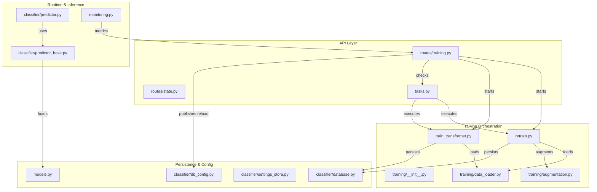
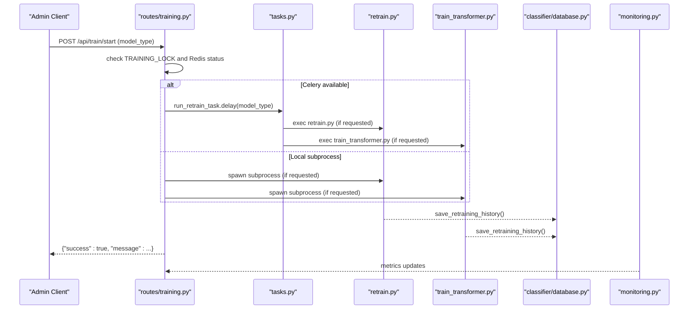
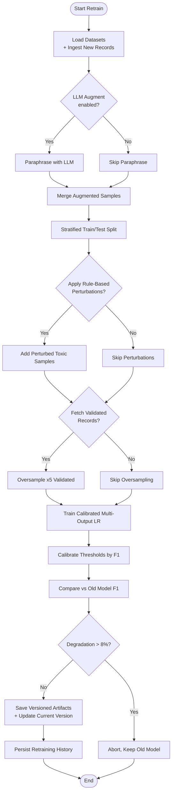
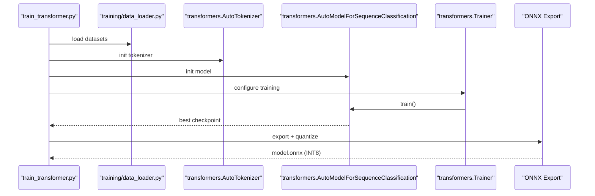
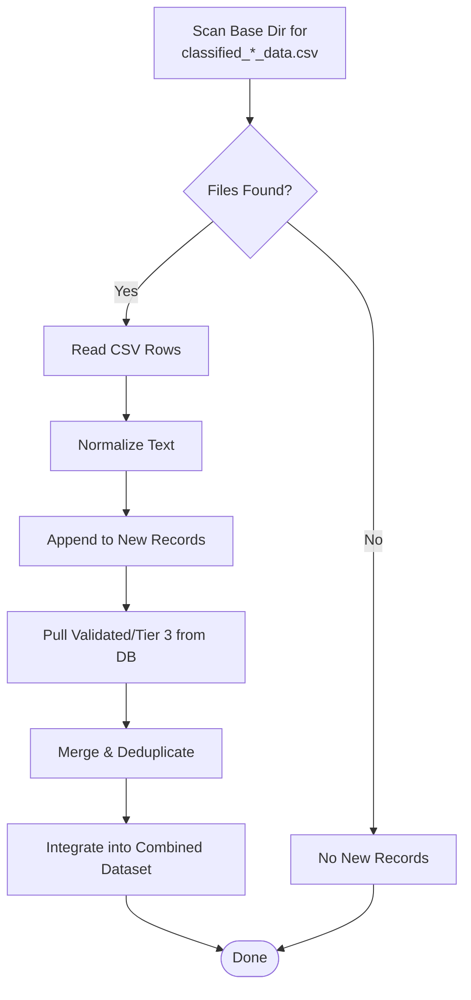
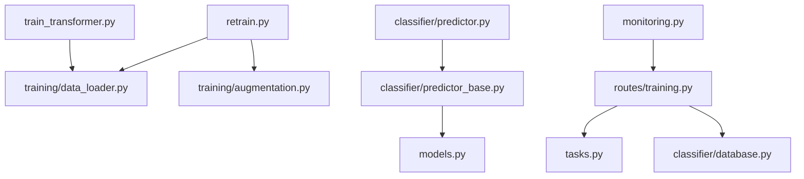

# Training and Retraining Workflows

<cite>
**Referenced Files in This Document**
- [retrain.py](file://cyberbullying_api/retrain.py)
- [train_transformer.py](file://cyberbullying_api/train_transformer.py)
- [training/__init__.py](file://cyberbullying_api/training/__init__.py)
- [training/augmentation.py](file://cyberbullying_api/training/augmentation.py)
- [training/data_loader.py](file://cyberbullying_api/training/data_loader.py)
- [routes/training.py](file://cyberbullying_api/routes/training.py)
- [tasks.py](file://cyberbullying_api/tasks.py)
- [classifier/predictor.py](file://cyberbullying_api/classifier/predictor.py)
- [classifier/predictor_base.py](file://cyberbullying_api/classifier/predictor_base.py)
- [classifier/settings_store.py](file://cyberbullying_api/classifier/settings_store.py)
- [classifier/database.py](file://cyberbullying_api/classifier/database.py)
- [classifier/db_config.py](file://cyberbullying_api/classifier/db_config.py)
- [monitoring.py](file://cyberbullying_api/monitoring.py)
- [routes/state.py](file://cyberbullying_api/routes/state.py)
- [models.py](file://cyberbullying_api/models.py)
</cite>

## Table of Contents
1. [Introduction](#introduction)
2. [Project Structure](#project-structure)
3. [Core Components](#core-components)
4. [Architecture Overview](#architecture-overview)
5. [Detailed Component Analysis](#detailed-component-analysis)
6. [Dependency Analysis](#dependency-analysis)
7. [Performance Considerations](#performance-considerations)
8. [Troubleshooting Guide](#troubleshooting-guide)
9. [Conclusion](#conclusion)
10. [Appendices](#appendices)

## Introduction
This document describes the end-to-end training and retraining workflow management system for the cyberbullying detection platform. It covers active learning integration, data collection and ingestion, labeling workflows, training pipeline architecture, data augmentation strategies, model versioning, settings store and configuration management, experiment tracking, automated retraining triggers, performance monitoring, rollback procedures, and operational processes for manual retraining, batch processing, and continuous learning integration. It also documents data quality assessment, bias detection, and fairness validation processes, along with deployment validation workflows and model artifact version control.

## Project Structure
The training and retraining system spans several modules:
- Training scripts orchestrate data ingestion, augmentation, training, evaluation, and model persistence.
- Route handlers expose administrative endpoints to trigger training, stream logs, and fetch history.
- Celery tasks enable asynchronous, distributed training execution.
- Classifier modules manage model loading, hybrid inference, and persistence of retraining history.
- Monitoring tracks performance and operational metrics.
- Settings store centralizes configuration and ensemble weights.

**Diagram sources**
- [retrain.py:1-519](file://cyberbullying_api/retrain.py#L1-L519)
- [train_transformer.py:1-343](file://cyberbullying_api/train_transformer.py#L1-L343)
- [training/__init__.py:1-47](file://cyberbullying_api/training/__init__.py#L1-L47)
- [training/augmentation.py:1-194](file://cyberbullying_api/training/augmentation.py#L1-L194)
- [training/data_loader.py:1-384](file://cyberbullying_api/training/data_loader.py#L1-L384)
- [routes/training.py:1-254](file://cyberbullying_api/routes/training.py#L1-L254)
- [tasks.py:1-96](file://cyberbullying_api/tasks.py#L1-L96)
- [classifier/predictor.py:1-662](file://cyberbullying_api/classifier/predictor.py#L1-L662)
- [classifier/predictor_base.py:1-251](file://cyberbullying_api/classifier/predictor_base.py#L1-L251)
- [classifier/database.py:1-72](file://cyberbullying_api/classifier/database.py#L1-L72)
- [classifier/db_config.py:1-351](file://cyberbullying_api/classifier/db_config.py#L1-L351)
- [monitoring.py:1-49](file://cyberbullying_api/monitoring.py#L1-L49)
- [routes/state.py:1-7](file://cyberbullying_api/routes/state.py#L1-L7)
- [models.py:1-224](file://cyberbullying_api/models.py#L1-L224)

**Section sources**
- [retrain.py:1-519](file://cyberbullying_api/retrain.py#L1-L519)
- [train_transformer.py:1-343](file://cyberbullying_api/train_transformer.py#L1-L343)
- [routes/training.py:1-254](file://cyberbullying_api/routes/training.py#L1-L254)
- [tasks.py:1-96](file://cyberbullying_api/tasks.py#L1-L96)
- [classifier/predictor.py:1-662](file://cyberbullying_api/classifier/predictor.py#L1-L662)
- [classifier/predictor_base.py:1-251](file://cyberbullying_api/classifier/predictor_base.py#L1-L251)
- [classifier/database.py:1-72](file://cyberbullying_api/classifier/database.py#L1-L72)
- [classifier/db_config.py:1-351](file://cyberbullying_api/classifier/db_config.py#L1-L351)
- [monitoring.py:1-49](file://cyberbullying_api/monitoring.py#L1-L49)
- [routes/state.py:1-7](file://cyberbullying_api/routes/state.py#L1-L7)
- [models.py:1-224](file://cyberbullying_api/models.py#L1-L224)

## Core Components
- Training orchestrators:
  - Classic ML retraining pipeline with TF-IDF and calibrated logistic regression.
  - Transformer fine-tuning pipeline with ONNX export and quantization.
- Data ingestion and augmentation:
  - Unified dataset loaders for multiple sources.
  - LLM-based paraphrasing augmentation and rule-based perturbations.
  - Active learning oversampling from validated records.
- Model versioning and persistence:
  - Timestamped artifacts, thresholds, and current version metadata.
  - Rollback protection based on F1-score comparisons.
- Configuration and settings:
  - Centralized settings store with Redis-backed synchronization.
  - Ensemble weights and webhook configuration.
- Experiment tracking:
  - Retraining history persisted to PostgreSQL/SQLite.
- Operational controls:
  - Admin endpoints to start training, stream logs, and reload models.
  - Celery-based asynchronous execution with status publishing.
- Monitoring and observability:
  - Metrics for requests, latency, predictions, cache, and LLM failures.

**Section sources**
- [retrain.py:1-519](file://cyberbullying_api/retrain.py#L1-L519)
- [train_transformer.py:1-343](file://cyberbullying_api/train_transformer.py#L1-L343)
- [training/augmentation.py:1-194](file://cyberbullying_api/training/augmentation.py#L1-L194)
- [training/data_loader.py:1-384](file://cyberbullying_api/training/data_loader.py#L1-L384)
- [classifier/settings_store.py:1-73](file://cyberbullying_api/classifier/settings_store.py#L1-L73)
- [classifier/database.py:1-72](file://cyberbullying_api/classifier/database.py#L1-L72)
- [routes/training.py:1-254](file://cyberbullying_api/routes/training.py#L1-L254)
- [tasks.py:1-96](file://cyberbullying_api/tasks.py#L1-L96)
- [monitoring.py:1-49](file://cyberbullying_api/monitoring.py#L1-L49)

## Architecture Overview
The system supports two primary training modes:
- Classic ML: TF-IDF + calibrated multi-output logistic regression with dynamic threshold calibration.
- Transformer: Fine-tuning of a sequence classification model with ONNX export and quantization.

Both pipelines integrate active learning via validated records and augment data using LLM paraphrases and rule-based perturbations. Results are persisted with versioning and rollback safeguards, and reloaded automatically via API endpoints or Celery workers.

**Diagram sources**
- [routes/training.py:1-254](file://cyberbullying_api/routes/training.py#L1-L254)
- [tasks.py:1-96](file://cyberbullying_api/tasks.py#L1-L96)
- [retrain.py:1-519](file://cyberbullying_api/retrain.py#L1-L519)
- [train_transformer.py:1-343](file://cyberbullying_api/train_transformer.py#L1-L343)
- [classifier/database.py:1-72](file://cyberbullying_api/classifier/database.py#L1-L72)
- [monitoring.py:1-49](file://cyberbullying_api/monitoring.py#L1-L49)

## Detailed Component Analysis

### Training Pipeline: Classic ML (Logistic Regression)
- Data ingestion:
  - Loads Twitter, Instagram, combined, Mendeley, and TikTok datasets.
  - Ingests newly labeled records from scraped CSVs and classification memory DB (PostgreSQL/SQLite).
- Data augmentation:
  - LLM-based paraphrases when configured.
  - Rule-based perturbations on toxic words to increase diversity.
  - Manual augmentation with sarcasm and praise templates to balance classes.
- Active learning oversampling:
  - Fetches validated human-labeled records and oversamples them 5x.
- Training:
  - Stratified train/test split by joint label combinations.
  - TF-IDF vectorization with configurable n-grams and feature caps.
  - Calibrated multi-output logistic regression with balanced class weights.
- Calibration and evaluation:
  - Dynamic threshold calibration via F1 optimization on validation set.
  - Performance comparison against previous model; rollback if degradation exceeds threshold.
- Persistence:
  - Saves versioned model, vectorizer, thresholds, and current version metadata.
  - Persists retraining history to database.

**Diagram sources**
- [retrain.py:1-519](file://cyberbullying_api/retrain.py#L1-L519)
- [training/augmentation.py:1-194](file://cyberbullying_api/training/augmentation.py#L1-L194)
- [training/data_loader.py:1-384](file://cyberbullying_api/training/data_loader.py#L1-L384)
- [classifier/database.py:1-72](file://cyberbullying_api/classifier/database.py#L1-L72)

**Section sources**
- [retrain.py:1-519](file://cyberbullying_api/retrain.py#L1-L519)
- [training/augmentation.py:1-194](file://cyberbullying_api/training/augmentation.py#L1-L194)
- [training/data_loader.py:1-384](file://cyberbullying_api/training/data_loader.py#L1-L384)

### Training Pipeline: Transformer Fine-Tuning
- Data ingestion mirrors classic ML pipeline.
- Tokenization and dataset preparation for sequence classification.
- Training with configurable hyperparameters and evaluation metrics.
- Export to ONNX with dynamic quantization and distribution under multiple model slugs.
- Automatic fallback to PyTorch if ONNX runtime is unavailable.

**Diagram sources**
- [train_transformer.py:1-343](file://cyberbullying_api/train_transformer.py#L1-L343)
- [training/data_loader.py:1-384](file://cyberbullying_api/training/data_loader.py#L1-L384)

**Section sources**
- [train_transformer.py:1-343](file://cyberbullying_api/train_transformer.py#L1-L343)
- [training/data_loader.py:1-384](file://cyberbullying_api/training/data_loader.py#L1-L384)

### Data Collection, Ingestion, and Labeling Workflows
- Scraped CSV ingestion:
  - Detects new classified CSV files and extracts labeled samples.
- Classification memory ingestion:
  - Pulls validated and Tier 3-labeled records from PostgreSQL or SQLite fallback.
- Labeling and normalization:
  - Uses lexicon-based toxicity checks and text normalization.
- Deduplication and integrity:
  - Deduplicates by normalized text to prevent data leakage.

**Diagram sources**
- [training/data_loader.py:1-384](file://cyberbullying_api/training/data_loader.py#L1-L384)
- [retrain.py:1-519](file://cyberbullying_api/retrain.py#L1-L519)

**Section sources**
- [training/data_loader.py:1-384](file://cyberbullying_api/training/data_loader.py#L1-L384)
- [retrain.py:1-519](file://cyberbullying_api/retrain.py#L1-L519)

### Active Learning Integration and Oversampling
- Fetch validated records from classification memory where is_validated = 1.
- Oversample validated records 5x to emphasize human-labeled examples.
- Combine with augmented and perturbed samples to improve minority class coverage.

**Section sources**
- [retrain.py:260-330](file://cyberbullying_api/retrain.py#L260-L330)

### Data Augmentation Strategies
- LLM-based paraphrasing:
  - Generates alternative phrasings preserving register and label semantics.
- Rule-based perturbations:
  - Applies leetspeak, censoring, repetition, and typo swaps to abusive words.
- Template-based augmentation:
  - Adds sarcastic and praising sentences to balance classes.

**Section sources**
- [training/augmentation.py:1-194](file://cyberbullying_api/training/augmentation.py#L1-L194)
- [retrain.py:202-218](file://cyberbullying_api/retrain.py#L202-L218)
- [retrain.py:247-259](file://cyberbullying_api/retrain.py#L247-L259)

### Model Versioning and Rollback Procedures
- Versioned artifacts:
  - Timestamped model and vectorizer files stored alongside current version metadata.
- Thresholds and metadata:
  - Persisted thresholds and evaluation scores for reproducibility.
- Rollback:
  - Compares new model’s F1 scores to old model; aborts and retains old model if drop exceeds 8%.

**Section sources**
- [retrain.py:432-477](file://cyberbullying_api/retrain.py#L432-L477)
- [retrain.py:426-431](file://cyberbullying_api/retrain.py#L426-L431)

### Settings Store and Configuration Management
- Centralized settings:
  - Ensemble weights, webhook URL/status, and defaults.
- Persistence:
  - Writes to local file and synchronizes with Redis.
- Real-time updates:
  - Publishes settings reload events to subscribers.

**Section sources**
- [classifier/settings_store.py:1-73](file://cyberbullying_api/classifier/settings_store.py#L1-L73)

### Experiment Tracking and Retraining History
- Retraining history:
  - Stores timestamps, F1 scores, thresholds, and active version.
- Storage:
  - PostgreSQL (preferred) with SQLite fallback.
- Retrieval:
  - API endpoint to fetch paginated history.

**Section sources**
- [classifier/database.py:1-72](file://cyberbullying_api/classifier/database.py#L1-L72)
- [routes/training.py:236-253](file://cyberbullying_api/routes/training.py#L236-L253)

### Automated Retraining Triggers and Deployment Validation
- Admin endpoints:
  - Start training (ML, Transformer, or both) with concurrency guards.
  - Stream training logs via server-sent events.
  - Reload models manually.
- Celery integration:
  - Asynchronous execution with status tracking and model reload publication.
- Deployment validation:
  - Hot-reload of models after successful training.
  - Prometheus metrics for inference latency and prediction volume.

**Section sources**
- [routes/training.py:1-254](file://cyberbullying_api/routes/training.py#L1-L254)
- [tasks.py:1-96](file://cyberbullying_api/tasks.py#L1-L96)
- [monitoring.py:1-49](file://cyberbullying_api/monitoring.py#L1-L49)

### Performance Monitoring and Observability
- Metrics:
  - Request counts and latency, prediction totals by source and category, cache hits/misses, inference latency by tier, trie word counts, and LLM failure counters.
- Integration:
  - Used by API routes and inference paths to capture operational signals.

**Section sources**
- [monitoring.py:1-49](file://cyberbullying_api/monitoring.py#L1-L49)

### Data Quality Assessment, Bias Detection, and Fairness Validation
- Data quality:
  - Stratified sampling and deduplication reduce leakage and imbalance.
  - Lexicon-based toxicity checks and normalization ensure consistent preprocessing.
- Bias detection:
  - Stratified splits by joint label combinations help maintain representation across groups.
  - Manual augmentation with sarcasm/praise patterns targets specific linguistic biases.
- Fairness validation:
  - Evaluation via macro-averaged metrics (F1, precision, recall) across labels.
  - Threshold calibration ensures balanced trade-offs per label.

**Section sources**
- [retrain.py:227-240](file://cyberbullying_api/retrain.py#L227-L240)
- [train_transformer.py:188-204](file://cyberbullying_api/train_transformer.py#L188-L204)

### Operational Procedures
- Manual retraining:
  - Use admin endpoint to start training and stream logs.
- Batch processing:
  - Batch request models support batch inference workflows.
- Continuous learning:
  - Regular ingestion of new labeled data from scrapers and classification memory.
  - Periodic retraining with active learning oversampling and augmentation.

**Section sources**
- [routes/training.py:1-254](file://cyberbullying_api/routes/training.py#L1-L254)
- [models.py:133-158](file://cyberbullying_api/models.py#L133-L158)

## Dependency Analysis
Key dependencies and coupling:
- Training scripts depend on unified dataset loaders and augmentation utilities.
- Routes coordinate training initiation and status reporting.
- Celery tasks encapsulate asynchronous execution and status propagation.
- Classifier modules handle model loading, inference, and persistence of retraining history.
- Monitoring integrates with API and inference paths.

**Diagram sources**
- [retrain.py:1-519](file://cyberbullying_api/retrain.py#L1-L519)
- [train_transformer.py:1-343](file://cyberbullying_api/train_transformer.py#L1-L343)
- [training/data_loader.py:1-384](file://cyberbullying_api/training/data_loader.py#L1-L384)
- [training/augmentation.py:1-194](file://cyberbullying_api/training/augmentation.py#L1-L194)
- [routes/training.py:1-254](file://cyberbullying_api/routes/training.py#L1-L254)
- [tasks.py:1-96](file://cyberbullying_api/tasks.py#L1-L96)
- [classifier/database.py:1-72](file://cyberbullying_api/classifier/database.py#L1-L72)
- [classifier/predictor_base.py:1-251](file://cyberbullying_api/classifier/predictor_base.py#L1-L251)
- [classifier/predictor.py:1-662](file://cyberbullying_api/classifier/predictor.py#L1-L662)
- [monitoring.py:1-49](file://cyberbullying_api/monitoring.py#L1-L49)
- [models.py:1-224](file://cyberbullying_api/models.py#L1-L224)

**Section sources**
- [retrain.py:1-519](file://cyberbullying_api/retrain.py#L1-L519)
- [train_transformer.py:1-343](file://cyberbullying_api/train_transformer.py#L1-L343)
- [routes/training.py:1-254](file://cyberbullying_api/routes/training.py#L1-L254)
- [tasks.py:1-96](file://cyberbullying_api/tasks.py#L1-L96)
- [classifier/predictor.py:1-662](file://cyberbullying_api/classifier/predictor.py#L1-L662)
- [classifier/predictor_base.py:1-251](file://cyberbullying_api/classifier/predictor_base.py#L1-L251)
- [classifier/database.py:1-72](file://cyberbullying_api/classifier/database.py#L1-L72)
- [monitoring.py:1-49](file://cyberbullying_api/monitoring.py#L1-L49)
- [models.py:1-224](file://cyberbullying_api/models.py#L1-L224)

## Performance Considerations
- Training:
  - Stratified sampling improves generalization across label combinations.
  - Calibrated classifiers and dynamic thresholding optimize F1.
- Inference:
  - ONNX runtime with TensorRT/CUDA providers accelerates Transformer inference.
  - Hybrid tiered inference reduces latency for confident cases.
- Observability:
  - Metrics capture latency and throughput; use to tune thresholds and provider selection.

[No sources needed since this section provides general guidance]

## Troubleshooting Guide
- Training stuck or failing:
  - Check training logs via streaming endpoint; verify Redis/Celery availability.
  - Confirm training lock is released and no background process is active.
- Model reload issues:
  - Ensure artifacts are saved and current version metadata updated.
  - Verify model paths and ONNX availability; fallback to PyTorch if needed.
- Data ingestion problems:
  - Validate dataset paths and column names; confirm deduplication logic.
- Configuration sync:
  - Ensure settings file and Redis are writable; check publish events for reload.

**Section sources**
- [routes/training.py:1-254](file://cyberbullying_api/routes/training.py#L1-L254)
- [classifier/settings_store.py:1-73](file://cyberbullying_api/classifier/settings_store.py#L1-L73)
- [classifier/db_config.py:1-351](file://cyberbullying_api/classifier/db_config.py#L1-L351)

## Conclusion
The training and retraining system provides a robust, production-grade workflow integrating active learning, data augmentation, and model versioning. It supports both classical ML and transformer-based approaches, with automated triggers, observability, and safe rollback mechanisms. Operational procedures enable manual and continuous retraining, ensuring model quality and reliability in real-world deployments.

[No sources needed since this section summarizes without analyzing specific files]

## Appendices
- API models and validation:
  - Defines request/response schemas for inference and batch processing.
- Security and SSRF checks:
  - Validates external URLs for scraping tasks to prevent SSRF.

**Section sources**
- [models.py:1-224](file://cyberbullying_api/models.py#L1-L224)