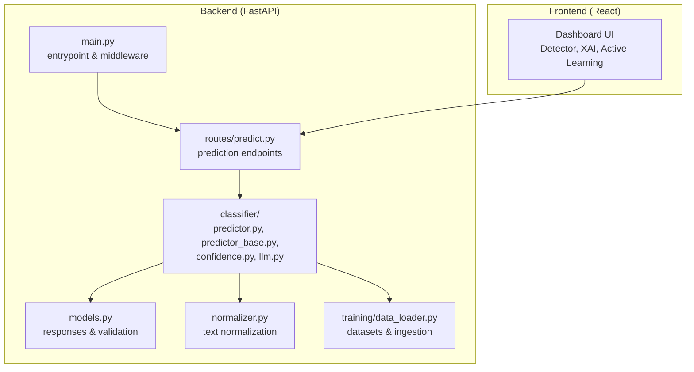
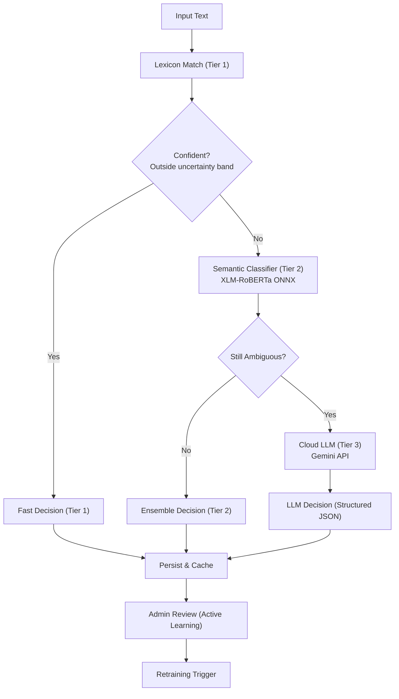
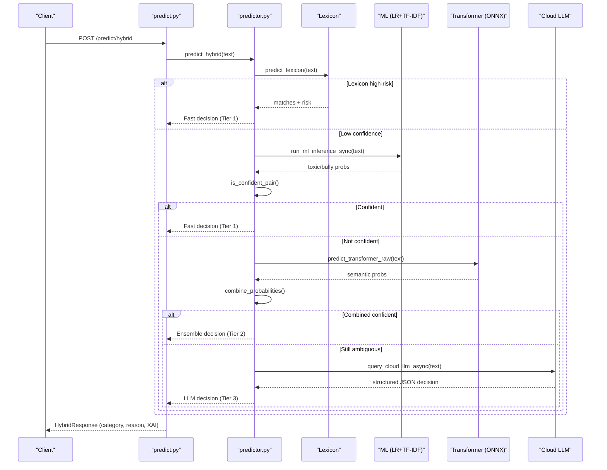
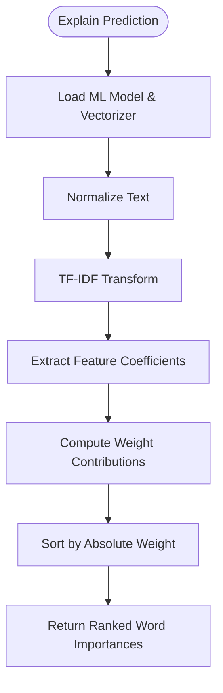
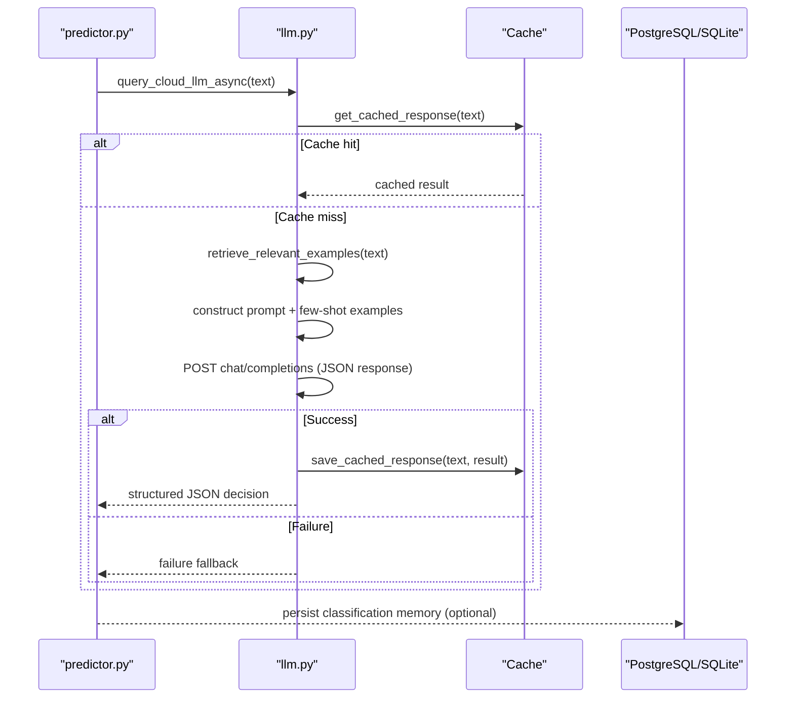
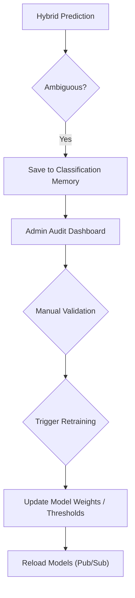
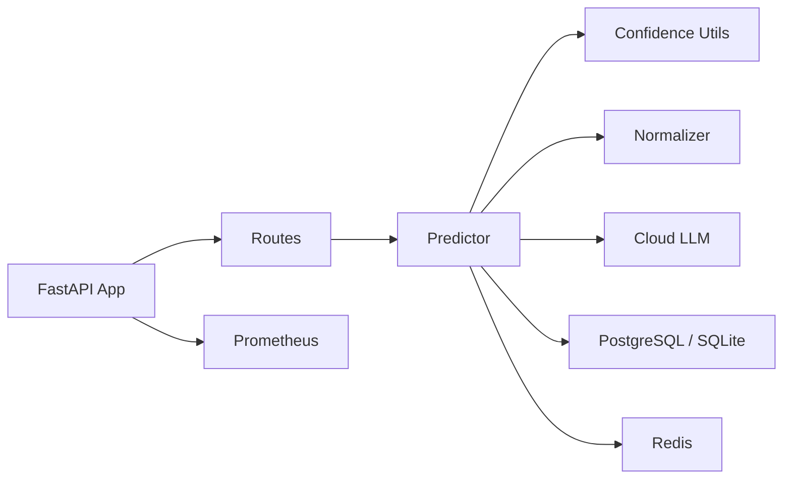

# Project Overview

<cite>
**Referenced Files in This Document**
- [README.md](file://README.md)
- [cyberbullying_api/README.md](file://cyberbullying_api/README.md)
- [docs/cyberbullying_detection_summary.md](file://docs/cyberbullying_detection_summary.md)
- [docs/PROJECT_POSITIONING.md](file://docs/PROJECT_POSITIONING.md)
- [docs/ML_CONFIDENCE_GUIDE.md](file://docs/ML_CONFIDENCE_GUIDE.md)
- [docs/ERROR_ANALYSIS_GUIDE.md](file://docs/ERROR_ANALYSIS_GUIDE.md)
- [cyberbullying_api/main.py](file://cyberbullying_api/main.py)
- [cyberbullying_api/classifier/predictor.py](file://cyberbullying_api/classifier/predictor.py)
- [cyberbullying_api/classifier/predictor_base.py](file://cyberbullying_api/classifier/predictor_base.py)
- [cyberbullying_api/classifier/confidence.py](file://cyberbullying_api/classifier/confidence.py)
- [cyberbullying_api/classifier/llm.py](file://cyberbullying_api/classifier/llm.py)
- [cyberbullying_api/routes/predict.py](file://cyberbullying_api/routes/predict.py)
- [cyberbullying_api/models.py](file://cyberbullying_api/models.py)
- [cyberbullying_api/normalizer.py](file://cyberbullying_api/normalizer.py)
- [cyberbullying_api/training/data_loader.py](file://cyberbullying_api/training/data_loader.py)
</cite>

## Table of Contents
1. [Introduction](#introduction)
2. [Project Structure](#project-structure)
3. [Core Components](#core-components)
4. [Architecture Overview](#architecture-overview)
5. [Detailed Component Analysis](#detailed-component-analysis)
6. [Dependency Analysis](#dependency-analysis)
7. [Performance Considerations](#performance-considerations)
8. [Troubleshooting Guide](#troubleshooting-guide)
9. [Conclusion](#conclusion)
10. [Appendices](#appendices)

## Introduction
BullyGuard ID is a modern Indonesian cyberbullying and hate speech detection API designed as a hybrid multi-tier detection system. It combines statistical models, lexicon matching, transformer-based deep learning, and optional cloud LLM components to deliver fast, accurate, and explainable classification results for Bahasa Indonesia text. The system is built to support social media moderation workflows by acting as a screening assistant that prioritizes flagged content for human review, while maintaining transparency through explainable AI (XAI) and active learning.

Key goals:
- Detect and classify comments into toxicity and cyberbullying categories
- Provide a hybrid pipeline that escalates ambiguity to stronger models
- Enable human-in-the-loop validation and continuous model improvement
- Deliver production-grade security, performance, and observability

**Section sources**
- [README.md:23-31](file://README.md#L23-L31)
- [docs/PROJECT_POSITIONING.md:10-16](file://docs/PROJECT_POSITIONING.md#L10-L16)

## Project Structure
The repository is organized into backend (FastAPI), frontend (React), datasets, research artifacts, and operational documentation. The backend encapsulates the hybrid classifier, routing logic, and admin/workflow endpoints. The frontend provides a dashboard for prediction, explainability, and active learning.

**Diagram sources**
- [cyberbullying_api/main.py:158-179](file://cyberbullying_api/main.py#L158-L179)
- [cyberbullying_api/routes/predict.py:16-166](file://cyberbullying_api/routes/predict.py#L16-L166)
- [cyberbullying_api/classifier/predictor.py:1-639](file://cyberbullying_api/classifier/predictor.py#L1-L639)
- [cyberbullying_api/models.py:65-223](file://cyberbullying_api/models.py#L65-L223)
- [cyberbullying_api/normalizer.py:193-234](file://cyberbullying_api/normalizer.py#L193-L234)
- [cyberbullying_api/training/data_loader.py:1-385](file://cyberbullying_api/training/data_loader.py#L1-L385)

**Section sources**
- [README.md:73-103](file://README.md#L73-L103)
- [cyberbullying_api/README.md:1-89](file://cyberbullying_api/README.md#L1-L89)

## Core Components
- Hybrid Multi-Tier Pipeline
  - Tier 1 (Local/Statistical): Lexicon matching + Logistic Regression with TF-IDF for fast initial filtering.
  - Tier 2 (Local/Semantic): XLM-RoBERTa ONNX runtime for contextual understanding.
  - Tier 3 (Optional Cloud LLM): Gemini API for sarcasm and nuanced cases.
- Explainable AI (XAI): SHAP-style word importance for toxicity and cyberbullying dimensions.
- Active Learning: Admin dashboard to review ambiguous cases and trigger retraining.
- Security & Observability: API key auth, rate limiting, Prometheus metrics, structured logging, CORS, and security headers.

Target use cases:
- Social media comment moderation
- Content screening for community platforms
- Real-time abuse detection with human oversight
- Batch classification for historical content audits

Supported languages:
- Indonesian (Bahasa Indonesia) with robust normalization for slang, alay, and obfuscation

Classification categories:
- Bully-toxic (cyberbullying + toxicity)
- Non-Toxic Bully (sarcasm/body-shaming without explicit toxicity)
- Toxic non-bully (slang/casual profanity)
- Non-toxic non-bully (normal/neutral)

**Section sources**
- [README.md:25-31](file://README.md#L25-L31)
- [README.md:37-46](file://README.md#L37-L46)
- [docs/cyberbullying_detection_summary.md:100-115](file://docs/cyberbullying_detection_summary.md#L100-L115)
- [cyberbullying_api/models.py:159-167](file://cyberbullying_api/models.py#L159-L167)

## Architecture Overview
The hybrid architecture routes incoming text through a confidence-based decision tree. If Tier 1 (statistical) produces confident predictions, results are returned immediately. Otherwise, the system escalates to Tier 2 (semantic) and optionally Tier 3 (cloud LLM) for complex cases. Results are cached, explained, and fed into the active learning loop.

**Diagram sources**
- [README.md:54-69](file://README.md#L54-L69)
- [cyberbullying_api/classifier/predictor.py:308-418](file://cyberbullying_api/classifier/predictor.py#L308-L418)
- [cyberbullying_api/classifier/llm.py:110-230](file://cyberbullying_api/classifier/llm.py#L110-L230)

## Detailed Component Analysis

### Hybrid Pipeline Implementation
The hybrid pipeline orchestrates three tiers with confidence-aware routing:
- Lexicon tier detects explicit abusive phrases and severity.
- Statistical tier computes calibrated probabilities with configurable thresholds.
- Semantic tier refines predictions using contextual embeddings.
- Cloud LLM tier resolves sarcasm and nuanced cases when enabled.

**Diagram sources**
- [cyberbullying_api/routes/predict.py:57-93](file://cyberbullying_api/routes/predict.py#L57-L93)
- [cyberbullying_api/classifier/predictor.py:308-418](file://cyberbullying_api/classifier/predictor.py#L308-L418)
- [cyberbullying_api/classifier/llm.py:110-230](file://cyberbullying_api/classifier/llm.py#L110-L230)

**Section sources**
- [cyberbullying_api/classifier/predictor.py:308-418](file://cyberbullying_api/classifier/predictor.py#L308-L418)
- [cyberbullying_api/classifier/confidence.py:72-110](file://cyberbullying_api/classifier/confidence.py#L72-L110)

### Explainable AI (XAI) and Word Importance
The system computes word-level contributions to toxicity and cyberbullying scores using linear model coefficients and TF-IDF features. These are surfaced as ranked word importances to aid moderator understanding.

**Diagram sources**
- [cyberbullying_api/classifier/predictor.py:53-99](file://cyberbullying_api/classifier/predictor.py#L53-L99)
- [cyberbullying_api/classifier/predictor.py:204-226](file://cyberbullying_api/classifier/predictor.py#L204-L226)

**Section sources**
- [cyberbullying_api/classifier/predictor.py:53-99](file://cyberbullying_api/classifier/predictor.py#L53-L99)

### Cloud LLM Integration (Optional)
When configured, the system queries a Gemini-compatible API to resolve ambiguous or sarcastic cases. Responses are cached and integrated into the final decision with structured reasoning.

**Diagram sources**
- [cyberbullying_api/classifier/llm.py:110-230](file://cyberbullying_api/classifier/llm.py#L110-L230)
- [cyberbullying_api/classifier/llm.py:28-109](file://cyberbullying_api/classifier/llm.py#L28-L109)

**Section sources**
- [cyberbullying_api/classifier/llm.py:110-230](file://cyberbullying_api/classifier/llm.py#L110-L230)

### Active Learning and Human-in-the-Loop
Ambiguous predictions are stored for admin review. Corrected labels trigger retraining and model updates, forming a feedback loop that improves accuracy over time.

**Diagram sources**
- [README.md:387-392](file://README.md#L387-L392)
- [cyberbullying_api/main.py:80-118](file://cyberbullying_api/main.py#L80-L118)

**Section sources**
- [README.md:387-392](file://README.md#L387-L392)
- [cyberbullying_api/main.py:80-118](file://cyberbullying_api/main.py#L80-L118)

## Dependency Analysis
The backend integrates several libraries and services:
- FastAPI for routing and async endpoints
- ONNX Runtime for efficient transformer inference
- PyTorch as a fallback for transformer models
- Redis and PostgreSQL for caching and persistence
- Prometheus for metrics
- httpx for asynchronous LLM requests

**Diagram sources**
- [cyberbullying_api/main.py:158-179](file://cyberbullying_api/main.py#L158-L179)
- [cyberbullying_api/classifier/predictor.py:1-36](file://cyberbullying_api/classifier/predictor.py#L1-L36)
- [cyberbullying_api/classifier/predictor_base.py:21-35](file://cyberbullying_api/classifier/predictor_base.py#L21-L35)

**Section sources**
- [cyberbullying_api/main.py:158-179](file://cyberbullying_api/main.py#L158-L179)
- [cyberbullying_api/classifier/predictor_base.py:21-35](file://cyberbullying_api/classifier/predictor_base.py#L21-L35)

## Performance Considerations
- Tiered routing reduces unnecessary heavy computation by escalating only ambiguous cases.
- ONNX runtime accelerates transformer inference with quantization.
- Async I/O and thread pooling prevent blocking during model inference.
- Streaming endpoints enable real-time LLM reasoning visualization.
- Configurable confidence margins and ensemble weights balance speed and accuracy.

[No sources needed since this section provides general guidance]

## Troubleshooting Guide
Common operational issues and resolutions:
- Model not loaded: Verify model initialization and environment variables for transformer paths and keys.
- LLM failures: Check API key configuration, network connectivity, and response parsing.
- Database connectivity: Confirm PostgreSQL/Redis URLs and fallback to SQLite/memory cache.
- Streaming errors: Validate SSE payload formatting and ensure final_data is emitted upon completion.

**Section sources**
- [cyberbullying_api/main.py:60-78](file://cyberbullying_api/main.py#L60-L78)
- [cyberbullying_api/classifier/llm.py:196-230](file://cyberbullying_api/classifier/llm.py#L196-L230)
- [cyberbullying_api/routes/predict.py:126-164](file://cyberbullying_api/routes/predict.py#L126-L164)

## Conclusion
BullyGuard ID delivers a pragmatic, production-ready hybrid detection system tailored for Indonesian content moderation. By combining fast statistical filtering, semantic understanding, and optional cloud LLM resolution, it balances throughput, accuracy, and explainability. Its active learning loop and robust security posture make it suitable for iterative improvement and real-world deployment.

[No sources needed since this section summarizes without analyzing specific files]

## Appendices

### Practical Examples: Moderation Workflows
- Real-time comment screening: Route incoming posts through the hybrid pipeline; escalate ambiguous ones to human reviewers.
- Batch auditing: Use batch endpoints to triage historical content and identify systemic issues.
- Threshold tuning: Adjust confidence margins and thresholds using evaluation tools to minimize false positives/negatives.
- Error analysis: Document misclassifications systematically to guide targeted retraining.

**Section sources**
- [README.md:317-343](file://README.md#L317-L343)
- [docs/ML_CONFIDENCE_GUIDE.md:60-81](file://docs/ML_CONFIDENCE_GUIDE.md#L60-L81)
- [docs/ERROR_ANALYSIS_GUIDE.md:9-16](file://docs/ERROR_ANALYSIS_GUIDE.md#L9-L16)