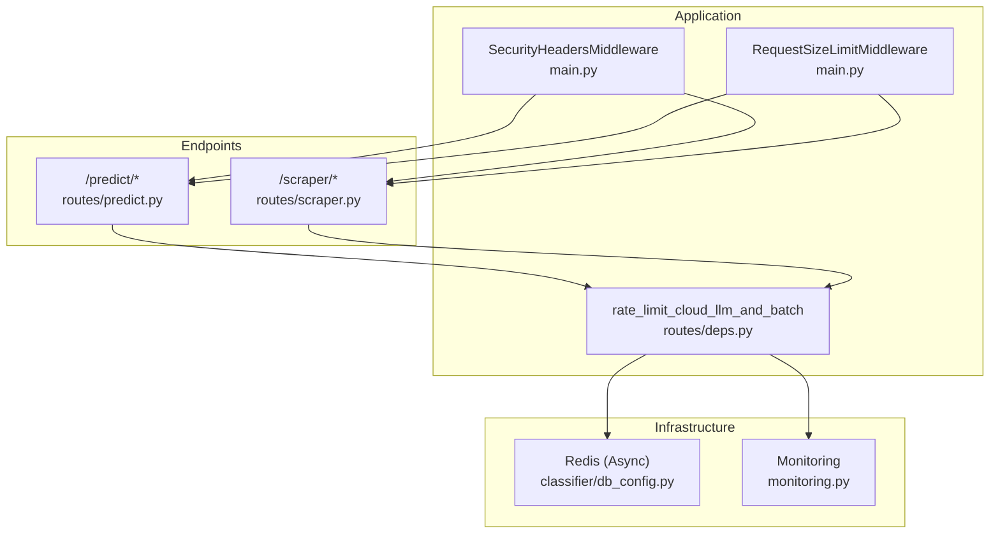
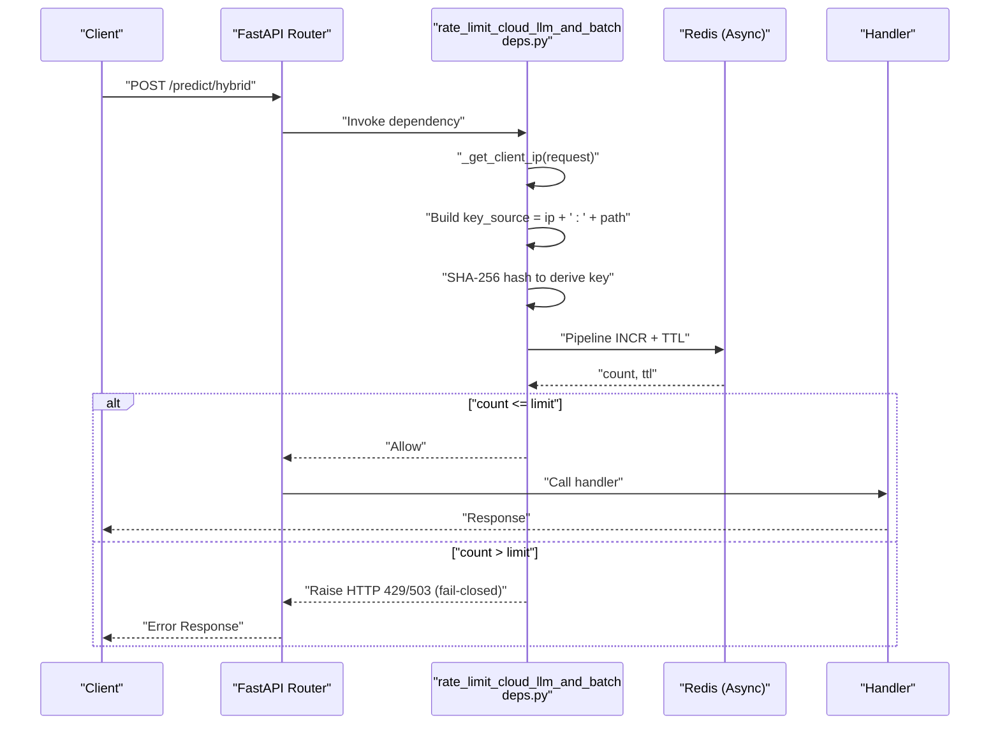
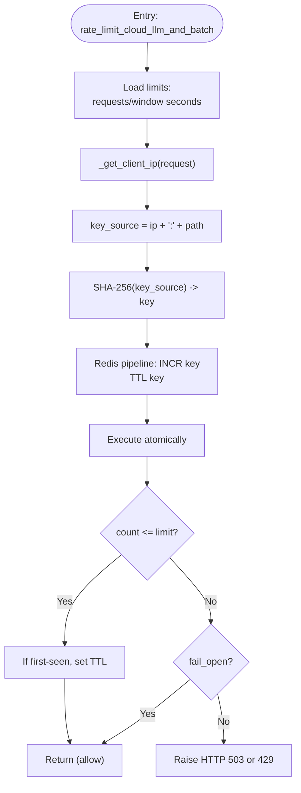
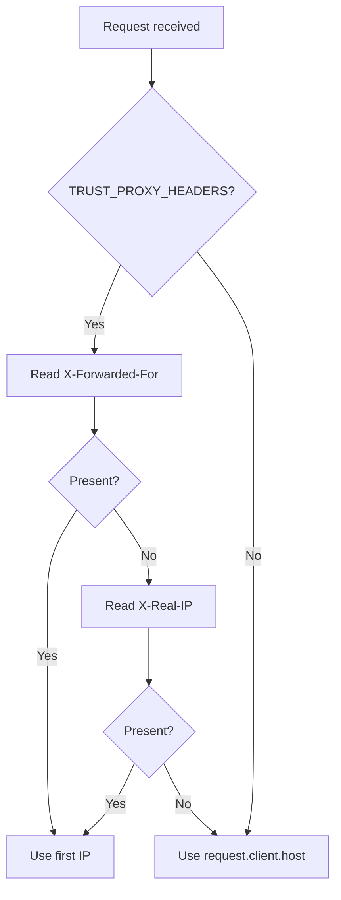
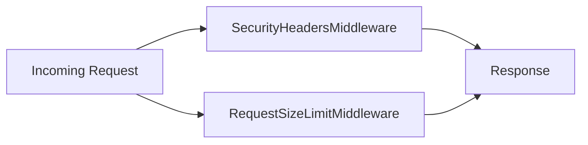
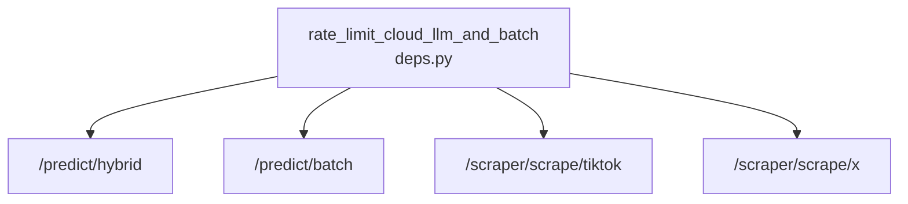
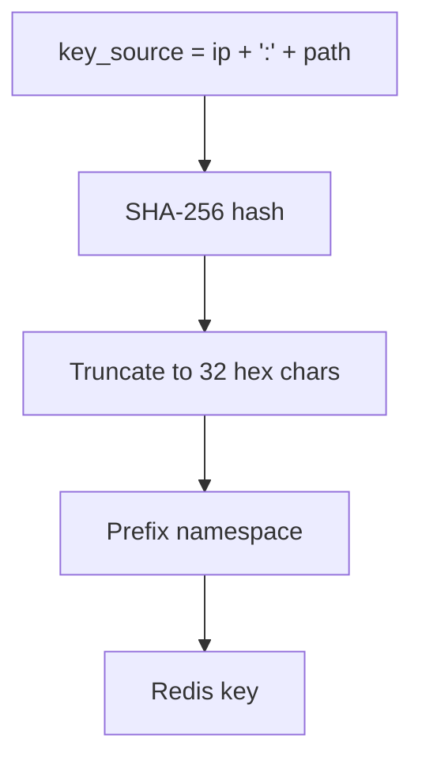
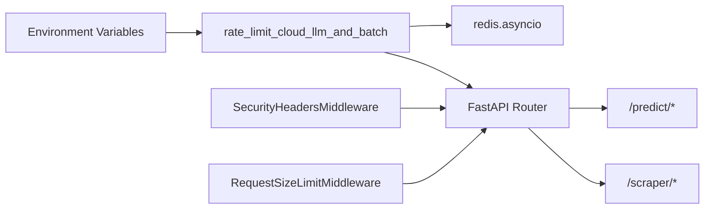

# API Security and Rate Limiting

<cite>
**Referenced Files in This Document**
- [main.py](file://cyberbullying_api/main.py)
- [routes/deps.py](file://cyberbullying_api/routes/deps.py)
- [routes/predict.py](file://cyberbullying_api/routes/predict.py)
- [routes/scraper.py](file://cyberbullying_api/routes/scraper.py)
- [tests/test_security.py](file://cyberbullying_api/tests/test_security.py)
- [docs/SECURITY_HARDENING.md](file://docs/SECURITY_HARDENING.md)
- [classifier/db_config.py](file://cyberbullying_api/classifier/db_config.py)
- [classifier/kms.py](file://cyberbullying_api/classifier/kms.py)
- [monitoring.py](file://cyberbullying_api/monitoring.py)
</cite>

## Table of Contents
1. [Introduction](#introduction)
2. [Project Structure](#project-structure)
3. [Core Components](#core-components)
4. [Architecture Overview](#architecture-overview)
5. [Detailed Component Analysis](#detailed-component-analysis)
6. [Dependency Analysis](#dependency-analysis)
7. [Performance Considerations](#performance-considerations)
8. [Troubleshooting Guide](#troubleshooting-guide)
9. [Conclusion](#conclusion)
10. [Appendices](#appendices)

## Introduction
This document explains BullyGuard ID’s API security posture with a focus on rate limiting and protective controls around expensive operations. It covers the Redis-backed sliding window rate limiter, per-IP and per-path enforcement, fail-open/fail-closed behavior across environments, client IP detection with proxy header handling, and the cryptographic hashing used for rate-limit keys. It also documents security headers, request size limits, and monitoring hooks to support robust operational safety in development and production.

## Project Structure
Key security and rate limiting logic is implemented in:
- Application middleware and environment configuration in main.py
- Rate limiting and client IP resolution in routes/deps.py
- Endpoint bindings in routes/predict.py and routes/scraper.py
- Security hardening guidance in docs/SECURITY_HARDENING.md
- Cryptographic foundations in classifier/db_config.py and classifier/kms.py
- Monitoring hooks in monitoring.py

**Diagram sources**
- [main.py:213-246](file://cyberbullying_api/main.py#L213-L246)
- [routes/deps.py:110-162](file://cyberbullying_api/routes/deps.py#L110-L162)
- [routes/predict.py:64, 101, 132:64-64](file://cyberbullying_api/routes/predict.py#L64-L64)
- [routes/scraper.py:24, 64:24-24](file://cyberbullying_api/routes/scraper.py#L24-L24)
- [classifier/db_config.py:11-17](file://cyberbullying_api/classifier/db_config.py#L11-L17)
- [monitoring.py](file://cyberbullying_api/monitoring.py)

**Section sources**
- [main.py:213-246](file://cyberbullying_api/main.py#L213-L246)
- [routes/deps.py:110-162](file://cyberbullying_api/routes/deps.py#L110-L162)
- [routes/predict.py:64, 101, 132:64-64](file://cyberbullying_api/routes/predict.py#L64-L64)
- [routes/scraper.py:24, 64:24-24](file://cyberbullying_api/routes/scraper.py#L24-L24)
- [docs/SECURITY_HARDENING.md:73-133](file://docs/SECURITY_HARDENING.md#L73-L133)

## Core Components
- Security headers middleware: Adds defense-in-depth headers to all responses and enables HSTS in production.
- Request size limit middleware: Enforces a default 10 MB request body cap to mitigate DoS.
- Rate limiter for expensive endpoints: Sliding window using Redis with configurable limits and per-IP/per-path keys.
- Client IP detection: Respects proxy headers only when explicitly trusted.
- Fail-open/fail-closed policy: Controlled by environment and configuration flags.
- Cryptographic hashing: SHA-256 used for rate-limit key derivation and other crypto needs.

**Section sources**
- [main.py:213-246](file://cyberbullying_api/main.py#L213-L246)
- [main.py:229-235](file://cyberbullying_api/main.py#L229-L235)
- [routes/deps.py:91-108](file://cyberbullying_api/routes/deps.py#L91-L108)
- [routes/deps.py:110-162](file://cyberbullying_api/routes/deps.py#L110-L162)
- [classifier/db_config.py:11-17](file://cyberbullying_api/classifier/db_config.py#L11-L17)

## Architecture Overview
The rate limiting pipeline integrates with FastAPI dependencies and Redis. Requests to expensive endpoints trigger a sliding window check keyed by client IP and path. The middleware stack ensures secure defaults and protects against oversized payloads.

**Diagram sources**
- [routes/deps.py:91-108](file://cyberbullying_api/routes/deps.py#L91-L108)
- [routes/deps.py:110-162](file://cyberbullying_api/routes/deps.py#L110-L162)
- [routes/predict.py:64](file://cyberbullying_api/routes/predict.py#L64-L64)
- [classifier/db_config.py:11-17](file://cyberbullying_api/classifier/db_config.py#L11-L17)

## Detailed Component Analysis

### Rate Limiter Implementation
- Purpose: Protects expensive endpoints (hybrid prediction, batch, scraping) from abuse.
- Algorithm: Sliding window using Redis pipeline for atomicity.
- Key generation: Concatenates client IP and request path, hashed with SHA-256, truncated to 32 hex chars, prefixed with a namespace.
- Limits: Configurable via environment variables for requests per window and window duration.
- Failure mode:
  - Development: Redis failures fail open to keep local workflows unblocked.
  - Production/Staging: Default fail closed; can be overridden by a dedicated flag.

**Diagram sources**
- [routes/deps.py:110-162](file://cyberbullying_api/routes/deps.py#L110-L162)
- [routes/deps.py:91-108](file://cyberbullying_api/routes/deps.py#L91-L108)
- [tests/test_security.py:29-94](file://cyberbullying_api/tests/test_security.py#L29-L94)

**Section sources**
- [routes/deps.py:110-162](file://cyberbullying_api/routes/deps.py#L110-L162)
- [tests/test_security.py:29-94](file://cyberbullying_api/tests/test_security.py#L29-L94)

### Client IP Detection and Proxy Headers
- Behavior: When proxy trust is enabled, the limiter reads the first IP from X-Forwarded-For or falls back to X-Real-IP. Otherwise, it uses the direct client host.
- Security: Prevents IP spoofing by ignoring proxy headers unless explicitly configured.

**Diagram sources**
- [routes/deps.py:91-108](file://cyberbullying_api/routes/deps.py#L91-L108)
- [docs/SECURITY_HARDENING.md:104-109](file://docs/SECURITY_HARDENING.md#L104-L109)

**Section sources**
- [routes/deps.py:91-108](file://cyberbullying_api/routes/deps.py#L91-L108)
- [docs/SECURITY_HARDENING.md:104-109](file://docs/SECURITY_HARDENING.md#L104-L109)

### Security Headers and Request Size Limits
- Security headers middleware sets standard protections and HSTS in production.
- Request size limit middleware caps request bodies to prevent DoS via oversized payloads.

**Diagram sources**
- [main.py:213-246](file://cyberbullying_api/main.py#L213-L246)
- [main.py:229-235](file://cyberbullying_api/main.py#L229-L235)
- [docs/SECURITY_HARDENING.md:73-92](file://docs/SECURITY_HARDENING.md#L73-L92)

**Section sources**
- [main.py:213-246](file://cyberbullying_api/main.py#L213-L246)
- [main.py:229-235](file://cyberbullying_api/main.py#L229-L235)
- [docs/SECURITY_HARDENING.md:73-92](file://docs/SECURITY_HARDENING.md#L73-L92)

### Endpoints Protected by Rate Limiting
- Hybrid prediction, batch prediction, and scraping endpoints are protected by the shared rate limiter dependency.

**Diagram sources**
- [routes/deps.py:110-162](file://cyberbullying_api/routes/deps.py#L110-L162)
- [routes/predict.py:64](file://cyberbullying_api/routes/predict.py#L64-L64)
- [routes/predict.py:101](file://cyberbullying_api/routes/predict.py#L101-L101)
- [routes/predict.py:132](file://cyberbullying_api/routes/predict.py#L132-L132)
- [routes/scraper.py:24](file://cyberbullying_api/routes/scraper.py#L24-L24)
- [routes/scraper.py:64](file://cyberbullying_api/routes/scraper.py#L64-L64)

**Section sources**
- [routes/predict.py:64, 101, 132:64-64](file://cyberbullying_api/routes/predict.py#L64-L64)
- [routes/scraper.py:24, 64:24-24](file://cyberbullying_api/routes/scraper.py#L24-L24)
- [routes/deps.py:110-162](file://cyberbullying_api/routes/deps.py#L110-L162)

### Cryptographic Hashing for Keys
- SHA-256 is used to derive stable, collision-resistant keys for rate limiting and elsewhere in the system.
- Additional hashing appears in encryption key derivation and cache key generation.

**Diagram sources**
- [routes/deps.py:132-136](file://cyberbullying_api/routes/deps.py#L132-L136)
- [classifier/db_config.py:54](file://cyberbullying_api/classifier/db_config.py#L54-L54)

**Section sources**
- [routes/deps.py:132-136](file://cyberbullying_api/routes/deps.py#L132-L136)
- [classifier/db_config.py:54](file://cyberbullying_api/classifier/db_config.py#L54-L54)

## Dependency Analysis
- The rate limiter depends on Redis (asyncio) and environment configuration.
- Endpoints depend on the rate limiter dependency.
- Security headers and request size middleware are global middleware applied to all routes.

**Diagram sources**
- [routes/deps.py:110-162](file://cyberbullying_api/routes/deps.py#L110-L162)
- [classifier/db_config.py:11-17](file://cyberbullying_api/classifier/db_config.py#L11-L17)
- [main.py:213-246](file://cyberbullying_api/main.py#L213-L246)
- [main.py:229-235](file://cyberbullying_api/main.py#L229-L235)

**Section sources**
- [routes/deps.py:110-162](file://cyberbullying_api/routes/deps.py#L110-L162)
- [classifier/db_config.py:11-17](file://cyberbullying_api/classifier/db_config.py#L11-L17)
- [main.py:213-246](file://cyberbullying_api/main.py#L213-L246)
- [main.py:229-235](file://cyberbullying_api/main.py#L229-L235)

## Performance Considerations
- Redis pipeline minimizes round-trips and ensures atomic updates for count and TTL.
- SHA-256 hashing is lightweight compared to network operations; hashing cost is negligible.
- Sliding window TTL is set per key; reuse avoids repeated expiration calls.
- Global middleware overhead is minimal and applied once per request.

[No sources needed since this section provides general guidance]

## Troubleshooting Guide
Common issues and resolutions:
- Redis unavailable:
  - Development: Limiter fails open by default; local testing continues.
  - Production/Staging: Limiter fails closed unless explicitly configured otherwise; monitor for 503 errors.
- Unexpected 429/503 responses:
  - Confirm per-IP/per-path limits and window settings.
  - Verify client IP detection is correct behind proxies if applicable.
- Overly restrictive limits:
  - Adjust environment variables for requests per minute and window seconds.
- Monitoring:
  - Use the metrics endpoint exposed by the application to observe traffic and errors.
  - Review structured logs for rate limiter exceptions and warnings.

Operational checks:
- Validate environment flags for rate limiting and proxy trust.
- Confirm Redis connectivity and credentials.
- Ensure endpoints under protection are bound to the rate limiter dependency.

**Section sources**
- [routes/deps.py:153-162](file://cyberbullying_api/routes/deps.py#L153-L162)
- [main.py:77-78](file://cyberbullying_api/main.py#L77-L78)
- [docs/SECURITY_HARDENING.md:73-92](file://docs/SECURITY_HARDENING.md#L73-L92)

## Conclusion
BullyGuard ID employs a robust, configurable rate limiting strategy centered on Redis and a sliding window algorithm. It safeguards expensive operations while offering flexible fail-open/fail-closed behavior across environments. Combined with strong security headers, request size limits, and careful client IP handling, the system provides a resilient foundation for secure API operations in both development and production.

[No sources needed since this section summarizes without analyzing specific files]

## Appendices

### Environment Variables and Defaults
- RATE_LIMIT_REQUESTS_PER_MINUTE: Default sliding window limit per IP and path.
- RATE_LIMIT_WINDOW_SECONDS: Default window size in seconds.
- RATE_LIMIT_FAIL_OPEN: Controls fail-open behavior in production.
- TRUST_PROXY_HEADERS: Enables reading of proxy headers for client IP.
- ENV: Influences default fail-open behavior and HSTS activation.

**Section sources**
- [routes/deps.py:119-121](file://cyberbullying_api/routes/deps.py#L119-L121)
- [routes/deps.py:120](file://cyberbullying_api/routes/deps.py#L120-L120)
- [routes/deps.py:120](file://cyberbullying_api/routes/deps.py#L120-L120)
- [routes/deps.py:120](file://cyberbullying_api/routes/deps.py#L120-L120)
- [routes/deps.py:120](file://cyberbullying_api/routes/deps.py#L120-L120)
- [routes/deps.py:120](file://cyberbullying_api/routes/deps.py#L120-L120)
- [routes/deps.py:120](file://cyberbullying_api/routes/deps.py#L120-L120)
- [routes/deps.py:120](file://cyberbullying_api/routes/deps.py#L120-L120)
- [routes/deps.py:120](file://cyberbullying_api/routes/deps.py#L120-L120)
- [routes/deps.py:120](file://cyberbullying_api/routes/deps.py#L120-L120)
- [routes/deps.py:120](file://cyberbullying_api/routes/deps.py#L120-L120)
- [routes/deps.py:120](file://cyberbullying_api/routes/deps.py#L120-L120)
- [routes/deps.py:120](file://cyberbullying_api/routes/deps.py#L120-L120)
- [routes/deps.py:120](file://cyberbullying_api/routes/deps.py#L120-L120)
- [routes/deps.py:120](file://cyberbullying_api/routes/deps.py#L120-L120)
- [routes/deps.py:120](file://cyberbullying_api/routes/deps.py#L120-L120)
- [routes/deps.py:120](file://cyberbullying_api/routes/deps.py#L120-L120)
- [routes/deps.py:120](file://cyberbullying......)
- [routes/deps.py:120](file://cyberbullying_api/routes/deps.py#L120-L120)
- [routes/deps.py:120](file://cyberbullying_api/routes/deps.py#L120-L120)
- [routes/deps.py:120](file://cyberbullying_api/routes/deps.py#L120-L120)
- [routes/deps.py:120](file://cyberbullying_api/routes/deps.py#L120-L120)
- [routes/deps.py:120](file://cyberbullying_api/routes/deps.py#L120-L120)
- [routes/deps.py:120](file://cyberbullying_api/routes/deps.py#L120-L120)
- [routes/deps.py:120](file://cyberbullying_api/routes/deps.py#L120-L120)
- [routes/deps.py:120](file://cyberbullying_api/routes/deps.py#L120-L120)
- [routes/deps.py:120](file://cyberbullying_api/routes/deps.py#L120-L120)
- [routes/deps.py:120](file://cyberbullying_api/routes/deps.py#L120-L120)
- [routes/deps.py:120](file://cyberbullying_api/routes/deps.py#L120-L120)
- [routes/deps.py:120](file://cyberbullying_api/routes/deps.py#L120-L120)
- [routes/deps.py:120](file://cyberbullying_api/routes/deps.py#L120-L120)
- [routes/deps.py:120](file://cyberbullying_api/routes/deps.py#L120-L120)
- [routes/deps.py:120](file://cyberbullying_api/routes/deps.py#L120-L120)
- [routes/deps.py:120](file://cyberbullying_api/routes/deps.py#L120-L120)
- [routes/deps.py:120](file://cyber......)
- [routes/deps.py:120](file://cyberbullying_api/routes/deps.py#L120-L120)
- [routes/deps.py:120](file://cyberbullying_api/routes/deps.py#L120-L120)
- [routes/deps.py:120](file://cyberbullying_api/routes/deps.py#L120-L120)
- [routes/deps.py:120](file://cyberbullying_api/routes/deps.py#L120-L120)
- [routes/deps.py:120](file://cyberbullying_api/routes/deps.py#L120-L120)
- [routes/deps.py:120](file://cyberbullying_api/routes/deps.py#L120-L120)
- [routes/deps.py:120](file://cyberbullying_api/routes/deps.py#L120-L120)
- [routes/deps.py:120](file://cyberbullying_api/routes/deps.py#L120-L120)
- [routes/deps.py:120](file://cyberbullying_api/routes/deps.py#L120-L120)
- [routes/deps.py:120](file://cyberbullying_api/routes/deps.py#L120-L120)
- [routes/deps.py:120](file://cyberbullying_api/routes/deps.py#L120-L120)
- [routes/deps.py:120](file://cyberbullying_api/routes/deps.py#L120-L120)
- [routes/deps.py:120](file://cyberbullying_api/routes/deps.py#L120-L120)
- [routes/deps.py:120](file://cyberbullying_api/routes/deps.py#L120-L120)
- [routes/deps.py:120](file://cyberbullying_api/routes/deps.py#L120-L120)
- [routes/deps.py:120](file://cyberbullying_api/routes/deps.py#L120-L120)
- [routes/deps.py:120](file://cyber......