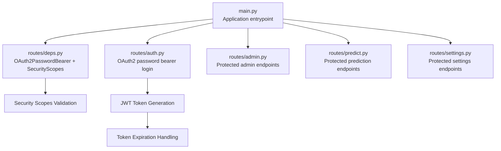
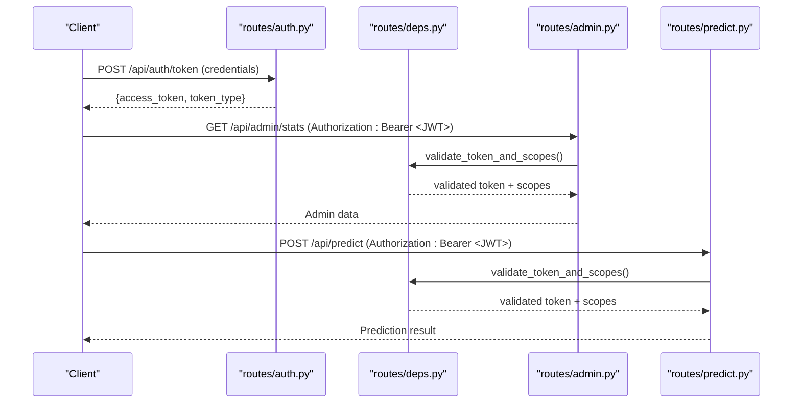
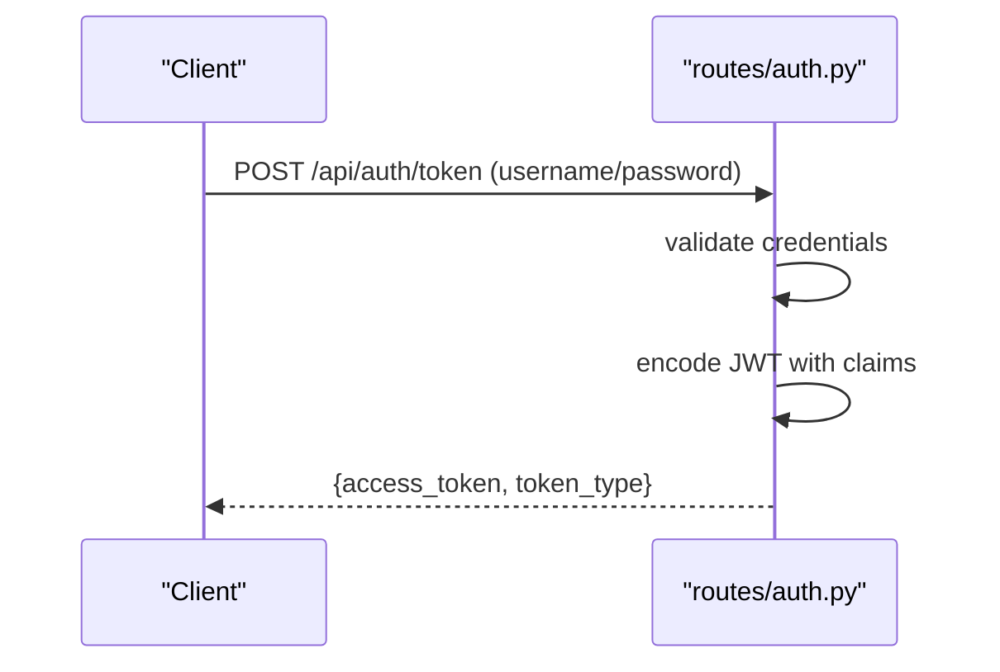
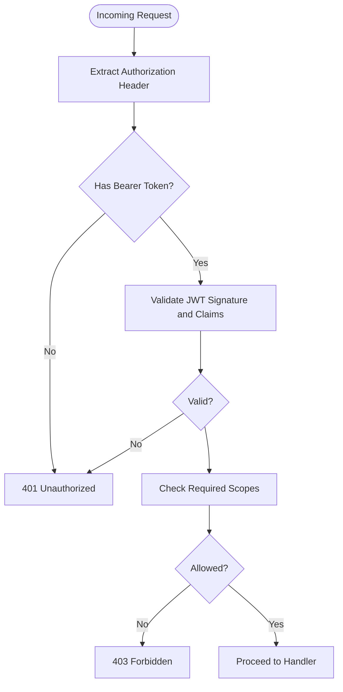
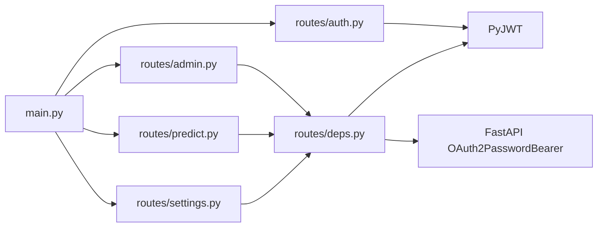

# Authentication and Authorization

<cite>
**Referenced Files in This Document**
- [main.py](file://cyberbullying_api/main.py)
- [routes/auth.py](file://cyberbullying_api/routes/auth.py)
- [routes/deps.py](file://cyberbullying_api/routes/deps.py)
- [routes/admin.py](file://cyberbullying_api/routes/admin.py)
- [routes/predict.py](file://cyberbullying_api/routes/predict.py)
- [routes/settings.py](file://cyberbullying_api/routes/settings.py)
- [tests/test_security.py](file://cyberbullying_api/tests/test_security.py)
- [docs/SECURITY_HARDENING.md](file://docs/SECURITY_HARDENING.md)
</cite>

## Table of Contents
1. [Introduction](#introduction)
2. [Project Structure](#project-structure)
3. [Core Components](#core-components)
4. [Architecture Overview](#architecture-overview)
5. [Detailed Component Analysis](#detailed-component-analysis)
6. [Dependency Analysis](#dependency-analysis)
7. [Performance Considerations](#performance-considerations)
8. [Troubleshooting Guide](#troubleshooting-guide)
9. [Conclusion](#conclusion)

## Introduction
This document explains the authentication and authorization model for BullyGuard ID, focusing on JWT-based security, OAuth2 password bearer flow, token generation and validation, role-based access control (RBAC), and dual authentication support via JWT and API keys. It also covers scope-based permissions, token expiration handling, security headers, development environment bypass behavior, and practical guidance for secure token handling.

## Project Structure
The authentication and authorization logic is primarily implemented in the FastAPI application with dedicated route handlers and shared dependencies:
- Application entrypoint configures global security headers and mounts routers.
- Authentication routes handle login and token issuance.
- Shared dependencies define OAuth2 bearer scheme, token validation, and scope checks.
- Admin and prediction routes demonstrate protected endpoints and RBAC enforcement.
- Tests validate security behaviors and error conditions.

**Diagram sources**
- [main.py:216-220](file://cyberbullying_api/main.py#L216-L220)
- [routes/auth.py:13](file://cyberbullying_api/routes/auth.py#L13)
- [routes/deps.py:210-239](file://cyberbullying_api/routes/deps.py#L210-L239)
- [routes/admin.py:12](file://cyberbullying_api/routes/admin.py#L12)
- [routes/predict.py](file://cyberbullying_api/routes/predict.py)
- [routes/settings.py](file://cyberbullying_api/routes/settings.py)

**Section sources**
- [main.py:42](file://cyberbullying_api/main.py#L42)
- [main.py:216-220](file://cyberbullying_api/main.py#L216-L220)
- [routes/auth.py:13](file://cyberbullying_api/routes/auth.py#L13)
- [routes/deps.py:210-239](file://cyberbullying_api/routes/deps.py#L210-L239)

## Core Components
- OAuth2 Password Bearer Login: Public endpoint that validates credentials and issues JWT access tokens.
- JWT Token Issuance: Encodes claims (subject, scopes, expiration) using a secret and algorithm.
- Token Validation and Scopes: Centralized dependency validates tokens and enforces scope-based access.
- Protected Routes: Admin and prediction endpoints require valid tokens and appropriate scopes.
- Security Headers: Global middleware adds standard security headers to all responses.
- Dual Authentication: API key fallback for development environments when API_KEY is not configured.

Key implementation references:
- OAuth2 login and token generation: [routes/auth.py:16-60](file://cyberbullying_api/routes/auth.py#L16-L60)
- OAuth2 bearer scheme and token validation: [routes/deps.py:210-239](file://cyberbullying_api/routes/deps.py#L210-L239)
- Protected endpoints (examples): [routes/admin.py:12](file://cyberbullying_api/routes/admin.py#L12), [routes/predict.py](file://cyberbullying_api/routes/predict.py)
- Security headers: [main.py:216-220](file://cyberbullying_api/main.py#L216-L220)
- API key development bypass: [main.py:73](file://cyberbullying_api/main.py#L73)

**Section sources**
- [routes/auth.py:16-60](file://cyberbullying_api/routes/auth.py#L16-L60)
- [routes/deps.py:210-239](file://cyberbullying_api/routes/deps.py#L210-L239)
- [routes/admin.py:12](file://cyberbullying_api/routes/admin.py#L12)
- [main.py:73](file://cyberbullying_api/main.py#L73)
- [main.py:216-220](file://cyberbullying_api/main.py#L216-L220)

## Architecture Overview
The system uses FastAPI with OAuth2 password bearer flow and JWT tokens. Tokens carry scopes for granular permissions. A shared dependency enforces token validation and scope checks across protected routes. Security headers are applied globally. In development, API key validation can be bypassed when API_KEY is unset.

**Diagram sources**
- [routes/auth.py:16-60](file://cyberbullying_api/routes/auth.py#L16-L60)
- [routes/deps.py:210-239](file://cyberbullying_api/routes/deps.py#L210-L239)
- [routes/admin.py:12](file://cyberbullying_api/routes/admin.py#L12)
- [routes/predict.py](file://cyberbullying_api/routes/predict.py)

## Detailed Component Analysis

### OAuth2 Password Bearer Flow and Token Issuance
- Endpoint: POST /api/auth/token
- Accepts client credentials and performs authentication.
- On successful validation, generates a JWT containing subject and scopes.
- Returns token type and access token for client usage.

**Diagram sources**
- [routes/auth.py:16-60](file://cyberbullying_api/routes/auth.py#L16-L60)

**Section sources**
- [routes/auth.py:16-60](file://cyberbullying_api/routes/auth.py#L16-L60)

### Token Validation and Scope-Based Access Control
- OAuth2PasswordBearer configured to use /api/auth/token as tokenUrl.
- Centralized dependency validates tokens and checks requested scopes.
- Enforces that tokens include required scopes for protected endpoints.

**Diagram sources**
- [routes/deps.py:210-239](file://cyberbullying_api/routes/deps.py#L210-L239)

**Section sources**
- [routes/deps.py:210-239](file://cyberbullying_api/routes/deps.py#L210-L239)

### Protected Endpoints and RBAC
- Admin endpoints require appropriate scopes for administrative actions.
- Prediction endpoints require the 'predict' scope.
- Settings endpoints require elevated privileges aligned with admin scope.

References:
- Admin router import and usage: [routes/admin.py:12](file://cyberbullying_api/routes/admin.py#L12)
- Protected route examples: [routes/admin.py:12](file://cyberbullying_api/routes/admin.py#L12), [routes/predict.py](file://cyberbullying_api/routes/predict.py), [routes/settings.py](file://cyberbullying_api/routes/settings.py)

**Section sources**
- [routes/admin.py:12](file://cyberbullying_api/routes/admin.py#L12)
- [routes/predict.py](file://cyberbullying_api/routes/predict.py)
- [routes/settings.py](file://cyberbullying_api/routes/settings.py)

### Dual Authentication: JWT and API Keys
- API key validation can be enabled/disabled per environment.
- In development mode, if API_KEY is not set, protected endpoints may run without authentication.
- Production deployments should enforce API key validation.

References:
- Development bypass warning: [main.py:73](file://cyberbullying_api/main.py#L73)

**Section sources**
- [main.py:73](file://cyberbullying_api/main.py#L73)

### Token Expiration Handling
- JWT encoding includes an expiration claim.
- Clients must refresh tokens before expiry to maintain access.
- Server-side validation rejects expired tokens.

References:
- JWT encoding with expiration: [routes/auth.py:56-60](file://cyberbullying_api/routes/auth.py#L56-L60)

**Section sources**
- [routes/auth.py:56-60](file://cyberbullying_api/routes/auth.py#L56-L60)

### Security Headers Configuration
- Global middleware applies standard security headers to all responses.

References:
- Security headers function: [main.py:216-220](file://cyberbullying_api/main.py#L216-L220)

**Section sources**
- [main.py:216-220](file://cyberbullying_api/main.py#L216-L220)

### Practical Examples and Workflows
- Successful login and token retrieval: [routes/auth.py:16-60](file://cyberbullying_api/routes/auth.py#L16-L60)
- Protected admin access: [routes/admin.py:12](file://cyberbullying_api/routes/admin.py#L12)
- Protected prediction access: [routes/predict.py](file://cyberbullying_api/routes/predict.py)
- Token validation and scope enforcement: [routes/deps.py:210-239](file://cyberbullying_api/routes/deps.py#L210-L239)

**Section sources**
- [routes/auth.py:16-60](file://cyberbullying_api/routes/auth.py#L16-L60)
- [routes/admin.py:12](file://cyberbullying_api/routes/admin.py#L12)
- [routes/predict.py](file://cyberbullying_api/routes/predict.py)
- [routes/deps.py:210-239](file://cyberbullying_api/routes/deps.py#L210-L239)

## Dependency Analysis
The authentication system relies on:
- FastAPI OAuth2PasswordBearer for token URL and bearer validation.
- PyJWT for encoding/decoding tokens.
- Shared dependency module for centralized token validation and scope checks.
- Route modules for protected endpoints.

**Diagram sources**
- [routes/auth.py:6](file://cyberbullying_api/routes/auth.py#L6)
- [routes/deps.py:24](file://cyberbullying_api/routes/deps.py#L24)
- [routes/admin.py:12](file://cyberbullying_api/routes/admin.py#L12)
- [routes/predict.py](file://cyberbullying_api/routes/predict.py)
- [routes/settings.py](file://cyberbullying_api/routes/settings.py)
- [main.py:267](file://cyberbullying_api/main.py#L267)

**Section sources**
- [routes/auth.py:6](file://cyberbullying_api/routes/auth.py#L6)
- [routes/deps.py:24](file://cyberbullying_api/routes/deps.py#L24)
- [routes/admin.py:12](file://cyberbullying_api/routes/admin.py#L12)
- [routes/predict.py](file://cyberbullying_api/routes/predict.py)
- [routes/settings.py](file://cyberbullying_api/routes/settings.py)
- [main.py:267](file://cyberbullying_api/main.py#L267)

## Performance Considerations
- Token validation occurs per request; keep payload minimal to reduce overhead.
- Prefer short-lived access tokens with a refresh mechanism to minimize long-running sessions.
- Cache decoded token metadata server-side if needed, but avoid storing secrets.
- Apply rate limiting at the gateway or application level for token endpoints.

[No sources needed since this section provides general guidance]

## Troubleshooting Guide
Common issues and resolutions:
- 401 Unauthorized: Verify Authorization header format and token validity.
- 403 Forbidden: Confirm token includes required scopes for the endpoint.
- Expired token: Refresh token before expiry or re-authenticate.
- Development bypass: If API_KEY is unset, endpoints may run without API key validation; configure API_KEY for production.
- Security headers missing: Ensure global middleware is active.

References:
- Development bypass note: [main.py:73](file://cyberbullying_api/main.py#L73)
- Security headers function: [main.py:216-220](file://cyberbullying_api/main.py#L216-L220)
- Test coverage for security behaviors: [tests/test_security.py](file://cyberbullying_api/tests/test_security.py)

**Section sources**
- [main.py:73](file://cyberbullying_api/main.py#L73)
- [main.py:216-220](file://cyberbullying_api/main.py#L216-L220)
- [tests/test_security.py](file://cyberbullying_api/tests/test_security.py)

## Conclusion
BullyGuard ID implements a robust JWT-based authentication system with OAuth2 password bearer flow, centralized token validation, and scope-based access control. Protected endpoints enforce required scopes, while security headers and dual authentication modes support both production hardening and development convenience. Follow best practices for token lifecycle management and environment-specific configurations to maintain secure and reliable access control.