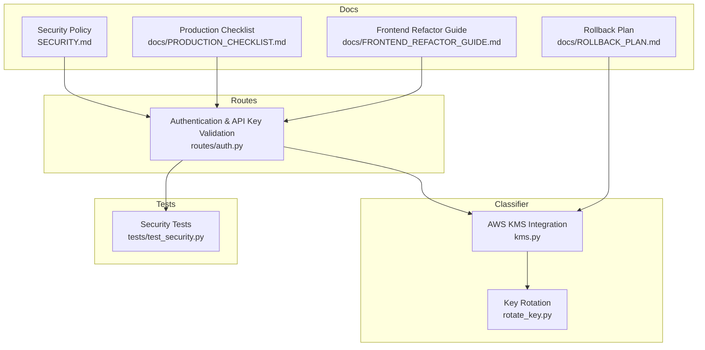
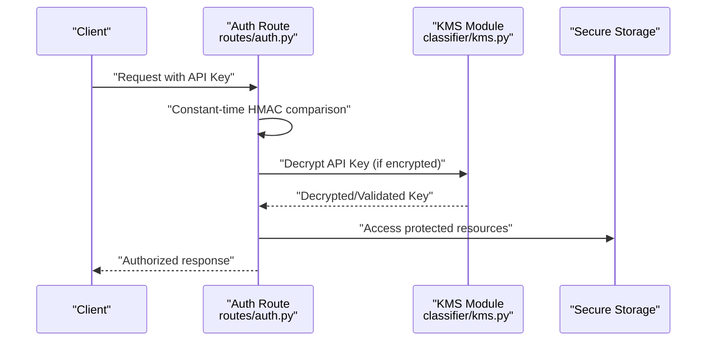
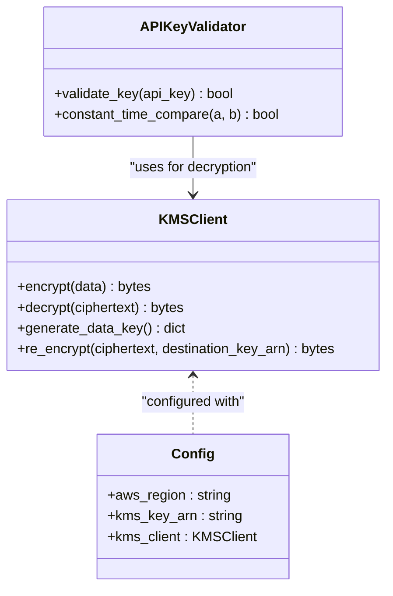
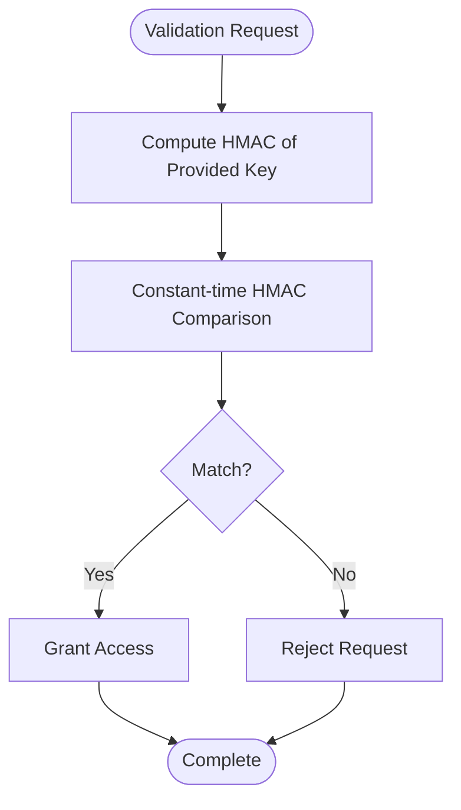
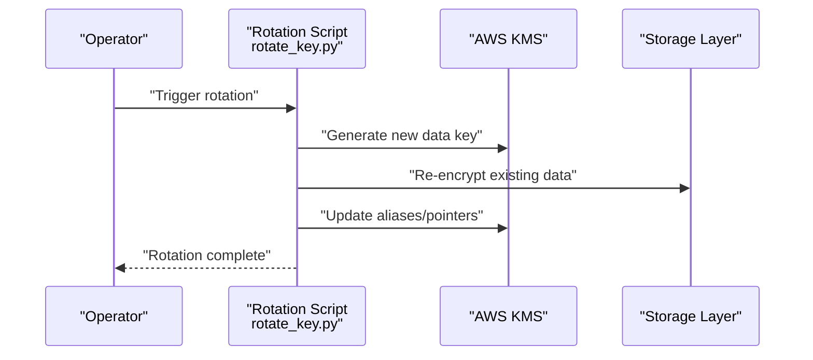
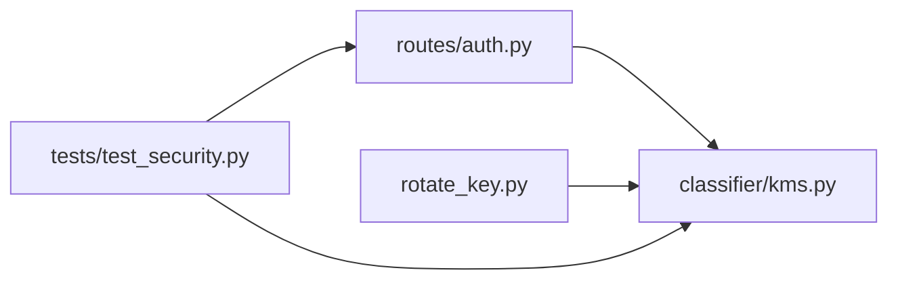

# Encryption and Data Protection

<cite>
**Referenced Files in This Document**
- [kms.py](file://cyberbullying_api/classifier/kms.py)
- [rotate_key.py](file://cyberbullying_api/rotate_key.py)
- [auth.py](file://cyberbullying_api/routes/auth.py)
- [test_security.py](file://cyberbullying_api/tests/test_security.py)
- [SECURITY.md](file://SECURITY.md)
- [PRODUCTION_CHECKLIST.md](file://docs/PRODUCTION_CHECKLIST.md)
- [ROLLBACK_PLAN.md](file://docs/ROLLBACK_PLAN.md)
- [FRONTEND_REFACTOR_GUIDE.md](file://docs/FRONTEND_REFACTOR_GUIDE.md)
</cite>

## Table of Contents
1. [Introduction](#introduction)
2. [Project Structure](#project-structure)
3. [Core Components](#core-components)
4. [Architecture Overview](#architecture-overview)
5. [Detailed Component Analysis](#detailed-component-analysis)
6. [Dependency Analysis](#dependency-analysis)
7. [Performance Considerations](#performance-considerations)
8. [Troubleshooting Guide](#troubleshooting-guide)
9. [Conclusion](#conclusion)
10. [Appendices](#appendices)

## Introduction
This document provides comprehensive encryption and data protection guidance for BullyGuard ID. It focuses on AWS KMS integration for API key encryption and decryption, secure key management practices, key rotation procedures, constant-time HMAC comparison for API key validation, and broader data protection strategies including secure storage and transmission. It also outlines security hardening measures, compliance considerations, audit trail requirements, key lifecycle management, disaster recovery, and incident response for encryption-related issues.

## Project Structure
The encryption and data protection features are primarily implemented in the classifier module for KMS operations, the route handlers for authentication and API key validation, and supporting documentation for production, rollback, and security practices.

**Diagram sources**
- [kms.py](file://cyberbullying_api/classifier/kms.py)
- [rotate_key.py](file://cyberbullying_api/rotate_key.py)
- [auth.py](file://cyberbullying_api/routes/auth.py)
- [test_security.py](file://cyberbullying_api/tests/test_security.py)
- [SECURITY.md](file://SECURITY.md)
- [PRODUCTION_CHECKLIST.md](file://docs/PRODUCTION_CHECKLIST.md)
- [ROLLBACK_PLAN.md](file://docs/ROLLBACK_PLAN.md)
- [FRONTEND_REFACTOR_GUIDE.md](file://docs/FRONTEND_REFACTOR_GUIDE.md)

**Section sources**
- [kms.py](file://cyberbullying_api/classifier/kms.py)
- [rotate_key.py](file://cyberbullying_api/rotate_key.py)
- [auth.py](file://cyberbullying_api/routes/auth.py)
- [test_security.py](file://cyberbullying_api/tests/test_security.py)
- [SECURITY.md](file://SECURITY.md)
- [PRODUCTION_CHECKLIST.md](file://docs/PRODUCTION_CHECKLIST.md)
- [ROLLBACK_PLAN.md](file://docs/ROLLBACK_PLAN.md)
- [FRONTEND_REFACTOR_GUIDE.md](file://docs/FRONTEND_REFACTOR_GUIDE.md)

## Core Components
- AWS KMS Integration: Provides encryption and decryption capabilities for API keys and sensitive data using AWS KMS. See [kms.py](file://cyberbullying_api/classifier/kms.py).
- Key Rotation: Manages rotation of KMS keys and updates dependent configurations. See [rotate_key.py](file://cyberbullying_api/rotate_key.py).
- Authentication and API Key Validation: Implements API key validation and integrates with KMS for secure operations. See [auth.py](file://cyberbullying_api/routes/auth.py).
- Security Testing: Validates cryptographic operations and security controls. See [test_security.py](file://cyberbullying_api/tests/test_security.py).
- Security Policies and Production Practices: Outlines security policies, production hardening, rollback procedures, and operational guidelines. See [SECURITY.md](file://SECURITY.md), [PRODUCTION_CHECKLIST.md](file://docs/PRODUCTION_CHECKLIST.md), [ROLLBACK_PLAN.md](file://docs/ROLLBACK_PLAN.md), [FRONTEND_REFACTOR_GUIDE.md](file://docs/FRONTEND_REFACTOR_GUIDE.md).

**Section sources**
- [kms.py](file://cyberbullying_api/classifier/kms.py)
- [rotate_key.py](file://cyberbullying_api/rotate_key.py)
- [auth.py](file://cyberbullying_api/routes/auth.py)
- [test_security.py](file://cyberbullying_api/tests/test_security.py)
- [SECURITY.md](file://SECURITY.md)
- [PRODUCTION_CHECKLIST.md](file://docs/PRODUCTION_CHECKLIST.md)
- [ROLLBACK_PLAN.md](file://docs/ROLLBACK_PLAN.md)
- [FRONTEND_REFACTOR_GUIDE.md](file://docs/FRONTEND_REFACTOR_GUIDE.md)

## Architecture Overview
The system integrates AWS KMS for encryption and decryption of API keys and sensitive data. Authentication routes validate API keys using constant-time HMAC comparison to prevent timing attacks. Key rotation is supported via a dedicated script to update keys and configurations. Security testing ensures cryptographic controls remain effective. Operational documentation covers production hardening, rollback, and security incident response.

**Diagram sources**
- [auth.py](file://cyberbullying_api/routes/auth.py)
- [kms.py](file://cyberbullying_api/classifier/kms.py)

## Detailed Component Analysis

### AWS KMS Integration for API Key Encryption and Decryption
The KMS module encapsulates encryption and decryption operations for API keys and sensitive data. It leverages AWS KMS for cryptographic operations, ensuring keys are managed by AWS and never exposed in plaintext within the application.

**Diagram sources**
- [kms.py](file://cyberbullying_api/classifier/kms.py)

Practical integration steps:
- Initialize KMS client with region and key ARN from environment configuration.
- Encrypt API keys during provisioning and store ciphertext.
- Decrypt at runtime only when needed for validation.
- Use re-encryption to migrate to new keys during rotation.

**Section sources**
- [kms.py](file://cyberbullying_api/classifier/kms.py)

### Constant-Time HMAC Comparison for API Key Validation
The authentication route implements constant-time HMAC comparison to prevent timing attacks and side-channel vulnerabilities. This ensures that the comparison operation takes a constant amount of time regardless of input differences, mitigating leakage of secret information.

**Diagram sources**
- [auth.py](file://cyberbullying_api/routes/auth.py)

Best practices:
- Use a constant-time comparison function for all HMAC validations.
- Never expose timing variations through logs or error messages.
- Ensure secrets are handled securely and cleared after use.

**Section sources**
- [auth.py](file://cyberbullying_api/routes/auth.py)

### Secure Key Management Practices
Key management encompasses secure generation, storage, rotation, and destruction of cryptographic keys. The system relies on AWS KMS for key management, minimizing exposure and leveraging AWS security controls.

Key practices:
- Use KMS key policies to restrict access to authorized principals.
- Enable key rotation at AWS KMS level.
- Store only ciphertext and key identifiers; avoid plaintext secrets.
- Audit all KMS operations via CloudTrail.

**Section sources**
- [kms.py](file://cyberbullying_api/classifier/kms.py)
- [rotate_key.py](file://cyberbullying_api/rotate_key.py)

### Key Rotation Procedures
Key rotation updates the underlying KMS key and re-encrypts stored data. The rotation script coordinates re-encryption and updates configuration references.

**Diagram sources**
- [rotate_key.py](file://cyberbullying_api/rotate_key.py)
- [kms.py](file://cyberbullying_api/classifier/kms.py)

Operational steps:
- Generate new data key via KMS.
- Re-encrypt stored ciphertexts with the new key.
- Update configuration references to the new key alias.
- Validate decryption post-rotation.

**Section sources**
- [rotate_key.py](file://cyberbullying_api/rotate_key.py)
- [kms.py](file://cyberbullying_api/classifier/kms.py)

### Data Protection Strategies
- Sensitive Data Handling: Treat API keys and tokens as secrets; never log or persist plaintext.
- Secure Storage: Store only ciphertext and metadata; use KMS-managed keys.
- Encryption at Rest: Rely on KMS-encrypted storage; ensure proper key permissions.
- Encryption in Transit: Enforce TLS for all API communications; configure load balancers accordingly.
- Least Privilege: Restrict access to KMS keys and secrets to minimal required identities.

**Section sources**
- [kms.py](file://cyberbullying_api/classifier/kms.py)
- [auth.py](file://cyberbullying_api/routes/auth.py)

### Security Hardening Measures
- Authentication: Require API key validation with constant-time HMAC comparison.
- Authorization: Enforce role-based access control for administrative endpoints.
- Secrets Management: Use environment variables or secure secret managers; avoid embedding in code.
- Network Security: Restrict inbound traffic to trusted networks; enable WAF/IPS where applicable.
- Logging and Monitoring: Log security-relevant events; monitor for anomalies and unauthorized access attempts.

**Section sources**
- [auth.py](file://cyberbullying_api/routes/auth.py)
- [SECURITY.md](file://SECURITY.md)
- [PRODUCTION_CHECKLIST.md](file://docs/PRODUCTION_CHECKLIST.md)

### Compliance Considerations
- Regulatory Alignment: Align key management and logging with applicable regulations (e.g., data protection laws).
- Audit Trails: Maintain immutable logs of KMS operations and access events.
- Data Residency: Configure KMS keys in appropriate regions per data residency requirements.
- Third-Party Assessments: Document policies and procedures for external audits.

**Section sources**
- [SECURITY.md](file://SECURITY.md)
- [PRODUCTION_CHECKLIST.md](file://docs/PRODUCTION_CHECKLIST.md)

### Audit Trail Requirements
- KMS Operations: Track encrypt, decrypt, re-encrypt, and key generation activities.
- Access Logs: Record authentication attempts, successful grants, and failures.
- Configuration Changes: Log key alias updates and rotation events.
- Retention: Define retention periods for audit logs per policy.

**Section sources**
- [kms.py](file://cyberbullying_api/classifier/kms.py)
- [SECURITY.md](file://SECURITY.md)

### Key Lifecycle Management
- Creation: Generate keys via KMS with strict key policies.
- Distribution: Provide ciphertext and key identifiers to services.
- Rotation: Periodically rotate keys and re-encrypt data.
- Decommission: Disable and schedule deletion of old keys after migration.

**Section sources**
- [rotate_key.py](file://cyberbullying_api/rotate_key.py)
- [kms.py](file://cyberbullying_api/classifier/kms.py)

### Disaster Recovery Procedures
- Backup: Maintain backups of KMS key states and configuration metadata.
- Restore: Validate ability to re-encrypt data using historical key versions.
- Testing: Regularly test restoration procedures and cross-check decryption.

**Section sources**
- [ROLLBACK_PLAN.md](file://docs/ROLLBACK_PLAN.md)
- [rotate_key.py](file://cyberbullying_api/rotate_key.py)

### Security Incident Response for Encryption-Related Issues
- Detection: Monitor for unauthorized KMS access, failed decryption, and tampering attempts.
- Containment: Rotate compromised keys immediately; revoke affected credentials.
- Eradication: Investigate root cause; update policies and configurations.
- Recovery: Restore from backups; re-validate cryptographic operations.
- Post-Incident Review: Document lessons learned and update procedures.

**Section sources**
- [SECURITY.md](file://SECURITY.md)
- [FRONTEND_REFACTOR_GUIDE.md](file://docs/FRONTEND_REFACTOR_GUIDE.md)

## Dependency Analysis
The authentication route depends on the KMS module for decryption and validation. The rotation script depends on KMS for generating new keys and re-encrypting data. Security tests validate the cryptographic controls.

**Diagram sources**
- [auth.py](file://cyberbullying_api/routes/auth.py)
- [kms.py](file://cyberbullying_api/classifier/kms.py)
- [rotate_key.py](file://cyberbullying_api/rotate_key.py)
- [test_security.py](file://cyberbullying_api/tests/test_security.py)

**Section sources**
- [auth.py](file://cyberbullying_api/routes/auth.py)
- [kms.py](file://cyberbullying_api/classifier/kms.py)
- [rotate_key.py](file://cyberbullying_api/rotate_key.py)
- [test_security.py](file://cyberbullying_api/tests/test_security.py)

## Performance Considerations
- KMS Latency: Account for latency in encryption/decryption operations; cache decrypted keys only for short-lived operations.
- Batch Operations: Minimize repeated KMS calls by batching validations or caching within process boundaries.
- Monitoring: Track KMS API rates and throttling; adjust retry/backoff policies.

[No sources needed since this section provides general guidance]

## Troubleshooting Guide
Common issues and resolutions:
- Decryption Failures: Verify KMS key permissions and alias correctness; confirm ciphertext integrity.
- Timing Attack Suspicions: Ensure constant-time HMAC comparison is used everywhere; review logs for timing variations.
- Rotation Failures: Confirm new key availability and re-encryption completeness; validate decryption post-rotation.
- Test Failures: Run security tests to validate HMAC comparisons and KMS operations.

**Section sources**
- [test_security.py](file://cyberbullying_api/tests/test_security.py)
- [auth.py](file://cyberbullying_api/routes/auth.py)
- [kms.py](file://cyberbullying_api/classifier/kms.py)
- [rotate_key.py](file://cyberbullying_api/rotate_key.py)

## Conclusion
BullyGuard ID employs AWS KMS for robust encryption and decryption of API keys and sensitive data, complemented by constant-time HMAC comparison to prevent timing attacks. Secure key management, rotation procedures, and comprehensive operational documentation support ongoing security and compliance. Adhering to these practices ensures strong data protection, resilient operations, and effective incident response.

[No sources needed since this section summarizes without analyzing specific files]

## Appendices
- Practical Examples
  - KMS Integration: Initialize KMS client with region and key ARN; encrypt API keys during provisioning; decrypt at runtime for validation.
  - Key Rotation: Use the rotation script to generate new data keys, re-encrypt stored data, and update configuration references.
  - Cryptographic Best Practices: Employ constant-time HMAC comparison, restrict KMS access, enforce TLS, and maintain audit trails.

[No sources needed since this section provides general guidance]