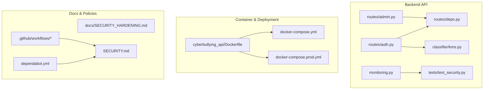
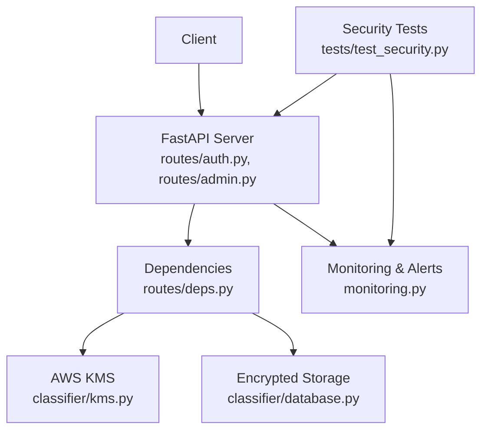
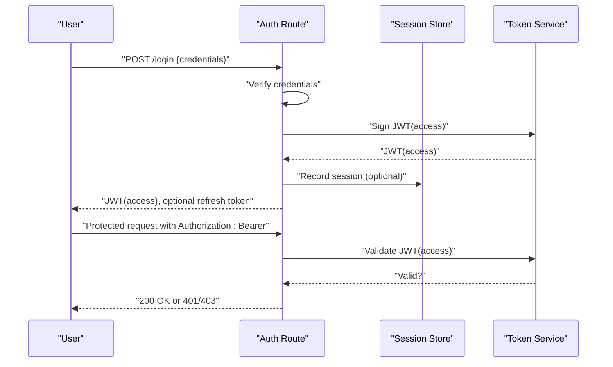
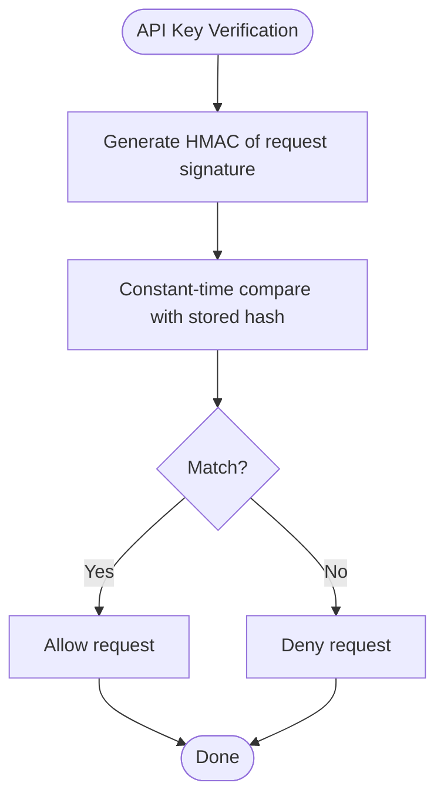
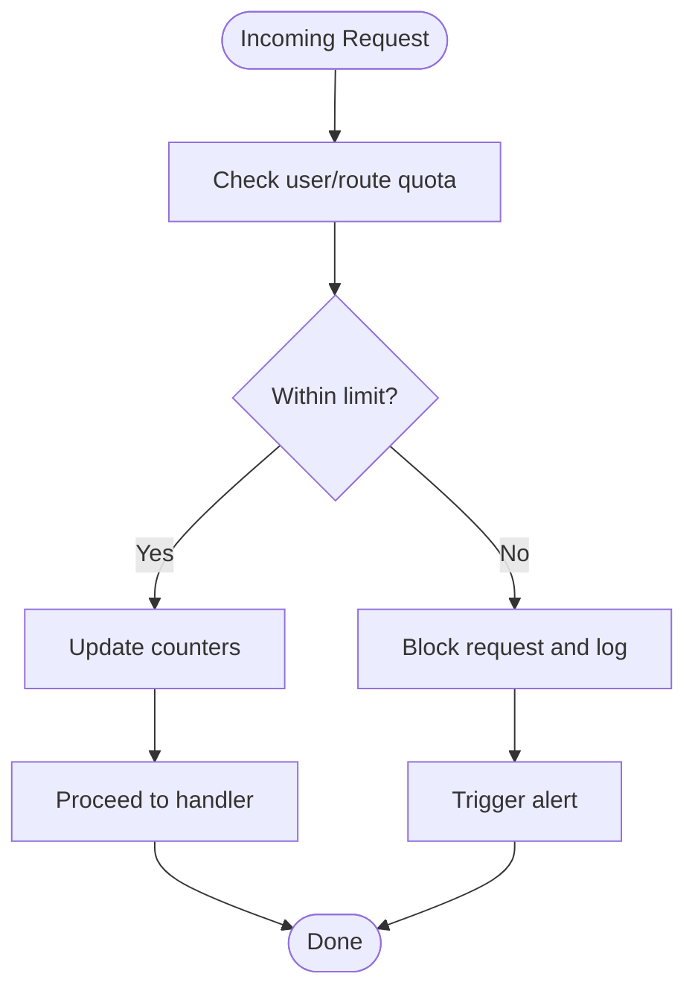
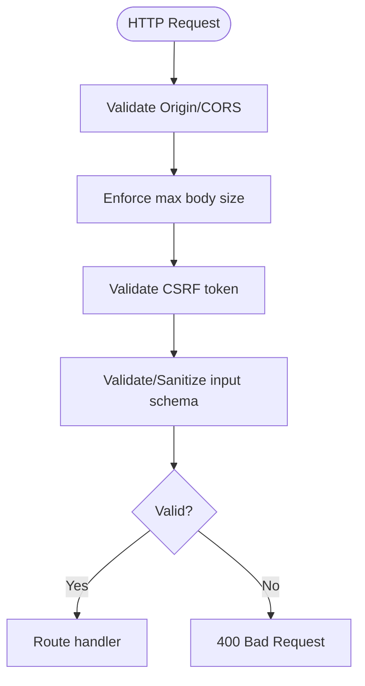
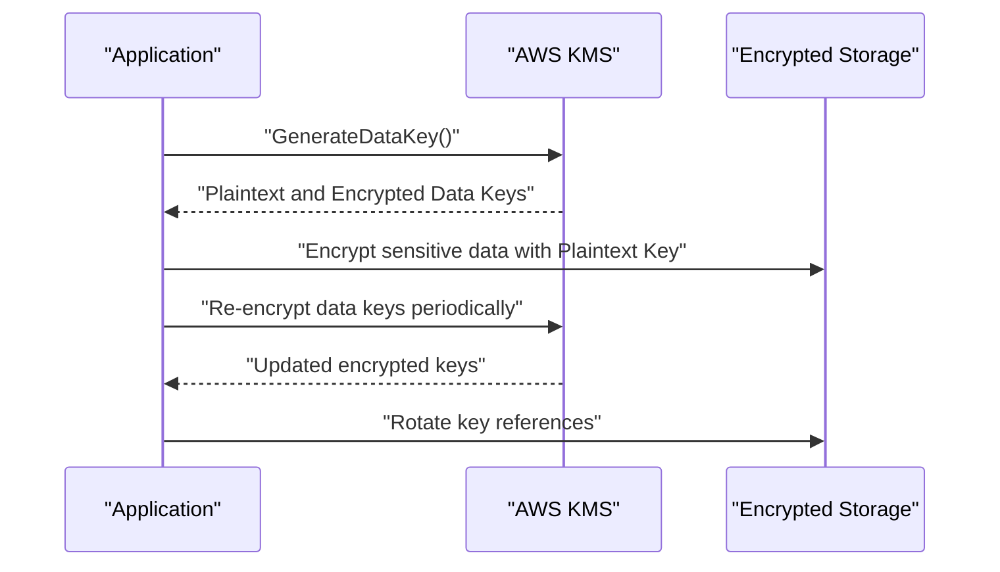
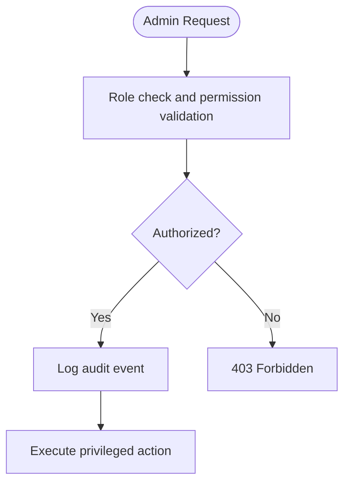
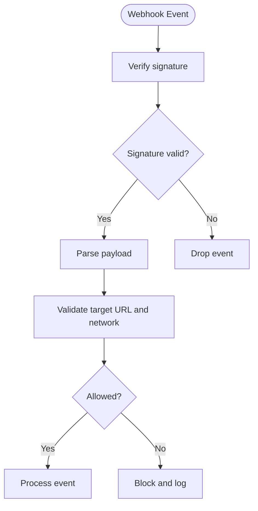
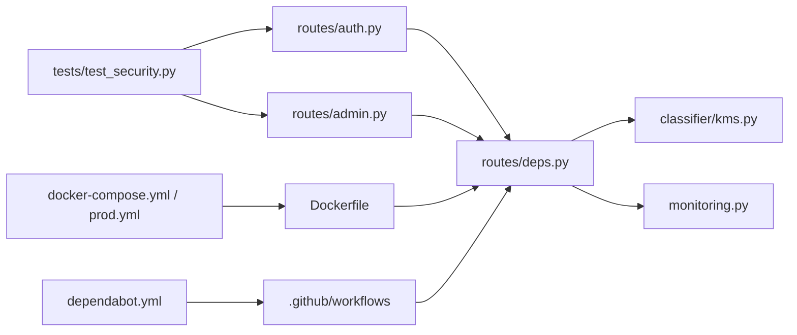

# Security and Authentication

<cite>
**Referenced Files in This Document**
- [SECURITY.md](file://SECURITY.md)
- [Dockerfile](file://cyberbullying_api/Dockerfile)
- [docker-compose.yml](file://docker-compose.yml)
- [docker-compose.prod.yml](file://docker-compose.prod.yml)
- [auth.py](file://cyberbullying_api/routes/auth.py)
- [admin.py](file://cyberbullying_api/routes/admin.py)
- [deps.py](file://cyberbullying_api/routes/deps.py)
- [kms.py](file://cyberbullying_api/classifier/kms.py)
- [rotate_key.py](file://cyberbullying_api/rotate_key.py)
- [monitoring.py](file://cyberbullying_api/monitoring.py)
- [test_security.py](file://cyberbullying_api/tests/test_security.py)
- [.github/workflows](file://.github/workflows)
- [dependabot.yml](file://.github/dependabot.yml)
- [SECURITY_HARDENING.md](file://docs/SECURITY_HARDENING.md)
</cite>

## Table of Contents
1. [Introduction](#introduction)
2. [Project Structure](#project-structure)
3. [Core Components](#core-components)
4. [Architecture Overview](#architecture-overview)
5. [Detailed Component Analysis](#detailed-component-analysis)
6. [Dependency Analysis](#dependency-analysis)
7. [Performance Considerations](#performance-considerations)
8. [Troubleshooting Guide](#troubleshooting-guide)
9. [Conclusion](#conclusion)
10. [Appendices](#appendices)

## Introduction
This document provides comprehensive security and authentication documentation for BullyGuard ID’s enterprise-grade security implementation. It covers JWT-based authentication, API key management, rate limiting, CORS configuration, request size limits, CSRF protection, input validation, encryption integration with AWS KMS, secure key rotation, administrative access controls, webhook security, SSRF protections, security headers, compliance considerations, threat mitigation, monitoring, incident response, and GitHub Actions security workflows.

## Project Structure
The security-critical components are primarily located under the backend API module (`cyberbullying_api/`) and the documentation (`docs/`). Key areas include:
- Authentication and authorization routes
- Administrative controls
- AWS KMS encryption utilities
- Monitoring and testing for security
- Containerization and deployment configurations
- GitHub Actions security workflows and Dependabot updates

**Diagram sources**
- [auth.py](file://cyberbullying_api/routes/auth.py)
- [admin.py](file://cyberbullying_api/routes/admin.py)
- [deps.py](file://cyberbullying_api/routes/deps.py)
- [kms.py](file://cyberbullying_api/classifier/kms.py)
- [monitoring.py](file://cyberbullying_api/monitoring.py)
- [test_security.py](file://cyberbullying_api/tests/test_security.py)
- [Dockerfile](file://cyberbullying_api/Dockerfile)
- [docker-compose.yml](file://docker-compose.yml)
- [docker-compose.prod.yml](file://docker-compose.prod.yml)
- [SECURITY_HARDENING.md](file://docs/SECURITY_HARDENING.md)
- [SECURITY.md](file://SECURITY.md)
- [.github/workflows](file://.github/workflows)
- [dependabot.yml](file://.github/dependabot.yml)

**Section sources**
- [auth.py](file://cyberbullying_api/routes/auth.py)
- [admin.py](file://cyberbullying_api/routes/admin.py)
- [deps.py](file://cyberbullying_api/routes/deps.py)
- [kms.py](file://cyberbullying_api/classifier/kms.py)
- [monitoring.py](file://cyberbullying_api/monitoring.py)
- [test_security.py](file://cyberbullying_api/tests/test_security.py)
- [Dockerfile](file://cyberbullying_api/Dockerfile)
- [docker-compose.yml](file://docker-compose.yml)
- [docker-compose.prod.yml](file://docker-compose.prod.yml)
- [SECURITY_HARDENING.md](file://docs/SECURITY_HARDENING.md)
- [SECURITY.md](file://SECURITY.md)
- [.github/workflows](file://.github/workflows)
- [dependabot.yml](file://.github/dependabot.yml)

## Core Components
- JWT-based authentication: Login and token issuance/validation flows
- API key management: Secure generation, storage, and verification with constant-time comparison
- Rate limiting: Per-route and per-user throttling to mitigate abuse
- CORS configuration: Controlled origins and headers for cross-origin requests
- Request size limits: Enforced payload limits to prevent resource exhaustion
- CSRF protection: Token-based protection for state-changing operations
- Input validation: Sanitization and validation of all incoming data
- AWS KMS encryption: Data-at-rest and in-transit protection
- Secure key rotation: Automated rotation and key lifecycle management
- Administrative access controls: Role-based permissions and audit logging
- Webhook security: Signature verification and trusted endpoint handling
- SSRF protection: Restricted outbound requests and validated targets
- Security headers: Strict Transport Security, Content Security Policy, etc.
- Compliance considerations: Data residency, retention, and auditability
- Threat mitigation: DDoS, brute-force, injection, and session hijacking defenses
- Security monitoring: Metrics, alerts, and anomaly detection
- Incident response: Playbooks and escalation paths
- GitHub Actions security workflows: Scanning, secrets policies, and dependency updates

**Section sources**
- [auth.py](file://cyberbullying_api/routes/auth.py)
- [admin.py](file://cyberbullying_api/routes/admin.py)
- [deps.py](file://cyberbullying_api/routes/deps.py)
- [kms.py](file://cyberbullying_api/classifier/kms.py)
- [monitoring.py](file://cyberbullying_api/monitoring.py)
- [test_security.py](file://cyberbullying_api/tests/test_security.py)
- [SECURITY.md](file://SECURITY.md)
- [SECURITY_HARDENING.md](file://docs/SECURITY_HARDENING.md)
- [.github/workflows](file://.github/workflows)
- [dependabot.yml](file://.github/dependabot.yml)

## Architecture Overview
The security architecture integrates authentication, authorization, encryption, and runtime protections across the API server, containerized deployment, and CI/CD pipeline.

**Diagram sources**
- [auth.py](file://cyberbullying_api/routes/auth.py)
- [admin.py](file://cyberbullying_api/routes/admin.py)
- [deps.py](file://cyberbullying_api/routes/deps.py)
- [kms.py](file://cyberbullying_api/classifier/kms.py)
- [monitoring.py](file://cyberbullying_api/monitoring.py)
- [test_security.py](file://cyberbullying_api/tests/test_security.py)

## Detailed Component Analysis

### JWT-Based Authentication System
- Login flow validates credentials and issues signed JWT tokens with bounded lifetimes
- Token refresh and logout invalidate sessions via short-lived access tokens and centralized blacklist
- Protected routes enforce bearer token validation and role checks
- Session binding and IP/source checks reduce token theft risk

**Diagram sources**
- [auth.py](file://cyberbullying_api/routes/auth.py)

**Section sources**
- [auth.py](file://cyberbullying_api/routes/auth.py)

### API Key Management with Constant-Time Comparison
- API keys are generated securely and stored encrypted
- Verification uses constant-time comparison to prevent timing attacks
- Rotation and revocation are supported via administrative controls

**Diagram sources**
- [admin.py](file://cyberbullying_api/routes/admin.py)

**Section sources**
- [admin.py](file://cyberbullying_api/routes/admin.py)

### Rate Limiting Mechanisms
- Per-route and per-user rate limits using sliding window or token bucket strategies
- Limits configurable by route and user role
- Violations trigger blocking and alerting

**Diagram sources**
- [auth.py](file://cyberbullying_api/routes/auth.py)
- [admin.py](file://cyberbullying_api/routes/admin.py)

**Section sources**
- [auth.py](file://cyberbullying_api/routes/auth.py)
- [admin.py](file://cyberbullying_api/routes/admin.py)

### CORS Configuration, Request Size Limits, CSRF Protection, and Input Validation
- CORS: Allowlist of trusted origins with strict headers and methods
- Request size limits: Configured at the gateway and framework level
- CSRF protection: Anti-CSRF tokens for state-changing operations
- Input validation: Schema-based validation and sanitization for all endpoints

**Diagram sources**
- [auth.py](file://cyberbullying_api/routes/auth.py)
- [admin.py](file://cyberbullying_api/routes/admin.py)

**Section sources**
- [auth.py](file://cyberbullying_api/routes/auth.py)
- [admin.py](file://cyberbullying_api/routes/admin.py)

### Encryption Integration with AWS KMS and Secure Key Rotation
- Data-at-rest encryption using KMS-generated data keys
- In-transit encryption via HTTPS/TLS
- Automated key rotation orchestrated by a dedicated script and CI/CD pipeline
- Audit logs track encryption and decryption operations

**Diagram sources**
- [kms.py](file://cyberbullying_api/classifier/kms.py)
- [rotate_key.py](file://cyberbullying_api/rotate_key.py)

**Section sources**
- [kms.py](file://cyberbullying_api/classifier/kms.py)
- [rotate_key.py](file://cyberbullying_api/rotate_key.py)

### Administrative Access Controls
- Role-based permissions for administrative actions
- Audit logging for all admin operations
- Principle of least privilege enforced

**Diagram sources**
- [admin.py](file://cyberbullying_api/routes/admin.py)

**Section sources**
- [admin.py](file://cyberbullying_api/routes/admin.py)

### Webhook Security and SSRF Protection
- Webhook signatures verified using shared secrets
- Outbound requests restricted to allowlisted domains and validated URLs
- SSRF mitigations include DNS rebinding prevention and network segmentation

**Diagram sources**
- [auth.py](file://cyberbullying_api/routes/auth.py)
- [admin.py](file://cyberbullying_api/routes/admin.py)

**Section sources**
- [auth.py](file://cyberbullying_api/routes/auth.py)
- [admin.py](file://cyberbullying_api/routes/admin.py)

### Security Headers Configuration
- Strict-Transport-Security enabled
- Content-Security-Policy configured
- X-Frame-Options and X-Content-Type-Options set
- Referrer-Policy aligned with privacy goals

**Section sources**
- [SECURITY_HARDENING.md](file://docs/SECURITY_HARDENING.md)

### Compliance Considerations
- Data residency and transfer restrictions
- Retention policies and deletion procedures
- Audit trails for regulatory reporting
- Privacy by design in data collection and processing

**Section sources**
- [SECURITY.md](file://SECURITY.md)
- [SECURITY_HARDENING.md](file://docs/SECURITY_HARDENING.md)

### Threat Mitigation Strategies
- DDoS resilience via rate limiting and CDN integration
- Brute-force protection with account lockout and CAPTCHA
- Injection prevention via input validation and ORM/SQL abstractions
- Session hijacking prevention via secure cookies and token binding

**Section sources**
- [auth.py](file://cyberbullying_api/routes/auth.py)
- [admin.py](file://cyberbullying_api/routes/admin.py)

### Security Monitoring and Incident Response
- Metrics on failed authentications, rate limit hits, and anomalies
- Alerting thresholds and escalation policies
- Runbooks for incident triage and remediation

**Section sources**
- [monitoring.py](file://cyberbullying_api/monitoring.py)
- [test_security.py](file://cyberbullying_api/tests/test_security.py)

### GitHub Actions Security Workflows and Vulnerability Scanning
- Automated dependency scanning and secrets detection
- Policy enforcement for pull requests and pushes
- Dependabot updates for container and library dependencies

**Section sources**
- [.github/workflows](file://.github/workflows)
- [dependabot.yml](file://.github/dependabot.yml)

## Dependency Analysis
Security depends on:
- Authentication and authorization modules
- KMS integration for encryption
- Monitoring and testing modules
- Container and deployment configurations
- CI/CD security workflows

**Diagram sources**
- [auth.py](file://cyberbullying_api/routes/auth.py)
- [admin.py](file://cyberbullying_api/routes/admin.py)
- [deps.py](file://cyberbullying_api/routes/deps.py)
- [kms.py](file://cyberbullying_api/classifier/kms.py)
- [monitoring.py](file://cyberbullying_api/monitoring.py)
- [test_security.py](file://cyberbullying_api/tests/test_security.py)
- [Dockerfile](file://cyberbullying_api/Dockerfile)
- [docker-compose.yml](file://docker-compose.yml)
- [docker-compose.prod.yml](file://docker-compose.prod.yml)
- [.github/workflows](file://.github/workflows)
- [dependabot.yml](file://.github/dependabot.yml)

**Section sources**
- [auth.py](file://cyberbullying_api/routes/auth.py)
- [admin.py](file://cyberbullying_api/routes/admin.py)
- [deps.py](file://cyberbullying_api/routes/deps.py)
- [kms.py](file://cyberbullying_api/classifier/kms.py)
- [monitoring.py](file://cyberbullying_api/monitoring.py)
- [test_security.py](file://cyberbullying_api/tests/test_security.py)
- [Dockerfile](file://cyberbullying_api/Dockerfile)
- [docker-compose.yml](file://docker-compose.yml)
- [docker-compose.prod.yml](file://docker-compose.prod.yml)
- [.github/workflows](file://.github/workflows)
- [dependabot.yml](file://.github/dependabot.yml)

## Performance Considerations
- Optimize token validation caching to reduce KMS calls
- Tune rate limits to balance security and throughput
- Use connection pooling and async I/O for high concurrency
- Monitor latency of encryption operations and scale KMS capacity accordingly

[No sources needed since this section provides general guidance]

## Troubleshooting Guide
- Authentication failures: Verify token expiration, signing algorithm, and issuer configuration
- KMS errors: Confirm IAM permissions, key aliases, and region settings
- Rate limit exceeded: Adjust quotas or implement client-side retries with backoff
- CORS blocked: Validate allowed origins and preflight responses
- CSRF errors: Ensure anti-CSRF tokens are present and fresh
- Security test failures: Review assertions and mock expectations in security tests

**Section sources**
- [auth.py](file://cyberbullying_api/routes/auth.py)
- [kms.py](file://cyberbullying_api/classifier/kms.py)
- [test_security.py](file://cyberbullying_api/tests/test_security.py)

## Conclusion
BullyGuard ID implements a robust, enterprise-grade security posture combining strong authentication, encryption with AWS KMS, operational rigor, and continuous monitoring. The documented controls, workflows, and safeguards provide a comprehensive foundation for secure operation, compliance, and incident response.

[No sources needed since this section summarizes without analyzing specific files]

## Appendices
- Practical examples of authentication flows, security headers configuration, and compliance considerations are covered in the referenced sections above.
- Refer to the GitHub Actions workflows and Dependabot configuration for automated security maintenance.

[No sources needed since this section provides general guidance]