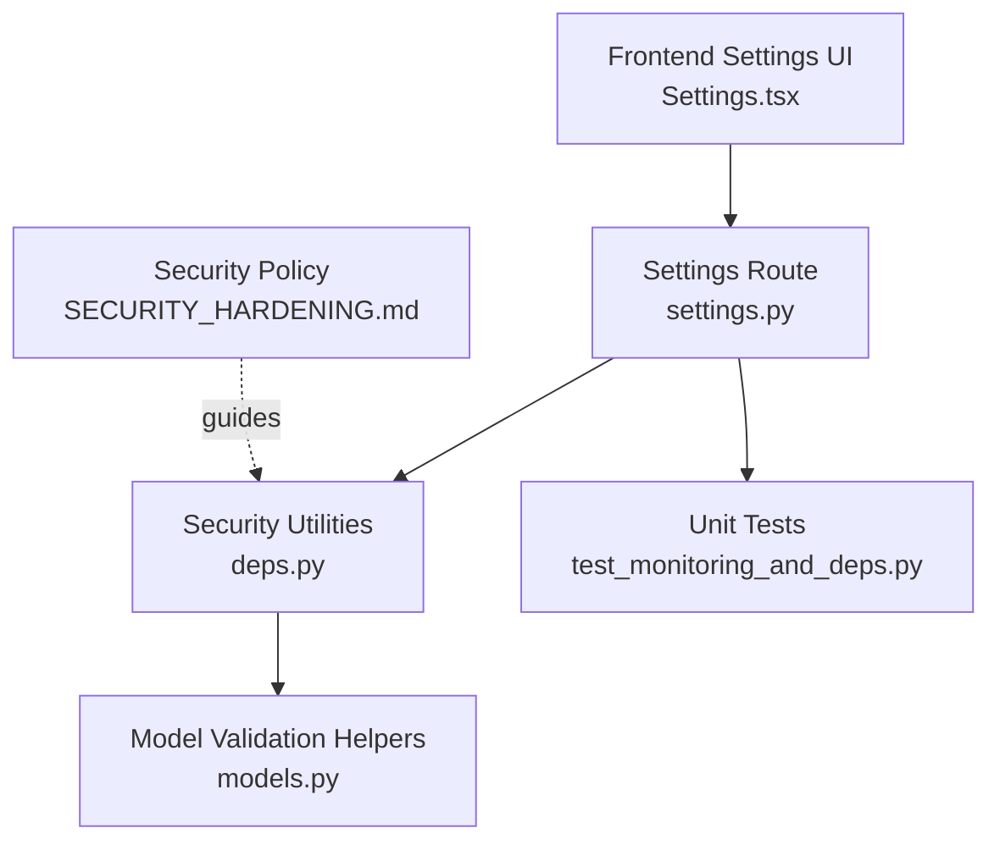
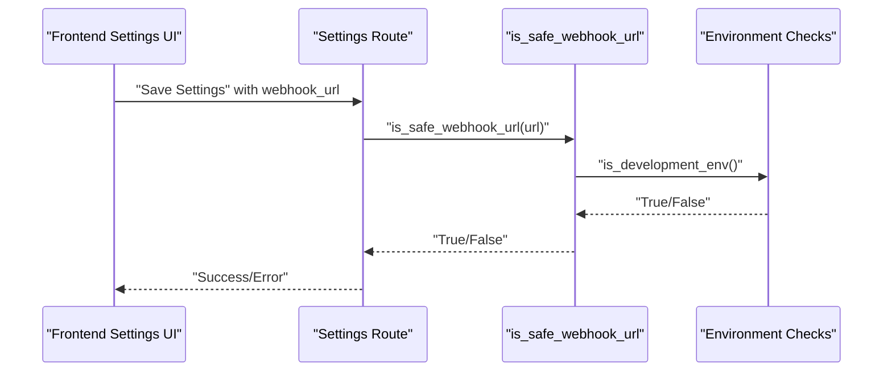
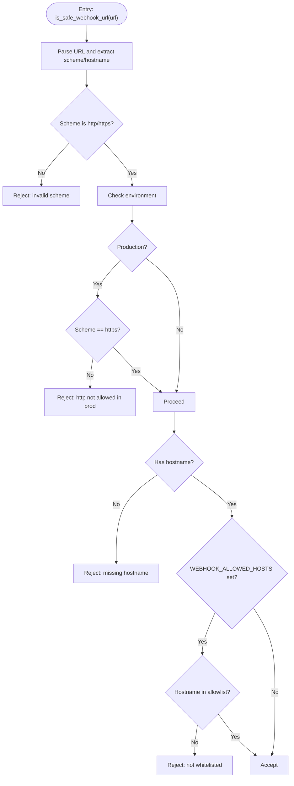
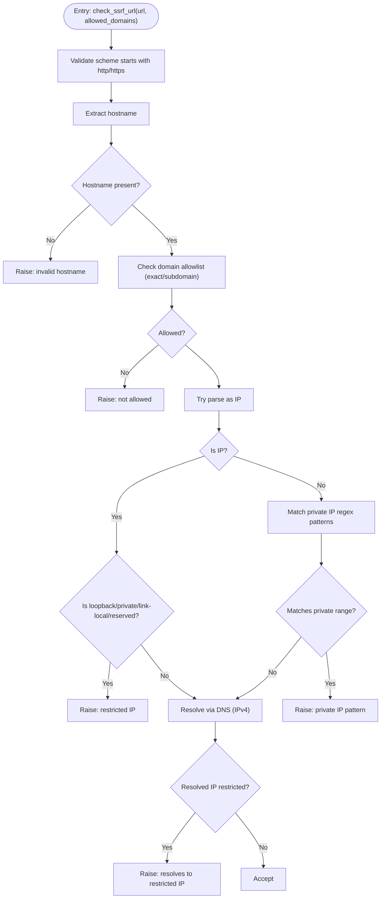
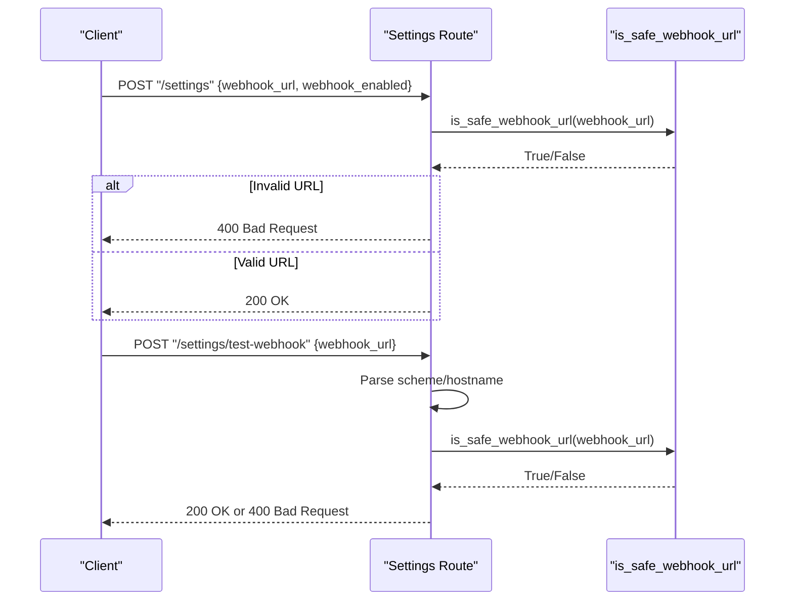
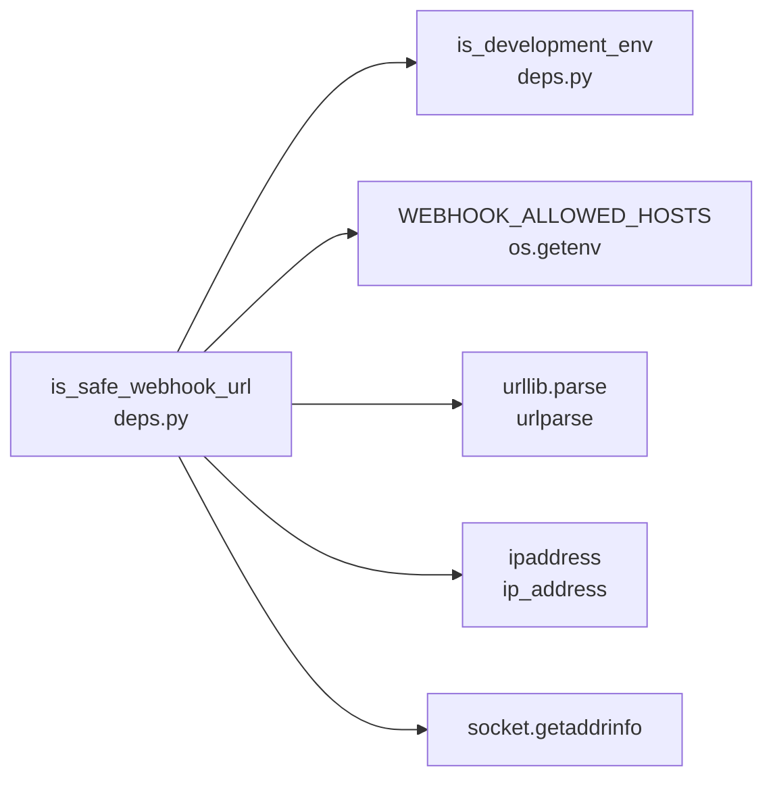

# Webhook Security and SSRF Protection

<cite>
**Referenced Files in This Document**
- [SECURITY_HARDENING.md](file://docs/SECURITY_HARDENING.md)
- [deps.py](file://cyberbullying_api/routes/deps.py)
- [models.py](file://cyberbullying_api/models.py)
- [settings.py](file://cyberbullying_api/routes/settings.py)
- [test_monitoring_and_deps.py](file://tests/test_monitoring_and_deps.py)
- [Settings.tsx](file://frontend/src/components/Settings.tsx)
</cite>

## Table of Contents
1. [Introduction](#introduction)
2. [Project Structure](#project-structure)
3. [Core Components](#core-components)
4. [Architecture Overview](#architecture-overview)
5. [Detailed Component Analysis](#detailed-component-analysis)
6. [Dependency Analysis](#dependency-analysis)
7. [Performance Considerations](#performance-considerations)
8. [Troubleshooting Guide](#troubleshooting-guide)
9. [Conclusion](#conclusion)
10. [Appendices](#appendices)

## Introduction
This document explains BullyGuard ID’s webhook security model and SSRF (Server-Side Request Forgery) protections for external integrations. It covers URL validation logic that blocks local, loopback, private, and reserved IP addresses; safe webhook URL checking via hostname allowlists; HTTPS enforcement in production; DNS resolution safety checks; and operational guidance for development versus production environments. It also documents monitoring, testing approaches, and best practices for secure webhook integration.

## Project Structure
The webhook security implementation spans backend route handlers, shared dependency utilities, model-level validation helpers, and frontend configuration UI. Tests validate the security controls under various environment configurations.

**Diagram sources**
- [Settings.tsx:500-538](file://frontend/src/components/Settings.tsx#L500-L538)
- [settings.py:53-72](file://cyberbullying_api/routes/settings.py#L53-L72)
- [deps.py:165-190](file://cyberbullying_api/routes/deps.py#L165-L190)
- [models.py:9-64](file://cyberbullying_api/models.py#L9-L64)
- [test_monitoring_and_deps.py:64-117](file://tests/test_monitoring_and_deps.py#L64-L117)
- [SECURITY_HARDENING.md:59-71](file://docs/SECURITY_HARDENING.md#L59-L71)

**Section sources**
- [settings.py:53-72](file://cyberbullying_api/routes/settings.py#L53-L72)
- [deps.py:165-190](file://cyberbullying_api/routes/deps.py#L165-L190)
- [models.py:9-64](file://cyberbullying_api/models.py#L9-L64)
- [SECURITY_HARDENING.md:59-71](file://docs/SECURITY_HARDENING.md#L59-L71)

## Core Components
- Safe webhook URL validator: Enforces scheme rules, environment-aware HTTPS policy, hostname allowlists, and IP filtering.
- Model-level SSRF checker: Provides an alternate validation path with DNS resolution and strict IP filters.
- Settings route: Integrates validation into webhook configuration persistence and testing.
- Frontend settings UI: Allows enabling/disabling webhooks and entering endpoint URLs with a “Test Webhook” action.
- Tests: Verify behavior across environments and configurations.

Key security controls:
- Scheme validation: Only http/https are accepted; production rejects http unless overridden by environment.
- Hostname allowlist: Optional WEBHOOK_ALLOWED_HOSTS restricts domains to a configured list.
- IP filtering: Blocks loopback, private, link-local, multicast, unspecified, and reserved ranges.
- DNS safety: Resolves hostnames and rejects those resolving to restricted IP spaces.
- Input sanitation: Route-level parsing and validation ensure malformed URLs are rejected early.

**Section sources**
- [deps.py:165-190](file://cyberbullying_api/routes/deps.py#L165-L190)
- [models.py:9-64](file://cyberbullying_api/models.py#L9-L64)
- [settings.py:53-72](file://cyberbullying_api/routes/settings.py#L53-L72)
- [Settings.tsx:500-538](file://frontend/src/components/Settings.tsx#L500-L538)
- [SECURITY_HARDENING.md:59-71](file://docs/SECURITY_HARDENING.md#L59-L71)

## Architecture Overview
The webhook security pipeline validates user-provided URLs before persisting settings or sending test requests. The flow enforces environment-specific policies and optional allowlists.

**Diagram sources**
- [settings.py:53-60](file://cyberbullying_api/routes/settings.py#L53-L60)
- [deps.py:165-190](file://cyberbullying_api/routes/deps.py#L165-L190)

## Detailed Component Analysis

### URL Validation System (deps.py)
The primary validator performs:
- Scheme validation: Accepts http/https; production requires https.
- Hostname extraction and allowlist enforcement via WEBHOOK_ALLOWED_HOSTS.
- Environment-aware behavior: In development, http may be permitted; in production, https is mandatory.

**Diagram sources**
- [deps.py:165-190](file://cyberbullying_api/routes/deps.py#L165-L190)

**Section sources**
- [deps.py:165-190](file://cyberbullying_api/routes/deps.py#L165-L190)

### Model-Level SSRF Checker (models.py)
A secondary validation path provides:
- Strict scheme enforcement.
- Domain allowlist verification (exact match or subdomain).
- IP address detection and blocking for loopback/private/link-local ranges.
- Regex-based private IP pattern detection.
- DNS resolution to confirm actual IP addresses and block restricted ones.

**Diagram sources**
- [models.py:9-64](file://cyberbullying_api/models.py#L9-L64)

**Section sources**
- [models.py:9-64](file://cyberbullying_api/models.py#L9-L64)

### Settings Route Integration (settings.py)
The settings route integrates validation during:
- Saving webhook configuration: Rejects invalid or blocked URLs.
- Testing webhook URL: Validates scheme and hostname, then delegates to the URL validator.

**Diagram sources**
- [settings.py:53-72](file://cyberbullying_api/routes/settings.py#L53-L72)
- [deps.py:165-190](file://cyberbullying_api/routes/deps.py#L165-L190)

**Section sources**
- [settings.py:53-72](file://cyberbullying_api/routes/settings.py#L53-L72)

### Frontend Webhook Configuration (Settings.tsx)
The frontend exposes:
- Toggle to enable/disable webhook delivery.
- Input field for the webhook endpoint URL.
- “Test Webhook” button to validate the URL against backend rules.

Operational note: The UI disables the input when the webhook is turned off and triggers validation on test.

**Section sources**
- [Settings.tsx:500-538](file://frontend/src/components/Settings.tsx#L500-L538)

## Dependency Analysis
The security logic depends on:
- Environment detection to enforce HTTPS in production.
- WEBHOOK_ALLOWED_HOSTS for allowlisted domains.
- Standard library modules for URL parsing, IP address handling, DNS resolution, and regular expressions.

**Diagram sources**
- [deps.py:165-190](file://cyberbullying_api/routes/deps.py#L165-L190)

**Section sources**
- [deps.py:165-190](file://cyberbullying_api/routes/deps.py#L165-L190)

## Performance Considerations
- DNS resolution adds latency; avoid frequent repeated tests for the same URL.
- Hostname allowlists reduce unnecessary DNS queries by short-circuiting invalid hosts.
- Prefer caching validated URLs per session to minimize repeated checks.
- Keep WEBHOOK_ALLOWED_HOSTS minimal to reduce maintenance overhead and attack surface.

## Troubleshooting Guide
Common issues and resolutions:
- Invalid scheme errors: Ensure the URL uses http or https; in production, only https is accepted.
- Missing hostname: Provide a fully qualified URL with a valid hostname.
- Not in allowlist: Set WEBHOOK_ALLOWED_HOSTS to include the target domain (and subdomains if needed).
- DNS resolution failures: Confirm the hostname resolves to a public IP; internal or restricted IPs are rejected.
- Development vs production differences: In development, http may be allowed; in production, https is enforced.

Validation and testing:
- Use the “Test Webhook” action in the frontend to validate URLs before saving.
- Run unit tests to verify behavior under different environments and configurations.

**Section sources**
- [settings.py:63-72](file://cyberbullying_api/routes/settings.py#L63-L72)
- [test_monitoring_and_deps.py:64-117](file://tests/test_monitoring_and_deps.py#L64-L117)

## Conclusion
BullyGuard ID’s webhook security model combines environment-aware scheme enforcement, optional hostname allowlists, and robust IP filtering with DNS verification. These controls collectively mitigate SSRF risks while allowing flexible configuration for legitimate integrations. Adhering to the documented practices ensures secure webhook processing and compliance with production hardening guidelines.

## Appendices

### Practical Examples
- Example webhook configuration:
  - Enable webhook delivery.
  - Enter a URL with a scheme and hostname (e.g., https://hooks.example.com/webhook).
  - Save settings; the system validates the URL before persisting.
- URL validation logic highlights:
  - Scheme must be http or https; production requires https.
  - Optional WEBHOOK_ALLOWED_HOSTS restricts domains to a comma-separated list.
  - Internal/private/reserved IPs are blocked; DNS resolution confirms actual IP ranges.
- Security testing approaches:
  - Unit tests simulate production and development environments.
  - Tests verify rejection of ftp/http in production, allowlist enforcement, and empty hostname handling.

**Section sources**
- [settings.py:53-72](file://cyberbullying_api/routes/settings.py#L53-L72)
- [test_monitoring_and_deps.py:64-117](file://tests/test_monitoring_and_deps.py#L64-L117)
- [SECURITY_HARDENING.md:59-71](file://docs/SECURITY_HARDENING.md#L59-L71)