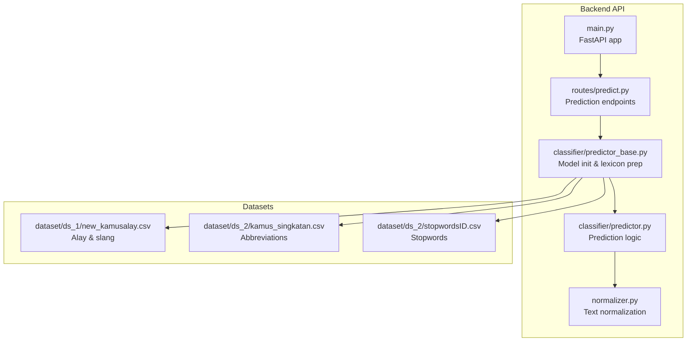
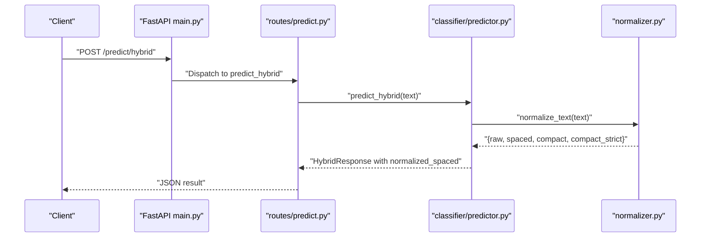
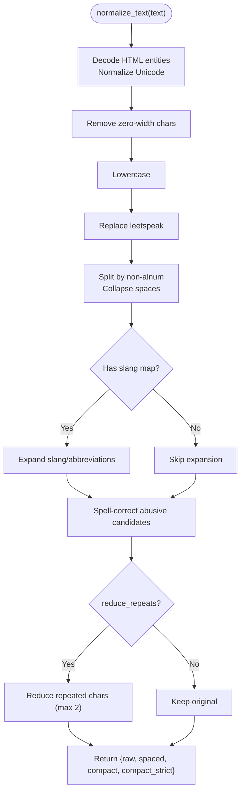
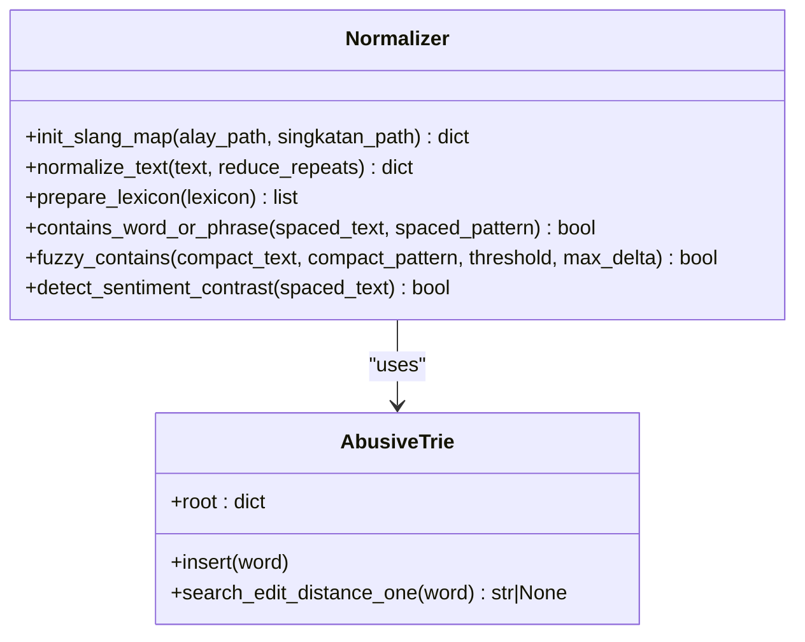
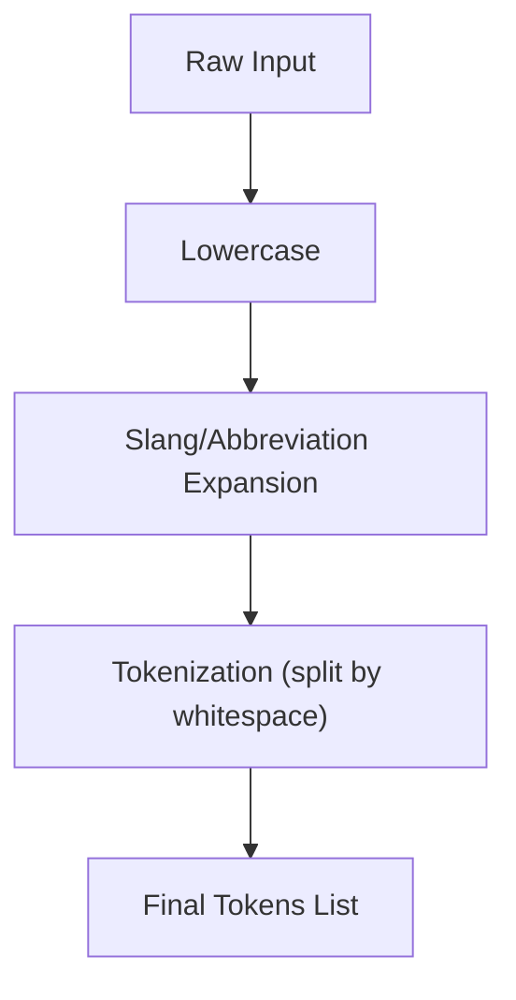
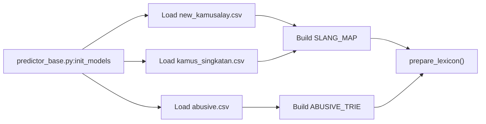

# Content Normalization and Preprocessing

<cite>
**Referenced Files in This Document**
- [normalizer.py](file://cyberbullying_api/normalizer.py)
- [predictor_base.py](file://cyberbullying_api/classifier/predictor_base.py)
- [predictor.py](file://cyberbullying_api/classifier/predictor.py)
- [predict.py](file://cyberbullying_api/routes/predict.py)
- [main.py](file://cyberbullying_api/main.py)
- [test_normalizer.py](file://tests/test_normalizer.py)
- [test_normalizer_extended.py](file://tests/test_normalizer_extended.py)
- [new_kamusalay.csv](file://dataset/ds_1/new_kamusalay.csv)
- [kamus_singkatan.csv](file://dataset/ds_2/kamus_singkatan.csv)
- [stopwordsID.csv](file://dataset/ds_2/stopwordsID.csv)
- [evaluate_thresholds.py](file://cyberbullying_api/classifier/evaluate_thresholds.py)
- [utils.ts](file://frontend/src/components/Detector/utils.ts)
</cite>

## Table of Contents
1. [Introduction](#introduction)
2. [Project Structure](#project-structure)
3. [Core Components](#core-components)
4. [Architecture Overview](#architecture-overview)
5. [Detailed Component Analysis](#detailed-component-analysis)
6. [Dependency Analysis](#dependency-analysis)
7. [Performance Considerations](#performance-considerations)
8. [Troubleshooting Guide](#troubleshooting-guide)
9. [Conclusion](#conclusion)
10. [Appendices](#appendices)

## Introduction
This document explains the content normalization and preprocessing pipeline used for Indonesian social media text in the BullyGuard ID system. It covers:
- Indonesian language normalization: slang correction, abbreviation expansion, leetspeak conversion, and repeated-character reduction
- Template-based filtering and matching: exact, compact, and fuzzy matching against a curated lexicon
- Preprocessing steps: tokenization, stemming, and special character handling
- Practical workflows, template configurations, and transformations
- Integration with external datasets for slang correction and stopword removal
- Performance optimization strategies for large-scale processing, memory management, and batch processing
- How normalized content preserves contextual integrity to improve classification accuracy

## Project Structure
The normalization pipeline is implemented in the backend Python service and integrated into the prediction workflow. Datasets are stored under the dataset directory and consumed during model initialization.

**Diagram sources**
- [main.py:156-177](file://cyberbullying_api/main.py#L156-L177)
- [predict.py:24-28](file://cyberbullying_api/routes/predict.py#L24-L28)
- [predictor_base.py:104-133](file://cyberbullying_api/classifier/predictor_base.py#L104-L133)
- [predictor.py:26-31](file://cyberbullying_api/classifier/predictor.py#L26-L31)
- [normalizer.py:132-179](file://cyberbullying_api/normalizer.py#L132-L179)
- [new_kamusalay.csv:1-20](file://dataset/ds_1/new_kamusalay.csv#L1-L20)
- [kamus_singkatan.csv:1-20](file://dataset/ds_2/kamus_singkatan.csv#L1-L20)
- [stopwordsID.csv:1-20](file://dataset/ds_2/stopwordsID.csv#L1-L20)

**Section sources**
- [main.py:156-177](file://cyberbullying_api/main.py#L156-L177)
- [predict.py:24-28](file://cyberbullying_api/routes/predict.py#L24-L28)
- [predictor_base.py:104-133](file://cyberbullying_api/classifier/predictor_base.py#L104-L133)
- [predictor.py:26-31](file://cyberbullying_api/classifier/predictor.py#L26-L31)
- [normalizer.py:132-179](file://cyberbullying_api/normalizer.py#L132-L179)

## Core Components
- Normalizer: Provides text normalization, leetspeak replacement, repeated-character reduction, and matching utilities.
- Lexicon preparation: Loads and normalizes abusive phrases and abbreviations for efficient matching.
- Prediction pipeline: Integrates normalization into lexicon, ML, and hybrid classification stages.
- Datasets: External CSV files for slang, abbreviations, and stopwords.

Key responsibilities:
- Normalize raw text to a canonical form suitable for downstream classifiers
- Expand slangs and abbreviations while preserving semantic meaning
- Reduce noise (HTML entities, zero-width characters, repeated letters)
- Support exact, compact, and fuzzy matching against a curated lexicon

**Section sources**
- [normalizer.py:132-179](file://cyberbullying_api/normalizer.py#L132-L179)
- [predictor_base.py:104-133](file://cyberbullying_api/classifier/predictor_base.py#L104-L133)
- [predictor.py:171-200](file://cyberbullying_api/classifier/predictor.py#L171-L200)

## Architecture Overview
The normalization pipeline is invoked during model initialization and prediction. The frontend can visualize normalization steps for transparency.

**Diagram sources**
- [main.py:156-177](file://cyberbullying_api/main.py#L156-L177)
- [predict.py:65-100](file://cyberbullying_api/routes/predict.py#L65-L100)
- [predictor.py:26-31](file://cyberbullying_api/classifier/predictor.py#L26-L31)
- [normalizer.py:193-234](file://cyberbullying_api/normalizer.py#L193-L234)

## Detailed Component Analysis

### Normalizer Module
The normalizer performs:
- HTML entity decoding and Unicode normalization
- Removal of zero-width and invisible characters
- Lowercasing and leetspeak-to-letter substitution
- Tokenization via non-alnum splitting and multi-space collapsing
- Slang and abbreviation expansion using global maps
- Optional repeated-character reduction (soft and strict modes)
- Fuzzy matching against abusive words using edit distance and a trie

**Diagram sources**
- [normalizer.py:193-234](file://cyberbullying_api/normalizer.py#L193-L234)
- [normalizer.py:132-179](file://cyberbullying_api/normalizer.py#L132-L179)
- [normalizer.py:212-218](file://cyberbullying_api/normalizer.py#L212-L218)

Key functions and behaviors:
- init_slang_map: Loads slang and abbreviation CSVs, merges into a single map, builds sets for formal words and abusive words, and constructs an abusive trie for fuzzy matching.
- normalize_text: Applies all normalization steps and returns multiple variants for downstream matching strategies.
- fuzzy_contains: Efficient fuzzy substring detection with length bounds and ratio thresholds.
- contains_word_or_phrase: Word-boundary-aware exact matching.
- detect_sentiment_contrast: Basic sentiment contrast detection to filter sarcasm-like content.

Practical examples:
- Leetspeak replacement: Characters like 0→o, 1→i, !→i are mapped consistently.
- Slang expansion: "m4t1" becomes "mati"; "g0bl0k" becomes "goblok".
- Repeated character reduction: "begooo" → "begoo" (soft); "hahaaaah" → "hahaah" (soft).

**Section sources**
- [normalizer.py:132-179](file://cyberbullying_api/normalizer.py#L132-L179)
- [normalizer.py:193-234](file://cyberbullying_api/normalizer.py#L193-L234)
- [normalizer.py:256-310](file://cyberbullying_api/normalizer.py#L256-L310)
- [normalizer.py:249-254](file://cyberbullying_api/normalizer.py#L249-L254)
- [normalizer.py:313-323](file://cyberbullying_api/normalizer.py#L313-L323)

### Lexicon Preparation and Matching
During initialization, the system loads:
- Slang and abbreviation maps from CSV files
- Abusive words from abusive.csv and augments the base lexicon
- Prepares normalized forms of phrases for matching

Matching strategies:
- Exact word/phrase match using word boundaries
- Compact match: normalized phrase appears as a substring in the normalized text
- Compact repeated-char match: strict repeated reduction applied before matching
- Fuzzy compact match: fuzzy containment with ratio thresholds and sliding window counting

**Diagram sources**
- [normalizer.py:17-28](file://cyberbullying_api/normalizer.py#L17-L28)
- [normalizer.py:132-179](file://cyberbullying_api/normalizer.py#L132-L179)
- [normalizer.py:236-247](file://cyberbullying_api/normalizer.py#L236-L247)
- [normalizer.py:249-254](file://cyberbullying_api/normalizer.py#L249-L254)
- [normalizer.py:256-310](file://cyberbullying_api/normalizer.py#L256-L310)

Integration points:
- predictor_base.py initializes slang maps and prepares the lexicon
- predictor.py invokes normalize_text and applies matching strategies in predict_lexicon

**Section sources**
- [predictor_base.py:104-133](file://cyberbullying_api/classifier/predictor_base.py#L104-L133)
- [predictor.py:171-200](file://cyberbullying_api/classifier/predictor.py#L171-L200)

### Frontend Normalization Visualization
The frontend reconstructs normalization steps for user transparency, showing raw input, lowercasing, slang/abbreviation expansion, and final tokens.

**Diagram sources**
- [utils.ts:23-30](file://frontend/src/components/Detector/utils.ts#L23-L30)

**Section sources**
- [utils.ts:23-30](file://frontend/src/components/Detector/utils.ts#L23-L30)

## Dependency Analysis
External datasets and their roles:
- new_kamusalay.csv: Alay and slang to formal mappings
- kamus_singkatan.csv: Abbreviations to full forms
- stopwordsID.csv: Stopwords for optional filtering in downstream steps

**Diagram sources**
- [predictor_base.py:104-133](file://cyberbullying_api/classifier/predictor_base.py#L104-L133)
- [new_kamusalay.csv:1-20](file://dataset/ds_1/new_kamusalay.csv#L1-L20)
- [kamus_singkatan.csv:1-20](file://dataset/ds_2/kamus_singkatan.csv#L1-L20)
- [normalizer.py:132-179](file://cyberbullying_api/normalizer.py#L132-L179)

**Section sources**
- [predictor_base.py:104-133](file://cyberbullying_api/classifier/predictor_base.py#L104-L133)
- [normalizer.py:132-179](file://cyberbullying_api/normalizer.py#L132-L179)

## Performance Considerations
- Memory footprint
  - Global dictionaries and sets (SLANG_MAP, ABUSIVE_WORDS_SET, FORMAL_WORDS_SET) are loaded once during initialization
  - AbusiveTrie stores abusive vocabulary for efficient fuzzy lookup
- CPU efficiency
  - Sliding window counter in fuzzy_contains reduces overhead for substring similarity checks
  - Early exits for short patterns and length bounds prevent unnecessary computation
- Concurrency and batching
  - Predictions are offloaded to threads to avoid blocking the event loop
  - Batch endpoint limits concurrent requests with a semaphore and validates input sizes
- I/O optimization
  - CSV loading failures are handled gracefully with warnings; fallbacks preserve system stability
- Tokenization and stemming
  - The pipeline focuses on normalization and exact/fuzzy matching; stemming is not applied, reducing computational overhead while maintaining robustness for Indonesian text

[No sources needed since this section provides general guidance]

## Troubleshooting Guide
Common issues and resolutions:
- Missing or unreadable dataset files
  - Symptoms: Warnings logged during initialization; baseline lexicon used
  - Resolution: Verify dataset paths and CSV formatting; ensure files exist and are readable
- Empty or invalid inputs
  - Symptoms: Unexpected empty results or errors in matching
  - Resolution: Validate input lengths and presence before invoking prediction endpoints
- Fuzzy matching false positives/negatives
  - Symptoms: Over/under-segmentation of matches
  - Resolution: Adjust thresholds and delta parameters in fuzzy_contains; review abusive trie construction
- Zero-width and invisible characters
  - Symptoms: Unexpected spacing or matching behavior
  - Resolution: Confirm zero-width character removal is active in normalization

**Section sources**
- [test_normalizer.py:1-21](file://tests/test_normalizer.py#L1-L21)
- [test_normalizer_extended.py:1-171](file://tests/test_normalizer_extended.py#L1-L171)
- [predictor_base.py:104-133](file://cyberbullying_api/classifier/predictor_base.py#L104-L133)

## Conclusion
The normalization and preprocessing pipeline ensures Indonesian social media content is standardized, noise-reduced, and semantically coherent for classification. By combining explicit mappings, fuzzy matching, and careful preprocessing, the system improves both accuracy and interpretability. Integration with external datasets and robust error handling enables reliable operation at scale.

[No sources needed since this section summarizes without analyzing specific files]

## Appendices

### Practical Examples and Workflows
- Example normalization workflow
  - Input: "m4t1 lu anj1ng"
  - Steps: HTML decode → NFKC normalize → remove zero-width → lowercase → leetspeak replacement → split and collapse spaces → expand slang/abbreviations → reduce repeated characters
  - Output variants: spaced, compact, compact_strict
- Template configuration
  - Base lexicon phrases are prepared with normalized forms for exact and compact matching
  - Fuzzy matching is enabled for longer phrases to capture typos and variations
- Content transformation process
  - During evaluation and training, texts are normalized to "spaced" form for vectorization and matching

**Section sources**
- [test_normalizer.py:13-21](file://tests/test_normalizer.py#L13-L21)
- [test_normalizer_extended.py:150-171](file://tests/test_normalizer_extended.py#L150-L171)
- [evaluate_thresholds.py:78-85](file://cyberbullying_api/classifier/evaluate_thresholds.py#L78-L85)

### Integration Notes
- Endpoint usage
  - Use /predict/lexicon, /predict/ml, /predict/transformers, /predict/ensemble, and /predict/hybrid for different classification tiers
  - Batch processing supported via /predict/batch with concurrency limits
- Frontend integration
  - The frontend displays normalization steps and final tokens to aid understanding and debugging

**Section sources**
- [predict.py:26-131](file://cyberbullying_api/routes/predict.py#L26-L131)
- [utils.ts:23-30](file://frontend/src/components/Detector/utils.ts#L23-L30)