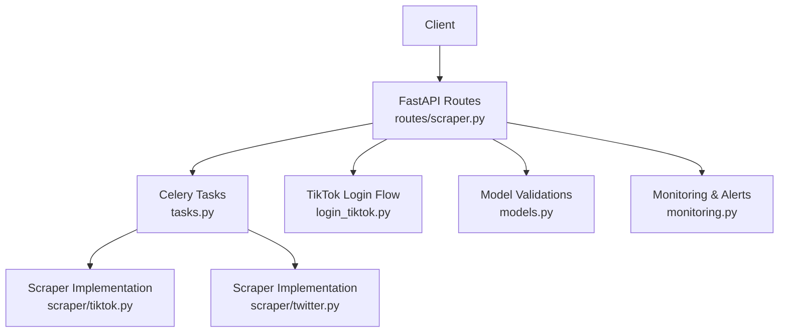
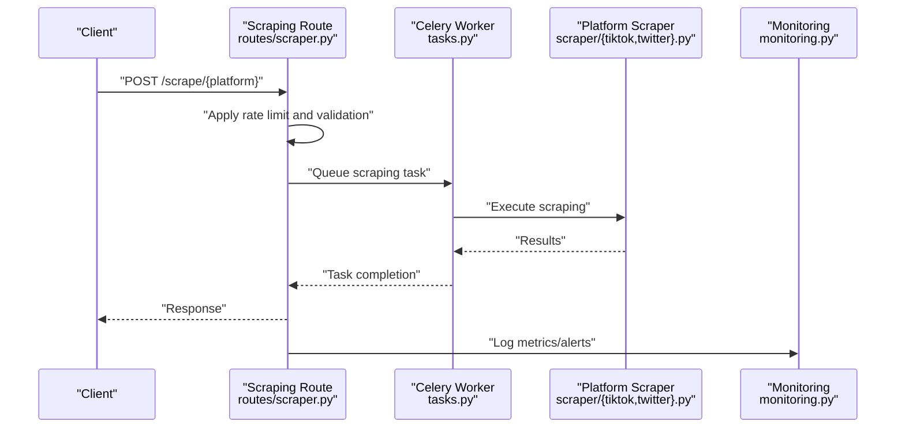
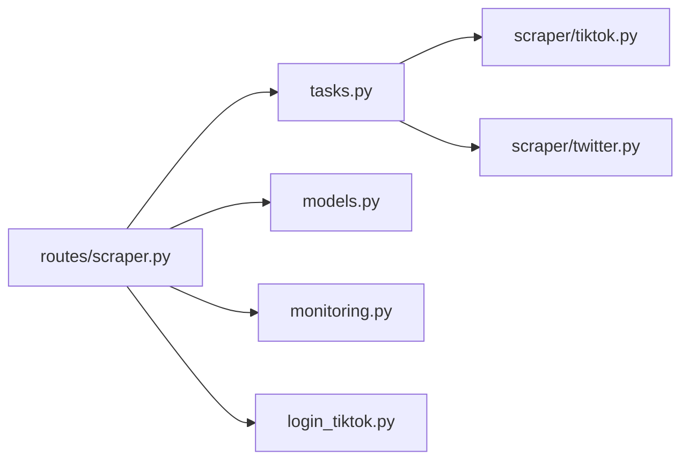

# Ethical Considerations and Compliance

<cite>
**Referenced Files in This Document**
- [routes/scraper.py](file://cyberbullying_api/routes/scraper.py)
- [routes/settings.py](file://cyberbullying_api/routes/settings.py)
- [models.py](file://cyberbullying_api/models.py)
- [login_tiktok.py](file://cyberbullying_api/login_tiktok.py)
- [tasks.py](file://cyberbullying_api/tasks.py)
- [monitoring.py](file://cyberbullying_api/monitoring.py)
- [README.md](file://cyberbullying_api/README.md)
- [SECURITY.md](file://SECURITY.md)
- [CODE_OF_CONDUCT.md](file://CODE_OF_CONDUCT.md)
- [CONTRIBUTING.md](file://CONTRIBUTING.md)
</cite>

## Table of Contents
1. [Introduction](#introduction)
2. [Project Structure](#project-structure)
3. [Core Components](#core-components)
4. [Architecture Overview](#architecture-overview)
5. [Detailed Component Analysis](#detailed-component-analysis)
6. [Dependency Analysis](#dependency-analysis)
7. [Performance Considerations](#performance-considerations)
8. [Troubleshooting Guide](#troubleshooting-guide)
9. [Conclusion](#conclusion)
10. [Appendices](#appendices)

## Introduction
This document outlines ethical considerations and compliance requirements for social media content scraping within the project’s scope. It focuses on platform-specific constraints (TikTok and X/Twitter), data privacy obligations, rate limiting, content filtering, responsible data handling, transparency, user rights, and governance processes. The guidance is grounded in the repository’s implementation artifacts and project documentation.

## Project Structure
The scraping-related functionality resides primarily under the API routes and background task orchestration, with supporting model validations and monitoring utilities. Key areas include:
- Scraping API endpoints for TikTok and X
- Background task queuing and execution
- Platform URL validation and constraints
- Monitoring and alerting hooks
- Project-wide security and conduct policies

**Diagram sources**
- [routes/scraper.py](file://cyberbullying_api/routes/scraper.py)
- [tasks.py](file://cyberbullying_api/tasks.py)
- [login_tiktok.py](file://cyberbullying_api/login_tiktok.py)
- [models.py](file://cyberbullying_api/models.py)
- [monitoring.py](file://cyberbullying_api/monitoring.py)

**Section sources**
- [routes/scraper.py](file://cyberbullying_api/routes/scraper.py)
- [tasks.py](file://cyberbullying_api/tasks.py)
- [models.py](file://cyberbullying_api/models.py)
- [login_tiktok.py](file://cyberbullying_api/login_tiktok.py)
- [monitoring.py](file://cyberbullying_api/monitoring.py)

## Core Components
- Scraping API endpoints for TikTok and X are defined in the scraping routes module. These endpoints coordinate scraping requests and integrate with background task execution.
- Platform URL validation enforces allowed domains to mitigate misuse and ensure adherence to platform boundaries.
- Monitoring utilities provide hooks for alerting and observability around scraping activities.
- The TikTok login flow demonstrates browser automation considerations relevant to ethical scraping practices.

Key implementation anchors:
- Scraping route definitions and rate-limiting dependencies
- Platform validation helpers
- Task scheduling and execution
- Monitoring hooks

**Section sources**
- [routes/scraper.py](file://cyberbullying_api/routes/scraper.py)
- [routes/settings.py](file://cyberbullying_api/routes/settings.py)
- [models.py](file://cyberbullying_api/models.py)
- [tasks.py](file://cyberbullying_api/tasks.py)
- [monitoring.py](file://cyberbullying_api/monitoring.py)
- [login_tiktok.py](file://cyberbullying_api/login_tiktok.py)

## Architecture Overview
The scraping workflow integrates API ingress, background task execution, and platform-specific scrapers. The system leverages Celery for asynchronous processing and applies rate limiting at the API boundary.

**Diagram sources**
- [routes/scraper.py](file://cyberbullying_api/routes/scraper.py)
- [tasks.py](file://cyberbullying_api/tasks.py)
- [monitoring.py](file://cyberbullying_api/monitoring.py)

## Detailed Component Analysis

### Scraping API Endpoints and Rate Limiting
- The scraping routes define endpoints for TikTok and X, applying rate-limiting dependencies to prevent abuse and reduce server strain.
- Requests are validated and queued asynchronously via Celery tasks.

Implementation highlights:
- Endpoint registration and rate-limiting dependency injection
- Asynchronous execution bridging to thread pools for blocking operations
- Task queuing and fallback execution paths

**Section sources**
- [routes/scraper.py](file://cyberbullying_api/routes/scraper.py)

### Platform Validation and Allowed Domains
- Model-level validators enforce allowed domains for TikTok and X/Twitter URLs, reducing risk of misuse and ensuring compliance with platform boundaries.
- These checks act as a first line of defense against unauthorized scraping targets.

**Section sources**
- [models.py](file://cyberbullying_api/models.py)

### Monitoring and Observability
- Monitoring utilities provide hooks for logging metrics and triggering alerts during scraping operations, enabling operational oversight and incident response.

**Section sources**
- [monitoring.py](file://cyberbullying_api/monitoring.py)

### TikTok Login Flow and Browser Automation
- The TikTok login flow demonstrates browser automation practices relevant to ethical scraping, including profile management and navigation to platform login pages.
- Such flows should be designed with minimal data exposure and explicit user consent.

**Section sources**
- [login_tiktok.py](file://cyberbullying_api/login_tiktok.py)

### Content Filtering Policies
- While specific filtering logic is not present in the referenced files, the scraping routes and platform validations establish boundaries that implicitly exclude unauthorized targets.
- Responsible filtering should be implemented upstream to avoid scraping sensitive or private content.

[No sources needed since this section provides general guidance]

### Data Privacy and Consent
- The project’s README and security documentation outline general security and privacy expectations.
- For international users, compliance with applicable privacy frameworks (such as GDPR) requires explicit consent mechanisms, transparent data collection practices, and user rights support.

**Section sources**
- [README.md](file://cyberbullying_api/README.md)
- [SECURITY.md](file://SECURITY.md)

### Transparency and User Rights
- Transparency requirements include clear disclosure of data collection practices and providing users with access and deletion capabilities.
- Reporting mechanisms for policy violations should be documented and enforced.

[No sources needed since this section provides general guidance]

### Ethical Review and Compliance Monitoring
- Establish governance processes for reviewing scraping activities, monitoring compliance, and auditing data handling.
- Integrate periodic reviews and automated alerts to maintain adherence to ethical standards.

[No sources needed since this section provides general guidance]

## Dependency Analysis
The scraping pipeline exhibits clear separation of concerns:
- API routes handle ingress, validation, and rate limiting
- Celery tasks encapsulate execution and isolation
- Platform scrapers implement platform-specific logic
- Monitoring provides observability

**Diagram sources**
- [routes/scraper.py](file://cyberbullying_api/routes/scraper.py)
- [tasks.py](file://cyberbullying_api/tasks.py)
- [models.py](file://cyberbullying_api/models.py)
- [monitoring.py](file://cyberbullying_api/monitoring.py)
- [login_tiktok.py](file://cyberbullying_api/login_tiktok.py)

**Section sources**
- [routes/scraper.py](file://cyberbullying_api/routes/scraper.py)
- [tasks.py](file://cyberbullying_api/tasks.py)
- [models.py](file://cyberbullying_api/models.py)
- [monitoring.py](file://cyberbullying_api/monitoring.py)
- [login_tiktok.py](file://cyberbullying_api/login_tiktok.py)

## Performance Considerations
- Apply rate limiting at the API boundary to prevent abuse and reduce server strain.
- Use asynchronous task execution to isolate long-running scraping operations.
- Monitor resource utilization and implement circuit breakers to protect downstream systems.

[No sources needed since this section provides general guidance]

## Troubleshooting Guide
- Validate platform URLs using domain checks to ensure compliance with allowed domains.
- Confirm Celery worker availability and task queue health.
- Review monitoring logs for scraping anomalies and trigger alerts accordingly.

**Section sources**
- [models.py](file://cyberbullying_api/models.py)
- [routes/scraper.py](file://cyberbullying_api/routes/scraper.py)
- [monitoring.py](file://cyberbullying_api/monitoring.py)

## Conclusion
The project’s scraping infrastructure incorporates foundational controls such as rate limiting, platform validation, and monitoring. To meet comprehensive ethical and compliance requirements, the team should implement explicit content filtering, data privacy safeguards, transparency disclosures, user rights mechanisms, and governance processes. These additions will strengthen responsible data handling and align with international privacy obligations.

[No sources needed since this section summarizes without analyzing specific files]

## Appendices
- Project policies and conduct documents provide a foundation for ethical behavior and security practices.

**Section sources**
- [SECURITY.md](file://SECURITY.md)
- [CODE_OF_CONDUCT.md](file://CODE_OF_CONDUCT.md)
- [CONTRIBUTING.md](file://CONTRIBUTING.md)