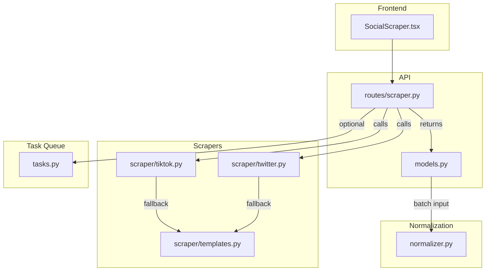
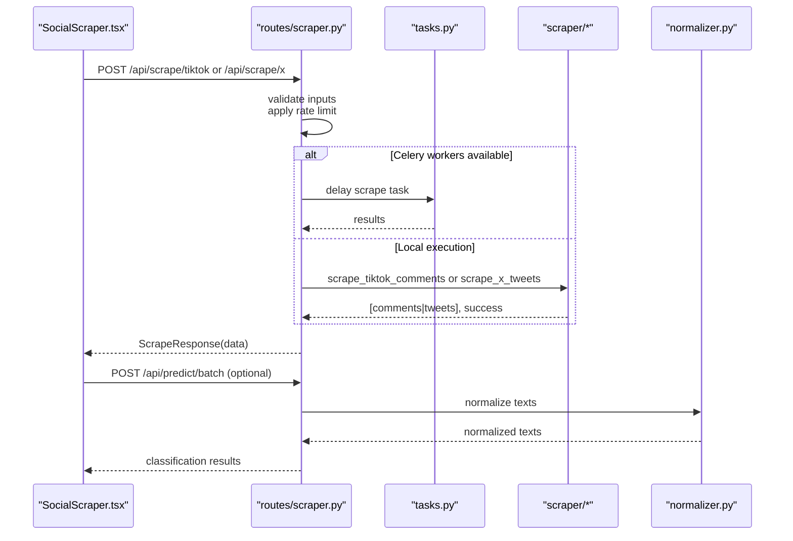
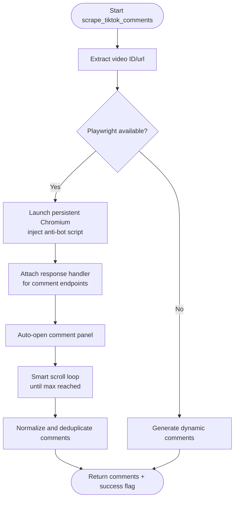
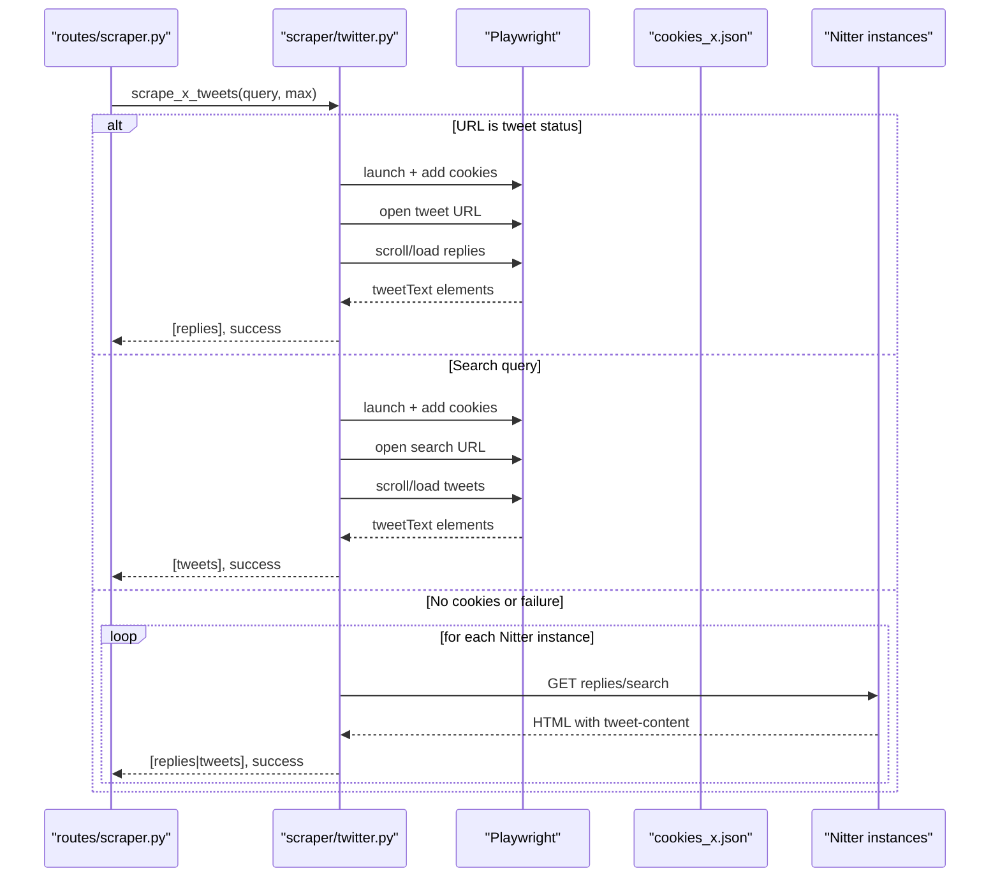
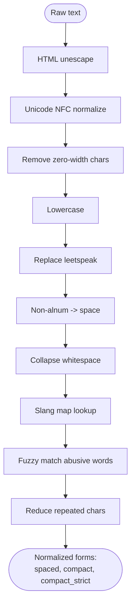
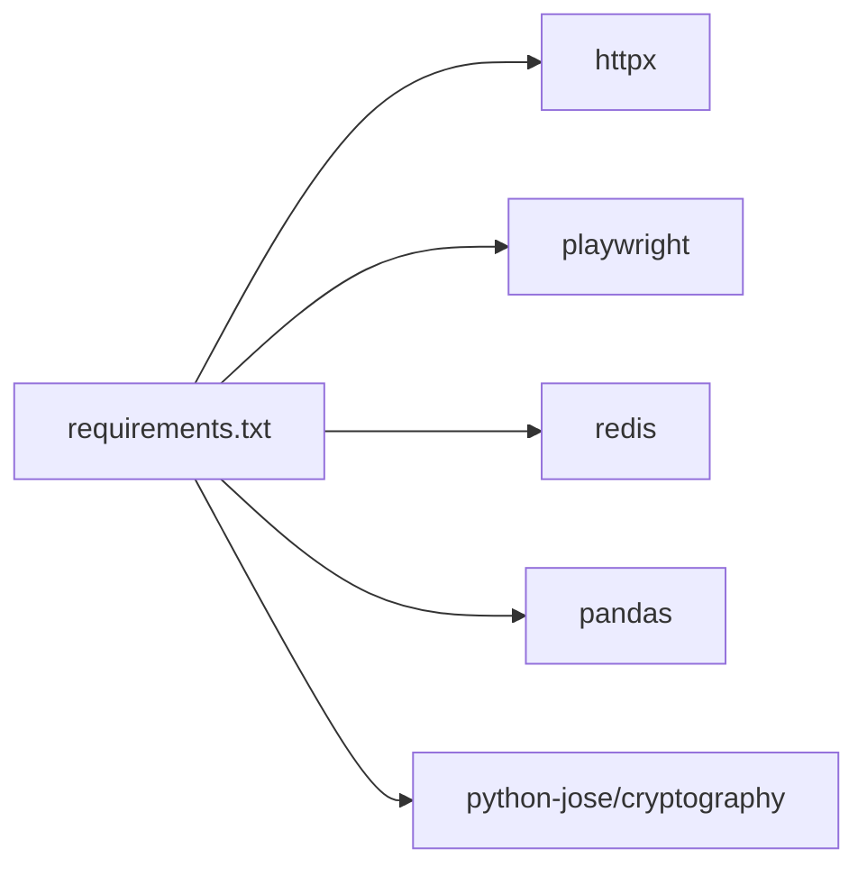

# Social Media Integration

<cite>
**Referenced Files in This Document**
- [tiktok.py](file://cyberbullying_api/scraper/tiktok.py)
- [twitter.py](file://cyberbullying_api/scraper/twitter.py)
- [templates.py](file://cyberbullying_api/scraper/templates.py)
- [normalizer.py](file://cyberbullying_api/normalizer.py)
- [scraper.py](file://cyberbullying_api/routes/scraper.py)
- [models.py](file://cyberbullying_api/models.py)
- [tasks.py](file://cyberbullying_api/tasks.py)
- [requirements.txt](file://cyberbullying_api/requirements.txt)
- [SocialScraper.tsx](file://frontend/src/components/SocialScraper.tsx)
- [test_models.py](file://tests/test_models.py)
</cite>

## Table of Contents
1. [Introduction](#introduction)
2. [Project Structure](#project-structure)
3. [Core Components](#core-components)
4. [Architecture Overview](#architecture-overview)
5. [Detailed Component Analysis](#detailed-component-analysis)
6. [Dependency Analysis](#dependency-analysis)
7. [Performance Considerations](#performance-considerations)
8. [Troubleshooting Guide](#troubleshooting-guide)
9. [Conclusion](#conclusion)
10. [Appendices](#appendices)

## Introduction
This document explains BullyGuard ID’s social media integration for content scraping and normalization. It covers:
- TikTok and X/Twitter scraping implementations
- Authentication and session handling
- Content extraction, normalization, and transformation
- Rate limiting and ethical/compliance safeguards
- Integration with the hybrid classification pipeline
- Practical workflows, error handling, and performance optimization

## Project Structure
The social media integration spans several modules:
- Scrapers: TikTok and X/Twitter
- Templates: fallback content generation
- Normalization: Indonesian language processing and text preprocessing
- API routes: scraping endpoints with rate limiting and Celery offloading
- Task queue: Celery workers for asynchronous scraping
- Frontend: social scraper UI that triggers scraping and batch prediction

**Diagram sources**
- [SocialScraper.tsx](file://frontend/src/components/SocialScraper.tsx)
- [scraper.py](file://cyberbullying_api/routes/scraper.py)
- [models.py](file://cyberbullying_api/models.py)
- [tiktok.py](file://cyberbullying_api/scraper/tiktok.py)
- [twitter.py](file://cyberbullying_api/scraper/twitter.py)
- [templates.py](file://cyberbullying_api/scraper/templates.py)
- [normalizer.py](file://cyberbullying_api/normalizer.py)
- [tasks.py](file://cyberbullying_api/tasks.py)

**Section sources**
- [scraper.py](file://cyberbullying_api/routes/scraper.py)
- [models.py](file://cyberbullying_api/models.py)
- [tiktok.py](file://cyberbullying_api/scraper/tiktok.py)
- [twitter.py](file://cyberbullying_api/scraper/twitter.py)
- [templates.py](file://cyberbullying_api/scraper/templates.py)
- [normalizer.py](file://cyberbullying_api/normalizer.py)
- [tasks.py](file://cyberbullying_api/tasks.py)
- [requirements.txt](file://cyberbullying_api/requirements.txt)
- [SocialScraper.tsx](file://frontend/src/components/SocialScraper.tsx)

## Core Components
- TikTok scraper: Extracts comments from TikTok videos using Playwright interception and falls back to dynamic templates.
- X/Twitter scraper: Uses Playwright with session cookies for authenticated scraping and Nitter instances as a fallback.
- Templates: Provides balanced, realistic synthetic comments/tweets for fallback scenarios.
- Normalizer: Loads Indonesian slang and abusive lexicons, performs leetspeak replacement, repeated character reduction, and fuzzy matching against abusive words.
- API routes: Expose scraping endpoints with rate limiting and optional Celery offloading.
- Task queue: Celery tasks for scraping to support scalability and isolation.
- Frontend: Triggers scraping and batch prediction after collecting scraped content.

**Section sources**
- [tiktok.py](file://cyberbullying_api/scraper/tiktok.py)
- [twitter.py](file://cyberbullying_api/scraper/twitter.py)
- [templates.py](file://cyberbullying_api/scraper/templates.py)
- [normalizer.py](file://cyberbullying_api/normalizer.py)
- [scraper.py](file://cyberbullying_api/routes/scraper.py)
- [tasks.py](file://cyberbullying_api/tasks.py)
- [SocialScraper.tsx](file://frontend/src/components/SocialScraper.tsx)

## Architecture Overview
The scraping pipeline integrates with the classification pipeline as follows:
- Frontend sends a scrape request to the API.
- API validates inputs, applies rate limits, and optionally dispatches a Celery task.
- Scrapers collect raw content (real-time or via fallback).
- Scraped texts are normalized and prepared for classification.
- Results feed into the hybrid prediction pipeline.

**Diagram sources**
- [SocialScraper.tsx](file://frontend/src/components/SocialScraper.tsx)
- [scraper.py](file://cyberbullying_api/routes/scraper.py)
- [tasks.py](file://cyberbullying_api/tasks.py)
- [tiktok.py](file://cyberbullying_api/scraper/tiktok.py)
- [twitter.py](file://cyberbullying_api/scraper/twitter.py)
- [normalizer.py](file://cyberbullying_api/normalizer.py)

## Detailed Component Analysis

### TikTok Integration
- URL parsing and video ID extraction
- Playwright persistent context with anti-detection measures
- Network response interception to capture comment payloads
- Recursive comment object discovery and normalization
- Smart scrolling and popup dismissal for comment panel
- Fallback to dynamic templates when real scraping fails

**Diagram sources**
- [tiktok.py](file://cyberbullying_api/scraper/tiktok.py)

**Section sources**
- [tiktok.py](file://cyberbullying_api/scraper/tiktok.py)

### X/Twitter Integration
- Playwright with session cookies for authenticated scraping
- Cookie file validation and loading
- Search and replies scraping with selector targeting
- Fallback to Nitter instances for guest scraping
- Proxy support and rate-limited retries across instances

**Diagram sources**
- [twitter.py](file://cyberbullying_api/scraper/twitter.py)
- [scraper.py](file://cyberbullying_api/routes/scraper.py)

**Section sources**
- [twitter.py](file://cyberbullying_api/scraper/twitter.py)

### Content Normalization Pipeline
- Loads Indonesian slang and abusive lexicons from datasets
- Applies leetspeak replacement and zero-width character removal
- Normalizes whitespace and reduces repeated characters
- Maps informal slangs to formal equivalents
- Performs fuzzy matching against abusive words with edit distance
- Prepares lexicon entries for efficient matching

**Diagram sources**
- [normalizer.py](file://cyberbullying_api/normalizer.py)

**Section sources**
- [normalizer.py](file://cyberbullying_api/normalizer.py)

### Scraping Templates and Fallback
- Balanced distribution across safe, praise, sarcasm, and toxic categories
- Optional username insertion to mimic real profiles
- Deterministic deduplication and shuffling

**Section sources**
- [templates.py](file://cyberbullying_api/scraper/templates.py)

### API Endpoints and Rate Limiting
- Endpoints:
  - POST /api/scrape/tiktok
  - POST /api/scrape/x
- Validation:
  - TikTok URLs restricted to tiktok.com
  - X/Twitter URLs restricted to x.com and twitter.com
- Rate limiting applied via shared dependency
- Optional Celery offloading for scraping tasks

**Section sources**
- [scraper.py](file://cyberbullying_api/routes/scraper.py)
- [models.py](file://cyberbullying_api/models.py)
- [test_models.py](file://tests/test_models.py)

### Task Queue Integration
- Celery app configured with Redis
- Tasks:
  - scrape_tiktok_task
  - scrape_x_task
- Child task limit enforced for resource control

**Section sources**
- [tasks.py](file://cyberbullying_api/tasks.py)

### Frontend Integration
- Detects platform and constructs appropriate payload
- Calls scraping endpoints and initiates batch prediction
- Handles empty results and displays feedback

**Section sources**
- [SocialScraper.tsx](file://frontend/src/components/SocialScraper.tsx)

## Dependency Analysis
External dependencies relevant to scraping and normalization:
- httpx: HTTP client for Nitter scraping
- playwright: Browser automation for real scraping
- redis: Celery broker/backend
- pandas: Loading lexicon datasets
- cryptography, python-jose: Security-related utilities

**Diagram sources**
- [requirements.txt](file://cyberbullying_api/requirements.txt)

**Section sources**
- [requirements.txt](file://cyberbullying_api/requirements.txt)

## Performance Considerations
- Real scraping vs fallback:
  - Prefer real scraping with Playwright for authenticity; fallback templates ensure availability.
- Anti-detection:
  - Persistent Chromium context and anti-bot script reduce blocking.
- Lazy loading:
  - Smart scrolling and response interception minimize unnecessary requests.
- Deduplication:
  - Dedupe by comment ID or text+username to avoid redundant processing.
- Asynchronous processing:
  - Use Celery workers to isolate heavy scraping and prevent API thread starvation.
- Resource limits:
  - Celery child task limit prevents memory leaks.
- Normalization cost:
  - Fuzzy matching bounded by length and thresholds; disable fuzzy for high-volume runs.

[No sources needed since this section provides general guidance]

## Troubleshooting Guide
Common issues and resolutions:
- Playwright not installed:
  - The scrapers gracefully fall back to template generation.
- Missing cookies for X/Twitter:
  - Scrapers require a valid cookies file; otherwise they skip authenticated paths.
- Rate limit exceeded:
  - The shared rate limiter raises 429; reduce request frequency or adjust limits.
- Domain validation failures:
  - Requests must target allowed domains; invalid domains are rejected.
- Celery worker unavailable:
  - API falls back to local scraping; ensure Redis connectivity and worker health.
- Proxy errors:
  - Nitter scraping respects proxy env; verify proxy server accessibility.

**Section sources**
- [tiktok.py](file://cyberbullying_api/scraper/tiktok.py)
- [twitter.py](file://cyberbullying_api/scraper/twitter.py)
- [scraper.py](file://cyberbullying_api/routes/scraper.py)
- [models.py](file://cyberbullying_api/models.py)
- [tasks.py](file://cyberbullying_api/tasks.py)

## Conclusion
BullyGuard ID’s social media integration combines robust scraping strategies with a resilient normalization pipeline. Real-time scraping via Playwright and Nitter instances ensures broad coverage, while fallback templates maintain system availability. The API enforces rate limits and supports Celery offloading for scalability. Normalization adapts Indonesian language nuances, enabling accurate classification downstream.

[No sources needed since this section summarizes without analyzing specific files]

## Appendices

### Platform-Specific Notes
- TikTok
  - Video ID extraction and comment panel automation
  - Response interception for comment payloads
- X/Twitter
  - Session cookies required for authenticated scraping
  - Nitter instances as fallback for guest access

**Section sources**
- [tiktok.py](file://cyberbullying_api/scraper/tiktok.py)
- [twitter.py](file://cyberbullying_api/scraper/twitter.py)

### Compliance and Ethical Considerations
- Input validation restricts URLs to approved domains.
- Rate limiting protects upstream platforms from excessive load.
- Cookie-based scraping requires explicit user consent and secure storage.
- Fallback templates avoid real data collection, minimizing privacy risks.

**Section sources**
- [models.py](file://cyberbullying_api/models.py)
- [scraper.py](file://cyberbullying_api/routes/scraper.py)
- [twitter.py](file://cyberbullying_api/scraper/twitter.py)