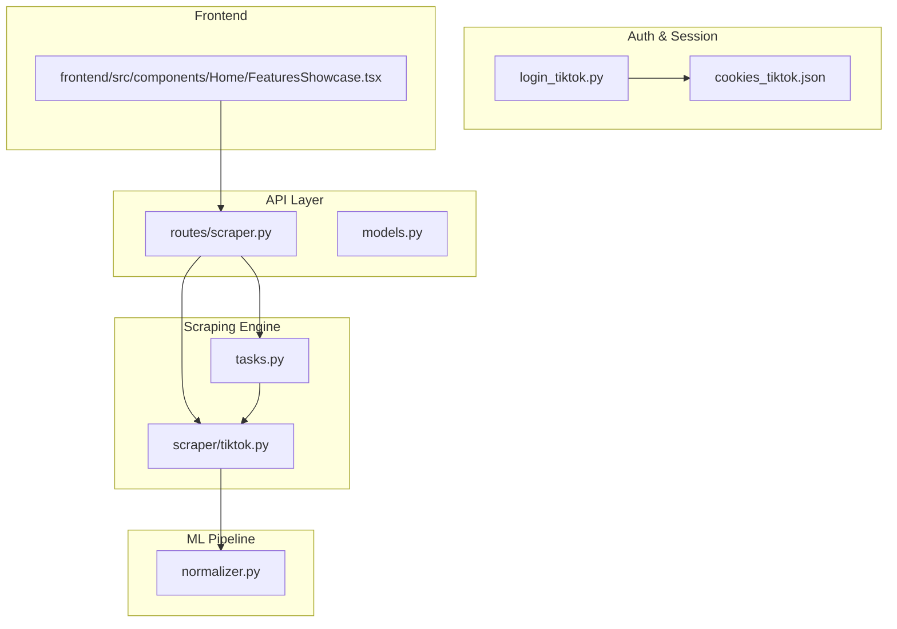
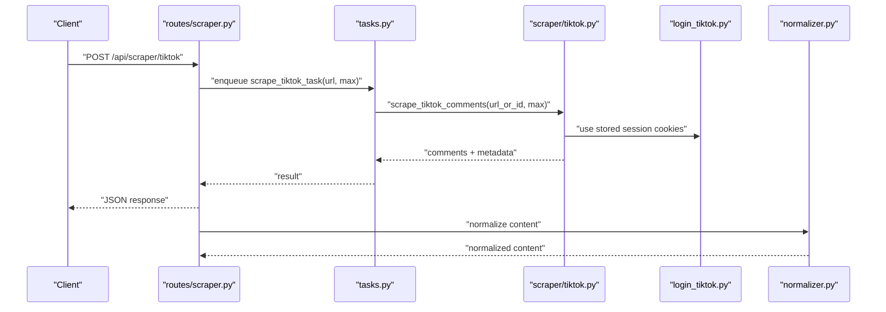
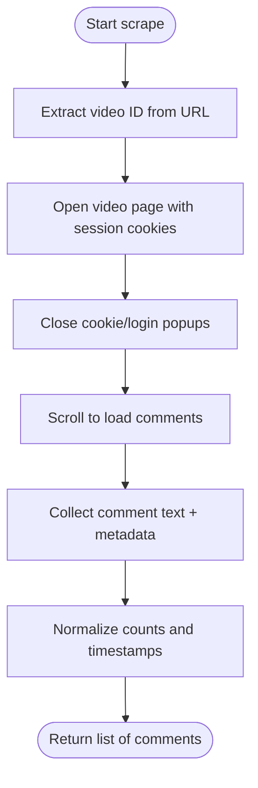
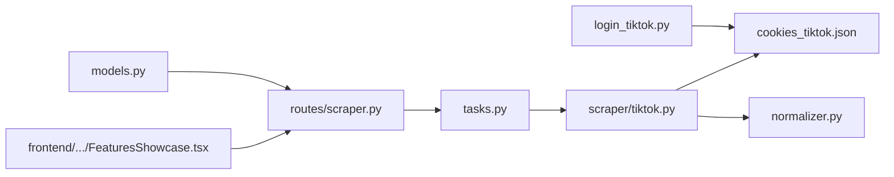

# TikTok Integration

<cite>
**Referenced Files in This Document**
- [login_tiktok.py](file://cyberbullying_api/login_tiktok.py)
- [tiktok.py](file://cyberbullying_api/scraper/tiktok.py)
- [scraper.py](file://cyberbullying_api/routes/scraper.py)
- [models.py](file://cyberbullying_api/models.py)
- [tasks.py](file://cyberbullying_api/tasks.py)
- [normalizer.py](file://cyberbullying_api/normalizer.py)
- [cookies_tiktok.json](file://cyberbullying_api/cookies_tiktok.json)
- [FeaturesShowcase.tsx](file://frontend/src/components/Home/FeaturesShowcase.tsx)
</cite>

## Table of Contents
1. [Introduction](#introduction)
2. [Project Structure](#project-structure)
3. [Core Components](#core-components)
4. [Architecture Overview](#architecture-overview)
5. [Detailed Component Analysis](#detailed-component-analysis)
6. [Dependency Analysis](#dependency-analysis)
7. [Performance Considerations](#performance-considerations)
8. [Troubleshooting Guide](#troubleshooting-guide)
9. [Conclusion](#conclusion)
10. [Appendices](#appendices)

## Introduction
This document explains the TikTok integration and content scraping implementation within the project. It covers authentication via browser automation, session management, scraping workflows for comments and metadata, rate limiting strategies, compliance considerations, error handling, performance optimization, and integration with the normalization and classification pipeline.

## Project Structure
The TikTok integration spans several modules:
- Authentication and session management: [login_tiktok.py](file://cyberbullying_api/login_tiktok.py)
- Scraping engine: [tiktok.py](file://cyberbullying_api/scraper/tiktok.py)
- API surface: [scraper.py](file://cyberbullying_api/routes/scraper.py)
- Request models: [models.py](file://cyberbullying_api/models.py)
- Background task orchestration: [tasks.py](file://cyberbullying_api/tasks.py)
- Content normalization: [normalizer.py](file://cyberbullying_api/normalizer.py)
- Frontend integration example: [FeaturesShowcase.tsx](file://frontend/src/components/Home/FeaturesShowcase.tsx)

**Diagram sources**
- [scraper.py](file://cyberbullying_api/routes/scraper.py)
- [models.py](file://cyberbullying_api/models.py)
- [tiktok.py](file://cyberbullying_api/scraper/tiktok.py)
- [tasks.py](file://cyberbullying_api/tasks.py)
- [login_tiktok.py](file://cyberbullying_api/login_tiktok.py)
- [cookies_tiktok.json](file://cyberbullying_api/cookies_tiktok.json)
- [normalizer.py](file://cyberbullying_api/normalizer.py)
- [FeaturesShowcase.tsx](file://frontend/src/components/Home/FeaturesShowcase.tsx)

**Section sources**
- [scraper.py](file://cyberbullying_api/routes/scraper.py)
- [models.py](file://cyberbullying_api/models.py)
- [tiktok.py](file://cyberbullying_api/scraper/tiktok.py)
- [tasks.py](file://cyberbullying_api/tasks.py)
- [login_tiktok.py](file://cyberbullying_api/login_tiktok.py)
- [cookies_tiktok.json](file://cyberbullying_api/cookies_tiktok.json)
- [normalizer.py](file://cyberbullying_api/normalizer.py)
- [FeaturesShowcase.tsx](file://frontend/src/components/Home/FeaturesShowcase.tsx)

## Core Components
- Authentication and session capture:
  - Manual login flow with persistent browser profiles and verification of session cookies.
  - Stores session cookies for subsequent scraping.
- Scraping engine:
  - Extracts TikTok video/comment identifiers, navigates pages, closes popups, and collects comment text and metadata.
  - Provides both Playwright-driven scraping and a higher-level entry point.
- API and request models:
  - Defines request validation for TikTok URLs and exposes scraping endpoints.
- Task orchestration:
  - Background task wrapper for scraping to support asynchronous execution.
- Normalization and classification:
  - Normalizer prepares scraped content for downstream classification.

**Section sources**
- [login_tiktok.py](file://cyberbullying_api/login_tiktok.py)
- [tiktok.py](file://cyberbullying_api/scraper/tiktok.py)
- [scraper.py](file://cyberbullying_api/routes/scraper.py)
- [models.py](file://cyberbullying_api/models.py)
- [tasks.py](file://cyberbullying_api/tasks.py)
- [normalizer.py](file://cyberbullying_api/normalizer.py)

## Architecture Overview
The TikTok scraping architecture combines a browser automation-based authentication step with a scraping pipeline that extracts comments and metadata. The API layer validates requests, triggers scraping tasks, and passes normalized content to the classification pipeline.

**Diagram sources**
- [scraper.py](file://cyberbullying_api/routes/scraper.py)
- [tasks.py](file://cyberbullying_api/tasks.py)
- [tiktok.py](file://cyberbullying_api/scraper/tiktok.py)
- [login_tiktok.py](file://cyberbullying_api/login_tiktok.py)
- [normalizer.py](file://cyberbullying_api/normalizer.py)

## Detailed Component Analysis

### Authentication and Session Management
- Persistent browser profile:
  - Launches a persistent Chromium context and injects a script to bypass automation detection.
  - Opens the TikTok login page and waits for manual login completion.
- Session verification:
  - After closing the browser, verifies presence of session cookies (e.g., session identifiers) using a headless Playwright context.
- Cookie storage:
  - Stores session cookies in a JSON file for reuse by the scraping engine.

Key behaviors:
- Manual login mode with optional Chrome path detection.
- Headless verification to confirm successful session capture.
- Profile directory isolation for sessions.

**Section sources**
- [login_tiktok.py](file://cyberbullying_api/login_tiktok.py)
- [cookies_tiktok.json](file://cyberbullying_api/cookies_tiktok.json)

### Scraping Workflow
- URL parsing:
  - Extracts TikTok video ID from a given URL.
- Comment extraction:
  - Navigates to the video page, closes common popups, scrolls to reveal comments, and collects comment text along with metadata (like count, reply count, creation time).
- Metadata normalization:
  - Normalizes counts and timestamps into a unified structure for downstream processing.

**Diagram sources**
- [tiktok.py](file://cyberbullying_api/scraper/tiktok.py)

**Section sources**
- [tiktok.py](file://cyberbullying_api/scraper/tiktok.py)

### API and Request Validation
- Request model:
  - Validates TikTok URLs and enforces URL format rules.
- Endpoint:
  - Exposes a POST endpoint to trigger scraping with configurable comment limits.

Integration points:
- Converts request payload into scraping parameters.
- Delegates execution to background tasks.

**Section sources**
- [models.py](file://cyberbullying_api/models.py)
- [scraper.py](file://cyberbullying_api/routes/scraper.py)

### Task Orchestration
- Background task wrapper:
  - Wraps the scraping function to enable asynchronous execution and queue-based scheduling.
- Execution:
  - Invoked by the API route to perform scraping off the main request thread.

**Section sources**
- [tasks.py](file://cyberbullying_api/tasks.py)
- [scraper.py](file://cyberbullying_api/routes/scraper.py)

### Normalization and Classification Pipeline
- Normalization:
  - Prepares scraped content for downstream classification by cleaning and structuring text and metadata.
- Classification:
  - The normalized content is fed into the classifier module for predictive analysis.

**Section sources**
- [normalizer.py](file://cyberbullying_api/normalizer.py)

### Frontend Integration Example
- The frontend demonstrates how to configure the FastAPI server URL and pass TikTok session cookies to the backend.
- This supports automated scraping flows where the frontend provides environment-specific configuration.

**Section sources**
- [FeaturesShowcase.tsx](file://frontend/src/components/Home/FeaturesShowcase.tsx)

## Dependency Analysis
The scraping pipeline depends on:
- Browser automation for authentication and session persistence.
- Scraping utilities for page navigation, popup handling, and data extraction.
- API routes and task orchestration for request handling and background execution.
- Normalization for preparing content for classification.

**Diagram sources**
- [login_tiktok.py](file://cyberbullying_api/login_tiktok.py)
- [cookies_tiktok.json](file://cyberbullying_api/cookies_tiktok.json)
- [tiktok.py](file://cyberbullying_api/scraper/tiktok.py)
- [normalizer.py](file://cyberbullying_api/normalizer.py)
- [scraper.py](file://cyberbullying_api/routes/scraper.py)
- [tasks.py](file://cyberbullying_api/tasks.py)
- [models.py](file://cyberbullying_api/models.py)
- [FeaturesShowcase.tsx](file://frontend/src/components/Home/FeaturesShowcase.tsx)

**Section sources**
- [login_tiktok.py](file://cyberbullying_api/login_tiktok.py)
- [tiktok.py](file://cyberbullying_api/scraper/tiktok.py)
- [scraper.py](file://cyberbullying_api/routes/scraper.py)
- [models.py](file://cyberbullying_api/models.py)
- [tasks.py](file://cyberbullying_api/tasks.py)
- [normalizer.py](file://cyberbullying_api/normalizer.py)
- [cookies_tiktok.json](file://cyberbullying_api/cookies_tiktok.json)
- [FeaturesShowcase.tsx](file://frontend/src/components/Home/FeaturesShowcase.tsx)

## Performance Considerations
- Concurrency and batching:
  - Use background tasks to parallelize scraping across multiple URLs.
  - Batch requests to reduce overhead and improve throughput.
- Rate limiting and throttling:
  - Introduce delays between requests and limit concurrent sessions to avoid detection and IP bans.
  - Respect robots.txt and platform policies; implement exponential backoff on errors.
- Resource management:
  - Reuse persistent browser contexts and sessions to minimize startup costs.
  - Limit comment retrieval depth to balance quality vs. performance.
- Network resilience:
  - Retry transient failures; handle timeouts gracefully.
  - Monitor session validity and refresh as needed.

[No sources needed since this section provides general guidance]

## Troubleshooting Guide
Common issues and resolutions:
- Login failures:
  - Ensure manual login completes successfully and session cookies are detected after closing the browser.
  - Verify the persistent profile directory exists and is writable.
- Session not detected:
  - Confirm the presence of session cookies in the stored cookie file.
  - Re-run the authentication flow if cookies are missing.
- Scraping stalls:
  - Check for CAPTCHA or login prompts; resolve them manually or adjust automation bypass.
  - Increase timeout values for page loads and element visibility checks.
- Content not extracted:
  - Validate the TikTok URL format and ensure the video is publicly accessible.
  - Adjust comment scroll thresholds and retry extraction.
- API errors:
  - Inspect request validation errors and ensure the URL conforms to expected patterns.
  - Review task queue logs for exceptions during scraping.

**Section sources**
- [login_tiktok.py](file://cyberbullying_api/login_tiktok.py)
- [tiktok.py](file://cyberbullying_api/scraper/tiktok.py)
- [scraper.py](file://cyberbullying_api/routes/scraper.py)
- [models.py](file://cyberbullying_api/models.py)

## Conclusion
The TikTok integration leverages browser automation for robust authentication and a resilient scraping pipeline for extracting comments and metadata. By combining persistent sessions, background task orchestration, and normalization, the system supports scalable content ingestion aligned with compliance and performance best practices.

[No sources needed since this section summarizes without analyzing specific files]

## Appendices

### Practical Examples and Configurations
- Authentication tokens and session cookies:
  - Store session cookies in the designated cookie file for automated scraping.
  - Reference the frontend example for configuring the FastAPI server URL and session cookie injection.
- Content filtering:
  - Use the scraping endpoint with a comment limit parameter to control volume.
  - Apply post-processing filters in the normalization stage to refine content.

**Section sources**
- [cookies_tiktok.json](file://cyberbullying_api/cookies_tiktok.json)
- [FeaturesShowcase.tsx](file://frontend/src/components/Home/FeaturesShowcase.tsx)
- [models.py](file://cyberbullying_api/models.py)
- [scraper.py](file://cyberbullying_api/routes/scraper.py)

### Compliance and Terms of Service
- Adhere to TikTok’s terms of service and applicable laws.
- Avoid scraping private or restricted content.
- Implement reasonable rate limits and respect platform policies to prevent account restrictions or IP bans.

[No sources needed since this section provides general guidance]