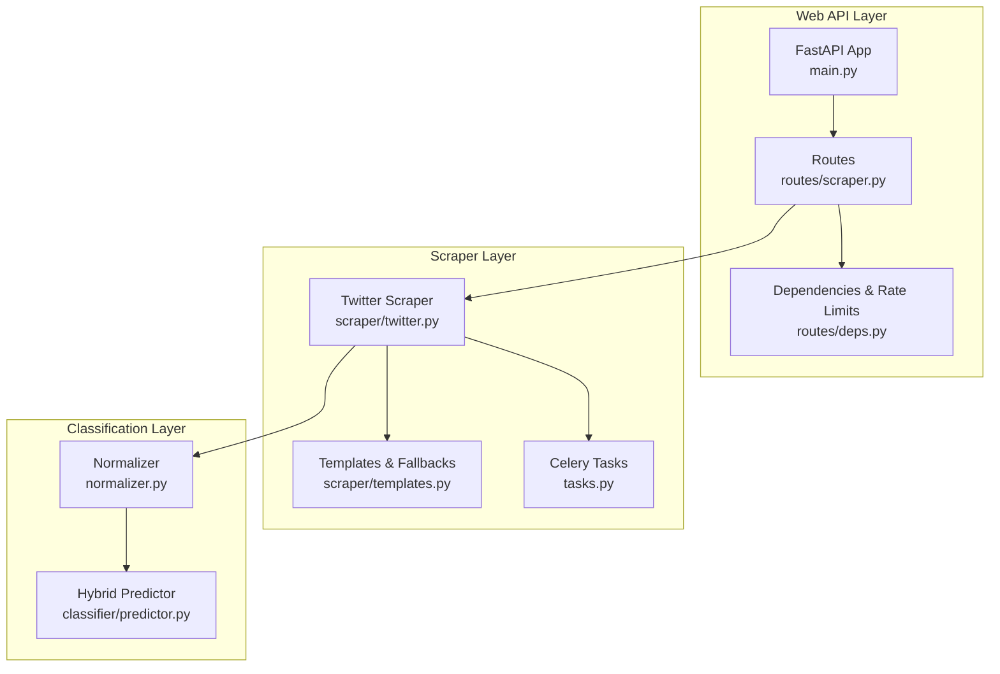
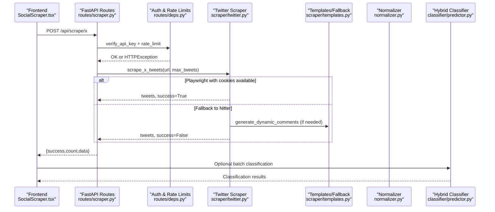
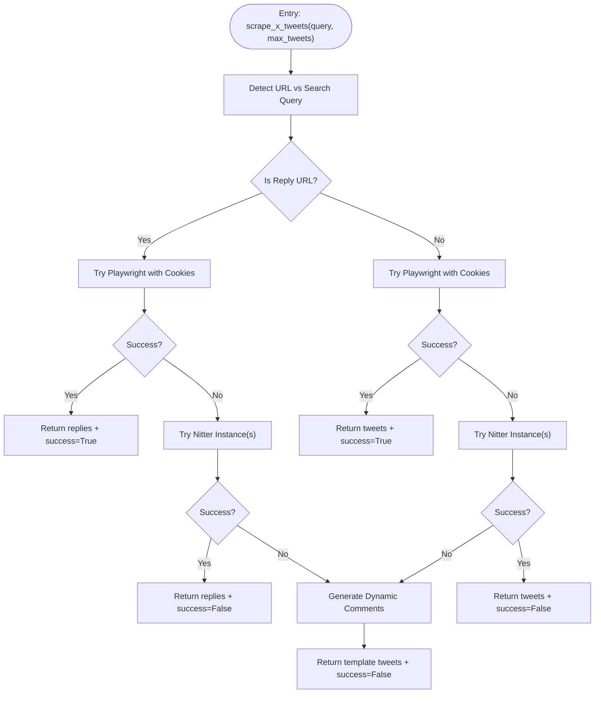
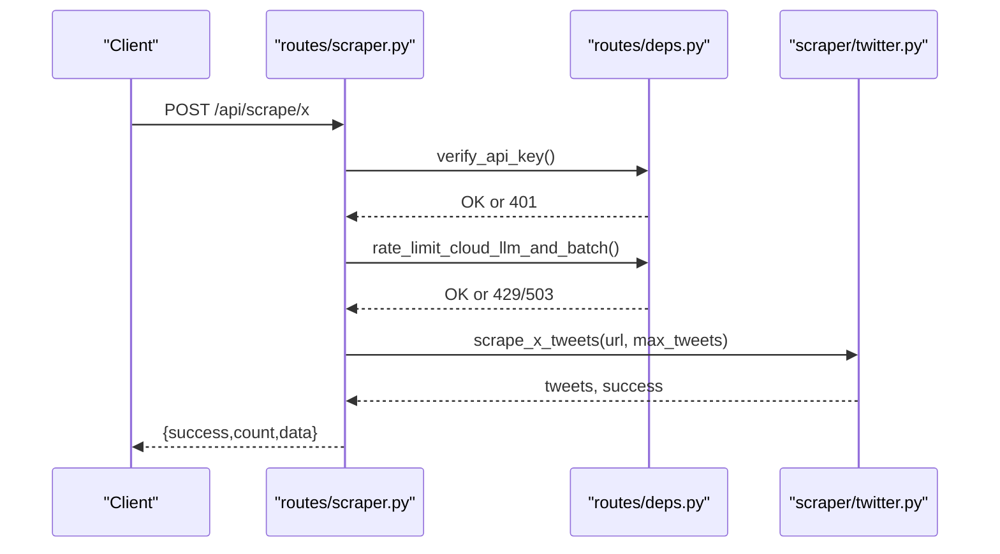
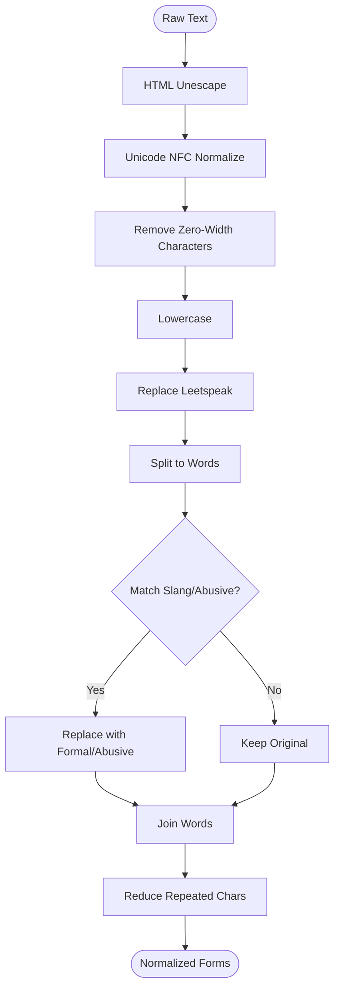
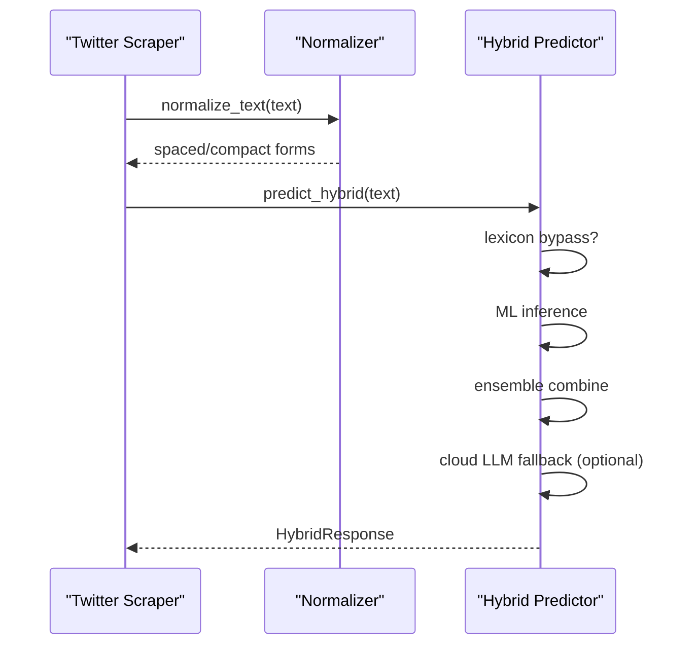
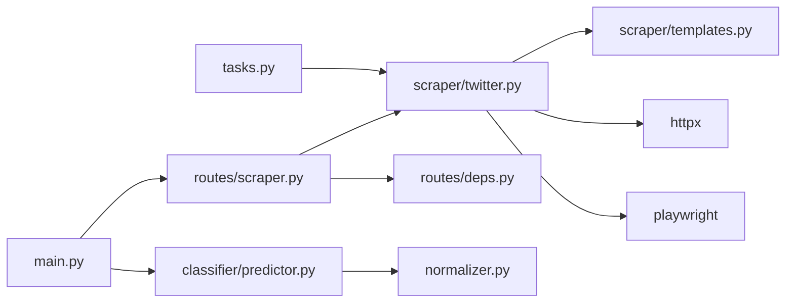

# Twitter Integration

<cite>
**Referenced Files in This Document**
- [twitter.py](file://cyberbullying_api/scraper/twitter.py)
- [templates.py](file://cyberbullying_api/scraper/templates.py)
- [scraper.py](file://cyberbullying_api/routes/scraper.py)
- [models.py](file://cyberbullying_api/models.py)
- [deps.py](file://cyberbullying_api/routes/deps.py)
- [normalizer.py](file://cyberbullying_api/normalizer.py)
- [predictor.py](file://cyberbullying_api/classifier/predictor.py)
- [main.py](file://cyberbullying_api/main.py)
- [tasks.py](file://cyberbullying_api/tasks.py)
- [SocialScraper.tsx](file://frontend/src/components/SocialScraper.tsx)
</cite>

## Table of Contents
1. [Introduction](#introduction)
2. [Project Structure](#project-structure)
3. [Core Components](#core-components)
4. [Architecture Overview](#architecture-overview)
5. [Detailed Component Analysis](#detailed-component-analysis)
6. [Dependency Analysis](#dependency-analysis)
7. [Performance Considerations](#performance-considerations)
8. [Troubleshooting Guide](#troubleshooting-guide)
9. [Conclusion](#conclusion)
10. [Appendices](#appendices)

## Introduction
This document explains the Twitter/X integration and content extraction system. It covers:
- Authentication and rate limiting strategies
- Tweet scraping workflows (search queries, user timelines, replies)
- Content filtering and normalization for Indonesian language processing
- End-to-end flow from scraping to classification
- Practical examples of requests, responses, and transformations
- Error handling and operational safeguards
- Ethical and compliance considerations

## Project Structure
The Twitter integration spans three layers:
- Web API layer: FastAPI routes expose scraping endpoints
- Scraper layer: Asynchronous scraping logic for X/Twitter and fallbacks
- Classification layer: Normalization and multi-tier classification

**Diagram sources**
- [main.py:158-271](file://cyberbullying_api/main.py#L158-L271)
- [scraper.py:22-102](file://cyberbullying_api/routes/scraper.py#L22-L102)
- [deps.py:110-162](file://cyberbullying_api/routes/deps.py#L110-L162)
- [twitter.py:25-221](file://cyberbullying_api/scraper/twitter.py#L25-L221)
- [templates.py:1-96](file://cyberbullying_api/scraper/templates.py#L1-L96)
- [tasks.py:18-95](file://cyberbullying_api/tasks.py#L18-L95)
- [normalizer.py:193-234](file://cyberbullying_api/normalizer.py#L193-L234)
- [predictor.py:308-439](file://cyberbullying_api/classifier/predictor.py#L308-L439)

**Section sources**
- [main.py:158-271](file://cyberbullying_api/main.py#L158-L271)
- [scraper.py:22-102](file://cyberbullying_api/routes/scraper.py#L22-L102)
- [twitter.py:25-221](file://cyberbullying_api/scraper/twitter.py#L25-L221)

## Core Components
- Twitter/X scraper: Supports Playwright-based real scraping with session cookies and fallbacks to public Nitter instances and dynamic templates
- API endpoints: Expose scraping for TikTok and X/Twitter with rate limits and authentication
- Normalization: Indonesian text normalization, slang correction, and abusive word detection
- Hybrid classifier: Multi-tier classification pipeline integrating lexicon, ML, Transformers, and optional cloud LLM

Key implementation references:
- Twitter scraping and fallbacks: [twitter.py:25-221](file://cyberbullying_api/scraper/twitter.py#L25-L221)
- API scraping endpoints: [scraper.py:65-102](file://cyberbullying_api/routes/scraper.py#L65-L102)
- Rate limiting and auth: [deps.py:56-89](file://cyberbullying_api/routes/deps.py#L56-L89), [deps.py:110-162](file://cyberbullying_api/routes/deps.py#L110-L162)
- Normalization and lexicon: [normalizer.py:132-234](file://cyberbullying_api/normalizer.py#L132-L234)
- Hybrid prediction pipeline: [predictor.py:308-439](file://cyberbullying_api/classifier/predictor.py#L308-L439)

**Section sources**
- [twitter.py:25-221](file://cyberbullying_api/scraper/twitter.py#L25-L221)
- [scraper.py:65-102](file://cyberbullying_api/routes/scraper.py#L65-L102)
- [deps.py:56-89](file://cyberbullying_api/routes/deps.py#L56-L89)
- [deps.py:110-162](file://cyberbullying_api/routes/deps.py#L110-L162)
- [normalizer.py:132-234](file://cyberbullying_api/normalizer.py#L132-L234)
- [predictor.py:308-439](file://cyberbullying_api/classifier/predictor.py#L308-L439)

## Architecture Overview
High-level flow:
- Frontend triggers scraping via API
- API validates credentials and applies rate limits
- Scraper runs Playwright with cookies for real-time scraping or falls back to Nitter instances or dynamic templates
- Scraped content passes through normalization and classification

**Diagram sources**
- [SocialScraper.tsx:71-103](file://frontend/src/components/SocialScraper.tsx#L71-L103)
- [scraper.py:65-102](file://cyberbullying_api/routes/scraper.py#L65-L102)
- [deps.py:56-89](file://cyberbullying_api/routes/deps.py#L56-L89)
- [deps.py:110-162](file://cyberbullying_api/routes/deps.py#L110-L162)
- [twitter.py:25-221](file://cyberbullying_api/scraper/twitter.py#L25-L221)
- [templates.py:65-96](file://cyberbullying_api/scraper/templates.py#L65-L96)
- [predictor.py:308-439](file://cyberbullying_api/classifier/predictor.py#L308-L439)

## Detailed Component Analysis

### Twitter/X Scraper
- Real scraping:
  - Uses Playwright with Chromium to navigate X search and reply pages
  - Requires session cookies stored in a JSON file
  - Scrolls to load content and extracts tweet text from DOM nodes
- Fallbacks:
  - Nitter public instances for guest scraping
  - Dynamic template generation for safe simulation
- Reply extraction:
  - Detects tweet URLs and skips the original tweet to collect replies

**Diagram sources**
- [twitter.py:136-221](file://cyberbullying_api/scraper/twitter.py#L136-L221)
- [twitter.py:25-133](file://cyberbullying_api/scraper/twitter.py#L25-L133)
- [templates.py:65-96](file://cyberbullying_api/scraper/templates.py#L65-L96)

**Section sources**
- [twitter.py:25-221](file://cyberbullying_api/scraper/twitter.py#L25-L221)
- [templates.py:1-96](file://cyberbullying_api/scraper/templates.py#L1-L96)

### API Endpoints and Rate Limiting
- Endpoints:
  - POST /api/scrape/x: Returns scraped tweets
  - POST /api/scrape/tiktok: Returns scraped comments
- Authentication:
  - X-API-Key header validated with constant-time comparison
  - OAuth2 bearer token supported for admin scope
- Rate limiting:
  - Redis-backed sliding-window limiter
  - Configurable limits and fail-open/fail-close behavior

**Diagram sources**
- [scraper.py:65-102](file://cyberbullying_api/routes/scraper.py#L65-L102)
- [deps.py:56-89](file://cyberbullying_api/routes/deps.py#L56-L89)
- [deps.py:110-162](file://cyberbullying_api/routes/deps.py#L110-L162)
- [twitter.py:136-221](file://cyberbullying_api/scraper/twitter.py#L136-L221)

**Section sources**
- [scraper.py:65-102](file://cyberbullying_api/routes/scraper.py#L65-L102)
- [deps.py:56-89](file://cyberbullying_api/routes/deps.py#L56-L89)
- [deps.py:110-162](file://cyberbullying_api/routes/deps.py#L110-L162)

### Normalization and Indonesian Language Processing
- Loads slang and abusive lexicons from datasets
- Applies Unicode normalization, zero-width character removal, leetspeak replacement, repeated character reduction
- Maps informal Indonesian slang to formal equivalents and detects near-matches to abusive words
- Prepares phrases for classification with normalized forms

**Diagram sources**
- [normalizer.py:193-234](file://cyberbullying_api/normalizer.py#L193-L234)
- [normalizer.py:132-179](file://cyberbullying_api/normalizer.py#L132-L179)

**Section sources**
- [normalizer.py:132-234](file://cyberbullying_api/normalizer.py#L132-L234)

### Hybrid Classification Pipeline
- Bypass checks:
  - Sentiment contrast detection to route ambiguous sarcasm to cloud LLM tier
- Tier progression:
  - Tier 1: Lexicon + ML (TF-IDF + Logistic Regression)
  - Tier 2: Ensemble (ML + Transformer)
  - Tier 3: Cloud LLM (Gemini) with streaming support
- Normalization integrated at each stage via shared functions

**Diagram sources**
- [predictor.py:308-439](file://cyberbullying_api/classifier/predictor.py#L308-L439)
- [normalizer.py:193-234](file://cyberbullying_api/normalizer.py#L193-L234)

**Section sources**
- [predictor.py:308-439](file://cyberbullying_api/classifier/predictor.py#L308-L439)
- [normalizer.py:193-234](file://cyberbullying_api/normalizer.py#L193-L234)

## Dependency Analysis
- External libraries:
  - httpx for asynchronous HTTP requests
  - playwright for browser automation
  - redis/celery for background tasks and training orchestration
- Internal dependencies:
  - Scraper depends on templates for fallbacks
  - API routes depend on dependencies for auth and rate limiting
  - Classifier depends on normalizer for preprocessing

**Diagram sources**
- [twitter.py:19-17](file://cyberbullying_api/scraper/twitter.py#L19-L17)
- [scraper.py:22-22](file://cyberbullying_api/routes/scraper.py#L22-L22)
- [deps.py:110-110](file://cyberbullying_api/routes/deps.py#L110-L110)
- [predictor.py:20-25](file://cyberbullying_api/classifier/predictor.py#L20-L25)
- [main.py:158-158](file://cyberbullying_api/main.py#L158-L158)
- [tasks.py:18-19](file://cyberbullying_api/tasks.py#L18-L19)

**Section sources**
- [twitter.py:19-17](file://cyberbullying_api/scraper/twitter.py#L19-L17)
- [scraper.py:22-22](file://cyberbullying_api/routes/scraper.py#L22-L22)
- [deps.py:110-110](file://cyberbullying_api/routes/deps.py#L110-L110)
- [predictor.py:20-25](file://cyberbullying_api/classifier/predictor.py#L20-L25)
- [main.py:158-158](file://cyberbullying_api/main.py#L158-L158)
- [tasks.py:18-19](file://cyberbullying_api/tasks.py#L18-L19)

## Performance Considerations
- Asynchronous scraping reduces blocking and improves throughput
- Short timeouts and retries for Nitter fallbacks minimize latency
- Sliding-window rate limiting prevents abuse while allowing bursts
- Normalization is optimized with precomputed structures (trie, sets) for efficient lookups
- Streaming hybrid classification enables progressive feedback for complex cases

[No sources needed since this section provides general guidance]

## Troubleshooting Guide
Common issues and resolutions:
- Authentication failures:
  - Ensure X-API-Key header matches configured API key
  - Verify OAuth2 token scopes include admin when required
- Rate limit exceeded:
  - Reduce request frequency or increase limits via environment variables
  - Enable fail-open only in development
- Playwright not installed:
  - Install playwright and browsers; scraper logs a warning and falls back
- Missing cookies:
  - Add cookies file for session-based scraping
- Nitter instance errors:
  - Instances may be slow or blocked; scraper tries multiple instances and falls back to templates
- Cloud LLM unconfigured:
  - If API key missing, hybrid predictor falls back to ensemble

**Section sources**
- [deps.py:56-89](file://cyberbullying_api/routes/deps.py#L56-L89)
- [deps.py:110-162](file://cyberbullying_api/routes/deps.py#L110-L162)
- [twitter.py:25-77](file://cyberbullying_api/scraper/twitter.py#L25-L77)
- [twitter.py:161-221](file://cyberbullying_api/scraper/twitter.py#L161-L221)
- [predictor.py:320-336](file://cyberbullying_api/classifier/predictor.py#L320-L336)

## Conclusion
The Twitter/X integration provides robust, multi-modal scraping with strong fallbacks and integrates seamlessly with the normalization and hybrid classification pipeline. It balances performance, reliability, and compliance through authentication, rate limiting, and ethical scraping practices.

[No sources needed since this section summarizes without analyzing specific files]

## Appendices

### Practical Examples

- Example request to scrape replies to a tweet:
  - Endpoint: POST /api/scrape/x
  - Headers: Content-Type: application/json, X-API-Key: YOUR_KEY
  - Body: {"url": "https://x.com/username/status/NNNN", "max_tweets": 20}

- Example request to scrape search results:
  - Endpoint: POST /api/scrape/x
  - Body: {"url": "your search query", "max_tweets": 20}

- Example response:
  - { "success": true, "count": N, "data": ["tweet text 1", ...] }

- Example batch classification after scraping:
  - POST /predict/batch with {"texts": [...]} returns per-text classifications

**Section sources**
- [scraper.py:65-102](file://cyberbullying_api/routes/scraper.py#L65-L102)
- [models.py:181-195](file://cyberbullying_api/models.py#L181-L195)
- [SocialScraper.tsx:71-103](file://frontend/src/components/SocialScraper.tsx#L71-L103)

### Ethical and Compliance Considerations
- Respect rate limits and terms of service of third-party instances
- Prefer authenticated scraping with session cookies when available
- Avoid scraping protected or sensitive content
- Comply with data privacy regulations; avoid storing personal data unnecessarily
- Adhere to Twitter/X developer policies and platform-specific restrictions

[No sources needed since this section provides general guidance]