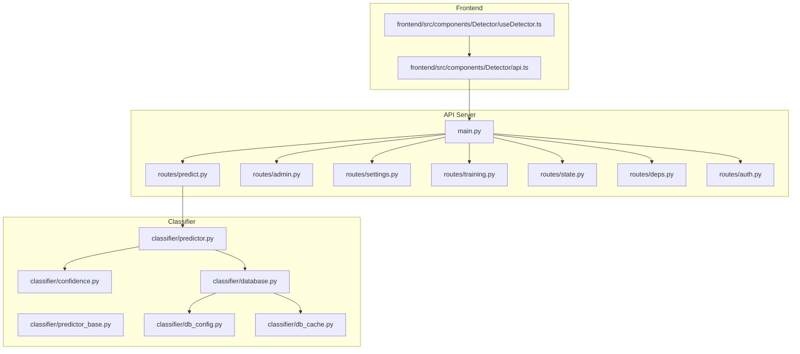
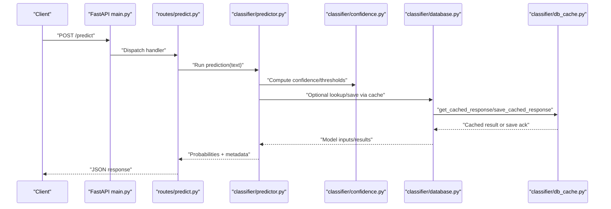
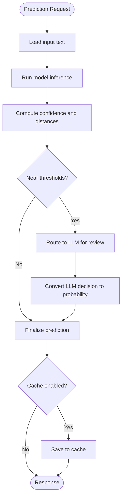
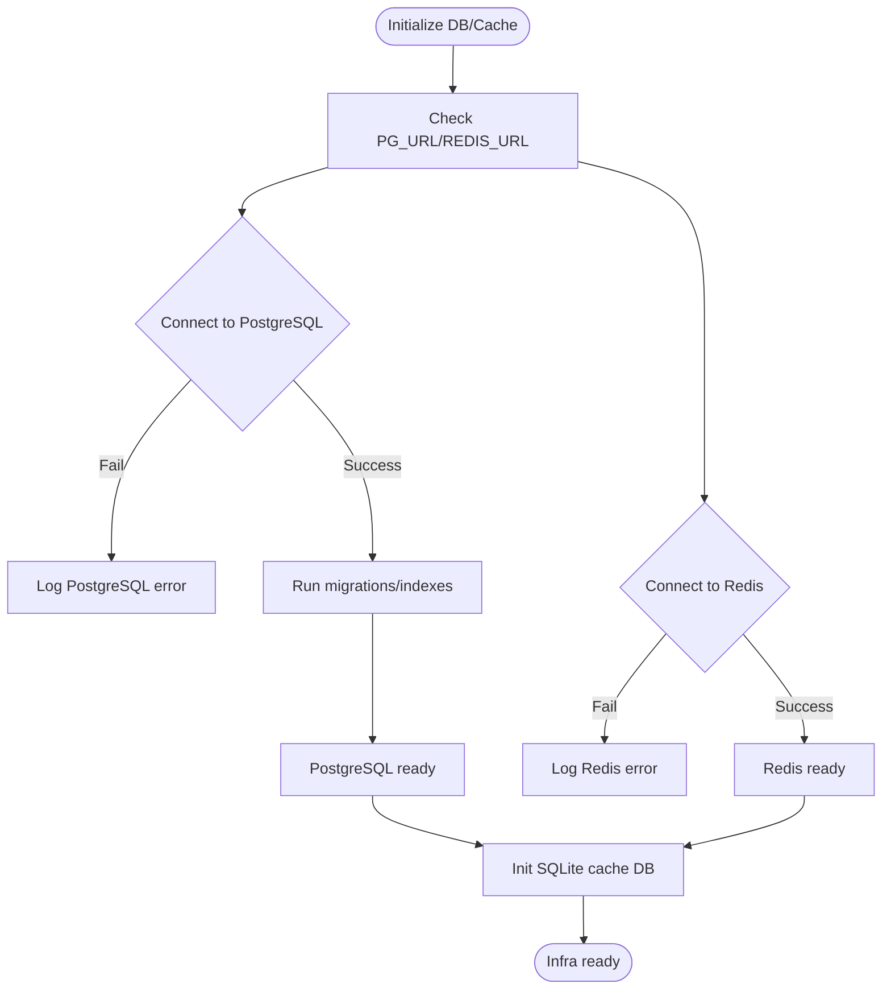
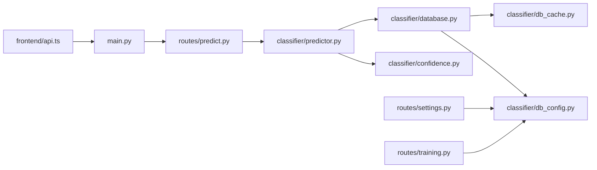

# Troubleshooting and FAQ

<cite>
**Referenced Files in This Document**
- [README.md](file://README.md)
- [cyberbullying_api/README.md](file://cyberbullying_api/README.md)
- [docs/ERROR_ANALYSIS_GUIDE.md](file://docs/ERROR_ANALYSIS_GUIDE.md)
- [docs/FINAL_TESTING_CHECKLIST.md](file://docs/FINAL_TESTING_CHECKLIST.md)
- [docs/ML_CONFIDENCE_GUIDE.md](file://docs/ML_CONFIDENCE_GUIDE.md)
- [docs/LOCAL_SETUP.md](file://docs/LOCAL_SETUP.md)
- [docs/PRODUCTION_CHECKLIST.md](file://docs/PRODUCTION_CHECKLIST.md)
- [docs/ROLLBACK_PLAN.md](file://docs/ROLLBACK_PLAN.md)
- [cyberbullying_api/classifier/confidence.py](file://cyberbullying_api/classifier/confidence.py)
- [cyberbullying_api/classifier/db_config.py](file://cyberbullying_api/classifier/db_config.py)
- [cyberbullying_api/classifier/db_cache.py](file://cyberbullying_api/classifier/db_cache.py)
- [cyberbullying_api/classifier/database.py](file://cyberbullying_api/classifier/database.py)
- [cyberbullying_api/classifier/predictor.py](file://cyberbullying_api/classifier/predictor.py)
- [cyberbullying_api/classifier/predictor_base.py](file://cyberbullying_api/classifier/predictor_base.py)
- [cyberbullying_api/main.py](file://cyberbullying_api/main.py)
- [cyberbullying_api/routes/predict.py](file://cyberbullying_api/routes/predict.py)
- [cyberbullying_api/routes/admin.py](file://cyberbullying_api/routes/admin.py)
- [cyberbullying_api/routes/settings.py](file://cyberbullying_api/routes/settings.py)
- [cyberbullying_api/routes/state.py](file://cyberbullying_api/routes/state.py)
- [cyberbullying_api/routes/training.py](file://cyberbullying_api/routes/training.py)
- [cyberbullying_api/routes/deps.py](file://cyberbullying_api/routes/deps.py)
- [cyberbullying_api/routes/auth.py](file://cyberbullying_api/routes/auth.py)
- [scripts/smoke_test_api.sh](file://scripts/smoke_test_api.sh)
- [scripts/benchmark_inference.py](file://scripts/benchmark_inference.py)
- [tests/test_confidence.py](file://tests/test_confidence.py)
- [tests/test_models.py](file://tests/test_models.py)
- [tests/test_monitoring_and_deps.py](file://tests/test_monitoring_and_deps.py)
- [frontend/src/components/Detector/api.ts](file://frontend/src/components/Detector/api.ts)
- [frontend/src/components/Detector/useDetector.ts](file://frontend/src/components/Detector/useDetector.ts)
</cite>

## Table of Contents
1. [Introduction](#introduction)
2. [Project Structure](#project-structure)
3. [Core Components](#core-components)
4. [Architecture Overview](#architecture-overview)
5. [Detailed Component Analysis](#detailed-component-analysis)
6. [Dependency Analysis](#dependency-analysis)
7. [Performance Considerations](#performance-considerations)
8. [Troubleshooting Guide](#troubleshooting-guide)
9. [FAQ](#faq)
10. [Conclusion](#conclusion)
11. [Appendices](#appendices)

## Introduction
This document provides a comprehensive troubleshooting and FAQ guide for BullyGuard ID. It focuses on diagnosing prediction errors, confidence score anomalies, and performance issues across the API server, database connectivity, caching layer, and machine learning models. It also covers deployment, configuration, integration challenges, and operational checklists derived from the repository’s documentation and source code.

## Project Structure
The BullyGuard ID system comprises:
- API server with FastAPI and route handlers for predictions, admin, settings, training, and state
- Classifier module implementing confidence scoring, threshold evaluation, and model prediction
- Database and cache configuration supporting PostgreSQL, Redis, and SQLite
- Frontend React components integrating with the API
- Operational documentation and testing scripts

**Diagram sources**
- [cyberbullying_api/main.py](file://cyberbullying_api/main.py)
- [cyberbullying_api/routes/predict.py](file://cyberbullying_api/routes/predict.py)
- [cyberbullying_api/routes/admin.py](file://cyberbullying_api/routes/admin.py)
- [cyberbullying_api/routes/settings.py](file://cyberbullying_api/routes/settings.py)
- [cyberbullying_api/routes/training.py](file://cyberbullying_api/routes/training.py)
- [cyberbullying_api/routes/state.py](file://cyberbullying_api/routes/state.py)
- [cyberbullying_api/routes/deps.py](file://cyberbullying_api/routes/deps.py)
- [cyberbullying_api/routes/auth.py](file://cyberbullying_api/routes/auth.py)
- [cyberbullying_api/classifier/confidence.py](file://cyberbullying_api/classifier/confidence.py)
- [cyberbullying_api/classifier/predictor.py](file://cyberbullying_api/classifier/predictor.py)
- [cyberbullying_api/classifier/predictor_base.py](file://cyberbullying_api/classifier/predictor_base.py)
- [cyberbullying_api/classifier/database.py](file://cyberbullying_api/classifier/database.py)
- [cyberbullying_api/classifier/db_config.py](file://cyberbullying_api/classifier/db_config.py)
- [cyberbullying_api/classifier/db_cache.py](file://cyberbullying_api/classifier/db_cache.py)
- [frontend/src/components/Detector/api.ts](file://frontend/src/components/Detector/api.ts)
- [frontend/src/components/Detector/useDetector.ts](file://frontend/src/components/Detector/useDetector.ts)

**Section sources**
- [README.md](file://README.md)
- [cyberbullying_api/README.md](file://cyberbullying_api/README.md)

## Core Components
- Prediction pipeline: routes/predict.py invokes the classifier to produce toxicity and bullying probabilities, applies confidence thresholds, and returns structured results.
- Confidence scoring: classifier/confidence.py defines threshold retrieval, margin checks, and conversion of LLM decisions to probabilities.
- Database and cache: classifier/database.py exposes initialization and cache helpers; classifier/db_config.py manages connection URLs, encryption keys, migrations, and logging; classifier/db_cache.py wraps Redis operations with error logging.
- Model predictors: classifier/predictor.py and classifier/predictor_base.py implement model loading and inference logic.
- API entrypoint: cyberbullying_api/main.py wires routes and middleware.
- Frontend integration: frontend/src/components/Detector/api.ts and useDetector.ts encapsulate API calls and state.

Key operational artifacts:
- docs/ERROR_ANALYSIS_GUIDE.md: error analysis methodology
- docs/ML_CONFIDENCE_GUIDE.md: confidence scoring guidance
- docs/FINAL_TESTING_CHECKLIST.md: testing verification procedures
- docs/PRODUCTION_CHECKLIST.md: production readiness
- docs/ROLLBACK_PLAN.md: rollback procedures
- scripts/smoke_test_api.sh: basic API health checks
- scripts/benchmark_inference.py: inference performance benchmarking

**Section sources**
- [cyberbullying_api/routes/predict.py](file://cyberbullying_api/routes/predict.py)
- [cyberbullying_api/classifier/confidence.py](file://cyberbullying_api/classifier/confidence.py)
- [cyberbullying_api/classifier/database.py](file://cyberbullying_api/classifier/database.py)
- [cyberbullying_api/classifier/db_config.py](file://cyberbullying_api/classifier/db_config.py)
- [cyberbullying_api/classifier/db_cache.py](file://cyberbullying_api/classifier/db_cache.py)
- [cyberbullying_api/classifier/predictor.py](file://cyberbullying_api/classifier/predictor.py)
- [cyberbullying_api/classifier/predictor_base.py](file://cyberbullying_api/classifier/predictor_base.py)
- [cyberbullying_api/main.py](file://cyberbullying_api/main.py)
- [docs/ERROR_ANALYSIS_GUIDE.md](file://docs/ERROR_ANALYSIS_GUIDE.md)
- [docs/ML_CONFIDENCE_GUIDE.md](file://docs/ML_CONFIDENCE_GUIDE.md)
- [docs/FINAL_TESTING_CHECKLIST.md](file://docs/FINAL_TESTING_CHECKLIST.md)
- [docs/PRODUCTION_CHECKLIST.md](file://docs/PRODUCTION_CHECKLIST.md)
- [docs/ROLLBACK_PLAN.md](file://docs/ROLLBACK_PLAN.md)
- [scripts/smoke_test_api.sh](file://scripts/smoke_test_api.sh)
- [scripts/benchmark_inference.py](file://scripts/benchmark_inference.py)
- [frontend/src/components/Detector/api.ts](file://frontend/src/components/Detector/api.ts)
- [frontend/src/components/Detector/useDetector.ts](file://frontend/src/components/Detector/useDetector.ts)

## Architecture Overview
The system integrates a FastAPI server with a classification pipeline and persistence/cache layers. Predictions flow from the API to the classifier, which consults thresholds and optionally caches results.

**Diagram sources**
- [cyberbullying_api/main.py](file://cyberbullying_api/main.py)
- [cyberbullying_api/routes/predict.py](file://cyberbullying_api/routes/predict.py)
- [cyberbullying_api/classifier/predictor.py](file://cyberbullying_api/classifier/predictor.py)
- [cyberbullying_api/classifier/confidence.py](file://cyberbullying_api/classifier/confidence.py)
- [cyberbullying_api/classifier/database.py](file://cyberbullying_api/classifier/database.py)
- [cyberbullying_api/classifier/db_cache.py](file://cyberbullying_api/classifier/db_cache.py)

## Detailed Component Analysis

### Prediction Pipeline and Confidence Scoring
Common issues:
- Misclassification near thresholds
- Overconfident predictions
- Threshold misconfiguration
- LLM routing anomalies

Diagnostic steps:
- Verify thresholds via settings endpoint
- Inspect confidence margins and distances from thresholds
- Confirm LLM decision-to-probability mapping
- Review cached vs. fresh predictions

**Diagram sources**
- [cyberbullying_api/routes/predict.py](file://cyberbullying_api/routes/predict.py)
- [cyberbullying_api/classifier/confidence.py](file://cyberbullying_api/classifier/confidence.py)
- [cyberbullying_api/classifier/predictor.py](file://cyberbullying_api/classifier/predictor.py)
- [cyberbullying_api/classifier/db_cache.py](file://cyberbullying_api/classifier/db_cache.py)

**Section sources**
- [cyberbullying_api/routes/predict.py](file://cyberbullying_api/routes/predict.py)
- [cyberbullying_api/classifier/confidence.py](file://cyberbullying_api/classifier/confidence.py)
- [cyberbullying_api/classifier/predictor.py](file://cyberbullying_api/classifier/predictor.py)
- [docs/ML_CONFIDENCE_GUIDE.md](file://docs/ML_CONFIDENCE_GUIDE.md)

### Database and Cache Connectivity
Common issues:
- PostgreSQL connection failures
- Redis connectivity errors
- Encryption key mismatches during migration
- SQLite lock timeouts

Diagnostic steps:
- Check environment variables for PG_URL and REDIS_URL
- Validate encryption key presence and permissions
- Review initialization logs for migrations and indexing
- Confirm cache operations and error logs

**Diagram sources**
- [cyberbullying_api/classifier/db_config.py](file://cyberbullying_api/classifier/db_config.py)
- [cyberbullying_api/classifier/db_cache.py](file://cyberbullying_api/classifier/db_cache.py)
- [cyberbullying_api/classifier/database.py](file://cyberbullying_api/classifier/database.py)

**Section sources**
- [cyberbullying_api/classifier/db_config.py](file://cyberbullying_api/classifier/db_config.py)
- [cyberbullying_api/classifier/db_cache.py](file://cyberbullying_api/classifier/db_cache.py)
- [cyberbullying_api/classifier/database.py](file://cyberbullying_api/classifier/database.py)

### API Endpoints and Dependencies
Common issues:
- Missing authentication tokens
- Incorrect route dependencies
- CORS or middleware conflicts
- Endpoint-specific errors

Diagnostic steps:
- Verify auth routes and tokens
- Check route dependencies and shared resources
- Validate endpoint responses and error codes
- Confirm frontend integration paths

**Section sources**
- [cyberbullying_api/routes/auth.py](file://cyberbullying_api/routes/auth.py)
- [cyberbullying_api/routes/deps.py](file://cyberbullying_api/routes/deps.py)
- [cyberbullying_api/routes/admin.py](file://cyberbullying_api/routes/admin.py)
- [cyberbullying_api/routes/settings.py](file://cyberbullying_api/routes/settings.py)
- [cyberbullying_api/routes/training.py](file://cyberbullying_api/routes/training.py)
- [cyberbullying_api/routes/state.py](file://cyberbullying_api/routes/state.py)
- [frontend/src/components/Detector/api.ts](file://frontend/src/components/Detector/api.ts)
- [frontend/src/components/Detector/useDetector.ts](file://frontend/src/components/Detector/useDetector.ts)

## Dependency Analysis
The classifier depends on database and cache modules, which in turn rely on configuration and environment variables. Routes depend on the classifier and shared dependencies.

**Diagram sources**
- [cyberbullying_api/main.py](file://cyberbullying_api/main.py)
- [cyberbullying_api/routes/predict.py](file://cyberbullying_api/routes/predict.py)
- [cyberbullying_api/routes/settings.py](file://cyberbullying_api/routes/settings.py)
- [cyberbullying_api/routes/training.py](file://cyberbullying_api/routes/training.py)
- [cyberbullying_api/classifier/predictor.py](file://cyberbullying_api/classifier/predictor.py)
- [cyberbullying_api/classifier/confidence.py](file://cyberbullying_api/classifier/confidence.py)
- [cyberbullying_api/classifier/database.py](file://cyberbullying_api/classifier/database.py)
- [cyberbullying_api/classifier/db_config.py](file://cyberbullying_api/classifier/db_config.py)
- [cyberbullying_api/classifier/db_cache.py](file://cyberbullying_api/classifier/db_cache.py)
- [frontend/src/components/Detector/api.ts](file://frontend/src/components/Detector/api.ts)

**Section sources**
- [cyberbullying_api/main.py](file://cyberbullying_api/main.py)
- [cyberbullying_api/classifier/database.py](file://cyberbullying_api/classifier/database.py)
- [cyberbullying_api/classifier/db_config.py](file://cyberbullying_api/classifier/db_config.py)
- [cyberbullying_api/classifier/db_cache.py](file://cyberbullying_api/classifier/db_cache.py)
- [cyberbullying_api/routes/predict.py](file://cyberbullying_api/routes/predict.py)
- [cyberbullying_api/routes/settings.py](file://cyberbullying_api/routes/settings.py)
- [cyberbullying_api/routes/training.py](file://cyberbullying_api/routes/training.py)
- [frontend/src/components/Detector/api.ts](file://frontend/src/components/Detector/api.ts)

## Performance Considerations
- Benchmark inference throughput and latency using the provided script
- Monitor cache hit rates and Redis connectivity
- Tune PostgreSQL indexes and migrations for vector storage
- Optimize model loading and batch prediction strategies
- Validate frontend polling intervals and retry logic

[No sources needed since this section provides general guidance]

## Troubleshooting Guide

### Prediction Errors and Confidence Anomalies
Symptoms:
- Frequent borderline classifications
- Sudden shifts in confidence scores
- LLM routing loops or inconsistent decisions

Resolution workflow:
1. Retrieve current thresholds via settings endpoint and confirm values
2. Recompute confidence margins and distances from thresholds
3. Validate LLM decision-to-probability mapping
4. Compare cached vs. fresh predictions to detect staleness
5. Re-run predictions with explicit debug flags if available

Verification checklist:
- Thresholds within expected ranges
- Confidence margin sufficient to avoid ambiguity
- LLM routing triggered only near thresholds
- Cache entries updated after retraining

**Section sources**
- [cyberbullying_api/routes/settings.py](file://cyberbullying_api/routes/settings.py)
- [cyberbullying_api/classifier/confidence.py](file://cyberbullying_api/classifier/confidence.py)
- [cyberbullying_api/classifier/db_cache.py](file://cyberbullying_api/classifier/db_cache.py)
- [docs/ML_CONFIDENCE_GUIDE.md](file://docs/ML_CONFIDENCE_GUIDE.md)

### Database and Cache Issues
Symptoms:
- PostgreSQL connection refused or slow startup
- Redis errors during get/save operations
- Encryption key errors during migration
- SQLite lock timeouts

Resolution workflow:
1. Confirm PG_URL and REDIS_URL environment variables
2. Validate encryption key existence and permissions
3. Review initialization logs for migration and indexing steps
4. Test Redis connectivity independently
5. Retry SQLite operations with increased timeouts

Verification checklist:
- PostgreSQL reachable and schema initialized
- Redis responds to ping and operations
- Encryption key matches stored value
- Cache operations logged without warnings

**Section sources**
- [cyberbullying_api/classifier/db_config.py](file://cyberbullying_api/classifier/db_config.py)
- [cyberbullying_api/classifier/db_cache.py](file://cyberbullying_api/classifier/db_cache.py)
- [cyberbullying_api/classifier/database.py](file://cyberbullying_api/classifier/database.py)

### API Endpoint Problems
Symptoms:
- 401/403 unauthorized responses
- 422 validation errors
- 500 internal server errors
- Slow response times

Resolution workflow:
1. Authenticate using auth routes and verify tokens
2. Validate request payloads against route schemas
3. Inspect route dependencies and shared resources
4. Enable detailed logging around route handlers
5. Use smoke tests to verify endpoint availability

Verification checklist:
- Authentication successful and token valid
- Request body conforms to expected schema
- Route dependencies resolved without errors
- Smoke tests pass across endpoints

**Section sources**
- [cyberbullying_api/routes/auth.py](file://cyberbullying_api/routes/auth.py)
- [cyberbullying_api/routes/deps.py](file://cyberbullying_api/routes/deps.py)
- [scripts/smoke_test_api.sh](file://scripts/smoke_test_api.sh)

### Machine Learning Model Issues
Symptoms:
- Zero or constant outputs
- Unexpected label flips
- Slow inference times

Resolution workflow:
1. Verify model loading and version
2. Check preprocessing normalization
3. Benchmark inference performance
4. Validate training data and thresholds
5. Reinitialize models if corrupted

Verification checklist:
- Model loads without errors
- Normalization applied consistently
- Benchmarks within acceptable range
- Retraining completed successfully

**Section sources**
- [cyberbullying_api/classifier/predictor.py](file://cyberbullying_api/classifier/predictor.py)
- [cyberbullying_api/classifier/predictor_base.py](file://cyberbullying_api/classifier/predictor_base.py)
- [scripts/benchmark_inference.py](file://scripts/benchmark_inference.py)
- [tests/test_models.py](file://tests/test_models.py)

### Frontend Integration Problems
Symptoms:
- Network errors or timeouts
- Incorrect UI state after predictions
- Missing XAI highlights

Resolution workflow:
1. Confirm API base URL and endpoint paths
2. Validate request/response shapes
3. Inspect frontend error boundaries
4. Test with mock responses
5. Verify XAI rendering logic

Verification checklist:
- API calls succeed and return expected shape
- Frontend handles errors gracefully
- XAI highlights update correctly

**Section sources**
- [frontend/src/components/Detector/api.ts](file://frontend/src/components/Detector/api.ts)
- [frontend/src/components/Detector/useDetector.ts](file://frontend/src/components/Detector/useDetector.ts)

### Deployment and Configuration
Common issues:
- Environment variable omissions
- Docker compose inconsistencies
- Production readiness gaps

Resolution workflow:
1. Review production checklist items
2. Validate environment variables per local setup guide
3. Run production readiness checks
4. Prepare rollback plan before updates

Verification checklist:
- All environment variables present
- Docker compose up without errors
- Production checklist items satisfied
- Rollback plan documented and tested

**Section sources**
- [docs/PRODUCTION_CHECKLIST.md](file://docs/PRODUCTION_CHECKLIST.md)
- [docs/LOCAL_SETUP.md](file://docs/LOCAL_SETUP.md)
- [docs/ROLLBACK_PLAN.md](file://docs/ROLLBACK_PLAN.md)

### Error Analysis Methodology
Follow the repository’s error analysis guide to systematically categorize and triage issues:
- Collect logs from classifier, database, and cache layers
- Correlate timestamps across components
- Reproduce with minimal inputs
- Document conditions leading to failure
- Track fixes and regressions

**Section sources**
- [docs/ERROR_ANALYSIS_GUIDE.md](file://docs/ERROR_ANALYSIS_GUIDE.md)

### Testing and Verification Procedures
Use the final testing checklist to validate system behavior:
- Functional tests for prediction accuracy
- Regression tests for confidence scoring
- Dependency and monitoring tests
- Model correctness tests

**Section sources**
- [docs/FINAL_TESTING_CHECKLIST.md](file://docs/FINAL_TESTING_CHECKLIST.md)
- [tests/test_confidence.py](file://tests/test_confidence.py)
- [tests/test_monitoring_and_deps.py](file://tests/test_monitoring_and_deps.py)
- [tests/test_models.py](file://tests/test_models.py)

## FAQ

Q1: Why does the prediction keep changing near the threshold?
- Check confidence margins and distances from thresholds; adjust thresholds if needed.

Q2: How do I verify cache is working?
- Observe cache get/save operations and logs; ensure Redis connectivity.

Q3: What causes PostgreSQL connection errors?
- Verify PG_URL and credentials; check migrations and indexing logs.

Q4: How do I troubleshoot LLM routing anomalies?
- Confirm LLM decision-to-probability mapping and threshold proximity.

Q5: How often should I retrain the model?
- Follow training pipeline and re-evaluate metrics regularly.

Q6: What are the ethical considerations?
- Ensure responsible use, transparency, and bias mitigation in predictions.

Q7: How do I prepare for production?
- Complete production checklist, validate environment, and document rollback plan.

Q8: How do I diagnose frontend integration issues?
- Validate API paths, request/response shapes, and error handling.

Q9: How do I benchmark inference performance?
- Use the provided benchmark script and compare metrics.

Q10: How do I analyze errors systematically?
- Use the error analysis guide to collect logs, reproduce, and track fixes.

**Section sources**
- [docs/ML_CONFIDENCE_GUIDE.md](file://docs/ML_CONFIDENCE_GUIDE.md)
- [docs/ERROR_ANALYSIS_GUIDE.md](file://docs/ERROR_ANALYSIS_GUIDE.md)
- [docs/PRODUCTION_CHECKLIST.md](file://docs/PRODUCTION_CHECKLIST.md)
- [docs/ROLLBACK_PLAN.md](file://docs/ROLLBACK_PLAN.md)
- [scripts/benchmark_inference.py](file://scripts/benchmark_inference.py)
- [frontend/src/components/Detector/api.ts](file://frontend/src/components/Detector/api.ts)
- [frontend/src/components/Detector/useDetector.ts](file://frontend/src/components/Detector/useDetector.ts)

## Conclusion
This guide consolidates actionable troubleshooting workflows for BullyGuard ID across prediction logic, confidence scoring, database/cache connectivity, API endpoints, and frontend integration. By following the diagnostic steps, verification procedures, and operational checklists, teams can quickly isolate and resolve issues while maintaining system reliability and performance.

[No sources needed since this section summarizes without analyzing specific files]

## Appendices

### Quick Diagnostic Checklist
- Confirm environment variables and secrets
- Validate database and cache connectivity
- Verify thresholds and confidence margins
- Test API endpoints with smoke tests
- Benchmark inference performance
- Review logs across classifier, database, and cache layers
- Cross-check frontend API paths and error handling

**Section sources**
- [scripts/smoke_test_api.sh](file://scripts/smoke_test_api.sh)
- [scripts/benchmark_inference.py](file://scripts/benchmark_inference.py)
- [docs/LOCAL_SETUP.md](file://docs/LOCAL_SETUP.md)
- [docs/ML_CONFIDENCE_GUIDE.md](file://docs/ML_CONFIDENCE_GUIDE.md)
- [docs/ERROR_ANALYSIS_GUIDE.md](file://docs/ERROR_ANALYSIS_GUIDE.md)