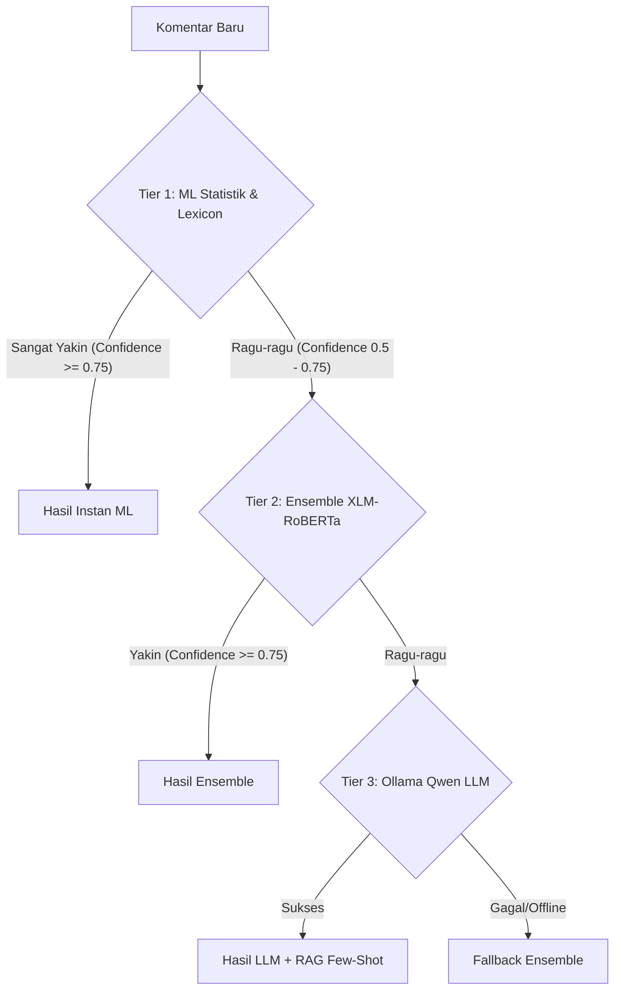

# BullyGuard ID: Indonesian Cyberbullying & Hate Speech Detection System

[](https://fastapi.tiangolo.com/)
[](https://reactjs.org/)
[](https://www.postgresql.org/)
[](https://redis.io/)
[](https://www.docker.com/)

**BullyGuard ID** adalah sistem deteksi cyberbullying dan ujaran kebencian (*hate speech*) berbahasa Indonesia berskala produksi. Sistem ini menerapkan pendekatan **Hybrid Classifier** (3-tier architecture) yang menggabungkan kecepatan aturan leksikon, kepastian model statistik Machine Learning, kekuatan semantik Deep Learning Transformers (XLM-RoBERTa), serta kecerdasan reasoning Few-Shot Large Language Models (LLM) secara dinamis.

Proyek ini dilengkapi dengan modul **Active Learning (Human-in-the-Loop)** yang memungkinkan administrator melatih ulang model secara instan (hot-reloading) langsung dari UI dashboard ketika ada slang lokal/gaul baru yang salah diklasifikasikan oleh AI.

---

## 🏛️ Arsitektur Sistem (3-Tier Hybrid)

Sistem menggunakan alur perutean cerdas (*intelligent routing*) untuk memproses komentar:



1. **Tier 1 (Lexicon & ML Klasik)**: Menganalisis teks menggunakan TF-IDF + Logistic Regression dan pencocokan leksikon alay/kasar. Jika model statistik sangat yakin ($P \le 0.25$ atau $P \ge 0.75$), keputusan langsung diambil dalam $<5\text{ms}$.
2. **Tier 2 (Deep Learning Transformers)**: Kasus marginal/ragu diteruskan ke model XLM-RoBERTa terkuantisasi INT8 (`onnxruntime` CPU).
3. **Tier 3 (Few-Shot LLM + RAG)**: Kasus kompleks (sarkasme/slang halus) diteruskan ke Ollama Qwen LLM dengan suntikan konteks dinamis (*Retrieval-Augmented Generation*) dari database komentar tervalidasi.

---

## 📁 Struktur Repositori

Struktur folder dirancang secara modular dan mengikuti praktik terbaik pengembangan perangkat lunak modern:

```text
📁 Cyber/
├── 📁 cyberbullying_api/           # BACKEND (FastAPI)
│   ├── 📁 cache/                   # Penyimpanan SQLite Cache & Log Pelatihan
│   ├── 📁 classifier/              # Logika Utama Klasifikasi & DB
│   │   ├── 📄 db_cache.py          # Semantic Cache Response
│   │   ├── 📄 db_config.py         # Konfigurasi DB (PostgreSQL, Redis, SQLite)
│   │   ├── 📄 db_memory.py         # Persistent Memory & Active Learning
│   │   ├── 📄 database.py          # Re-exporter Backward Compatibility
│   │   └── 📄 predictor.py         # Engine Prediksi Hybrid
│   ├── 📁 models/                  # File Model (Joblib, ONNX, JSON Thresholds)
│   ├── 📁 routes/                  # API Endpoints (FastAPI APIRouter)
│   │   ├── 📄 deps.py              # Dependencies (Auth API Key, Rate Limits)
│   │   ├── 📄 admin.py             # Scraping, Active Learning, Retrain Routes
│   │   └── 📄 predict.py           # Prediksi Klasifikasi & Batch Routes
│   ├── 📁 scraper/                 # Scraper Komentar (TikTok & X/Twitter)
│   ├── 📄 main.py                  # Entrypoint & Lifespan FastAPI
│   ├── 📄 retrain.py               # Script Pelatihan Ulang Otomatis
│   └── 📁 tests/                   # Automated Test Suite (Pytest)
│       ├── 📄 test_admin.py        # Pengujian Logika Admin & Database
│       └── 📄 test_predictions.py  # Pengujian Logika Klasifikasi & Model
│
├── 📁 frontend/                    # FRONTEND (React + Vite + Tailwind CSS)
│   ├── 📁 src/
│   │   ├── 📁 components/          # Komponen UI
│   │   │   ├── 📁 ActiveLearning/  # Sub-Komponen Halaman Active Learning
│   │   │   │   ├── 📄 FilterBar.tsx
│   │   │   │   ├── 📄 Quadrant.tsx
│   │   │   │   └── 📄 RetrainTerminal.tsx
│   │   │   └── 📄 ActiveLearning.tsx # Main controller halaman
│   │   └── 📄 App.tsx              # Root Layout & Dashboard
│
├── 📄 docker-compose.yml           # Orkestrasi PostgreSQL, Redis, Pgvector
└── 📄 README.md                    # Dokumentasi Utama
```

---

## 🚀 Panduan Instalasi & Pengembangan

### 1. Prasyarat
Pastikan Anda memiliki tools berikut terinstal di komputer Anda:
- Python 3.10 atau lebih tinggi
- Node.js & npm (v18+)
- Docker & Docker Compose

### 2. Infrastruktur (Docker)
Jalankan PostgreSQL, Redis, dan pgvector menggunakan Docker Compose:
```bash
docker-compose up -d
```
*Catatan: Konfigurasi default PostgreSQL & Redis telah diatur agar otomatis terhubung ke sistem backend.*

### 3. Backend Setup (FastAPI)
1. Buka folder `cyberbullying_api/` dan buat virtual environment:
   ```bash
   cd cyberbullying_api
   python -m venv .venv
   .venv\Scripts\activate      # Windows
   source .venv/bin/activate    # macOS/Linux
   ```
2. Instal dependensi:
   ```bash
   pip install -r requirements.txt
   ```
3. Buat file `.env` di dalam folder `cyberbullying_api/` dan masukkan kunci API:
   ```env
   API_KEY=kunci_api_rahasia_anda
   ENV=development
   ```
4. Jalankan server pengembangan backend:
   ```bash
   uvicorn main:app --reload --port 8000
   ```

### 4. Frontend Setup (React)
1. Buka folder `frontend/`:
   ```bash
   cd ../frontend
   ```
2. Instal dependensi npm:
   ```bash
   npm install
   ```
3. Jalankan server pengembangan React:
   ```bash
   npm run dev
   ```

---

## 🧪 Pengujian Unit & Integrasi (Automated Tests)

Sistem dilengkapi dengan unit testing menggunakan `pytest` yang telah dikonfigurasi untuk terisolasi dari database produksi melalui SQLite fallback otomatis.

Untuk menjalankan seluruh pengujian:
```bash
# Di dalam folder root proyek
.venv\Scripts\pytest cyberbullying_api/tests
```

*Tip Kecepatan: Waktu eksekusi pengujian berkisar ~30-40 detik karena inisialisasi ONNX dan model Sentence-Transformer pada startup.*

---

## ⚙️ Mekanisme Active Learning (Human-in-the-Loop)

UI Active Learning membagi data klasifikasi historis menjadi 4 kuadran utama:
1. **Toxic & Bully**
2. **Toxic but Non-Bully**
3. **Non-Toxic but Bully**
4. **Non-Toxic & Non-Bully**

### Langkah Kerja Siklus Ulang:
1. **Penyaringan**: Cari teks atau filter berdasarkan tingkat keyakinan (ragu-ragu) dan sumber keputusan.
2. **Relokasi**: Geser kartu teks secara manual (atau lakukan *Drag & Drop*) ke kuadran yang benar jika AI salah mendeteksi.
3. **Validasi**: Data yang Anda pindahkan akan diberi flag `is_validated = 1` di database.
4. **Pelatihan Ulang (Retraining)**: Klik tombol **"Jalankan Pelatihan Ulang"** untuk memicu kompilasi ulang model ML menggunakan data tervalidasi baru. backend akan melatih ulang model Logistic Regression, mengkalibrasi ulang threshold keputusan optimal, memperbarui disk, dan memuat ulang model secara dinamis (*hot-reload*) menggunakan Redis Pub/Sub.
