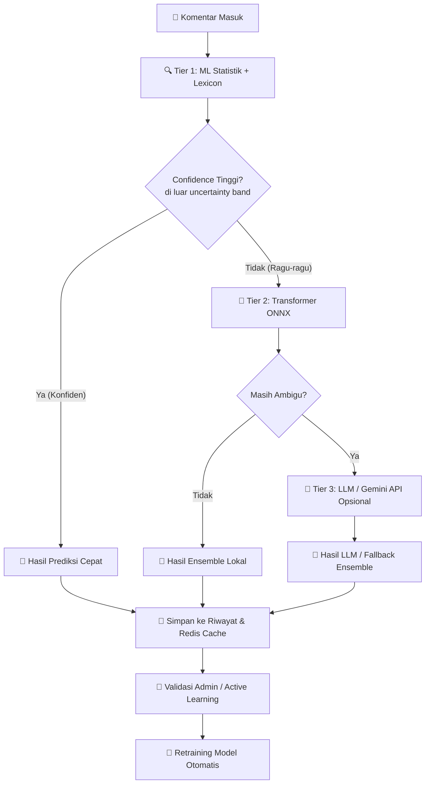

# 🛡️ BullyGuard ID — Indonesian Cyberbullying & Hate Speech Detection API

[](https://fastapi.tiangolo.com/)
[](https://reactjs.org/)
[](https://www.docker.com/)
[](https://www.python.org/)
[](LICENSE)

**BullyGuard ID** adalah sistem deteksi cyberbullying, ujaran kebencian (hate speech), dan kata kasar (profanity) berbahasa Indonesia berbasis API modern. Sistem ini menggunakan arsitektur **Hybrid Multi-Tier** yang secara cerdas menggabungkan **model statistik klasik**, **lexicon matching**, **Deep Learning Transformer (PyTorch/ONNX)**, dan opsi **Large Language Model (LLM)** lokal untuk menghasilkan keputusan klasifikasi yang cepat, akurat, dan dapat dijelaskan (*explainable*).


---

## 📌 Status Proyek

> [!NOTE]
> **Status**: `Advanced MVP / Research-Oriented Prototype`  
> Sistem ini sangat cocok untuk eksperimen, demo teknis, riset, dan pengembangan produk moderasi berbasis AI. Untuk penggunaan di lingkungan *production* skala besar, disarankan mengikuti panduan [docs/PRODUCTION_CHECKLIST.md](file:///c:/Users/malik/Downloads/Cyber/docs/PRODUCTION_CHECKLIST.md) termasuk melakukan tuning threshold, penambahan logging, dan pengujian beban (*load testing*).

---

## 🎯 Tujuan Proyek

Proyek ini dibangun untuk mendeteksi dan mengklasifikasikan komentar digital berbahasa Indonesia ke dalam kategori tingkat bahaya:
- **Toxic**: Bahasa kasar, sarkasme, atau profanity umum (*casual swearing*).
- **Cyberbullying**: Pelecehan verbal terarah, intimidasi, *body shaming*, atau ancaman personal.
- **Aman (Non-Toxic & Non-Bullying)**: Komentar positif atau kritik konstruktif yang bersih.
- **Ambigu/Memerlukan Tinjauan**: Kalimat sarkasme kompleks yang memerlukan verifikasi manusia (*Human-in-the-Loop*).

Sistem ini dirancang sebagai **asisten penyaring awal (screening assistant)** untuk membantu moderator manusia memprioritaskan antrean moderasi konten secara efisien.

---

## 🌟 Fitur Utama

- 🧠 **Hybrid Multi-Tier Pipeline**: 
  - **Tier 1 (Lokal / Cepat)**: Deteksi kilat dengan Lexicon Matching + Machine Learning (Logistic Regression & TF-IDF).
  - **Tier 2 (Lokal / Semantik)**: Evaluasi semantik mendalam menggunakan model Transformer (XLM-RoBERTa) yang dioptimalkan dalam format ONNX Runtime.
  - **Tier 3 (Eksternal / Komponen Fleksibel)**: Deteksi kalimat sarkasme kompleks menggunakan Cloud LLM (Gemini API).
- 🔍 **Explainable AI (XAI)**: Visualisasi bobot SHAP untuk setiap kata guna menunjukkan kata spesifik yang memicu keputusan AI.
- ⚡ **Optimasi Docker Berkinerja Tinggi**:
  - Image API dan Worker saling berbagi *cache layers* (Image Re-use) sehingga menghemat RAM dan mempercepat waktu build.
  - Node.js dev container yang responsif untuk frontend React + Vite.
- 🐳 **Caching & Queue Terintegrasi**: PostgreSQL (dengan ekstensi `pgvector`) dan Redis untuk penyimpanan riwayat, deteksi kemiripan semantik, antrean retraining, serta proteksi *Rate Limiting* API yang aman.
- 🔒 **Security Hardening**: Autentikasi API Key bertipe *constant-time comparison* untuk mencegah *timing attack*, penutupan akses publik pada endpoint administratif, perlindungan SSRF webhook, serta CORS yang ketat.

---

## 🏗️ Gambaran Arsitektur

Berikut adalah alur klasifikasi komentar pada arsitektur hybrid BullyGuard ID:



---

## 📂 Struktur Repositori

```text
.
├── .github/                         # Alur integrasi CI/CD
├── cyberbullying_api/               # Backend API berbasis FastAPI
│   ├── cache/                       # Lokasi penyimpanan log dan cache model
│   ├── classifier/                  # Core logic, database, confidence, & predictor
│   ├── models/                      # Artefak model (joblib, ONNX) & thresholds.json
│   ├── routes/                      # Route endpoint FastAPI (predict, admin)
│   ├── tests/                       # Unit test internal backend
│   └── main.py                      # Berkas entrypoint backend utama
├── dataset/                         # Dataset latih, kamus slang/alay, & kata abusive
├── docs/                            # Dokumentasi teknis terperinci
│   ├── LOCAL_SETUP.md               # Panduan setup manual lokal tanpa Docker
│   ├── PRODUCTION_CHECKLIST.md      # Panduan hardening menuju production
│   ├── ML_CONFIDENCE_GUIDE.md       # Teori dan kalibrasi skor confidence
│   ├── SECURITY_HARDENING.md        # Laporan hardening keamanan
│   └── ERROR_ANALYSIS_GUIDE.md      # Panduan analisis false positive/negative
├── frontend/                        # Dashboard web berbasis React + Vite
├── scripts/                         # Skrip otomatisasi (smoke test, verifikasi patch)
├── docker-compose.yml               # Konfigurasi orkestrasi container dev
├── MODEL_EVALUATION.md              # Template pencatatan performa model
└── README.md                        # Dokumentasi utama proyek
```

---

## 📋 Prasyarat Sistem

Pastikan komputer lokal Anda telah terpasang perangkat lunak berikut:
- **Python 3.11** atau lebih baru
- **Node.js 20** atau lebih baru (berserta **npm**)
- **Docker** & **Docker Compose**
- **Gemini API (Google)** *(Opsional, diperlukan jika ingin mengaktifkan Cloud LLM Tier 3)*

---

## ⚡ Quick Start — Local Development

### 1. Kloning Repositori
```bash
git clone https://github.com/Maliq-dlt/indonesian-cyberbullying-detection-api.git
cd indonesian-cyberbullying-detection-api
```

### 2. Konfigurasi Variabel Lingkungan
Salin berkas template environment:
```bash
cp .env.example .env
```
*(Bagi pengguna Windows PowerShell, gunakan perintah: `Copy-Item .env.example .env`)*

Buka berkas `.env` dan atur nilai yang aman:
```env
ENV=development
API_KEY=rahasia_api_key_anda_yang_panjang_dan_aman
ALLOW_MISSING_API_KEY_IN_DEV=true

# Database & Cache (Jika PostgreSQL/Redis mati/tidak ada, otomatis fallback ke SQLite & Memory Cache)
PG_URL=postgresql://cyber_user:change_this_postgres_password@db:5432/cyberbullying_db
REDIS_URL=redis://:change_this_redis_password@redis:6379/0

# Layanan Cloud LLM Tier 3
GEMINI_API_KEY=AIzaSy...
GEMINI_BASE_URL=https://generativelanguage.googleapis.com/v1beta/openai
GEMINI_MODEL=gemini-1.5-flash
```

> [!TIP]
> **Zero-Config/Offline Fallback:** Jika Anda sedang mematikan database Docker (misal saat hemat baterai), backend BullyGuard ID akan otomatis mengaktifkan *cooldown* timeout cepat dan mengalihkan seluruh memori klasifikasi secara transparan ke database lokal SQLite `cyberbullying_api/cache/cloud_llm_cache.db`.


### 3. Jalankan Database & Cache (Docker)
Sebelum menjalankan backend, nyalakan Postgres dan Redis menggunakan Docker:
```bash
docker compose up -d db redis
```

### 4. Setup Backend API
Buka folder `cyberbullying_api` dan buat *virtual environment* Python:
```bash
cd cyberbullying_api
python -m venv .venv
```
Aktifkan *virtual environment*:
- **Linux/macOS**: `source .venv/bin/activate`
- **Windows PowerShell**: `.\.venv\Scripts\Activate.ps1`

Pasang seluruh pustaka dependensi:
```bash
pip install --upgrade pip
pip install -r requirements.txt
```
Jalankan server API FastAPI dalam mode *hot-reload*:
```bash
uvicorn main:app --reload --host 0.0.0.0 --port 8000
```
Server akan aktif di `http://localhost:8000`. Akses dokumentasi interaktif Swagger di `http://localhost:8000/docs`.

### 5. Setup Frontend Web
Buka terminal baru di direktori utama proyek:
```bash
cd frontend
npm install
npm run dev
```
Buka peramban (*browser*) Anda ke alamat `http://localhost:5173`.

---

## 🔌 Panduan Setup & Menjalankan Manual Tanpa Docker

Jika Anda tidak ingin menginstal atau menggunakan Docker, BullyGuard ID telah dirancang secara modular agar dapat berjalan sepenuhnya secara lokal menggunakan **Mode Fallback SQLite & Memory Cache**. Anda tidak memerlukan PostgreSQL atau Redis yang berjalan aktif untuk menjalankan backend dan frontend.

Berikut adalah langkah-langkah lengkap untuk memasang dan menjalankan aplikasi secara manual di komputer Anda:

### 📋 Prasyarat Sistem
Sebelum memulai, pastikan komputer Anda telah terpasang:
1. **Python 3.11** atau versi lebih baru.
2. **Node.js 20** atau versi lebih baru (beserta **npm**).
3. (Opsional) **Git** untuk kloning repositori.

---

### 🛠️ Langkah 1: Kloning & Inisialisasi Environment
1. Buka terminal Anda dan jalankan perintah kloning berikut (jika belum dilakukan):
   ```bash
   git clone https://github.com/Maliq-dlt/indonesian-cyberbullying-detection-api.git
   cd indonesian-cyberbullying-detection-api
   ```
2. Salin berkas template environment `.env.example` menjadi berkas aktif `.env`:
   * **Linux / macOS / Git Bash:**
     ```bash
     cp .env.example .env
     ```
   * **Windows PowerShell:**
     ```powershell
     Copy-Item .env.example .env
     ```
   * **Windows Command Prompt (CMD):**
     ```cmd
     copy .env.example .env
     ```
3. Buka berkas `.env` dan atur `API_KEY` Anda. Anda dapat mengabaikan parameter `PG_URL` dan `REDIS_URL` karena backend akan otomatis menggunakan SQLite lokal dan memory cache apabila kedua server database tersebut tidak terdeteksi aktif.

---

### 🐍 Langkah 2: Setup & Jalankan Backend API
1. Masuk ke direktori backend `cyberbullying_api`:
   ```bash
   cd cyberbullying_api
   ```
2. Buat *virtual environment* Python khusus:
   ```bash
   python -m venv .venv
   ```
3. Aktifkan *virtual environment* sesuai terminal Anda:
   * **Windows (PowerShell):**
     ```powershell
     .\.venv\Scripts\Activate.ps1
     ```
   * **Windows (CMD):**
     ```cmd
     .venv\Scripts\activate.bat
     ```
   * **macOS / Linux:**
     ```bash
     source .venv/bin/activate
     ```
4. Lakukan pembaruan pip dan pasang pustaka dependensi yang dibutuhkan:
   ```bash
   pip install --upgrade pip
   pip install -r requirements.txt
   ```
5. Jalankan server pengembangan FastAPI menggunakan Uvicorn:
   ```bash
   uvicorn main:app --reload --host 0.0.0.0 --port 8000
   ```
   *Server backend kini aktif di `http://localhost:8000`. Swagger API Docs interaktif dapat diakses langsung di `http://localhost:8000/docs`.*

---

### 🖥️ Langkah 3: Setup & Jalankan Frontend Web Dashboard
1. Buka terminal baru di root direktori proyek, lalu masuk ke folder `frontend`:
   ```bash
   cd frontend
   ```
2. Pasang paket dependensi frontend menggunakan npm:
   ```bash
   npm install
   ```
3. Jalankan server pengembangan frontend (Vite):
   ```bash
   npm run dev
   ```
   *Frontend kini aktif dan siap diakses di peramban pada alamat `http://localhost:5173`.*

---

### 🚀 Cara Cepat: Menggunakan Batch Script (Khusus Windows)
Bagi pengguna sistem operasi Windows, kami menyediakan file batch script untuk meluncurkan backend dan frontend secara otomatis:
1. Pastikan Anda telah menyelesaikan setup instalasi dependensi di atas sekali saja (pembuatan `.venv` + `pip install` di backend, dan `npm install` di frontend).
2. Jalankan berkas `run_local.bat` dari root direktori proyek:
   ```cmd
   .\run_local.bat
   ```
3. Script akan mendeteksi `.env`, meluncurkan backend FastAPI di port `8000`, dan meluncurkan frontend Vite di port `5173` secara bersamaan dalam jendela terminal terpisah.

---

### 🧠 Bagaimana Mode Fallback Bekerja?
Saat dijalankan secara manual tanpa Docker (dan PostgreSQL/Redis tidak menyala):
- **Database Fallback:** Riwayat deteksi, parameter ambang batas, dan data active learning akan disimpan secara lokal di database SQLite pada berkas `cyberbullying_api/cache/cloud_llm_cache.db`.
- **Cache Fallback:** Hasil cache klasifikasi LLM Tier 3 akan disimpan secara lokal dalam RAM backend (in-memory cache).
- **Retraining Fallback:** Proses retraining model statistik (`ml` / `transformer`) yang dipicu dari Admin Dashboard akan berjalan secara sinkron/langsung di latar belakang menggunakan proses lokal (subprocess fallback) tanpa membutuhkan antrean Redis/Celery worker.

---

## 🐳 Menjalankan dengan Docker Compose

Untuk menjalankan seluruh ekosistem aplikasi secara kontainerisasi dengan konfigurasi yang sudah dioptimalkan (hemat memori dan waktu build):

```bash
# Menyalakan seluruh layanan di background
docker compose up -d --build

# Melihat log aktif dari API backend
docker compose logs -f api

# Menghentikan seluruh container dan menghapus volume
docker compose down -v
```

Layanan Web Frontend akan otomatis tersedia di `http://localhost:3000`.

---

## 🚀 Contoh Request API

Gunakan *tool* HTTP client pilihan Anda atau gunakan perintah `curl` berikut (pastikan mencocokkan `X-API-Key` dengan isi berkas `.env` Anda):

```bash
curl -X POST "http://localhost:8000/predict/hybrid" \
  -H "Content-Type: application/json" \
  -H "X-API-Key: rahasia_api_key_anda_yang_panjang_dan_aman" \
  -d '{"text": "dasar bego lu kerjaannya gak becus amat"}'
```

### Response Sukses (Format JSON):
```json
{
  "text": "dasar bego lu kerjaannya gak becus amat",
  "is_toxic": true,
  "is_bully": true,
  "probability_toxic": 0.88,
  "probability_bully": 0.79,
  "category": "Bully-toxic(bully)",
  "decision_source": "Tier 1 (ML Klasik)",
  "reason": "Klasifikasi konfiden tinggi berdasarkan bobot kata kunci model statistik.",
  "word_importances": [
    { "word": "bego", "weight_toxic": 0.85, "weight_bully": 0.35 }
  ]
}
```

---

## 🧪 Testing & Penjaminan Mutu

### Unit Test Backend
Untuk memverifikasi logika kehandalan fitur klasifikasi dan validasi confidence:
```bash
$env:ENV="development"; $env:PYTHONPATH=".;cyberbullying_api"; pytest tests/ -q
$env:ENV="development"; $env:PYTHONPATH=".;cyberbullying_api"; pytest cyberbullying_api/tests/ -q
```

### Verifikasi Patch Otomatis
Jalankan skrip bash untuk memverifikasi kelengkapan seluruh berkas patch:
```bash
bash scripts/verify_patch_files.sh
```

### Smoke Test API
Pastikan semua kontainer Docker aktif, lalu jalankan pengujian endpoint:
```powershell
powershell -ExecutionPolicy Bypass -File .\scripts\smoke_test_api.ps1
```

---

## 📈 Evaluasi Model & Benchmark

Sebelum merilis perubahan model ke server production, model harus lolos tahap validasi empiris di berkas [`MODEL_EVALUATION.md`](MODEL_EVALUATION.md). 
Anda juga dapat menggunakan evaluator threshold bawaan kami untuk mencari parameter terbaik berdasarkan data validasi riil:
```bash
python -m cyberbullying_api.classifier.evaluate_thresholds --csv dataset/eval.csv
```

---

## 🔄 Active Learning & Human-in-the-Loop

1. **Simpan Riwayat**: Setiap kalimat yang diproses oleh endpoint `/predict/hybrid` dengan status ragu-ragu akan otomatis tersimpan dalam PostgreSQL.
2. **Review Manual**: Admin dapat membuka halaman audit untuk menandai komentar yang bernilai salah klasifikasi (*false alarm*).
3. **Trigger Retraining**: Admin dapat memicu pelatihan ulang model statistik secara dinamis menggunakan API retraining untuk menghasilkan bobot parameter (`model_lr.joblib`) yang lebih akurat.

---

## ⚠️ Batasan Sistem

- **Sarkasme & Dialek**: AI dapat mengalami bias/kesalahan analisis pada kalimat sarkasme tertutup atau ujaran yang menggunakan bahasa daerah tertentu.
- **Konteks Bercanda**: Penggunaan istilah kasar di antara teman dekat (*casual swearing*) terkadang dinilai salah sebagai penyerangan aktif.
- **Sensitivitas Sensor**: LLM eksternal memiliki sensitivitas moderasi konten bawaan yang dapat menghasilkan respon penolakan klasifikasi.

---

## 🔒 Catatan Keamanan & Hardening

1. **Jaga Kerahasiaan Kunci**: Selalu pastikan berkas `.env` masuk dalam daftar `.gitignore` dan tidak di-commit ke Git.
2. **Reverse Proxy & TLS**: Gunakan Nginx/Caddy sebagai *reverse proxy* di atas kontainer Docker untuk mengaktifkan sertifikat HTTPS.
3. **Fail-Closed di Production**: Di production, pastikan `RATE_LIMIT_FAIL_OPEN` bernilai `false` sehingga jika server Redis mati, API akan aman dari ancaman spamming dengan menolak request baru secara otomatis.

---

## 🗺️ Roadmap Perbaikan & Prioritas

- [x] Refactor kode besar frontend `Detector.tsx` menjadi modular.
- [x] Implementasi kalibrasi probabilitas dan penanganan confidence margin.
- [x] Hardening baseline API security & Rate Limiting.
- [ ] Integrasi visualisasi metrik performa model real-time di admin panel.
- [ ] Pengujian beban terarah (*load testing*) menggunakan k6 atau Locust.

---

## 📄 Lisensi

Proyek ini dirilis di bawah lisensi **MIT License**. Lihat berkas [`LICENSE`](LICENSE) untuk informasi hak cipta dan izin lebih lanjut.

---

## ⚖️ Disclaimer

Sistem BullyGuard ID dibangun sebagai alat deteksi awal. Hasil keputusan model ini tidak disarankan digunakan sebagai satu-satunya dasar penalti/hukuman hukum atau suspensi akun secara otomatis tanpa adanya peninjauan moderator manusia (*Human-in-the-Loop*).
