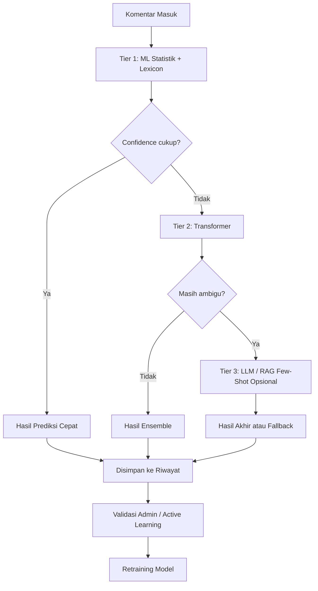

# BullyGuard ID

**BullyGuard ID** adalah sistem deteksi cyberbullying dan ujaran kebencian berbahasa Indonesia berbasis API. Project ini menggabungkan pendekatan **machine learning klasik**, **lexicon matching**, **Transformer**, dan opsi **LLM-assisted classification** untuk membantu proses moderasi konten.

> Status project: **advanced MVP / research-oriented prototype**. Sistem ini cocok untuk eksperimen, demo teknis, riset, dan pengembangan lanjutan. Untuk penggunaan production, masih diperlukan evaluasi model, hardening keamanan, monitoring, dan load testing yang lebih lengkap.

---

## Tujuan Project

Project ini dibuat untuk membantu mengklasifikasikan komentar berbahasa Indonesia ke dalam kategori yang berkaitan dengan:

- ujaran toxic,
- cyberbullying,
- komentar non-toxic,
- komentar ambigu yang perlu validasi manusia.

Sistem ini tidak dimaksudkan untuk menggantikan keputusan moderator manusia. Output model sebaiknya digunakan sebagai **alat bantu prioritisasi dan screening awal**, terutama karena konteks bahasa Indonesia, slang, sarkasme, dan variasi daerah dapat memengaruhi hasil klasifikasi.

---

## Fitur Utama

- **REST API berbasis FastAPI** untuk prediksi teks tunggal dan batch.
- **Hybrid classifier** yang menggabungkan model statistik, lexicon, Transformer, dan opsi LLM.
- **Active learning / human-in-the-loop** untuk memperbaiki data yang salah klasifikasi.
- **Dashboard frontend** berbasis React, Vite, dan Tailwind CSS.
- **PostgreSQL + Redis** untuk penyimpanan, cache, queue, dan integrasi training ulang.
- **Docker Compose** untuk menjalankan layanan pendukung secara lokal.
- **Automated test** dengan pytest dan CI pipeline.

---

## Gambaran Arsitektur



Catatan penting: confidence dari model statistik, Transformer, dan LLM tidak selalu berada pada skala yang sama. Untuk penggunaan serius, threshold dan confidence perlu dikalibrasi menggunakan validation set yang terdokumentasi.

---

## Struktur Repositori

```text
.
├── .github/                         # CI pipeline
├── cyberbullying_api/               # Backend FastAPI
│   ├── cache/                       # Cache dan log training
│   ├── classifier/                  # Core classifier, database, memory, predictor
│   ├── models/                      # File model, threshold, dan artefak ML
│   ├── routes/                      # API routes
│   ├── scraper/                     # Scraper komentar
│   ├── tests/                       # Pytest suite
│   ├── main.py                      # Entrypoint FastAPI
│   ├── retrain.py                   # Script retraining
│   └── requirements.txt             # Dependency backend
├── dataset/                         # Dataset dan data pendukung
├── frontend/                        # Frontend React + Vite
├── docker-compose.yml               # Layanan lokal: API, worker, DB, Redis, frontend
├── MODEL_EVALUATION.md              # Template dan catatan evaluasi model
├── .env.example                     # Contoh konfigurasi environment
└── README.md                        # Dokumentasi utama
```

---

## Prasyarat

Pastikan perangkat Anda memiliki:

- Python 3.10 atau lebih baru
- Node.js 18 atau lebih baru
- npm
- Docker dan Docker Compose
- Git
- Ollama, opsional, hanya jika ingin memakai fitur LLM lokal

---

## Quick Start — Local Development

### 1. Clone repository

```bash
git clone https://github.com/Maliq-dlt/indonesian-cyberbullying-detection-api.git
cd indonesian-cyberbullying-detection-api
```

### 2. Buat file environment

Salin file contoh environment:

```bash
cp .env.example .env
```

Untuk Windows PowerShell:

```powershell
Copy-Item .env.example .env
```

Sesuaikan nilai di dalam `.env`, terutama:

```env
API_KEY=change_me_to_a_long_random_secret
ENV=development
```

### 3. Jalankan database dan Redis

```bash
docker compose up -d db redis
```

### 4. Jalankan backend

```bash
cd cyberbullying_api
python -m venv .venv
```

Windows PowerShell:

```powershell
.\.venv\Scripts\Activate.ps1
```

Windows CMD:

```cmd
.venv\Scripts\activate
```

macOS/Linux:

```bash
source .venv/bin/activate
```

Install dependency:

```bash
pip install --upgrade pip
pip install -r requirements.txt
```

Jalankan API:

```bash
uvicorn main:app --reload --host 0.0.0.0 --port 8000
```

API akan tersedia di:

```text
http://localhost:8000
```

Dokumentasi Swagger biasanya tersedia di:

```text
http://localhost:8000/docs
```

### 5. Jalankan frontend

Buka terminal baru dari root project:

```bash
cd frontend
npm install
npm run dev
```

Frontend biasanya berjalan di:

```text
http://localhost:5173
```

---

## Menjalankan dengan Docker Compose

Untuk menjalankan seluruh layanan lokal:

```bash
docker compose up --build
```

Untuk menjalankan di background:

```bash
docker compose up -d --build
```

Untuk menghentikan layanan:

```bash
docker compose down
```

Untuk menghapus volume database/cache lokal:

```bash
docker compose down -v
```

---

## Contoh Request API

Sesuaikan path endpoint dengan implementasi route di backend Anda.

```bash
curl -X POST "http://localhost:8000/predict" \
  -H "Content-Type: application/json" \
  -H "X-API-Key: change_me_to_a_long_random_secret" \
  -d '{"text":"contoh komentar untuk diuji"}'
```

Jika endpoint berbeda, cek dokumentasi Swagger di `/docs`.

---

## Testing

Jalankan test backend dari root project:

```bash
pytest cyberbullying_api/tests
```

Atau dari folder backend:

```bash
cd cyberbullying_api
pytest tests
```

Jalankan lint dan build frontend:

```bash
cd frontend
npm run lint
npm run build
```

---

## Evaluasi Model

Evaluasi model harus terdokumentasi sebelum project diklaim layak production. Minimal laporan evaluasi sebaiknya mencakup:

- jumlah data,
- sumber dataset,
- distribusi label,
- metode split train/validation/test,
- metrik precision, recall, F1-score per label,
- confusion matrix,
- contoh false positive,
- contoh false negative,
- analisis error pada slang, sarkasme, kutipan, dan konteks bercanda.

Gunakan file [`MODEL_EVALUATION.md`](MODEL_EVALUATION.md) sebagai template dokumentasi evaluasi.

---

## Active Learning

Sistem active learning membantu admin memperbaiki data yang salah klasifikasi.

Alur umumnya:

1. Sistem menyimpan hasil prediksi dan confidence.
2. Admin mengecek data yang ambigu atau salah klasifikasi.
3. Admin memindahkan data ke kategori yang benar.
4. Data diberi tanda validasi.
5. Model dapat dilatih ulang menggunakan data tervalidasi.
6. Model baru dimuat ulang sesuai mekanisme backend.

Catatan: retraining sebaiknya tetap dievaluasi sebelum dipakai sebagai model utama. Jangan langsung menganggap model baru lebih baik hanya karena datanya bertambah.

---

## Batasan Sistem

Project ini masih memiliki beberapa batasan penting:

- Model dapat salah memahami sarkasme, ironi, inside joke, dan bahasa daerah.
- Kata kasar tidak selalu berarti cyberbullying; bisa muncul dalam kutipan, edukasi, atau konteks bercanda.
- Komentar halus yang merendahkan bisa lolos jika tidak memakai kata eksplisit.
- Confidence model belum tentu merepresentasikan kepastian nyata tanpa kalibrasi.
- LLM lokal bergantung pada model, prompt, resource komputer, dan kualitas contoh few-shot.
- Sistem moderasi tetap memerlukan validasi manusia pada kasus sensitif.

---

## Catatan Keamanan

Untuk deployment yang lebih aman:

- Jangan commit file `.env` ke repository.
- Gunakan API key yang panjang dan acak.
- Batasi CORS hanya ke domain frontend yang dipercaya.
- Jangan memakai credential default Docker Compose di production.
- Aktifkan HTTPS di reverse proxy.
- Gunakan secret manager atau environment variable dari platform deployment.
- Monitor error, request rate, dan penggunaan endpoint admin.

---

## Roadmap Perbaikan

Prioritas berikutnya:

- [ ] Dokumentasi evaluasi model lengkap.
- [ ] Confusion matrix dan error analysis.
- [ ] Threshold tuning dan calibration report.
- [ ] Hardening autentikasi dan authorization.
- [ ] Refactor Docker Compose agar tidak hard-code credential.
- [ ] Observability: structured logging, metrics, health check.
- [ ] Refactor frontend component besar menjadi komponen kecil.
- [ ] Load testing untuk klaim performa.

---

## Lisensi

Project ini menggunakan lisensi MIT. Lihat file [`LICENSE`](LICENSE) untuk detail.

---

## Disclaimer

BullyGuard ID adalah alat bantu deteksi awal. Hasil prediksi tidak boleh dijadikan satu-satunya dasar pengambilan keputusan yang berdampak serius terhadap pengguna tanpa pemeriksaan manusia dan prosedur banding yang jelas.
